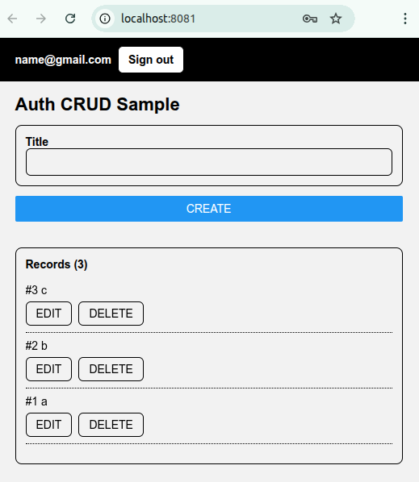

# [Shout and Movement](https://github.com/europanite/standard_react_fastapi_environment "Shout and Movement")

英単語を話して、コマンド入力し、キャラクターを動かす。モデルはFire and Movementである。2人の魔法少女がキャラクターが交互に敵を制圧しながら、縦長の世界を前進し、敵を倒していく。日本人が苦手な発音を使いわけることを目的としている。


## Commands
- Forward
- Back
- Right
- Left
- Light
- Play
- Pray
- Stay
- Stop
- Run
- Learn
- Lock
- Rock
- etc

[](https://github.com/europanite/standard_react_fastapi_environment/actions/workflows/ci.yml)
[](https://github.com/europanite/standard_react_fastapi_environment/actions/workflows/lint.yml)
[](https://github.com/europanite/standard_react_fastapi_environment/actions/workflows/pages/pages-build-deployment)
[](https://github.com/europanite/standard_react_fastapi_environment/actions/workflows/codeql.yml)



**full-stack development environment** using:
- **Vite**: [Vite](https://vite.dev/) 
- **Phaser**: [Phaser](https://phaser.io/) 
- **Frontend**: [Expo](https://expo.dev/) (React Native + TypeScript)  
  - Runs on **Web, Android, and iOS** with a single codebase
- **Backend**: [FastAPI](https://fastapi.tiangolo.com/) (Python)  
- **Database**: [PostgreSQL](https://www.postgresql.org/)
- **Container**: [Docker Compose](https://docs.docker.com/compose/) for consistent development setup

---

## Features

- **Cross-platform frontend** with Expo  
  - Runs as a **web app** or on **Android/iOS devices** via Expo Go or standalone builds
- **CRUD operations** : Create, Read, Update, Delete records
- **Auth operations** : Signup, Signin, Signout
- **FastAPI backend** with automatic docs at [/docs](http://localhost:8000/docs)  
  - REST API with Swagger UI (/docs)

---

## 📦 Services

- **backend**: FastAPI + SQLAlchemy  
  - Port: `8000`  
  - API Docs: [http://localhost:8000/docs](http://localhost:8000/docs)

- **frontend**: React Native (Expo Web)  
  - Port: `8081`  
  - Web UI: [http://localhost:8081](http://localhost:8081)

- **db**: PostgreSQL  
  - Port: `5432`  

---

## 🚀 Getting Started

### 1. Prerequisites
- Docker & Docker Compose
- Expo Go app (for Android/iOS testing)

### 2. Build and start all services:

```bash
# set environment variables:
export REACT_NATIVE_PACKAGER_HOSTNAME=192.168.3.6

# Build the image
docker compose build

# Run the container
docker compose up
```

### 3. Visit the services:

- Backend API: http://localhost:8000/docs


- Frontend UI (WEB): http://localhost:8081
- Frontend UI (mobile): exp://${YOUR_HOST}:8081: access it with the QR provided by Expo.


---