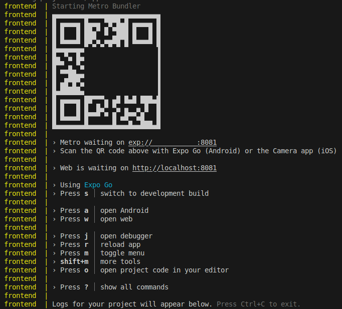

# [Magic and Movement](https://github.com/europanite/magic_and_movement "Magic and Movement")

Speak commands to control your character.

One magical girl shoots enemies and advance through a world.
<!-- Two magical girls take turns suppressing enemies as they advance through a world. -->
<!-- The gameplay model is based on Fire and Movement.  -->

## Commands
| command | description | implement |
| :--- | :--- | :--- |
| Forward | go forward | done | 
| Back | go back | done | 
| Right | go right | done | 
| Left | go left | done | 
| Walk | go | | 
| Work | | | 
| Light | light up the stage | | 
| Play | | | 
| Pray | ? | | 
| Lay | lay down | | 
| Stay |  | | 
| dig | dig a hole | | 
| Stop | stop | done | 
| Run | move fast | | 
| Learn | ? | | 
| Shoot | shoot | | 
| Rock | | |
| Lock | | | 
| Barrage | | | 
| Enemy name | shoot the enemy | done | 
| Rock name | move to the rock | done | 

etc

**full-stack development environment** using:
- **Vite**: [Vite](https://vite.dev/) 
- **Phaser**: [Phaser](https://phaser.io/) 
- **Frontend**: [Expo](https://expo.dev/) (React Native + TypeScript)  
  - Runs on **Web, Android, and iOS** with a single codebase
- **Backend**: [FastAPI](https://fastapi.tiangolo.com/) (Python)  
- **Database**: [PostgreSQL](https://www.postgresql.org/)
- **Container**: [Docker Compose](https://docs.docker.com/compose/) for consistent development setup

---

## Features

- **Cross-platform frontend** with Expo  
  - Runs as a **web app** or on **Android/iOS devices** via Expo Go or standalone builds
- **CRUD operations** : Create, Read, Update, Delete records
- **Auth operations** : Signup, Signin, Signout
- **FastAPI backend** with automatic docs at [/docs](http://localhost:8000/docs)  
  - REST API with Swagger UI (/docs)

---

## 📦 Services

- **backend**: FastAPI + SQLAlchemy  
  - Port: `8000`  
  - API Docs: [http://localhost:8000/docs](http://localhost:8000/docs)

- **frontend**: React Native (Expo Web)  
  - Port: `8081`  
  - Web UI: [http://localhost:8081](http://localhost:8081)

- **db**: PostgreSQL  
  - Port: `5432`  

---

## 🚀 Getting Started

### 1. Prerequisites
- Docker & Docker Compose
- Expo Go app (for Android/iOS testing)

### 2. Build and start all services:

```bash
# set environment variables:
export REACT_NATIVE_PACKAGER_HOSTNAME=${YOUR_HOST}

# Build the image
docker compose build

# Run the container
docker compose up
```

### 3. Visit the services:

- Backend API: http://localhost:8000/docs


- Frontend UI (WEB): http://localhost:8081
- Frontend UI (mobile): exp://${YOUR_HOST}:8081: access it with the QR provided by Expo.


---