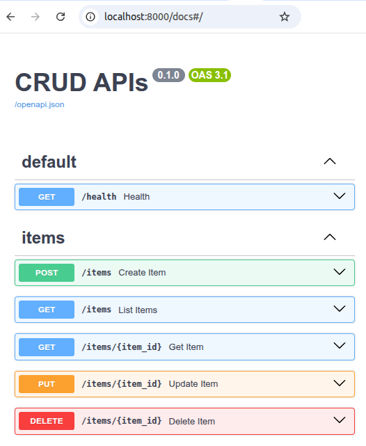
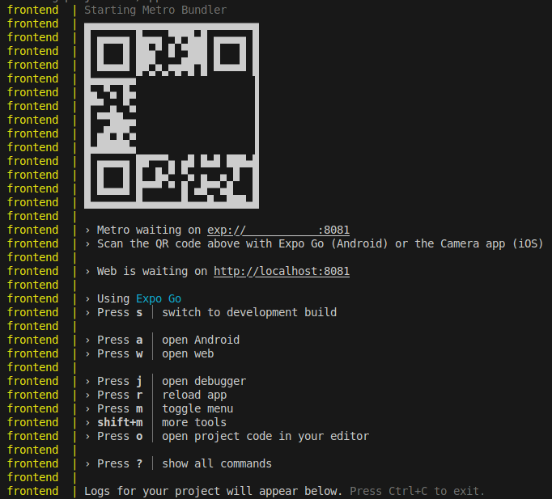

<!-- P2M_REPORT -->
<!-- GENERATED at 2025-10-21 14:54:45 -->
# Project Export: magic_and_movement

## Overview

- Root: `/home/skinner/magic_and_movement`
- Files: **1296**
- Total size: **3073031766 bytes**
- Total LOC: 6116 | SLOC: 4999 | TODOs: 1

### Language mix
- plain: 1199
- typescript: 35
- python: 14
- tsx: 12
- markdown: 9
- javascript: 6
- yaml: 4
- json: 4
- dockerfile: 3
- sql: 3
- html: 2
- ini: 2
- toml: 1
- xml: 1
- css: 1

### Top 12 largest files (bytes)
- `mat/maou_bgm_karaoke.zip` — 361210179 bytes
- `mat/maou_game.zip` — 330175955 bytes
- `mat/maou_bgm_neorock.zip` — 153463830 bytes
- `mat/maou_bgm_piano.zip` — 116421811 bytes
- `mat/maou_bgm_acoustic.zip` — 115321726 bytes
- `mat/maou_bgm_cyber.zip` — 106803561 bytes
- `mat/maou_bgm_8bit.zip` — 70669323 bytes
- `mat/maou_bgm_healing.zip` — 66430185 bytes
- `mat/maou_bgm_ethnic.zip` — 66382135 bytes
- `mat/maou_bgm_orchestra.zip` — 64757780 bytes
- `mat/maou_bgm_fantasy.zip` — 33853883 bytes
- `mat/maou_se.zip` — 15399513 bytes

### Top 12 longest files (LOC)
- `vite/app/src/scenes/EscapeScene01.ts` — 472 LOC
- `vite/app/src/scenes/MainScene01.ts` — 460 LOC
- `vite/app/src/entities/Friendly.ts` — 330 LOC
- `vite/app/src/scenes/TitleScene.ts` — 260 LOC
- `frontend/app/screens/HomeScreen.tsx` — 244 LOC
- `backend/reports/ci/coverage.xml` — 230 LOC
- `vite/app/src/entities/Character.ts` — 212 LOC
- `vite/app/src/entities/Bullet.ts` — 185 LOC
- `vite/app/src/entities/Chaser.ts` — 175 LOC
- `vite/app/src/commands/CommandParser.ts` — 152 LOC
- `vite/app/src/entities/Base.ts` — 141 LOC
- `vite/app/src/scenes/OptionScene.ts` — 123 LOC

### Project tree (included subset)
```
magic_and_movement/
├── .github/
│   ├── ISSUE_TEMPLATE/
│   │   └── bug_report.md
│   ├── workflows/
│   │   └── pages.yml
│   └── pull_request_template.md
├── backend/
│   ├── app/
│   │   ├── routers/
│   │   │   ├── auth.py
│   │   │   └── items.py
│   │   ├── .coverage
│   │   ├── database.py
│   │   ├── main.py
│   │   ├── models.py
│   │   ├── pytest.ini
│   │   ├── schemas.py
│   │   └── security.py
│   ├── reports/
│   │   └── ci/
│   │       └── coverage.xml
│   ├── tests/
│   │   ├── conftest.py
│   │   ├── test_auth.py
│   │   ├── test_auth_extra.py
│   │   ├── test_health.py
│   │   ├── test_items.py
│   │   ├── test_openapi.py
│   │   └── test_smoke.py
│   ├── Dockerfile
│   ├── Dockerfile.test
│   ├── pyproject.toml
│   ├── pytest.ini
│   ├── requirements.test.txt
│   └── requirements.txt
├── db/
│   └── init/
│       ├── 00_app_role_db.sql
│       ├── 01_schema_ext.sql
│       └── 02_ping.sql
├── frontend/
│   ├── app/
│   │   ├── .expo/
│   │   │   ├── devices.json
│   │   │   └── README.md
│   │   ├── __mocks__/
│   │   │   ├── expoConstantsMock.js
│   │   │   ├── expoMock.js
│   │   │   └── expoRouterMock.js
│   │   ├── __tests__/
│   │   │   ├── auth.context.test.tsx
│   │   │   ├── home.screen.test.tsx
│   │   │   ├── settingsbar.test.tsx
│   │   │   ├── signin.screen.test.tsx
│   │   │   ├── signup.screen.test.tsx
│   │   │   └── smoke.test.tsx
│   │   ├── components/
│   │   │   └── SettingsBar.tsx
│   │   ├── context/
│   │   │   └── Auth.tsx
│   │   ├── screens/
│   │   │   ├── HomeScreen.tsx
│   │   │   ├── SignInScreen.tsx
│   │   │   └── SignUpScreen.tsx
│   │   ├── .gitignore
│   │   ├── app.json
│   │   ├── App.tsx
│   │   ├── babel.config.js
│   │   ├── index.ts
│   │   ├── jest.config.ts
│   │   ├── jest.setup.ts
│   │   ├── jest.setupFiles.js
│   │   ├── metro.config.js
│   │   └── tsconfig.json
│   ├── Dockerfile
│   └── Dockerfile.test
├── mat/
│   ├── maou_bgm_8bit/
│   │   ├── maou_bgm_8bit01.mp3
│   │   ├── maou_bgm_8bit02.mp3
│   │   ├── maou_bgm_8bit03.mp3
│   │   ├── maou_bgm_8bit04.mp3
│   │   ├── maou_bgm_8bit05.mp3
│   │   ├── maou_bgm_8bit06.mp3
│   │   ├── maou_bgm_8bit07.mp3
│   │   ├── maou_bgm_8bit08.mp3
│   │   ├── maou_bgm_8bit09.mp3
│   │   ├── maou_bgm_8bit10.mp3
│   │   ├── maou_bgm_8bit11.mp3
│   │   ├── maou_bgm_8bit12.mp3
│   │   ├── maou_bgm_8bit13.mp3
│   │   ├── maou_bgm_8bit14.mp3
│   │   ├── maou_bgm_8bit15.mp3
│   │   ├── maou_bgm_8bit16.mp3
│   │   ├── maou_bgm_8bit17.mp3
│   │   ├── maou_bgm_8bit18.mp3
│   │   ├── maou_bgm_8bit19.mp3
│   │   ├── maou_bgm_8bit20.mp3
│   │   ├── maou_bgm_8bit21.mp3
│   │   ├── maou_bgm_8bit22.mp3
│   │   ├── maou_bgm_8bit23.mp3
│   │   ├── maou_bgm_8bit24.mp3
│   │   ├── maou_bgm_8bit25.mp3
│   │   ├── maou_bgm_8bit26.mp3
│   │   ├── maou_bgm_8bit27.mp3
│   │   ├── maou_bgm_8bit28.mp3
│   │   ├── maou_bgm_8bit29.mp3
│   │   └── ûéëñì░é╠ùÿùpïKû±.pdf
│   ├── maou_bgm_acoustic/
│   │   ├── maou_bgm_acoustic01.mp3
│   │   ├── maou_bgm_acoustic01b.mp3
│   │   ├── maou_bgm_acoustic02.mp3
│   │   ├── maou_bgm_acoustic03.mp3
│   │   ├── maou_bgm_acoustic04.mp3
│   │   ├── maou_bgm_acoustic05.mp3
│   │   ├── maou_bgm_acoustic06.mp3
│   │   ├── maou_bgm_acoustic07.mp3
│   │   ├── maou_bgm_acoustic08.mp3
│   │   ├── maou_bgm_acoustic09.mp3
│   │   ├── maou_bgm_acoustic10.mp3
│   │   ├── maou_bgm_acoustic11.mp3
│   │   ├── maou_bgm_acoustic12.mp3
│   │   ├── maou_bgm_acoustic13.mp3
│   │   ├── maou_bgm_acoustic14.mp3
│   │   ├── maou_bgm_acoustic15.mp3
│   │   ├── maou_bgm_acoustic16.mp3
│   │   ├── maou_bgm_acoustic17.mp3
│   │   ├── maou_bgm_acoustic18.mp3
│   │   ├── maou_bgm_acoustic19.mp3
│   │   ├── maou_bgm_acoustic20.mp3
│   │   ├── maou_bgm_acoustic21.mp3
│   │   ├── maou_bgm_acoustic22.mp3
│   │   ├── maou_bgm_acoustic23.mp3
│   │   ├── maou_bgm_acoustic24.mp3
│   │   ├── maou_bgm_acoustic25.mp3
│   │   ├── maou_bgm_acoustic26.mp3
│   │   ├── maou_bgm_acoustic27.mp3
│   │   ├── maou_bgm_acoustic28.mp3
│   │   ├── maou_bgm_acoustic29.mp3
│   │   ├── maou_bgm_acoustic30.mp3
│   │   ├── maou_bgm_acoustic31.mp3
│   │   ├── maou_bgm_acoustic32.mp3
│   │   ├── maou_bgm_acoustic33.mp3
│   │   ├── maou_bgm_acoustic34.mp3
│   │   ├── maou_bgm_acoustic35.mp3
│   │   ├── maou_bgm_acoustic36.mp3
│   │   ├── maou_bgm_acoustic37.mp3
│   │   ├── maou_bgm_acoustic38.mp3
│   │   ├── maou_bgm_acoustic39.mp3
│   │   ├── maou_bgm_acoustic40.mp3
│   │   ├── maou_bgm_acoustic41.mp3
│   │   ├── maou_bgm_acoustic42.mp3
│   │   ├── maou_bgm_acoustic43.mp3
│   │   ├── maou_bgm_acoustic44.mp3
│   │   ├── maou_bgm_acoustic45.mp3
│   │   ├── maou_bgm_acoustic46.mp3
│   │   ├── maou_bgm_acoustic47.mp3
│   │   ├── maou_bgm_acoustic48.mp3
│   │   ├── maou_bgm_acoustic49.mp3
│   │   ├── maou_bgm_acoustic50.mp3
│   │   ├── maou_bgm_acoustic51.mp3
│   │   ├── maou_bgm_acoustic52.mp3
│   │   ├── maou_bgm_acoustic53.mp3
│   │   ├── maou_bgm_acoustic54.mp3
│   │   └── ûéëñì░é╠ùÿùpïKû±.pdf
│   ├── maou_bgm_cyber/
│   │   ├── maou_bgm_cyber01.mp3
│   │   ├── maou_bgm_cyber02.mp3
│   │   ├── maou_bgm_cyber03.mp3
│   │   ├── maou_bgm_cyber04.mp3
│   │   ├── maou_bgm_cyber05.mp3
│   │   ├── maou_bgm_cyber06.mp3
│   │   ├── maou_bgm_cyber07.mp3
│   │   ├── maou_bgm_cyber07b.mp3
│   │   ├── maou_bgm_cyber08.mp3
│   │   ├── maou_bgm_cyber09.mp3
│   │   ├── maou_bgm_cyber10.mp3
│   │   ├── maou_bgm_cyber11.mp3
│   │   ├── maou_bgm_cyber12.mp3
│   │   ├── maou_bgm_cyber13.mp3
│   │   ├── maou_bgm_cyber14.mp3
│   │   ├── maou_bgm_cyber15.mp3
│   │   ├── maou_bgm_cyber16.mp3
│   │   ├── maou_bgm_cyber17.mp3
│   │   ├── maou_bgm_cyber18.mp3
│   │   ├── maou_bgm_cyber19.mp3
│   │   ├── maou_bgm_cyber20.mp3
│   │   ├── maou_bgm_cyber21.mp3
│   │   ├── maou_bgm_cyber22.mp3
│   │   ├── maou_bgm_cyber23.mp3
│   │   ├── maou_bgm_cyber24.mp3
│   │   ├── maou_bgm_cyber25.mp3
│   │   ├── maou_bgm_cyber26.mp3
│   │   ├── maou_bgm_cyber27.mp3
│   │   ├── maou_bgm_cyber28.mp3
│   │   ├── maou_bgm_cyber29.mp3
│   │   ├── maou_bgm_cyber30.mp3
│   │   ├── maou_bgm_cyber31.mp3
│   │   ├── maou_bgm_cyber32.mp3
│   │   ├── maou_bgm_cyber33.mp3
│   │   ├── maou_bgm_cyber34.mp3
│   │   ├── maou_bgm_cyber35.mp3
│   │   ├── maou_bgm_cyber36.mp3
│   │   ├── maou_bgm_cyber37.mp3
│   │   ├── maou_bgm_cyber38.mp3
│   │   ├── maou_bgm_cyber39.mp3
│   │   ├── maou_bgm_cyber40.mp3
│   │   ├── maou_bgm_cyber41.mp3
│   │   ├── maou_bgm_cyber42.mp3
│   │   ├── maou_bgm_cyber43.mp3
│   │   ├── maou_bgm_cyber44.mp3
│   │   ├── maou_bgm_cyber45.mp3
│   │   └── ûéëñì░é╠ùÿùpïKû±.pdf
│   ├── maou_bgm_ethnic/
│   │   ├── maou_bgm_ethnic01.mp3
│   │   ├── maou_bgm_ethnic02.mp3
│   │   ├── maou_bgm_ethnic03.mp3
│   │   ├── maou_bgm_ethnic04.mp3
│   │   ├── maou_bgm_ethnic05.mp3
│   │   ├── maou_bgm_ethnic06.mp3
│   │   ├── maou_bgm_ethnic07.mp3
│   │   ├── maou_bgm_ethnic08.mp3
│   │   ├── maou_bgm_ethnic09.mp3
│   │   ├── maou_bgm_ethnic09b.mp3
│   │   ├── maou_bgm_ethnic10.mp3
│   │   ├── maou_bgm_ethnic11.mp3
│   │   ├── maou_bgm_ethnic12.mp3
│   │   ├── maou_bgm_ethnic13.mp3
│   │   ├── maou_bgm_ethnic14.mp3
│   │   ├── maou_bgm_ethnic15.mp3
│   │   ├── maou_bgm_ethnic16.mp3
│   │   ├── maou_bgm_ethnic17.mp3
│   │   ├── maou_bgm_ethnic18.mp3
│   │   ├── maou_bgm_ethnic19.mp3
│   │   ├── maou_bgm_ethnic20.mp3
│   │   ├── maou_bgm_ethnic21.mp3
│   │   ├── maou_bgm_ethnic22.mp3
│   │   ├── maou_bgm_ethnic23.mp3
│   │   ├── maou_bgm_ethnic24.mp3
│   │   ├── maou_bgm_ethnic25.mp3
│   │   ├── maou_bgm_ethnic26.mp3
│   │   ├── maou_bgm_ethnic27.mp3
│   │   ├── maou_bgm_ethnic28.mp3
│   │   ├── maou_bgm_ethnic29.mp3
│   │   ├── maou_bgm_ethnic30.mp3
│   │   ├── maou_bgm_ethnic31.mp3
│   │   ├── maou_bgm_ethnic32.mp3
│   │   ├── maou_bgm_ethnic33.mp3
│   │   └── ûéëñì░é╠ùÿùpïKû±.pdf
│   ├── maou_bgm_fantasy/
│   │   ├── maou_bgm_fantasy01.mp3
│   │   ├── maou_bgm_fantasy02.mp3
│   │   ├── maou_bgm_fantasy03.mp3
│   │   ├── maou_bgm_fantasy04.mp3
│   │   ├── maou_bgm_fantasy05.mp3
│   │   ├── maou_bgm_fantasy06.mp3
│   │   ├── maou_bgm_fantasy07.mp3
│   │   ├── maou_bgm_fantasy08.mp3
│   │   ├── maou_bgm_fantasy09.mp3
│   │   ├── maou_bgm_fantasy10.mp3
│   │   ├── maou_bgm_fantasy11.mp3
│   │   ├── maou_bgm_fantasy12.mp3
│   │   ├── maou_bgm_fantasy13.mp3
│   │   ├── maou_bgm_fantasy14.mp3
│   │   ├── maou_bgm_fantasy15.mp3
│   │   └── ûéëñì░é╠ùÿùpïKû±.pdf
│   ├── maou_bgm_healing/
│   │   ├── maou_bgm_healing01.mp3
│   │   ├── maou_bgm_healing02.mp3
│   │   ├── maou_bgm_healing03.mp3
│   │   ├── maou_bgm_healing04.mp3
│   │   ├── maou_bgm_healing05.mp3
│   │   ├── maou_bgm_healing06.mp3
│   │   ├── maou_bgm_healing07.mp3
│   │   ├── maou_bgm_healing08.mp3
│   │   ├── maou_bgm_healing09.mp3
│   │   ├── maou_bgm_healing10.mp3
│   │   ├── maou_bgm_healing11.mp3
│   │   ├── maou_bgm_healing11b.mp3
│   │   ├── maou_bgm_healing12.mp3
│   │   ├── maou_bgm_healing12b.mp3
│   │   ├── maou_bgm_healing13.mp3
│   │   ├── maou_bgm_healing14.mp3
│   │   ├── maou_bgm_healing14b.mp3
│   │   ├── maou_bgm_healing15.mp3
│   │   ├── maou_bgm_healing16.mp3
│   │   ├── maou_bgm_healing17.mp3
│   │   └── ûéëñì░é╠ùÿùpïKû±.pdf
│   ├── maou_bgm_karaoke/
│   │   ├── maou_bgm_inst_karaoke_01_flower.mp3
│   │   ├── maou_bgm_inst_karaoke_02_my_lover.mp3
│   │   ├── maou_bgm_inst_karaoke_03_rhapsody.mp3
│   │   ├── maou_bgm_inst_karaoke_04_memories.mp3
│   │   ├── maou_bgm_inst_karaoke_05_love_wind.mp3
│   │   ├── maou_bgm_inst_karaoke_06_winter_road.mp3
│   │   ├── maou_bgm_inst_karaoke_07_eonsfinal.mp3
│   │   ├── maou_bgm_inst_karaoke_08_neoxmas.mp3
│   │   ├── maou_bgm_inst_karaoke_09_lovething.mp3
│   │   ├── maou_bgm_inst_karaoke_10_drive.mp3
│   │   ├── maou_bgm_inst_karaoke_11_farewell.mp3
│   │   ├── maou_bgm_inst_karaoke_12_tokino_kanatahe.mp3
│   │   ├── maou_bgm_inst_karaoke_13_smile_and_smile.mp3
│   │   ├── maou_bgm_inst_karaoke_14_delvge.mp3
│   │   ├── maou_bgm_inst_karaoke_15_raintable.mp3
│   │   ├── maou_bgm_inst_karaoke_16_hearteve.mp3
│   │   ├── maou_bgm_inst_karaoke_17_forever_truth.mp3
│   │   ├── maou_bgm_inst_karaoke_18_karano_kioku.mp3
│   │   ├── maou_bgm_inst_karaoke_19_l.d.s.mp3
│   │   ├── maou_bgm_inst_karaoke_20_tsubasa.mp3
│   │   ├── maou_bgm_inst_karaoke_21_lapislazuli.mp3
│   │   ├── maou_bgm_inst_karaoke_22_ixia.mp3
│   │   ├── maou_bgm_inst_karaoke_23_avenue.mp3
│   │   ├── maou_bgm_inst_karaoke_24_belling_together.mp3
│   │   ├── maou_bgm_inst_karaoke_25_santa.mp3
│   │   ├── maou_bgm_inst_karaoke_26_candle_night.mp3
│   │   ├── maou_bgm_inst_karaoke_27_bearing_tree.mp3
│   │   ├── maou_bgm_inst_karaoke_28_nerine.mp3
│   │   ├── maou_bgm_inst_karaoke_29_ambasa.mp3
│   │   ├── maou_bgm_inst_karaoke_30_toge.mp3
│   │   ├── maou_bgm_inst_karaoke_31_together.mp3
│   │   ├── maou_bgm_inst_karaoke_32_grandiflora.mp3
│   │   ├── maou_bgm_karaoke_01_flower.mp3
│   │   ├── maou_bgm_karaoke_02_my_lover.mp3
│   │   ├── maou_bgm_karaoke_03_rhapsody.mp3
│   │   ├── maou_bgm_karaoke_04_memories.mp3
│   │   ├── maou_bgm_karaoke_05_love_wind.mp3
│   │   ├── maou_bgm_karaoke_06_winter_road.mp3
│   │   ├── maou_bgm_karaoke_07_eonsfinal.mp3
│   │   ├── maou_bgm_karaoke_08_neoxmas.mp3
│   │   ├── maou_bgm_karaoke_09_lovething.mp3
│   │   ├── maou_bgm_karaoke_10_drive.mp3
│   │   ├── maou_bgm_karaoke_11_farewell.mp3
│   │   ├── maou_bgm_karaoke_12_tokino_kanatahe.mp3
│   │   ├── maou_bgm_karaoke_13_smile_and_smile.mp3
│   │   ├── maou_bgm_karaoke_14_delvge.mp3
│   │   ├── maou_bgm_karaoke_15_raintable.mp3
│   │   ├── maou_bgm_karaoke_16_hearteve.mp3
│   │   ├── maou_bgm_karaoke_17_forever_truth.mp3
│   │   ├── maou_bgm_karaoke_18_karano_kioku.mp3
│   │   ├── maou_bgm_karaoke_19_l.d.s.mp3
│   │   ├── maou_bgm_karaoke_20_tsubasa.mp3
│   │   ├── maou_bgm_karaoke_21_lapislazuli.mp3
│   │   ├── maou_bgm_karaoke_22_ixia.mp3
│   │   ├── maou_bgm_karaoke_23_avenue.mp3
│   │   ├── maou_bgm_karaoke_24_belling_together.mp3
│   │   ├── maou_bgm_karaoke_25_santa.mp3
│   │   ├── maou_bgm_karaoke_26_candle_night.mp3
│   │   ├── maou_bgm_karaoke_27_bearing_tree.mp3
│   │   ├── maou_bgm_karaoke_28_nerine.mp3
│   │   ├── maou_bgm_karaoke_29_ambasa.mp3
│   │   ├── maou_bgm_karaoke_30_toge.mp3
│   │   ├── maou_bgm_karaoke_31_together.mp3
│   │   ├── maou_bgm_karaoke_32_grandiflora.mp3
│   │   └── ûéëñì░é╠ùÿùpïKû±.pdf
│   ├── maou_bgm_neorock/
│   │   ├── maou_bgm_neorock01.mp3
│   │   ├── maou_bgm_neorock02.mp3
│   │   ├── maou_bgm_neorock03.mp3
│   │   ├── maou_bgm_neorock04.mp3
│   │   ├── maou_bgm_neorock05.mp3
│   │   ├── maou_bgm_neorock06.mp3
│   │   ├── maou_bgm_neorock07.mp3
│   │   ├── maou_bgm_neorock08.mp3
│   │   ├── maou_bgm_neorock09.mp3
│   │   ├── maou_bgm_neorock10.mp3
│   │   ├── maou_bgm_neorock11.mp3
│   │   ├── maou_bgm_neorock12.mp3
│   │   ├── maou_bgm_neorock13.mp3
│   │   ├── maou_bgm_neorock14.mp3
│   │   ├── maou_bgm_neorock15.mp3
│   │   ├── maou_bgm_neorock16.mp3
│   │   ├── maou_bgm_neorock17.mp3
│   │   ├── maou_bgm_neorock18.mp3
│   │   ├── maou_bgm_neorock19.mp3
│   │   ├── maou_bgm_neorock20.mp3
│   │   ├── maou_bgm_neorock21.mp3
│   │   ├── maou_bgm_neorock22.mp3
│   │   ├── maou_bgm_neorock23.mp3
│   │   ├── maou_bgm_neorock24.mp3
│   │   ├── maou_bgm_neorock25.mp3
│   │   ├── maou_bgm_neorock26.mp3
│   │   ├── maou_bgm_neorock27.mp3
│   │   ├── maou_bgm_neorock28.mp3
│   │   ├── maou_bgm_neorock29.mp3
│   │   ├── maou_bgm_neorock30.mp3
│   │   ├── maou_bgm_neorock31.mp3
│   │   ├── maou_bgm_neorock32.mp3
│   │   ├── maou_bgm_neorock33.mp3
│   │   ├── maou_bgm_neorock34.mp3
│   │   ├── maou_bgm_neorock35.mp3
│   │   ├── maou_bgm_neorock36.mp3
│   │   ├── maou_bgm_neorock37.mp3
│   │   ├── maou_bgm_neorock38.mp3
│   │   ├── maou_bgm_neorock39.mp3
│   │   ├── maou_bgm_neorock40.mp3
│   │   ├── maou_bgm_neorock41.mp3
│   │   ├── maou_bgm_neorock42.mp3
│   │   ├── maou_bgm_neorock43.mp3
│   │   ├── maou_bgm_neorock44.mp3
│   │   ├── maou_bgm_neorock45.mp3
│   │   ├── maou_bgm_neorock46.mp3
│   │   ├── maou_bgm_neorock47.mp3
│   │   ├── maou_bgm_neorock48.mp3
│   │   ├── maou_bgm_neorock49.mp3
│   │   ├── maou_bgm_neorock50.mp3
│   │   ├── maou_bgm_neorock51.mp3
│   │   ├── maou_bgm_neorock52.mp3
│   │   ├── maou_bgm_neorock53.mp3
│   │   ├── maou_bgm_neorock54.mp3
│   │   ├── maou_bgm_neorock55.mp3
│   │   ├── maou_bgm_neorock56.mp3
│   │   ├── maou_bgm_neorock57.mp3
│   │   ├── maou_bgm_neorock58.mp3
│   │   ├── maou_bgm_neorock58_novoice.mp3
│   │   ├── maou_bgm_neorock59.mp3
│   │   ├── maou_bgm_neorock60.mp3
│   │   ├── maou_bgm_neorock61.mp3
│   │   ├── maou_bgm_neorock62.mp3
│   │   ├── maou_bgm_neorock63.mp3
│   │   ├── maou_bgm_neorock64.mp3
│   │   ├── maou_bgm_neorock65.mp3
│   │   ├── maou_bgm_neorock66.mp3
│   │   ├── maou_bgm_neorock67.mp3
│   │   ├── maou_bgm_neorock68.mp3
│   │   ├── maou_bgm_neorock69.mp3
│   │   ├── maou_bgm_neorock70.mp3
│   │   ├── maou_bgm_neorock71.mp3
│   │   ├── maou_bgm_neorock71b.mp3
│   │   ├── maou_bgm_neorock72.mp3
│   │   ├── maou_bgm_neorock73.mp3
│   │   ├── maou_bgm_neorock74.mp3
│   │   ├── maou_bgm_neorock75.mp3
│   │   ├── maou_bgm_neorock76.mp3
│   │   ├── maou_bgm_neorock77.mp3
│   │   ├── maou_bgm_neorock78.mp3
│   │   ├── maou_bgm_neorock79.mp3
│   │   ├── maou_bgm_neorock80.mp3
│   │   ├── maou_bgm_neorock81.mp3
│   │   ├── maou_bgm_neorock82.mp3
│   │   ├── maou_bgm_neorock83.mp3
│   │   └── ûéëñì░é╠ùÿùpïKû±.pdf
│   ├── maou_bgm_orchestra/
│   │   ├── maou_bgm_orchestra01.mp3
│   │   ├── maou_bgm_orchestra02.mp3
│   │   ├── maou_bgm_orchestra03.mp3
│   │   ├── maou_bgm_orchestra04.mp3
│   │   ├── maou_bgm_orchestra05.mp3
│   │   ├── maou_bgm_orchestra06.mp3
│   │   ├── maou_bgm_orchestra07.mp3
│   │   ├── maou_bgm_orchestra08.mp3
│   │   ├── maou_bgm_orchestra09.mp3
│   │   ├── maou_bgm_orchestra10.mp3
│   │   ├── maou_bgm_orchestra11.mp3
│   │   ├── maou_bgm_orchestra12.mp3
│   │   ├── maou_bgm_orchestra13.mp3
│   │   ├── maou_bgm_orchestra14.mp3
│   │   ├── maou_bgm_orchestra15.mp3
│   │   ├── maou_bgm_orchestra16.mp3
│   │   ├── maou_bgm_orchestra17.mp3
│   │   ├── maou_bgm_orchestra18.mp3
│   │   ├── maou_bgm_orchestra19.mp3
│   │   ├── maou_bgm_orchestra20.mp3
│   │   ├── maou_bgm_orchestra21.mp3
│   │   ├── maou_bgm_orchestra22.mp3
│   │   ├── maou_bgm_orchestra23.mp3
│   │   ├── maou_bgm_orchestra24.mp3
│   │   ├── maou_bgm_orchestra25.mp3
│   │   ├── maou_bgm_orchestra26.mp3
│   │   ├── maou_bgm_orchestra_sinfonia01.mp3
│   │   └── ûéëñì░é╠ùÿùpïKû±.pdf
│   ├── maou_bgm_piano/
│   │   ├── maou_bgm_piano01.mp3
│   │   ├── maou_bgm_piano02.mp3
│   │   ├── maou_bgm_piano03.mp3
│   │   ├── maou_bgm_piano04.mp3
│   │   ├── maou_bgm_piano05.mp3
│   │   ├── maou_bgm_piano06.mp3
│   │   ├── maou_bgm_piano07.mp3
│   │   ├── maou_bgm_piano08.mp3
│   │   ├── maou_bgm_piano09.mp3
│   │   ├── maou_bgm_piano10.mp3
│   │   ├── maou_bgm_piano11.mp3
│   │   ├── maou_bgm_piano12.mp3
│   │   ├── maou_bgm_piano13.mp3
│   │   ├── maou_bgm_piano14.mp3
│   │   ├── maou_bgm_piano15.mp3
│   │   ├── maou_bgm_piano16.mp3
│   │   ├── maou_bgm_piano17.mp3
│   │   ├── maou_bgm_piano18.mp3
│   │   ├── maou_bgm_piano19.mp3
│   │   ├── maou_bgm_piano20.mp3
│   │   ├── maou_bgm_piano21.mp3
│   │   ├── maou_bgm_piano22.mp3
│   │   ├── maou_bgm_piano23.mp3
│   │   ├── maou_bgm_piano24.mp3
│   │   ├── maou_bgm_piano25.mp3
│   │   ├── maou_bgm_piano26.mp3
│   │   ├── maou_bgm_piano27.mp3
│   │   ├── maou_bgm_piano28.mp3
│   │   ├── maou_bgm_piano29.mp3
│   │   ├── maou_bgm_piano30.mp3
│   │   ├── maou_bgm_piano31.mp3
│   │   ├── maou_bgm_piano32.mp3
│   │   ├── maou_bgm_piano33.mp3
│   │   ├── maou_bgm_piano34.mp3
│   │   ├── maou_bgm_piano35.mp3
│   │   ├── maou_bgm_piano36.mp3
│   │   ├── maou_bgm_piano37.mp3
│   │   ├── maou_bgm_piano38.mp3
│   │   ├── maou_bgm_piano39.mp3
│   │   ├── maou_bgm_piano40.mp3
│   │   ├── maou_bgm_piano41.mp3
│   │   ├── maou_bgm_piano_sinfonia01.mp3
│   │   ├── maou_bgm_piano_sinfonia02.mp3
│   │   ├── maou_bgm_piano_song_ahurera.mp3
│   │   ├── maou_bgm_piano_song_calendula.mp3
│   │   ├── maou_bgm_piano_song_feels_happiness.mp3
│   │   ├── maou_bgm_piano_song_milkeyway.mp3
│   │   ├── maou_bgm_piano_song_noapusa.mp3
│   │   ├── maou_bgm_piano_song_shirogane_no_kobune.mp3
│   │   └── ûéëñì░é╠ùÿùpïKû±.pdf
│   ├── maou_game/
│   │   ├── maou_game_battle01.mp3
│   │   ├── maou_game_battle02.mp3
│   │   ├── maou_game_battle02b.mp3
│   │   ├── maou_game_battle02c.mp3
│   │   ├── maou_game_battle03.mp3
│   │   ├── maou_game_battle04.mp3
│   │   ├── maou_game_battle05.mp3
│   │   ├── maou_game_battle06.mp3
│   │   ├── maou_game_battle07.mp3
│   │   ├── maou_game_battle08.mp3
│   │   ├── maou_game_battle09.mp3
│   │   ├── maou_game_battle10.mp3
│   │   ├── maou_game_battle11.mp3
│   │   ├── maou_game_battle12.mp3
│   │   ├── maou_game_battle13.mp3
│   │   ├── maou_game_battle14.mp3
│   │   ├── maou_game_battle15.mp3
│   │   ├── maou_game_battle16.mp3
│   │   ├── maou_game_battle17.mp3
│   │   ├── maou_game_battle18.mp3
│   │   ├── maou_game_battle19.mp3
│   │   ├── maou_game_battle20.mp3
│   │   ├── maou_game_battle21.mp3
│   │   ├── maou_game_battle22.mp3
│   │   ├── maou_game_battle23.mp3
│   │   ├── maou_game_battle24.mp3
│   │   ├── maou_game_battle25.mp3
│   │   ├── maou_game_battle26.mp3
│   │   ├── maou_game_battle27.mp3
│   │   ├── maou_game_battle28.mp3
│   │   ├── maou_game_battle29.mp3
│   │   ├── maou_game_battle30.mp3
│   │   ├── maou_game_battle31.mp3
│   │   ├── maou_game_battle32.mp3
│   │   ├── maou_game_battle33.mp3
│   │   ├── maou_game_battle34.mp3
│   │   ├── maou_game_battle35.mp3
│   │   ├── maou_game_battle36.mp3
│   │   ├── maou_game_battle37.mp3
│   │   ├── maou_game_boss01.mp3
│   │   ├── maou_game_boss02.mp3
│   │   ├── maou_game_boss03.mp3
│   │   ├── maou_game_boss04.mp3
│   │   ├── maou_game_boss05.mp3
│   │   ├── maou_game_boss06.mp3
│   │   ├── maou_game_boss07.mp3
│   │   ├── maou_game_boss08.mp3
│   │   ├── maou_game_casino01.mp3
│   │   ├── maou_game_casino02.mp3
│   │   ├── maou_game_casino03.mp3
│   │   ├── maou_game_casino04.mp3
│   │   ├── maou_game_castle01.mp3
│   │   ├── maou_game_castle02.mp3
│   │   ├── maou_game_castle03.mp3
│   │   ├── maou_game_castle04.mp3
│   │   ├── maou_game_castle05.mp3
│   │   ├── maou_game_castle06.mp3
│   │   ├── maou_game_dangeon01.mp3
│   │   ├── maou_game_dangeon02.mp3
│   │   ├── maou_game_dangeon03.mp3
│   │   ├── maou_game_dangeon03b.mp3
│   │   ├── maou_game_dangeon04.mp3
│   │   ├── maou_game_dangeon04b.mp3
│   │   ├── maou_game_dangeon05.mp3
│   │   ├── maou_game_dangeon05b.mp3
│   │   ├── maou_game_dangeon06.mp3
│   │   ├── maou_game_dangeon07.mp3
│   │   ├── maou_game_dangeon08.mp3
│   │   ├── maou_game_dangeon09.mp3
│   │   ├── maou_game_dangeon10.mp3
│   │   ├── maou_game_dangeon11.mp3
│   │   ├── maou_game_dangeon12.mp3
│   │   ├── maou_game_dangeon13.mp3
│   │   ├── maou_game_dangeon14.mp3
│   │   ├── maou_game_dangeon15.mp3
│   │   ├── maou_game_dangeon16.mp3
│   │   ├── maou_game_dangeon17.mp3
│   │   ├── maou_game_dangeon18.mp3
│   │   ├── maou_game_dangeon19.mp3
│   │   ├── maou_game_dangeon20.mp3
│   │   ├── maou_game_dangeon21.mp3
│   │   ├── maou_game_dangeon22.mp3
│   │   ├── maou_game_dangeon23.mp3
│   │   ├── maou_game_event01.mp3
│   │   ├── maou_game_event02.mp3
│   │   ├── maou_game_event03.mp3
│   │   ├── maou_game_event04.mp3
│   │   ├── maou_game_event05.mp3
│   │   ├── maou_game_event05b.mp3
│   │   ├── maou_game_event06.mp3
│   │   ├── maou_game_event07.mp3
│   │   ├── maou_game_event08.mp3
│   │   ├── maou_game_event09.mp3
│   │   ├── maou_game_event09b.mp3
│   │   ├── maou_game_event10.mp3
│   │   ├── maou_game_event10b.mp3
│   │   ├── maou_game_event11.mp3
│   │   ├── maou_game_event12.mp3
│   │   ├── maou_game_event13.mp3
│   │   ├── maou_game_event14.mp3
│   │   ├── maou_game_event15.mp3
│   │   ├── maou_game_event16.mp3
│   │   ├── maou_game_event17.mp3
│   │   ├── maou_game_event18.mp3
│   │   ├── maou_game_event19.mp3
│   │   ├── maou_game_event20.mp3
│   │   ├── maou_game_event21.mp3
│   │   ├── maou_game_event22.mp3
│   │   ├── maou_game_event23.mp3
│   │   ├── maou_game_event24.mp3
│   │   ├── maou_game_event25.mp3
│   │   ├── maou_game_event26.mp3
│   │   ├── maou_game_event27.mp3
│   │   ├── maou_game_event28.mp3
│   │   ├── maou_game_event29.mp3
│   │   ├── maou_game_event30.mp3
│   │   ├── maou_game_event31.mp3
│   │   ├── maou_game_event32.mp3
│   │   ├── maou_game_event33.mp3
│   │   ├── maou_game_event34.mp3
│   │   ├── maou_game_event35.mp3
│   │   ├── maou_game_event36.mp3
│   │   ├── maou_game_event37.mp3
│   │   ├── maou_game_event38.mp3
│   │   ├── maou_game_event39.mp3
│   │   ├── maou_game_event40.mp3
│   │   ├── maou_game_event41.mp3
│   │   ├── maou_game_event42.mp3
│   │   ├── maou_game_event43.mp3
│   │   ├── maou_game_event44.mp3
│   │   ├── maou_game_event45.mp3
│   │   ├── maou_game_event46.mp3
│   │   ├── maou_game_event47.mp3
│   │   ├── maou_game_event48.mp3
│   │   ├── maou_game_field01.mp3
│   │   ├── maou_game_field02.mp3
│   │   ├── maou_game_field03.mp3
│   │   ├── maou_game_field04.mp3
│   │   ├── maou_game_field05.mp3
│   │   ├── maou_game_field06.mp3
│   │   ├── maou_game_field07.mp3
│   │   ├── maou_game_field08.mp3
│   │   ├── maou_game_field09.mp3
│   │   ├── maou_game_field10.mp3
│   │   ├── maou_game_field11.mp3
│   │   ├── maou_game_jingle01.mp3
│   │   ├── maou_game_jingle02.mp3
│   │   ├── maou_game_jingle03.mp3
│   │   ├── maou_game_jingle04.mp3
│   │   ├── maou_game_jingle05.mp3
│   │   ├── maou_game_jingle06.mp3
│   │   ├── maou_game_jingle07.mp3
│   │   ├── maou_game_jingle08.mp3
│   │   ├── maou_game_jingle09.mp3
│   │   ├── maou_game_jingle10.mp3
│   │   ├── maou_game_lastboss01.mp3
│   │   ├── maou_game_lastboss02.mp3
│   │   ├── maou_game_lastboss03.mp3
│   │   ├── maou_game_lastboss04.mp3
│   │   ├── maou_game_medley01.mp3
│   │   ├── maou_game_medley02.mp3
│   │   ├── maou_game_orgel01.mp3
│   │   ├── maou_game_orgel02.mp3
│   │   ├── maou_game_orgel03.mp3
│   │   ├── maou_game_orgel04.mp3
│   │   ├── maou_game_orgel05.mp3
│   │   ├── maou_game_orgel06.mp3
│   │   ├── maou_game_orgel07.mp3
│   │   ├── maou_game_orgel08.mp3
│   │   ├── maou_game_orgel09.mp3
│   │   ├── maou_game_orgel10.mp3
│   │   ├── maou_game_piano01.mp3
│   │   ├── maou_game_piano01b.mp3
│   │   ├── maou_game_piano02.mp3
│   │   ├── maou_game_piano03.mp3
│   │   ├── maou_game_piano04.mp3
│   │   ├── maou_game_piano05.mp3
│   │   ├── maou_game_piano06.mp3
│   │   ├── maou_game_piano07.mp3
│   │   ├── maou_game_piano08.mp3
│   │   ├── maou_game_piano09.mp3
│   │   ├── maou_game_piano10.mp3
│   │   ├── maou_game_rock01.mp3
│   │   ├── maou_game_rock02.mp3
│   │   ├── maou_game_rock03.mp3
│   │   ├── maou_game_rock04.mp3
│   │   ├── maou_game_rock05.mp3
│   │   ├── maou_game_rock06.mp3
│   │   ├── maou_game_rock07.mp3
│   │   ├── maou_game_rock08.mp3
│   │   ├── maou_game_rock09.mp3
│   │   ├── maou_game_rock10.mp3
│   │   ├── maou_game_rock11.mp3
│   │   ├── maou_game_rock12.mp3
│   │   ├── maou_game_rock13.mp3
│   │   ├── maou_game_rock14.mp3
│   │   ├── maou_game_rock15.mp3
│   │   ├── maou_game_rock16.mp3
│   │   ├── maou_game_rock17.mp3
│   │   ├── maou_game_rock18.mp3
│   │   ├── maou_game_rock19.mp3
│   │   ├── maou_game_rock20.mp3
│   │   ├── maou_game_rock21.mp3
│   │   ├── maou_game_rock22.mp3
│   │   ├── maou_game_rock23.mp3
│   │   ├── maou_game_rock24.mp3
│   │   ├── maou_game_rock25.mp3
│   │   ├── maou_game_rock26.mp3
│   │   ├── maou_game_rock27.mp3
│   │   ├── maou_game_rock28.mp3
│   │   ├── maou_game_rock29.mp3
│   │   ├── maou_game_rock30.mp3
│   │   ├── maou_game_rock31.mp3
│   │   ├── maou_game_rock32.mp3
│   │   ├── maou_game_rock33.mp3
│   │   ├── maou_game_rock34.mp3
│   │   ├── maou_game_rock35.mp3
│   │   ├── maou_game_rock36.mp3
│   │   ├── maou_game_rock37.mp3
│   │   ├── maou_game_rock38.mp3
│   │   ├── maou_game_rock39.mp3
│   │   ├── maou_game_rock40.mp3
│   │   ├── maou_game_rock41.mp3
│   │   ├── maou_game_rock42.mp3
│   │   ├── maou_game_rock43.mp3
│   │   ├── maou_game_rock44.mp3
│   │   ├── maou_game_rock45.mp3
│   │   ├── maou_game_rock46.mp3
│   │   ├── maou_game_rock47.mp3
│   │   ├── maou_game_rock48.mp3
│   │   ├── maou_game_rock49.mp3
│   │   ├── maou_game_rock50.mp3
│   │   ├── maou_game_rock51.mp3
│   │   ├── maou_game_rock52.mp3
│   │   ├── maou_game_rock53.mp3
│   │   ├── maou_game_rock54.mp3
│   │   ├── maou_game_rock55.mp3
│   │   ├── maou_game_theme01.mp3
│   │   ├── maou_game_theme02.mp3
│   │   ├── maou_game_theme03.mp3
│   │   ├── maou_game_theme04.mp3
│   │   ├── maou_game_theme05.mp3
│   │   ├── maou_game_theme06.mp3
│   │   ├── maou_game_theme07.mp3
│   │   ├── maou_game_theme08.mp3
│   │   ├── maou_game_theme09.mp3
│   │   ├── maou_game_theme10.mp3
│   │   ├── maou_game_theme11.mp3
│   │   ├── maou_game_theme11b.mp3
│   │   ├── maou_game_theme12.mp3
│   │   ├── maou_game_theme13.mp3
│   │   ├── maou_game_theme14.mp3
│   │   ├── maou_game_theme14b.mp3
│   │   ├── maou_game_theme15.mp3
│   │   ├── maou_game_town01.mp3
│   │   ├── maou_game_town02.mp3
│   │   ├── maou_game_town03.mp3
│   │   ├── maou_game_town04.mp3
│   │   ├── maou_game_town05.mp3
│   │   ├── maou_game_town05b.mp3
│   │   ├── maou_game_town06.mp3
│   │   ├── maou_game_town07.mp3
│   │   ├── maou_game_town08.mp3
│   │   ├── maou_game_town09.mp3
│   │   ├── maou_game_town10.mp3
│   │   ├── maou_game_town11.mp3
│   │   ├── maou_game_town12.mp3
│   │   ├── maou_game_town12b.mp3
│   │   ├── maou_game_town13.mp3
│   │   ├── maou_game_town14.mp3
│   │   ├── maou_game_town15.mp3
│   │   ├── maou_game_town16.mp3
│   │   ├── maou_game_town17.mp3
│   │   ├── maou_game_town18.mp3
│   │   ├── maou_game_town19.mp3
│   │   ├── maou_game_town20.mp3
│   │   ├── maou_game_town21.mp3
│   │   ├── maou_game_town22.mp3
│   │   ├── maou_game_town23.mp3
│   │   ├── maou_game_town24.mp3
│   │   ├── maou_game_town25.mp3
│   │   ├── maou_game_town25b.mp3
│   │   ├── maou_game_town26.mp3
│   │   ├── maou_game_town27.mp3
│   │   ├── maou_game_vehicle01.mp3
│   │   ├── maou_game_vehicle02.mp3
│   │   ├── maou_game_vehicle03.mp3
│   │   ├── maou_game_village01.mp3
│   │   ├── maou_game_village02.mp3
│   │   ├── maou_game_village02b.mp3
│   │   ├── maou_game_village02c.mp3
│   │   ├── maou_game_village03.mp3
│   │   ├── maou_game_village03b.mp3
│   │   ├── maou_game_village04.mp3
│   │   ├── maou_game_village05.mp3
│   │   ├── maou_game_village06.mp3
│   │   ├── maou_game_village07.mp3
│   │   ├── maou_game_village08.mp3
│   │   ├── maou_game_village09.mp3
│   │   ├── maou_game_village10.mp3
│   │   └── ûéëñì░é╠ùÿùpïKû±.pdf
│   ├── maou_se/
│   │   ├── maou_se_8bit01.mp3
│   │   ├── maou_se_8bit02.mp3
│   │   ├── maou_se_8bit03.mp3
│   │   ├── maou_se_8bit04.mp3
│   │   ├── maou_se_8bit05.mp3
│   │   ├── maou_se_8bit06.mp3
│   │   ├── maou_se_8bit07.mp3
│   │   ├── maou_se_8bit08.mp3
│   │   ├── maou_se_8bit09.mp3
│   │   ├── maou_se_8bit10.mp3
│   │   ├── maou_se_8bit11.mp3
│   │   ├── maou_se_8bit12.mp3
│   │   ├── maou_se_8bit13.mp3
│   │   ├── maou_se_8bit14.mp3
│   │   ├── maou_se_8bit15.mp3
│   │   ├── maou_se_8bit16.mp3
│   │   ├── maou_se_8bit17.mp3
│   │   ├── maou_se_8bit18.mp3
│   │   ├── maou_se_8bit19.mp3
│   │   ├── maou_se_8bit20.mp3
│   │   ├── maou_se_8bit21.mp3
│   │   ├── maou_se_8bit22.mp3
│   │   ├── maou_se_8bit23.mp3
│   │   ├── maou_se_8bit24.mp3
│   │   ├── maou_se_8bit25.mp3
│   │   ├── maou_se_8bit26.mp3
│   │   ├── maou_se_8bit27.mp3
│   │   ├── maou_se_8bit28.mp3
│   │   ├── maou_se_8bit29.mp3
│   │   ├── maou_se_8bit30.mp3
│   │   ├── maou_se_battle01.mp3
│   │   ├── maou_se_battle02.mp3
│   │   ├── maou_se_battle03.mp3
│   │   ├── maou_se_battle04.mp3
│   │   ├── maou_se_battle05.mp3
│   │   ├── maou_se_battle06.mp3
│   │   ├── maou_se_battle07.mp3
│   │   ├── maou_se_battle08.mp3
│   │   ├── maou_se_battle09.mp3
│   │   ├── maou_se_battle10.mp3
│   │   ├── maou_se_battle11.mp3
│   │   ├── maou_se_battle12.mp3
│   │   ├── maou_se_battle13.mp3
│   │   ├── maou_se_battle14.mp3
│   │   ├── maou_se_battle15.mp3
│   │   ├── maou_se_battle16.mp3
│   │   ├── maou_se_battle17.mp3
│   │   ├── maou_se_battle18.mp3
│   │   ├── maou_se_battle19.mp3
│   │   ├── maou_se_battle_explosion01.mp3
│   │   ├── maou_se_battle_explosion02.mp3
│   │   ├── maou_se_battle_explosion03.mp3
│   │   ├── maou_se_battle_explosion04.mp3
│   │   ├── maou_se_battle_explosion05.mp3
│   │   ├── maou_se_battle_explosion06.mp3
│   │   ├── maou_se_battle_explosion07.mp3
│   │   ├── maou_se_battle_explosion08.mp3
│   │   ├── maou_se_battle_gun01.mp3
│   │   ├── maou_se_battle_gun02.mp3
│   │   ├── maou_se_battle_gun03.mp3
│   │   ├── maou_se_battle_gun04.mp3
│   │   ├── maou_se_battle_gun05.mp3
│   │   ├── maou_se_chime01.mp3
│   │   ├── maou_se_chime02.mp3
│   │   ├── maou_se_chime03.mp3
│   │   ├── maou_se_chime04.mp3
│   │   ├── maou_se_chime05.mp3
│   │   ├── maou_se_chime06.mp3
│   │   ├── maou_se_chime07.mp3
│   │   ├── maou_se_chime08.mp3
│   │   ├── maou_se_chime09.mp3
│   │   ├── maou_se_chime10.mp3
│   │   ├── maou_se_chime11.mp3
│   │   ├── maou_se_chime12.mp3
│   │   ├── maou_se_chime13.mp3
│   │   ├── maou_se_chime14.mp3
│   │   ├── maou_se_effect01.mp3
│   │   ├── maou_se_effect02.mp3
│   │   ├── maou_se_effect03.mp3
│   │   ├── maou_se_effect04.mp3
│   │   ├── maou_se_effect05.mp3
│   │   ├── maou_se_effect06.mp3
│   │   ├── maou_se_effect07.mp3
│   │   ├── maou_se_effect08.mp3
│   │   ├── maou_se_effect09.mp3
│   │   ├── maou_se_effect10.mp3
│   │   ├── maou_se_effect11.mp3
│   │   ├── maou_se_effect12.mp3
│   │   ├── maou_se_effect13.mp3
│   │   ├── maou_se_effect14.mp3
│   │   ├── maou_se_effect15.mp3
│   │   ├── maou_se_inst_bass01.mp3
│   │   ├── maou_se_inst_bass02.mp3
│   │   ├── maou_se_inst_bass03.mp3
│   │   ├── maou_se_inst_bass04.mp3
│   │   ├── maou_se_inst_bass05.mp3
│   │   ├── maou_se_inst_bass06.mp3
│   │   ├── maou_se_inst_bass07.mp3
│   │   ├── maou_se_inst_bass08.mp3
│   │   ├── maou_se_inst_bass09.mp3
│   │   ├── maou_se_inst_bass10.mp3
│   │   ├── maou_se_inst_bass11.mp3
│   │   ├── maou_se_inst_bass12.mp3
│   │   ├── maou_se_inst_bass13.mp3
│   │   ├── maou_se_inst_bass14.mp3
│   │   ├── maou_se_inst_drum1_cymbal.mp3
│   │   ├── maou_se_inst_drum1_hat.mp3
│   │   ├── maou_se_inst_drum1_kick.mp3
│   │   ├── maou_se_inst_drum1_snare.mp3
│   │   ├── maou_se_inst_drum1_tom1.mp3
│   │   ├── maou_se_inst_drum1_tom2.mp3
│   │   ├── maou_se_inst_drum1_tom3.mp3
│   │   ├── maou_se_inst_drum2_cymbal.mp3
│   │   ├── maou_se_inst_drum2_hat.mp3
│   │   ├── maou_se_inst_drum2_kick.mp3
│   │   ├── maou_se_inst_drum2_snare.mp3
│   │   ├── maou_se_inst_drum2_tom1.mp3
│   │   ├── maou_se_inst_drum2_tom2.mp3
│   │   ├── maou_se_inst_drum2_tom3.mp3
│   │   ├── maou_se_inst_drumroll.mp3
│   │   ├── maou_se_inst_guitar01.mp3
│   │   ├── maou_se_inst_guitar02.mp3
│   │   ├── maou_se_inst_guitar03.mp3
│   │   ├── maou_se_inst_guitar04.mp3
│   │   ├── maou_se_inst_guitar05.mp3
│   │   ├── maou_se_inst_guitar06.mp3
│   │   ├── maou_se_inst_guitar07.mp3
│   │   ├── maou_se_inst_guitar08.mp3
│   │   ├── maou_se_inst_guitar09.mp3
│   │   ├── maou_se_inst_guitar10.mp3
│   │   ├── maou_se_inst_guitar11.mp3
│   │   ├── maou_se_inst_guitar12.mp3
│   │   ├── maou_se_inst_guitar13.mp3
│   │   ├── maou_se_inst_guitar14.mp3
│   │   ├── maou_se_inst_guitar15.mp3
│   │   ├── maou_se_inst_piano1_1do.mp3
│   │   ├── maou_se_inst_piano1_2re.mp3
│   │   ├── maou_se_inst_piano1_3mi.mp3
│   │   ├── maou_se_inst_piano1_4fa.mp3
│   │   ├── maou_se_inst_piano1_5so.mp3
│   │   ├── maou_se_inst_piano1_6ra.mp3
│   │   ├── maou_se_inst_piano1_7si.mp3
│   │   ├── maou_se_inst_piano1_8do.mp3
│   │   ├── maou_se_inst_piano1_am_chord.mp3
│   │   ├── maou_se_inst_piano1_c_chord.mp3
│   │   ├── maou_se_inst_piano1_f_chord.mp3
│   │   ├── maou_se_inst_piano1_g_chord.mp3
│   │   ├── maou_se_inst_piano2_1do.mp3
│   │   ├── maou_se_inst_piano2_2re.mp3
│   │   ├── maou_se_inst_piano2_3mi.mp3
│   │   ├── maou_se_inst_piano2_4fa.mp3
│   │   ├── maou_se_inst_piano2_5so.mp3
│   │   ├── maou_se_inst_piano2_6ra.mp3
│   │   ├── maou_se_inst_piano2_7si.mp3
│   │   ├── maou_se_jingle01.mp3
│   │   ├── maou_se_jingle02.mp3
│   │   ├── maou_se_jingle03.mp3
│   │   ├── maou_se_jingle04.mp3
│   │   ├── maou_se_jingle05.mp3
│   │   ├── maou_se_jingle06.mp3
│   │   ├── maou_se_jingle07.mp3
│   │   ├── maou_se_jingle08.mp3
│   │   ├── maou_se_jingle09.mp3
│   │   ├── maou_se_jingle10.mp3
│   │   ├── maou_se_jingle11.mp3
│   │   ├── maou_se_jingle12.mp3
│   │   ├── maou_se_jingle13.mp3
│   │   ├── maou_se_magic_darkness01.mp3
│   │   ├── maou_se_magic_darkness02.mp3
│   │   ├── maou_se_magic_darkness03.mp3
│   │   ├── maou_se_magic_darkness04.mp3
│   │   ├── maou_se_magic_fire01.mp3
│   │   ├── maou_se_magic_fire02.mp3
│   │   ├── maou_se_magic_fire03.mp3
│   │   ├── maou_se_magic_fire04.mp3
│   │   ├── maou_se_magic_fire05.mp3
│   │   ├── maou_se_magic_fire06.mp3
│   │   ├── maou_se_magic_fire07.mp3
│   │   ├── maou_se_magic_fire08.mp3
│   │   ├── maou_se_magic_fire09.mp3
│   │   ├── maou_se_magic_fire10.mp3
│   │   ├── maou_se_magic_fire11.mp3
│   │   ├── maou_se_magic_fire12.mp3
│   │   ├── maou_se_magic_ice01.mp3
│   │   ├── maou_se_magic_ice02.mp3
│   │   ├── maou_se_magic_ice03.mp3
│   │   ├── maou_se_magic_ice04.mp3
│   │   ├── maou_se_magic_ice05.mp3
│   │   ├── maou_se_magic_ice06.mp3
│   │   ├── maou_se_magic_ice07.mp3
│   │   ├── maou_se_magic_thunder01.mp3
│   │   ├── maou_se_magic_thunder02.mp3
│   │   ├── maou_se_magic_thunder03.mp3
│   │   ├── maou_se_magic_thunder04.mp3
│   │   ├── maou_se_magic_thunder05.mp3
│   │   ├── maou_se_magic_water01.mp3
│   │   ├── maou_se_magic_water02.mp3
│   │   ├── maou_se_magic_water03.mp3
│   │   ├── maou_se_magic_water04.mp3
│   │   ├── maou_se_magic_water05.mp3
│   │   ├── maou_se_magic_water06.mp3
│   │   ├── maou_se_magic_water07.mp3
│   │   ├── maou_se_magic_water08.mp3
│   │   ├── maou_se_magic_water09.mp3
│   │   ├── maou_se_magic_water10.mp3
│   │   ├── maou_se_magic_water11.mp3
│   │   ├── maou_se_magic_water12.mp3
│   │   ├── maou_se_magic_water13.mp3
│   │   ├── maou_se_magic_water14.mp3
│   │   ├── maou_se_magic_water15.mp3
│   │   ├── maou_se_magic_water16.mp3
│   │   ├── maou_se_magic_wind01.mp3
│   │   ├── maou_se_magic_wind02.mp3
│   │   ├── maou_se_magic_wind03.mp3
│   │   ├── maou_se_magical01.mp3
│   │   ├── maou_se_magical02.mp3
│   │   ├── maou_se_magical03.mp3
│   │   ├── maou_se_magical04.mp3
│   │   ├── maou_se_magical05.mp3
│   │   ├── maou_se_magical06.mp3
│   │   ├── maou_se_magical07.mp3
│   │   ├── maou_se_magical08.mp3
│   │   ├── maou_se_magical09.mp3
│   │   ├── maou_se_magical10.mp3
│   │   ├── maou_se_magical11.mp3
│   │   ├── maou_se_magical12.mp3
│   │   ├── maou_se_magical13.mp3
│   │   ├── maou_se_magical14.mp3
│   │   ├── maou_se_magical15.mp3
│   │   ├── maou_se_magical16.mp3
│   │   ├── maou_se_magical17.mp3
│   │   ├── maou_se_magical18.mp3
│   │   ├── maou_se_magical19.mp3
│   │   ├── maou_se_magical20.mp3
│   │   ├── maou_se_magical21.mp3
│   │   ├── maou_se_magical22.mp3
│   │   ├── maou_se_magical23.mp3
│   │   ├── maou_se_magical24.mp3
│   │   ├── maou_se_magical25.mp3
│   │   ├── maou_se_magical26.mp3
│   │   ├── maou_se_magical27.mp3
│   │   ├── maou_se_magical28.mp3
│   │   ├── maou_se_magical29.mp3
│   │   ├── maou_se_magical30.mp3
│   │   ├── maou_se_magical31.mp3
│   │   ├── maou_se_onepoint01.mp3
│   │   ├── maou_se_onepoint02.mp3
│   │   ├── maou_se_onepoint03.mp3
│   │   ├── maou_se_onepoint04.mp3
│   │   ├── maou_se_onepoint05.mp3
│   │   ├── maou_se_onepoint06.mp3
│   │   ├── maou_se_onepoint07.mp3
│   │   ├── maou_se_onepoint08.mp3
│   │   ├── maou_se_onepoint09.mp3
│   │   ├── maou_se_onepoint10.mp3
│   │   ├── maou_se_onepoint11.mp3
│   │   ├── maou_se_onepoint12.mp3
│   │   ├── maou_se_onepoint13.mp3
│   │   ├── maou_se_onepoint14.mp3
│   │   ├── maou_se_onepoint15.mp3
│   │   ├── maou_se_onepoint16.mp3
│   │   ├── maou_se_onepoint17.mp3
│   │   ├── maou_se_onepoint18.mp3
│   │   ├── maou_se_onepoint19.mp3
│   │   ├── maou_se_onepoint20.mp3
│   │   ├── maou_se_onepoint21.mp3
│   │   ├── maou_se_onepoint22.mp3
│   │   ├── maou_se_onepoint23.mp3
│   │   ├── maou_se_onepoint24.mp3
│   │   ├── maou_se_onepoint25.mp3
│   │   ├── maou_se_onepoint26.mp3
│   │   ├── maou_se_onepoint27.mp3
│   │   ├── maou_se_onepoint28.mp3
│   │   ├── maou_se_onepoint29.mp3
│   │   ├── maou_se_onepoint30.mp3
│   │   ├── maou_se_onepoint31.mp3
│   │   ├── maou_se_onepoint32.mp3
│   │   ├── maou_se_onepoint33.mp3
│   │   ├── maou_se_sound01.mp3
│   │   ├── maou_se_sound02.mp3
│   │   ├── maou_se_sound03.mp3
│   │   ├── maou_se_sound04.mp3
│   │   ├── maou_se_sound05.mp3
│   │   ├── maou_se_sound06.mp3
│   │   ├── maou_se_sound07.mp3
│   │   ├── maou_se_sound08.mp3
│   │   ├── maou_se_sound09.mp3
│   │   ├── maou_se_sound10.mp3
│   │   ├── maou_se_sound11.mp3
│   │   ├── maou_se_sound12.mp3
│   │   ├── maou_se_sound13.mp3
│   │   ├── maou_se_sound14.mp3
│   │   ├── maou_se_sound15.mp3
│   │   ├── maou_se_sound16.mp3
│   │   ├── maou_se_sound17.mp3
│   │   ├── maou_se_sound18.mp3
│   │   ├── maou_se_sound19.mp3
│   │   ├── maou_se_sound20.mp3
│   │   ├── maou_se_sound21.mp3
│   │   ├── maou_se_sound22.mp3
│   │   ├── maou_se_sound23.mp3
│   │   ├── maou_se_sound24.mp3
│   │   ├── maou_se_sound_applause01.mp3
│   │   ├── maou_se_sound_car01.mp3
│   │   ├── maou_se_sound_car02.mp3
│   │   ├── maou_se_sound_car03.mp3
│   │   ├── maou_se_sound_car04.mp3
│   │   ├── maou_se_sound_car05.mp3
│   │   ├── maou_se_sound_car06.mp3
│   │   ├── maou_se_sound_car07.mp3
│   │   ├── maou_se_sound_door01.mp3
│   │   ├── maou_se_sound_door02.mp3
│   │   ├── maou_se_sound_door03.mp3
│   │   ├── maou_se_sound_door04.mp3
│   │   ├── maou_se_sound_door05.mp3
│   │   ├── maou_se_sound_door06.mp3
│   │   ├── maou_se_sound_drink01.mp3
│   │   ├── maou_se_sound_drink02.mp3
│   │   ├── maou_se_sound_elevator01.mp3
│   │   ├── maou_se_sound_elevator02.mp3
│   │   ├── maou_se_sound_elevator03.mp3
│   │   ├── maou_se_sound_escape.mp3
│   │   ├── maou_se_sound_fall01.mp3
│   │   ├── maou_se_sound_fall02.mp3
│   │   ├── maou_se_sound_finger01.mp3
│   │   ├── maou_se_sound_footstep01.mp3
│   │   ├── maou_se_sound_footstep02.mp3
│   │   ├── maou_se_sound_heartbeat01.mp3
│   │   ├── maou_se_sound_ignition01.mp3
│   │   ├── maou_se_sound_ignition02.mp3
│   │   ├── maou_se_sound_ignition03.mp3
│   │   ├── maou_se_sound_ignition04.mp3
│   │   ├── maou_se_sound_machine01.mp3
│   │   ├── maou_se_sound_machine02.mp3
│   │   ├── maou_se_sound_machine03.mp3
│   │   ├── maou_se_sound_machine04.mp3
│   │   ├── maou_se_sound_machine05.mp3
│   │   ├── maou_se_sound_machine06.mp3
│   │   ├── maou_se_sound_machine07.mp3
│   │   ├── maou_se_sound_machine08.mp3
│   │   ├── maou_se_sound_machine09.mp3
│   │   ├── maou_se_sound_machine10.mp3
│   │   ├── maou_se_sound_machine11.mp3
│   │   ├── maou_se_sound_machine12.mp3
│   │   ├── maou_se_sound_noise01.mp3
│   │   ├── maou_se_sound_paper01.mp3
│   │   ├── maou_se_sound_paper02.mp3
│   │   ├── maou_se_sound_pc01.mp3
│   │   ├── maou_se_sound_pc02.mp3
│   │   ├── maou_se_sound_pc03.mp3
│   │   ├── maou_se_sound_phone01.mp3
│   │   ├── maou_se_sound_phone02.mp3
│   │   ├── maou_se_sound_phone03.mp3
│   │   ├── maou_se_sound_radio.mp3
│   │   ├── maou_se_sound_stairs.mp3
│   │   ├── maou_se_sound_switch01.mp3
│   │   ├── maou_se_sound_switch02.mp3
│   │   ├── maou_se_sound_toire.mp3
│   │   ├── maou_se_sound_vehicle01.mp3
│   │   ├── maou_se_sound_vehicle02.mp3
│   │   ├── maou_se_sound_whistle01.mp3
│   │   ├── maou_se_system01.mp3
│   │   ├── maou_se_system02.mp3
│   │   ├── maou_se_system03.mp3
│   │   ├── maou_se_system04.mp3
│   │   ├── maou_se_system05.mp3
│   │   ├── maou_se_system06.mp3
│   │   ├── maou_se_system07.mp3
│   │   ├── maou_se_system08.mp3
│   │   ├── maou_se_system09.mp3
│   │   ├── maou_se_system10.mp3
│   │   ├── maou_se_system11.mp3
│   │   ├── maou_se_system12.mp3
│   │   ├── maou_se_system13.mp3
│   │   ├── maou_se_system14.mp3
│   │   ├── maou_se_system15.mp3
│   │   ├── maou_se_system16.mp3
│   │   ├── maou_se_system17.mp3
│   │   ├── maou_se_system18.mp3
│   │   ├── maou_se_system19.mp3
│   │   ├── maou_se_system20.mp3
│   │   ├── maou_se_system21.mp3
│   │   ├── maou_se_system22.mp3
│   │   ├── maou_se_system23.mp3
│   │   ├── maou_se_system24.mp3
│   │   ├── maou_se_system25.mp3
│   │   ├── maou_se_system26.mp3
│   │   ├── maou_se_system27.mp3
│   │   ├── maou_se_system28.mp3
│   │   ├── maou_se_system29.mp3
│   │   ├── maou_se_system30.mp3
│   │   ├── maou_se_system31.mp3
│   │   ├── maou_se_system32.mp3
│   │   ├── maou_se_system33.mp3
│   │   ├── maou_se_system34.mp3
│   │   ├── maou_se_system35.mp3
│   │   ├── maou_se_system36.mp3
│   │   ├── maou_se_system37.mp3
│   │   ├── maou_se_system38.mp3
│   │   ├── maou_se_system39.mp3
│   │   ├── maou_se_system40.mp3
│   │   ├── maou_se_system41.mp3
│   │   ├── maou_se_system42.mp3
│   │   ├── maou_se_system43.mp3
│   │   ├── maou_se_system44.mp3
│   │   ├── maou_se_system45.mp3
│   │   ├── maou_se_system46.mp3
│   │   ├── maou_se_system47.mp3
│   │   ├── maou_se_system48.mp3
│   │   ├── maou_se_system49.mp3
│   │   ├── maou_se_voice_bird01.mp3
│   │   ├── maou_se_voice_bird02.mp3
│   │   ├── maou_se_voice_bird03.mp3
│   │   ├── maou_se_voice_bird04.mp3
│   │   ├── maou_se_voice_bird05.mp3
│   │   ├── maou_se_voice_dog01.mp3
│   │   ├── maou_se_voice_dog02.mp3
│   │   ├── maou_se_voice_horse01.mp3
│   │   ├── maou_se_voice_human01.mp3
│   │   ├── maou_se_voice_human02.mp3
│   │   ├── maou_se_voice_human03.mp3
│   │   ├── maou_se_voice_human04.mp3
│   │   ├── maou_se_voice_human05.mp3
│   │   ├── maou_se_voice_insects01.mp3
│   │   ├── maou_se_voice_monster01.mp3
│   │   ├── maou_se_voice_monster02.mp3
│   │   ├── maou_se_voice_monster03.mp3
│   │   ├── maou_se_voice_tiger01.mp3
│   │   └── ûéëñì░é╠ùÿùpïKû±.pdf
│   ├── maou_bgm_8bit.zip
│   ├── maou_bgm_acoustic.zip
│   ├── maou_bgm_cyber.zip
│   ├── maou_bgm_ethnic.zip
│   ├── maou_bgm_fantasy.zip
│   ├── maou_bgm_healing.zip
│   ├── maou_bgm_karaoke.zip
│   ├── maou_bgm_neorock.zip
│   ├── maou_bgm_orchestra.zip
│   ├── maou_bgm_piano.zip
│   ├── maou_game.zip
│   └── maou_se.zip
├── vite/
│   ├── app/
│   │   ├── public/
│   │   │   ├── audio/
│   │   │   │   ├── bgm.mp3
│   │   │   │   ├── bullet_timeout.mp3
│   │   │   │   ├── character_destroy.mp3
│   │   │   │   └── title.mp3
│   │   │   ├── images/
│   │   │   │   ├── bullet.png
│   │   │   │   ├── enemy_sheet.png
│   │   │   │   ├── title.png
│   │   │   │   └── witch_sheet.png
│   │   │   ├── apple-touch-icon.png
│   │   │   ├── favicon.ico
│   │   │   ├── favicon.svg
│   │   │   └── vite.svg
│   │   ├── src/
│   │   │   ├── audio/
│   │   │   │   ├── CharacterSound.ts
│   │   │   │   ├── EffectSound.ts
│   │   │   │   └── SoundManager.ts
│   │   │   ├── commands/
│   │   │   │   ├── CommandParser.ts
│   │   │   │   ├── KeyInput.ts
│   │   │   │   ├── Semantics.ts
│   │   │   │   └── VoiceInput.ts
│   │   │   ├── controllers/
│   │   │   │   └── PlayerController.ts
│   │   │   ├── effects/
│   │   │   │   └── DeathFX.ts
│   │   │   ├── entities/
│   │   │   │   ├── Base.ts
│   │   │   │   ├── Boss.ts
│   │   │   │   ├── Bullet.ts
│   │   │   │   ├── Character.ts
│   │   │   │   ├── Chaser.ts
│   │   │   │   ├── Enemy.ts
│   │   │   │   ├── Friendly.ts
│   │   │   │   ├── Point.ts
│   │   │   │   └── Rock.ts
│   │   │   ├── scenes/
│   │   │   │   ├── EscapeScene01.ts
│   │   │   │   ├── GameResultsScene.ts
│   │   │   │   ├── MainScene01.ts
│   │   │   │   ├── OptionScene.ts
│   │   │   │   ├── Setting.ts
│   │   │   │   └── TitleScene.ts
│   │   │   ├── utils/
│   │   │   │   ├── hitbox.ts
│   │   │   │   └── projectile.ts
│   │   │   ├── api.ts
│   │   │   ├── asr.ts
│   │   │   ├── counter.ts
│   │   │   ├── logger.ts
│   │   │   ├── main.ts
│   │   │   ├── style.css
│   │   │   └── typescript.svg
│   │   ├── .gitignore
│   │   ├── index.html
│   │   ├── tsconfig.json
│   │   └── vite.config.ts
│   ├── Dockerfile
│   └── README.md
├── .dockerignore
├── .env
├── .gitignore
├── _config.yml
├── CODE_OF_CONDUCT.md
├── CONTRIBUTING.md
├── docker-compose.test.yml
├── docker-compose.yml
├── google095bf08db4fb15d0.html
├── magic_and_movement_20251021_144510.md
├── README.md
└── SECURITY.md
```

## Table of contents (files)

- 1. [.dockerignore](#.dockerignore)
- 2. [.env](#.env)
- 3. [.github/ISSUE_TEMPLATE/bug_report.md](#.github-ISSUE_TEMPLATE-bug_report.md)
- 4. [.github/pull_request_template.md](#.github-pull_request_template.md)
- 5. [.github/workflows/pages.yml](#.github-workflows-pages.yml)
- 6. [.gitignore](#.gitignore)
- 7. [_config.yml](#_config.yml)
- 8. [backend/app/.coverage](#backend-app-.coverage)
- 9. [backend/app/database.py](#backend-app-database.py)
- 10. [backend/app/main.py](#backend-app-main.py)
- 11. [backend/app/models.py](#backend-app-models.py)
- 12. [backend/app/pytest.ini](#backend-app-pytest.ini)
- 13. [backend/app/routers/auth.py](#backend-app-routers-auth.py)
- 14. [backend/app/routers/items.py](#backend-app-routers-items.py)
- 15. [backend/app/schemas.py](#backend-app-schemas.py)
- 16. [backend/app/security.py](#backend-app-security.py)
- 17. [backend/Dockerfile](#backend-Dockerfile)
- 18. [backend/Dockerfile.test](#backend-Dockerfile.test)
- 19. [backend/pyproject.toml](#backend-pyproject.toml)
- 20. [backend/pytest.ini](#backend-pytest.ini)
- 21. [backend/reports/ci/coverage.xml](#backend-reports-ci-coverage.xml)
- 22. [backend/requirements.test.txt](#backend-requirements.test.txt)
- 23. [backend/requirements.txt](#backend-requirements.txt)
- 24. [backend/tests/conftest.py](#backend-tests-conftest.py)
- 25. [backend/tests/test_auth.py](#backend-tests-test_auth.py)
- 26. [backend/tests/test_auth_extra.py](#backend-tests-test_auth_extra.py)
- 27. [backend/tests/test_health.py](#backend-tests-test_health.py)
- 28. [backend/tests/test_items.py](#backend-tests-test_items.py)
- 29. [backend/tests/test_openapi.py](#backend-tests-test_openapi.py)
- 30. [backend/tests/test_smoke.py](#backend-tests-test_smoke.py)
- 31. [CODE_OF_CONDUCT.md](#CODE_OF_CONDUCT.md)
- 32. [CONTRIBUTING.md](#CONTRIBUTING.md)
- 33. [db/init/00_app_role_db.sql](#db-init-00_app_role_db.sql)
- 34. [db/init/01_schema_ext.sql](#db-init-01_schema_ext.sql)
- 35. [db/init/02_ping.sql](#db-init-02_ping.sql)
- 36. [docker-compose.test.yml](#docker-compose.test.yml)
- 37. [docker-compose.yml](#docker-compose.yml)
- 38. [frontend/app/.expo/devices.json](#frontend-app-.expo-devices.json)
- 39. [frontend/app/.expo/README.md](#frontend-app-.expo-README.md)
- 40. [frontend/app/.gitignore](#frontend-app-.gitignore)
- 41. [frontend/app/__mocks__/expoConstantsMock.js](#frontend-app-__mocks__-expoConstantsMock.js)
- 42. [frontend/app/__mocks__/expoMock.js](#frontend-app-__mocks__-expoMock.js)
- 43. [frontend/app/__mocks__/expoRouterMock.js](#frontend-app-__mocks__-expoRouterMock.js)
- 44. [frontend/app/__tests__/auth.context.test.tsx](#frontend-app-__tests__-auth.context.test.tsx)
- 45. [frontend/app/__tests__/home.screen.test.tsx](#frontend-app-__tests__-home.screen.test.tsx)
- 46. [frontend/app/__tests__/settingsbar.test.tsx](#frontend-app-__tests__-settingsbar.test.tsx)
- 47. [frontend/app/__tests__/signin.screen.test.tsx](#frontend-app-__tests__-signin.screen.test.tsx)
- 48. [frontend/app/__tests__/signup.screen.test.tsx](#frontend-app-__tests__-signup.screen.test.tsx)
- 49. [frontend/app/__tests__/smoke.test.tsx](#frontend-app-__tests__-smoke.test.tsx)
- 50. [frontend/app/app.json](#frontend-app-app.json)
- 51. [frontend/app/App.tsx](#frontend-app-App.tsx)
- 52. [frontend/app/babel.config.js](#frontend-app-babel.config.js)
- 53. [frontend/app/components/SettingsBar.tsx](#frontend-app-components-SettingsBar.tsx)
- 54. [frontend/app/context/Auth.tsx](#frontend-app-context-Auth.tsx)
- 55. [frontend/app/index.ts](#frontend-app-index.ts)
- 56. [frontend/app/jest.config.ts](#frontend-app-jest.config.ts)
- 57. [frontend/app/jest.setup.ts](#frontend-app-jest.setup.ts)
- 58. [frontend/app/jest.setupFiles.js](#frontend-app-jest.setupFiles.js)
- 59. [frontend/app/metro.config.js](#frontend-app-metro.config.js)
- 60. [frontend/app/screens/HomeScreen.tsx](#frontend-app-screens-HomeScreen.tsx)
- 61. [frontend/app/screens/SignInScreen.tsx](#frontend-app-screens-SignInScreen.tsx)
- 62. [frontend/app/screens/SignUpScreen.tsx](#frontend-app-screens-SignUpScreen.tsx)
- 63. [frontend/app/tsconfig.json](#frontend-app-tsconfig.json)
- 64. [frontend/Dockerfile](#frontend-Dockerfile)
- 65. [frontend/Dockerfile.test](#frontend-Dockerfile.test)
- 66. [google095bf08db4fb15d0.html](#google095bf08db4fb15d0.html)
- 67. [magic_and_movement_20251021_144510.md](#magic_and_movement_20251021_144510.md)
- 68. [mat/maou_bgm_8bit.zip](#mat-maou_bgm_8bit.zip)
- 69. [mat/maou_bgm_8bit/maou_bgm_8bit01.mp3](#mat-maou_bgm_8bit-maou_bgm_8bit01.mp3)
- 70. [mat/maou_bgm_8bit/maou_bgm_8bit02.mp3](#mat-maou_bgm_8bit-maou_bgm_8bit02.mp3)
- 71. [mat/maou_bgm_8bit/maou_bgm_8bit03.mp3](#mat-maou_bgm_8bit-maou_bgm_8bit03.mp3)
- 72. [mat/maou_bgm_8bit/maou_bgm_8bit04.mp3](#mat-maou_bgm_8bit-maou_bgm_8bit04.mp3)
- 73. [mat/maou_bgm_8bit/maou_bgm_8bit05.mp3](#mat-maou_bgm_8bit-maou_bgm_8bit05.mp3)
- 74. [mat/maou_bgm_8bit/maou_bgm_8bit06.mp3](#mat-maou_bgm_8bit-maou_bgm_8bit06.mp3)
- 75. [mat/maou_bgm_8bit/maou_bgm_8bit07.mp3](#mat-maou_bgm_8bit-maou_bgm_8bit07.mp3)
- 76. [mat/maou_bgm_8bit/maou_bgm_8bit08.mp3](#mat-maou_bgm_8bit-maou_bgm_8bit08.mp3)
- 77. [mat/maou_bgm_8bit/maou_bgm_8bit09.mp3](#mat-maou_bgm_8bit-maou_bgm_8bit09.mp3)
- 78. [mat/maou_bgm_8bit/maou_bgm_8bit10.mp3](#mat-maou_bgm_8bit-maou_bgm_8bit10.mp3)
- 79. [mat/maou_bgm_8bit/maou_bgm_8bit11.mp3](#mat-maou_bgm_8bit-maou_bgm_8bit11.mp3)
- 80. [mat/maou_bgm_8bit/maou_bgm_8bit12.mp3](#mat-maou_bgm_8bit-maou_bgm_8bit12.mp3)
- 81. [mat/maou_bgm_8bit/maou_bgm_8bit13.mp3](#mat-maou_bgm_8bit-maou_bgm_8bit13.mp3)
- 82. [mat/maou_bgm_8bit/maou_bgm_8bit14.mp3](#mat-maou_bgm_8bit-maou_bgm_8bit14.mp3)
- 83. [mat/maou_bgm_8bit/maou_bgm_8bit15.mp3](#mat-maou_bgm_8bit-maou_bgm_8bit15.mp3)
- 84. [mat/maou_bgm_8bit/maou_bgm_8bit16.mp3](#mat-maou_bgm_8bit-maou_bgm_8bit16.mp3)
- 85. [mat/maou_bgm_8bit/maou_bgm_8bit17.mp3](#mat-maou_bgm_8bit-maou_bgm_8bit17.mp3)
- 86. [mat/maou_bgm_8bit/maou_bgm_8bit18.mp3](#mat-maou_bgm_8bit-maou_bgm_8bit18.mp3)
- 87. [mat/maou_bgm_8bit/maou_bgm_8bit19.mp3](#mat-maou_bgm_8bit-maou_bgm_8bit19.mp3)
- 88. [mat/maou_bgm_8bit/maou_bgm_8bit20.mp3](#mat-maou_bgm_8bit-maou_bgm_8bit20.mp3)
- 89. [mat/maou_bgm_8bit/maou_bgm_8bit21.mp3](#mat-maou_bgm_8bit-maou_bgm_8bit21.mp3)
- 90. [mat/maou_bgm_8bit/maou_bgm_8bit22.mp3](#mat-maou_bgm_8bit-maou_bgm_8bit22.mp3)
- 91. [mat/maou_bgm_8bit/maou_bgm_8bit23.mp3](#mat-maou_bgm_8bit-maou_bgm_8bit23.mp3)
- 92. [mat/maou_bgm_8bit/maou_bgm_8bit24.mp3](#mat-maou_bgm_8bit-maou_bgm_8bit24.mp3)
- 93. [mat/maou_bgm_8bit/maou_bgm_8bit25.mp3](#mat-maou_bgm_8bit-maou_bgm_8bit25.mp3)
- 94. [mat/maou_bgm_8bit/maou_bgm_8bit26.mp3](#mat-maou_bgm_8bit-maou_bgm_8bit26.mp3)
- 95. [mat/maou_bgm_8bit/maou_bgm_8bit27.mp3](#mat-maou_bgm_8bit-maou_bgm_8bit27.mp3)
- 96. [mat/maou_bgm_8bit/maou_bgm_8bit28.mp3](#mat-maou_bgm_8bit-maou_bgm_8bit28.mp3)
- 97. [mat/maou_bgm_8bit/maou_bgm_8bit29.mp3](#mat-maou_bgm_8bit-maou_bgm_8bit29.mp3)
- 98. [mat/maou_bgm_8bit/ûéëñì░é╠ùÿùpïKû±.pdf](#mat-maou_bgm_8bit--p-K-.pdf)
- 99. [mat/maou_bgm_acoustic.zip](#mat-maou_bgm_acoustic.zip)
- 100. [mat/maou_bgm_acoustic/maou_bgm_acoustic01.mp3](#mat-maou_bgm_acoustic-maou_bgm_acoustic01.mp3)
- 101. [mat/maou_bgm_acoustic/maou_bgm_acoustic01b.mp3](#mat-maou_bgm_acoustic-maou_bgm_acoustic01b.mp3)
- 102. [mat/maou_bgm_acoustic/maou_bgm_acoustic02.mp3](#mat-maou_bgm_acoustic-maou_bgm_acoustic02.mp3)
- 103. [mat/maou_bgm_acoustic/maou_bgm_acoustic03.mp3](#mat-maou_bgm_acoustic-maou_bgm_acoustic03.mp3)
- 104. [mat/maou_bgm_acoustic/maou_bgm_acoustic04.mp3](#mat-maou_bgm_acoustic-maou_bgm_acoustic04.mp3)
- 105. [mat/maou_bgm_acoustic/maou_bgm_acoustic05.mp3](#mat-maou_bgm_acoustic-maou_bgm_acoustic05.mp3)
- 106. [mat/maou_bgm_acoustic/maou_bgm_acoustic06.mp3](#mat-maou_bgm_acoustic-maou_bgm_acoustic06.mp3)
- 107. [mat/maou_bgm_acoustic/maou_bgm_acoustic07.mp3](#mat-maou_bgm_acoustic-maou_bgm_acoustic07.mp3)
- 108. [mat/maou_bgm_acoustic/maou_bgm_acoustic08.mp3](#mat-maou_bgm_acoustic-maou_bgm_acoustic08.mp3)
- 109. [mat/maou_bgm_acoustic/maou_bgm_acoustic09.mp3](#mat-maou_bgm_acoustic-maou_bgm_acoustic09.mp3)
- 110. [mat/maou_bgm_acoustic/maou_bgm_acoustic10.mp3](#mat-maou_bgm_acoustic-maou_bgm_acoustic10.mp3)
- 111. [mat/maou_bgm_acoustic/maou_bgm_acoustic11.mp3](#mat-maou_bgm_acoustic-maou_bgm_acoustic11.mp3)
- 112. [mat/maou_bgm_acoustic/maou_bgm_acoustic12.mp3](#mat-maou_bgm_acoustic-maou_bgm_acoustic12.mp3)
- 113. [mat/maou_bgm_acoustic/maou_bgm_acoustic13.mp3](#mat-maou_bgm_acoustic-maou_bgm_acoustic13.mp3)
- 114. [mat/maou_bgm_acoustic/maou_bgm_acoustic14.mp3](#mat-maou_bgm_acoustic-maou_bgm_acoustic14.mp3)
- 115. [mat/maou_bgm_acoustic/maou_bgm_acoustic15.mp3](#mat-maou_bgm_acoustic-maou_bgm_acoustic15.mp3)
- 116. [mat/maou_bgm_acoustic/maou_bgm_acoustic16.mp3](#mat-maou_bgm_acoustic-maou_bgm_acoustic16.mp3)
- 117. [mat/maou_bgm_acoustic/maou_bgm_acoustic17.mp3](#mat-maou_bgm_acoustic-maou_bgm_acoustic17.mp3)
- 118. [mat/maou_bgm_acoustic/maou_bgm_acoustic18.mp3](#mat-maou_bgm_acoustic-maou_bgm_acoustic18.mp3)
- 119. [mat/maou_bgm_acoustic/maou_bgm_acoustic19.mp3](#mat-maou_bgm_acoustic-maou_bgm_acoustic19.mp3)
- 120. [mat/maou_bgm_acoustic/maou_bgm_acoustic20.mp3](#mat-maou_bgm_acoustic-maou_bgm_acoustic20.mp3)
- 121. [mat/maou_bgm_acoustic/maou_bgm_acoustic21.mp3](#mat-maou_bgm_acoustic-maou_bgm_acoustic21.mp3)
- 122. [mat/maou_bgm_acoustic/maou_bgm_acoustic22.mp3](#mat-maou_bgm_acoustic-maou_bgm_acoustic22.mp3)
- 123. [mat/maou_bgm_acoustic/maou_bgm_acoustic23.mp3](#mat-maou_bgm_acoustic-maou_bgm_acoustic23.mp3)
- 124. [mat/maou_bgm_acoustic/maou_bgm_acoustic24.mp3](#mat-maou_bgm_acoustic-maou_bgm_acoustic24.mp3)
- 125. [mat/maou_bgm_acoustic/maou_bgm_acoustic25.mp3](#mat-maou_bgm_acoustic-maou_bgm_acoustic25.mp3)
- 126. [mat/maou_bgm_acoustic/maou_bgm_acoustic26.mp3](#mat-maou_bgm_acoustic-maou_bgm_acoustic26.mp3)
- 127. [mat/maou_bgm_acoustic/maou_bgm_acoustic27.mp3](#mat-maou_bgm_acoustic-maou_bgm_acoustic27.mp3)
- 128. [mat/maou_bgm_acoustic/maou_bgm_acoustic28.mp3](#mat-maou_bgm_acoustic-maou_bgm_acoustic28.mp3)
- 129. [mat/maou_bgm_acoustic/maou_bgm_acoustic29.mp3](#mat-maou_bgm_acoustic-maou_bgm_acoustic29.mp3)
- 130. [mat/maou_bgm_acoustic/maou_bgm_acoustic30.mp3](#mat-maou_bgm_acoustic-maou_bgm_acoustic30.mp3)
- 131. [mat/maou_bgm_acoustic/maou_bgm_acoustic31.mp3](#mat-maou_bgm_acoustic-maou_bgm_acoustic31.mp3)
- 132. [mat/maou_bgm_acoustic/maou_bgm_acoustic32.mp3](#mat-maou_bgm_acoustic-maou_bgm_acoustic32.mp3)
- 133. [mat/maou_bgm_acoustic/maou_bgm_acoustic33.mp3](#mat-maou_bgm_acoustic-maou_bgm_acoustic33.mp3)
- 134. [mat/maou_bgm_acoustic/maou_bgm_acoustic34.mp3](#mat-maou_bgm_acoustic-maou_bgm_acoustic34.mp3)
- 135. [mat/maou_bgm_acoustic/maou_bgm_acoustic35.mp3](#mat-maou_bgm_acoustic-maou_bgm_acoustic35.mp3)
- 136. [mat/maou_bgm_acoustic/maou_bgm_acoustic36.mp3](#mat-maou_bgm_acoustic-maou_bgm_acoustic36.mp3)
- 137. [mat/maou_bgm_acoustic/maou_bgm_acoustic37.mp3](#mat-maou_bgm_acoustic-maou_bgm_acoustic37.mp3)
- 138. [mat/maou_bgm_acoustic/maou_bgm_acoustic38.mp3](#mat-maou_bgm_acoustic-maou_bgm_acoustic38.mp3)
- 139. [mat/maou_bgm_acoustic/maou_bgm_acoustic39.mp3](#mat-maou_bgm_acoustic-maou_bgm_acoustic39.mp3)
- 140. [mat/maou_bgm_acoustic/maou_bgm_acoustic40.mp3](#mat-maou_bgm_acoustic-maou_bgm_acoustic40.mp3)
- 141. [mat/maou_bgm_acoustic/maou_bgm_acoustic41.mp3](#mat-maou_bgm_acoustic-maou_bgm_acoustic41.mp3)
- 142. [mat/maou_bgm_acoustic/maou_bgm_acoustic42.mp3](#mat-maou_bgm_acoustic-maou_bgm_acoustic42.mp3)
- 143. [mat/maou_bgm_acoustic/maou_bgm_acoustic43.mp3](#mat-maou_bgm_acoustic-maou_bgm_acoustic43.mp3)
- 144. [mat/maou_bgm_acoustic/maou_bgm_acoustic44.mp3](#mat-maou_bgm_acoustic-maou_bgm_acoustic44.mp3)
- 145. [mat/maou_bgm_acoustic/maou_bgm_acoustic45.mp3](#mat-maou_bgm_acoustic-maou_bgm_acoustic45.mp3)
- 146. [mat/maou_bgm_acoustic/maou_bgm_acoustic46.mp3](#mat-maou_bgm_acoustic-maou_bgm_acoustic46.mp3)
- 147. [mat/maou_bgm_acoustic/maou_bgm_acoustic47.mp3](#mat-maou_bgm_acoustic-maou_bgm_acoustic47.mp3)
- 148. [mat/maou_bgm_acoustic/maou_bgm_acoustic48.mp3](#mat-maou_bgm_acoustic-maou_bgm_acoustic48.mp3)
- 149. [mat/maou_bgm_acoustic/maou_bgm_acoustic49.mp3](#mat-maou_bgm_acoustic-maou_bgm_acoustic49.mp3)
- 150. [mat/maou_bgm_acoustic/maou_bgm_acoustic50.mp3](#mat-maou_bgm_acoustic-maou_bgm_acoustic50.mp3)
- 151. [mat/maou_bgm_acoustic/maou_bgm_acoustic51.mp3](#mat-maou_bgm_acoustic-maou_bgm_acoustic51.mp3)
- 152. [mat/maou_bgm_acoustic/maou_bgm_acoustic52.mp3](#mat-maou_bgm_acoustic-maou_bgm_acoustic52.mp3)
- 153. [mat/maou_bgm_acoustic/maou_bgm_acoustic53.mp3](#mat-maou_bgm_acoustic-maou_bgm_acoustic53.mp3)
- 154. [mat/maou_bgm_acoustic/maou_bgm_acoustic54.mp3](#mat-maou_bgm_acoustic-maou_bgm_acoustic54.mp3)
- 155. [mat/maou_bgm_acoustic/ûéëñì░é╠ùÿùpïKû±.pdf](#mat-maou_bgm_acoustic--p-K-.pdf)
- 156. [mat/maou_bgm_cyber.zip](#mat-maou_bgm_cyber.zip)
- 157. [mat/maou_bgm_cyber/maou_bgm_cyber01.mp3](#mat-maou_bgm_cyber-maou_bgm_cyber01.mp3)
- 158. [mat/maou_bgm_cyber/maou_bgm_cyber02.mp3](#mat-maou_bgm_cyber-maou_bgm_cyber02.mp3)
- 159. [mat/maou_bgm_cyber/maou_bgm_cyber03.mp3](#mat-maou_bgm_cyber-maou_bgm_cyber03.mp3)
- 160. [mat/maou_bgm_cyber/maou_bgm_cyber04.mp3](#mat-maou_bgm_cyber-maou_bgm_cyber04.mp3)
- 161. [mat/maou_bgm_cyber/maou_bgm_cyber05.mp3](#mat-maou_bgm_cyber-maou_bgm_cyber05.mp3)
- 162. [mat/maou_bgm_cyber/maou_bgm_cyber06.mp3](#mat-maou_bgm_cyber-maou_bgm_cyber06.mp3)
- 163. [mat/maou_bgm_cyber/maou_bgm_cyber07.mp3](#mat-maou_bgm_cyber-maou_bgm_cyber07.mp3)
- 164. [mat/maou_bgm_cyber/maou_bgm_cyber07b.mp3](#mat-maou_bgm_cyber-maou_bgm_cyber07b.mp3)
- 165. [mat/maou_bgm_cyber/maou_bgm_cyber08.mp3](#mat-maou_bgm_cyber-maou_bgm_cyber08.mp3)
- 166. [mat/maou_bgm_cyber/maou_bgm_cyber09.mp3](#mat-maou_bgm_cyber-maou_bgm_cyber09.mp3)
- 167. [mat/maou_bgm_cyber/maou_bgm_cyber10.mp3](#mat-maou_bgm_cyber-maou_bgm_cyber10.mp3)
- 168. [mat/maou_bgm_cyber/maou_bgm_cyber11.mp3](#mat-maou_bgm_cyber-maou_bgm_cyber11.mp3)
- 169. [mat/maou_bgm_cyber/maou_bgm_cyber12.mp3](#mat-maou_bgm_cyber-maou_bgm_cyber12.mp3)
- 170. [mat/maou_bgm_cyber/maou_bgm_cyber13.mp3](#mat-maou_bgm_cyber-maou_bgm_cyber13.mp3)
- 171. [mat/maou_bgm_cyber/maou_bgm_cyber14.mp3](#mat-maou_bgm_cyber-maou_bgm_cyber14.mp3)
- 172. [mat/maou_bgm_cyber/maou_bgm_cyber15.mp3](#mat-maou_bgm_cyber-maou_bgm_cyber15.mp3)
- 173. [mat/maou_bgm_cyber/maou_bgm_cyber16.mp3](#mat-maou_bgm_cyber-maou_bgm_cyber16.mp3)
- 174. [mat/maou_bgm_cyber/maou_bgm_cyber17.mp3](#mat-maou_bgm_cyber-maou_bgm_cyber17.mp3)
- 175. [mat/maou_bgm_cyber/maou_bgm_cyber18.mp3](#mat-maou_bgm_cyber-maou_bgm_cyber18.mp3)
- 176. [mat/maou_bgm_cyber/maou_bgm_cyber19.mp3](#mat-maou_bgm_cyber-maou_bgm_cyber19.mp3)
- 177. [mat/maou_bgm_cyber/maou_bgm_cyber20.mp3](#mat-maou_bgm_cyber-maou_bgm_cyber20.mp3)
- 178. [mat/maou_bgm_cyber/maou_bgm_cyber21.mp3](#mat-maou_bgm_cyber-maou_bgm_cyber21.mp3)
- 179. [mat/maou_bgm_cyber/maou_bgm_cyber22.mp3](#mat-maou_bgm_cyber-maou_bgm_cyber22.mp3)
- 180. [mat/maou_bgm_cyber/maou_bgm_cyber23.mp3](#mat-maou_bgm_cyber-maou_bgm_cyber23.mp3)
- 181. [mat/maou_bgm_cyber/maou_bgm_cyber24.mp3](#mat-maou_bgm_cyber-maou_bgm_cyber24.mp3)
- 182. [mat/maou_bgm_cyber/maou_bgm_cyber25.mp3](#mat-maou_bgm_cyber-maou_bgm_cyber25.mp3)
- 183. [mat/maou_bgm_cyber/maou_bgm_cyber26.mp3](#mat-maou_bgm_cyber-maou_bgm_cyber26.mp3)
- 184. [mat/maou_bgm_cyber/maou_bgm_cyber27.mp3](#mat-maou_bgm_cyber-maou_bgm_cyber27.mp3)
- 185. [mat/maou_bgm_cyber/maou_bgm_cyber28.mp3](#mat-maou_bgm_cyber-maou_bgm_cyber28.mp3)
- 186. [mat/maou_bgm_cyber/maou_bgm_cyber29.mp3](#mat-maou_bgm_cyber-maou_bgm_cyber29.mp3)
- 187. [mat/maou_bgm_cyber/maou_bgm_cyber30.mp3](#mat-maou_bgm_cyber-maou_bgm_cyber30.mp3)
- 188. [mat/maou_bgm_cyber/maou_bgm_cyber31.mp3](#mat-maou_bgm_cyber-maou_bgm_cyber31.mp3)
- 189. [mat/maou_bgm_cyber/maou_bgm_cyber32.mp3](#mat-maou_bgm_cyber-maou_bgm_cyber32.mp3)
- 190. [mat/maou_bgm_cyber/maou_bgm_cyber33.mp3](#mat-maou_bgm_cyber-maou_bgm_cyber33.mp3)
- 191. [mat/maou_bgm_cyber/maou_bgm_cyber34.mp3](#mat-maou_bgm_cyber-maou_bgm_cyber34.mp3)
- 192. [mat/maou_bgm_cyber/maou_bgm_cyber35.mp3](#mat-maou_bgm_cyber-maou_bgm_cyber35.mp3)
- 193. [mat/maou_bgm_cyber/maou_bgm_cyber36.mp3](#mat-maou_bgm_cyber-maou_bgm_cyber36.mp3)
- 194. [mat/maou_bgm_cyber/maou_bgm_cyber37.mp3](#mat-maou_bgm_cyber-maou_bgm_cyber37.mp3)
- 195. [mat/maou_bgm_cyber/maou_bgm_cyber38.mp3](#mat-maou_bgm_cyber-maou_bgm_cyber38.mp3)
- 196. [mat/maou_bgm_cyber/maou_bgm_cyber39.mp3](#mat-maou_bgm_cyber-maou_bgm_cyber39.mp3)
- 197. [mat/maou_bgm_cyber/maou_bgm_cyber40.mp3](#mat-maou_bgm_cyber-maou_bgm_cyber40.mp3)
- 198. [mat/maou_bgm_cyber/maou_bgm_cyber41.mp3](#mat-maou_bgm_cyber-maou_bgm_cyber41.mp3)
- 199. [mat/maou_bgm_cyber/maou_bgm_cyber42.mp3](#mat-maou_bgm_cyber-maou_bgm_cyber42.mp3)
- 200. [mat/maou_bgm_cyber/maou_bgm_cyber43.mp3](#mat-maou_bgm_cyber-maou_bgm_cyber43.mp3)
- 201. [mat/maou_bgm_cyber/maou_bgm_cyber44.mp3](#mat-maou_bgm_cyber-maou_bgm_cyber44.mp3)
- 202. [mat/maou_bgm_cyber/maou_bgm_cyber45.mp3](#mat-maou_bgm_cyber-maou_bgm_cyber45.mp3)
- 203. [mat/maou_bgm_cyber/ûéëñì░é╠ùÿùpïKû±.pdf](#mat-maou_bgm_cyber--p-K-.pdf)
- 204. [mat/maou_bgm_ethnic.zip](#mat-maou_bgm_ethnic.zip)
- 205. [mat/maou_bgm_ethnic/maou_bgm_ethnic01.mp3](#mat-maou_bgm_ethnic-maou_bgm_ethnic01.mp3)
- 206. [mat/maou_bgm_ethnic/maou_bgm_ethnic02.mp3](#mat-maou_bgm_ethnic-maou_bgm_ethnic02.mp3)
- 207. [mat/maou_bgm_ethnic/maou_bgm_ethnic03.mp3](#mat-maou_bgm_ethnic-maou_bgm_ethnic03.mp3)
- 208. [mat/maou_bgm_ethnic/maou_bgm_ethnic04.mp3](#mat-maou_bgm_ethnic-maou_bgm_ethnic04.mp3)
- 209. [mat/maou_bgm_ethnic/maou_bgm_ethnic05.mp3](#mat-maou_bgm_ethnic-maou_bgm_ethnic05.mp3)
- 210. [mat/maou_bgm_ethnic/maou_bgm_ethnic06.mp3](#mat-maou_bgm_ethnic-maou_bgm_ethnic06.mp3)
- 211. [mat/maou_bgm_ethnic/maou_bgm_ethnic07.mp3](#mat-maou_bgm_ethnic-maou_bgm_ethnic07.mp3)
- 212. [mat/maou_bgm_ethnic/maou_bgm_ethnic08.mp3](#mat-maou_bgm_ethnic-maou_bgm_ethnic08.mp3)
- 213. [mat/maou_bgm_ethnic/maou_bgm_ethnic09.mp3](#mat-maou_bgm_ethnic-maou_bgm_ethnic09.mp3)
- 214. [mat/maou_bgm_ethnic/maou_bgm_ethnic09b.mp3](#mat-maou_bgm_ethnic-maou_bgm_ethnic09b.mp3)
- 215. [mat/maou_bgm_ethnic/maou_bgm_ethnic10.mp3](#mat-maou_bgm_ethnic-maou_bgm_ethnic10.mp3)
- 216. [mat/maou_bgm_ethnic/maou_bgm_ethnic11.mp3](#mat-maou_bgm_ethnic-maou_bgm_ethnic11.mp3)
- 217. [mat/maou_bgm_ethnic/maou_bgm_ethnic12.mp3](#mat-maou_bgm_ethnic-maou_bgm_ethnic12.mp3)
- 218. [mat/maou_bgm_ethnic/maou_bgm_ethnic13.mp3](#mat-maou_bgm_ethnic-maou_bgm_ethnic13.mp3)
- 219. [mat/maou_bgm_ethnic/maou_bgm_ethnic14.mp3](#mat-maou_bgm_ethnic-maou_bgm_ethnic14.mp3)
- 220. [mat/maou_bgm_ethnic/maou_bgm_ethnic15.mp3](#mat-maou_bgm_ethnic-maou_bgm_ethnic15.mp3)
- 221. [mat/maou_bgm_ethnic/maou_bgm_ethnic16.mp3](#mat-maou_bgm_ethnic-maou_bgm_ethnic16.mp3)
- 222. [mat/maou_bgm_ethnic/maou_bgm_ethnic17.mp3](#mat-maou_bgm_ethnic-maou_bgm_ethnic17.mp3)
- 223. [mat/maou_bgm_ethnic/maou_bgm_ethnic18.mp3](#mat-maou_bgm_ethnic-maou_bgm_ethnic18.mp3)
- 224. [mat/maou_bgm_ethnic/maou_bgm_ethnic19.mp3](#mat-maou_bgm_ethnic-maou_bgm_ethnic19.mp3)
- 225. [mat/maou_bgm_ethnic/maou_bgm_ethnic20.mp3](#mat-maou_bgm_ethnic-maou_bgm_ethnic20.mp3)
- 226. [mat/maou_bgm_ethnic/maou_bgm_ethnic21.mp3](#mat-maou_bgm_ethnic-maou_bgm_ethnic21.mp3)
- 227. [mat/maou_bgm_ethnic/maou_bgm_ethnic22.mp3](#mat-maou_bgm_ethnic-maou_bgm_ethnic22.mp3)
- 228. [mat/maou_bgm_ethnic/maou_bgm_ethnic23.mp3](#mat-maou_bgm_ethnic-maou_bgm_ethnic23.mp3)
- 229. [mat/maou_bgm_ethnic/maou_bgm_ethnic24.mp3](#mat-maou_bgm_ethnic-maou_bgm_ethnic24.mp3)
- 230. [mat/maou_bgm_ethnic/maou_bgm_ethnic25.mp3](#mat-maou_bgm_ethnic-maou_bgm_ethnic25.mp3)
- 231. [mat/maou_bgm_ethnic/maou_bgm_ethnic26.mp3](#mat-maou_bgm_ethnic-maou_bgm_ethnic26.mp3)
- 232. [mat/maou_bgm_ethnic/maou_bgm_ethnic27.mp3](#mat-maou_bgm_ethnic-maou_bgm_ethnic27.mp3)
- 233. [mat/maou_bgm_ethnic/maou_bgm_ethnic28.mp3](#mat-maou_bgm_ethnic-maou_bgm_ethnic28.mp3)
- 234. [mat/maou_bgm_ethnic/maou_bgm_ethnic29.mp3](#mat-maou_bgm_ethnic-maou_bgm_ethnic29.mp3)
- 235. [mat/maou_bgm_ethnic/maou_bgm_ethnic30.mp3](#mat-maou_bgm_ethnic-maou_bgm_ethnic30.mp3)
- 236. [mat/maou_bgm_ethnic/maou_bgm_ethnic31.mp3](#mat-maou_bgm_ethnic-maou_bgm_ethnic31.mp3)
- 237. [mat/maou_bgm_ethnic/maou_bgm_ethnic32.mp3](#mat-maou_bgm_ethnic-maou_bgm_ethnic32.mp3)
- 238. [mat/maou_bgm_ethnic/maou_bgm_ethnic33.mp3](#mat-maou_bgm_ethnic-maou_bgm_ethnic33.mp3)
- 239. [mat/maou_bgm_ethnic/ûéëñì░é╠ùÿùpïKû±.pdf](#mat-maou_bgm_ethnic--p-K-.pdf)
- 240. [mat/maou_bgm_fantasy.zip](#mat-maou_bgm_fantasy.zip)
- 241. [mat/maou_bgm_fantasy/maou_bgm_fantasy01.mp3](#mat-maou_bgm_fantasy-maou_bgm_fantasy01.mp3)
- 242. [mat/maou_bgm_fantasy/maou_bgm_fantasy02.mp3](#mat-maou_bgm_fantasy-maou_bgm_fantasy02.mp3)
- 243. [mat/maou_bgm_fantasy/maou_bgm_fantasy03.mp3](#mat-maou_bgm_fantasy-maou_bgm_fantasy03.mp3)
- 244. [mat/maou_bgm_fantasy/maou_bgm_fantasy04.mp3](#mat-maou_bgm_fantasy-maou_bgm_fantasy04.mp3)
- 245. [mat/maou_bgm_fantasy/maou_bgm_fantasy05.mp3](#mat-maou_bgm_fantasy-maou_bgm_fantasy05.mp3)
- 246. [mat/maou_bgm_fantasy/maou_bgm_fantasy06.mp3](#mat-maou_bgm_fantasy-maou_bgm_fantasy06.mp3)
- 247. [mat/maou_bgm_fantasy/maou_bgm_fantasy07.mp3](#mat-maou_bgm_fantasy-maou_bgm_fantasy07.mp3)
- 248. [mat/maou_bgm_fantasy/maou_bgm_fantasy08.mp3](#mat-maou_bgm_fantasy-maou_bgm_fantasy08.mp3)
- 249. [mat/maou_bgm_fantasy/maou_bgm_fantasy09.mp3](#mat-maou_bgm_fantasy-maou_bgm_fantasy09.mp3)
- 250. [mat/maou_bgm_fantasy/maou_bgm_fantasy10.mp3](#mat-maou_bgm_fantasy-maou_bgm_fantasy10.mp3)
- 251. [mat/maou_bgm_fantasy/maou_bgm_fantasy11.mp3](#mat-maou_bgm_fantasy-maou_bgm_fantasy11.mp3)
- 252. [mat/maou_bgm_fantasy/maou_bgm_fantasy12.mp3](#mat-maou_bgm_fantasy-maou_bgm_fantasy12.mp3)
- 253. [mat/maou_bgm_fantasy/maou_bgm_fantasy13.mp3](#mat-maou_bgm_fantasy-maou_bgm_fantasy13.mp3)
- 254. [mat/maou_bgm_fantasy/maou_bgm_fantasy14.mp3](#mat-maou_bgm_fantasy-maou_bgm_fantasy14.mp3)
- 255. [mat/maou_bgm_fantasy/maou_bgm_fantasy15.mp3](#mat-maou_bgm_fantasy-maou_bgm_fantasy15.mp3)
- 256. [mat/maou_bgm_fantasy/ûéëñì░é╠ùÿùpïKû±.pdf](#mat-maou_bgm_fantasy--p-K-.pdf)
- 257. [mat/maou_bgm_healing.zip](#mat-maou_bgm_healing.zip)
- 258. [mat/maou_bgm_healing/maou_bgm_healing01.mp3](#mat-maou_bgm_healing-maou_bgm_healing01.mp3)
- 259. [mat/maou_bgm_healing/maou_bgm_healing02.mp3](#mat-maou_bgm_healing-maou_bgm_healing02.mp3)
- 260. [mat/maou_bgm_healing/maou_bgm_healing03.mp3](#mat-maou_bgm_healing-maou_bgm_healing03.mp3)
- 261. [mat/maou_bgm_healing/maou_bgm_healing04.mp3](#mat-maou_bgm_healing-maou_bgm_healing04.mp3)
- 262. [mat/maou_bgm_healing/maou_bgm_healing05.mp3](#mat-maou_bgm_healing-maou_bgm_healing05.mp3)
- 263. [mat/maou_bgm_healing/maou_bgm_healing06.mp3](#mat-maou_bgm_healing-maou_bgm_healing06.mp3)
- 264. [mat/maou_bgm_healing/maou_bgm_healing07.mp3](#mat-maou_bgm_healing-maou_bgm_healing07.mp3)
- 265. [mat/maou_bgm_healing/maou_bgm_healing08.mp3](#mat-maou_bgm_healing-maou_bgm_healing08.mp3)
- 266. [mat/maou_bgm_healing/maou_bgm_healing09.mp3](#mat-maou_bgm_healing-maou_bgm_healing09.mp3)
- 267. [mat/maou_bgm_healing/maou_bgm_healing10.mp3](#mat-maou_bgm_healing-maou_bgm_healing10.mp3)
- 268. [mat/maou_bgm_healing/maou_bgm_healing11.mp3](#mat-maou_bgm_healing-maou_bgm_healing11.mp3)
- 269. [mat/maou_bgm_healing/maou_bgm_healing11b.mp3](#mat-maou_bgm_healing-maou_bgm_healing11b.mp3)
- 270. [mat/maou_bgm_healing/maou_bgm_healing12.mp3](#mat-maou_bgm_healing-maou_bgm_healing12.mp3)
- 271. [mat/maou_bgm_healing/maou_bgm_healing12b.mp3](#mat-maou_bgm_healing-maou_bgm_healing12b.mp3)
- 272. [mat/maou_bgm_healing/maou_bgm_healing13.mp3](#mat-maou_bgm_healing-maou_bgm_healing13.mp3)
- 273. [mat/maou_bgm_healing/maou_bgm_healing14.mp3](#mat-maou_bgm_healing-maou_bgm_healing14.mp3)
- 274. [mat/maou_bgm_healing/maou_bgm_healing14b.mp3](#mat-maou_bgm_healing-maou_bgm_healing14b.mp3)
- 275. [mat/maou_bgm_healing/maou_bgm_healing15.mp3](#mat-maou_bgm_healing-maou_bgm_healing15.mp3)
- 276. [mat/maou_bgm_healing/maou_bgm_healing16.mp3](#mat-maou_bgm_healing-maou_bgm_healing16.mp3)
- 277. [mat/maou_bgm_healing/maou_bgm_healing17.mp3](#mat-maou_bgm_healing-maou_bgm_healing17.mp3)
- 278. [mat/maou_bgm_healing/ûéëñì░é╠ùÿùpïKû±.pdf](#mat-maou_bgm_healing--p-K-.pdf)
- 279. [mat/maou_bgm_karaoke.zip](#mat-maou_bgm_karaoke.zip)
- 280. [mat/maou_bgm_karaoke/maou_bgm_inst_karaoke_01_flower.mp3](#mat-maou_bgm_karaoke-maou_bgm_inst_karaoke_01_flower.mp3)
- 281. [mat/maou_bgm_karaoke/maou_bgm_inst_karaoke_02_my_lover.mp3](#mat-maou_bgm_karaoke-maou_bgm_inst_karaoke_02_my_lover.mp3)
- 282. [mat/maou_bgm_karaoke/maou_bgm_inst_karaoke_03_rhapsody.mp3](#mat-maou_bgm_karaoke-maou_bgm_inst_karaoke_03_rhapsody.mp3)
- 283. [mat/maou_bgm_karaoke/maou_bgm_inst_karaoke_04_memories.mp3](#mat-maou_bgm_karaoke-maou_bgm_inst_karaoke_04_memories.mp3)
- 284. [mat/maou_bgm_karaoke/maou_bgm_inst_karaoke_05_love_wind.mp3](#mat-maou_bgm_karaoke-maou_bgm_inst_karaoke_05_love_wind.mp3)
- 285. [mat/maou_bgm_karaoke/maou_bgm_inst_karaoke_06_winter_road.mp3](#mat-maou_bgm_karaoke-maou_bgm_inst_karaoke_06_winter_road.mp3)
- 286. [mat/maou_bgm_karaoke/maou_bgm_inst_karaoke_07_eonsfinal.mp3](#mat-maou_bgm_karaoke-maou_bgm_inst_karaoke_07_eonsfinal.mp3)
- 287. [mat/maou_bgm_karaoke/maou_bgm_inst_karaoke_08_neoxmas.mp3](#mat-maou_bgm_karaoke-maou_bgm_inst_karaoke_08_neoxmas.mp3)
- 288. [mat/maou_bgm_karaoke/maou_bgm_inst_karaoke_09_lovething.mp3](#mat-maou_bgm_karaoke-maou_bgm_inst_karaoke_09_lovething.mp3)
- 289. [mat/maou_bgm_karaoke/maou_bgm_inst_karaoke_10_drive.mp3](#mat-maou_bgm_karaoke-maou_bgm_inst_karaoke_10_drive.mp3)
- 290. [mat/maou_bgm_karaoke/maou_bgm_inst_karaoke_11_farewell.mp3](#mat-maou_bgm_karaoke-maou_bgm_inst_karaoke_11_farewell.mp3)
- 291. [mat/maou_bgm_karaoke/maou_bgm_inst_karaoke_12_tokino_kanatahe.mp3](#mat-maou_bgm_karaoke-maou_bgm_inst_karaoke_12_tokino_kanatahe.mp3)
- 292. [mat/maou_bgm_karaoke/maou_bgm_inst_karaoke_13_smile_and_smile.mp3](#mat-maou_bgm_karaoke-maou_bgm_inst_karaoke_13_smile_and_smile.mp3)
- 293. [mat/maou_bgm_karaoke/maou_bgm_inst_karaoke_14_delvge.mp3](#mat-maou_bgm_karaoke-maou_bgm_inst_karaoke_14_delvge.mp3)
- 294. [mat/maou_bgm_karaoke/maou_bgm_inst_karaoke_15_raintable.mp3](#mat-maou_bgm_karaoke-maou_bgm_inst_karaoke_15_raintable.mp3)
- 295. [mat/maou_bgm_karaoke/maou_bgm_inst_karaoke_16_hearteve.mp3](#mat-maou_bgm_karaoke-maou_bgm_inst_karaoke_16_hearteve.mp3)
- 296. [mat/maou_bgm_karaoke/maou_bgm_inst_karaoke_17_forever_truth.mp3](#mat-maou_bgm_karaoke-maou_bgm_inst_karaoke_17_forever_truth.mp3)
- 297. [mat/maou_bgm_karaoke/maou_bgm_inst_karaoke_18_karano_kioku.mp3](#mat-maou_bgm_karaoke-maou_bgm_inst_karaoke_18_karano_kioku.mp3)
- 298. [mat/maou_bgm_karaoke/maou_bgm_inst_karaoke_19_l.d.s.mp3](#mat-maou_bgm_karaoke-maou_bgm_inst_karaoke_19_l.d.s.mp3)
- 299. [mat/maou_bgm_karaoke/maou_bgm_inst_karaoke_20_tsubasa.mp3](#mat-maou_bgm_karaoke-maou_bgm_inst_karaoke_20_tsubasa.mp3)
- 300. [mat/maou_bgm_karaoke/maou_bgm_inst_karaoke_21_lapislazuli.mp3](#mat-maou_bgm_karaoke-maou_bgm_inst_karaoke_21_lapislazuli.mp3)
- 301. [mat/maou_bgm_karaoke/maou_bgm_inst_karaoke_22_ixia.mp3](#mat-maou_bgm_karaoke-maou_bgm_inst_karaoke_22_ixia.mp3)
- 302. [mat/maou_bgm_karaoke/maou_bgm_inst_karaoke_23_avenue.mp3](#mat-maou_bgm_karaoke-maou_bgm_inst_karaoke_23_avenue.mp3)
- 303. [mat/maou_bgm_karaoke/maou_bgm_inst_karaoke_24_belling_together.mp3](#mat-maou_bgm_karaoke-maou_bgm_inst_karaoke_24_belling_together.mp3)
- 304. [mat/maou_bgm_karaoke/maou_bgm_inst_karaoke_25_santa.mp3](#mat-maou_bgm_karaoke-maou_bgm_inst_karaoke_25_santa.mp3)
- 305. [mat/maou_bgm_karaoke/maou_bgm_inst_karaoke_26_candle_night.mp3](#mat-maou_bgm_karaoke-maou_bgm_inst_karaoke_26_candle_night.mp3)
- 306. [mat/maou_bgm_karaoke/maou_bgm_inst_karaoke_27_bearing_tree.mp3](#mat-maou_bgm_karaoke-maou_bgm_inst_karaoke_27_bearing_tree.mp3)
- 307. [mat/maou_bgm_karaoke/maou_bgm_inst_karaoke_28_nerine.mp3](#mat-maou_bgm_karaoke-maou_bgm_inst_karaoke_28_nerine.mp3)
- 308. [mat/maou_bgm_karaoke/maou_bgm_inst_karaoke_29_ambasa.mp3](#mat-maou_bgm_karaoke-maou_bgm_inst_karaoke_29_ambasa.mp3)
- 309. [mat/maou_bgm_karaoke/maou_bgm_inst_karaoke_30_toge.mp3](#mat-maou_bgm_karaoke-maou_bgm_inst_karaoke_30_toge.mp3)
- 310. [mat/maou_bgm_karaoke/maou_bgm_inst_karaoke_31_together.mp3](#mat-maou_bgm_karaoke-maou_bgm_inst_karaoke_31_together.mp3)
- 311. [mat/maou_bgm_karaoke/maou_bgm_inst_karaoke_32_grandiflora.mp3](#mat-maou_bgm_karaoke-maou_bgm_inst_karaoke_32_grandiflora.mp3)
- 312. [mat/maou_bgm_karaoke/maou_bgm_karaoke_01_flower.mp3](#mat-maou_bgm_karaoke-maou_bgm_karaoke_01_flower.mp3)
- 313. [mat/maou_bgm_karaoke/maou_bgm_karaoke_02_my_lover.mp3](#mat-maou_bgm_karaoke-maou_bgm_karaoke_02_my_lover.mp3)
- 314. [mat/maou_bgm_karaoke/maou_bgm_karaoke_03_rhapsody.mp3](#mat-maou_bgm_karaoke-maou_bgm_karaoke_03_rhapsody.mp3)
- 315. [mat/maou_bgm_karaoke/maou_bgm_karaoke_04_memories.mp3](#mat-maou_bgm_karaoke-maou_bgm_karaoke_04_memories.mp3)
- 316. [mat/maou_bgm_karaoke/maou_bgm_karaoke_05_love_wind.mp3](#mat-maou_bgm_karaoke-maou_bgm_karaoke_05_love_wind.mp3)
- 317. [mat/maou_bgm_karaoke/maou_bgm_karaoke_06_winter_road.mp3](#mat-maou_bgm_karaoke-maou_bgm_karaoke_06_winter_road.mp3)
- 318. [mat/maou_bgm_karaoke/maou_bgm_karaoke_07_eonsfinal.mp3](#mat-maou_bgm_karaoke-maou_bgm_karaoke_07_eonsfinal.mp3)
- 319. [mat/maou_bgm_karaoke/maou_bgm_karaoke_08_neoxmas.mp3](#mat-maou_bgm_karaoke-maou_bgm_karaoke_08_neoxmas.mp3)
- 320. [mat/maou_bgm_karaoke/maou_bgm_karaoke_09_lovething.mp3](#mat-maou_bgm_karaoke-maou_bgm_karaoke_09_lovething.mp3)
- 321. [mat/maou_bgm_karaoke/maou_bgm_karaoke_10_drive.mp3](#mat-maou_bgm_karaoke-maou_bgm_karaoke_10_drive.mp3)
- 322. [mat/maou_bgm_karaoke/maou_bgm_karaoke_11_farewell.mp3](#mat-maou_bgm_karaoke-maou_bgm_karaoke_11_farewell.mp3)
- 323. [mat/maou_bgm_karaoke/maou_bgm_karaoke_12_tokino_kanatahe.mp3](#mat-maou_bgm_karaoke-maou_bgm_karaoke_12_tokino_kanatahe.mp3)
- 324. [mat/maou_bgm_karaoke/maou_bgm_karaoke_13_smile_and_smile.mp3](#mat-maou_bgm_karaoke-maou_bgm_karaoke_13_smile_and_smile.mp3)
- 325. [mat/maou_bgm_karaoke/maou_bgm_karaoke_14_delvge.mp3](#mat-maou_bgm_karaoke-maou_bgm_karaoke_14_delvge.mp3)
- 326. [mat/maou_bgm_karaoke/maou_bgm_karaoke_15_raintable.mp3](#mat-maou_bgm_karaoke-maou_bgm_karaoke_15_raintable.mp3)
- 327. [mat/maou_bgm_karaoke/maou_bgm_karaoke_16_hearteve.mp3](#mat-maou_bgm_karaoke-maou_bgm_karaoke_16_hearteve.mp3)
- 328. [mat/maou_bgm_karaoke/maou_bgm_karaoke_17_forever_truth.mp3](#mat-maou_bgm_karaoke-maou_bgm_karaoke_17_forever_truth.mp3)
- 329. [mat/maou_bgm_karaoke/maou_bgm_karaoke_18_karano_kioku.mp3](#mat-maou_bgm_karaoke-maou_bgm_karaoke_18_karano_kioku.mp3)
- 330. [mat/maou_bgm_karaoke/maou_bgm_karaoke_19_l.d.s.mp3](#mat-maou_bgm_karaoke-maou_bgm_karaoke_19_l.d.s.mp3)
- 331. [mat/maou_bgm_karaoke/maou_bgm_karaoke_20_tsubasa.mp3](#mat-maou_bgm_karaoke-maou_bgm_karaoke_20_tsubasa.mp3)
- 332. [mat/maou_bgm_karaoke/maou_bgm_karaoke_21_lapislazuli.mp3](#mat-maou_bgm_karaoke-maou_bgm_karaoke_21_lapislazuli.mp3)
- 333. [mat/maou_bgm_karaoke/maou_bgm_karaoke_22_ixia.mp3](#mat-maou_bgm_karaoke-maou_bgm_karaoke_22_ixia.mp3)
- 334. [mat/maou_bgm_karaoke/maou_bgm_karaoke_23_avenue.mp3](#mat-maou_bgm_karaoke-maou_bgm_karaoke_23_avenue.mp3)
- 335. [mat/maou_bgm_karaoke/maou_bgm_karaoke_24_belling_together.mp3](#mat-maou_bgm_karaoke-maou_bgm_karaoke_24_belling_together.mp3)
- 336. [mat/maou_bgm_karaoke/maou_bgm_karaoke_25_santa.mp3](#mat-maou_bgm_karaoke-maou_bgm_karaoke_25_santa.mp3)
- 337. [mat/maou_bgm_karaoke/maou_bgm_karaoke_26_candle_night.mp3](#mat-maou_bgm_karaoke-maou_bgm_karaoke_26_candle_night.mp3)
- 338. [mat/maou_bgm_karaoke/maou_bgm_karaoke_27_bearing_tree.mp3](#mat-maou_bgm_karaoke-maou_bgm_karaoke_27_bearing_tree.mp3)
- 339. [mat/maou_bgm_karaoke/maou_bgm_karaoke_28_nerine.mp3](#mat-maou_bgm_karaoke-maou_bgm_karaoke_28_nerine.mp3)
- 340. [mat/maou_bgm_karaoke/maou_bgm_karaoke_29_ambasa.mp3](#mat-maou_bgm_karaoke-maou_bgm_karaoke_29_ambasa.mp3)
- 341. [mat/maou_bgm_karaoke/maou_bgm_karaoke_30_toge.mp3](#mat-maou_bgm_karaoke-maou_bgm_karaoke_30_toge.mp3)
- 342. [mat/maou_bgm_karaoke/maou_bgm_karaoke_31_together.mp3](#mat-maou_bgm_karaoke-maou_bgm_karaoke_31_together.mp3)
- 343. [mat/maou_bgm_karaoke/maou_bgm_karaoke_32_grandiflora.mp3](#mat-maou_bgm_karaoke-maou_bgm_karaoke_32_grandiflora.mp3)
- 344. [mat/maou_bgm_karaoke/ûéëñì░é╠ùÿùpïKû±.pdf](#mat-maou_bgm_karaoke--p-K-.pdf)
- 345. [mat/maou_bgm_neorock.zip](#mat-maou_bgm_neorock.zip)
- 346. [mat/maou_bgm_neorock/maou_bgm_neorock01.mp3](#mat-maou_bgm_neorock-maou_bgm_neorock01.mp3)
- 347. [mat/maou_bgm_neorock/maou_bgm_neorock02.mp3](#mat-maou_bgm_neorock-maou_bgm_neorock02.mp3)
- 348. [mat/maou_bgm_neorock/maou_bgm_neorock03.mp3](#mat-maou_bgm_neorock-maou_bgm_neorock03.mp3)
- 349. [mat/maou_bgm_neorock/maou_bgm_neorock04.mp3](#mat-maou_bgm_neorock-maou_bgm_neorock04.mp3)
- 350. [mat/maou_bgm_neorock/maou_bgm_neorock05.mp3](#mat-maou_bgm_neorock-maou_bgm_neorock05.mp3)
- 351. [mat/maou_bgm_neorock/maou_bgm_neorock06.mp3](#mat-maou_bgm_neorock-maou_bgm_neorock06.mp3)
- 352. [mat/maou_bgm_neorock/maou_bgm_neorock07.mp3](#mat-maou_bgm_neorock-maou_bgm_neorock07.mp3)
- 353. [mat/maou_bgm_neorock/maou_bgm_neorock08.mp3](#mat-maou_bgm_neorock-maou_bgm_neorock08.mp3)
- 354. [mat/maou_bgm_neorock/maou_bgm_neorock09.mp3](#mat-maou_bgm_neorock-maou_bgm_neorock09.mp3)
- 355. [mat/maou_bgm_neorock/maou_bgm_neorock10.mp3](#mat-maou_bgm_neorock-maou_bgm_neorock10.mp3)
- 356. [mat/maou_bgm_neorock/maou_bgm_neorock11.mp3](#mat-maou_bgm_neorock-maou_bgm_neorock11.mp3)
- 357. [mat/maou_bgm_neorock/maou_bgm_neorock12.mp3](#mat-maou_bgm_neorock-maou_bgm_neorock12.mp3)
- 358. [mat/maou_bgm_neorock/maou_bgm_neorock13.mp3](#mat-maou_bgm_neorock-maou_bgm_neorock13.mp3)
- 359. [mat/maou_bgm_neorock/maou_bgm_neorock14.mp3](#mat-maou_bgm_neorock-maou_bgm_neorock14.mp3)
- 360. [mat/maou_bgm_neorock/maou_bgm_neorock15.mp3](#mat-maou_bgm_neorock-maou_bgm_neorock15.mp3)
- 361. [mat/maou_bgm_neorock/maou_bgm_neorock16.mp3](#mat-maou_bgm_neorock-maou_bgm_neorock16.mp3)
- 362. [mat/maou_bgm_neorock/maou_bgm_neorock17.mp3](#mat-maou_bgm_neorock-maou_bgm_neorock17.mp3)
- 363. [mat/maou_bgm_neorock/maou_bgm_neorock18.mp3](#mat-maou_bgm_neorock-maou_bgm_neorock18.mp3)
- 364. [mat/maou_bgm_neorock/maou_bgm_neorock19.mp3](#mat-maou_bgm_neorock-maou_bgm_neorock19.mp3)
- 365. [mat/maou_bgm_neorock/maou_bgm_neorock20.mp3](#mat-maou_bgm_neorock-maou_bgm_neorock20.mp3)
- 366. [mat/maou_bgm_neorock/maou_bgm_neorock21.mp3](#mat-maou_bgm_neorock-maou_bgm_neorock21.mp3)
- 367. [mat/maou_bgm_neorock/maou_bgm_neorock22.mp3](#mat-maou_bgm_neorock-maou_bgm_neorock22.mp3)
- 368. [mat/maou_bgm_neorock/maou_bgm_neorock23.mp3](#mat-maou_bgm_neorock-maou_bgm_neorock23.mp3)
- 369. [mat/maou_bgm_neorock/maou_bgm_neorock24.mp3](#mat-maou_bgm_neorock-maou_bgm_neorock24.mp3)
- 370. [mat/maou_bgm_neorock/maou_bgm_neorock25.mp3](#mat-maou_bgm_neorock-maou_bgm_neorock25.mp3)
- 371. [mat/maou_bgm_neorock/maou_bgm_neorock26.mp3](#mat-maou_bgm_neorock-maou_bgm_neorock26.mp3)
- 372. [mat/maou_bgm_neorock/maou_bgm_neorock27.mp3](#mat-maou_bgm_neorock-maou_bgm_neorock27.mp3)
- 373. [mat/maou_bgm_neorock/maou_bgm_neorock28.mp3](#mat-maou_bgm_neorock-maou_bgm_neorock28.mp3)
- 374. [mat/maou_bgm_neorock/maou_bgm_neorock29.mp3](#mat-maou_bgm_neorock-maou_bgm_neorock29.mp3)
- 375. [mat/maou_bgm_neorock/maou_bgm_neorock30.mp3](#mat-maou_bgm_neorock-maou_bgm_neorock30.mp3)
- 376. [mat/maou_bgm_neorock/maou_bgm_neorock31.mp3](#mat-maou_bgm_neorock-maou_bgm_neorock31.mp3)
- 377. [mat/maou_bgm_neorock/maou_bgm_neorock32.mp3](#mat-maou_bgm_neorock-maou_bgm_neorock32.mp3)
- 378. [mat/maou_bgm_neorock/maou_bgm_neorock33.mp3](#mat-maou_bgm_neorock-maou_bgm_neorock33.mp3)
- 379. [mat/maou_bgm_neorock/maou_bgm_neorock34.mp3](#mat-maou_bgm_neorock-maou_bgm_neorock34.mp3)
- 380. [mat/maou_bgm_neorock/maou_bgm_neorock35.mp3](#mat-maou_bgm_neorock-maou_bgm_neorock35.mp3)
- 381. [mat/maou_bgm_neorock/maou_bgm_neorock36.mp3](#mat-maou_bgm_neorock-maou_bgm_neorock36.mp3)
- 382. [mat/maou_bgm_neorock/maou_bgm_neorock37.mp3](#mat-maou_bgm_neorock-maou_bgm_neorock37.mp3)
- 383. [mat/maou_bgm_neorock/maou_bgm_neorock38.mp3](#mat-maou_bgm_neorock-maou_bgm_neorock38.mp3)
- 384. [mat/maou_bgm_neorock/maou_bgm_neorock39.mp3](#mat-maou_bgm_neorock-maou_bgm_neorock39.mp3)
- 385. [mat/maou_bgm_neorock/maou_bgm_neorock40.mp3](#mat-maou_bgm_neorock-maou_bgm_neorock40.mp3)
- 386. [mat/maou_bgm_neorock/maou_bgm_neorock41.mp3](#mat-maou_bgm_neorock-maou_bgm_neorock41.mp3)
- 387. [mat/maou_bgm_neorock/maou_bgm_neorock42.mp3](#mat-maou_bgm_neorock-maou_bgm_neorock42.mp3)
- 388. [mat/maou_bgm_neorock/maou_bgm_neorock43.mp3](#mat-maou_bgm_neorock-maou_bgm_neorock43.mp3)
- 389. [mat/maou_bgm_neorock/maou_bgm_neorock44.mp3](#mat-maou_bgm_neorock-maou_bgm_neorock44.mp3)
- 390. [mat/maou_bgm_neorock/maou_bgm_neorock45.mp3](#mat-maou_bgm_neorock-maou_bgm_neorock45.mp3)
- 391. [mat/maou_bgm_neorock/maou_bgm_neorock46.mp3](#mat-maou_bgm_neorock-maou_bgm_neorock46.mp3)
- 392. [mat/maou_bgm_neorock/maou_bgm_neorock47.mp3](#mat-maou_bgm_neorock-maou_bgm_neorock47.mp3)
- 393. [mat/maou_bgm_neorock/maou_bgm_neorock48.mp3](#mat-maou_bgm_neorock-maou_bgm_neorock48.mp3)
- 394. [mat/maou_bgm_neorock/maou_bgm_neorock49.mp3](#mat-maou_bgm_neorock-maou_bgm_neorock49.mp3)
- 395. [mat/maou_bgm_neorock/maou_bgm_neorock50.mp3](#mat-maou_bgm_neorock-maou_bgm_neorock50.mp3)
- 396. [mat/maou_bgm_neorock/maou_bgm_neorock51.mp3](#mat-maou_bgm_neorock-maou_bgm_neorock51.mp3)
- 397. [mat/maou_bgm_neorock/maou_bgm_neorock52.mp3](#mat-maou_bgm_neorock-maou_bgm_neorock52.mp3)
- 398. [mat/maou_bgm_neorock/maou_bgm_neorock53.mp3](#mat-maou_bgm_neorock-maou_bgm_neorock53.mp3)
- 399. [mat/maou_bgm_neorock/maou_bgm_neorock54.mp3](#mat-maou_bgm_neorock-maou_bgm_neorock54.mp3)
- 400. [mat/maou_bgm_neorock/maou_bgm_neorock55.mp3](#mat-maou_bgm_neorock-maou_bgm_neorock55.mp3)
- 401. [mat/maou_bgm_neorock/maou_bgm_neorock56.mp3](#mat-maou_bgm_neorock-maou_bgm_neorock56.mp3)
- 402. [mat/maou_bgm_neorock/maou_bgm_neorock57.mp3](#mat-maou_bgm_neorock-maou_bgm_neorock57.mp3)
- 403. [mat/maou_bgm_neorock/maou_bgm_neorock58.mp3](#mat-maou_bgm_neorock-maou_bgm_neorock58.mp3)
- 404. [mat/maou_bgm_neorock/maou_bgm_neorock58_novoice.mp3](#mat-maou_bgm_neorock-maou_bgm_neorock58_novoice.mp3)
- 405. [mat/maou_bgm_neorock/maou_bgm_neorock59.mp3](#mat-maou_bgm_neorock-maou_bgm_neorock59.mp3)
- 406. [mat/maou_bgm_neorock/maou_bgm_neorock60.mp3](#mat-maou_bgm_neorock-maou_bgm_neorock60.mp3)
- 407. [mat/maou_bgm_neorock/maou_bgm_neorock61.mp3](#mat-maou_bgm_neorock-maou_bgm_neorock61.mp3)
- 408. [mat/maou_bgm_neorock/maou_bgm_neorock62.mp3](#mat-maou_bgm_neorock-maou_bgm_neorock62.mp3)
- 409. [mat/maou_bgm_neorock/maou_bgm_neorock63.mp3](#mat-maou_bgm_neorock-maou_bgm_neorock63.mp3)
- 410. [mat/maou_bgm_neorock/maou_bgm_neorock64.mp3](#mat-maou_bgm_neorock-maou_bgm_neorock64.mp3)
- 411. [mat/maou_bgm_neorock/maou_bgm_neorock65.mp3](#mat-maou_bgm_neorock-maou_bgm_neorock65.mp3)
- 412. [mat/maou_bgm_neorock/maou_bgm_neorock66.mp3](#mat-maou_bgm_neorock-maou_bgm_neorock66.mp3)
- 413. [mat/maou_bgm_neorock/maou_bgm_neorock67.mp3](#mat-maou_bgm_neorock-maou_bgm_neorock67.mp3)
- 414. [mat/maou_bgm_neorock/maou_bgm_neorock68.mp3](#mat-maou_bgm_neorock-maou_bgm_neorock68.mp3)
- 415. [mat/maou_bgm_neorock/maou_bgm_neorock69.mp3](#mat-maou_bgm_neorock-maou_bgm_neorock69.mp3)
- 416. [mat/maou_bgm_neorock/maou_bgm_neorock70.mp3](#mat-maou_bgm_neorock-maou_bgm_neorock70.mp3)
- 417. [mat/maou_bgm_neorock/maou_bgm_neorock71.mp3](#mat-maou_bgm_neorock-maou_bgm_neorock71.mp3)
- 418. [mat/maou_bgm_neorock/maou_bgm_neorock71b.mp3](#mat-maou_bgm_neorock-maou_bgm_neorock71b.mp3)
- 419. [mat/maou_bgm_neorock/maou_bgm_neorock72.mp3](#mat-maou_bgm_neorock-maou_bgm_neorock72.mp3)
- 420. [mat/maou_bgm_neorock/maou_bgm_neorock73.mp3](#mat-maou_bgm_neorock-maou_bgm_neorock73.mp3)
- 421. [mat/maou_bgm_neorock/maou_bgm_neorock74.mp3](#mat-maou_bgm_neorock-maou_bgm_neorock74.mp3)
- 422. [mat/maou_bgm_neorock/maou_bgm_neorock75.mp3](#mat-maou_bgm_neorock-maou_bgm_neorock75.mp3)
- 423. [mat/maou_bgm_neorock/maou_bgm_neorock76.mp3](#mat-maou_bgm_neorock-maou_bgm_neorock76.mp3)
- 424. [mat/maou_bgm_neorock/maou_bgm_neorock77.mp3](#mat-maou_bgm_neorock-maou_bgm_neorock77.mp3)
- 425. [mat/maou_bgm_neorock/maou_bgm_neorock78.mp3](#mat-maou_bgm_neorock-maou_bgm_neorock78.mp3)
- 426. [mat/maou_bgm_neorock/maou_bgm_neorock79.mp3](#mat-maou_bgm_neorock-maou_bgm_neorock79.mp3)
- 427. [mat/maou_bgm_neorock/maou_bgm_neorock80.mp3](#mat-maou_bgm_neorock-maou_bgm_neorock80.mp3)
- 428. [mat/maou_bgm_neorock/maou_bgm_neorock81.mp3](#mat-maou_bgm_neorock-maou_bgm_neorock81.mp3)
- 429. [mat/maou_bgm_neorock/maou_bgm_neorock82.mp3](#mat-maou_bgm_neorock-maou_bgm_neorock82.mp3)
- 430. [mat/maou_bgm_neorock/maou_bgm_neorock83.mp3](#mat-maou_bgm_neorock-maou_bgm_neorock83.mp3)
- 431. [mat/maou_bgm_neorock/ûéëñì░é╠ùÿùpïKû±.pdf](#mat-maou_bgm_neorock--p-K-.pdf)
- 432. [mat/maou_bgm_orchestra.zip](#mat-maou_bgm_orchestra.zip)
- 433. [mat/maou_bgm_orchestra/maou_bgm_orchestra01.mp3](#mat-maou_bgm_orchestra-maou_bgm_orchestra01.mp3)
- 434. [mat/maou_bgm_orchestra/maou_bgm_orchestra02.mp3](#mat-maou_bgm_orchestra-maou_bgm_orchestra02.mp3)
- 435. [mat/maou_bgm_orchestra/maou_bgm_orchestra03.mp3](#mat-maou_bgm_orchestra-maou_bgm_orchestra03.mp3)
- 436. [mat/maou_bgm_orchestra/maou_bgm_orchestra04.mp3](#mat-maou_bgm_orchestra-maou_bgm_orchestra04.mp3)
- 437. [mat/maou_bgm_orchestra/maou_bgm_orchestra05.mp3](#mat-maou_bgm_orchestra-maou_bgm_orchestra05.mp3)
- 438. [mat/maou_bgm_orchestra/maou_bgm_orchestra06.mp3](#mat-maou_bgm_orchestra-maou_bgm_orchestra06.mp3)
- 439. [mat/maou_bgm_orchestra/maou_bgm_orchestra07.mp3](#mat-maou_bgm_orchestra-maou_bgm_orchestra07.mp3)
- 440. [mat/maou_bgm_orchestra/maou_bgm_orchestra08.mp3](#mat-maou_bgm_orchestra-maou_bgm_orchestra08.mp3)
- 441. [mat/maou_bgm_orchestra/maou_bgm_orchestra09.mp3](#mat-maou_bgm_orchestra-maou_bgm_orchestra09.mp3)
- 442. [mat/maou_bgm_orchestra/maou_bgm_orchestra10.mp3](#mat-maou_bgm_orchestra-maou_bgm_orchestra10.mp3)
- 443. [mat/maou_bgm_orchestra/maou_bgm_orchestra11.mp3](#mat-maou_bgm_orchestra-maou_bgm_orchestra11.mp3)
- 444. [mat/maou_bgm_orchestra/maou_bgm_orchestra12.mp3](#mat-maou_bgm_orchestra-maou_bgm_orchestra12.mp3)
- 445. [mat/maou_bgm_orchestra/maou_bgm_orchestra13.mp3](#mat-maou_bgm_orchestra-maou_bgm_orchestra13.mp3)
- 446. [mat/maou_bgm_orchestra/maou_bgm_orchestra14.mp3](#mat-maou_bgm_orchestra-maou_bgm_orchestra14.mp3)
- 447. [mat/maou_bgm_orchestra/maou_bgm_orchestra15.mp3](#mat-maou_bgm_orchestra-maou_bgm_orchestra15.mp3)
- 448. [mat/maou_bgm_orchestra/maou_bgm_orchestra16.mp3](#mat-maou_bgm_orchestra-maou_bgm_orchestra16.mp3)
- 449. [mat/maou_bgm_orchestra/maou_bgm_orchestra17.mp3](#mat-maou_bgm_orchestra-maou_bgm_orchestra17.mp3)
- 450. [mat/maou_bgm_orchestra/maou_bgm_orchestra18.mp3](#mat-maou_bgm_orchestra-maou_bgm_orchestra18.mp3)
- 451. [mat/maou_bgm_orchestra/maou_bgm_orchestra19.mp3](#mat-maou_bgm_orchestra-maou_bgm_orchestra19.mp3)
- 452. [mat/maou_bgm_orchestra/maou_bgm_orchestra20.mp3](#mat-maou_bgm_orchestra-maou_bgm_orchestra20.mp3)
- 453. [mat/maou_bgm_orchestra/maou_bgm_orchestra21.mp3](#mat-maou_bgm_orchestra-maou_bgm_orchestra21.mp3)
- 454. [mat/maou_bgm_orchestra/maou_bgm_orchestra22.mp3](#mat-maou_bgm_orchestra-maou_bgm_orchestra22.mp3)
- 455. [mat/maou_bgm_orchestra/maou_bgm_orchestra23.mp3](#mat-maou_bgm_orchestra-maou_bgm_orchestra23.mp3)
- 456. [mat/maou_bgm_orchestra/maou_bgm_orchestra24.mp3](#mat-maou_bgm_orchestra-maou_bgm_orchestra24.mp3)
- 457. [mat/maou_bgm_orchestra/maou_bgm_orchestra25.mp3](#mat-maou_bgm_orchestra-maou_bgm_orchestra25.mp3)
- 458. [mat/maou_bgm_orchestra/maou_bgm_orchestra26.mp3](#mat-maou_bgm_orchestra-maou_bgm_orchestra26.mp3)
- 459. [mat/maou_bgm_orchestra/maou_bgm_orchestra_sinfonia01.mp3](#mat-maou_bgm_orchestra-maou_bgm_orchestra_sinfonia01.mp3)
- 460. [mat/maou_bgm_orchestra/ûéëñì░é╠ùÿùpïKû±.pdf](#mat-maou_bgm_orchestra--p-K-.pdf)
- 461. [mat/maou_bgm_piano.zip](#mat-maou_bgm_piano.zip)
- 462. [mat/maou_bgm_piano/maou_bgm_piano01.mp3](#mat-maou_bgm_piano-maou_bgm_piano01.mp3)
- 463. [mat/maou_bgm_piano/maou_bgm_piano02.mp3](#mat-maou_bgm_piano-maou_bgm_piano02.mp3)
- 464. [mat/maou_bgm_piano/maou_bgm_piano03.mp3](#mat-maou_bgm_piano-maou_bgm_piano03.mp3)
- 465. [mat/maou_bgm_piano/maou_bgm_piano04.mp3](#mat-maou_bgm_piano-maou_bgm_piano04.mp3)
- 466. [mat/maou_bgm_piano/maou_bgm_piano05.mp3](#mat-maou_bgm_piano-maou_bgm_piano05.mp3)
- 467. [mat/maou_bgm_piano/maou_bgm_piano06.mp3](#mat-maou_bgm_piano-maou_bgm_piano06.mp3)
- 468. [mat/maou_bgm_piano/maou_bgm_piano07.mp3](#mat-maou_bgm_piano-maou_bgm_piano07.mp3)
- 469. [mat/maou_bgm_piano/maou_bgm_piano08.mp3](#mat-maou_bgm_piano-maou_bgm_piano08.mp3)
- 470. [mat/maou_bgm_piano/maou_bgm_piano09.mp3](#mat-maou_bgm_piano-maou_bgm_piano09.mp3)
- 471. [mat/maou_bgm_piano/maou_bgm_piano10.mp3](#mat-maou_bgm_piano-maou_bgm_piano10.mp3)
- 472. [mat/maou_bgm_piano/maou_bgm_piano11.mp3](#mat-maou_bgm_piano-maou_bgm_piano11.mp3)
- 473. [mat/maou_bgm_piano/maou_bgm_piano12.mp3](#mat-maou_bgm_piano-maou_bgm_piano12.mp3)
- 474. [mat/maou_bgm_piano/maou_bgm_piano13.mp3](#mat-maou_bgm_piano-maou_bgm_piano13.mp3)
- 475. [mat/maou_bgm_piano/maou_bgm_piano14.mp3](#mat-maou_bgm_piano-maou_bgm_piano14.mp3)
- 476. [mat/maou_bgm_piano/maou_bgm_piano15.mp3](#mat-maou_bgm_piano-maou_bgm_piano15.mp3)
- 477. [mat/maou_bgm_piano/maou_bgm_piano16.mp3](#mat-maou_bgm_piano-maou_bgm_piano16.mp3)
- 478. [mat/maou_bgm_piano/maou_bgm_piano17.mp3](#mat-maou_bgm_piano-maou_bgm_piano17.mp3)
- 479. [mat/maou_bgm_piano/maou_bgm_piano18.mp3](#mat-maou_bgm_piano-maou_bgm_piano18.mp3)
- 480. [mat/maou_bgm_piano/maou_bgm_piano19.mp3](#mat-maou_bgm_piano-maou_bgm_piano19.mp3)
- 481. [mat/maou_bgm_piano/maou_bgm_piano20.mp3](#mat-maou_bgm_piano-maou_bgm_piano20.mp3)
- 482. [mat/maou_bgm_piano/maou_bgm_piano21.mp3](#mat-maou_bgm_piano-maou_bgm_piano21.mp3)
- 483. [mat/maou_bgm_piano/maou_bgm_piano22.mp3](#mat-maou_bgm_piano-maou_bgm_piano22.mp3)
- 484. [mat/maou_bgm_piano/maou_bgm_piano23.mp3](#mat-maou_bgm_piano-maou_bgm_piano23.mp3)
- 485. [mat/maou_bgm_piano/maou_bgm_piano24.mp3](#mat-maou_bgm_piano-maou_bgm_piano24.mp3)
- 486. [mat/maou_bgm_piano/maou_bgm_piano25.mp3](#mat-maou_bgm_piano-maou_bgm_piano25.mp3)
- 487. [mat/maou_bgm_piano/maou_bgm_piano26.mp3](#mat-maou_bgm_piano-maou_bgm_piano26.mp3)
- 488. [mat/maou_bgm_piano/maou_bgm_piano27.mp3](#mat-maou_bgm_piano-maou_bgm_piano27.mp3)
- 489. [mat/maou_bgm_piano/maou_bgm_piano28.mp3](#mat-maou_bgm_piano-maou_bgm_piano28.mp3)
- 490. [mat/maou_bgm_piano/maou_bgm_piano29.mp3](#mat-maou_bgm_piano-maou_bgm_piano29.mp3)
- 491. [mat/maou_bgm_piano/maou_bgm_piano30.mp3](#mat-maou_bgm_piano-maou_bgm_piano30.mp3)
- 492. [mat/maou_bgm_piano/maou_bgm_piano31.mp3](#mat-maou_bgm_piano-maou_bgm_piano31.mp3)
- 493. [mat/maou_bgm_piano/maou_bgm_piano32.mp3](#mat-maou_bgm_piano-maou_bgm_piano32.mp3)
- 494. [mat/maou_bgm_piano/maou_bgm_piano33.mp3](#mat-maou_bgm_piano-maou_bgm_piano33.mp3)
- 495. [mat/maou_bgm_piano/maou_bgm_piano34.mp3](#mat-maou_bgm_piano-maou_bgm_piano34.mp3)
- 496. [mat/maou_bgm_piano/maou_bgm_piano35.mp3](#mat-maou_bgm_piano-maou_bgm_piano35.mp3)
- 497. [mat/maou_bgm_piano/maou_bgm_piano36.mp3](#mat-maou_bgm_piano-maou_bgm_piano36.mp3)
- 498. [mat/maou_bgm_piano/maou_bgm_piano37.mp3](#mat-maou_bgm_piano-maou_bgm_piano37.mp3)
- 499. [mat/maou_bgm_piano/maou_bgm_piano38.mp3](#mat-maou_bgm_piano-maou_bgm_piano38.mp3)
- 500. [mat/maou_bgm_piano/maou_bgm_piano39.mp3](#mat-maou_bgm_piano-maou_bgm_piano39.mp3)
- 501. [mat/maou_bgm_piano/maou_bgm_piano40.mp3](#mat-maou_bgm_piano-maou_bgm_piano40.mp3)
- 502. [mat/maou_bgm_piano/maou_bgm_piano41.mp3](#mat-maou_bgm_piano-maou_bgm_piano41.mp3)
- 503. [mat/maou_bgm_piano/maou_bgm_piano_sinfonia01.mp3](#mat-maou_bgm_piano-maou_bgm_piano_sinfonia01.mp3)
- 504. [mat/maou_bgm_piano/maou_bgm_piano_sinfonia02.mp3](#mat-maou_bgm_piano-maou_bgm_piano_sinfonia02.mp3)
- 505. [mat/maou_bgm_piano/maou_bgm_piano_song_ahurera.mp3](#mat-maou_bgm_piano-maou_bgm_piano_song_ahurera.mp3)
- 506. [mat/maou_bgm_piano/maou_bgm_piano_song_calendula.mp3](#mat-maou_bgm_piano-maou_bgm_piano_song_calendula.mp3)
- 507. [mat/maou_bgm_piano/maou_bgm_piano_song_feels_happiness.mp3](#mat-maou_bgm_piano-maou_bgm_piano_song_feels_happiness.mp3)
- 508. [mat/maou_bgm_piano/maou_bgm_piano_song_milkeyway.mp3](#mat-maou_bgm_piano-maou_bgm_piano_song_milkeyway.mp3)
- 509. [mat/maou_bgm_piano/maou_bgm_piano_song_noapusa.mp3](#mat-maou_bgm_piano-maou_bgm_piano_song_noapusa.mp3)
- 510. [mat/maou_bgm_piano/maou_bgm_piano_song_shirogane_no_kobune.mp3](#mat-maou_bgm_piano-maou_bgm_piano_song_shirogane_no_kobune.mp3)
- 511. [mat/maou_bgm_piano/ûéëñì░é╠ùÿùpïKû±.pdf](#mat-maou_bgm_piano--p-K-.pdf)
- 512. [mat/maou_game.zip](#mat-maou_game.zip)
- 513. [mat/maou_game/maou_game_battle01.mp3](#mat-maou_game-maou_game_battle01.mp3)
- 514. [mat/maou_game/maou_game_battle02.mp3](#mat-maou_game-maou_game_battle02.mp3)
- 515. [mat/maou_game/maou_game_battle02b.mp3](#mat-maou_game-maou_game_battle02b.mp3)
- 516. [mat/maou_game/maou_game_battle02c.mp3](#mat-maou_game-maou_game_battle02c.mp3)
- 517. [mat/maou_game/maou_game_battle03.mp3](#mat-maou_game-maou_game_battle03.mp3)
- 518. [mat/maou_game/maou_game_battle04.mp3](#mat-maou_game-maou_game_battle04.mp3)
- 519. [mat/maou_game/maou_game_battle05.mp3](#mat-maou_game-maou_game_battle05.mp3)
- 520. [mat/maou_game/maou_game_battle06.mp3](#mat-maou_game-maou_game_battle06.mp3)
- 521. [mat/maou_game/maou_game_battle07.mp3](#mat-maou_game-maou_game_battle07.mp3)
- 522. [mat/maou_game/maou_game_battle08.mp3](#mat-maou_game-maou_game_battle08.mp3)
- 523. [mat/maou_game/maou_game_battle09.mp3](#mat-maou_game-maou_game_battle09.mp3)
- 524. [mat/maou_game/maou_game_battle10.mp3](#mat-maou_game-maou_game_battle10.mp3)
- 525. [mat/maou_game/maou_game_battle11.mp3](#mat-maou_game-maou_game_battle11.mp3)
- 526. [mat/maou_game/maou_game_battle12.mp3](#mat-maou_game-maou_game_battle12.mp3)
- 527. [mat/maou_game/maou_game_battle13.mp3](#mat-maou_game-maou_game_battle13.mp3)
- 528. [mat/maou_game/maou_game_battle14.mp3](#mat-maou_game-maou_game_battle14.mp3)
- 529. [mat/maou_game/maou_game_battle15.mp3](#mat-maou_game-maou_game_battle15.mp3)
- 530. [mat/maou_game/maou_game_battle16.mp3](#mat-maou_game-maou_game_battle16.mp3)
- 531. [mat/maou_game/maou_game_battle17.mp3](#mat-maou_game-maou_game_battle17.mp3)
- 532. [mat/maou_game/maou_game_battle18.mp3](#mat-maou_game-maou_game_battle18.mp3)
- 533. [mat/maou_game/maou_game_battle19.mp3](#mat-maou_game-maou_game_battle19.mp3)
- 534. [mat/maou_game/maou_game_battle20.mp3](#mat-maou_game-maou_game_battle20.mp3)
- 535. [mat/maou_game/maou_game_battle21.mp3](#mat-maou_game-maou_game_battle21.mp3)
- 536. [mat/maou_game/maou_game_battle22.mp3](#mat-maou_game-maou_game_battle22.mp3)
- 537. [mat/maou_game/maou_game_battle23.mp3](#mat-maou_game-maou_game_battle23.mp3)
- 538. [mat/maou_game/maou_game_battle24.mp3](#mat-maou_game-maou_game_battle24.mp3)
- 539. [mat/maou_game/maou_game_battle25.mp3](#mat-maou_game-maou_game_battle25.mp3)
- 540. [mat/maou_game/maou_game_battle26.mp3](#mat-maou_game-maou_game_battle26.mp3)
- 541. [mat/maou_game/maou_game_battle27.mp3](#mat-maou_game-maou_game_battle27.mp3)
- 542. [mat/maou_game/maou_game_battle28.mp3](#mat-maou_game-maou_game_battle28.mp3)
- 543. [mat/maou_game/maou_game_battle29.mp3](#mat-maou_game-maou_game_battle29.mp3)
- 544. [mat/maou_game/maou_game_battle30.mp3](#mat-maou_game-maou_game_battle30.mp3)
- 545. [mat/maou_game/maou_game_battle31.mp3](#mat-maou_game-maou_game_battle31.mp3)
- 546. [mat/maou_game/maou_game_battle32.mp3](#mat-maou_game-maou_game_battle32.mp3)
- 547. [mat/maou_game/maou_game_battle33.mp3](#mat-maou_game-maou_game_battle33.mp3)
- 548. [mat/maou_game/maou_game_battle34.mp3](#mat-maou_game-maou_game_battle34.mp3)
- 549. [mat/maou_game/maou_game_battle35.mp3](#mat-maou_game-maou_game_battle35.mp3)
- 550. [mat/maou_game/maou_game_battle36.mp3](#mat-maou_game-maou_game_battle36.mp3)
- 551. [mat/maou_game/maou_game_battle37.mp3](#mat-maou_game-maou_game_battle37.mp3)
- 552. [mat/maou_game/maou_game_boss01.mp3](#mat-maou_game-maou_game_boss01.mp3)
- 553. [mat/maou_game/maou_game_boss02.mp3](#mat-maou_game-maou_game_boss02.mp3)
- 554. [mat/maou_game/maou_game_boss03.mp3](#mat-maou_game-maou_game_boss03.mp3)
- 555. [mat/maou_game/maou_game_boss04.mp3](#mat-maou_game-maou_game_boss04.mp3)
- 556. [mat/maou_game/maou_game_boss05.mp3](#mat-maou_game-maou_game_boss05.mp3)
- 557. [mat/maou_game/maou_game_boss06.mp3](#mat-maou_game-maou_game_boss06.mp3)
- 558. [mat/maou_game/maou_game_boss07.mp3](#mat-maou_game-maou_game_boss07.mp3)
- 559. [mat/maou_game/maou_game_boss08.mp3](#mat-maou_game-maou_game_boss08.mp3)
- 560. [mat/maou_game/maou_game_casino01.mp3](#mat-maou_game-maou_game_casino01.mp3)
- 561. [mat/maou_game/maou_game_casino02.mp3](#mat-maou_game-maou_game_casino02.mp3)
- 562. [mat/maou_game/maou_game_casino03.mp3](#mat-maou_game-maou_game_casino03.mp3)
- 563. [mat/maou_game/maou_game_casino04.mp3](#mat-maou_game-maou_game_casino04.mp3)
- 564. [mat/maou_game/maou_game_castle01.mp3](#mat-maou_game-maou_game_castle01.mp3)
- 565. [mat/maou_game/maou_game_castle02.mp3](#mat-maou_game-maou_game_castle02.mp3)
- 566. [mat/maou_game/maou_game_castle03.mp3](#mat-maou_game-maou_game_castle03.mp3)
- 567. [mat/maou_game/maou_game_castle04.mp3](#mat-maou_game-maou_game_castle04.mp3)
- 568. [mat/maou_game/maou_game_castle05.mp3](#mat-maou_game-maou_game_castle05.mp3)
- 569. [mat/maou_game/maou_game_castle06.mp3](#mat-maou_game-maou_game_castle06.mp3)
- 570. [mat/maou_game/maou_game_dangeon01.mp3](#mat-maou_game-maou_game_dangeon01.mp3)
- 571. [mat/maou_game/maou_game_dangeon02.mp3](#mat-maou_game-maou_game_dangeon02.mp3)
- 572. [mat/maou_game/maou_game_dangeon03.mp3](#mat-maou_game-maou_game_dangeon03.mp3)
- 573. [mat/maou_game/maou_game_dangeon03b.mp3](#mat-maou_game-maou_game_dangeon03b.mp3)
- 574. [mat/maou_game/maou_game_dangeon04.mp3](#mat-maou_game-maou_game_dangeon04.mp3)
- 575. [mat/maou_game/maou_game_dangeon04b.mp3](#mat-maou_game-maou_game_dangeon04b.mp3)
- 576. [mat/maou_game/maou_game_dangeon05.mp3](#mat-maou_game-maou_game_dangeon05.mp3)
- 577. [mat/maou_game/maou_game_dangeon05b.mp3](#mat-maou_game-maou_game_dangeon05b.mp3)
- 578. [mat/maou_game/maou_game_dangeon06.mp3](#mat-maou_game-maou_game_dangeon06.mp3)
- 579. [mat/maou_game/maou_game_dangeon07.mp3](#mat-maou_game-maou_game_dangeon07.mp3)
- 580. [mat/maou_game/maou_game_dangeon08.mp3](#mat-maou_game-maou_game_dangeon08.mp3)
- 581. [mat/maou_game/maou_game_dangeon09.mp3](#mat-maou_game-maou_game_dangeon09.mp3)
- 582. [mat/maou_game/maou_game_dangeon10.mp3](#mat-maou_game-maou_game_dangeon10.mp3)
- 583. [mat/maou_game/maou_game_dangeon11.mp3](#mat-maou_game-maou_game_dangeon11.mp3)
- 584. [mat/maou_game/maou_game_dangeon12.mp3](#mat-maou_game-maou_game_dangeon12.mp3)
- 585. [mat/maou_game/maou_game_dangeon13.mp3](#mat-maou_game-maou_game_dangeon13.mp3)
- 586. [mat/maou_game/maou_game_dangeon14.mp3](#mat-maou_game-maou_game_dangeon14.mp3)
- 587. [mat/maou_game/maou_game_dangeon15.mp3](#mat-maou_game-maou_game_dangeon15.mp3)
- 588. [mat/maou_game/maou_game_dangeon16.mp3](#mat-maou_game-maou_game_dangeon16.mp3)
- 589. [mat/maou_game/maou_game_dangeon17.mp3](#mat-maou_game-maou_game_dangeon17.mp3)
- 590. [mat/maou_game/maou_game_dangeon18.mp3](#mat-maou_game-maou_game_dangeon18.mp3)
- 591. [mat/maou_game/maou_game_dangeon19.mp3](#mat-maou_game-maou_game_dangeon19.mp3)
- 592. [mat/maou_game/maou_game_dangeon20.mp3](#mat-maou_game-maou_game_dangeon20.mp3)
- 593. [mat/maou_game/maou_game_dangeon21.mp3](#mat-maou_game-maou_game_dangeon21.mp3)
- 594. [mat/maou_game/maou_game_dangeon22.mp3](#mat-maou_game-maou_game_dangeon22.mp3)
- 595. [mat/maou_game/maou_game_dangeon23.mp3](#mat-maou_game-maou_game_dangeon23.mp3)
- 596. [mat/maou_game/maou_game_event01.mp3](#mat-maou_game-maou_game_event01.mp3)
- 597. [mat/maou_game/maou_game_event02.mp3](#mat-maou_game-maou_game_event02.mp3)
- 598. [mat/maou_game/maou_game_event03.mp3](#mat-maou_game-maou_game_event03.mp3)
- 599. [mat/maou_game/maou_game_event04.mp3](#mat-maou_game-maou_game_event04.mp3)
- 600. [mat/maou_game/maou_game_event05.mp3](#mat-maou_game-maou_game_event05.mp3)
- 601. [mat/maou_game/maou_game_event05b.mp3](#mat-maou_game-maou_game_event05b.mp3)
- 602. [mat/maou_game/maou_game_event06.mp3](#mat-maou_game-maou_game_event06.mp3)
- 603. [mat/maou_game/maou_game_event07.mp3](#mat-maou_game-maou_game_event07.mp3)
- 604. [mat/maou_game/maou_game_event08.mp3](#mat-maou_game-maou_game_event08.mp3)
- 605. [mat/maou_game/maou_game_event09.mp3](#mat-maou_game-maou_game_event09.mp3)
- 606. [mat/maou_game/maou_game_event09b.mp3](#mat-maou_game-maou_game_event09b.mp3)
- 607. [mat/maou_game/maou_game_event10.mp3](#mat-maou_game-maou_game_event10.mp3)
- 608. [mat/maou_game/maou_game_event10b.mp3](#mat-maou_game-maou_game_event10b.mp3)
- 609. [mat/maou_game/maou_game_event11.mp3](#mat-maou_game-maou_game_event11.mp3)
- 610. [mat/maou_game/maou_game_event12.mp3](#mat-maou_game-maou_game_event12.mp3)
- 611. [mat/maou_game/maou_game_event13.mp3](#mat-maou_game-maou_game_event13.mp3)
- 612. [mat/maou_game/maou_game_event14.mp3](#mat-maou_game-maou_game_event14.mp3)
- 613. [mat/maou_game/maou_game_event15.mp3](#mat-maou_game-maou_game_event15.mp3)
- 614. [mat/maou_game/maou_game_event16.mp3](#mat-maou_game-maou_game_event16.mp3)
- 615. [mat/maou_game/maou_game_event17.mp3](#mat-maou_game-maou_game_event17.mp3)
- 616. [mat/maou_game/maou_game_event18.mp3](#mat-maou_game-maou_game_event18.mp3)
- 617. [mat/maou_game/maou_game_event19.mp3](#mat-maou_game-maou_game_event19.mp3)
- 618. [mat/maou_game/maou_game_event20.mp3](#mat-maou_game-maou_game_event20.mp3)
- 619. [mat/maou_game/maou_game_event21.mp3](#mat-maou_game-maou_game_event21.mp3)
- 620. [mat/maou_game/maou_game_event22.mp3](#mat-maou_game-maou_game_event22.mp3)
- 621. [mat/maou_game/maou_game_event23.mp3](#mat-maou_game-maou_game_event23.mp3)
- 622. [mat/maou_game/maou_game_event24.mp3](#mat-maou_game-maou_game_event24.mp3)
- 623. [mat/maou_game/maou_game_event25.mp3](#mat-maou_game-maou_game_event25.mp3)
- 624. [mat/maou_game/maou_game_event26.mp3](#mat-maou_game-maou_game_event26.mp3)
- 625. [mat/maou_game/maou_game_event27.mp3](#mat-maou_game-maou_game_event27.mp3)
- 626. [mat/maou_game/maou_game_event28.mp3](#mat-maou_game-maou_game_event28.mp3)
- 627. [mat/maou_game/maou_game_event29.mp3](#mat-maou_game-maou_game_event29.mp3)
- 628. [mat/maou_game/maou_game_event30.mp3](#mat-maou_game-maou_game_event30.mp3)
- 629. [mat/maou_game/maou_game_event31.mp3](#mat-maou_game-maou_game_event31.mp3)
- 630. [mat/maou_game/maou_game_event32.mp3](#mat-maou_game-maou_game_event32.mp3)
- 631. [mat/maou_game/maou_game_event33.mp3](#mat-maou_game-maou_game_event33.mp3)
- 632. [mat/maou_game/maou_game_event34.mp3](#mat-maou_game-maou_game_event34.mp3)
- 633. [mat/maou_game/maou_game_event35.mp3](#mat-maou_game-maou_game_event35.mp3)
- 634. [mat/maou_game/maou_game_event36.mp3](#mat-maou_game-maou_game_event36.mp3)
- 635. [mat/maou_game/maou_game_event37.mp3](#mat-maou_game-maou_game_event37.mp3)
- 636. [mat/maou_game/maou_game_event38.mp3](#mat-maou_game-maou_game_event38.mp3)
- 637. [mat/maou_game/maou_game_event39.mp3](#mat-maou_game-maou_game_event39.mp3)
- 638. [mat/maou_game/maou_game_event40.mp3](#mat-maou_game-maou_game_event40.mp3)
- 639. [mat/maou_game/maou_game_event41.mp3](#mat-maou_game-maou_game_event41.mp3)
- 640. [mat/maou_game/maou_game_event42.mp3](#mat-maou_game-maou_game_event42.mp3)
- 641. [mat/maou_game/maou_game_event43.mp3](#mat-maou_game-maou_game_event43.mp3)
- 642. [mat/maou_game/maou_game_event44.mp3](#mat-maou_game-maou_game_event44.mp3)
- 643. [mat/maou_game/maou_game_event45.mp3](#mat-maou_game-maou_game_event45.mp3)
- 644. [mat/maou_game/maou_game_event46.mp3](#mat-maou_game-maou_game_event46.mp3)
- 645. [mat/maou_game/maou_game_event47.mp3](#mat-maou_game-maou_game_event47.mp3)
- 646. [mat/maou_game/maou_game_event48.mp3](#mat-maou_game-maou_game_event48.mp3)
- 647. [mat/maou_game/maou_game_field01.mp3](#mat-maou_game-maou_game_field01.mp3)
- 648. [mat/maou_game/maou_game_field02.mp3](#mat-maou_game-maou_game_field02.mp3)
- 649. [mat/maou_game/maou_game_field03.mp3](#mat-maou_game-maou_game_field03.mp3)
- 650. [mat/maou_game/maou_game_field04.mp3](#mat-maou_game-maou_game_field04.mp3)
- 651. [mat/maou_game/maou_game_field05.mp3](#mat-maou_game-maou_game_field05.mp3)
- 652. [mat/maou_game/maou_game_field06.mp3](#mat-maou_game-maou_game_field06.mp3)
- 653. [mat/maou_game/maou_game_field07.mp3](#mat-maou_game-maou_game_field07.mp3)
- 654. [mat/maou_game/maou_game_field08.mp3](#mat-maou_game-maou_game_field08.mp3)
- 655. [mat/maou_game/maou_game_field09.mp3](#mat-maou_game-maou_game_field09.mp3)
- 656. [mat/maou_game/maou_game_field10.mp3](#mat-maou_game-maou_game_field10.mp3)
- 657. [mat/maou_game/maou_game_field11.mp3](#mat-maou_game-maou_game_field11.mp3)
- 658. [mat/maou_game/maou_game_jingle01.mp3](#mat-maou_game-maou_game_jingle01.mp3)
- 659. [mat/maou_game/maou_game_jingle02.mp3](#mat-maou_game-maou_game_jingle02.mp3)
- 660. [mat/maou_game/maou_game_jingle03.mp3](#mat-maou_game-maou_game_jingle03.mp3)
- 661. [mat/maou_game/maou_game_jingle04.mp3](#mat-maou_game-maou_game_jingle04.mp3)
- 662. [mat/maou_game/maou_game_jingle05.mp3](#mat-maou_game-maou_game_jingle05.mp3)
- 663. [mat/maou_game/maou_game_jingle06.mp3](#mat-maou_game-maou_game_jingle06.mp3)
- 664. [mat/maou_game/maou_game_jingle07.mp3](#mat-maou_game-maou_game_jingle07.mp3)
- 665. [mat/maou_game/maou_game_jingle08.mp3](#mat-maou_game-maou_game_jingle08.mp3)
- 666. [mat/maou_game/maou_game_jingle09.mp3](#mat-maou_game-maou_game_jingle09.mp3)
- 667. [mat/maou_game/maou_game_jingle10.mp3](#mat-maou_game-maou_game_jingle10.mp3)
- 668. [mat/maou_game/maou_game_lastboss01.mp3](#mat-maou_game-maou_game_lastboss01.mp3)
- 669. [mat/maou_game/maou_game_lastboss02.mp3](#mat-maou_game-maou_game_lastboss02.mp3)
- 670. [mat/maou_game/maou_game_lastboss03.mp3](#mat-maou_game-maou_game_lastboss03.mp3)
- 671. [mat/maou_game/maou_game_lastboss04.mp3](#mat-maou_game-maou_game_lastboss04.mp3)
- 672. [mat/maou_game/maou_game_medley01.mp3](#mat-maou_game-maou_game_medley01.mp3)
- 673. [mat/maou_game/maou_game_medley02.mp3](#mat-maou_game-maou_game_medley02.mp3)
- 674. [mat/maou_game/maou_game_orgel01.mp3](#mat-maou_game-maou_game_orgel01.mp3)
- 675. [mat/maou_game/maou_game_orgel02.mp3](#mat-maou_game-maou_game_orgel02.mp3)
- 676. [mat/maou_game/maou_game_orgel03.mp3](#mat-maou_game-maou_game_orgel03.mp3)
- 677. [mat/maou_game/maou_game_orgel04.mp3](#mat-maou_game-maou_game_orgel04.mp3)
- 678. [mat/maou_game/maou_game_orgel05.mp3](#mat-maou_game-maou_game_orgel05.mp3)
- 679. [mat/maou_game/maou_game_orgel06.mp3](#mat-maou_game-maou_game_orgel06.mp3)
- 680. [mat/maou_game/maou_game_orgel07.mp3](#mat-maou_game-maou_game_orgel07.mp3)
- 681. [mat/maou_game/maou_game_orgel08.mp3](#mat-maou_game-maou_game_orgel08.mp3)
- 682. [mat/maou_game/maou_game_orgel09.mp3](#mat-maou_game-maou_game_orgel09.mp3)
- 683. [mat/maou_game/maou_game_orgel10.mp3](#mat-maou_game-maou_game_orgel10.mp3)
- 684. [mat/maou_game/maou_game_piano01.mp3](#mat-maou_game-maou_game_piano01.mp3)
- 685. [mat/maou_game/maou_game_piano01b.mp3](#mat-maou_game-maou_game_piano01b.mp3)
- 686. [mat/maou_game/maou_game_piano02.mp3](#mat-maou_game-maou_game_piano02.mp3)
- 687. [mat/maou_game/maou_game_piano03.mp3](#mat-maou_game-maou_game_piano03.mp3)
- 688. [mat/maou_game/maou_game_piano04.mp3](#mat-maou_game-maou_game_piano04.mp3)
- 689. [mat/maou_game/maou_game_piano05.mp3](#mat-maou_game-maou_game_piano05.mp3)
- 690. [mat/maou_game/maou_game_piano06.mp3](#mat-maou_game-maou_game_piano06.mp3)
- 691. [mat/maou_game/maou_game_piano07.mp3](#mat-maou_game-maou_game_piano07.mp3)
- 692. [mat/maou_game/maou_game_piano08.mp3](#mat-maou_game-maou_game_piano08.mp3)
- 693. [mat/maou_game/maou_game_piano09.mp3](#mat-maou_game-maou_game_piano09.mp3)
- 694. [mat/maou_game/maou_game_piano10.mp3](#mat-maou_game-maou_game_piano10.mp3)
- 695. [mat/maou_game/maou_game_rock01.mp3](#mat-maou_game-maou_game_rock01.mp3)
- 696. [mat/maou_game/maou_game_rock02.mp3](#mat-maou_game-maou_game_rock02.mp3)
- 697. [mat/maou_game/maou_game_rock03.mp3](#mat-maou_game-maou_game_rock03.mp3)
- 698. [mat/maou_game/maou_game_rock04.mp3](#mat-maou_game-maou_game_rock04.mp3)
- 699. [mat/maou_game/maou_game_rock05.mp3](#mat-maou_game-maou_game_rock05.mp3)
- 700. [mat/maou_game/maou_game_rock06.mp3](#mat-maou_game-maou_game_rock06.mp3)
- 701. [mat/maou_game/maou_game_rock07.mp3](#mat-maou_game-maou_game_rock07.mp3)
- 702. [mat/maou_game/maou_game_rock08.mp3](#mat-maou_game-maou_game_rock08.mp3)
- 703. [mat/maou_game/maou_game_rock09.mp3](#mat-maou_game-maou_game_rock09.mp3)
- 704. [mat/maou_game/maou_game_rock10.mp3](#mat-maou_game-maou_game_rock10.mp3)
- 705. [mat/maou_game/maou_game_rock11.mp3](#mat-maou_game-maou_game_rock11.mp3)
- 706. [mat/maou_game/maou_game_rock12.mp3](#mat-maou_game-maou_game_rock12.mp3)
- 707. [mat/maou_game/maou_game_rock13.mp3](#mat-maou_game-maou_game_rock13.mp3)
- 708. [mat/maou_game/maou_game_rock14.mp3](#mat-maou_game-maou_game_rock14.mp3)
- 709. [mat/maou_game/maou_game_rock15.mp3](#mat-maou_game-maou_game_rock15.mp3)
- 710. [mat/maou_game/maou_game_rock16.mp3](#mat-maou_game-maou_game_rock16.mp3)
- 711. [mat/maou_game/maou_game_rock17.mp3](#mat-maou_game-maou_game_rock17.mp3)
- 712. [mat/maou_game/maou_game_rock18.mp3](#mat-maou_game-maou_game_rock18.mp3)
- 713. [mat/maou_game/maou_game_rock19.mp3](#mat-maou_game-maou_game_rock19.mp3)
- 714. [mat/maou_game/maou_game_rock20.mp3](#mat-maou_game-maou_game_rock20.mp3)
- 715. [mat/maou_game/maou_game_rock21.mp3](#mat-maou_game-maou_game_rock21.mp3)
- 716. [mat/maou_game/maou_game_rock22.mp3](#mat-maou_game-maou_game_rock22.mp3)
- 717. [mat/maou_game/maou_game_rock23.mp3](#mat-maou_game-maou_game_rock23.mp3)
- 718. [mat/maou_game/maou_game_rock24.mp3](#mat-maou_game-maou_game_rock24.mp3)
- 719. [mat/maou_game/maou_game_rock25.mp3](#mat-maou_game-maou_game_rock25.mp3)
- 720. [mat/maou_game/maou_game_rock26.mp3](#mat-maou_game-maou_game_rock26.mp3)
- 721. [mat/maou_game/maou_game_rock27.mp3](#mat-maou_game-maou_game_rock27.mp3)
- 722. [mat/maou_game/maou_game_rock28.mp3](#mat-maou_game-maou_game_rock28.mp3)
- 723. [mat/maou_game/maou_game_rock29.mp3](#mat-maou_game-maou_game_rock29.mp3)
- 724. [mat/maou_game/maou_game_rock30.mp3](#mat-maou_game-maou_game_rock30.mp3)
- 725. [mat/maou_game/maou_game_rock31.mp3](#mat-maou_game-maou_game_rock31.mp3)
- 726. [mat/maou_game/maou_game_rock32.mp3](#mat-maou_game-maou_game_rock32.mp3)
- 727. [mat/maou_game/maou_game_rock33.mp3](#mat-maou_game-maou_game_rock33.mp3)
- 728. [mat/maou_game/maou_game_rock34.mp3](#mat-maou_game-maou_game_rock34.mp3)
- 729. [mat/maou_game/maou_game_rock35.mp3](#mat-maou_game-maou_game_rock35.mp3)
- 730. [mat/maou_game/maou_game_rock36.mp3](#mat-maou_game-maou_game_rock36.mp3)
- 731. [mat/maou_game/maou_game_rock37.mp3](#mat-maou_game-maou_game_rock37.mp3)
- 732. [mat/maou_game/maou_game_rock38.mp3](#mat-maou_game-maou_game_rock38.mp3)
- 733. [mat/maou_game/maou_game_rock39.mp3](#mat-maou_game-maou_game_rock39.mp3)
- 734. [mat/maou_game/maou_game_rock40.mp3](#mat-maou_game-maou_game_rock40.mp3)
- 735. [mat/maou_game/maou_game_rock41.mp3](#mat-maou_game-maou_game_rock41.mp3)
- 736. [mat/maou_game/maou_game_rock42.mp3](#mat-maou_game-maou_game_rock42.mp3)
- 737. [mat/maou_game/maou_game_rock43.mp3](#mat-maou_game-maou_game_rock43.mp3)
- 738. [mat/maou_game/maou_game_rock44.mp3](#mat-maou_game-maou_game_rock44.mp3)
- 739. [mat/maou_game/maou_game_rock45.mp3](#mat-maou_game-maou_game_rock45.mp3)
- 740. [mat/maou_game/maou_game_rock46.mp3](#mat-maou_game-maou_game_rock46.mp3)
- 741. [mat/maou_game/maou_game_rock47.mp3](#mat-maou_game-maou_game_rock47.mp3)
- 742. [mat/maou_game/maou_game_rock48.mp3](#mat-maou_game-maou_game_rock48.mp3)
- 743. [mat/maou_game/maou_game_rock49.mp3](#mat-maou_game-maou_game_rock49.mp3)
- 744. [mat/maou_game/maou_game_rock50.mp3](#mat-maou_game-maou_game_rock50.mp3)
- 745. [mat/maou_game/maou_game_rock51.mp3](#mat-maou_game-maou_game_rock51.mp3)
- 746. [mat/maou_game/maou_game_rock52.mp3](#mat-maou_game-maou_game_rock52.mp3)
- 747. [mat/maou_game/maou_game_rock53.mp3](#mat-maou_game-maou_game_rock53.mp3)
- 748. [mat/maou_game/maou_game_rock54.mp3](#mat-maou_game-maou_game_rock54.mp3)
- 749. [mat/maou_game/maou_game_rock55.mp3](#mat-maou_game-maou_game_rock55.mp3)
- 750. [mat/maou_game/maou_game_theme01.mp3](#mat-maou_game-maou_game_theme01.mp3)
- 751. [mat/maou_game/maou_game_theme02.mp3](#mat-maou_game-maou_game_theme02.mp3)
- 752. [mat/maou_game/maou_game_theme03.mp3](#mat-maou_game-maou_game_theme03.mp3)
- 753. [mat/maou_game/maou_game_theme04.mp3](#mat-maou_game-maou_game_theme04.mp3)
- 754. [mat/maou_game/maou_game_theme05.mp3](#mat-maou_game-maou_game_theme05.mp3)
- 755. [mat/maou_game/maou_game_theme06.mp3](#mat-maou_game-maou_game_theme06.mp3)
- 756. [mat/maou_game/maou_game_theme07.mp3](#mat-maou_game-maou_game_theme07.mp3)
- 757. [mat/maou_game/maou_game_theme08.mp3](#mat-maou_game-maou_game_theme08.mp3)
- 758. [mat/maou_game/maou_game_theme09.mp3](#mat-maou_game-maou_game_theme09.mp3)
- 759. [mat/maou_game/maou_game_theme10.mp3](#mat-maou_game-maou_game_theme10.mp3)
- 760. [mat/maou_game/maou_game_theme11.mp3](#mat-maou_game-maou_game_theme11.mp3)
- 761. [mat/maou_game/maou_game_theme11b.mp3](#mat-maou_game-maou_game_theme11b.mp3)
- 762. [mat/maou_game/maou_game_theme12.mp3](#mat-maou_game-maou_game_theme12.mp3)
- 763. [mat/maou_game/maou_game_theme13.mp3](#mat-maou_game-maou_game_theme13.mp3)
- 764. [mat/maou_game/maou_game_theme14.mp3](#mat-maou_game-maou_game_theme14.mp3)
- 765. [mat/maou_game/maou_game_theme14b.mp3](#mat-maou_game-maou_game_theme14b.mp3)
- 766. [mat/maou_game/maou_game_theme15.mp3](#mat-maou_game-maou_game_theme15.mp3)
- 767. [mat/maou_game/maou_game_town01.mp3](#mat-maou_game-maou_game_town01.mp3)
- 768. [mat/maou_game/maou_game_town02.mp3](#mat-maou_game-maou_game_town02.mp3)
- 769. [mat/maou_game/maou_game_town03.mp3](#mat-maou_game-maou_game_town03.mp3)
- 770. [mat/maou_game/maou_game_town04.mp3](#mat-maou_game-maou_game_town04.mp3)
- 771. [mat/maou_game/maou_game_town05.mp3](#mat-maou_game-maou_game_town05.mp3)
- 772. [mat/maou_game/maou_game_town05b.mp3](#mat-maou_game-maou_game_town05b.mp3)
- 773. [mat/maou_game/maou_game_town06.mp3](#mat-maou_game-maou_game_town06.mp3)
- 774. [mat/maou_game/maou_game_town07.mp3](#mat-maou_game-maou_game_town07.mp3)
- 775. [mat/maou_game/maou_game_town08.mp3](#mat-maou_game-maou_game_town08.mp3)
- 776. [mat/maou_game/maou_game_town09.mp3](#mat-maou_game-maou_game_town09.mp3)
- 777. [mat/maou_game/maou_game_town10.mp3](#mat-maou_game-maou_game_town10.mp3)
- 778. [mat/maou_game/maou_game_town11.mp3](#mat-maou_game-maou_game_town11.mp3)
- 779. [mat/maou_game/maou_game_town12.mp3](#mat-maou_game-maou_game_town12.mp3)
- 780. [mat/maou_game/maou_game_town12b.mp3](#mat-maou_game-maou_game_town12b.mp3)
- 781. [mat/maou_game/maou_game_town13.mp3](#mat-maou_game-maou_game_town13.mp3)
- 782. [mat/maou_game/maou_game_town14.mp3](#mat-maou_game-maou_game_town14.mp3)
- 783. [mat/maou_game/maou_game_town15.mp3](#mat-maou_game-maou_game_town15.mp3)
- 784. [mat/maou_game/maou_game_town16.mp3](#mat-maou_game-maou_game_town16.mp3)
- 785. [mat/maou_game/maou_game_town17.mp3](#mat-maou_game-maou_game_town17.mp3)
- 786. [mat/maou_game/maou_game_town18.mp3](#mat-maou_game-maou_game_town18.mp3)
- 787. [mat/maou_game/maou_game_town19.mp3](#mat-maou_game-maou_game_town19.mp3)
- 788. [mat/maou_game/maou_game_town20.mp3](#mat-maou_game-maou_game_town20.mp3)
- 789. [mat/maou_game/maou_game_town21.mp3](#mat-maou_game-maou_game_town21.mp3)
- 790. [mat/maou_game/maou_game_town22.mp3](#mat-maou_game-maou_game_town22.mp3)
- 791. [mat/maou_game/maou_game_town23.mp3](#mat-maou_game-maou_game_town23.mp3)
- 792. [mat/maou_game/maou_game_town24.mp3](#mat-maou_game-maou_game_town24.mp3)
- 793. [mat/maou_game/maou_game_town25.mp3](#mat-maou_game-maou_game_town25.mp3)
- 794. [mat/maou_game/maou_game_town25b.mp3](#mat-maou_game-maou_game_town25b.mp3)
- 795. [mat/maou_game/maou_game_town26.mp3](#mat-maou_game-maou_game_town26.mp3)
- 796. [mat/maou_game/maou_game_town27.mp3](#mat-maou_game-maou_game_town27.mp3)
- 797. [mat/maou_game/maou_game_vehicle01.mp3](#mat-maou_game-maou_game_vehicle01.mp3)
- 798. [mat/maou_game/maou_game_vehicle02.mp3](#mat-maou_game-maou_game_vehicle02.mp3)
- 799. [mat/maou_game/maou_game_vehicle03.mp3](#mat-maou_game-maou_game_vehicle03.mp3)
- 800. [mat/maou_game/maou_game_village01.mp3](#mat-maou_game-maou_game_village01.mp3)
- 801. [mat/maou_game/maou_game_village02.mp3](#mat-maou_game-maou_game_village02.mp3)
- 802. [mat/maou_game/maou_game_village02b.mp3](#mat-maou_game-maou_game_village02b.mp3)
- 803. [mat/maou_game/maou_game_village02c.mp3](#mat-maou_game-maou_game_village02c.mp3)
- 804. [mat/maou_game/maou_game_village03.mp3](#mat-maou_game-maou_game_village03.mp3)
- 805. [mat/maou_game/maou_game_village03b.mp3](#mat-maou_game-maou_game_village03b.mp3)
- 806. [mat/maou_game/maou_game_village04.mp3](#mat-maou_game-maou_game_village04.mp3)
- 807. [mat/maou_game/maou_game_village05.mp3](#mat-maou_game-maou_game_village05.mp3)
- 808. [mat/maou_game/maou_game_village06.mp3](#mat-maou_game-maou_game_village06.mp3)
- 809. [mat/maou_game/maou_game_village07.mp3](#mat-maou_game-maou_game_village07.mp3)
- 810. [mat/maou_game/maou_game_village08.mp3](#mat-maou_game-maou_game_village08.mp3)
- 811. [mat/maou_game/maou_game_village09.mp3](#mat-maou_game-maou_game_village09.mp3)
- 812. [mat/maou_game/maou_game_village10.mp3](#mat-maou_game-maou_game_village10.mp3)
- 813. [mat/maou_game/ûéëñì░é╠ùÿùpïKû±.pdf](#mat-maou_game--p-K-.pdf)
- 814. [mat/maou_se.zip](#mat-maou_se.zip)
- 815. [mat/maou_se/maou_se_8bit01.mp3](#mat-maou_se-maou_se_8bit01.mp3)
- 816. [mat/maou_se/maou_se_8bit02.mp3](#mat-maou_se-maou_se_8bit02.mp3)
- 817. [mat/maou_se/maou_se_8bit03.mp3](#mat-maou_se-maou_se_8bit03.mp3)
- 818. [mat/maou_se/maou_se_8bit04.mp3](#mat-maou_se-maou_se_8bit04.mp3)
- 819. [mat/maou_se/maou_se_8bit05.mp3](#mat-maou_se-maou_se_8bit05.mp3)
- 820. [mat/maou_se/maou_se_8bit06.mp3](#mat-maou_se-maou_se_8bit06.mp3)
- 821. [mat/maou_se/maou_se_8bit07.mp3](#mat-maou_se-maou_se_8bit07.mp3)
- 822. [mat/maou_se/maou_se_8bit08.mp3](#mat-maou_se-maou_se_8bit08.mp3)
- 823. [mat/maou_se/maou_se_8bit09.mp3](#mat-maou_se-maou_se_8bit09.mp3)
- 824. [mat/maou_se/maou_se_8bit10.mp3](#mat-maou_se-maou_se_8bit10.mp3)
- 825. [mat/maou_se/maou_se_8bit11.mp3](#mat-maou_se-maou_se_8bit11.mp3)
- 826. [mat/maou_se/maou_se_8bit12.mp3](#mat-maou_se-maou_se_8bit12.mp3)
- 827. [mat/maou_se/maou_se_8bit13.mp3](#mat-maou_se-maou_se_8bit13.mp3)
- 828. [mat/maou_se/maou_se_8bit14.mp3](#mat-maou_se-maou_se_8bit14.mp3)
- 829. [mat/maou_se/maou_se_8bit15.mp3](#mat-maou_se-maou_se_8bit15.mp3)
- 830. [mat/maou_se/maou_se_8bit16.mp3](#mat-maou_se-maou_se_8bit16.mp3)
- 831. [mat/maou_se/maou_se_8bit17.mp3](#mat-maou_se-maou_se_8bit17.mp3)
- 832. [mat/maou_se/maou_se_8bit18.mp3](#mat-maou_se-maou_se_8bit18.mp3)
- 833. [mat/maou_se/maou_se_8bit19.mp3](#mat-maou_se-maou_se_8bit19.mp3)
- 834. [mat/maou_se/maou_se_8bit20.mp3](#mat-maou_se-maou_se_8bit20.mp3)
- 835. [mat/maou_se/maou_se_8bit21.mp3](#mat-maou_se-maou_se_8bit21.mp3)
- 836. [mat/maou_se/maou_se_8bit22.mp3](#mat-maou_se-maou_se_8bit22.mp3)
- 837. [mat/maou_se/maou_se_8bit23.mp3](#mat-maou_se-maou_se_8bit23.mp3)
- 838. [mat/maou_se/maou_se_8bit24.mp3](#mat-maou_se-maou_se_8bit24.mp3)
- 839. [mat/maou_se/maou_se_8bit25.mp3](#mat-maou_se-maou_se_8bit25.mp3)
- 840. [mat/maou_se/maou_se_8bit26.mp3](#mat-maou_se-maou_se_8bit26.mp3)
- 841. [mat/maou_se/maou_se_8bit27.mp3](#mat-maou_se-maou_se_8bit27.mp3)
- 842. [mat/maou_se/maou_se_8bit28.mp3](#mat-maou_se-maou_se_8bit28.mp3)
- 843. [mat/maou_se/maou_se_8bit29.mp3](#mat-maou_se-maou_se_8bit29.mp3)
- 844. [mat/maou_se/maou_se_8bit30.mp3](#mat-maou_se-maou_se_8bit30.mp3)
- 845. [mat/maou_se/maou_se_battle01.mp3](#mat-maou_se-maou_se_battle01.mp3)
- 846. [mat/maou_se/maou_se_battle02.mp3](#mat-maou_se-maou_se_battle02.mp3)
- 847. [mat/maou_se/maou_se_battle03.mp3](#mat-maou_se-maou_se_battle03.mp3)
- 848. [mat/maou_se/maou_se_battle04.mp3](#mat-maou_se-maou_se_battle04.mp3)
- 849. [mat/maou_se/maou_se_battle05.mp3](#mat-maou_se-maou_se_battle05.mp3)
- 850. [mat/maou_se/maou_se_battle06.mp3](#mat-maou_se-maou_se_battle06.mp3)
- 851. [mat/maou_se/maou_se_battle07.mp3](#mat-maou_se-maou_se_battle07.mp3)
- 852. [mat/maou_se/maou_se_battle08.mp3](#mat-maou_se-maou_se_battle08.mp3)
- 853. [mat/maou_se/maou_se_battle09.mp3](#mat-maou_se-maou_se_battle09.mp3)
- 854. [mat/maou_se/maou_se_battle10.mp3](#mat-maou_se-maou_se_battle10.mp3)
- 855. [mat/maou_se/maou_se_battle11.mp3](#mat-maou_se-maou_se_battle11.mp3)
- 856. [mat/maou_se/maou_se_battle12.mp3](#mat-maou_se-maou_se_battle12.mp3)
- 857. [mat/maou_se/maou_se_battle13.mp3](#mat-maou_se-maou_se_battle13.mp3)
- 858. [mat/maou_se/maou_se_battle14.mp3](#mat-maou_se-maou_se_battle14.mp3)
- 859. [mat/maou_se/maou_se_battle15.mp3](#mat-maou_se-maou_se_battle15.mp3)
- 860. [mat/maou_se/maou_se_battle16.mp3](#mat-maou_se-maou_se_battle16.mp3)
- 861. [mat/maou_se/maou_se_battle17.mp3](#mat-maou_se-maou_se_battle17.mp3)
- 862. [mat/maou_se/maou_se_battle18.mp3](#mat-maou_se-maou_se_battle18.mp3)
- 863. [mat/maou_se/maou_se_battle19.mp3](#mat-maou_se-maou_se_battle19.mp3)
- 864. [mat/maou_se/maou_se_battle_explosion01.mp3](#mat-maou_se-maou_se_battle_explosion01.mp3)
- 865. [mat/maou_se/maou_se_battle_explosion02.mp3](#mat-maou_se-maou_se_battle_explosion02.mp3)
- 866. [mat/maou_se/maou_se_battle_explosion03.mp3](#mat-maou_se-maou_se_battle_explosion03.mp3)
- 867. [mat/maou_se/maou_se_battle_explosion04.mp3](#mat-maou_se-maou_se_battle_explosion04.mp3)
- 868. [mat/maou_se/maou_se_battle_explosion05.mp3](#mat-maou_se-maou_se_battle_explosion05.mp3)
- 869. [mat/maou_se/maou_se_battle_explosion06.mp3](#mat-maou_se-maou_se_battle_explosion06.mp3)
- 870. [mat/maou_se/maou_se_battle_explosion07.mp3](#mat-maou_se-maou_se_battle_explosion07.mp3)
- 871. [mat/maou_se/maou_se_battle_explosion08.mp3](#mat-maou_se-maou_se_battle_explosion08.mp3)
- 872. [mat/maou_se/maou_se_battle_gun01.mp3](#mat-maou_se-maou_se_battle_gun01.mp3)
- 873. [mat/maou_se/maou_se_battle_gun02.mp3](#mat-maou_se-maou_se_battle_gun02.mp3)
- 874. [mat/maou_se/maou_se_battle_gun03.mp3](#mat-maou_se-maou_se_battle_gun03.mp3)
- 875. [mat/maou_se/maou_se_battle_gun04.mp3](#mat-maou_se-maou_se_battle_gun04.mp3)
- 876. [mat/maou_se/maou_se_battle_gun05.mp3](#mat-maou_se-maou_se_battle_gun05.mp3)
- 877. [mat/maou_se/maou_se_chime01.mp3](#mat-maou_se-maou_se_chime01.mp3)
- 878. [mat/maou_se/maou_se_chime02.mp3](#mat-maou_se-maou_se_chime02.mp3)
- 879. [mat/maou_se/maou_se_chime03.mp3](#mat-maou_se-maou_se_chime03.mp3)
- 880. [mat/maou_se/maou_se_chime04.mp3](#mat-maou_se-maou_se_chime04.mp3)
- 881. [mat/maou_se/maou_se_chime05.mp3](#mat-maou_se-maou_se_chime05.mp3)
- 882. [mat/maou_se/maou_se_chime06.mp3](#mat-maou_se-maou_se_chime06.mp3)
- 883. [mat/maou_se/maou_se_chime07.mp3](#mat-maou_se-maou_se_chime07.mp3)
- 884. [mat/maou_se/maou_se_chime08.mp3](#mat-maou_se-maou_se_chime08.mp3)
- 885. [mat/maou_se/maou_se_chime09.mp3](#mat-maou_se-maou_se_chime09.mp3)
- 886. [mat/maou_se/maou_se_chime10.mp3](#mat-maou_se-maou_se_chime10.mp3)
- 887. [mat/maou_se/maou_se_chime11.mp3](#mat-maou_se-maou_se_chime11.mp3)
- 888. [mat/maou_se/maou_se_chime12.mp3](#mat-maou_se-maou_se_chime12.mp3)
- 889. [mat/maou_se/maou_se_chime13.mp3](#mat-maou_se-maou_se_chime13.mp3)
- 890. [mat/maou_se/maou_se_chime14.mp3](#mat-maou_se-maou_se_chime14.mp3)
- 891. [mat/maou_se/maou_se_effect01.mp3](#mat-maou_se-maou_se_effect01.mp3)
- 892. [mat/maou_se/maou_se_effect02.mp3](#mat-maou_se-maou_se_effect02.mp3)
- 893. [mat/maou_se/maou_se_effect03.mp3](#mat-maou_se-maou_se_effect03.mp3)
- 894. [mat/maou_se/maou_se_effect04.mp3](#mat-maou_se-maou_se_effect04.mp3)
- 895. [mat/maou_se/maou_se_effect05.mp3](#mat-maou_se-maou_se_effect05.mp3)
- 896. [mat/maou_se/maou_se_effect06.mp3](#mat-maou_se-maou_se_effect06.mp3)
- 897. [mat/maou_se/maou_se_effect07.mp3](#mat-maou_se-maou_se_effect07.mp3)
- 898. [mat/maou_se/maou_se_effect08.mp3](#mat-maou_se-maou_se_effect08.mp3)
- 899. [mat/maou_se/maou_se_effect09.mp3](#mat-maou_se-maou_se_effect09.mp3)
- 900. [mat/maou_se/maou_se_effect10.mp3](#mat-maou_se-maou_se_effect10.mp3)
- 901. [mat/maou_se/maou_se_effect11.mp3](#mat-maou_se-maou_se_effect11.mp3)
- 902. [mat/maou_se/maou_se_effect12.mp3](#mat-maou_se-maou_se_effect12.mp3)
- 903. [mat/maou_se/maou_se_effect13.mp3](#mat-maou_se-maou_se_effect13.mp3)
- 904. [mat/maou_se/maou_se_effect14.mp3](#mat-maou_se-maou_se_effect14.mp3)
- 905. [mat/maou_se/maou_se_effect15.mp3](#mat-maou_se-maou_se_effect15.mp3)
- 906. [mat/maou_se/maou_se_inst_bass01.mp3](#mat-maou_se-maou_se_inst_bass01.mp3)
- 907. [mat/maou_se/maou_se_inst_bass02.mp3](#mat-maou_se-maou_se_inst_bass02.mp3)
- 908. [mat/maou_se/maou_se_inst_bass03.mp3](#mat-maou_se-maou_se_inst_bass03.mp3)
- 909. [mat/maou_se/maou_se_inst_bass04.mp3](#mat-maou_se-maou_se_inst_bass04.mp3)
- 910. [mat/maou_se/maou_se_inst_bass05.mp3](#mat-maou_se-maou_se_inst_bass05.mp3)
- 911. [mat/maou_se/maou_se_inst_bass06.mp3](#mat-maou_se-maou_se_inst_bass06.mp3)
- 912. [mat/maou_se/maou_se_inst_bass07.mp3](#mat-maou_se-maou_se_inst_bass07.mp3)
- 913. [mat/maou_se/maou_se_inst_bass08.mp3](#mat-maou_se-maou_se_inst_bass08.mp3)
- 914. [mat/maou_se/maou_se_inst_bass09.mp3](#mat-maou_se-maou_se_inst_bass09.mp3)
- 915. [mat/maou_se/maou_se_inst_bass10.mp3](#mat-maou_se-maou_se_inst_bass10.mp3)
- 916. [mat/maou_se/maou_se_inst_bass11.mp3](#mat-maou_se-maou_se_inst_bass11.mp3)
- 917. [mat/maou_se/maou_se_inst_bass12.mp3](#mat-maou_se-maou_se_inst_bass12.mp3)
- 918. [mat/maou_se/maou_se_inst_bass13.mp3](#mat-maou_se-maou_se_inst_bass13.mp3)
- 919. [mat/maou_se/maou_se_inst_bass14.mp3](#mat-maou_se-maou_se_inst_bass14.mp3)
- 920. [mat/maou_se/maou_se_inst_drum1_cymbal.mp3](#mat-maou_se-maou_se_inst_drum1_cymbal.mp3)
- 921. [mat/maou_se/maou_se_inst_drum1_hat.mp3](#mat-maou_se-maou_se_inst_drum1_hat.mp3)
- 922. [mat/maou_se/maou_se_inst_drum1_kick.mp3](#mat-maou_se-maou_se_inst_drum1_kick.mp3)
- 923. [mat/maou_se/maou_se_inst_drum1_snare.mp3](#mat-maou_se-maou_se_inst_drum1_snare.mp3)
- 924. [mat/maou_se/maou_se_inst_drum1_tom1.mp3](#mat-maou_se-maou_se_inst_drum1_tom1.mp3)
- 925. [mat/maou_se/maou_se_inst_drum1_tom2.mp3](#mat-maou_se-maou_se_inst_drum1_tom2.mp3)
- 926. [mat/maou_se/maou_se_inst_drum1_tom3.mp3](#mat-maou_se-maou_se_inst_drum1_tom3.mp3)
- 927. [mat/maou_se/maou_se_inst_drum2_cymbal.mp3](#mat-maou_se-maou_se_inst_drum2_cymbal.mp3)
- 928. [mat/maou_se/maou_se_inst_drum2_hat.mp3](#mat-maou_se-maou_se_inst_drum2_hat.mp3)
- 929. [mat/maou_se/maou_se_inst_drum2_kick.mp3](#mat-maou_se-maou_se_inst_drum2_kick.mp3)
- 930. [mat/maou_se/maou_se_inst_drum2_snare.mp3](#mat-maou_se-maou_se_inst_drum2_snare.mp3)
- 931. [mat/maou_se/maou_se_inst_drum2_tom1.mp3](#mat-maou_se-maou_se_inst_drum2_tom1.mp3)
- 932. [mat/maou_se/maou_se_inst_drum2_tom2.mp3](#mat-maou_se-maou_se_inst_drum2_tom2.mp3)
- 933. [mat/maou_se/maou_se_inst_drum2_tom3.mp3](#mat-maou_se-maou_se_inst_drum2_tom3.mp3)
- 934. [mat/maou_se/maou_se_inst_drumroll.mp3](#mat-maou_se-maou_se_inst_drumroll.mp3)
- 935. [mat/maou_se/maou_se_inst_guitar01.mp3](#mat-maou_se-maou_se_inst_guitar01.mp3)
- 936. [mat/maou_se/maou_se_inst_guitar02.mp3](#mat-maou_se-maou_se_inst_guitar02.mp3)
- 937. [mat/maou_se/maou_se_inst_guitar03.mp3](#mat-maou_se-maou_se_inst_guitar03.mp3)
- 938. [mat/maou_se/maou_se_inst_guitar04.mp3](#mat-maou_se-maou_se_inst_guitar04.mp3)
- 939. [mat/maou_se/maou_se_inst_guitar05.mp3](#mat-maou_se-maou_se_inst_guitar05.mp3)
- 940. [mat/maou_se/maou_se_inst_guitar06.mp3](#mat-maou_se-maou_se_inst_guitar06.mp3)
- 941. [mat/maou_se/maou_se_inst_guitar07.mp3](#mat-maou_se-maou_se_inst_guitar07.mp3)
- 942. [mat/maou_se/maou_se_inst_guitar08.mp3](#mat-maou_se-maou_se_inst_guitar08.mp3)
- 943. [mat/maou_se/maou_se_inst_guitar09.mp3](#mat-maou_se-maou_se_inst_guitar09.mp3)
- 944. [mat/maou_se/maou_se_inst_guitar10.mp3](#mat-maou_se-maou_se_inst_guitar10.mp3)
- 945. [mat/maou_se/maou_se_inst_guitar11.mp3](#mat-maou_se-maou_se_inst_guitar11.mp3)
- 946. [mat/maou_se/maou_se_inst_guitar12.mp3](#mat-maou_se-maou_se_inst_guitar12.mp3)
- 947. [mat/maou_se/maou_se_inst_guitar13.mp3](#mat-maou_se-maou_se_inst_guitar13.mp3)
- 948. [mat/maou_se/maou_se_inst_guitar14.mp3](#mat-maou_se-maou_se_inst_guitar14.mp3)
- 949. [mat/maou_se/maou_se_inst_guitar15.mp3](#mat-maou_se-maou_se_inst_guitar15.mp3)
- 950. [mat/maou_se/maou_se_inst_piano1_1do.mp3](#mat-maou_se-maou_se_inst_piano1_1do.mp3)
- 951. [mat/maou_se/maou_se_inst_piano1_2re.mp3](#mat-maou_se-maou_se_inst_piano1_2re.mp3)
- 952. [mat/maou_se/maou_se_inst_piano1_3mi.mp3](#mat-maou_se-maou_se_inst_piano1_3mi.mp3)
- 953. [mat/maou_se/maou_se_inst_piano1_4fa.mp3](#mat-maou_se-maou_se_inst_piano1_4fa.mp3)
- 954. [mat/maou_se/maou_se_inst_piano1_5so.mp3](#mat-maou_se-maou_se_inst_piano1_5so.mp3)
- 955. [mat/maou_se/maou_se_inst_piano1_6ra.mp3](#mat-maou_se-maou_se_inst_piano1_6ra.mp3)
- 956. [mat/maou_se/maou_se_inst_piano1_7si.mp3](#mat-maou_se-maou_se_inst_piano1_7si.mp3)
- 957. [mat/maou_se/maou_se_inst_piano1_8do.mp3](#mat-maou_se-maou_se_inst_piano1_8do.mp3)
- 958. [mat/maou_se/maou_se_inst_piano1_am_chord.mp3](#mat-maou_se-maou_se_inst_piano1_am_chord.mp3)
- 959. [mat/maou_se/maou_se_inst_piano1_c_chord.mp3](#mat-maou_se-maou_se_inst_piano1_c_chord.mp3)
- 960. [mat/maou_se/maou_se_inst_piano1_f_chord.mp3](#mat-maou_se-maou_se_inst_piano1_f_chord.mp3)
- 961. [mat/maou_se/maou_se_inst_piano1_g_chord.mp3](#mat-maou_se-maou_se_inst_piano1_g_chord.mp3)
- 962. [mat/maou_se/maou_se_inst_piano2_1do.mp3](#mat-maou_se-maou_se_inst_piano2_1do.mp3)
- 963. [mat/maou_se/maou_se_inst_piano2_2re.mp3](#mat-maou_se-maou_se_inst_piano2_2re.mp3)
- 964. [mat/maou_se/maou_se_inst_piano2_3mi.mp3](#mat-maou_se-maou_se_inst_piano2_3mi.mp3)
- 965. [mat/maou_se/maou_se_inst_piano2_4fa.mp3](#mat-maou_se-maou_se_inst_piano2_4fa.mp3)
- 966. [mat/maou_se/maou_se_inst_piano2_5so.mp3](#mat-maou_se-maou_se_inst_piano2_5so.mp3)
- 967. [mat/maou_se/maou_se_inst_piano2_6ra.mp3](#mat-maou_se-maou_se_inst_piano2_6ra.mp3)
- 968. [mat/maou_se/maou_se_inst_piano2_7si.mp3](#mat-maou_se-maou_se_inst_piano2_7si.mp3)
- 969. [mat/maou_se/maou_se_jingle01.mp3](#mat-maou_se-maou_se_jingle01.mp3)
- 970. [mat/maou_se/maou_se_jingle02.mp3](#mat-maou_se-maou_se_jingle02.mp3)
- 971. [mat/maou_se/maou_se_jingle03.mp3](#mat-maou_se-maou_se_jingle03.mp3)
- 972. [mat/maou_se/maou_se_jingle04.mp3](#mat-maou_se-maou_se_jingle04.mp3)
- 973. [mat/maou_se/maou_se_jingle05.mp3](#mat-maou_se-maou_se_jingle05.mp3)
- 974. [mat/maou_se/maou_se_jingle06.mp3](#mat-maou_se-maou_se_jingle06.mp3)
- 975. [mat/maou_se/maou_se_jingle07.mp3](#mat-maou_se-maou_se_jingle07.mp3)
- 976. [mat/maou_se/maou_se_jingle08.mp3](#mat-maou_se-maou_se_jingle08.mp3)
- 977. [mat/maou_se/maou_se_jingle09.mp3](#mat-maou_se-maou_se_jingle09.mp3)
- 978. [mat/maou_se/maou_se_jingle10.mp3](#mat-maou_se-maou_se_jingle10.mp3)
- 979. [mat/maou_se/maou_se_jingle11.mp3](#mat-maou_se-maou_se_jingle11.mp3)
- 980. [mat/maou_se/maou_se_jingle12.mp3](#mat-maou_se-maou_se_jingle12.mp3)
- 981. [mat/maou_se/maou_se_jingle13.mp3](#mat-maou_se-maou_se_jingle13.mp3)
- 982. [mat/maou_se/maou_se_magic_darkness01.mp3](#mat-maou_se-maou_se_magic_darkness01.mp3)
- 983. [mat/maou_se/maou_se_magic_darkness02.mp3](#mat-maou_se-maou_se_magic_darkness02.mp3)
- 984. [mat/maou_se/maou_se_magic_darkness03.mp3](#mat-maou_se-maou_se_magic_darkness03.mp3)
- 985. [mat/maou_se/maou_se_magic_darkness04.mp3](#mat-maou_se-maou_se_magic_darkness04.mp3)
- 986. [mat/maou_se/maou_se_magic_fire01.mp3](#mat-maou_se-maou_se_magic_fire01.mp3)
- 987. [mat/maou_se/maou_se_magic_fire02.mp3](#mat-maou_se-maou_se_magic_fire02.mp3)
- 988. [mat/maou_se/maou_se_magic_fire03.mp3](#mat-maou_se-maou_se_magic_fire03.mp3)
- 989. [mat/maou_se/maou_se_magic_fire04.mp3](#mat-maou_se-maou_se_magic_fire04.mp3)
- 990. [mat/maou_se/maou_se_magic_fire05.mp3](#mat-maou_se-maou_se_magic_fire05.mp3)
- 991. [mat/maou_se/maou_se_magic_fire06.mp3](#mat-maou_se-maou_se_magic_fire06.mp3)
- 992. [mat/maou_se/maou_se_magic_fire07.mp3](#mat-maou_se-maou_se_magic_fire07.mp3)
- 993. [mat/maou_se/maou_se_magic_fire08.mp3](#mat-maou_se-maou_se_magic_fire08.mp3)
- 994. [mat/maou_se/maou_se_magic_fire09.mp3](#mat-maou_se-maou_se_magic_fire09.mp3)
- 995. [mat/maou_se/maou_se_magic_fire10.mp3](#mat-maou_se-maou_se_magic_fire10.mp3)
- 996. [mat/maou_se/maou_se_magic_fire11.mp3](#mat-maou_se-maou_se_magic_fire11.mp3)
- 997. [mat/maou_se/maou_se_magic_fire12.mp3](#mat-maou_se-maou_se_magic_fire12.mp3)
- 998. [mat/maou_se/maou_se_magic_ice01.mp3](#mat-maou_se-maou_se_magic_ice01.mp3)
- 999. [mat/maou_se/maou_se_magic_ice02.mp3](#mat-maou_se-maou_se_magic_ice02.mp3)
- 1000. [mat/maou_se/maou_se_magic_ice03.mp3](#mat-maou_se-maou_se_magic_ice03.mp3)
- 1001. [mat/maou_se/maou_se_magic_ice04.mp3](#mat-maou_se-maou_se_magic_ice04.mp3)
- 1002. [mat/maou_se/maou_se_magic_ice05.mp3](#mat-maou_se-maou_se_magic_ice05.mp3)
- 1003. [mat/maou_se/maou_se_magic_ice06.mp3](#mat-maou_se-maou_se_magic_ice06.mp3)
- 1004. [mat/maou_se/maou_se_magic_ice07.mp3](#mat-maou_se-maou_se_magic_ice07.mp3)
- 1005. [mat/maou_se/maou_se_magic_thunder01.mp3](#mat-maou_se-maou_se_magic_thunder01.mp3)
- 1006. [mat/maou_se/maou_se_magic_thunder02.mp3](#mat-maou_se-maou_se_magic_thunder02.mp3)
- 1007. [mat/maou_se/maou_se_magic_thunder03.mp3](#mat-maou_se-maou_se_magic_thunder03.mp3)
- 1008. [mat/maou_se/maou_se_magic_thunder04.mp3](#mat-maou_se-maou_se_magic_thunder04.mp3)
- 1009. [mat/maou_se/maou_se_magic_thunder05.mp3](#mat-maou_se-maou_se_magic_thunder05.mp3)
- 1010. [mat/maou_se/maou_se_magic_water01.mp3](#mat-maou_se-maou_se_magic_water01.mp3)
- 1011. [mat/maou_se/maou_se_magic_water02.mp3](#mat-maou_se-maou_se_magic_water02.mp3)
- 1012. [mat/maou_se/maou_se_magic_water03.mp3](#mat-maou_se-maou_se_magic_water03.mp3)
- 1013. [mat/maou_se/maou_se_magic_water04.mp3](#mat-maou_se-maou_se_magic_water04.mp3)
- 1014. [mat/maou_se/maou_se_magic_water05.mp3](#mat-maou_se-maou_se_magic_water05.mp3)
- 1015. [mat/maou_se/maou_se_magic_water06.mp3](#mat-maou_se-maou_se_magic_water06.mp3)
- 1016. [mat/maou_se/maou_se_magic_water07.mp3](#mat-maou_se-maou_se_magic_water07.mp3)
- 1017. [mat/maou_se/maou_se_magic_water08.mp3](#mat-maou_se-maou_se_magic_water08.mp3)
- 1018. [mat/maou_se/maou_se_magic_water09.mp3](#mat-maou_se-maou_se_magic_water09.mp3)
- 1019. [mat/maou_se/maou_se_magic_water10.mp3](#mat-maou_se-maou_se_magic_water10.mp3)
- 1020. [mat/maou_se/maou_se_magic_water11.mp3](#mat-maou_se-maou_se_magic_water11.mp3)
- 1021. [mat/maou_se/maou_se_magic_water12.mp3](#mat-maou_se-maou_se_magic_water12.mp3)
- 1022. [mat/maou_se/maou_se_magic_water13.mp3](#mat-maou_se-maou_se_magic_water13.mp3)
- 1023. [mat/maou_se/maou_se_magic_water14.mp3](#mat-maou_se-maou_se_magic_water14.mp3)
- 1024. [mat/maou_se/maou_se_magic_water15.mp3](#mat-maou_se-maou_se_magic_water15.mp3)
- 1025. [mat/maou_se/maou_se_magic_water16.mp3](#mat-maou_se-maou_se_magic_water16.mp3)
- 1026. [mat/maou_se/maou_se_magic_wind01.mp3](#mat-maou_se-maou_se_magic_wind01.mp3)
- 1027. [mat/maou_se/maou_se_magic_wind02.mp3](#mat-maou_se-maou_se_magic_wind02.mp3)
- 1028. [mat/maou_se/maou_se_magic_wind03.mp3](#mat-maou_se-maou_se_magic_wind03.mp3)
- 1029. [mat/maou_se/maou_se_magical01.mp3](#mat-maou_se-maou_se_magical01.mp3)
- 1030. [mat/maou_se/maou_se_magical02.mp3](#mat-maou_se-maou_se_magical02.mp3)
- 1031. [mat/maou_se/maou_se_magical03.mp3](#mat-maou_se-maou_se_magical03.mp3)
- 1032. [mat/maou_se/maou_se_magical04.mp3](#mat-maou_se-maou_se_magical04.mp3)
- 1033. [mat/maou_se/maou_se_magical05.mp3](#mat-maou_se-maou_se_magical05.mp3)
- 1034. [mat/maou_se/maou_se_magical06.mp3](#mat-maou_se-maou_se_magical06.mp3)
- 1035. [mat/maou_se/maou_se_magical07.mp3](#mat-maou_se-maou_se_magical07.mp3)
- 1036. [mat/maou_se/maou_se_magical08.mp3](#mat-maou_se-maou_se_magical08.mp3)
- 1037. [mat/maou_se/maou_se_magical09.mp3](#mat-maou_se-maou_se_magical09.mp3)
- 1038. [mat/maou_se/maou_se_magical10.mp3](#mat-maou_se-maou_se_magical10.mp3)
- 1039. [mat/maou_se/maou_se_magical11.mp3](#mat-maou_se-maou_se_magical11.mp3)
- 1040. [mat/maou_se/maou_se_magical12.mp3](#mat-maou_se-maou_se_magical12.mp3)
- 1041. [mat/maou_se/maou_se_magical13.mp3](#mat-maou_se-maou_se_magical13.mp3)
- 1042. [mat/maou_se/maou_se_magical14.mp3](#mat-maou_se-maou_se_magical14.mp3)
- 1043. [mat/maou_se/maou_se_magical15.mp3](#mat-maou_se-maou_se_magical15.mp3)
- 1044. [mat/maou_se/maou_se_magical16.mp3](#mat-maou_se-maou_se_magical16.mp3)
- 1045. [mat/maou_se/maou_se_magical17.mp3](#mat-maou_se-maou_se_magical17.mp3)
- 1046. [mat/maou_se/maou_se_magical18.mp3](#mat-maou_se-maou_se_magical18.mp3)
- 1047. [mat/maou_se/maou_se_magical19.mp3](#mat-maou_se-maou_se_magical19.mp3)
- 1048. [mat/maou_se/maou_se_magical20.mp3](#mat-maou_se-maou_se_magical20.mp3)
- 1049. [mat/maou_se/maou_se_magical21.mp3](#mat-maou_se-maou_se_magical21.mp3)
- 1050. [mat/maou_se/maou_se_magical22.mp3](#mat-maou_se-maou_se_magical22.mp3)
- 1051. [mat/maou_se/maou_se_magical23.mp3](#mat-maou_se-maou_se_magical23.mp3)
- 1052. [mat/maou_se/maou_se_magical24.mp3](#mat-maou_se-maou_se_magical24.mp3)
- 1053. [mat/maou_se/maou_se_magical25.mp3](#mat-maou_se-maou_se_magical25.mp3)
- 1054. [mat/maou_se/maou_se_magical26.mp3](#mat-maou_se-maou_se_magical26.mp3)
- 1055. [mat/maou_se/maou_se_magical27.mp3](#mat-maou_se-maou_se_magical27.mp3)
- 1056. [mat/maou_se/maou_se_magical28.mp3](#mat-maou_se-maou_se_magical28.mp3)
- 1057. [mat/maou_se/maou_se_magical29.mp3](#mat-maou_se-maou_se_magical29.mp3)
- 1058. [mat/maou_se/maou_se_magical30.mp3](#mat-maou_se-maou_se_magical30.mp3)
- 1059. [mat/maou_se/maou_se_magical31.mp3](#mat-maou_se-maou_se_magical31.mp3)
- 1060. [mat/maou_se/maou_se_onepoint01.mp3](#mat-maou_se-maou_se_onepoint01.mp3)
- 1061. [mat/maou_se/maou_se_onepoint02.mp3](#mat-maou_se-maou_se_onepoint02.mp3)
- 1062. [mat/maou_se/maou_se_onepoint03.mp3](#mat-maou_se-maou_se_onepoint03.mp3)
- 1063. [mat/maou_se/maou_se_onepoint04.mp3](#mat-maou_se-maou_se_onepoint04.mp3)
- 1064. [mat/maou_se/maou_se_onepoint05.mp3](#mat-maou_se-maou_se_onepoint05.mp3)
- 1065. [mat/maou_se/maou_se_onepoint06.mp3](#mat-maou_se-maou_se_onepoint06.mp3)
- 1066. [mat/maou_se/maou_se_onepoint07.mp3](#mat-maou_se-maou_se_onepoint07.mp3)
- 1067. [mat/maou_se/maou_se_onepoint08.mp3](#mat-maou_se-maou_se_onepoint08.mp3)
- 1068. [mat/maou_se/maou_se_onepoint09.mp3](#mat-maou_se-maou_se_onepoint09.mp3)
- 1069. [mat/maou_se/maou_se_onepoint10.mp3](#mat-maou_se-maou_se_onepoint10.mp3)
- 1070. [mat/maou_se/maou_se_onepoint11.mp3](#mat-maou_se-maou_se_onepoint11.mp3)
- 1071. [mat/maou_se/maou_se_onepoint12.mp3](#mat-maou_se-maou_se_onepoint12.mp3)
- 1072. [mat/maou_se/maou_se_onepoint13.mp3](#mat-maou_se-maou_se_onepoint13.mp3)
- 1073. [mat/maou_se/maou_se_onepoint14.mp3](#mat-maou_se-maou_se_onepoint14.mp3)
- 1074. [mat/maou_se/maou_se_onepoint15.mp3](#mat-maou_se-maou_se_onepoint15.mp3)
- 1075. [mat/maou_se/maou_se_onepoint16.mp3](#mat-maou_se-maou_se_onepoint16.mp3)
- 1076. [mat/maou_se/maou_se_onepoint17.mp3](#mat-maou_se-maou_se_onepoint17.mp3)
- 1077. [mat/maou_se/maou_se_onepoint18.mp3](#mat-maou_se-maou_se_onepoint18.mp3)
- 1078. [mat/maou_se/maou_se_onepoint19.mp3](#mat-maou_se-maou_se_onepoint19.mp3)
- 1079. [mat/maou_se/maou_se_onepoint20.mp3](#mat-maou_se-maou_se_onepoint20.mp3)
- 1080. [mat/maou_se/maou_se_onepoint21.mp3](#mat-maou_se-maou_se_onepoint21.mp3)
- 1081. [mat/maou_se/maou_se_onepoint22.mp3](#mat-maou_se-maou_se_onepoint22.mp3)
- 1082. [mat/maou_se/maou_se_onepoint23.mp3](#mat-maou_se-maou_se_onepoint23.mp3)
- 1083. [mat/maou_se/maou_se_onepoint24.mp3](#mat-maou_se-maou_se_onepoint24.mp3)
- 1084. [mat/maou_se/maou_se_onepoint25.mp3](#mat-maou_se-maou_se_onepoint25.mp3)
- 1085. [mat/maou_se/maou_se_onepoint26.mp3](#mat-maou_se-maou_se_onepoint26.mp3)
- 1086. [mat/maou_se/maou_se_onepoint27.mp3](#mat-maou_se-maou_se_onepoint27.mp3)
- 1087. [mat/maou_se/maou_se_onepoint28.mp3](#mat-maou_se-maou_se_onepoint28.mp3)
- 1088. [mat/maou_se/maou_se_onepoint29.mp3](#mat-maou_se-maou_se_onepoint29.mp3)
- 1089. [mat/maou_se/maou_se_onepoint30.mp3](#mat-maou_se-maou_se_onepoint30.mp3)
- 1090. [mat/maou_se/maou_se_onepoint31.mp3](#mat-maou_se-maou_se_onepoint31.mp3)
- 1091. [mat/maou_se/maou_se_onepoint32.mp3](#mat-maou_se-maou_se_onepoint32.mp3)
- 1092. [mat/maou_se/maou_se_onepoint33.mp3](#mat-maou_se-maou_se_onepoint33.mp3)
- 1093. [mat/maou_se/maou_se_sound01.mp3](#mat-maou_se-maou_se_sound01.mp3)
- 1094. [mat/maou_se/maou_se_sound02.mp3](#mat-maou_se-maou_se_sound02.mp3)
- 1095. [mat/maou_se/maou_se_sound03.mp3](#mat-maou_se-maou_se_sound03.mp3)
- 1096. [mat/maou_se/maou_se_sound04.mp3](#mat-maou_se-maou_se_sound04.mp3)
- 1097. [mat/maou_se/maou_se_sound05.mp3](#mat-maou_se-maou_se_sound05.mp3)
- 1098. [mat/maou_se/maou_se_sound06.mp3](#mat-maou_se-maou_se_sound06.mp3)
- 1099. [mat/maou_se/maou_se_sound07.mp3](#mat-maou_se-maou_se_sound07.mp3)
- 1100. [mat/maou_se/maou_se_sound08.mp3](#mat-maou_se-maou_se_sound08.mp3)
- 1101. [mat/maou_se/maou_se_sound09.mp3](#mat-maou_se-maou_se_sound09.mp3)
- 1102. [mat/maou_se/maou_se_sound10.mp3](#mat-maou_se-maou_se_sound10.mp3)
- 1103. [mat/maou_se/maou_se_sound11.mp3](#mat-maou_se-maou_se_sound11.mp3)
- 1104. [mat/maou_se/maou_se_sound12.mp3](#mat-maou_se-maou_se_sound12.mp3)
- 1105. [mat/maou_se/maou_se_sound13.mp3](#mat-maou_se-maou_se_sound13.mp3)
- 1106. [mat/maou_se/maou_se_sound14.mp3](#mat-maou_se-maou_se_sound14.mp3)
- 1107. [mat/maou_se/maou_se_sound15.mp3](#mat-maou_se-maou_se_sound15.mp3)
- 1108. [mat/maou_se/maou_se_sound16.mp3](#mat-maou_se-maou_se_sound16.mp3)
- 1109. [mat/maou_se/maou_se_sound17.mp3](#mat-maou_se-maou_se_sound17.mp3)
- 1110. [mat/maou_se/maou_se_sound18.mp3](#mat-maou_se-maou_se_sound18.mp3)
- 1111. [mat/maou_se/maou_se_sound19.mp3](#mat-maou_se-maou_se_sound19.mp3)
- 1112. [mat/maou_se/maou_se_sound20.mp3](#mat-maou_se-maou_se_sound20.mp3)
- 1113. [mat/maou_se/maou_se_sound21.mp3](#mat-maou_se-maou_se_sound21.mp3)
- 1114. [mat/maou_se/maou_se_sound22.mp3](#mat-maou_se-maou_se_sound22.mp3)
- 1115. [mat/maou_se/maou_se_sound23.mp3](#mat-maou_se-maou_se_sound23.mp3)
- 1116. [mat/maou_se/maou_se_sound24.mp3](#mat-maou_se-maou_se_sound24.mp3)
- 1117. [mat/maou_se/maou_se_sound_applause01.mp3](#mat-maou_se-maou_se_sound_applause01.mp3)
- 1118. [mat/maou_se/maou_se_sound_car01.mp3](#mat-maou_se-maou_se_sound_car01.mp3)
- 1119. [mat/maou_se/maou_se_sound_car02.mp3](#mat-maou_se-maou_se_sound_car02.mp3)
- 1120. [mat/maou_se/maou_se_sound_car03.mp3](#mat-maou_se-maou_se_sound_car03.mp3)
- 1121. [mat/maou_se/maou_se_sound_car04.mp3](#mat-maou_se-maou_se_sound_car04.mp3)
- 1122. [mat/maou_se/maou_se_sound_car05.mp3](#mat-maou_se-maou_se_sound_car05.mp3)
- 1123. [mat/maou_se/maou_se_sound_car06.mp3](#mat-maou_se-maou_se_sound_car06.mp3)
- 1124. [mat/maou_se/maou_se_sound_car07.mp3](#mat-maou_se-maou_se_sound_car07.mp3)
- 1125. [mat/maou_se/maou_se_sound_door01.mp3](#mat-maou_se-maou_se_sound_door01.mp3)
- 1126. [mat/maou_se/maou_se_sound_door02.mp3](#mat-maou_se-maou_se_sound_door02.mp3)
- 1127. [mat/maou_se/maou_se_sound_door03.mp3](#mat-maou_se-maou_se_sound_door03.mp3)
- 1128. [mat/maou_se/maou_se_sound_door04.mp3](#mat-maou_se-maou_se_sound_door04.mp3)
- 1129. [mat/maou_se/maou_se_sound_door05.mp3](#mat-maou_se-maou_se_sound_door05.mp3)
- 1130. [mat/maou_se/maou_se_sound_door06.mp3](#mat-maou_se-maou_se_sound_door06.mp3)
- 1131. [mat/maou_se/maou_se_sound_drink01.mp3](#mat-maou_se-maou_se_sound_drink01.mp3)
- 1132. [mat/maou_se/maou_se_sound_drink02.mp3](#mat-maou_se-maou_se_sound_drink02.mp3)
- 1133. [mat/maou_se/maou_se_sound_elevator01.mp3](#mat-maou_se-maou_se_sound_elevator01.mp3)
- 1134. [mat/maou_se/maou_se_sound_elevator02.mp3](#mat-maou_se-maou_se_sound_elevator02.mp3)
- 1135. [mat/maou_se/maou_se_sound_elevator03.mp3](#mat-maou_se-maou_se_sound_elevator03.mp3)
- 1136. [mat/maou_se/maou_se_sound_escape.mp3](#mat-maou_se-maou_se_sound_escape.mp3)
- 1137. [mat/maou_se/maou_se_sound_fall01.mp3](#mat-maou_se-maou_se_sound_fall01.mp3)
- 1138. [mat/maou_se/maou_se_sound_fall02.mp3](#mat-maou_se-maou_se_sound_fall02.mp3)
- 1139. [mat/maou_se/maou_se_sound_finger01.mp3](#mat-maou_se-maou_se_sound_finger01.mp3)
- 1140. [mat/maou_se/maou_se_sound_footstep01.mp3](#mat-maou_se-maou_se_sound_footstep01.mp3)
- 1141. [mat/maou_se/maou_se_sound_footstep02.mp3](#mat-maou_se-maou_se_sound_footstep02.mp3)
- 1142. [mat/maou_se/maou_se_sound_heartbeat01.mp3](#mat-maou_se-maou_se_sound_heartbeat01.mp3)
- 1143. [mat/maou_se/maou_se_sound_ignition01.mp3](#mat-maou_se-maou_se_sound_ignition01.mp3)
- 1144. [mat/maou_se/maou_se_sound_ignition02.mp3](#mat-maou_se-maou_se_sound_ignition02.mp3)
- 1145. [mat/maou_se/maou_se_sound_ignition03.mp3](#mat-maou_se-maou_se_sound_ignition03.mp3)
- 1146. [mat/maou_se/maou_se_sound_ignition04.mp3](#mat-maou_se-maou_se_sound_ignition04.mp3)
- 1147. [mat/maou_se/maou_se_sound_machine01.mp3](#mat-maou_se-maou_se_sound_machine01.mp3)
- 1148. [mat/maou_se/maou_se_sound_machine02.mp3](#mat-maou_se-maou_se_sound_machine02.mp3)
- 1149. [mat/maou_se/maou_se_sound_machine03.mp3](#mat-maou_se-maou_se_sound_machine03.mp3)
- 1150. [mat/maou_se/maou_se_sound_machine04.mp3](#mat-maou_se-maou_se_sound_machine04.mp3)
- 1151. [mat/maou_se/maou_se_sound_machine05.mp3](#mat-maou_se-maou_se_sound_machine05.mp3)
- 1152. [mat/maou_se/maou_se_sound_machine06.mp3](#mat-maou_se-maou_se_sound_machine06.mp3)
- 1153. [mat/maou_se/maou_se_sound_machine07.mp3](#mat-maou_se-maou_se_sound_machine07.mp3)
- 1154. [mat/maou_se/maou_se_sound_machine08.mp3](#mat-maou_se-maou_se_sound_machine08.mp3)
- 1155. [mat/maou_se/maou_se_sound_machine09.mp3](#mat-maou_se-maou_se_sound_machine09.mp3)
- 1156. [mat/maou_se/maou_se_sound_machine10.mp3](#mat-maou_se-maou_se_sound_machine10.mp3)
- 1157. [mat/maou_se/maou_se_sound_machine11.mp3](#mat-maou_se-maou_se_sound_machine11.mp3)
- 1158. [mat/maou_se/maou_se_sound_machine12.mp3](#mat-maou_se-maou_se_sound_machine12.mp3)
- 1159. [mat/maou_se/maou_se_sound_noise01.mp3](#mat-maou_se-maou_se_sound_noise01.mp3)
- 1160. [mat/maou_se/maou_se_sound_paper01.mp3](#mat-maou_se-maou_se_sound_paper01.mp3)
- 1161. [mat/maou_se/maou_se_sound_paper02.mp3](#mat-maou_se-maou_se_sound_paper02.mp3)
- 1162. [mat/maou_se/maou_se_sound_pc01.mp3](#mat-maou_se-maou_se_sound_pc01.mp3)
- 1163. [mat/maou_se/maou_se_sound_pc02.mp3](#mat-maou_se-maou_se_sound_pc02.mp3)
- 1164. [mat/maou_se/maou_se_sound_pc03.mp3](#mat-maou_se-maou_se_sound_pc03.mp3)
- 1165. [mat/maou_se/maou_se_sound_phone01.mp3](#mat-maou_se-maou_se_sound_phone01.mp3)
- 1166. [mat/maou_se/maou_se_sound_phone02.mp3](#mat-maou_se-maou_se_sound_phone02.mp3)
- 1167. [mat/maou_se/maou_se_sound_phone03.mp3](#mat-maou_se-maou_se_sound_phone03.mp3)
- 1168. [mat/maou_se/maou_se_sound_radio.mp3](#mat-maou_se-maou_se_sound_radio.mp3)
- 1169. [mat/maou_se/maou_se_sound_stairs.mp3](#mat-maou_se-maou_se_sound_stairs.mp3)
- 1170. [mat/maou_se/maou_se_sound_switch01.mp3](#mat-maou_se-maou_se_sound_switch01.mp3)
- 1171. [mat/maou_se/maou_se_sound_switch02.mp3](#mat-maou_se-maou_se_sound_switch02.mp3)
- 1172. [mat/maou_se/maou_se_sound_toire.mp3](#mat-maou_se-maou_se_sound_toire.mp3)
- 1173. [mat/maou_se/maou_se_sound_vehicle01.mp3](#mat-maou_se-maou_se_sound_vehicle01.mp3)
- 1174. [mat/maou_se/maou_se_sound_vehicle02.mp3](#mat-maou_se-maou_se_sound_vehicle02.mp3)
- 1175. [mat/maou_se/maou_se_sound_whistle01.mp3](#mat-maou_se-maou_se_sound_whistle01.mp3)
- 1176. [mat/maou_se/maou_se_system01.mp3](#mat-maou_se-maou_se_system01.mp3)
- 1177. [mat/maou_se/maou_se_system02.mp3](#mat-maou_se-maou_se_system02.mp3)
- 1178. [mat/maou_se/maou_se_system03.mp3](#mat-maou_se-maou_se_system03.mp3)
- 1179. [mat/maou_se/maou_se_system04.mp3](#mat-maou_se-maou_se_system04.mp3)
- 1180. [mat/maou_se/maou_se_system05.mp3](#mat-maou_se-maou_se_system05.mp3)
- 1181. [mat/maou_se/maou_se_system06.mp3](#mat-maou_se-maou_se_system06.mp3)
- 1182. [mat/maou_se/maou_se_system07.mp3](#mat-maou_se-maou_se_system07.mp3)
- 1183. [mat/maou_se/maou_se_system08.mp3](#mat-maou_se-maou_se_system08.mp3)
- 1184. [mat/maou_se/maou_se_system09.mp3](#mat-maou_se-maou_se_system09.mp3)
- 1185. [mat/maou_se/maou_se_system10.mp3](#mat-maou_se-maou_se_system10.mp3)
- 1186. [mat/maou_se/maou_se_system11.mp3](#mat-maou_se-maou_se_system11.mp3)
- 1187. [mat/maou_se/maou_se_system12.mp3](#mat-maou_se-maou_se_system12.mp3)
- 1188. [mat/maou_se/maou_se_system13.mp3](#mat-maou_se-maou_se_system13.mp3)
- 1189. [mat/maou_se/maou_se_system14.mp3](#mat-maou_se-maou_se_system14.mp3)
- 1190. [mat/maou_se/maou_se_system15.mp3](#mat-maou_se-maou_se_system15.mp3)
- 1191. [mat/maou_se/maou_se_system16.mp3](#mat-maou_se-maou_se_system16.mp3)
- 1192. [mat/maou_se/maou_se_system17.mp3](#mat-maou_se-maou_se_system17.mp3)
- 1193. [mat/maou_se/maou_se_system18.mp3](#mat-maou_se-maou_se_system18.mp3)
- 1194. [mat/maou_se/maou_se_system19.mp3](#mat-maou_se-maou_se_system19.mp3)
- 1195. [mat/maou_se/maou_se_system20.mp3](#mat-maou_se-maou_se_system20.mp3)
- 1196. [mat/maou_se/maou_se_system21.mp3](#mat-maou_se-maou_se_system21.mp3)
- 1197. [mat/maou_se/maou_se_system22.mp3](#mat-maou_se-maou_se_system22.mp3)
- 1198. [mat/maou_se/maou_se_system23.mp3](#mat-maou_se-maou_se_system23.mp3)
- 1199. [mat/maou_se/maou_se_system24.mp3](#mat-maou_se-maou_se_system24.mp3)
- 1200. [mat/maou_se/maou_se_system25.mp3](#mat-maou_se-maou_se_system25.mp3)
- 1201. [mat/maou_se/maou_se_system26.mp3](#mat-maou_se-maou_se_system26.mp3)
- 1202. [mat/maou_se/maou_se_system27.mp3](#mat-maou_se-maou_se_system27.mp3)
- 1203. [mat/maou_se/maou_se_system28.mp3](#mat-maou_se-maou_se_system28.mp3)
- 1204. [mat/maou_se/maou_se_system29.mp3](#mat-maou_se-maou_se_system29.mp3)
- 1205. [mat/maou_se/maou_se_system30.mp3](#mat-maou_se-maou_se_system30.mp3)
- 1206. [mat/maou_se/maou_se_system31.mp3](#mat-maou_se-maou_se_system31.mp3)
- 1207. [mat/maou_se/maou_se_system32.mp3](#mat-maou_se-maou_se_system32.mp3)
- 1208. [mat/maou_se/maou_se_system33.mp3](#mat-maou_se-maou_se_system33.mp3)
- 1209. [mat/maou_se/maou_se_system34.mp3](#mat-maou_se-maou_se_system34.mp3)
- 1210. [mat/maou_se/maou_se_system35.mp3](#mat-maou_se-maou_se_system35.mp3)
- 1211. [mat/maou_se/maou_se_system36.mp3](#mat-maou_se-maou_se_system36.mp3)
- 1212. [mat/maou_se/maou_se_system37.mp3](#mat-maou_se-maou_se_system37.mp3)
- 1213. [mat/maou_se/maou_se_system38.mp3](#mat-maou_se-maou_se_system38.mp3)
- 1214. [mat/maou_se/maou_se_system39.mp3](#mat-maou_se-maou_se_system39.mp3)
- 1215. [mat/maou_se/maou_se_system40.mp3](#mat-maou_se-maou_se_system40.mp3)
- 1216. [mat/maou_se/maou_se_system41.mp3](#mat-maou_se-maou_se_system41.mp3)
- 1217. [mat/maou_se/maou_se_system42.mp3](#mat-maou_se-maou_se_system42.mp3)
- 1218. [mat/maou_se/maou_se_system43.mp3](#mat-maou_se-maou_se_system43.mp3)
- 1219. [mat/maou_se/maou_se_system44.mp3](#mat-maou_se-maou_se_system44.mp3)
- 1220. [mat/maou_se/maou_se_system45.mp3](#mat-maou_se-maou_se_system45.mp3)
- 1221. [mat/maou_se/maou_se_system46.mp3](#mat-maou_se-maou_se_system46.mp3)
- 1222. [mat/maou_se/maou_se_system47.mp3](#mat-maou_se-maou_se_system47.mp3)
- 1223. [mat/maou_se/maou_se_system48.mp3](#mat-maou_se-maou_se_system48.mp3)
- 1224. [mat/maou_se/maou_se_system49.mp3](#mat-maou_se-maou_se_system49.mp3)
- 1225. [mat/maou_se/maou_se_voice_bird01.mp3](#mat-maou_se-maou_se_voice_bird01.mp3)
- 1226. [mat/maou_se/maou_se_voice_bird02.mp3](#mat-maou_se-maou_se_voice_bird02.mp3)
- 1227. [mat/maou_se/maou_se_voice_bird03.mp3](#mat-maou_se-maou_se_voice_bird03.mp3)
- 1228. [mat/maou_se/maou_se_voice_bird04.mp3](#mat-maou_se-maou_se_voice_bird04.mp3)
- 1229. [mat/maou_se/maou_se_voice_bird05.mp3](#mat-maou_se-maou_se_voice_bird05.mp3)
- 1230. [mat/maou_se/maou_se_voice_dog01.mp3](#mat-maou_se-maou_se_voice_dog01.mp3)
- 1231. [mat/maou_se/maou_se_voice_dog02.mp3](#mat-maou_se-maou_se_voice_dog02.mp3)
- 1232. [mat/maou_se/maou_se_voice_horse01.mp3](#mat-maou_se-maou_se_voice_horse01.mp3)
- 1233. [mat/maou_se/maou_se_voice_human01.mp3](#mat-maou_se-maou_se_voice_human01.mp3)
- 1234. [mat/maou_se/maou_se_voice_human02.mp3](#mat-maou_se-maou_se_voice_human02.mp3)
- 1235. [mat/maou_se/maou_se_voice_human03.mp3](#mat-maou_se-maou_se_voice_human03.mp3)
- 1236. [mat/maou_se/maou_se_voice_human04.mp3](#mat-maou_se-maou_se_voice_human04.mp3)
- 1237. [mat/maou_se/maou_se_voice_human05.mp3](#mat-maou_se-maou_se_voice_human05.mp3)
- 1238. [mat/maou_se/maou_se_voice_insects01.mp3](#mat-maou_se-maou_se_voice_insects01.mp3)
- 1239. [mat/maou_se/maou_se_voice_monster01.mp3](#mat-maou_se-maou_se_voice_monster01.mp3)
- 1240. [mat/maou_se/maou_se_voice_monster02.mp3](#mat-maou_se-maou_se_voice_monster02.mp3)
- 1241. [mat/maou_se/maou_se_voice_monster03.mp3](#mat-maou_se-maou_se_voice_monster03.mp3)
- 1242. [mat/maou_se/maou_se_voice_tiger01.mp3](#mat-maou_se-maou_se_voice_tiger01.mp3)
- 1243. [mat/maou_se/ûéëñì░é╠ùÿùpïKû±.pdf](#mat-maou_se--p-K-.pdf)
- 1244. [README.md](#README.md)
- 1245. [SECURITY.md](#SECURITY.md)
- 1246. [vite/app/.gitignore](#vite-app-.gitignore)
- 1247. [vite/app/index.html](#vite-app-index.html)
- 1248. [vite/app/public/apple-touch-icon.png](#vite-app-public-apple-touch-icon.png)
- 1249. [vite/app/public/audio/bgm.mp3](#vite-app-public-audio-bgm.mp3)
- 1250. [vite/app/public/audio/bullet_timeout.mp3](#vite-app-public-audio-bullet_timeout.mp3)
- 1251. [vite/app/public/audio/character_destroy.mp3](#vite-app-public-audio-character_destroy.mp3)
- 1252. [vite/app/public/audio/title.mp3](#vite-app-public-audio-title.mp3)
- 1253. [vite/app/public/favicon.ico](#vite-app-public-favicon.ico)
- 1254. [vite/app/public/favicon.svg](#vite-app-public-favicon.svg)
- 1255. [vite/app/public/images/bullet.png](#vite-app-public-images-bullet.png)
- 1256. [vite/app/public/images/enemy_sheet.png](#vite-app-public-images-enemy_sheet.png)
- 1257. [vite/app/public/images/title.png](#vite-app-public-images-title.png)
- 1258. [vite/app/public/images/witch_sheet.png](#vite-app-public-images-witch_sheet.png)
- 1259. [vite/app/public/vite.svg](#vite-app-public-vite.svg)
- 1260. [vite/app/src/api.ts](#vite-app-src-api.ts)
- 1261. [vite/app/src/asr.ts](#vite-app-src-asr.ts)
- 1262. [vite/app/src/audio/CharacterSound.ts](#vite-app-src-audio-CharacterSound.ts)
- 1263. [vite/app/src/audio/EffectSound.ts](#vite-app-src-audio-EffectSound.ts)
- 1264. [vite/app/src/audio/SoundManager.ts](#vite-app-src-audio-SoundManager.ts)
- 1265. [vite/app/src/commands/CommandParser.ts](#vite-app-src-commands-CommandParser.ts)
- 1266. [vite/app/src/commands/KeyInput.ts](#vite-app-src-commands-KeyInput.ts)
- 1267. [vite/app/src/commands/Semantics.ts](#vite-app-src-commands-Semantics.ts)
- 1268. [vite/app/src/commands/VoiceInput.ts](#vite-app-src-commands-VoiceInput.ts)
- 1269. [vite/app/src/controllers/PlayerController.ts](#vite-app-src-controllers-PlayerController.ts)
- 1270. [vite/app/src/counter.ts](#vite-app-src-counter.ts)
- 1271. [vite/app/src/effects/DeathFX.ts](#vite-app-src-effects-DeathFX.ts)
- 1272. [vite/app/src/entities/Base.ts](#vite-app-src-entities-Base.ts)
- 1273. [vite/app/src/entities/Boss.ts](#vite-app-src-entities-Boss.ts)
- 1274. [vite/app/src/entities/Bullet.ts](#vite-app-src-entities-Bullet.ts)
- 1275. [vite/app/src/entities/Character.ts](#vite-app-src-entities-Character.ts)
- 1276. [vite/app/src/entities/Chaser.ts](#vite-app-src-entities-Chaser.ts)
- 1277. [vite/app/src/entities/Enemy.ts](#vite-app-src-entities-Enemy.ts)
- 1278. [vite/app/src/entities/Friendly.ts](#vite-app-src-entities-Friendly.ts)
- 1279. [vite/app/src/entities/Point.ts](#vite-app-src-entities-Point.ts)
- 1280. [vite/app/src/entities/Rock.ts](#vite-app-src-entities-Rock.ts)
- 1281. [vite/app/src/logger.ts](#vite-app-src-logger.ts)
- 1282. [vite/app/src/main.ts](#vite-app-src-main.ts)
- 1283. [vite/app/src/scenes/EscapeScene01.ts](#vite-app-src-scenes-EscapeScene01.ts)
- 1284. [vite/app/src/scenes/GameResultsScene.ts](#vite-app-src-scenes-GameResultsScene.ts)
- 1285. [vite/app/src/scenes/MainScene01.ts](#vite-app-src-scenes-MainScene01.ts)
- 1286. [vite/app/src/scenes/OptionScene.ts](#vite-app-src-scenes-OptionScene.ts)
- 1287. [vite/app/src/scenes/Setting.ts](#vite-app-src-scenes-Setting.ts)
- 1288. [vite/app/src/scenes/TitleScene.ts](#vite-app-src-scenes-TitleScene.ts)
- 1289. [vite/app/src/style.css](#vite-app-src-style.css)
- 1290. [vite/app/src/typescript.svg](#vite-app-src-typescript.svg)
- 1291. [vite/app/src/utils/hitbox.ts](#vite-app-src-utils-hitbox.ts)
- 1292. [vite/app/src/utils/projectile.ts](#vite-app-src-utils-projectile.ts)
- 1293. [vite/app/tsconfig.json](#vite-app-tsconfig.json)
- 1294. [vite/app/vite.config.ts](#vite-app-vite.config.ts)
- 1295. [vite/Dockerfile](#vite-Dockerfile)
- 1296. [vite/README.md](#vite-README.md)

---

## Files

<a id=".dockerignore"></a>
### 1. `.dockerignore`
- Size: 305 bytes | LOC: 34 | SLOC: 29 | TODOs: 0 | Modified: 2025-10-14 16:58:11 | SHA1: 4ddfad028bab

#### Brief
# Git
.git

#### Auto Summary
# Git

#### Content

```
# Git
.git
.gitignore

# Python cache
__pycache__/
*.py[cod]
*.pyo
*.pyd

# Node
node_modules/
npm-debug.log*
yarn-debug.log*
yarn-error.log*

# Local env/config
.env
*.env
*.local

# OS / IDE
.DS_Store
Thumbs.db
desktop.ini
.vscode/
.idea/

# Build artifacts
dist/
build/
web-build/
.expo/
.expo-shared/
```

<a id=".env"></a>
### 2. `.env`
- Size: 597 bytes | LOC: 26 | SLOC: 22 | TODOs: 0 | Modified: 2025-10-20 19:43:50 | SHA1: a9e6437daaf5

#### Brief
# Postgres
POSTGRES_USER=postgres

#### Auto Summary
# Postgres

#### Content

```
# Postgres
POSTGRES_USER=postgres
POSTGRES_PASSWORD=postgres
POSTGRES_DB=postgres

# Backend
BACKEND_PORT=8000

# Auth
AUTH_SECRET=change-this-to-a-long-random-string
AUTH_EXPIRE_MINUTES=60

# DB
DB_HOST=db
DB_PORT=5432
DB_NAME=app_db
DB_USER=app_user
DB_PASS=app_pass
DATABASE_URL=postgresql+psycopg[binary]://${DB_USER}:${DB_PASS}@${DB_HOST}:${DB_PORT}/${DB_NAME}

# Frontend (Expo)
EXPO_TUNNEL=false
EXPO_DEVTOOLS_LISTEN_ADDRESS=0.0.0.0
EXPO_PUBLIC_API_HOST=${REACT_NATIVE_PACKAGER_HOSTNAME}
EXPO_PUBLIC_API_PORT=8000
EXPO_PUBLIC_API_BASE=http://${EXPO_PUBLIC_API_HOST}:${EXPO_PUBLIC_API_PORT}
```

<a id=".github-ISSUE_TEMPLATE-bug_report.md"></a>
### 3. `.github/ISSUE_TEMPLATE/bug_report.md`
- Size: 666 bytes | LOC: 30 | SLOC: 24 | TODOs: 0 | Modified: 2025-10-14 16:58:27 | SHA1: 4b4d2b96744a

#### Brief
---
name: Bug Report

#### Auto Summary
Description

#### Content (verbatim)

```markdown
---
name: Bug Report
about: Create a report to help us improve
title: "[Bug] "
labels: bug
assignees: ''
---

## Description
<!-- A clear and concise description of what the bug is -->

## Steps to Reproduce
1. Go to '...'
2. Click on '....'
3. Scroll down to '....'
4. See error

## Expected Behavior
<!-- A clear and concise description of what you expected to happen -->

## Screenshots
<!-- If applicable, add screenshots to help explain your problem -->

## Environment
- OS: [e.g. Ubuntu 22.04]
- Browser/Version: [e.g. Chrome 117]
- Node/Python Version: [e.g. Node 18, Python 3.10]

## Additional Context
<!-- Add any other context about the problem here -->
```

<a id=".github-pull_request_template.md"></a>
### 4. `.github/pull_request_template.md`
- Size: 744 bytes | LOC: 27 | SLOC: 21 | TODOs: 0 | Modified: 2025-10-14 16:58:27 | SHA1: 1b6e1aab4d9a

#### Brief
# Pull Request

#### Auto Summary
Pull Request

#### Content (verbatim)

```markdown
# Pull Request

## Overview
<!-- Briefly describe the purpose of this PR and the problem it solves   -->

## Changes
<!-- List the main changes made in this PR -->
- 

## Testing
<!-- Describe how you tested the changes -->
- [ ] Built and ran locally without errors
- [ ] All tests passed
- [ ] Verified functionality manually (describe how)

## Related Issues
<!-- Link to related issues if applicable -->
- Closes #

## Checklist
- [ ] Code is clean and free of unnecessary comments/debug prints
- [ ] Proper naming conventions and documentation are followed
- [ ] Updated documentation/README if necessary
- [ ] CI pipeline passes successfully

## Notes for Reviewers
<!-- Additional context or things reviewers should pay attention to -->
```

<a id=".github-workflows-pages.yml"></a>
### 5. `.github/workflows/pages.yml`
- Size: 913 bytes | LOC: 42 | SLOC: 41 | TODOs: 0 | Modified: 2025-10-21 14:47:16 | SHA1: 2eee9eb1c00d

#### Brief
name: pages
on:

#### Auto Summary
name: pages

#### Content

```yaml
name: pages
on:
  push:
    branches: [ main ]
  workflow_dispatch:
permissions:
  contents: read
  pages: write
  id-token: write
concurrency:
  group: "pages"
  cancel-in-progress: true
jobs:
  build:
    runs-on: ubuntu-latest
    steps:
      - name: Checkout
        uses: actions/checkout@v4
      - name: Setup Node
        uses: actions/setup-node@v4
        with:
          node-version: 20
      - name: Install deps
        working-directory: ./vite/app
        run: npm i

      - name: Build
        working-directory: ./vite/app
        run: npm run build
      - name: Upload artifact
        uses: actions/upload-pages-artifact@v3
        with:
          path: ./vite/app/dist
  deploy:
    needs: build
    runs-on: ubuntu-latest
    environment:
      name: github-pages
      url: ${{ steps.deployment.outputs.page_url }}
    steps:
      - id: deployment
        uses: actions/deploy-pages@v4
```

<a id=".gitignore"></a>
### 6. `.gitignore`
- Size: 580 bytes | LOC: 59 | SLOC: 50 | TODOs: 0 | Modified: 2025-10-16 11:36:09 | SHA1: 1c9cbc30ebd8

#### Brief
# Python
__pycache__/

#### Auto Summary
# Python

#### Content

```
# Python
__pycache__/
*.py[cod]
*.pyo
*.pyd
*.so
*.egg
*.egg-info/
.eggs/
*.log
*.sqlite3
db.sqlite3

# Virtual env
.venv/
env/
venv/
ENV/

# Jupyter
.ipynb_checkpoints/

# Node / React Native (Expo)
node_modules/
npm-debug.log*
yarn-debug.log*
yarn-error.log*
.expo/
.expo-shared/
web-build/
dist/
build/

# macOS / Linux / Windows
.DS_Store
Thumbs.db
desktop.ini

# IDE
.vscode/
.idea/
*.swp

# Docker
*.pid
*.sock
*.tar

# coverage reports (backend & frontend)
coverage/
backend/app/coverage/
frontend/app/coverage/

# Jest cache
frontend/app/.jest-cache/

# mat
mat/
vite_*.md
```

<a id="_config.yml"></a>
### 7. `_config.yml`
- Size: 274 bytes | LOC: 10 | SLOC: 10 | TODOs: 0 | Modified: 2025-10-14 16:58:11 | SHA1: e14a13995724

#### Brief
title: "standard_react_fastapi_environment"
description: "a full-stack development environment"

#### Auto Summary
title: "standard_react_fastapi_environment"

#### Content

```yaml
title: "standard_react_fastapi_environment"
description: "a full-stack development environment"
baseurl: "/standard_react_fastapi_environment"
url: "https://europanite.github.io"
theme: minima
markdown: kramdown
plugins:
  - jekyll-feed
  - jekyll-sitemap
highlighter: rouge
```

<a id="backend-app-.coverage"></a>
### 8. `backend/app/.coverage`
- Size: 53248 bytes | LOC: 0 | SLOC: 0 | TODOs: 0 | Modified: 2025-10-14 16:58:27 | SHA1: 
#### Content

```
```

<a id="backend-app-database.py"></a>
### 9. `backend/app/database.py`
- Size: 687 bytes | LOC: 31 | SLOC: 25 | TODOs: 0 | Modified: 2025-10-14 16:58:27 | SHA1: 7a20f864e7ab | Py: funcs=1                       classes=0                       complexity≈2

#### Brief
import os

#### Auto Summary
Python module with 1 functions and 0 classes.

#### Content

```python
import os

from sqlalchemy import create_engine
from sqlalchemy.engine import URL
from sqlalchemy.orm import sessionmaker

DB_USER = os.getenv("DB_USER")
DB_PASS = os.getenv("DB_PASS")
DB_HOST = os.getenv("DB_HOST", "db")
DB_PORT = int(os.getenv("DB_PORT", "5432"))
DB_NAME = os.getenv("DB_NAME")

DATABASE_URL = URL.create(
    "postgresql+psycopg",
    username=DB_USER,
    password=DB_PASS,
    host=DB_HOST,
    port=DB_PORT,
    database=DB_NAME,
)

engine = create_engine(DATABASE_URL, pool_pre_ping=True)
SessionLocal = sessionmaker(bind=engine, autoflush=False, autocommit=False)


def get_db():
    db = SessionLocal()
    try:
        yield db
    finally:
        db.close()
```

<a id="backend-app-main.py"></a>
### 10. `backend/app/main.py`
- Size: 768 bytes | LOC: 36 | SLOC: 25 | TODOs: 0 | Modified: 2025-10-14 16:58:27 | SHA1: dbf4c029fc97 | Py: funcs=1                       classes=0                       complexity≈3

#### Brief
from contextlib import asynccontextmanager

#### Auto Summary
Python module with 1 functions and 0 classes.

#### Content

```python
from contextlib import asynccontextmanager

from database import engine
from fastapi import FastAPI
from fastapi.middleware.cors import CORSMiddleware
from models import Base
from routers import auth, items
from sqlalchemy import text


@asynccontextmanager
async def lifespan(app: FastAPI):
    Base.metadata.create_all(bind=engine)
    yield


app = FastAPI(title="APIs", lifespan=lifespan)

# CORS for development
app.add_middleware(
    CORSMiddleware,
    allow_origins=["*"],
    allow_methods=["*"],
    allow_headers=["*"],
)


@app.get("/health")
def health():
    with engine.connect() as conn:
        ok = conn.execute(text("SELECT 1")).scalar() == 1
    return {"status": "ok", "db": ok}


app.include_router(items.router)
app.include_router(auth.router)
```

<a id="backend-app-models.py"></a>
### 11. `backend/app/models.py`
- Size: 672 bytes | LOC: 21 | SLOC: 15 | TODOs: 0 | Modified: 2025-10-14 16:58:27 | SHA1: 8fdcc3c89e61 | Py: funcs=0                       classes=3                       complexity≈1

#### Brief
from sqlalchemy import Integer, String
from sqlalchemy.orm import DeclarativeBase, Mapped, mapped_column

#### Auto Summary
Python module with 0 functions and 3 classes.

#### Content

```python
from sqlalchemy import Integer, String
from sqlalchemy.orm import DeclarativeBase, Mapped, mapped_column


class Base(DeclarativeBase):
    pass


class Item(Base):
    __tablename__ = "items"
    id: Mapped[int] = mapped_column(Integer, primary_key=True, autoincrement=True)
    title: Mapped[str] = mapped_column(String(120), nullable=False, index=True)


class User(Base):
    __tablename__ = "users"
    id: Mapped[int] = mapped_column(Integer, primary_key=True, autoincrement=True)
    email: Mapped[str] = mapped_column(
        String(255), unique=True, index=True, nullable=False
    )
    hashed_password: Mapped[str] = mapped_column(String(255), nullable=False)
```

<a id="backend-app-pytest.ini"></a>
### 12. `backend/app/pytest.ini`
- Size: 0 bytes | LOC: 0 | SLOC: 0 | TODOs: 0 | Modified: 2025-10-13 23:38:55 | SHA1: 
#### Content

```ini
```

<a id="backend-app-routers-auth.py"></a>
### 13. `backend/app/routers/auth.py`
- Size: 2209 bytes | LOC: 54 | SLOC: 45 | TODOs: 0 | Modified: 2025-10-14 16:58:27 | SHA1: a5d71be66a14 | Py: funcs=3                       classes=0                       complexity≈10

#### Brief
import models
import schemas

#### Auto Summary
Python module with 3 functions and 0 classes.

#### Content

```python
import models
import schemas
from database import get_db
from fastapi import APIRouter, Depends, Header, HTTPException, status
from security import create_access_token, decode_token, hash_password, verify_password
from sqlalchemy import select
from sqlalchemy.orm import Session

router = APIRouter(prefix="/auth", tags=["auth"])

MIN_LENGTH_PASSWORD = 6


@router.post(
    "/signup", response_model=schemas.UserOut, status_code=status.HTTP_201_CREATED
)
def signup(payload: schemas.UserCreate, db: Session = Depends(get_db)):
    # Explicit password length check to return friendly error
    if len(payload.password) < MIN_LENGTH_PASSWORD:
        raise HTTPException(
            status_code=400, detail="Password must be at least 6 characters."
        )
    exists = db.scalar(select(models.User).where(models.User.email == payload.email))
    if exists:
        raise HTTPException(status_code=400, detail="Email already registered.")
    user = models.User(
        email=payload.email, hashed_password=hash_password(payload.password)
    )
    db.add(user)
    db.commit()
    db.refresh(user)
    return user


@router.post("/signin", response_model=schemas.Token)
def signin(payload: schemas.SignIn, db: Session = Depends(get_db)):
    user = db.scalar(select(models.User).where(models.User.email == payload.email))
    if not user or not verify_password(payload.password, user.hashed_password):
        raise HTTPException(status_code=401, detail="Invalid email or password.")
    token = create_access_token(sub=user.email)
    return {"access_token": token, "token_type": "bearer"}


@router.get("/me", response_model=schemas.UserOut)
def me(authorization: str | None = Header(default=None), db: Session = Depends(get_db)):
    if not authorization or not authorization.lower().startswith("bearer "):
        raise HTTPException(status_code=401, detail="Missing token.")
    email = decode_token(authorization.split(" ", 1)[1])
    if not email:
        raise HTTPException(status_code=401, detail="Invalid token.")
    user = db.scalar(select(models.User).where(models.User.email == email))
    if not user:
        raise HTTPException(status_code=404, detail="User not found.")
    return user
```

<a id="backend-app-routers-items.py"></a>
### 14. `backend/app/routers/items.py`
- Size: 1833 bytes | LOC: 62 | SLOC: 51 | TODOs: 0 | Modified: 2025-10-14 16:58:27 | SHA1: 3fae78b7ccaf | Py: funcs=5                       classes=0                       complexity≈5

#### Brief
import models
import schemas

#### Auto Summary
Python module with 5 functions and 0 classes.

#### Content

```python
import models
import schemas
from database import get_db
from fastapi import APIRouter, Depends, HTTPException, Query, status
from sqlalchemy import select
from sqlalchemy.orm import Session

router = APIRouter(prefix="/items", tags=["items"])


@router.post("", response_model=schemas.ItemOut, status_code=status.HTTP_201_CREATED)
def create_item(payload: schemas.ItemCreate, db: Session = Depends(get_db)):
    item = models.Item(title=payload.title)
    db.add(item)
    db.commit()
    db.refresh(item)
    return item


@router.get("", response_model=list[schemas.ItemOut])
def list_items(
    db: Session = Depends(get_db),
    limit: int = Query(50, ge=1, le=200),
    offset: int = Query(0, ge=0),
    q: str | None = None,
):
    stmt = select(models.Item)
    if q:
        stmt = stmt.where(models.Item.title.ilike(f"%{q}%"))
    stmt = stmt.order_by(models.Item.id.desc()).limit(limit).offset(offset)
    return db.scalars(stmt).all()


@router.get("/{item_id}", response_model=schemas.ItemOut)
def get_item(item_id: int, db: Session = Depends(get_db)):
    item = db.get(models.Item, item_id)
    if not item:
        raise HTTPException(404, "Item not found")
    return item


@router.put("/{item_id}", response_model=schemas.ItemOut)
def update_item(
    item_id: int, payload: schemas.ItemUpdate, db: Session = Depends(get_db)
):
    item = db.get(models.Item, item_id)
    if not item:
        raise HTTPException(404, "Item not found")
    item.title = payload.title
    db.add(item)
    db.commit()
    db.refresh(item)
    return item


@router.delete("/{item_id}", status_code=status.HTTP_204_NO_CONTENT)
def delete_item(item_id: int, db: Session = Depends(get_db)):
    item = db.get(models.Item, item_id)
    if not item:
        raise HTTPException(404, "Item not found")
    db.delete(item)
    db.commit()
```

<a id="backend-app-schemas.py"></a>
### 15. `backend/app/schemas.py`
- Size: 697 bytes | LOC: 36 | SLOC: 22 | TODOs: 0 | Modified: 2025-10-14 16:58:27 | SHA1: ddc42df41d4e | Py: funcs=0                       classes=7                       complexity≈1

#### Brief
from pydantic import BaseModel, ConfigDict, EmailStr, Field

#### Auto Summary
Python module with 0 functions and 7 classes.

#### Content

```python
from pydantic import BaseModel, ConfigDict, EmailStr, Field


class ItemCreate(BaseModel):
    title: str = Field(..., min_length=1, max_length=120)


class ItemUpdate(BaseModel):
    title: str = Field(..., min_length=1, max_length=120)


class ItemOut(BaseModel):
    id: int
    title: str
    model_config = ConfigDict(from_attributes=True)


class UserCreate(BaseModel):
    email: EmailStr
    password: str = Field(..., min_length=6)


class UserOut(BaseModel):
    id: int
    email: EmailStr
    model_config = ConfigDict(from_attributes=True)


class SignIn(BaseModel):
    email: EmailStr
    password: str


class Token(BaseModel):
    access_token: str
    token_type: str = "bearer"
```

<a id="backend-app-security.py"></a>
### 16. `backend/app/security.py`
- Size: 860 bytes | LOC: 33 | SLOC: 22 | TODOs: 0 | Modified: 2025-10-14 16:58:27 | SHA1: 32be6ea91102 | Py: funcs=4                       classes=0                       complexity≈3

#### Brief
import datetime as dt
import os

#### Auto Summary
Python module with 4 functions and 0 classes.

#### Content

```python
import datetime as dt
import os

from jose import jwt
from passlib.context import CryptContext

SECRET_KEY = os.getenv("AUTH_SECRET", "dev-secret")
ALGO = "HS256"
EXPIRE_MIN = int(os.getenv("AUTH_EXPIRE_MINUTES", "60"))

pwd_ctx = CryptContext(schemes=["bcrypt"], deprecated="auto")


def hash_password(pw: str) -> str:
    return pwd_ctx.hash(pw)


def verify_password(pw: str, hashed: str) -> bool:
    return pwd_ctx.verify(pw, hashed)


def create_access_token(sub: str) -> str:
    now = dt.datetime.now(dt.UTC)
    payload = {"sub": sub, "iat": now, "exp": now + dt.timedelta(minutes=EXPIRE_MIN)}
    return jwt.encode(payload, SECRET_KEY, algorithm=ALGO)


def decode_token(token: str) -> str | None:
    try:
        payload = jwt.decode(token, SECRET_KEY, algorithms=[ALGO])
        return payload.get("sub")
    except Exception:
        return None
```

<a id="backend-Dockerfile"></a>
### 17. `backend/Dockerfile`
- Size: 183 bytes | LOC: 10 | SLOC: 7 | TODOs: 0 | Modified: 2025-10-14 16:58:27 | SHA1: 574aaa461398

#### Brief
FROM python:3.12-slim

#### Auto Summary
FROM python:3.12-slim

#### Content

```dockerfile
FROM python:3.12-slim

ENV PYTHONDONTWRITEBYTECODE=1 \
    PYTHONUNBUFFERED=1

WORKDIR /root
COPY requirements.txt ./
RUN pip install --no-cache-dir -r requirements.txt

WORKDIR /app
```

<a id="backend-Dockerfile.test"></a>
### 18. `backend/Dockerfile.test`
- Size: 175 bytes | LOC: 8 | SLOC: 5 | TODOs: 0 | Modified: 2025-10-14 16:58:27 | SHA1: b4a5f641f98f

#### Brief
FROM python:3.12-slim

#### Auto Summary
FROM python:3.12-slim

#### Content

```
FROM python:3.12-slim

WORKDIR /root
COPY requirements.txt requirements.test.txt ./
RUN pip install --no-cache-dir -r requirements.txt -r requirements.test.txt

WORKDIR /app
```

<a id="backend-pyproject.toml"></a>
### 19. `backend/pyproject.toml`
- Size: 235 bytes | LOC: 12 | SLOC: 10 | TODOs: 0 | Modified: 2025-10-14 16:58:27 | SHA1: d8ea70d2cd22

#### Brief
[tool.ruff]
target-version = "py312"

#### Auto Summary
[tool.ruff]

#### Content

```toml
[tool.ruff]
target-version = "py312"
line-length = 100
extend-exclude = ["migrations", "build", "dist", "node_modules", ".venv"]

[tool.ruff.lint]
select = ["E", "F", "W", "I", "UP", "B", "PL", "RUF"]
ignore = [
  "E203", 
  "B008"
]
```

<a id="backend-pytest.ini"></a>
### 20. `backend/pytest.ini`
- Size: 316 bytes | LOC: 13 | SLOC: 13 | TODOs: 0 | Modified: 2025-10-14 16:58:27 | SHA1: 6fff3fe02c23

#### Brief
[pytest]
testpaths = /tests

#### Auto Summary
[pytest]

#### Content

```ini
[pytest]
testpaths = /tests
addopts =
    -q
    --cov=.
    --cov-branch
    --cov-report=term-missing:skip-covered
    --cov-report=xml:/reports/ci/coverage.xml
    --cov-report=html:/reports/ci/html
    --cov-fail-under=80
python_files = test_*.py
asyncio_mode = auto
asyncio_default_fixture_loop_scope = function
```

<a id="backend-reports-ci-coverage.xml"></a>
### 21. `backend/reports/ci/coverage.xml`
- Size: 8431 bytes | LOC: 230 | SLOC: 230 | TODOs: 0 | Modified: 2025-10-14 16:58:27 | SHA1: 1504547e6c58

#### Brief
<?xml version="1.0" ?>
<coverage version="7.10.7" timestamp="1759336099719" lines-valid="177" lines-covered="175" line-rate="0.9887" branches-valid="20" branches-covered="18" branch-rate="0.9" complexity="0">

#### Auto Summary
<?xml version="1.0" ?>

#### Content

```xml
<?xml version="1.0" ?>
<coverage version="7.10.7" timestamp="1759336099719" lines-valid="177" lines-covered="175" line-rate="0.9887" branches-valid="20" branches-covered="18" branch-rate="0.9" complexity="0">
	<!-- Generated by coverage.py: https://coverage.readthedocs.io/en/7.10.7 -->
	<!-- Based on https://raw.githubusercontent.com/cobertura/web/master/htdocs/xml/coverage-04.dtd -->
	<sources>
		<source>/app</source>
	</sources>
	<packages>
		<package name="." line-rate="1" branch-rate="1" complexity="0">
			<classes>
				<class name="database.py" filename="database.py" complexity="0" line-rate="1" branch-rate="1">
					<methods/>
					<lines>
						<line number="1" hits="1"/>
						<line number="3" hits="1"/>
						<line number="4" hits="1"/>
						<line number="5" hits="1"/>
						<line number="7" hits="1"/>
						<line number="8" hits="1"/>
						<line number="9" hits="1"/>
						<line number="10" hits="1"/>
						<line number="11" hits="1"/>
						<line number="13" hits="1"/>
						<line number="22" hits="1"/>
						<line number="23" hits="1"/>
						<line number="26" hits="1"/>
						<line number="27" hits="1"/>
						<line number="28" hits="1"/>
						<line number="29" hits="1"/>
						<line number="31" hits="1"/>
					</lines>
				</class>
				<class name="main.py" filename="main.py" complexity="0" line-rate="1" branch-rate="1">
					<methods/>
					<lines>
						<line number="1" hits="1"/>
						<line number="3" hits="1"/>
						<line number="4" hits="1"/>
						<line number="5" hits="1"/>
						<line number="6" hits="1"/>
						<line number="7" hits="1"/>
						<line number="8" hits="1"/>
						<line number="11" hits="1"/>
						<line number="12" hits="1"/>
						<line number="13" hits="1"/>
						<line number="14" hits="1"/>
						<line number="17" hits="1"/>
						<line number="20" hits="1"/>
						<line number="28" hits="1"/>
						<line number="29" hits="1"/>
						<line number="30" hits="1"/>
						<line number="31" hits="1"/>
						<line number="32" hits="1"/>
						<line number="35" hits="1"/>
						<line number="36" hits="1"/>
					</lines>
				</class>
				<class name="models.py" filename="models.py" complexity="0" line-rate="1" branch-rate="1">
					<methods/>
					<lines>
						<line number="1" hits="1"/>
						<line number="2" hits="1"/>
						<line number="5" hits="1"/>
						<line number="6" hits="1"/>
						<line number="9" hits="1"/>
						<line number="10" hits="1"/>
						<line number="11" hits="1"/>
						<line number="12" hits="1"/>
						<line number="15" hits="1"/>
						<line number="16" hits="1"/>
						<line number="17" hits="1"/>
						<line number="18" hits="1"/>
						<line number="21" hits="1"/>
					</lines>
				</class>
				<class name="schemas.py" filename="schemas.py" complexity="0" line-rate="1" branch-rate="1">
					<methods/>
					<lines>
						<line number="1" hits="1"/>
						<line number="4" hits="1"/>
						<line number="5" hits="1"/>
						<line number="8" hits="1"/>
						<line number="9" hits="1"/>
						<line number="12" hits="1"/>
						<line number="13" hits="1"/>
						<line number="14" hits="1"/>
						<line number="15" hits="1"/>
						<line number="18" hits="1"/>
						<line number="19" hits="1"/>
						<line number="20" hits="1"/>
						<line number="23" hits="1"/>
						<line number="24" hits="1"/>
						<line number="25" hits="1"/>
						<line number="26" hits="1"/>
						<line number="29" hits="1"/>
						<line number="30" hits="1"/>
						<line number="31" hits="1"/>
						<line number="34" hits="1"/>
						<line number="35" hits="1"/>
						<line number="36" hits="1"/>
					</lines>
				</class>
				<class name="security.py" filename="security.py" complexity="0" line-rate="1" branch-rate="1">
					<methods/>
					<lines>
						<line number="1" hits="1"/>
						<line number="2" hits="1"/>
						<line number="4" hits="1"/>
						<line number="5" hits="1"/>
						<line number="7" hits="1"/>
						<line number="8" hits="1"/>
						<line number="9" hits="1"/>
						<line number="11" hits="1"/>
						<line number="14" hits="1"/>
						<line number="15" hits="1"/>
						<line number="18" hits="1"/>
						<line number="19" hits="1"/>
						<line number="22" hits="1"/>
						<line number="23" hits="1"/>
						<line number="24" hits="1"/>
						<line number="25" hits="1"/>
						<line number="28" hits="1"/>
						<line number="29" hits="1"/>
						<line number="30" hits="1"/>
						<line number="31" hits="1"/>
						<line number="32" hits="1"/>
						<line number="33" hits="1"/>
					</lines>
				</class>
			</classes>
		</package>
		<package name="routers" line-rate="0.9759" branch-rate="0.9" complexity="0">
			<classes>
				<class name="auth.py" filename="routers/auth.py" complexity="0" line-rate="0.9487" branch-rate="0.8333">
					<methods/>
					<lines>
						<line number="1" hits="1"/>
						<line number="2" hits="1"/>
						<line number="3" hits="1"/>
						<line number="4" hits="1"/>
						<line number="5" hits="1"/>
						<line number="6" hits="1"/>
						<line number="7" hits="1"/>
						<line number="9" hits="1"/>
						<line number="11" hits="1"/>
						<line number="14" hits="1"/>
						<line number="17" hits="1"/>
						<line number="19" hits="1" branch="true" condition-coverage="50% (1/2)" missing-branches="20"/>
						<line number="20" hits="0"/>
						<line number="23" hits="1"/>
						<line number="24" hits="1" branch="true" condition-coverage="100% (2/2)"/>
						<line number="25" hits="1"/>
						<line number="26" hits="1"/>
						<line number="29" hits="1"/>
						<line number="30" hits="1"/>
						<line number="31" hits="1"/>
						<line number="32" hits="1"/>
						<line number="35" hits="1"/>
						<line number="36" hits="1"/>
						<line number="37" hits="1"/>
						<line number="38" hits="1" branch="true" condition-coverage="100% (2/2)"/>
						<line number="39" hits="1"/>
						<line number="40" hits="1"/>
						<line number="41" hits="1"/>
						<line number="44" hits="1"/>
						<line number="45" hits="1"/>
						<line number="46" hits="1" branch="true" condition-coverage="100% (2/2)"/>
						<line number="47" hits="1"/>
						<line number="48" hits="1"/>
						<line number="49" hits="1" branch="true" condition-coverage="100% (2/2)"/>
						<line number="50" hits="1"/>
						<line number="51" hits="1"/>
						<line number="52" hits="1" branch="true" condition-coverage="50% (1/2)" missing-branches="53"/>
						<line number="53" hits="0"/>
						<line number="54" hits="1"/>
					</lines>
				</class>
				<class name="items.py" filename="routers/items.py" complexity="0" line-rate="1" branch-rate="1">
					<methods/>
					<lines>
						<line number="1" hits="1"/>
						<line number="2" hits="1"/>
						<line number="3" hits="1"/>
						<line number="4" hits="1"/>
						<line number="5" hits="1"/>
						<line number="6" hits="1"/>
						<line number="8" hits="1"/>
						<line number="11" hits="1"/>
						<line number="12" hits="1"/>
						<line number="13" hits="1"/>
						<line number="14" hits="1"/>
						<line number="15" hits="1"/>
						<line number="16" hits="1"/>
						<line number="17" hits="1"/>
						<line number="20" hits="1"/>
						<line number="21" hits="1"/>
						<line number="27" hits="1"/>
						<line number="28" hits="1" branch="true" condition-coverage="100% (2/2)"/>
						<line number="29" hits="1"/>
						<line number="30" hits="1"/>
						<line number="31" hits="1"/>
						<line number="34" hits="1"/>
						<line number="35" hits="1"/>
						<line number="36" hits="1"/>
						<line number="37" hits="1" branch="true" condition-coverage="100% (2/2)"/>
						<line number="38" hits="1"/>
						<line number="39" hits="1"/>
						<line number="42" hits="1"/>
						<line number="43" hits="1"/>
						<line number="46" hits="1"/>
						<line number="47" hits="1" branch="true" condition-coverage="100% (2/2)"/>
						<line number="48" hits="1"/>
						<line number="49" hits="1"/>
						<line number="50" hits="1"/>
						<line number="51" hits="1"/>
						<line number="52" hits="1"/>
						<line number="53" hits="1"/>
						<line number="56" hits="1"/>
						<line number="57" hits="1"/>
						<line number="58" hits="1"/>
						<line number="59" hits="1" branch="true" condition-coverage="100% (2/2)"/>
						<line number="60" hits="1"/>
						<line number="61" hits="1"/>
						<line number="62" hits="1"/>
					</lines>
				</class>
			</classes>
		</package>
	</packages>
</coverage>
```

<a id="backend-requirements.test.txt"></a>
### 22. `backend/requirements.test.txt`
- Size: 101 bytes | LOC: 6 | SLOC: 6 | TODOs: 0 | Modified: 2025-10-14 16:58:27 | SHA1: c36ae9ac5962

#### Brief
-r requirements.txt
pytest==8.4.2

#### Auto Summary
-r requirements.txt

#### Content

```
-r requirements.txt
pytest==8.4.2
pytest-asyncio==1.2.0
pytest-cov==7.0.0
httpx==0.28.1
ruff==0.13.2
```

<a id="backend-requirements.txt"></a>
### 23. `backend/requirements.txt`
- Size: 178 bytes | LOC: 9 | SLOC: 9 | TODOs: 0 | Modified: 2025-10-14 16:58:27 | SHA1: 5a2bf2ba6e62

#### Brief
fastapi==0.117.1
uvicorn[standard]==0.36.0

#### Auto Summary
fastapi==0.117.1

#### Content

```
fastapi==0.117.1
uvicorn[standard]==0.36.0
SQLAlchemy==2.0.43
psycopg[binary]==3.2.10
python-dotenv==1.1.1
python-jose==3.5.0
passlib==1.7.4
email-validator==2.3.0
bcrypt==4.3.0
```

<a id="backend-tests-conftest.py"></a>
### 24. `backend/tests/conftest.py`
- Size: 1271 bytes | LOC: 46 | SLOC: 35 | TODOs: 0 | Modified: 2025-10-14 16:58:27 | SHA1: 1002e87420e8 | Py: funcs=5                       classes=0                       complexity≈3

#### Brief
from collections.abc import Iterator
from http import HTTPStatus

#### Auto Summary
Python module with 5 functions and 0 classes.

#### Content

```python
from collections.abc import Iterator
from http import HTTPStatus

import pytest
from database import engine
from fastapi.testclient import TestClient
from main import app
from models import Base
from sqlalchemy import text


@pytest.fixture(scope="session", autouse=True)
def _create_tables_once() -> Iterator[None]:
    Base.metadata.create_all(bind=engine)
    yield
    Base.metadata.drop_all(bind=engine)


@pytest.fixture(autouse=True)
def _clean_db() -> Iterator[None]:
    with engine.begin() as conn:
        conn.execute(text("DELETE FROM items"))
        conn.execute(text("DELETE FROM users"))
    yield


@pytest.fixture()
def client() -> Iterator[TestClient]:
    with TestClient(app) as c:
        yield c


@pytest.fixture()
def auth_token(client: TestClient) -> str:
    email = "tester@example.com"
    pw = "secretpw"
    r = client.post("/auth/signup", json={"email": email, "password": pw})
    assert r.status_code in (HTTPStatus.CREATED, HTTPStatus.BAD_REQUEST)
    r = client.post("/auth/signin", json={"email": email, "password": pw})
    assert r.status_code == HTTPStatus.OK, r.text
    return r.json()["access_token"]


@pytest.fixture()
def auth_headers(auth_token: str) -> dict[str, str]:
    return {"Authorization": f"Bearer {auth_token}"}
```

<a id="backend-tests-test_auth.py"></a>
### 25. `backend/tests/test_auth.py`
- Size: 1960 bytes | LOC: 60 | SLOC: 45 | TODOs: 1 | Modified: 2025-10-14 16:58:27 | SHA1: 472ab7d97e4e | Py: funcs=7                       classes=0                       complexity≈4

#### Brief
from http import HTTPStatus

#### Auto Summary
Python module with 7 functions and 0 classes.

#### Content

```python
from http import HTTPStatus

from fastapi.testclient import TestClient


def test_signup_success(client: TestClient):
    r = client.post(
        "/auth/signup", json={"email": "u1@example.com", "password": "123456"}
    )
    assert r.status_code == HTTPStatus.CREATED, r.text
    data = r.json()
    assert data["email"] == "u1@example.com"
    assert "id" in data


def test_signup_short_password(client):
    r = client.post("/auth/signup", json={"email": "u2@example.com", "password": "123"})
    assert r.status_code == HTTPStatus.UNPROCESSABLE_ENTITY
    detail = r.json().get("detail", [])
    assert any(
        (d.get("loc")[-1] == "password") and ("string_too_short" in d.get("type", ""))
        for d in detail
    )


def test_signup_duplicate_email(client: TestClient):
    client.post("/auth/signup", json={"email": "u3@example.com", "password": "123456"})
    r = client.post(
        "/auth/signup", json={"email": "u3@example.com", "password": "abcdef"}
    )
    assert r.status_code == HTTPStatus.BAD_REQUEST
    assert "Email already registered" in r.text


def test_signin_ok(client: TestClient):
    client.post("/auth/signup", json={"email": "u4@example.com", "password": "abcdef"})
    r = client.post(
        "/auth/signin", json={"email": "u4@example.com", "password": "abcdef"}
    )
    assert r.status_code == HTTPStatus.OK
    token = r.json().get("access_token")
    assert token and isinstance(token, str)


def test_signin_invalid(client: TestClient):
    r = client.post(
        "/auth/signin", json={"email": "nope@example.com", "password": "xxxxx"}
    )
    assert r.status_code == HTTPStatus.UNAUTHORIZED


def test_me_requires_token(client: TestClient):
    r = client.get("/auth/me")
    assert r.status_code == HTTPStatus.UNAUTHORIZED


def test_me_ok(client: TestClient, auth_headers):
    r = client.get("/auth/me", headers=auth_headers)
    assert r.status_code == HTTPStatus.OK
    assert "email" in r.json()
```

<a id="backend-tests-test_auth_extra.py"></a>
### 26. `backend/tests/test_auth_extra.py`
- Size: 1704 bytes | LOC: 48 | SLOC: 31 | TODOs: 0 | Modified: 2025-10-14 16:58:27 | SHA1: 284087709bcb | Py: funcs=4                       classes=0                       complexity≈3

#### Brief
from http import HTTPStatus

#### Auto Summary
Python module with 4 functions and 0 classes.

#### Content

```python
from http import HTTPStatus

import security
from fastapi.testclient import TestClient


# 1) double sign up -> 409 or 400
def test_signup_duplicate_email(client: TestClient):
    email = "dup@example.com"
    pw = "abcdef"  # min length
    r1 = client.post("/auth/signup", json={"email": email, "password": pw})
    assert r1.status_code in (HTTPStatus.OK, HTTPStatus.CREATED)

    r2 = client.post("/auth/signup", json={"email": email, "password": pw})
    assert r2.status_code in (HTTPStatus.BAD_REQUEST, HTTPStatus.CONFLICT)


# 2) password inconsistent -> 401
def test_signin_wrong_password(client: TestClient):
    email = "wrongpw@example.com"
    ok_pw = "abcdef"
    client.post("/auth/signup", json={"email": email, "password": ok_pw})

    r = client.post("/auth/signin", json={"email": email, "password": "not-correct"})
    assert r.status_code == HTTPStatus.UNAUTHORIZED


# 3) bad token /auth/me -> 401: JWT decode failure
def test_me_invalid_token(client: TestClient):
    r = client.get("/auth/me", headers={"Authorization": "Bearer not-a-token"})
    assert r.status_code == HTTPStatus.UNAUTHORIZED


# 4) expired token /auth/me -> 401: exp check
def test_me_expired_token(client: TestClient, monkeypatch):
    email = "expired@example.com"
    pw = "abcdef"
    client.post("/auth/signup", json={"email": email, "password": pw})

    original = security.EXPIRE_MIN
    monkeypatch.setattr(security, "EXPIRE_MIN", -1)
    try:
        token = security.create_access_token(email)
    finally:
        monkeypatch.setattr(security, "EXPIRE_MIN", original)

    r = client.get("/auth/me", headers={"Authorization": f"Bearer {token}"})
    assert r.status_code == HTTPStatus.UNAUTHORIZED
```

<a id="backend-tests-test_health.py"></a>
### 27. `backend/tests/test_health.py`
- Size: 308 bytes | LOC: 12 | SLOC: 8 | TODOs: 0 | Modified: 2025-10-14 16:58:27 | SHA1: 32f13e5fcb02 | Py: funcs=1                       classes=0                       complexity≈1

#### Brief
backend/tests/test_health.py

#### Auto Summary
Python module with 1 functions and 0 classes.

#### Content

```python
# backend/tests/test_health.py
from http import HTTPStatus

from fastapi.testclient import TestClient


def test_health_ok(client: TestClient):
    r = client.get("/health")
    assert r.status_code == HTTPStatus.OK
    body = r.json()
    assert body.get("status") == "ok"
    assert body.get("db") is True
```

<a id="backend-tests-test_items.py"></a>
### 28. `backend/tests/test_items.py`
- Size: 1940 bytes | LOC: 57 | SLOC: 42 | TODOs: 0 | Modified: 2025-10-14 16:58:27 | SHA1: 9f0d6d9e61d1 | Py: funcs=5                       classes=0                       complexity≈3

#### Brief
from http import HTTPStatus

#### Auto Summary
Python module with 5 functions and 0 classes.

#### Content

```python
from http import HTTPStatus

from fastapi.testclient import TestClient


def test_create_and_get_item(client: TestClient):
    r = client.post("/items", json={"title": "hello"})
    assert r.status_code == HTTPStatus.CREATED
    item = r.json()
    r2 = client.get(f"/items/{item['id']}")
    assert r2.status_code == HTTPStatus.OK
    assert r2.json()["title"] == "hello"


def test_list_items_with_query_and_paging(client: TestClient):
    titles = ["apple", "banana", "applet", "band"]
    for t in titles:
        assert (
            client.post("/items", json={"title": t}).status_code == HTTPStatus.CREATED
        )

    # q=app → "apple","applet"
    r = client.get("/items", params={"q": "app", "limit": 10, "offset": 0})
    assert r.status_code == HTTPStatus.OK
    got = [i["title"] for i in r.json()]
    assert set(got) == {"apple", "applet"}

    # limit/offset
    r2 = client.get("/items", params={"limit": 1, "offset": 1})
    assert r2.status_code == HTTPStatus.OK
    assert len(r2.json()) == 1


def test_update_item(client: TestClient):
    r = client.post("/items", json={"title": "old"})
    item_id = r.json()["id"]
    r2 = client.put(f"/items/{item_id}", json={"title": "new"})
    assert r2.status_code == HTTPStatus.OK
    assert r2.json()["title"] == "new"


def test_delete_item(client: TestClient):
    r = client.post("/items", json={"title": "todelete"})
    item_id = r.json()["id"]
    r2 = client.delete(f"/items/{item_id}")
    assert r2.status_code == HTTPStatus.NO_CONTENT
    r3 = client.get(f"/items/{item_id}")
    assert r3.status_code == HTTPStatus.NOT_FOUND


def test_get_update_delete_not_found(client: TestClient):
    assert client.get("/items/999999").status_code == HTTPStatus.NOT_FOUND
    assert (
        client.put("/items/999999", json={"title": "x"}).status_code
        == HTTPStatus.NOT_FOUND
    )
    assert client.delete("/items/999999").status_code == HTTPStatus.NOT_FOUND
```

<a id="backend-tests-test_openapi.py"></a>
### 29. `backend/tests/test_openapi.py`
- Size: 268 bytes | LOC: 10 | SLOC: 7 | TODOs: 0 | Modified: 2025-10-14 16:58:27 | SHA1: e61a288e240f | Py: funcs=1                       classes=0                       complexity≈2

#### Brief
from http import HTTPStatus

#### Auto Summary
Python module with 1 functions and 0 classes.

#### Content

```python
from http import HTTPStatus

from fastapi.testclient import TestClient


def test_openapi_available(client: TestClient):
    r = client.get("/openapi.json")
    assert r.status_code == HTTPStatus.OK
    j = r.json()
    assert "paths" in j and "/health" in j["paths"]
```

<a id="backend-tests-test_smoke.py"></a>
### 30. `backend/tests/test_smoke.py`
- Size: 259 bytes | LOC: 12 | SLOC: 8 | TODOs: 0 | Modified: 2025-10-14 16:58:27 | SHA1: 26fa4f6654ef | Py: funcs=1                       classes=0                       complexity≈1

#### Brief
from http import HTTPStatus

#### Auto Summary
Python module with 1 functions and 0 classes.

#### Content

```python
from http import HTTPStatus

from fastapi.testclient import TestClient
from main import app

client = TestClient(app)


def test_openapi_available():
    r = client.get("/openapi.json")
    assert r.status_code == HTTPStatus.OK
    assert "paths" in r.json()
```

<a id="CODE_OF_CONDUCT.md"></a>
### 31. `CODE_OF_CONDUCT.md`
- Size: 4085 bytes | LOC: 68 | SLOC: 50 | TODOs: 0 | Modified: 2025-10-14 16:58:11 | SHA1: 724cc33f0dca

#### Brief
# Contributor Covenant Code of Conduct

#### Auto Summary
Contributor Covenant Code of Conduct

#### Content (verbatim)

```markdown
# Contributor Covenant Code of Conduct

## Our Pledge
We as members, contributors, and leaders pledge to make participation in our community a harassment-free experience for everyone, regardless of age, body size, visible or invisible disability, ethnicity, sex characteristics, gender identity and expression, level of experience, education, socio-economic status, nationality, personal appearance, race, religion, or sexual identity and orientation.

We pledge to act and interact in ways that contribute to an open, welcoming, diverse, inclusive, and healthy community.

## Our Standards
Examples of behavior that contributes to a positive environment include:
- Demonstrating empathy and kindness toward other people
- Being respectful of differing opinions, viewpoints, and experiences
- Giving and gracefully accepting constructive feedback
- Taking responsibility and apologizing to those affected by our mistakes
- Focusing on what is best for the community, not just for ourselves

Examples of unacceptable behavior include:
- The use of sexualized language or imagery, and sexual attention or advances
- Trolling, insulting or derogatory comments, and personal or political attacks
- Public or private harassment
- Publishing others’ private information without explicit permission
- Other conduct which could reasonably be considered inappropriate in a professional setting

## Enforcement Responsibilities
Community leaders are responsible for clarifying and enforcing our standards of acceptable behavior and will take appropriate and fair corrective action in response to any behavior that they deem inappropriate, threatening, offensive,
or harmful.

## Scope
This Code of Conduct applies within all community spaces, and also applies when an individual is officially representing the community in public spaces.

## Enforcement
Instances of abusive, harassing, or otherwise unacceptable behavior may be reported by contacting the maintainers of this project. All complaints will be reviewed and investigated promptly and fairly.

All community leaders are obligated to respect the privacy and security of the reporter of any incident.

## Enforcement Guidelines
Community leaders will follow these guidelines in determining the consequences for any action they deem in violation of this Code of Conduct:

1. **Correction**  
- *Impact*: Use of inappropriate language or other behavior deemed unprofessional.  
- *Consequence*: A private, written warning, with clarity around the nature of the violation and an explanation of why the behavior was inappropriate.

2. **Warning**  
- *Impact*: A violation through a single incident or series of actions.  
- *Consequence*: A warning with consequences for continued behavior. No interaction with the people involved, including unsolicited interaction with those enforcing the Code of Conduct, for a specified period of time.

3. **Temporary Ban**  
- *Impact*: A serious violation of community standards, including sustained inappropriate behavior.  
- *Consequence*: A temporary ban from any sort of interaction or public communication with the community for a specified period of time.

4. **Permanent Ban**  
- *Impact*: Demonstrating a pattern of violation of community standards, including sustained inappropriate behavior, harassment of an individual, or aggression toward or disparagement of classes of individuals.  
- *Consequence*: A permanent ban from any sort of public interaction within the
   community.

## Attribution

This Code of Conduct is adapted from the  
- [Contributor Covenant][v2.1], version 2.1, available at [https://www.contributor-covenant.org/version/2/1/code_of_conduct.html][v2.1].

Community Impact Guidelines were inspired by  
- [Mozilla’s code of conduct enforcement ladder][mozilla-coc].

For answers to common questions about this code of conduct, see the FAQ at  
- [Contributor Covenant FAQ][faq].

[v2.1]: https://www.contributor-covenant.org/version/2/1/code_of_conduct.html
[mozilla-coc]: https://github.com/mozilla/diversity
[faq]: https://www.contributor-covenant.org/faq
```

<a id="CONTRIBUTING.md"></a>
### 32. `CONTRIBUTING.md`
- Size: 834 bytes | LOC: 25 | SLOC: 19 | TODOs: 0 | Modified: 2025-10-14 16:58:11 | SHA1: 12ea21d94090

#### Brief
# Contributing Guidelines

#### Auto Summary
Contributing Guidelines

#### Content (verbatim)

```markdown
# Contributing Guidelines

Thank you for considering contributing to this project!  
We welcome bug reports, feature requests, and pull requests.  
Please follow the guidelines below to make the process smooth for everyone.

---

## How to Contribute

### 1. Reporting Issues
- Check the [issue tracker](../../issues) to avoid duplicates.
- Use the appropriate [issue template](.github/ISSUE_TEMPLATE/) when creating a new issue.
- Provide as much detail as possible (steps to reproduce, expected behavior, environment, etc.).

### 2. Suggesting Features
- Open a new **Feature Request** issue.
- Explain the problem your idea solves.
- Provide examples, use cases, or references if possible.

### 3. Submitting Pull Requests
Fork the repository and create a new branch:
   ```bash
   git checkout -b feature/your-feature-name
   ```
```

<a id="db-init-00_app_role_db.sql"></a>
### 33. `db/init/00_app_role_db.sql`
- Size: 641 bytes | LOC: 21 | SLOC: 10 | TODOs: 0 | Modified: 2025-10-14 16:58:27 | SHA1: ea3cd2aa32b0

#### Brief
Create the app role and database (pure SQL; no env expansion).
Keep these names/passwords in sync with your .env.
DB_USER=app_user
DB_PASS=app_pass
DB_NAME=app_db

#### Auto Summary
-- Create the app role and database (pure SQL; no env expansion).

#### Content

```sql
-- Create the app role and database (pure SQL; no env expansion).
-- Keep these names/passwords in sync with your .env.
--   DB_USER=app_user
--   DB_PASS=app_pass
--   DB_NAME=app_db

-- 1) role: DO is fine for roles
DO $$
BEGIN
  IF NOT EXISTS (SELECT 1 FROM pg_roles WHERE rolname = 'app_user') THEN
    CREATE ROLE app_user WITH LOGIN PASSWORD 'app_pass';
  END IF;
END
$$;

-- 2) database: cannot be inside a DO/transaction; use \gexec
SELECT 'CREATE DATABASE app_db OWNER app_user'
WHERE NOT EXISTS (SELECT 1 FROM pg_database WHERE datname = 'app_db') \gexec

-- 3) connect so that later scripts run against the app DB
\connect app_db
```

<a id="db-init-01_schema_ext.sql"></a>
### 34. `db/init/01_schema_ext.sql`
- Size: 522 bytes | LOC: 16 | SLOC: 6 | TODOs: 0 | Modified: 2025-10-14 16:58:27 | SHA1: 366a26cbb1e7

#### Brief
We are now connected to app_db.
Keep all objects under schema "app".

#### Auto Summary
-- We are now connected to app_db.

#### Content

```sql
-- We are now connected to app_db.
-- Keep all objects under schema "app".
CREATE SCHEMA IF NOT EXISTS app AUTHORIZATION app_user;

-- Make "app" the default schema for this role.
ALTER ROLE app_user SET search_path TO app, public;

-- Optional extensions (safe to call repeatedly).
CREATE EXTENSION IF NOT EXISTS "uuid-ossp";
CREATE EXTENSION IF NOT EXISTS pgcrypto;

-- Ensure privileges on the schema.
GRANT ALL ON SCHEMA app TO app_user;

-- Use the schema immediately in this session.
SET search_path TO app, public;
```

<a id="db-init-02_ping.sql"></a>
### 35. `db/init/02_ping.sql`
- Size: 328 bytes | LOC: 13 | SLOC: 10 | TODOs: 0 | Modified: 2025-10-14 16:58:27 | SHA1: 8abc040989db

#### Brief
Simple seed table just to verify connectivity.

#### Auto Summary
-- Simple seed table just to verify connectivity.

#### Content

```sql
-- Simple seed table just to verify connectivity.
\connect app_db
SET search_path TO app, public;

CREATE TABLE IF NOT EXISTS ping (
  id SERIAL PRIMARY KEY,
  message TEXT NOT NULL,
  created_at TIMESTAMP NOT NULL DEFAULT NOW()
);

INSERT INTO ping (message)
SELECT 'hello from postgres'
WHERE NOT EXISTS (SELECT 1 FROM ping);
```

<a id="docker-compose.test.yml"></a>
### 36. `docker-compose.test.yml`
- Size: 1519 bytes | LOC: 54 | SLOC: 54 | TODOs: 0 | Modified: 2025-10-14 16:58:11 | SHA1: 3e43ce36fcc2

#### Brief
services:
  db_test:

#### Auto Summary
services:

#### Content

```yaml
services:
  db_test:
    image: postgres:16
    environment:
      POSTGRES_USER: test
      POSTGRES_PASSWORD: test
      POSTGRES_DB: app_test
    healthcheck:
      test: ["CMD-SHELL", "pg_isready -U test -d app_test"]
      interval: 2s
      timeout: 2s
      retries: 15
  backend_test:
    container_name: backend_test
    build:
      context: ./backend
      dockerfile: Dockerfile.test
    environment:
      PYTHONPATH: /app
      PYTHONUNBUFFERED: "1"
      DB_HOST: db_test
      DB_PORT: "5432"
      DB_USER: test
      DB_PASS: test
      DB_NAME: app_test
    depends_on:
      db_test:
        condition: service_healthy
    volumes:
      - ./backend/app:/app
      - ./backend/tests:/tests
      - ./backend/pytest.ini:/app/pytest.ini:ro
      - ./backend/reports:/reports
    command: ["pytest", "-q"]
  frontend_test:
    container_name: frontend_test
    build:
      context: ./frontend
      dockerfile: Dockerfile.test
    working_dir: /app
    environment:
      CI: "1"
      EXPO_TUNNEL: ${EXPO_TUNNEL}
      EXPO_DEVTOOLS_LISTEN_ADDRESS: ${EXPO_DEVTOOLS_LISTEN_ADDRESS}
      REACT_NATIVE_PACKAGER_HOSTNAME: ${REACT_NATIVE_PACKAGER_HOSTNAME}
      EXPO_PUBLIC_API_HOST: ${EXPO_PUBLIC_API_HOST}
      EXPO_PUBLIC_API_PORT: ${EXPO_PUBLIC_API_PORT}
      EXPO_PUBLIC_API_BASE: ${EXPO_PUBLIC_API_BASE}
    volumes:
      - ./frontend/app:/app
      - /app/node_modules
      - ./reports/frontend:/reports/frontend
    command: >-
      sh -lc "npm ci && npm test -- --ci --runInBand --verbose"
```

<a id="docker-compose.yml"></a>
### 37. `docker-compose.yml`
- Size: 2360 bytes | LOC: 88 | SLOC: 87 | TODOs: 0 | Modified: 2025-10-14 16:58:11 | SHA1: 0c7338e2b8e8

#### Brief
services:
  db:

#### Auto Summary
services:

#### Content

```yaml
services:
  db:
    image: postgres:16
    container_name: db
    environment:
      POSTGRES_USER: ${POSTGRES_USER}
      POSTGRES_PASSWORD: ${POSTGRES_PASSWORD}
      POSTGRES_DB: ${POSTGRES_DB}
    volumes:
      - db_data:/var/lib/postgresql/data
      - ./db/init:/docker-entrypoint-initdb.d:ro
    healthcheck:
      test: ["CMD-SHELL", "pg_isready -U ${POSTGRES_USER} -d ${POSTGRES_DB}"]
      interval: 5s
      timeout: 3s
      retries: 10
    ports:
      - "5432:5432"
    restart: unless-stopped
  backend:
    build:
      context: ./backend
      dockerfile: Dockerfile
    container_name: backend
    depends_on:
      db:
        condition: service_healthy
    environment:
      DATABASE_URL: ${DATABASE_URL}
      DB_HOST: ${DB_HOST}
      DB_PORT: ${DB_PORT}
      DB_NAME: ${DB_NAME}
      DB_USER: ${DB_USER}
      DB_PASS: ${DB_PASS}
      BACKEND_PORT: ${BACKEND_PORT}
    volumes:
      - ./backend/app:/app
    command: uvicorn main:app --host 0.0.0.0 --port ${BACKEND_PORT} --reload
    ports:
      - "${BACKEND_PORT}:${BACKEND_PORT}"
    restart: unless-stopped
  frontend:
    build:
      context: ./frontend
      dockerfile: Dockerfile
    container_name: frontend
    working_dir: /app
    stdin_open: true
    tty: true
    volumes:
      - ./frontend/app:/app
      - /app/node_modules
    environment:
      EXPO_TUNNEL: ${EXPO_TUNNEL}
      EXPO_DEVTOOLS_LISTEN_ADDRESS: ${EXPO_DEVTOOLS_LISTEN_ADDRESS}
      REACT_NATIVE_PACKAGER_HOSTNAME: ${REACT_NATIVE_PACKAGER_HOSTNAME}
      EXPO_PUBLIC_API_HOST: ${EXPO_PUBLIC_API_HOST}
      EXPO_PUBLIC_API_PORT: ${EXPO_PUBLIC_API_PORT}
      EXPO_PUBLIC_API_BASE: ${EXPO_PUBLIC_API_BASE}
    # Expo/Metro
    ports:
      - "19000:19000"  # Expo dev server (Metro)
      - "19001:19001"  # React Native debugger(old)
      - "19002:19002"  # Expo web UI
      - "8081:8081"    # Metro bundler
    command: >
      sh -c "
        npm install &&
        npx expo start
      "
    restart: unless-stopped
  vite:
    build:
      context: ./vite
      dockerfile: Dockerfile
    container_name: vite
    working_dir: /app
    stdin_open: true
    tty: true
    volumes:
      - ./vite/app:/app
      - /app/node_modules
    ports:
      - "5173:5173"  # Vite
    restart: unless-stopped
    command: ["npm","run","dev","--","--host","0.0.0.0","--port","5173"]
volumes:
  db_data:
```

<a id="frontend-app-.expo-devices.json"></a>
### 38. `frontend/app/.expo/devices.json`
- Size: 20 bytes | LOC: 3 | SLOC: 3 | TODOs: 0 | Modified: 2025-10-14 16:58:27 | SHA1: e65a108cbb97

#### Brief
{
  "devices": []

#### Auto Summary
{

#### Content

```json
{
  "devices": []
}
```

<a id="frontend-app-.expo-README.md"></a>
### 39. `frontend/app/.expo/README.md`
- Size: 756 bytes | LOC: 13 | SLOC: 8 | TODOs: 0 | Modified: 2025-10-14 16:58:27 | SHA1: 4cc074eb3727

#### Brief
> Why do I have a folder named ".expo" in my project?

#### Auto Summary
> Why do I have a folder named ".expo" in my project?

#### Content (verbatim)

```markdown
> Why do I have a folder named ".expo" in my project?

The ".expo" folder is created when an Expo project is started using "expo start" command.

> What do the files contain?

- "devices.json": contains information about devices that have recently opened this project. This is used to populate the "Development sessions" list in your development builds.
- "settings.json": contains the server configuration that is used to serve the application manifest.

> Should I commit the ".expo" folder?

No, you should not share the ".expo" folder. It does not contain any information that is relevant for other developers working on the project, it is specific to your machine.
Upon project creation, the ".expo" folder is already added to your ".gitignore" file.
```

<a id="frontend-app-.gitignore"></a>
### 40. `frontend/app/.gitignore`
- Size: 398 bytes | LOC: 37 | SLOC: 29 | TODOs: 0 | Modified: 2025-10-14 16:58:27 | SHA1: 87b612309282

#### Brief
# Learn more https://docs.github.com/en/get-started/getting-started-with-git/ignoring-files

#### Auto Summary
# Learn more https://docs.github.com/en/get-started/getting-started-with-git/ignoring-files

#### Content

```
# Learn more https://docs.github.com/en/get-started/getting-started-with-git/ignoring-files

# dependencies
node_modules/

# Expo
.expo/
dist/
web-build/
expo-env.d.ts

# Native
.kotlin/
*.orig.*
*.jks
*.p8
*.p12
*.key
*.mobileprovision

# Metro
.metro-health-check*

# debug
npm-debug.*
yarn-debug.*
yarn-error.*

# macOS
.DS_Store
*.pem

# local env files
.env*.local

# typescript
*.tsbuildinfo
```

<a id="frontend-app-__mocks__-expoConstantsMock.js"></a>
### 41. `frontend/app/__mocks__/expoConstantsMock.js`
- Size: 97 bytes | LOC: 3 | SLOC: 3 | TODOs: 0 | Modified: 2025-10-14 16:58:27 | SHA1: 042b2b318b7a

#### Brief
module.exports = {
  default: { expoConfig: {}, manifest: null, appOwnership: 'standalone' },

#### Auto Summary
module.exports = {

#### Content

```javascript
module.exports = {
  default: { expoConfig: {}, manifest: null, appOwnership: 'standalone' },
};
```

<a id="frontend-app-__mocks__-expoMock.js"></a>
### 42. `frontend/app/__mocks__/expoMock.js`
- Size: 174 bytes | LOC: 7 | SLOC: 7 | TODOs: 0 | Modified: 2025-10-14 16:58:27 | SHA1: d58b65ebbe06

#### Brief
const dummy = new Proxy({}, { get: () => undefined });
module.exports = {

#### Auto Summary
const dummy = new Proxy({}, { get: () => undefined });

#### Content

```javascript
const dummy = new Proxy({}, { get: () => undefined });
module.exports = {
  ...dummy,
  registerRootComponent: () => {},
  installExpoGlobals: () => {},
  default: dummy,
};
```

<a id="frontend-app-__mocks__-expoRouterMock.js"></a>
### 43. `frontend/app/__mocks__/expoRouterMock.js`
- Size: 179 bytes | LOC: 7 | SLOC: 7 | TODOs: 0 | Modified: 2025-10-14 16:58:27 | SHA1: bec4abda4523

#### Brief
module.exports = {
  useRouter: () => ({ push: () => {}, replace: () => {}, back: () => {} }),

#### Auto Summary
module.exports = {

#### Content

```javascript
module.exports = {
  useRouter: () => ({ push: () => {}, replace: () => {}, back: () => {} }),
  useSegments: () => [],
  Slot: () => null,
  Stack: () => null,
  default: {},
};
```

<a id="frontend-app-__tests__-auth.context.test.tsx"></a>
### 44. `frontend/app/__tests__/auth.context.test.tsx`
- Size: 1653 bytes | LOC: 60 | SLOC: 47 | TODOs: 0 | Modified: 2025-10-14 16:58:27 | SHA1: 7e28466613e7

#### Brief
import React, { useEffect } from 'react';
import { Text } from 'react-native';

#### Auto Summary
import React, { useEffect } from 'react';

#### Content

```tsx
import React, { useEffect } from 'react';
import { Text } from 'react-native';
import { render, screen, waitFor, act } from '@testing-library/react-native';
import { AuthProvider, useAuth } from '../context/Auth';

const fetchMock = jest.fn();
global.fetch = fetchMock as any;

function ShowUser() {
  const { user } = useAuth();
  return <Text testID="user">{user ? user.email : 'none'}</Text>;
}

let exposed: ReturnType<typeof useAuth> | null = null;
function Expose() {
  exposed = useAuth();
  return null;
}

beforeEach(() => {
  fetchMock.mockReset();
  exposed = null;
});

test('signIn sets user/token', async () => {
  fetchMock.mockResolvedValueOnce({
    ok: true,
    json: async () => ({ access_token: 'tok' }),
  });

  render(<AuthProvider><Expose /><ShowUser /></AuthProvider>);
  expect(exposed).toBeTruthy();

  await act(async () => {
    await exposed!.signIn('u@example.com', 'pw');
  });

  await waitFor(() => {
    expect(screen.getByTestId('user').props.children).toBe('u@example.com');
  });
});

test('signUp calls signIn internally', async () => {
  // /auth/signup → 200
  fetchMock.mockResolvedValueOnce({ ok: true, json: async () => ({}) });
  // /auth/signin → 200
  fetchMock.mockResolvedValueOnce({
    ok: true,
    json: async () => ({ access_token: 'tok' }),
  });

  render(<AuthProvider><Expose /><ShowUser /></AuthProvider>);
  await act(async () => {
    await exposed!.signUp('u2@example.com', 'pw');
  });

  expect(fetchMock).toHaveBeenCalledTimes(2); // signup -> signin
  expect(fetchMock.mock.calls[0][0]).toContain('/auth/signup');
  expect(fetchMock.mock.calls[1][0]).toContain('/auth/signin');
});
```

<a id="frontend-app-__tests__-home.screen.test.tsx"></a>
### 45. `frontend/app/__tests__/home.screen.test.tsx`
- Size: 1762 bytes | LOC: 60 | SLOC: 46 | TODOs: 0 | Modified: 2025-10-14 16:58:27 | SHA1: fcf5ec723602

#### Brief
import React from 'react';
import { render, screen, fireEvent } from '@testing-library/react-native';

#### Auto Summary
import React from 'react';

#### Content

```tsx
import React from 'react';
import { render, screen, fireEvent } from '@testing-library/react-native';

// Mock Fetch
const fetchMock = jest.fn();
(global as any).fetch = fetchMock;

// Mock useNavigation
const mockNavigate = jest.fn();
jest.mock('@react-navigation/native', () => {
  const actual = jest.requireActual('@react-navigation/native');
  return { ...actual, useNavigation: () => ({ navigate: mockNavigate }) };
});

// Mock useAuth
jest.mock('../context/Auth', () => ({ useAuth: jest.fn() }));
const { useAuth } = require('../context/Auth') as { useAuth: jest.Mock };

const HomeScreen = require('../screens/HomeScreen').default;

beforeEach(() => {
  fetchMock.mockReset();
  mockNavigate.mockReset();
  useAuth.mockReset();
});

test('Get List While First Load', async () => {
  fetchMock.mockResolvedValueOnce({
    ok: true,
    json: async () => ([{ id: 1, title: 'A' }, { id: 2, title: 'B' }]),
  });
  useAuth.mockReturnValue({ user: null });

  render(<HomeScreen />);
  expect(await screen.findByText(/Records \(2\)/)).toBeTruthy();
});

test('Unsigned in: DELETE to SignIn ', async () => {
  fetchMock.mockResolvedValueOnce({
    ok: true,
    json: async () => ([{ id: 1, title: 'A' }]),
  });
  useAuth.mockReturnValue({ user: null });

  render(<HomeScreen />);
  fireEvent.press(await screen.findByText('DELETE'));
  expect(mockNavigate).toHaveBeenCalledWith('SignIn');
});

test('Signed in: Empty Title CREATE -> "Invalid Title" ', async () => {
  fetchMock.mockResolvedValueOnce({
    ok: true,
    json: async () => ([]),
  });
  useAuth.mockReturnValue({ user: { email: 'me@x' } });

  render(<HomeScreen />);
  fireEvent.press(await screen.findByText('CREATE'));
  expect(await screen.findByText(/Invalid Title/)).toBeTruthy();
});
```

<a id="frontend-app-__tests__-settingsbar.test.tsx"></a>
### 46. `frontend/app/__tests__/settingsbar.test.tsx`
- Size: 1296 bytes | LOC: 36 | SLOC: 27 | TODOs: 0 | Modified: 2025-10-14 16:58:27 | SHA1: 166d7cb9ff97

#### Brief
import React from 'react';
import { render, screen, fireEvent } from '@testing-library/react-native';

#### Auto Summary
import React from 'react';

#### Content

```tsx
import React from 'react';
import { render, screen, fireEvent } from '@testing-library/react-native';

// Mock useAuth
jest.mock('../context/Auth', () => ({ useAuth: jest.fn() }));
const { useAuth } = require('../context/Auth') as { useAuth: jest.Mock };

// Mock useNavigation
const mockNavigate = jest.fn();
jest.mock('@react-navigation/native', () => {
  const actual = jest.requireActual('@react-navigation/native');
  return { ...actual, useNavigation: () => ({ navigate: mockNavigate }) };
});

beforeEach(() => { useAuth.mockReset(); mockNavigate.mockReset(); });

test('Shows Unsigned in:  Sign In/Up Button', () => {
  useAuth.mockReturnValue({ user: null, signOut: jest.fn() });
  const Comp = require('../components/SettingsBar').default;

  render(<Comp />);
  expect(screen.getByText('Not signed in')).toBeTruthy();
  expect(screen.getByText('Sign Up')).toBeTruthy();
  expect(screen.getByText('Sign In')).toBeTruthy();
});

test('Login: Email and Sign out', () => {
  const signOut = jest.fn();
  useAuth.mockReturnValue({ user: { email: 'me@x' }, signOut });
  const Comp = require('../components/SettingsBar').default;

  render(<Comp />);
  expect(screen.getByText('me@x')).toBeTruthy();
  fireEvent.press(screen.getByText('Sign out'));
  expect(signOut).toHaveBeenCalled();
});
```

<a id="frontend-app-__tests__-signin.screen.test.tsx"></a>
### 47. `frontend/app/__tests__/signin.screen.test.tsx`
- Size: 1082 bytes | LOC: 31 | SLOC: 24 | TODOs: 0 | Modified: 2025-10-14 16:58:27 | SHA1: 8ab0819bed11

#### Brief
import React from 'react';
import { render, screen, fireEvent, waitFor } from '@testing-library/react-native';

#### Auto Summary
import React from 'react';

#### Content

```tsx
import React from 'react';
import { render, screen, fireEvent, waitFor } from '@testing-library/react-native';
import SignInScreen from '../screens/SignInScreen';

// Mock useAuth
const mockSignIn = jest.fn().mockResolvedValue(undefined);
jest.mock('../context/Auth', () => ({ useAuth: () => ({ signIn: mockSignIn }) }));

// Mock useNavigation
const mockNavigate = jest.fn();
jest.mock('@react-navigation/native', () => {
  const actual = jest.requireActual('@react-navigation/native');
  return { ...actual, useNavigation: () => ({ navigate: mockNavigate }) };
});

beforeEach(() => {
  mockSignIn.mockClear();
  mockNavigate.mockClear();
});

test('入力→Sign In→Home 遷移', async () => {
  render(<SignInScreen />);
  fireEvent.changeText(screen.getByTestId('email'), ' user@example.com ');
  fireEvent.changeText(screen.getByTestId('password'), 'pw');
  fireEvent.press(screen.getByTestId('submit'));

  await waitFor(() => {
    expect(mockSignIn).toHaveBeenCalledWith('user@example.com', 'pw'); // trim
    expect(mockNavigate).toHaveBeenCalledWith('Home');
  });
});
```

<a id="frontend-app-__tests__-signup.screen.test.tsx"></a>
### 48. `frontend/app/__tests__/signup.screen.test.tsx`
- Size: 994 bytes | LOC: 26 | SLOC: 21 | TODOs: 0 | Modified: 2025-10-14 16:58:27 | SHA1: fb62c8d812f9

#### Brief
import React from 'react';
import { render, screen, fireEvent, waitFor } from '@testing-library/react-native';

#### Auto Summary
import React from 'react';

#### Content

```tsx
import React from 'react';
import { render, screen, fireEvent, waitFor } from '@testing-library/react-native';
import SignUpScreen from '../screens/SignUpScreen';

const mockSignUp = jest.fn().mockResolvedValue(undefined);
jest.mock('../context/Auth', () => ({ useAuth: () => ({ signUp: mockSignUp }) }));

const mockNavigate = jest.fn();
jest.mock('@react-navigation/native', () => {
  const actual = jest.requireActual('@react-navigation/native');
  return { ...actual, useNavigation: () => ({ navigate: mockNavigate }) };
});

beforeEach(() => { mockSignUp.mockClear(); mockNavigate.mockClear(); });

test('Sign Up to Home ', async () => {
  render(<SignUpScreen />);
  fireEvent.changeText(screen.getByTestId('email'), 'a@b.c');
  fireEvent.changeText(screen.getByTestId('password'), 'pw');
  fireEvent.press(screen.getByTestId('submit'));

  await waitFor(() => {
    expect(mockSignUp).toHaveBeenCalledWith('a@b.c', 'pw');
    expect(mockNavigate).toHaveBeenCalledWith('Home');
  });
});
```

<a id="frontend-app-__tests__-smoke.test.tsx"></a>
### 49. `frontend/app/__tests__/smoke.test.tsx`
- Size: 288 bytes | LOC: 10 | SLOC: 8 | TODOs: 0 | Modified: 2025-10-14 16:58:27 | SHA1: 29a77aa1510f

#### Brief
import React from 'react';
import { Text } from 'react-native';

#### Auto Summary
import React from 'react';

#### Content

```tsx
import React from 'react';
import { Text } from 'react-native';
import { render, screen } from '@testing-library/react-native';

function Hello(){ return <Text testID="hi">hi</Text>; }

test('smoke', async () => {
  render(<Hello />);
  expect(screen.getByTestId('hi')).toBeTruthy();
});
```

<a id="frontend-app-app.json"></a>
### 50. `frontend/app/app.json`
- Size: 632 bytes | LOC: 29 | SLOC: 29 | TODOs: 0 | Modified: 2025-10-14 16:58:27 | SHA1: be2be916a036

#### Brief
{
  "expo": {

#### Auto Summary
{

#### Content

```json
{
  "expo": {
    "name": "app",
    "slug": "app",
    "version": "1.0.0",
    "orientation": "portrait",
    "icon": "./assets/icon.png",
    "userInterfaceStyle": "light",
    "newArchEnabled": true,
    "splash": {
      "image": "./assets/splash-icon.png",
      "resizeMode": "contain",
      "backgroundColor": "#ffffff"
    },
    "ios": {
      "supportsTablet": true
    },
    "android": {
      "adaptiveIcon": {
        "foregroundImage": "./assets/adaptive-icon.png",
        "backgroundColor": "#ffffff"
      },
      "edgeToEdgeEnabled": true
    },
    "web": {
      "favicon": "./assets/favicon.png"
    }
  }
}
```

<a id="frontend-app-App.tsx"></a>
### 51. `frontend/app/App.tsx`
- Size: 1233 bytes | LOC: 34 | SLOC: 31 | TODOs: 0 | Modified: 2025-10-14 16:58:27 | SHA1: 08c7ff80ea9c

#### Brief
import React from "react";
import { View } from "react-native";

#### Auto Summary
import React from "react";

#### Content

```tsx
import React from "react";
import { View } from "react-native";
import { NavigationContainer } from "@react-navigation/native";
import { createNativeStackNavigator } from "@react-navigation/native-stack";
import { SafeAreaProvider } from "react-native-safe-area-context";
import { StatusBar } from "expo-status-bar";

import { AuthProvider } from "./context/Auth";
import SettingsBar from "./components/SettingsBar";
import HomeScreen from "./screens/HomeScreen";
import SignInScreen from "./screens/SignInScreen";
import SignUpScreen from "./screens/SignUpScreen";

const Stack = createNativeStackNavigator();

export default function App() {
  return (
    <SafeAreaProvider>
      <StatusBar style="dark" />
      <AuthProvider>
        <NavigationContainer>
          <SettingsBar />
          <View style={{ flex: 1 }}>
            <Stack.Navigator screenOptions={{ headerShown: false }}>
              <Stack.Screen name="Home" component={HomeScreen} />
              <Stack.Screen name="SignIn" component={SignInScreen} />
              <Stack.Screen name="SignUp" component={SignUpScreen} />
            </Stack.Navigator>
          </View>
        </NavigationContainer>
      </AuthProvider>
    </SafeAreaProvider>
  );
}
```

<a id="frontend-app-babel.config.js"></a>
### 52. `frontend/app/babel.config.js`
- Size: 294 bytes | LOC: 15 | SLOC: 15 | TODOs: 0 | Modified: 2025-10-14 16:58:27 | SHA1: d5c5f238e459

#### Brief
module.exports = function (api) {
  api.cache(true);

#### Auto Summary
module.exports = function (api) {

#### Content

```javascript
module.exports = function (api) {
  api.cache(true);
  return {
    presets: ['babel-preset-expo'],
    env: {
      test: {
        plugins: [
          ['transform-inline-environment-variables', {
            include: ['EXPO_PUBLIC_API_BASE']
          }],
        ],
      },
    },
  };
};
```

<a id="frontend-app-components-SettingsBar.tsx"></a>
### 53. `frontend/app/components/SettingsBar.tsx`
- Size: 2571 bytes | LOC: 72 | SLOC: 62 | TODOs: 0 | Modified: 2025-10-14 16:58:27 | SHA1: 09de764ef878

#### Brief
Settings bar: match SignIn/SignUp layout (centered column, maxWidth=480).
- Bar spans full width with gray background.
- Inner content is centered and width-limited to 480px (same as forms).
- Status + buttons are grouped without stretching to edges.

#### Auto Summary
// Settings bar: match SignIn/SignUp layout (centered column, maxWidth=480).

#### Content

```tsx
// Settings bar: match SignIn/SignUp layout (centered column, maxWidth=480).
// - Bar spans full width with gray background.
// - Inner content is centered and width-limited to 480px (same as forms).
// - Status + buttons are grouped without stretching to edges.

import React from "react";
import { View, Text, TouchableOpacity, useWindowDimensions } from "react-native";
import { SafeAreaView } from "react-native-safe-area-context";
import { StatusBar } from "expo-status-bar";
import { useAuth } from "../context/Auth";
import { useNavigation } from "@react-navigation/native";

const BAR_BG = "#000000ff";
const CONTENT_MAX_W = 480; // ← same as forms

export default function SettingsBar() {
  const { user, signOut } = useAuth();
  const nav = useNavigation<any>();
  const { width } = useWindowDimensions();
  const isNarrow = width < 420; // stack buttons below on very small widths
  const NOT_SIGNED_COLOR = BAR_BG; 

  const Btn = ({ title, onPress }: { title: string; onPress: () => void }) => (
    <TouchableOpacity
      onPress={onPress}
      style={{
        backgroundColor: "#fff",
        paddingVertical: 8,
        paddingHorizontal: 12,
        borderRadius: 6,
        borderWidth: 1,
      }}
    >
      <Text style={{ fontWeight: "600" }}>{title}</Text>
    </TouchableOpacity>
  );

  return (
    <SafeAreaView edges={["top"]} style={{ backgroundColor: BAR_BG }}>
      <StatusBar style="dark" backgroundColor={BAR_BG} />
      <View style={{ backgroundColor: BAR_BG, paddingHorizontal: 12, paddingVertical: 10 }}>
        <View style={{ alignItems: "center" }}>
          <View style={{ width: "100%", maxWidth: CONTENT_MAX_W, gap: 8 }}>
            <View
              style={{
                flexDirection: isNarrow ? "column" : "row",
                alignItems: "center",
                gap: 8,
                flexWrap: "wrap",
              }}
            >
              <Text style={{ fontWeight: "700", color: "#ffffffff"  }}>
                {user ? `${user.email}` : "Not signed in"}
              </Text>

              <View style={{ flexDirection: "row", gap: 8 }}>
                {!user ? (
                  <>
                    <Btn title="Sign Up" onPress={() => nav.navigate("SignUp")} />
                    <Btn title="Sign In" onPress={() => nav.navigate("SignIn")} />
                  </>
                ) : (
                  <Btn title="Sign out" onPress={signOut} />
                )}
              </View>
            </View>
          </View>
        </View>
      </View>
    </SafeAreaView>
  );
}
```

<a id="frontend-app-context-Auth.tsx"></a>
### 54. `frontend/app/context/Auth.tsx`
- Size: 2202 bytes | LOC: 71 | SLOC: 57 | TODOs: 0 | Modified: 2025-10-14 16:58:27 | SHA1: 8156f473b308

#### Brief
Simple auth context that stores token/email in memory.
You can later persist it with AsyncStorage if needed.

#### Auto Summary
// Simple auth context that stores token/email in memory.

#### Content

```tsx
// Simple auth context that stores token/email in memory.
// You can later persist it with AsyncStorage if needed.
import React, { createContext, useContext, useState, ReactNode } from "react";

type User = { email: string } | null;

type AuthCtx = {
  user: User;
  token: string | null;
  signIn: (email: string, password: string) => Promise<void>;
  signUp: (email: string, password: string) => Promise<void>;
  signOut: () => void;
  authHeader: () => Record<string, string>;
};

const AuthContext = createContext<AuthCtx | null>(null);

const API_BASE = process.env.EXPO_PUBLIC_API_BASE!;

export function AuthProvider({ children }: { children: ReactNode }) {
  const [token, setToken] = useState<string | null>(null);
  const [user, setUser] = useState<User>(null);

  const authHeader = () => (token ? { Authorization: `Bearer ${token}` } : {});

  async function signIn(email: string, password: string) {
    const res = await fetch(`${API_BASE}/auth/signin`, {
      method: "POST",
      headers: { "Content-Type": "application/json" },
      body: JSON.stringify({ email, password })
    });
    if (!res.ok) {
      const msg = (await res.json().catch(() => ({} as any)))?.detail || "Sign in failed";
      throw new Error(String(msg));
    }
    const data = await res.json();
    setToken(data.access_token);
    setUser({ email });
  }

  async function signUp(email: string, password: string) {
    const res = await fetch(`${API_BASE}/auth/signup`, {
      method: "POST",
      headers: { "Content-Type": "application/json" },
      body: JSON.stringify({ email, password })
    });
    if (!res.ok) {
      const msg = (await res.json().catch(() => ({} as any)))?.detail || "Sign up failed";
      throw new Error(String(msg));
    }
    // auto sign-in after sign-up
    await signIn(email, password);
  }

  function signOut() {
    setToken(null);
    setUser(null);
  }

  return (
    <AuthContext.Provider value={{ user, token, signIn, signUp, signOut, authHeader }}>
      {children}
    </AuthContext.Provider>
  );
}

export function useAuth() {
  const ctx = useContext(AuthContext);
  if (!ctx) throw new Error("useAuth must be used within AuthProvider");
  return ctx;
}
```

<a id="frontend-app-index.ts"></a>
### 55. `frontend/app/index.ts`
- Size: 307 bytes | LOC: 8 | SLOC: 3 | TODOs: 0 | Modified: 2025-10-14 16:58:27 | SHA1: fd1e69b3b668

#### Brief
import { registerRootComponent } from 'expo';

#### Auto Summary
import { registerRootComponent } from 'expo';

#### Content

```typescript
import { registerRootComponent } from 'expo';

import App from './App';

// registerRootComponent calls AppRegistry.registerComponent('main', () => App);
// It also ensures that whether you load the app in Expo Go or in a native build,
// the environment is set up appropriately
registerRootComponent(App);
```

<a id="frontend-app-jest.config.ts"></a>
### 56. `frontend/app/jest.config.ts`
- Size: 1010 bytes | LOC: 29 | SLOC: 29 | TODOs: 0 | Modified: 2025-10-14 16:58:27 | SHA1: 12a6fb122863

#### Brief
module.exports = {
   preset: 'jest-expo',

#### Auto Summary
module.exports = {

#### Content

```typescript
 module.exports = {
   preset: 'jest-expo',
   testEnvironment: 'node',
   setupFilesAfterEnv: ['<rootDir>/jest.setup.ts'],
  moduleNameMapper: {
     '\\.(png|jpe?g|gif|svg)$': '<rootDir>/__mocks__/fileMock.js',
     '\\.(css|scss)$': '<rootDir>/__mocks__/styleMock.js',
     'react-native-reanimated': 'react-native-reanimated/mock',
    '^expo($|/.+)': '<rootDir>/__mocks__/expoMock.js',
    '^expo-router($|/.+)': '<rootDir>/__mocks__/expoRouterMock.js',
    '^expo-constants$': '<rootDir>/__mocks__/expoConstantsMock.js',
   },
  setupFiles: ['<rootDir>/jest.setupFiles.js'],
   transformIgnorePatterns: [
     'node_modules/(?!(react-native'
       + '|@react-native'
       + '|react-clone-referenced-element'
       + '|@react-navigation'
       + '|react-navigation'
       + '|expo(nent)?'
       + '|@expo(nent)?/.*'
       + '|expo-modules-core'
       + '|expo-.*'
       + '|@expo/.*'
       + '|@react-native/polyfills'
     + ')/)',
   ],
   testMatch: ['**/__tests__/**/*.test.(ts|tsx)'],
 };
```

<a id="frontend-app-jest.setup.ts"></a>
### 57. `frontend/app/jest.setup.ts`
- Size: 53 bytes | LOC: 1 | SLOC: 1 | TODOs: 0 | Modified: 2025-10-14 16:58:27 | SHA1: 0de11f273707

#### Brief
import '@testing-library/jest-native/extend-expect';

#### Auto Summary
import '@testing-library/jest-native/extend-expect';

#### Content

```typescript
import '@testing-library/jest-native/extend-expect';
```

<a id="frontend-app-jest.setupFiles.js"></a>
### 58. `frontend/app/jest.setupFiles.js`
- Size: 395 bytes | LOC: 9 | SLOC: 8 | TODOs: 0 | Modified: 2025-10-14 16:58:27 | SHA1: 8572a798e340

#### Brief
if (!Object.getOwnPropertyDescriptor(globalThis, '__ExpoImportMetaRegistry')) {
  Object.defineProperty(globalThis, '__ExpoImportMetaRegistry', {

#### Auto Summary
if (!Object.getOwnPropertyDescriptor(globalThis, '__ExpoImportMetaRegistry')) {

#### Content

```javascript
if (!Object.getOwnPropertyDescriptor(globalThis, '__ExpoImportMetaRegistry')) {
  Object.defineProperty(globalThis, '__ExpoImportMetaRegistry', {
    configurable: true,
    value: { get: () => null, has: () => false },
  });
}

jest.mock('@react-native/animated', () => ({}), { virtual: true });
jest.mock('react-native/Libraries/Animated/NativeAnimatedHelper', () => ({}), { virtual: true });
```

<a id="frontend-app-metro.config.js"></a>
### 59. `frontend/app/metro.config.js`
- Size: 128 bytes | LOC: 3 | SLOC: 3 | TODOs: 0 | Modified: 2025-10-14 16:58:27 | SHA1: 2c699d1e4a93

#### Brief
const { getDefaultConfig } = require('expo/metro-config');
const config = getDefaultConfig(__dirname);

#### Auto Summary
const { getDefaultConfig } = require('expo/metro-config');

#### Content

```javascript
const { getDefaultConfig } = require('expo/metro-config');
const config = getDefaultConfig(__dirname);
module.exports = config;
```

<a id="frontend-app-screens-HomeScreen.tsx"></a>
### 60. `frontend/app/screens/HomeScreen.tsx`
- Size: 7606 bytes | LOC: 244 | SLOC: 211 | TODOs: 0 | Modified: 2025-10-14 16:58:27 | SHA1: 9904389dc470

#### Brief
CRUD Home screen
- Matches SignIn/SignUp/SettingsBar layout: centered content with max width (480px).
- Allows typing while signed out, but blocks submitting (CREATE/UPDATE/DELETE) and nudges to SignIn.
- Keeps the original CRUD UI structure as much as possible.

#### Auto Summary
// CRUD Home screen

#### Content

```tsx
// CRUD Home screen
// - Matches SignIn/SignUp/SettingsBar layout: centered content with max width (480px).
// - Allows typing while signed out, but blocks submitting (CREATE/UPDATE/DELETE) and nudges to SignIn.
// - Keeps the original CRUD UI structure as much as possible.

import React, { useEffect, useState } from "react";
import {
  View,
  Text,
  TextInput,
  Button,
  FlatList,
  TouchableOpacity,
  Platform,
} from "react-native";
import { useNavigation } from "@react-navigation/native";
import { useAuth } from "../context/Auth";

type Item = { id: number; title: string };

const CONTENT_MAX_W = 480; // keep consistent with SignIn/SignUp/SettingsBar

// Resolve API base: prefer EXPO_PUBLIC_API_BASE; fallback for dev environments.
const API_BASE =
  process.env.EXPO_PUBLIC_API_BASE ||
  (Platform.select({
    web: `http://localhost:${process.env.EXPO_PUBLIC_API_PORT ?? "8000"}`,
    default: `http://${process.env.EXPO_PUBLIC_API_HOST ?? "localhost"}:${
      process.env.EXPO_PUBLIC_API_PORT ?? "8000"
    }`,
  }) as string);

// Simple JSON helper that throws on non-2xx.
async function apiJson<T>(path: string, init?: RequestInit): Promise<T> {
  const res = await fetch(`${API_BASE}${path}`, {
    headers: { "Content-Type": "application/json", ...(init?.headers || {}) },
    ...init,
  });
  if (!res.ok) {
    const txt = await res.text().catch(() => "");
    throw new Error(`${res.status} ${res.statusText}: ${txt}`);
  }
  if (res.status === 204) return undefined as unknown as T;
  return (await res.json()) as T;
}

export default function HomeScreen() {
  // Local state
  const [items, setItems] = useState<Item[]>([]);
  const [title, setTitle] = useState("");
  const [editId, setEditId] = useState<number | null>(null);
  const [err, setErr] = useState<string | null>(null);
  const [loading, setLoading] = useState(false);

  // Auth & navigation
  const auth = useAuth();
  const nav = useNavigation<any>();

  // Load items
  const reloadList = async () => {
    setLoading(true);
    setErr(null);
    try {
      const list = await apiJson<Item[]>("/items");
      setItems(list);
    } catch (e: any) {
      setErr(String(e.message || e));
    } finally {
      setLoading(false);
    }
  };

  useEffect(() => {
    void reloadList();
  }, []);

  // Guarded action: allow typing while signed out, but block submissions.
  const requireSignIn = (action: () => void) => {
    if (!auth.user) {
      nav.navigate("SignIn");
      return;
    }
    action();
  };

  // Create/Update
  const onSubmit = () =>
    requireSignIn(async () => {
      setErr(null);
      const v = title.trim();
      if (!v) {
        setErr("Invalid Title");
        return;
      }
      try {
        if (editId != null) {
          await apiJson<Item>(`/items/${editId}`, {
            method: "PUT",
            body: JSON.stringify({ title: v }),
          });
          setEditId(null);
        } else {
          await apiJson<Item>("/items", {
            method: "POST",
            body: JSON.stringify({ title: v }),
          });
          setTitle("");
        }
        await reloadList();
      } catch (e: any) {
        setErr(String(e.message || e));
      }
    });

  // Start editing (no network call)
  const onEdit = (item: Item) => {
    setEditId(item.id);
    setTitle(item.title);
  };

  // Delete
  const onDelete = (id: number) =>
    requireSignIn(async () => {
      setErr(null);
      try {
        const res = await fetch(`${API_BASE}/items/${id}`, { method: "DELETE" });
        if (!res.ok) {
          const txt = await res.text().catch(() => "");
          throw new Error(`${res.status} ${res.statusText}: ${txt}`);
        }
        if (editId === id) {
          setEditId(null);
          setTitle("");
        }
        await reloadList();
      } catch (e: any) {
        setErr(String(e.message || e));
      }
    });

  const submitDisabled = !auth.user;

  return (
    <View style={{ flex: 1, padding: 16 }}>
      {/* Centered column to match SignIn/SignUp/SettingsBar */}
      <View style={{ alignItems: "center" }}>
        {/* --- FORM: centered & width-limited --- */}
        <View style={{ width: "100%", maxWidth: CONTENT_MAX_W }}>
          <Text style={{ fontSize: 22, fontWeight: "700", marginBottom: 12 }}>
            Auth CRUD Sample
          </Text>

          {err && (
            <Text style={{ color: "crimson", marginBottom: 8 }}>Error: {err}</Text>
          )}

          <View style={{ gap: 12, marginBottom: 16 }}>
            <View style={{ borderWidth: 1, borderRadius: 8, padding: 12, gap: 8 }}>
              <View>
                <Text style={{ fontWeight: "600" }}>Title</Text>
                <TextInput
                  placeholder=""
                  value={title}
                  onChangeText={setTitle}
                  style={{ borderWidth: 1, borderRadius: 6, padding: 8, width: "100%" }}
                />
              </View>
            </View>

            <View style={{ gap: 8 }}>
              <Button
                title={editId != null ? "UPDATE" : "CREATE"}
                onPress={onSubmit}
                disabled={submitDisabled}
              />
              {submitDisabled && (
                <Text style={{ color: "#666" }}>Sign in to submit.</Text>
              )}
            </View>
          </View>
        </View>

        {/* --- LIST: centered & same width --- */}
        <View style={{ width: "100%", maxWidth: CONTENT_MAX_W, marginTop: 16 }}>
          <View style={{ borderWidth: 1, borderRadius: 8, padding: 12 }}>
            <Text style={{ fontWeight: "700", marginBottom: 8 }}>
              Records {loading ? "(loading...)" : `(${items.length})`}
            </Text>

            <FlatList
              data={items}
              keyExtractor={(it) => String(it.id)}
              contentContainerStyle={{ paddingBottom: 12 }}
              renderItem={({ item }) => (
                <View
                  style={{
                    paddingVertical: 8,
                    borderBottomWidth: 1,
                    borderStyle: "dotted",
                  }}
                >
                  <Text style={{ marginBottom: 6 }}>
                    #{item.id} {item.title}
                  </Text>
                  <View style={{ flexDirection: "row", gap: 8 }}>
                    <TouchableOpacity onPress={() => onEdit(item)}>
                      <View
                        style={{
                          borderWidth: 1,
                          borderRadius: 6,
                          paddingVertical: 6,
                          paddingHorizontal: 12,
                        }}
                      >
                        <Text>EDIT</Text>
                      </View>
                    </TouchableOpacity>
                    <TouchableOpacity onPress={() => onDelete(item.id)}>
                      <View
                        style={{
                          borderWidth: 1,
                          borderRadius: 6,
                          paddingVertical: 6,
                          paddingHorizontal: 12,
                        }}
                      >
                        <Text>DELETE</Text>
                      </View>
                    </TouchableOpacity>
                  </View>
                </View>
              )}
              ListEmptyComponent={
                <Text style={{ color: "#666" }}>
                  No records yet. Try CREATE.
                </Text>
              }
            />
          </View>
        </View>
      </View>
    </View>
  );
}
```

<a id="frontend-app-screens-SignInScreen.tsx"></a>
### 61. `frontend/app/screens/SignInScreen.tsx`
- Size: 2182 bytes | LOC: 65 | SLOC: 59 | TODOs: 0 | Modified: 2025-10-14 16:58:27 | SHA1: 612eb3b03cc0

#### Brief
import React, { useState } from "react";
import { View, Text, TextInput, Button } from "react-native";

#### Auto Summary
import React, { useState } from "react";

#### Content

```tsx
import React, { useState } from "react";
import { View, Text, TextInput, Button } from "react-native";
import { useAuth } from "../context/Auth";
import { useNavigation } from "@react-navigation/native";

const FORM_MAX_W = 480; // keep consistent with SignUp

export default function SignInScreen() {
  const { signIn } = useAuth();
  const nav = useNavigation<any>();
  const [email, setEmail] = useState("");
  const [pw, setPw] = useState("");
  const [err, setErr] = useState<string | null>(null);
  const [loading, setLoading] = useState(false);

  const onSubmit = async () => {
    setErr(null); setLoading(true);
    try {
      await signIn(email.trim(), pw);
      nav.navigate("Home");
    } catch (e: any) {
      setErr(String(e.message || e));
    } finally {
      setLoading(false);
    }
  };

  return (
    <View style={{ flex: 1, paddingVertical: 24, paddingHorizontal: 16 }}>
      {/* Center column with max width */}
      <View style={{ flex: 1, alignItems: "center" }}>
        <View style={{ width: "100%", maxWidth: FORM_MAX_W, gap: 12 }}>
          <Text style={{ fontSize: 22, fontWeight: "700" }}>Sign In</Text>
          {err && <Text style={{ color: "crimson" }}>{err}</Text>}

          <View style={{ gap: 8, borderWidth: 1, borderRadius: 8, padding: 12 }}>
            <View>
              <Text>Email</Text>
              <TextInput
                testID="email"
                style={{ borderWidth: 1, borderRadius: 6, padding: 8, width: "100%" }}
                value={email}
                onChangeText={setEmail}
                autoCapitalize="none"
                keyboardType="email-address"
              />
            </View>
            <View>
              <Text>Password</Text>
              <TextInput
                testID="password"
                style={{ borderWidth: 1, borderRadius: 6, padding: 8, width: "100%" }}
                value={pw}
                onChangeText={setPw}
                secureTextEntry
              />
            </View>
          </View>

          <Button testID="submit" title={loading ? "Signing in..." : "Sign In"} onPress={onSubmit} />
        </View>
      </View>
    </View>
  );
}
```

<a id="frontend-app-screens-SignUpScreen.tsx"></a>
### 62. `frontend/app/screens/SignUpScreen.tsx`
- Size: 2227 bytes | LOC: 65 | SLOC: 59 | TODOs: 0 | Modified: 2025-10-14 16:58:27 | SHA1: a5b11f89046d

#### Brief
import React, { useState } from "react";
import { View, Text, TextInput, Button } from "react-native";

#### Auto Summary
import React, { useState } from "react";

#### Content

```tsx
import React, { useState } from "react";
import { View, Text, TextInput, Button } from "react-native";
import { useAuth } from "../context/Auth";
import { useNavigation } from "@react-navigation/native";

const FORM_MAX_W = 480; // limit form width on wide screens

export default function SignUpScreen() {
  const { signUp } = useAuth();
  const nav = useNavigation<any>();
  const [email, setEmail] = useState("");
  const [pw, setPw] = useState("");
  const [err, setErr] = useState<string | null>(null);
  const [loading, setLoading] = useState(false);

  const onSubmit = async () => {
    setErr(null); setLoading(true);
    try {
      await signUp(email.trim(), pw);
      nav.navigate("Home");
    } catch (e: any) {
      setErr(String(e.message || e));
    } finally {
      setLoading(false);
    }
  };

  return (
    <View style={{ flex: 1, paddingVertical: 24, paddingHorizontal: 16 }}>
      {/* Center column: keeps content centered and narrow on desktop */}
      <View style={{ flex: 1, alignItems: "center" }}>
        <View style={{ width: "100%", maxWidth: FORM_MAX_W, gap: 12 }}>
          <Text style={{ fontSize: 22, fontWeight: "700" }}>Sign Up</Text>
          {err && <Text style={{ color: "crimson" }}>{err}</Text>}

          <View style={{ gap: 8, borderWidth: 1, borderRadius: 8, padding: 12 }}>
            <View>
              <Text>Email</Text>
              <TextInput 
                testID="email"
                style={{ borderWidth: 1, borderRadius: 6, padding: 8, width: "100%" }}
                value={email}
                onChangeText={setEmail}
                autoCapitalize="none"
                keyboardType="email-address"
              />
            </View>
            <View>
              <Text>Password (min 6)</Text>
              <TextInput
                testID="password"
                style={{ borderWidth: 1, borderRadius: 6, padding: 8, width: "100%" }}
                value={pw}
                onChangeText={setPw}
                secureTextEntry
              />
            </View>
          </View>

          <Button testID="submit" title={loading ? "Signing up..." : "Sign Up"} onPress={onSubmit} />
        </View>
      </View>
    </View>
  );
}
```

<a id="frontend-app-tsconfig.json"></a>
### 63. `frontend/app/tsconfig.json`
- Size: 85 bytes | LOC: 6 | SLOC: 6 | TODOs: 0 | Modified: 2025-10-14 16:58:27 | SHA1: a477b57ee814

#### Brief
{
  "extends": "expo/tsconfig.base",

#### Auto Summary
{

#### Content

```json
{
  "extends": "expo/tsconfig.base",
  "compilerOptions": {
    "strict": true
  }
}
```

<a id="frontend-Dockerfile"></a>
### 64. `frontend/Dockerfile`
- Size: 96 bytes | LOC: 8 | SLOC: 5 | TODOs: 0 | Modified: 2025-10-14 16:58:27 | SHA1: 4b630391dc7b

#### Brief
FROM node:20-bullseye

#### Auto Summary
FROM node:20-bullseye

#### Content

```dockerfile
FROM node:20-bullseye

WORKDIR /app

COPY app/package*.json ./
RUN npm ci

CMD ["npm", "start"]
```

<a id="frontend-Dockerfile.test"></a>
### 65. `frontend/Dockerfile.test`
- Size: 146 bytes | LOC: 8 | SLOC: 5 | TODOs: 0 | Modified: 2025-10-14 16:58:27 | SHA1: 68e6f87b8c83

#### Brief
FROM node:20-bullseye

#### Auto Summary
FROM node:20-bullseye

#### Content

```
FROM node:20-bullseye

WORKDIR /app

COPY app/package*.json ./
RUN npm ci --include=dev

CMD ["npm","test","--","--ci","--runInBand","--verbose"]
```

<a id="google095bf08db4fb15d0.html"></a>
### 66. `google095bf08db4fb15d0.html`
- Size: 53 bytes | LOC: 1 | SLOC: 1 | TODOs: 0 | Modified: 2025-10-14 16:58:11 | SHA1: 6d7f2ccca405

#### Brief
google-site-verification: google095bf08db4fb15d0.html

#### Auto Summary
google-site-verification: google095bf08db4fb15d0.html

#### Content

```html
google-site-verification: google095bf08db4fb15d0.html
```

<a id="magic_and_movement_20251021_144510.md"></a>
### 67. `magic_and_movement_20251021_144510.md`
- Size: 666773 bytes | LOC: 0 | SLOC: 0 | TODOs: 0 | Modified: 2025-10-21 14:45:14 | SHA1: 
#### Content (verbatim)

```markdown

```

<a id="mat-maou_bgm_8bit.zip"></a>
### 68. `mat/maou_bgm_8bit.zip`
- Size: 70669323 bytes | LOC: 0 | SLOC: 0 | TODOs: 0 | Modified: 2025-10-14 16:59:05 | SHA1: 
#### Content

```
```

<a id="mat-maou_bgm_8bit-maou_bgm_8bit01.mp3"></a>
### 69. `mat/maou_bgm_8bit/maou_bgm_8bit01.mp3`
- Size: 1627203 bytes | LOC: 0 | SLOC: 0 | TODOs: 0 | Modified: 2025-10-14 16:59:05 | SHA1: 
#### Content

```
```

<a id="mat-maou_bgm_8bit-maou_bgm_8bit02.mp3"></a>
### 70. `mat/maou_bgm_8bit/maou_bgm_8bit02.mp3`
- Size: 1262325 bytes | LOC: 0 | SLOC: 0 | TODOs: 0 | Modified: 2025-10-14 16:59:05 | SHA1: 
#### Content

```
```

<a id="mat-maou_bgm_8bit-maou_bgm_8bit03.mp3"></a>
### 71. `mat/maou_bgm_8bit/maou_bgm_8bit03.mp3`
- Size: 1647039 bytes | LOC: 0 | SLOC: 0 | TODOs: 0 | Modified: 2025-10-14 16:59:05 | SHA1: 
#### Content

```
```

<a id="mat-maou_bgm_8bit-maou_bgm_8bit04.mp3"></a>
### 72. `mat/maou_bgm_8bit/maou_bgm_8bit04.mp3`
- Size: 1642341 bytes | LOC: 0 | SLOC: 0 | TODOs: 0 | Modified: 2025-10-14 16:59:05 | SHA1: 
#### Content

```
```

<a id="mat-maou_bgm_8bit-maou_bgm_8bit05.mp3"></a>
### 73. `mat/maou_bgm_8bit/maou_bgm_8bit05.mp3`
- Size: 2208189 bytes | LOC: 0 | SLOC: 0 | TODOs: 0 | Modified: 2025-10-14 16:59:05 | SHA1: 
#### Content

```
```

<a id="mat-maou_bgm_8bit-maou_bgm_8bit06.mp3"></a>
### 74. `mat/maou_bgm_8bit/maou_bgm_8bit06.mp3`
- Size: 2064117 bytes | LOC: 0 | SLOC: 0 | TODOs: 0 | Modified: 2025-10-14 16:59:05 | SHA1: 
#### Content

```
```

<a id="mat-maou_bgm_8bit-maou_bgm_8bit07.mp3"></a>
### 75. `mat/maou_bgm_8bit/maou_bgm_8bit07.mp3`
- Size: 2067771 bytes | LOC: 0 | SLOC: 0 | TODOs: 0 | Modified: 2025-10-14 16:59:05 | SHA1: 
#### Content

```
```

<a id="mat-maou_bgm_8bit-maou_bgm_8bit08.mp3"></a>
### 76. `mat/maou_bgm_8bit/maou_bgm_8bit08.mp3`
- Size: 1879851 bytes | LOC: 0 | SLOC: 0 | TODOs: 0 | Modified: 2025-10-14 16:59:05 | SHA1: 
#### Content

```
```

<a id="mat-maou_bgm_8bit-maou_bgm_8bit09.mp3"></a>
### 77. `mat/maou_bgm_8bit/maou_bgm_8bit09.mp3`
- Size: 2872695 bytes | LOC: 0 | SLOC: 0 | TODOs: 0 | Modified: 2025-10-14 16:59:05 | SHA1: 
#### Content

```
```

<a id="mat-maou_bgm_8bit-maou_bgm_8bit10.mp3"></a>
### 78. `mat/maou_bgm_8bit/maou_bgm_8bit10.mp3`
- Size: 2589249 bytes | LOC: 0 | SLOC: 0 | TODOs: 0 | Modified: 2025-10-14 16:59:05 | SHA1: 
#### Content

```
```

<a id="mat-maou_bgm_8bit-maou_bgm_8bit11.mp3"></a>
### 79. `mat/maou_bgm_8bit/maou_bgm_8bit11.mp3`
- Size: 3163971 bytes | LOC: 0 | SLOC: 0 | TODOs: 0 | Modified: 2025-10-14 16:59:05 | SHA1: 
#### Content

```
```

<a id="mat-maou_bgm_8bit-maou_bgm_8bit12.mp3"></a>
### 80. `mat/maou_bgm_8bit/maou_bgm_8bit12.mp3`
- Size: 3581571 bytes | LOC: 0 | SLOC: 0 | TODOs: 0 | Modified: 2025-10-14 16:59:05 | SHA1: 
#### Content

```
```

<a id="mat-maou_bgm_8bit-maou_bgm_8bit13.mp3"></a>
### 81. `mat/maou_bgm_8bit/maou_bgm_8bit13.mp3`
- Size: 3882765 bytes | LOC: 0 | SLOC: 0 | TODOs: 0 | Modified: 2025-10-14 16:59:05 | SHA1: 
#### Content

```
```

<a id="mat-maou_bgm_8bit-maou_bgm_8bit14.mp3"></a>
### 82. `mat/maou_bgm_8bit/maou_bgm_8bit14.mp3`
- Size: 2685297 bytes | LOC: 0 | SLOC: 0 | TODOs: 0 | Modified: 2025-10-14 16:59:05 | SHA1: 
#### Content

```
```

<a id="mat-maou_bgm_8bit-maou_bgm_8bit15.mp3"></a>
### 83. `mat/maou_bgm_8bit/maou_bgm_8bit15.mp3`
- Size: 1234137 bytes | LOC: 0 | SLOC: 0 | TODOs: 0 | Modified: 2025-10-14 16:59:05 | SHA1: 
#### Content

```
```

<a id="mat-maou_bgm_8bit-maou_bgm_8bit16.mp3"></a>
### 84. `mat/maou_bgm_8bit/maou_bgm_8bit16.mp3`
- Size: 1437717 bytes | LOC: 0 | SLOC: 0 | TODOs: 0 | Modified: 2025-10-14 16:59:05 | SHA1: 
#### Content

```
```

<a id="mat-maou_bgm_8bit-maou_bgm_8bit17.mp3"></a>
### 85. `mat/maou_bgm_8bit/maou_bgm_8bit17.mp3`
- Size: 2225937 bytes | LOC: 0 | SLOC: 0 | TODOs: 0 | Modified: 2025-10-14 16:59:05 | SHA1: 
#### Content

```
```

<a id="mat-maou_bgm_8bit-maou_bgm_8bit18.mp3"></a>
### 86. `mat/maou_bgm_8bit/maou_bgm_8bit18.mp3`
- Size: 2528175 bytes | LOC: 0 | SLOC: 0 | TODOs: 0 | Modified: 2025-10-14 16:59:05 | SHA1: 
#### Content

```
```

<a id="mat-maou_bgm_8bit-maou_bgm_8bit19.mp3"></a>
### 87. `mat/maou_bgm_8bit/maou_bgm_8bit19.mp3`
- Size: 2191485 bytes | LOC: 0 | SLOC: 0 | TODOs: 0 | Modified: 2025-10-14 16:59:05 | SHA1: 
#### Content

```
```

<a id="mat-maou_bgm_8bit-maou_bgm_8bit20.mp3"></a>
### 88. `mat/maou_bgm_8bit/maou_bgm_8bit20.mp3`
- Size: 1725861 bytes | LOC: 0 | SLOC: 0 | TODOs: 0 | Modified: 2025-10-14 16:59:05 | SHA1: 
#### Content

```
```

<a id="mat-maou_bgm_8bit-maou_bgm_8bit21.mp3"></a>
### 89. `mat/maou_bgm_8bit/maou_bgm_8bit21.mp3`
- Size: 929289 bytes | LOC: 0 | SLOC: 0 | TODOs: 0 | Modified: 2025-10-14 16:59:05 | SHA1: 
#### Content

```
```

<a id="mat-maou_bgm_8bit-maou_bgm_8bit22.mp3"></a>
### 90. `mat/maou_bgm_8bit/maou_bgm_8bit22.mp3`
- Size: 5254059 bytes | LOC: 0 | SLOC: 0 | TODOs: 0 | Modified: 2025-10-14 16:59:05 | SHA1: 
#### Content

```
```

<a id="mat-maou_bgm_8bit-maou_bgm_8bit23.mp3"></a>
### 91. `mat/maou_bgm_8bit/maou_bgm_8bit23.mp3`
- Size: 6222369 bytes | LOC: 0 | SLOC: 0 | TODOs: 0 | Modified: 2025-10-14 16:59:05 | SHA1: 
#### Content

```
```

<a id="mat-maou_bgm_8bit-maou_bgm_8bit24.mp3"></a>
### 92. `mat/maou_bgm_8bit/maou_bgm_8bit24.mp3`
- Size: 6610737 bytes | LOC: 0 | SLOC: 0 | TODOs: 0 | Modified: 2025-10-14 16:59:05 | SHA1: 
#### Content

```
```

<a id="mat-maou_bgm_8bit-maou_bgm_8bit25.mp3"></a>
### 93. `mat/maou_bgm_8bit/maou_bgm_8bit25.mp3`
- Size: 1811991 bytes | LOC: 0 | SLOC: 0 | TODOs: 0 | Modified: 2025-10-14 16:59:05 | SHA1: 
#### Content

```
```

<a id="mat-maou_bgm_8bit-maou_bgm_8bit26.mp3"></a>
### 94. `mat/maou_bgm_8bit/maou_bgm_8bit26.mp3`
- Size: 6199401 bytes | LOC: 0 | SLOC: 0 | TODOs: 0 | Modified: 2025-10-14 16:59:05 | SHA1: 
#### Content

```
```

<a id="mat-maou_bgm_8bit-maou_bgm_8bit27.mp3"></a>
### 95. `mat/maou_bgm_8bit/maou_bgm_8bit27.mp3`
- Size: 950691 bytes | LOC: 0 | SLOC: 0 | TODOs: 0 | Modified: 2025-10-14 16:59:05 | SHA1: 
#### Content

```
```

<a id="mat-maou_bgm_8bit-maou_bgm_8bit28.mp3"></a>
### 96. `mat/maou_bgm_8bit/maou_bgm_8bit28.mp3`
- Size: 1217433 bytes | LOC: 0 | SLOC: 0 | TODOs: 0 | Modified: 2025-10-14 16:59:05 | SHA1: 
#### Content

```
```

<a id="mat-maou_bgm_8bit-maou_bgm_8bit29.mp3"></a>
### 97. `mat/maou_bgm_8bit/maou_bgm_8bit29.mp3`
- Size: 867171 bytes | LOC: 0 | SLOC: 0 | TODOs: 0 | Modified: 2025-10-14 16:59:05 | SHA1: 
#### Content

```
```

<a id="mat-maou_bgm_8bit--p-K-.pdf"></a>
### 98. `mat/maou_bgm_8bit/ûéëñì░é╠ùÿùpïKû±.pdf`
- Size: 178342 bytes | LOC: 0 | SLOC: 0 | TODOs: 0 | Modified: 2025-10-14 16:59:05 | SHA1: 
#### Content

```
```

<a id="mat-maou_bgm_acoustic.zip"></a>
### 99. `mat/maou_bgm_acoustic.zip`
- Size: 115321726 bytes | LOC: 0 | SLOC: 0 | TODOs: 0 | Modified: 2025-10-14 16:59:05 | SHA1: 
#### Content

```
```

<a id="mat-maou_bgm_acoustic-maou_bgm_acoustic01.mp3"></a>
### 100. `mat/maou_bgm_acoustic/maou_bgm_acoustic01.mp3`
- Size: 2291709 bytes | LOC: 0 | SLOC: 0 | TODOs: 0 | Modified: 2025-10-14 16:59:05 | SHA1: 
#### Content

```
```

<a id="mat-maou_bgm_acoustic-maou_bgm_acoustic01b.mp3"></a>
### 101. `mat/maou_bgm_acoustic/maou_bgm_acoustic01b.mp3`
- Size: 2202969 bytes | LOC: 0 | SLOC: 0 | TODOs: 0 | Modified: 2025-10-14 16:59:05 | SHA1: 
#### Content

```
```

<a id="mat-maou_bgm_acoustic-maou_bgm_acoustic02.mp3"></a>
### 102. `mat/maou_bgm_acoustic/maou_bgm_acoustic02.mp3`
- Size: 2389323 bytes | LOC: 0 | SLOC: 0 | TODOs: 0 | Modified: 2025-10-14 16:59:05 | SHA1: 
#### Content

```
```

<a id="mat-maou_bgm_acoustic-maou_bgm_acoustic03.mp3"></a>
### 103. `mat/maou_bgm_acoustic/maou_bgm_acoustic03.mp3`
- Size: 1202295 bytes | LOC: 0 | SLOC: 0 | TODOs: 0 | Modified: 2025-10-14 16:59:05 | SHA1: 
#### Content

```
```

<a id="mat-maou_bgm_acoustic-maou_bgm_acoustic04.mp3"></a>
### 104. `mat/maou_bgm_acoustic/maou_bgm_acoustic04.mp3`
- Size: 1200926 bytes | LOC: 0 | SLOC: 0 | TODOs: 0 | Modified: 2025-10-14 16:59:05 | SHA1: 
#### Content

```
```

<a id="mat-maou_bgm_acoustic-maou_bgm_acoustic05.mp3"></a>
### 105. `mat/maou_bgm_acoustic/maou_bgm_acoustic05.mp3`
- Size: 1122429 bytes | LOC: 0 | SLOC: 0 | TODOs: 0 | Modified: 2025-10-14 16:59:05 | SHA1: 
#### Content

```
```

<a id="mat-maou_bgm_acoustic-maou_bgm_acoustic06.mp3"></a>
### 106. `mat/maou_bgm_acoustic/maou_bgm_acoustic06.mp3`
- Size: 879177 bytes | LOC: 0 | SLOC: 0 | TODOs: 0 | Modified: 2025-10-14 16:59:05 | SHA1: 
#### Content

```
```

<a id="mat-maou_bgm_acoustic-maou_bgm_acoustic07.mp3"></a>
### 107. `mat/maou_bgm_acoustic/maou_bgm_acoustic07.mp3`
- Size: 952779 bytes | LOC: 0 | SLOC: 0 | TODOs: 0 | Modified: 2025-10-14 16:59:05 | SHA1: 
#### Content

```
```

<a id="mat-maou_bgm_acoustic-maou_bgm_acoustic08.mp3"></a>
### 108. `mat/maou_bgm_acoustic/maou_bgm_acoustic08.mp3`
- Size: 669855 bytes | LOC: 0 | SLOC: 0 | TODOs: 0 | Modified: 2025-10-14 16:59:05 | SHA1: 
#### Content

```
```

<a id="mat-maou_bgm_acoustic-maou_bgm_acoustic09.mp3"></a>
### 109. `mat/maou_bgm_acoustic/maou_bgm_acoustic09.mp3`
- Size: 796701 bytes | LOC: 0 | SLOC: 0 | TODOs: 0 | Modified: 2025-10-14 16:59:05 | SHA1: 
#### Content

```
```

<a id="mat-maou_bgm_acoustic-maou_bgm_acoustic10.mp3"></a>
### 110. `mat/maou_bgm_acoustic/maou_bgm_acoustic10.mp3`
- Size: 1202295 bytes | LOC: 0 | SLOC: 0 | TODOs: 0 | Modified: 2025-10-14 16:59:05 | SHA1: 
#### Content

```
```

<a id="mat-maou_bgm_acoustic-maou_bgm_acoustic11.mp3"></a>
### 111. `mat/maou_bgm_acoustic/maou_bgm_acoustic11.mp3`
- Size: 1761879 bytes | LOC: 0 | SLOC: 0 | TODOs: 0 | Modified: 2025-10-14 16:59:05 | SHA1: 
#### Content

```
```

<a id="mat-maou_bgm_acoustic-maou_bgm_acoustic12.mp3"></a>
### 112. `mat/maou_bgm_acoustic/maou_bgm_acoustic12.mp3`
- Size: 1880373 bytes | LOC: 0 | SLOC: 0 | TODOs: 0 | Modified: 2025-10-14 16:59:05 | SHA1: 
#### Content

```
```

<a id="mat-maou_bgm_acoustic-maou_bgm_acoustic13.mp3"></a>
### 113. `mat/maou_bgm_acoustic/maou_bgm_acoustic13.mp3`
- Size: 2338167 bytes | LOC: 0 | SLOC: 0 | TODOs: 0 | Modified: 2025-10-14 16:59:05 | SHA1: 
#### Content

```
```

<a id="mat-maou_bgm_acoustic-maou_bgm_acoustic14.mp3"></a>
### 114. `mat/maou_bgm_acoustic/maou_bgm_acoustic14.mp3`
- Size: 1887224 bytes | LOC: 0 | SLOC: 0 | TODOs: 0 | Modified: 2025-10-14 16:59:05 | SHA1: 
#### Content

```
```

<a id="mat-maou_bgm_acoustic-maou_bgm_acoustic15.mp3"></a>
### 115. `mat/maou_bgm_acoustic/maou_bgm_acoustic15.mp3`
- Size: 2681121 bytes | LOC: 0 | SLOC: 0 | TODOs: 0 | Modified: 2025-10-14 16:59:05 | SHA1: 
#### Content

```
```

<a id="mat-maou_bgm_acoustic-maou_bgm_acoustic16.mp3"></a>
### 116. `mat/maou_bgm_acoustic/maou_bgm_acoustic16.mp3`
- Size: 2770905 bytes | LOC: 0 | SLOC: 0 | TODOs: 0 | Modified: 2025-10-14 16:59:05 | SHA1: 
#### Content

```
```

<a id="mat-maou_bgm_acoustic-maou_bgm_acoustic17.mp3"></a>
### 117. `mat/maou_bgm_acoustic/maou_bgm_acoustic17.mp3`
- Size: 2262477 bytes | LOC: 0 | SLOC: 0 | TODOs: 0 | Modified: 2025-10-14 16:59:05 | SHA1: 
#### Content

```
```

<a id="mat-maou_bgm_acoustic-maou_bgm_acoustic18.mp3"></a>
### 118. `mat/maou_bgm_acoustic/maou_bgm_acoustic18.mp3`
- Size: 1023771 bytes | LOC: 0 | SLOC: 0 | TODOs: 0 | Modified: 2025-10-14 16:59:05 | SHA1: 
#### Content

```
```

<a id="mat-maou_bgm_acoustic-maou_bgm_acoustic19.mp3"></a>
### 119. `mat/maou_bgm_acoustic/maou_bgm_acoustic19.mp3`
- Size: 1152705 bytes | LOC: 0 | SLOC: 0 | TODOs: 0 | Modified: 2025-10-14 16:59:05 | SHA1: 
#### Content

```
```

<a id="mat-maou_bgm_acoustic-maou_bgm_acoustic20.mp3"></a>
### 120. `mat/maou_bgm_acoustic/maou_bgm_acoustic20.mp3`
- Size: 4679337 bytes | LOC: 0 | SLOC: 0 | TODOs: 0 | Modified: 2025-10-14 16:59:05 | SHA1: 
#### Content

```
```

<a id="mat-maou_bgm_acoustic-maou_bgm_acoustic21.mp3"></a>
### 121. `mat/maou_bgm_acoustic/maou_bgm_acoustic21.mp3`
- Size: 1090065 bytes | LOC: 0 | SLOC: 0 | TODOs: 0 | Modified: 2025-10-14 16:59:05 | SHA1: 
#### Content

```
```

<a id="mat-maou_bgm_acoustic-maou_bgm_acoustic22.mp3"></a>
### 122. `mat/maou_bgm_acoustic/maou_bgm_acoustic22.mp3`
- Size: 2458749 bytes | LOC: 0 | SLOC: 0 | TODOs: 0 | Modified: 2025-10-14 16:59:05 | SHA1: 
#### Content

```
```

<a id="mat-maou_bgm_acoustic-maou_bgm_acoustic23.mp3"></a>
### 123. `mat/maou_bgm_acoustic/maou_bgm_acoustic23.mp3`
- Size: 3931311 bytes | LOC: 0 | SLOC: 0 | TODOs: 0 | Modified: 2025-10-14 16:59:05 | SHA1: 
#### Content

```
```

<a id="mat-maou_bgm_acoustic-maou_bgm_acoustic24.mp3"></a>
### 124. `mat/maou_bgm_acoustic/maou_bgm_acoustic24.mp3`
- Size: 2092305 bytes | LOC: 0 | SLOC: 0 | TODOs: 0 | Modified: 2025-10-14 16:59:05 | SHA1: 
#### Content

```
```

<a id="mat-maou_bgm_acoustic-maou_bgm_acoustic25.mp3"></a>
### 125. `mat/maou_bgm_acoustic/maou_bgm_acoustic25.mp3`
- Size: 3117056 bytes | LOC: 0 | SLOC: 0 | TODOs: 0 | Modified: 2025-10-14 16:59:05 | SHA1: 
#### Content

```
```

<a id="mat-maou_bgm_acoustic-maou_bgm_acoustic26.mp3"></a>
### 126. `mat/maou_bgm_acoustic/maou_bgm_acoustic26.mp3`
- Size: 1765011 bytes | LOC: 0 | SLOC: 0 | TODOs: 0 | Modified: 2025-10-14 16:59:05 | SHA1: 
#### Content

```
```

<a id="mat-maou_bgm_acoustic-maou_bgm_acoustic27.mp3"></a>
### 127. `mat/maou_bgm_acoustic/maou_bgm_acoustic27.mp3`
- Size: 3061659 bytes | LOC: 0 | SLOC: 0 | TODOs: 0 | Modified: 2025-10-14 16:59:05 | SHA1: 
#### Content

```
```

<a id="mat-maou_bgm_acoustic-maou_bgm_acoustic28.mp3"></a>
### 128. `mat/maou_bgm_acoustic/maou_bgm_acoustic28.mp3`
- Size: 1719075 bytes | LOC: 0 | SLOC: 0 | TODOs: 0 | Modified: 2025-10-14 16:59:05 | SHA1: 
#### Content

```
```

<a id="mat-maou_bgm_acoustic-maou_bgm_acoustic29.mp3"></a>
### 129. `mat/maou_bgm_acoustic/maou_bgm_acoustic29.mp3`
- Size: 3514233 bytes | LOC: 0 | SLOC: 0 | TODOs: 0 | Modified: 2025-10-14 16:59:05 | SHA1: 
#### Content

```
```

<a id="mat-maou_bgm_acoustic-maou_bgm_acoustic30.mp3"></a>
### 130. `mat/maou_bgm_acoustic/maou_bgm_acoustic30.mp3`
- Size: 1027425 bytes | LOC: 0 | SLOC: 0 | TODOs: 0 | Modified: 2025-10-14 16:59:05 | SHA1: 
#### Content

```
```

<a id="mat-maou_bgm_acoustic-maou_bgm_acoustic31.mp3"></a>
### 131. `mat/maou_bgm_acoustic/maou_bgm_acoustic31.mp3`
- Size: 2201403 bytes | LOC: 0 | SLOC: 0 | TODOs: 0 | Modified: 2025-10-14 16:59:05 | SHA1: 
#### Content

```
```

<a id="mat-maou_bgm_acoustic-maou_bgm_acoustic32.mp3"></a>
### 132. `mat/maou_bgm_acoustic/maou_bgm_acoustic32.mp3`
- Size: 1584399 bytes | LOC: 0 | SLOC: 0 | TODOs: 0 | Modified: 2025-10-14 16:59:05 | SHA1: 
#### Content

```
```

<a id="mat-maou_bgm_acoustic-maou_bgm_acoustic33.mp3"></a>
### 133. `mat/maou_bgm_acoustic/maou_bgm_acoustic33.mp3`
- Size: 1820865 bytes | LOC: 0 | SLOC: 0 | TODOs: 0 | Modified: 2025-10-14 16:59:05 | SHA1: 
#### Content

```
```

<a id="mat-maou_bgm_acoustic-maou_bgm_acoustic34.mp3"></a>
### 134. `mat/maou_bgm_acoustic/maou_bgm_acoustic34.mp3`
- Size: 4648539 bytes | LOC: 0 | SLOC: 0 | TODOs: 0 | Modified: 2025-10-14 16:59:05 | SHA1: 
#### Content

```
```

<a id="mat-maou_bgm_acoustic-maou_bgm_acoustic35.mp3"></a>
### 135. `mat/maou_bgm_acoustic/maou_bgm_acoustic35.mp3`
- Size: 2218629 bytes | LOC: 0 | SLOC: 0 | TODOs: 0 | Modified: 2025-10-14 16:59:05 | SHA1: 
#### Content

```
```

<a id="mat-maou_bgm_acoustic-maou_bgm_acoustic36.mp3"></a>
### 136. `mat/maou_bgm_acoustic/maou_bgm_acoustic36.mp3`
- Size: 1604757 bytes | LOC: 0 | SLOC: 0 | TODOs: 0 | Modified: 2025-10-14 16:59:05 | SHA1: 
#### Content

```
```

<a id="mat-maou_bgm_acoustic-maou_bgm_acoustic37.mp3"></a>
### 137. `mat/maou_bgm_acoustic/maou_bgm_acoustic37.mp3`
- Size: 1811991 bytes | LOC: 0 | SLOC: 0 | TODOs: 0 | Modified: 2025-10-14 16:59:05 | SHA1: 
#### Content

```
```

<a id="mat-maou_bgm_acoustic-maou_bgm_acoustic38.mp3"></a>
### 138. `mat/maou_bgm_acoustic/maou_bgm_acoustic38.mp3`
- Size: 2361657 bytes | LOC: 0 | SLOC: 0 | TODOs: 0 | Modified: 2025-10-14 16:59:05 | SHA1: 
#### Content

```
```

<a id="mat-maou_bgm_acoustic-maou_bgm_acoustic39.mp3"></a>
### 139. `mat/maou_bgm_acoustic/maou_bgm_acoustic39.mp3`
- Size: 3680229 bytes | LOC: 0 | SLOC: 0 | TODOs: 0 | Modified: 2025-10-14 16:59:05 | SHA1: 
#### Content

```
```

<a id="mat-maou_bgm_acoustic-maou_bgm_acoustic40.mp3"></a>
### 140. `mat/maou_bgm_acoustic/maou_bgm_acoustic40.mp3`
- Size: 3282987 bytes | LOC: 0 | SLOC: 0 | TODOs: 0 | Modified: 2025-10-14 16:59:05 | SHA1: 
#### Content

```
```

<a id="mat-maou_bgm_acoustic-maou_bgm_acoustic41.mp3"></a>
### 141. `mat/maou_bgm_acoustic/maou_bgm_acoustic41.mp3`
- Size: 2910801 bytes | LOC: 0 | SLOC: 0 | TODOs: 0 | Modified: 2025-10-14 16:59:05 | SHA1: 
#### Content

```
```

<a id="mat-maou_bgm_acoustic-maou_bgm_acoustic42.mp3"></a>
### 142. `mat/maou_bgm_acoustic/maou_bgm_acoustic42.mp3`
- Size: 3085214 bytes | LOC: 0 | SLOC: 0 | TODOs: 0 | Modified: 2025-10-14 16:59:05 | SHA1: 
#### Content

```
```

<a id="mat-maou_bgm_acoustic-maou_bgm_acoustic43.mp3"></a>
### 143. `mat/maou_bgm_acoustic/maou_bgm_acoustic43.mp3`
- Size: 1980075 bytes | LOC: 0 | SLOC: 0 | TODOs: 0 | Modified: 2025-10-14 16:59:05 | SHA1: 
#### Content

```
```

<a id="mat-maou_bgm_acoustic-maou_bgm_acoustic44.mp3"></a>
### 144. `mat/maou_bgm_acoustic/maou_bgm_acoustic44.mp3`
- Size: 1919588 bytes | LOC: 0 | SLOC: 0 | TODOs: 0 | Modified: 2025-10-14 16:59:05 | SHA1: 
#### Content

```
```

<a id="mat-maou_bgm_acoustic-maou_bgm_acoustic45.mp3"></a>
### 145. `mat/maou_bgm_acoustic/maou_bgm_acoustic45.mp3`
- Size: 2034428 bytes | LOC: 0 | SLOC: 0 | TODOs: 0 | Modified: 2025-10-14 16:59:05 | SHA1: 
#### Content

```
```

<a id="mat-maou_bgm_acoustic-maou_bgm_acoustic46.mp3"></a>
### 146. `mat/maou_bgm_acoustic/maou_bgm_acoustic46.mp3`
- Size: 1761879 bytes | LOC: 0 | SLOC: 0 | TODOs: 0 | Modified: 2025-10-14 16:59:05 | SHA1: 
#### Content

```
```

<a id="mat-maou_bgm_acoustic-maou_bgm_acoustic47.mp3"></a>
### 147. `mat/maou_bgm_acoustic/maou_bgm_acoustic47.mp3`
- Size: 2401329 bytes | LOC: 0 | SLOC: 0 | TODOs: 0 | Modified: 2025-10-14 16:59:05 | SHA1: 
#### Content

```
```

<a id="mat-maou_bgm_acoustic-maou_bgm_acoustic48.mp3"></a>
### 148. `mat/maou_bgm_acoustic/maou_bgm_acoustic48.mp3`
- Size: 2201403 bytes | LOC: 0 | SLOC: 0 | TODOs: 0 | Modified: 2025-10-14 16:59:05 | SHA1: 
#### Content

```
```

<a id="mat-maou_bgm_acoustic-maou_bgm_acoustic49.mp3"></a>
### 149. `mat/maou_bgm_acoustic/maou_bgm_acoustic49.mp3`
- Size: 2431605 bytes | LOC: 0 | SLOC: 0 | TODOs: 0 | Modified: 2025-10-14 16:59:05 | SHA1: 
#### Content

```
```

<a id="mat-maou_bgm_acoustic-maou_bgm_acoustic50.mp3"></a>
### 150. `mat/maou_bgm_acoustic/maou_bgm_acoustic50.mp3`
- Size: 2770383 bytes | LOC: 0 | SLOC: 0 | TODOs: 0 | Modified: 2025-10-14 16:59:05 | SHA1: 
#### Content

```
```

<a id="mat-maou_bgm_acoustic-maou_bgm_acoustic51.mp3"></a>
### 151. `mat/maou_bgm_acoustic/maou_bgm_acoustic51.mp3`
- Size: 3320571 bytes | LOC: 0 | SLOC: 0 | TODOs: 0 | Modified: 2025-10-14 16:59:05 | SHA1: 
#### Content

```
```

<a id="mat-maou_bgm_acoustic-maou_bgm_acoustic52.mp3"></a>
### 152. `mat/maou_bgm_acoustic/maou_bgm_acoustic52.mp3`
- Size: 2321463 bytes | LOC: 0 | SLOC: 0 | TODOs: 0 | Modified: 2025-10-14 16:59:05 | SHA1: 
#### Content

```
```

<a id="mat-maou_bgm_acoustic-maou_bgm_acoustic53.mp3"></a>
### 153. `mat/maou_bgm_acoustic/maou_bgm_acoustic53.mp3`
- Size: 2128520 bytes | LOC: 0 | SLOC: 0 | TODOs: 0 | Modified: 2025-10-14 16:59:05 | SHA1: 
#### Content

```
```

<a id="mat-maou_bgm_acoustic-maou_bgm_acoustic54.mp3"></a>
### 154. `mat/maou_bgm_acoustic/maou_bgm_acoustic54.mp3`
- Size: 2732799 bytes | LOC: 0 | SLOC: 0 | TODOs: 0 | Modified: 2025-10-14 16:59:05 | SHA1: 
#### Content

```
```

<a id="mat-maou_bgm_acoustic--p-K-.pdf"></a>
### 155. `mat/maou_bgm_acoustic/ûéëñì░é╠ùÿùpïKû±.pdf`
- Size: 178342 bytes | LOC: 0 | SLOC: 0 | TODOs: 0 | Modified: 2025-10-14 16:59:05 | SHA1: 
#### Content

```
```

<a id="mat-maou_bgm_cyber.zip"></a>
### 156. `mat/maou_bgm_cyber.zip`
- Size: 106803561 bytes | LOC: 0 | SLOC: 0 | TODOs: 0 | Modified: 2025-10-14 16:59:05 | SHA1: 
#### Content

```
```

<a id="mat-maou_bgm_cyber-maou_bgm_cyber01.mp3"></a>
### 157. `mat/maou_bgm_cyber/maou_bgm_cyber01.mp3`
- Size: 1647561 bytes | LOC: 0 | SLOC: 0 | TODOs: 0 | Modified: 2025-10-14 16:59:05 | SHA1: 
#### Content

```
```

<a id="mat-maou_bgm_cyber-maou_bgm_cyber02.mp3"></a>
### 158. `mat/maou_bgm_cyber/maou_bgm_cyber02.mp3`
- Size: 2642493 bytes | LOC: 0 | SLOC: 0 | TODOs: 0 | Modified: 2025-10-14 16:59:05 | SHA1: 
#### Content

```
```

<a id="mat-maou_bgm_cyber-maou_bgm_cyber03.mp3"></a>
### 159. `mat/maou_bgm_cyber/maou_bgm_cyber03.mp3`
- Size: 604605 bytes | LOC: 0 | SLOC: 0 | TODOs: 0 | Modified: 2025-10-14 16:59:05 | SHA1: 
#### Content

```
```

<a id="mat-maou_bgm_cyber-maou_bgm_cyber04.mp3"></a>
### 160. `mat/maou_bgm_cyber/maou_bgm_cyber04.mp3`
- Size: 1717184 bytes | LOC: 0 | SLOC: 0 | TODOs: 0 | Modified: 2025-10-14 16:59:05 | SHA1: 
#### Content

```
```

<a id="mat-maou_bgm_cyber-maou_bgm_cyber05.mp3"></a>
### 161. `mat/maou_bgm_cyber/maou_bgm_cyber05.mp3`
- Size: 2629965 bytes | LOC: 0 | SLOC: 0 | TODOs: 0 | Modified: 2025-10-14 16:59:05 | SHA1: 
#### Content

```
```

<a id="mat-maou_bgm_cyber-maou_bgm_cyber06.mp3"></a>
### 162. `mat/maou_bgm_cyber/maou_bgm_cyber06.mp3`
- Size: 1744653 bytes | LOC: 0 | SLOC: 0 | TODOs: 0 | Modified: 2025-10-14 16:59:05 | SHA1: 
#### Content

```
```

<a id="mat-maou_bgm_cyber-maou_bgm_cyber07.mp3"></a>
### 163. `mat/maou_bgm_cyber/maou_bgm_cyber07.mp3`
- Size: 3276723 bytes | LOC: 0 | SLOC: 0 | TODOs: 0 | Modified: 2025-10-14 16:59:05 | SHA1: 
#### Content

```
```

<a id="mat-maou_bgm_cyber-maou_bgm_cyber07b.mp3"></a>
### 164. `mat/maou_bgm_cyber/maou_bgm_cyber07b.mp3`
- Size: 3352413 bytes | LOC: 0 | SLOC: 0 | TODOs: 0 | Modified: 2025-10-14 16:59:05 | SHA1: 
#### Content

```
```

<a id="mat-maou_bgm_cyber-maou_bgm_cyber08.mp3"></a>
### 165. `mat/maou_bgm_cyber/maou_bgm_cyber08.mp3`
- Size: 2225415 bytes | LOC: 0 | SLOC: 0 | TODOs: 0 | Modified: 2025-10-14 16:59:05 | SHA1: 
#### Content

```
```

<a id="mat-maou_bgm_cyber-maou_bgm_cyber09.mp3"></a>
### 166. `mat/maou_bgm_cyber/maou_bgm_cyber09.mp3`
- Size: 1339778 bytes | LOC: 0 | SLOC: 0 | TODOs: 0 | Modified: 2025-10-14 16:59:05 | SHA1: 
#### Content

```
```

<a id="mat-maou_bgm_cyber-maou_bgm_cyber10.mp3"></a>
### 167. `mat/maou_bgm_cyber/maou_bgm_cyber10.mp3`
- Size: 2181764 bytes | LOC: 0 | SLOC: 0 | TODOs: 0 | Modified: 2025-10-14 16:59:05 | SHA1: 
#### Content

```
```

<a id="mat-maou_bgm_cyber-maou_bgm_cyber11.mp3"></a>
### 168. `mat/maou_bgm_cyber/maou_bgm_cyber11.mp3`
- Size: 2960913 bytes | LOC: 0 | SLOC: 0 | TODOs: 0 | Modified: 2025-10-14 16:59:05 | SHA1: 
#### Content

```
```

<a id="mat-maou_bgm_cyber-maou_bgm_cyber12.mp3"></a>
### 169. `mat/maou_bgm_cyber/maou_bgm_cyber12.mp3`
- Size: 3481347 bytes | LOC: 0 | SLOC: 0 | TODOs: 0 | Modified: 2025-10-14 16:59:05 | SHA1: 
#### Content

```
```

<a id="mat-maou_bgm_cyber-maou_bgm_cyber13.mp3"></a>
### 170. `mat/maou_bgm_cyber/maou_bgm_cyber13.mp3`
- Size: 1586487 bytes | LOC: 0 | SLOC: 0 | TODOs: 0 | Modified: 2025-10-14 16:59:05 | SHA1: 
#### Content

```
```

<a id="mat-maou_bgm_cyber-maou_bgm_cyber14.mp3"></a>
### 171. `mat/maou_bgm_cyber/maou_bgm_cyber14.mp3`
- Size: 2176869 bytes | LOC: 0 | SLOC: 0 | TODOs: 0 | Modified: 2025-10-14 16:59:05 | SHA1: 
#### Content

```
```

<a id="mat-maou_bgm_cyber-maou_bgm_cyber15.mp3"></a>
### 172. `mat/maou_bgm_cyber/maou_bgm_cyber15.mp3`
- Size: 2651367 bytes | LOC: 0 | SLOC: 0 | TODOs: 0 | Modified: 2025-10-14 16:59:05 | SHA1: 
#### Content

```
```

<a id="mat-maou_bgm_cyber-maou_bgm_cyber16.mp3"></a>
### 173. `mat/maou_bgm_cyber/maou_bgm_cyber16.mp3`
- Size: 1172541 bytes | LOC: 0 | SLOC: 0 | TODOs: 0 | Modified: 2025-10-14 16:59:05 | SHA1: 
#### Content

```
```

<a id="mat-maou_bgm_cyber-maou_bgm_cyber17.mp3"></a>
### 174. `mat/maou_bgm_cyber/maou_bgm_cyber17.mp3`
- Size: 3050697 bytes | LOC: 0 | SLOC: 0 | TODOs: 0 | Modified: 2025-10-14 16:59:05 | SHA1: 
#### Content

```
```

<a id="mat-maou_bgm_cyber-maou_bgm_cyber18.mp3"></a>
### 175. `mat/maou_bgm_cyber/maou_bgm_cyber18.mp3`
- Size: 1612065 bytes | LOC: 0 | SLOC: 0 | TODOs: 0 | Modified: 2025-10-14 16:59:05 | SHA1: 
#### Content

```
```

<a id="mat-maou_bgm_cyber-maou_bgm_cyber19.mp3"></a>
### 176. `mat/maou_bgm_cyber/maou_bgm_cyber19.mp3`
- Size: 2890965 bytes | LOC: 0 | SLOC: 0 | TODOs: 0 | Modified: 2025-10-14 16:59:05 | SHA1: 
#### Content

```
```

<a id="mat-maou_bgm_cyber-maou_bgm_cyber20.mp3"></a>
### 177. `mat/maou_bgm_cyber/maou_bgm_cyber20.mp3`
- Size: 4919630 bytes | LOC: 0 | SLOC: 0 | TODOs: 0 | Modified: 2025-10-14 16:59:05 | SHA1: 
#### Content

```
```

<a id="mat-maou_bgm_cyber-maou_bgm_cyber21.mp3"></a>
### 178. `mat/maou_bgm_cyber/maou_bgm_cyber21.mp3`
- Size: 3290817 bytes | LOC: 0 | SLOC: 0 | TODOs: 0 | Modified: 2025-10-14 16:59:05 | SHA1: 
#### Content

```
```

<a id="mat-maou_bgm_cyber-maou_bgm_cyber22.mp3"></a>
### 179. `mat/maou_bgm_cyber/maou_bgm_cyber22.mp3`
- Size: 1652259 bytes | LOC: 0 | SLOC: 0 | TODOs: 0 | Modified: 2025-10-14 16:59:05 | SHA1: 
#### Content

```
```

<a id="mat-maou_bgm_cyber-maou_bgm_cyber23.mp3"></a>
### 180. `mat/maou_bgm_cyber/maou_bgm_cyber23.mp3`
- Size: 2307369 bytes | LOC: 0 | SLOC: 0 | TODOs: 0 | Modified: 2025-10-14 16:59:05 | SHA1: 
#### Content

```
```

<a id="mat-maou_bgm_cyber-maou_bgm_cyber24.mp3"></a>
### 181. `mat/maou_bgm_cyber/maou_bgm_cyber24.mp3`
- Size: 2646669 bytes | LOC: 0 | SLOC: 0 | TODOs: 0 | Modified: 2025-10-14 16:59:05 | SHA1: 
#### Content

```
```

<a id="mat-maou_bgm_cyber-maou_bgm_cyber25.mp3"></a>
### 182. `mat/maou_bgm_cyber/maou_bgm_cyber25.mp3`
- Size: 3104985 bytes | LOC: 0 | SLOC: 0 | TODOs: 0 | Modified: 2025-10-14 16:59:05 | SHA1: 
#### Content

```
```

<a id="mat-maou_bgm_cyber-maou_bgm_cyber26.mp3"></a>
### 183. `mat/maou_bgm_cyber/maou_bgm_cyber26.mp3`
- Size: 3053372 bytes | LOC: 0 | SLOC: 0 | TODOs: 0 | Modified: 2025-10-14 16:59:05 | SHA1: 
#### Content

```
```

<a id="mat-maou_bgm_cyber-maou_bgm_cyber27.mp3"></a>
### 184. `mat/maou_bgm_cyber/maou_bgm_cyber27.mp3`
- Size: 2171649 bytes | LOC: 0 | SLOC: 0 | TODOs: 0 | Modified: 2025-10-14 16:59:05 | SHA1: 
#### Content

```
```

<a id="mat-maou_bgm_cyber-maou_bgm_cyber28.mp3"></a>
### 185. `mat/maou_bgm_cyber/maou_bgm_cyber28.mp3`
- Size: 1452333 bytes | LOC: 0 | SLOC: 0 | TODOs: 0 | Modified: 2025-10-14 16:59:05 | SHA1: 
#### Content

```
```

<a id="mat-maou_bgm_cyber-maou_bgm_cyber29.mp3"></a>
### 186. `mat/maou_bgm_cyber/maou_bgm_cyber29.mp3`
- Size: 2211843 bytes | LOC: 0 | SLOC: 0 | TODOs: 0 | Modified: 2025-10-14 16:59:05 | SHA1: 
#### Content

```
```

<a id="mat-maou_bgm_cyber-maou_bgm_cyber30.mp3"></a>
### 187. `mat/maou_bgm_cyber/maou_bgm_cyber30.mp3`
- Size: 2451441 bytes | LOC: 0 | SLOC: 0 | TODOs: 0 | Modified: 2025-10-14 16:59:05 | SHA1: 
#### Content

```
```

<a id="mat-maou_bgm_cyber-maou_bgm_cyber31.mp3"></a>
### 188. `mat/maou_bgm_cyber/maou_bgm_cyber31.mp3`
- Size: 2291709 bytes | LOC: 0 | SLOC: 0 | TODOs: 0 | Modified: 2025-10-14 16:59:05 | SHA1: 
#### Content

```
```

<a id="mat-maou_bgm_cyber-maou_bgm_cyber32.mp3"></a>
### 189. `mat/maou_bgm_cyber/maou_bgm_cyber32.mp3`
- Size: 1532199 bytes | LOC: 0 | SLOC: 0 | TODOs: 0 | Modified: 2025-10-14 16:59:05 | SHA1: 
#### Content

```
```

<a id="mat-maou_bgm_cyber-maou_bgm_cyber33.mp3"></a>
### 190. `mat/maou_bgm_cyber/maou_bgm_cyber33.mp3`
- Size: 3024597 bytes | LOC: 0 | SLOC: 0 | TODOs: 0 | Modified: 2025-10-14 16:59:05 | SHA1: 
#### Content

```
```

<a id="mat-maou_bgm_cyber-maou_bgm_cyber34.mp3"></a>
### 191. `mat/maou_bgm_cyber/maou_bgm_cyber34.mp3`
- Size: 2145549 bytes | LOC: 0 | SLOC: 0 | TODOs: 0 | Modified: 2025-10-14 16:59:05 | SHA1: 
#### Content

```
```

<a id="mat-maou_bgm_cyber-maou_bgm_cyber35.mp3"></a>
### 192. `mat/maou_bgm_cyber/maou_bgm_cyber35.mp3`
- Size: 1697151 bytes | LOC: 0 | SLOC: 0 | TODOs: 0 | Modified: 2025-10-14 16:59:05 | SHA1: 
#### Content

```
```

<a id="mat-maou_bgm_cyber-maou_bgm_cyber36.mp3"></a>
### 193. `mat/maou_bgm_cyber/maou_bgm_cyber36.mp3`
- Size: 3231309 bytes | LOC: 0 | SLOC: 0 | TODOs: 0 | Modified: 2025-10-14 16:59:05 | SHA1: 
#### Content

```
```

<a id="mat-maou_bgm_cyber-maou_bgm_cyber37.mp3"></a>
### 194. `mat/maou_bgm_cyber/maou_bgm_cyber37.mp3`
- Size: 1852185 bytes | LOC: 0 | SLOC: 0 | TODOs: 0 | Modified: 2025-10-14 16:59:05 | SHA1: 
#### Content

```
```

<a id="mat-maou_bgm_cyber-maou_bgm_cyber38.mp3"></a>
### 195. `mat/maou_bgm_cyber/maou_bgm_cyber38.mp3`
- Size: 2177391 bytes | LOC: 0 | SLOC: 0 | TODOs: 0 | Modified: 2025-10-14 16:59:05 | SHA1: 
#### Content

```
```

<a id="mat-maou_bgm_cyber-maou_bgm_cyber39.mp3"></a>
### 196. `mat/maou_bgm_cyber/maou_bgm_cyber39.mp3`
- Size: 2491635 bytes | LOC: 0 | SLOC: 0 | TODOs: 0 | Modified: 2025-10-14 16:59:05 | SHA1: 
#### Content

```
```

<a id="mat-maou_bgm_cyber-maou_bgm_cyber40.mp3"></a>
### 197. `mat/maou_bgm_cyber/maou_bgm_cyber40.mp3`
- Size: 2651367 bytes | LOC: 0 | SLOC: 0 | TODOs: 0 | Modified: 2025-10-14 16:59:05 | SHA1: 
#### Content

```
```

<a id="mat-maou_bgm_cyber-maou_bgm_cyber41.mp3"></a>
### 198. `mat/maou_bgm_cyber/maou_bgm_cyber41.mp3`
- Size: 3170757 bytes | LOC: 0 | SLOC: 0 | TODOs: 0 | Modified: 2025-10-14 16:59:05 | SHA1: 
#### Content

```
```

<a id="mat-maou_bgm_cyber-maou_bgm_cyber42.mp3"></a>
### 199. `mat/maou_bgm_cyber/maou_bgm_cyber42.mp3`
- Size: 2731233 bytes | LOC: 0 | SLOC: 0 | TODOs: 0 | Modified: 2025-10-14 16:59:05 | SHA1: 
#### Content

```
```

<a id="mat-maou_bgm_cyber-maou_bgm_cyber43.mp3"></a>
### 200. `mat/maou_bgm_cyber/maou_bgm_cyber43.mp3`
- Size: 2145027 bytes | LOC: 0 | SLOC: 0 | TODOs: 0 | Modified: 2025-10-14 16:59:05 | SHA1: 
#### Content

```
```

<a id="mat-maou_bgm_cyber-maou_bgm_cyber44.mp3"></a>
### 201. `mat/maou_bgm_cyber/maou_bgm_cyber44.mp3`
- Size: 1052481 bytes | LOC: 0 | SLOC: 0 | TODOs: 0 | Modified: 2025-10-14 16:59:05 | SHA1: 
#### Content

```
```

<a id="mat-maou_bgm_cyber-maou_bgm_cyber45.mp3"></a>
### 202. `mat/maou_bgm_cyber/maou_bgm_cyber45.mp3`
- Size: 3934965 bytes | LOC: 0 | SLOC: 0 | TODOs: 0 | Modified: 2025-10-14 16:59:05 | SHA1: 
#### Content

```
```

<a id="mat-maou_bgm_cyber--p-K-.pdf"></a>
### 203. `mat/maou_bgm_cyber/ûéëñì░é╠ùÿùpïKû±.pdf`
- Size: 178342 bytes | LOC: 0 | SLOC: 0 | TODOs: 0 | Modified: 2025-10-14 16:59:05 | SHA1: 
#### Content

```
```

<a id="mat-maou_bgm_ethnic.zip"></a>
### 204. `mat/maou_bgm_ethnic.zip`
- Size: 66382135 bytes | LOC: 0 | SLOC: 0 | TODOs: 0 | Modified: 2025-10-14 16:59:05 | SHA1: 
#### Content

```
```

<a id="mat-maou_bgm_ethnic-maou_bgm_ethnic01.mp3"></a>
### 205. `mat/maou_bgm_ethnic/maou_bgm_ethnic01.mp3`
- Size: 2092827 bytes | LOC: 0 | SLOC: 0 | TODOs: 0 | Modified: 2025-10-14 16:59:05 | SHA1: 
#### Content

```
```

<a id="mat-maou_bgm_ethnic-maou_bgm_ethnic02.mp3"></a>
### 206. `mat/maou_bgm_ethnic/maou_bgm_ethnic02.mp3`
- Size: 1771797 bytes | LOC: 0 | SLOC: 0 | TODOs: 0 | Modified: 2025-10-14 16:59:05 | SHA1: 
#### Content

```
```

<a id="mat-maou_bgm_ethnic-maou_bgm_ethnic03.mp3"></a>
### 207. `mat/maou_bgm_ethnic/maou_bgm_ethnic03.mp3`
- Size: 2051589 bytes | LOC: 0 | SLOC: 0 | TODOs: 0 | Modified: 2025-10-14 16:59:05 | SHA1: 
#### Content

```
```

<a id="mat-maou_bgm_ethnic-maou_bgm_ethnic04.mp3"></a>
### 208. `mat/maou_bgm_ethnic/maou_bgm_ethnic04.mp3`
- Size: 1612065 bytes | LOC: 0 | SLOC: 0 | TODOs: 0 | Modified: 2025-10-14 16:59:05 | SHA1: 
#### Content

```
```

<a id="mat-maou_bgm_ethnic-maou_bgm_ethnic05.mp3"></a>
### 209. `mat/maou_bgm_ethnic/maou_bgm_ethnic05.mp3`
- Size: 2571501 bytes | LOC: 0 | SLOC: 0 | TODOs: 0 | Modified: 2025-10-14 16:59:05 | SHA1: 
#### Content

```
```

<a id="mat-maou_bgm_ethnic-maou_bgm_ethnic06.mp3"></a>
### 210. `mat/maou_bgm_ethnic/maou_bgm_ethnic06.mp3`
- Size: 2970831 bytes | LOC: 0 | SLOC: 0 | TODOs: 0 | Modified: 2025-10-14 16:59:05 | SHA1: 
#### Content

```
```

<a id="mat-maou_bgm_ethnic-maou_bgm_ethnic07.mp3"></a>
### 211. `mat/maou_bgm_ethnic/maou_bgm_ethnic07.mp3`
- Size: 1652259 bytes | LOC: 0 | SLOC: 0 | TODOs: 0 | Modified: 2025-10-14 16:59:05 | SHA1: 
#### Content

```
```

<a id="mat-maou_bgm_ethnic-maou_bgm_ethnic08.mp3"></a>
### 212. `mat/maou_bgm_ethnic/maou_bgm_ethnic08.mp3`
- Size: 1971723 bytes | LOC: 0 | SLOC: 0 | TODOs: 0 | Modified: 2025-10-14 16:59:05 | SHA1: 
#### Content

```
```

<a id="mat-maou_bgm_ethnic-maou_bgm_ethnic09.mp3"></a>
### 213. `mat/maou_bgm_ethnic/maou_bgm_ethnic09.mp3`
- Size: 932943 bytes | LOC: 0 | SLOC: 0 | TODOs: 0 | Modified: 2025-10-14 16:59:05 | SHA1: 
#### Content

```
```

<a id="mat-maou_bgm_ethnic-maou_bgm_ethnic09b.mp3"></a>
### 214. `mat/maou_bgm_ethnic/maou_bgm_ethnic09b.mp3`
- Size: 972615 bytes | LOC: 0 | SLOC: 0 | TODOs: 0 | Modified: 2025-10-14 16:59:05 | SHA1: 
#### Content

```
```

<a id="mat-maou_bgm_ethnic-maou_bgm_ethnic10.mp3"></a>
### 215. `mat/maou_bgm_ethnic/maou_bgm_ethnic10.mp3`
- Size: 1572393 bytes | LOC: 0 | SLOC: 0 | TODOs: 0 | Modified: 2025-10-14 16:59:05 | SHA1: 
#### Content

```
```

<a id="mat-maou_bgm_ethnic-maou_bgm_ethnic11.mp3"></a>
### 216. `mat/maou_bgm_ethnic/maou_bgm_ethnic11.mp3`
- Size: 2408115 bytes | LOC: 0 | SLOC: 0 | TODOs: 0 | Modified: 2025-10-14 16:59:05 | SHA1: 
#### Content

```
```

<a id="mat-maou_bgm_ethnic-maou_bgm_ethnic12.mp3"></a>
### 217. `mat/maou_bgm_ethnic/maou_bgm_ethnic12.mp3`
- Size: 4049805 bytes | LOC: 0 | SLOC: 0 | TODOs: 0 | Modified: 2025-10-14 16:59:05 | SHA1: 
#### Content

```
```

<a id="mat-maou_bgm_ethnic-maou_bgm_ethnic13.mp3"></a>
### 218. `mat/maou_bgm_ethnic/maou_bgm_ethnic13.mp3`
- Size: 1652259 bytes | LOC: 0 | SLOC: 0 | TODOs: 0 | Modified: 2025-10-14 16:59:05 | SHA1: 
#### Content

```
```

<a id="mat-maou_bgm_ethnic-maou_bgm_ethnic14.mp3"></a>
### 219. `mat/maou_bgm_ethnic/maou_bgm_ethnic14.mp3`
- Size: 852555 bytes | LOC: 0 | SLOC: 0 | TODOs: 0 | Modified: 2025-10-14 16:59:05 | SHA1: 
#### Content

```
```

<a id="mat-maou_bgm_ethnic-maou_bgm_ethnic15.mp3"></a>
### 220. `mat/maou_bgm_ethnic/maou_bgm_ethnic15.mp3`
- Size: 1492005 bytes | LOC: 0 | SLOC: 0 | TODOs: 0 | Modified: 2025-10-14 16:59:05 | SHA1: 
#### Content

```
```

<a id="mat-maou_bgm_ethnic-maou_bgm_ethnic16.mp3"></a>
### 221. `mat/maou_bgm_ethnic/maou_bgm_ethnic16.mp3`
- Size: 2606997 bytes | LOC: 0 | SLOC: 0 | TODOs: 0 | Modified: 2025-10-14 16:59:05 | SHA1: 
#### Content

```
```

<a id="mat-maou_bgm_ethnic-maou_bgm_ethnic17.mp3"></a>
### 222. `mat/maou_bgm_ethnic/maou_bgm_ethnic17.mp3`
- Size: 2378883 bytes | LOC: 0 | SLOC: 0 | TODOs: 0 | Modified: 2025-10-14 16:59:05 | SHA1: 
#### Content

```
```

<a id="mat-maou_bgm_ethnic-maou_bgm_ethnic18.mp3"></a>
### 223. `mat/maou_bgm_ethnic/maou_bgm_ethnic18.mp3`
- Size: 2851293 bytes | LOC: 0 | SLOC: 0 | TODOs: 0 | Modified: 2025-10-14 16:59:05 | SHA1: 
#### Content

```
```

<a id="mat-maou_bgm_ethnic-maou_bgm_ethnic19.mp3"></a>
### 224. `mat/maou_bgm_ethnic/maou_bgm_ethnic19.mp3`
- Size: 2331381 bytes | LOC: 0 | SLOC: 0 | TODOs: 0 | Modified: 2025-10-14 16:59:05 | SHA1: 
#### Content

```
```

<a id="mat-maou_bgm_ethnic-maou_bgm_ethnic20.mp3"></a>
### 225. `mat/maou_bgm_ethnic/maou_bgm_ethnic20.mp3`
- Size: 3210951 bytes | LOC: 0 | SLOC: 0 | TODOs: 0 | Modified: 2025-10-14 16:59:05 | SHA1: 
#### Content

```
```

<a id="mat-maou_bgm_ethnic-maou_bgm_ethnic21.mp3"></a>
### 226. `mat/maou_bgm_ethnic/maou_bgm_ethnic21.mp3`
- Size: 972615 bytes | LOC: 0 | SLOC: 0 | TODOs: 0 | Modified: 2025-10-14 16:59:05 | SHA1: 
#### Content

```
```

<a id="mat-maou_bgm_ethnic-maou_bgm_ethnic22.mp3"></a>
### 227. `mat/maou_bgm_ethnic/maou_bgm_ethnic22.mp3`
- Size: 1811991 bytes | LOC: 0 | SLOC: 0 | TODOs: 0 | Modified: 2025-10-14 16:59:05 | SHA1: 
#### Content

```
```

<a id="mat-maou_bgm_ethnic-maou_bgm_ethnic23.mp3"></a>
### 228. `mat/maou_bgm_ethnic/maou_bgm_ethnic23.mp3`
- Size: 1412139 bytes | LOC: 0 | SLOC: 0 | TODOs: 0 | Modified: 2025-10-14 16:59:05 | SHA1: 
#### Content

```
```

<a id="mat-maou_bgm_ethnic-maou_bgm_ethnic24.mp3"></a>
### 229. `mat/maou_bgm_ethnic/maou_bgm_ethnic24.mp3`
- Size: 1243598 bytes | LOC: 0 | SLOC: 0 | TODOs: 0 | Modified: 2025-10-14 16:59:05 | SHA1: 
#### Content

```
```

<a id="mat-maou_bgm_ethnic-maou_bgm_ethnic25.mp3"></a>
### 230. `mat/maou_bgm_ethnic/maou_bgm_ethnic25.mp3`
- Size: 2955693 bytes | LOC: 0 | SLOC: 0 | TODOs: 0 | Modified: 2025-10-14 16:59:05 | SHA1: 
#### Content

```
```

<a id="mat-maou_bgm_ethnic-maou_bgm_ethnic26.mp3"></a>
### 231. `mat/maou_bgm_ethnic/maou_bgm_ethnic26.mp3`
- Size: 2799158 bytes | LOC: 0 | SLOC: 0 | TODOs: 0 | Modified: 2025-10-14 16:59:05 | SHA1: 
#### Content

```
```

<a id="mat-maou_bgm_ethnic-maou_bgm_ethnic27.mp3"></a>
### 232. `mat/maou_bgm_ethnic/maou_bgm_ethnic27.mp3`
- Size: 1092675 bytes | LOC: 0 | SLOC: 0 | TODOs: 0 | Modified: 2025-10-14 16:59:05 | SHA1: 
#### Content

```
```

<a id="mat-maou_bgm_ethnic-maou_bgm_ethnic28.mp3"></a>
### 233. `mat/maou_bgm_ethnic/maou_bgm_ethnic28.mp3`
- Size: 1771797 bytes | LOC: 0 | SLOC: 0 | TODOs: 0 | Modified: 2025-10-14 16:59:05 | SHA1: 
#### Content

```
```

<a id="mat-maou_bgm_ethnic-maou_bgm_ethnic29.mp3"></a>
### 234. `mat/maou_bgm_ethnic/maou_bgm_ethnic29.mp3`
- Size: 2091783 bytes | LOC: 0 | SLOC: 0 | TODOs: 0 | Modified: 2025-10-14 16:59:05 | SHA1: 
#### Content

```
```

<a id="mat-maou_bgm_ethnic-maou_bgm_ethnic30.mp3"></a>
### 235. `mat/maou_bgm_ethnic/maou_bgm_ethnic30.mp3`
- Size: 2091783 bytes | LOC: 0 | SLOC: 0 | TODOs: 0 | Modified: 2025-10-14 16:59:05 | SHA1: 
#### Content

```
```

<a id="mat-maou_bgm_ethnic-maou_bgm_ethnic31.mp3"></a>
### 236. `mat/maou_bgm_ethnic/maou_bgm_ethnic31.mp3`
- Size: 1612065 bytes | LOC: 0 | SLOC: 0 | TODOs: 0 | Modified: 2025-10-14 16:59:05 | SHA1: 
#### Content

```
```

<a id="mat-maou_bgm_ethnic-maou_bgm_ethnic32.mp3"></a>
### 237. `mat/maou_bgm_ethnic/maou_bgm_ethnic32.mp3`
- Size: 1532199 bytes | LOC: 0 | SLOC: 0 | TODOs: 0 | Modified: 2025-10-14 16:59:05 | SHA1: 
#### Content

```
```

<a id="mat-maou_bgm_ethnic-maou_bgm_ethnic33.mp3"></a>
### 238. `mat/maou_bgm_ethnic/maou_bgm_ethnic33.mp3`
- Size: 3650475 bytes | LOC: 0 | SLOC: 0 | TODOs: 0 | Modified: 2025-10-14 16:59:05 | SHA1: 
#### Content

```
```

<a id="mat-maou_bgm_ethnic--p-K-.pdf"></a>
### 239. `mat/maou_bgm_ethnic/ûéëñì░é╠ùÿùpïKû±.pdf`
- Size: 178342 bytes | LOC: 0 | SLOC: 0 | TODOs: 0 | Modified: 2025-10-14 16:59:05 | SHA1: 
#### Content

```
```

<a id="mat-maou_bgm_fantasy.zip"></a>
### 240. `mat/maou_bgm_fantasy.zip`
- Size: 33853883 bytes | LOC: 0 | SLOC: 0 | TODOs: 0 | Modified: 2025-10-14 16:59:05 | SHA1: 
#### Content

```
```

<a id="mat-maou_bgm_fantasy-maou_bgm_fantasy01.mp3"></a>
### 241. `mat/maou_bgm_fantasy/maou_bgm_fantasy01.mp3`
- Size: 2691039 bytes | LOC: 0 | SLOC: 0 | TODOs: 0 | Modified: 2025-10-14 16:59:05 | SHA1: 
#### Content

```
```

<a id="mat-maou_bgm_fantasy-maou_bgm_fantasy02.mp3"></a>
### 242. `mat/maou_bgm_fantasy/maou_bgm_fantasy02.mp3`
- Size: 1932051 bytes | LOC: 0 | SLOC: 0 | TODOs: 0 | Modified: 2025-10-14 16:59:05 | SHA1: 
#### Content

```
```

<a id="mat-maou_bgm_fantasy-maou_bgm_fantasy03.mp3"></a>
### 243. `mat/maou_bgm_fantasy/maou_bgm_fantasy03.mp3`
- Size: 3011025 bytes | LOC: 0 | SLOC: 0 | TODOs: 0 | Modified: 2025-10-14 16:59:05 | SHA1: 
#### Content

```
```

<a id="mat-maou_bgm_fantasy-maou_bgm_fantasy04.mp3"></a>
### 244. `mat/maou_bgm_fantasy/maou_bgm_fantasy04.mp3`
- Size: 2770905 bytes | LOC: 0 | SLOC: 0 | TODOs: 0 | Modified: 2025-10-14 16:59:05 | SHA1: 
#### Content

```
```

<a id="mat-maou_bgm_fantasy-maou_bgm_fantasy05.mp3"></a>
### 245. `mat/maou_bgm_fantasy/maou_bgm_fantasy05.mp3`
- Size: 2651367 bytes | LOC: 0 | SLOC: 0 | TODOs: 0 | Modified: 2025-10-14 16:59:05 | SHA1: 
#### Content

```
```

<a id="mat-maou_bgm_fantasy-maou_bgm_fantasy06.mp3"></a>
### 246. `mat/maou_bgm_fantasy/maou_bgm_fantasy06.mp3`
- Size: 1994169 bytes | LOC: 0 | SLOC: 0 | TODOs: 0 | Modified: 2025-10-14 16:59:05 | SHA1: 
#### Content

```
```

<a id="mat-maou_bgm_fantasy-maou_bgm_fantasy07.mp3"></a>
### 247. `mat/maou_bgm_fantasy/maou_bgm_fantasy07.mp3`
- Size: 1492005 bytes | LOC: 0 | SLOC: 0 | TODOs: 0 | Modified: 2025-10-14 16:59:05 | SHA1: 
#### Content

```
```

<a id="mat-maou_bgm_fantasy-maou_bgm_fantasy08.mp3"></a>
### 248. `mat/maou_bgm_fantasy/maou_bgm_fantasy08.mp3`
- Size: 2970831 bytes | LOC: 0 | SLOC: 0 | TODOs: 0 | Modified: 2025-10-14 16:59:05 | SHA1: 
#### Content

```
```

<a id="mat-maou_bgm_fantasy-maou_bgm_fantasy09.mp3"></a>
### 249. `mat/maou_bgm_fantasy/maou_bgm_fantasy09.mp3`
- Size: 2246360 bytes | LOC: 0 | SLOC: 0 | TODOs: 0 | Modified: 2025-10-14 16:59:05 | SHA1: 
#### Content

```
```

<a id="mat-maou_bgm_fantasy-maou_bgm_fantasy10.mp3"></a>
### 250. `mat/maou_bgm_fantasy/maou_bgm_fantasy10.mp3`
- Size: 1553079 bytes | LOC: 0 | SLOC: 0 | TODOs: 0 | Modified: 2025-10-14 16:59:05 | SHA1: 
#### Content

```
```

<a id="mat-maou_bgm_fantasy-maou_bgm_fantasy11.mp3"></a>
### 251. `mat/maou_bgm_fantasy/maou_bgm_fantasy11.mp3`
- Size: 1971723 bytes | LOC: 0 | SLOC: 0 | TODOs: 0 | Modified: 2025-10-14 16:59:05 | SHA1: 
#### Content

```
```

<a id="mat-maou_bgm_fantasy-maou_bgm_fantasy12.mp3"></a>
### 252. `mat/maou_bgm_fantasy/maou_bgm_fantasy12.mp3`
- Size: 2641449 bytes | LOC: 0 | SLOC: 0 | TODOs: 0 | Modified: 2025-10-14 16:59:05 | SHA1: 
#### Content

```
```

<a id="mat-maou_bgm_fantasy-maou_bgm_fantasy13.mp3"></a>
### 253. `mat/maou_bgm_fantasy/maou_bgm_fantasy13.mp3`
- Size: 2840853 bytes | LOC: 0 | SLOC: 0 | TODOs: 0 | Modified: 2025-10-14 16:59:05 | SHA1: 
#### Content

```
```

<a id="mat-maou_bgm_fantasy-maou_bgm_fantasy14.mp3"></a>
### 254. `mat/maou_bgm_fantasy/maou_bgm_fantasy14.mp3`
- Size: 2081865 bytes | LOC: 0 | SLOC: 0 | TODOs: 0 | Modified: 2025-10-14 16:59:05 | SHA1: 
#### Content

```
```

<a id="mat-maou_bgm_fantasy-maou_bgm_fantasy15.mp3"></a>
### 255. `mat/maou_bgm_fantasy/maou_bgm_fantasy15.mp3`
- Size: 2441523 bytes | LOC: 0 | SLOC: 0 | TODOs: 0 | Modified: 2025-10-14 16:59:05 | SHA1: 
#### Content

```
```

<a id="mat-maou_bgm_fantasy--p-K-.pdf"></a>
### 256. `mat/maou_bgm_fantasy/ûéëñì░é╠ùÿùpïKû±.pdf`
- Size: 178342 bytes | LOC: 0 | SLOC: 0 | TODOs: 0 | Modified: 2025-10-14 16:59:05 | SHA1: 
#### Content

```
```

<a id="mat-maou_bgm_healing.zip"></a>
### 257. `mat/maou_bgm_healing.zip`
- Size: 66430185 bytes | LOC: 0 | SLOC: 0 | TODOs: 0 | Modified: 2025-10-14 16:59:05 | SHA1: 
#### Content

```
```

<a id="mat-maou_bgm_healing-maou_bgm_healing01.mp3"></a>
### 258. `mat/maou_bgm_healing/maou_bgm_healing01.mp3`
- Size: 2459271 bytes | LOC: 0 | SLOC: 0 | TODOs: 0 | Modified: 2025-10-14 16:59:05 | SHA1: 
#### Content

```
```

<a id="mat-maou_bgm_healing-maou_bgm_healing02.mp3"></a>
### 259. `mat/maou_bgm_healing/maou_bgm_healing02.mp3`
- Size: 2891487 bytes | LOC: 0 | SLOC: 0 | TODOs: 0 | Modified: 2025-10-14 16:59:05 | SHA1: 
#### Content

```
```

<a id="mat-maou_bgm_healing-maou_bgm_healing03.mp3"></a>
### 260. `mat/maou_bgm_healing/maou_bgm_healing03.mp3`
- Size: 1834437 bytes | LOC: 0 | SLOC: 0 | TODOs: 0 | Modified: 2025-10-14 16:59:05 | SHA1: 
#### Content

```
```

<a id="mat-maou_bgm_healing-maou_bgm_healing04.mp3"></a>
### 261. `mat/maou_bgm_healing/maou_bgm_healing04.mp3`
- Size: 2161731 bytes | LOC: 0 | SLOC: 0 | TODOs: 0 | Modified: 2025-10-14 16:59:05 | SHA1: 
#### Content

```
```

<a id="mat-maou_bgm_healing-maou_bgm_healing05.mp3"></a>
### 262. `mat/maou_bgm_healing/maou_bgm_healing05.mp3`
- Size: 2314155 bytes | LOC: 0 | SLOC: 0 | TODOs: 0 | Modified: 2025-10-14 16:59:05 | SHA1: 
#### Content

```
```

<a id="mat-maou_bgm_healing-maou_bgm_healing06.mp3"></a>
### 263. `mat/maou_bgm_healing/maou_bgm_healing06.mp3`
- Size: 2172890 bytes | LOC: 0 | SLOC: 0 | TODOs: 0 | Modified: 2025-10-14 16:59:05 | SHA1: 
#### Content

```
```

<a id="mat-maou_bgm_healing-maou_bgm_healing07.mp3"></a>
### 264. `mat/maou_bgm_healing/maou_bgm_healing07.mp3`
- Size: 4485675 bytes | LOC: 0 | SLOC: 0 | TODOs: 0 | Modified: 2025-10-14 16:59:05 | SHA1: 
#### Content

```
```

<a id="mat-maou_bgm_healing-maou_bgm_healing08.mp3"></a>
### 265. `mat/maou_bgm_healing/maou_bgm_healing08.mp3`
- Size: 2228547 bytes | LOC: 0 | SLOC: 0 | TODOs: 0 | Modified: 2025-10-14 16:59:05 | SHA1: 
#### Content

```
```

<a id="mat-maou_bgm_healing-maou_bgm_healing09.mp3"></a>
### 266. `mat/maou_bgm_healing/maou_bgm_healing09.mp3`
- Size: 2321463 bytes | LOC: 0 | SLOC: 0 | TODOs: 0 | Modified: 2025-10-14 16:59:05 | SHA1: 
#### Content

```
```

<a id="mat-maou_bgm_healing-maou_bgm_healing10.mp3"></a>
### 267. `mat/maou_bgm_healing/maou_bgm_healing10.mp3`
- Size: 2499987 bytes | LOC: 0 | SLOC: 0 | TODOs: 0 | Modified: 2025-10-14 16:59:05 | SHA1: 
#### Content

```
```

<a id="mat-maou_bgm_healing-maou_bgm_healing11.mp3"></a>
### 268. `mat/maou_bgm_healing/maou_bgm_healing11.mp3`
- Size: 6463011 bytes | LOC: 0 | SLOC: 0 | TODOs: 0 | Modified: 2025-10-14 16:59:05 | SHA1: 
#### Content

```
```

<a id="mat-maou_bgm_healing-maou_bgm_healing11b.mp3"></a>
### 269. `mat/maou_bgm_healing/maou_bgm_healing11b.mp3`
- Size: 6463011 bytes | LOC: 0 | SLOC: 0 | TODOs: 0 | Modified: 2025-10-14 16:59:05 | SHA1: 
#### Content

```
```

<a id="mat-maou_bgm_healing-maou_bgm_healing12.mp3"></a>
### 270. `mat/maou_bgm_healing/maou_bgm_healing12.mp3`
- Size: 6308564 bytes | LOC: 0 | SLOC: 0 | TODOs: 0 | Modified: 2025-10-14 16:59:05 | SHA1: 
#### Content

```
```

<a id="mat-maou_bgm_healing-maou_bgm_healing12b.mp3"></a>
### 271. `mat/maou_bgm_healing/maou_bgm_healing12b.mp3`
- Size: 6308564 bytes | LOC: 0 | SLOC: 0 | TODOs: 0 | Modified: 2025-10-14 16:59:05 | SHA1: 
#### Content

```
```

<a id="mat-maou_bgm_healing-maou_bgm_healing13.mp3"></a>
### 272. `mat/maou_bgm_healing/maou_bgm_healing13.mp3`
- Size: 2601255 bytes | LOC: 0 | SLOC: 0 | TODOs: 0 | Modified: 2025-10-14 16:59:05 | SHA1: 
#### Content

```
```

<a id="mat-maou_bgm_healing-maou_bgm_healing14.mp3"></a>
### 273. `mat/maou_bgm_healing/maou_bgm_healing14.mp3`
- Size: 3108182 bytes | LOC: 0 | SLOC: 0 | TODOs: 0 | Modified: 2025-10-14 16:59:05 | SHA1: 
#### Content

```
```

<a id="mat-maou_bgm_healing-maou_bgm_healing14b.mp3"></a>
### 274. `mat/maou_bgm_healing/maou_bgm_healing14b.mp3`
- Size: 3108182 bytes | LOC: 0 | SLOC: 0 | TODOs: 0 | Modified: 2025-10-14 16:59:05 | SHA1: 
#### Content

```
```

<a id="mat-maou_bgm_healing-maou_bgm_healing15.mp3"></a>
### 275. `mat/maou_bgm_healing/maou_bgm_healing15.mp3`
- Size: 2601255 bytes | LOC: 0 | SLOC: 0 | TODOs: 0 | Modified: 2025-10-14 16:59:05 | SHA1: 
#### Content

```
```

<a id="mat-maou_bgm_healing-maou_bgm_healing16.mp3"></a>
### 276. `mat/maou_bgm_healing/maou_bgm_healing16.mp3`
- Size: 4099460 bytes | LOC: 0 | SLOC: 0 | TODOs: 0 | Modified: 2025-10-14 16:59:05 | SHA1: 
#### Content

```
```

<a id="mat-maou_bgm_healing-maou_bgm_healing17.mp3"></a>
### 277. `mat/maou_bgm_healing/maou_bgm_healing17.mp3`
- Size: 3554427 bytes | LOC: 0 | SLOC: 0 | TODOs: 0 | Modified: 2025-10-14 16:59:05 | SHA1: 
#### Content

```
```

<a id="mat-maou_bgm_healing--p-K-.pdf"></a>
### 278. `mat/maou_bgm_healing/ûéëñì░é╠ùÿùpïKû±.pdf`
- Size: 178342 bytes | LOC: 0 | SLOC: 0 | TODOs: 0 | Modified: 2025-10-14 16:59:05 | SHA1: 
#### Content

```
```

<a id="mat-maou_bgm_karaoke.zip"></a>
### 279. `mat/maou_bgm_karaoke.zip`
- Size: 361210179 bytes | LOC: 0 | SLOC: 0 | TODOs: 0 | Modified: 2025-10-14 16:59:06 | SHA1: 
#### Content

```
```

<a id="mat-maou_bgm_karaoke-maou_bgm_inst_karaoke_01_flower.mp3"></a>
### 280. `mat/maou_bgm_karaoke/maou_bgm_inst_karaoke_01_flower.mp3`
- Size: 4595817 bytes | LOC: 0 | SLOC: 0 | TODOs: 0 | Modified: 2025-10-14 16:59:05 | SHA1: 
#### Content

```
```

<a id="mat-maou_bgm_karaoke-maou_bgm_inst_karaoke_02_my_lover.mp3"></a>
### 281. `mat/maou_bgm_karaoke/maou_bgm_inst_karaoke_02_my_lover.mp3`
- Size: 6216627 bytes | LOC: 0 | SLOC: 0 | TODOs: 0 | Modified: 2025-10-14 16:59:05 | SHA1: 
#### Content

```
```

<a id="mat-maou_bgm_karaoke-maou_bgm_inst_karaoke_03_rhapsody.mp3"></a>
### 282. `mat/maou_bgm_karaoke/maou_bgm_inst_karaoke_03_rhapsody.mp3`
- Size: 5467557 bytes | LOC: 0 | SLOC: 0 | TODOs: 0 | Modified: 2025-10-14 16:59:05 | SHA1: 
#### Content

```
```

<a id="mat-maou_bgm_karaoke-maou_bgm_inst_karaoke_04_memories.mp3"></a>
### 283. `mat/maou_bgm_karaoke/maou_bgm_inst_karaoke_04_memories.mp3`
- Size: 5463903 bytes | LOC: 0 | SLOC: 0 | TODOs: 0 | Modified: 2025-10-14 16:59:05 | SHA1: 
#### Content

```
```

<a id="mat-maou_bgm_karaoke-maou_bgm_inst_karaoke_05_love_wind.mp3"></a>
### 284. `mat/maou_bgm_karaoke/maou_bgm_inst_karaoke_05_love_wind.mp3`
- Size: 4741977 bytes | LOC: 0 | SLOC: 0 | TODOs: 0 | Modified: 2025-10-14 16:59:05 | SHA1: 
#### Content

```
```

<a id="mat-maou_bgm_karaoke-maou_bgm_inst_karaoke_06_winter_road.mp3"></a>
### 285. `mat/maou_bgm_karaoke/maou_bgm_inst_karaoke_06_winter_road.mp3`
- Size: 5661741 bytes | LOC: 0 | SLOC: 0 | TODOs: 0 | Modified: 2025-10-14 16:59:05 | SHA1: 
#### Content

```
```

<a id="mat-maou_bgm_karaoke-maou_bgm_inst_karaoke_07_eonsfinal.mp3"></a>
### 286. `mat/maou_bgm_karaoke/maou_bgm_inst_karaoke_07_eonsfinal.mp3`
- Size: 6464577 bytes | LOC: 0 | SLOC: 0 | TODOs: 0 | Modified: 2025-10-14 16:59:05 | SHA1: 
#### Content

```
```

<a id="mat-maou_bgm_karaoke-maou_bgm_inst_karaoke_08_neoxmas.mp3"></a>
### 287. `mat/maou_bgm_karaoke/maou_bgm_inst_karaoke_08_neoxmas.mp3`
- Size: 4404243 bytes | LOC: 0 | SLOC: 0 | TODOs: 0 | Modified: 2025-10-14 16:59:05 | SHA1: 
#### Content

```
```

<a id="mat-maou_bgm_karaoke-maou_bgm_inst_karaoke_09_lovething.mp3"></a>
### 288. `mat/maou_bgm_karaoke/maou_bgm_inst_karaoke_09_lovething.mp3`
- Size: 5689929 bytes | LOC: 0 | SLOC: 0 | TODOs: 0 | Modified: 2025-10-14 16:59:05 | SHA1: 
#### Content

```
```

<a id="mat-maou_bgm_karaoke-maou_bgm_inst_karaoke_10_drive.mp3"></a>
### 289. `mat/maou_bgm_karaoke/maou_bgm_inst_karaoke_10_drive.mp3`
- Size: 4419381 bytes | LOC: 0 | SLOC: 0 | TODOs: 0 | Modified: 2025-10-14 16:59:05 | SHA1: 
#### Content

```
```

<a id="mat-maou_bgm_karaoke-maou_bgm_inst_karaoke_11_farewell.mp3"></a>
### 290. `mat/maou_bgm_karaoke/maou_bgm_inst_karaoke_11_farewell.mp3`
- Size: 6180609 bytes | LOC: 0 | SLOC: 0 | TODOs: 0 | Modified: 2025-10-14 16:59:05 | SHA1: 
#### Content

```
```

<a id="mat-maou_bgm_karaoke-maou_bgm_inst_karaoke_12_tokino_kanatahe.mp3"></a>
### 291. `mat/maou_bgm_karaoke/maou_bgm_inst_karaoke_12_tokino_kanatahe.mp3`
- Size: 4824975 bytes | LOC: 0 | SLOC: 0 | TODOs: 0 | Modified: 2025-10-14 16:59:05 | SHA1: 
#### Content

```
```

<a id="mat-maou_bgm_karaoke-maou_bgm_inst_karaoke_13_smile_and_smile.mp3"></a>
### 292. `mat/maou_bgm_karaoke/maou_bgm_inst_karaoke_13_smile_and_smile.mp3`
- Size: 5526021 bytes | LOC: 0 | SLOC: 0 | TODOs: 0 | Modified: 2025-10-14 16:59:05 | SHA1: 
#### Content

```
```

<a id="mat-maou_bgm_karaoke-maou_bgm_inst_karaoke_14_delvge.mp3"></a>
### 293. `mat/maou_bgm_karaoke/maou_bgm_inst_karaoke_14_delvge.mp3`
- Size: 5759877 bytes | LOC: 0 | SLOC: 0 | TODOs: 0 | Modified: 2025-10-14 16:59:05 | SHA1: 
#### Content

```
```

<a id="mat-maou_bgm_karaoke-maou_bgm_inst_karaoke_15_raintable.mp3"></a>
### 294. `mat/maou_bgm_karaoke/maou_bgm_inst_karaoke_15_raintable.mp3`
- Size: 5629899 bytes | LOC: 0 | SLOC: 0 | TODOs: 0 | Modified: 2025-10-14 16:59:05 | SHA1: 
#### Content

```
```

<a id="mat-maou_bgm_karaoke-maou_bgm_inst_karaoke_16_hearteve.mp3"></a>
### 295. `mat/maou_bgm_karaoke/maou_bgm_inst_karaoke_16_hearteve.mp3`
- Size: 7707981 bytes | LOC: 0 | SLOC: 0 | TODOs: 0 | Modified: 2025-10-14 16:59:05 | SHA1: 
#### Content

```
```

<a id="mat-maou_bgm_karaoke-maou_bgm_inst_karaoke_17_forever_truth.mp3"></a>
### 296. `mat/maou_bgm_karaoke/maou_bgm_inst_karaoke_17_forever_truth.mp3`
- Size: 5473821 bytes | LOC: 0 | SLOC: 0 | TODOs: 0 | Modified: 2025-10-14 16:59:05 | SHA1: 
#### Content

```
```

<a id="mat-maou_bgm_karaoke-maou_bgm_inst_karaoke_18_karano_kioku.mp3"></a>
### 297. `mat/maou_bgm_karaoke/maou_bgm_inst_karaoke_18_karano_kioku.mp3`
- Size: 5712897 bytes | LOC: 0 | SLOC: 0 | TODOs: 0 | Modified: 2025-10-14 16:59:05 | SHA1: 
#### Content

```
```

<a id="mat-maou_bgm_karaoke-maou_bgm_inst_karaoke_19_l.d.s.mp3"></a>
### 298. `mat/maou_bgm_karaoke/maou_bgm_inst_karaoke_19_l.d.s.mp3`
- Size: 6596121 bytes | LOC: 0 | SLOC: 0 | TODOs: 0 | Modified: 2025-10-14 16:59:05 | SHA1: 
#### Content

```
```

<a id="mat-maou_bgm_karaoke-maou_bgm_inst_karaoke_20_tsubasa.mp3"></a>
### 299. `mat/maou_bgm_karaoke/maou_bgm_inst_karaoke_20_tsubasa.mp3`
- Size: 5593359 bytes | LOC: 0 | SLOC: 0 | TODOs: 0 | Modified: 2025-10-14 16:59:05 | SHA1: 
#### Content

```
```

<a id="mat-maou_bgm_karaoke-maou_bgm_inst_karaoke_21_lapislazuli.mp3"></a>
### 300. `mat/maou_bgm_karaoke/maou_bgm_inst_karaoke_21_lapislazuli.mp3`
- Size: 5676879 bytes | LOC: 0 | SLOC: 0 | TODOs: 0 | Modified: 2025-10-14 16:59:05 | SHA1: 
#### Content

```
```

<a id="mat-maou_bgm_karaoke-maou_bgm_inst_karaoke_22_ixia.mp3"></a>
### 301. `mat/maou_bgm_karaoke/maou_bgm_inst_karaoke_22_ixia.mp3`
- Size: 6414987 bytes | LOC: 0 | SLOC: 0 | TODOs: 0 | Modified: 2025-10-14 16:59:05 | SHA1: 
#### Content

```
```

<a id="mat-maou_bgm_karaoke-maou_bgm_inst_karaoke_23_avenue.mp3"></a>
### 302. `mat/maou_bgm_karaoke/maou_bgm_inst_karaoke_23_avenue.mp3`
- Size: 6253167 bytes | LOC: 0 | SLOC: 0 | TODOs: 0 | Modified: 2025-10-14 16:59:05 | SHA1: 
#### Content

```
```

<a id="mat-maou_bgm_karaoke-maou_bgm_inst_karaoke_24_belling_together.mp3"></a>
### 303. `mat/maou_bgm_karaoke/maou_bgm_inst_karaoke_24_belling_together.mp3`
- Size: 10778385 bytes | LOC: 0 | SLOC: 0 | TODOs: 0 | Modified: 2025-10-14 16:59:05 | SHA1: 
#### Content

```
```

<a id="mat-maou_bgm_karaoke-maou_bgm_inst_karaoke_25_santa.mp3"></a>
### 304. `mat/maou_bgm_karaoke/maou_bgm_inst_karaoke_25_santa.mp3`
- Size: 4845855 bytes | LOC: 0 | SLOC: 0 | TODOs: 0 | Modified: 2025-10-14 16:59:05 | SHA1: 
#### Content

```
```

<a id="mat-maou_bgm_karaoke-maou_bgm_inst_karaoke_26_candle_night.mp3"></a>
### 305. `mat/maou_bgm_karaoke/maou_bgm_inst_karaoke_26_candle_night.mp3`
- Size: 5785977 bytes | LOC: 0 | SLOC: 0 | TODOs: 0 | Modified: 2025-10-14 16:59:05 | SHA1: 
#### Content

```
```

<a id="mat-maou_bgm_karaoke-maou_bgm_inst_karaoke_27_bearing_tree.mp3"></a>
### 306. `mat/maou_bgm_karaoke/maou_bgm_inst_karaoke_27_bearing_tree.mp3`
- Size: 6014613 bytes | LOC: 0 | SLOC: 0 | TODOs: 0 | Modified: 2025-10-14 16:59:05 | SHA1: 
#### Content

```
```

<a id="mat-maou_bgm_karaoke-maou_bgm_inst_karaoke_28_nerine.mp3"></a>
### 307. `mat/maou_bgm_karaoke/maou_bgm_inst_karaoke_28_nerine.mp3`
- Size: 5723859 bytes | LOC: 0 | SLOC: 0 | TODOs: 0 | Modified: 2025-10-14 16:59:05 | SHA1: 
#### Content

```
```

<a id="mat-maou_bgm_karaoke-maou_bgm_inst_karaoke_29_ambasa.mp3"></a>
### 308. `mat/maou_bgm_karaoke/maou_bgm_inst_karaoke_29_ambasa.mp3`
- Size: 5801115 bytes | LOC: 0 | SLOC: 0 | TODOs: 0 | Modified: 2025-10-14 16:59:05 | SHA1: 
#### Content

```
```

<a id="mat-maou_bgm_karaoke-maou_bgm_inst_karaoke_30_toge.mp3"></a>
### 309. `mat/maou_bgm_karaoke/maou_bgm_inst_karaoke_30_toge.mp3`
- Size: 3187983 bytes | LOC: 0 | SLOC: 0 | TODOs: 0 | Modified: 2025-10-14 16:59:05 | SHA1: 
#### Content

```
```

<a id="mat-maou_bgm_karaoke-maou_bgm_inst_karaoke_31_together.mp3"></a>
### 310. `mat/maou_bgm_karaoke/maou_bgm_inst_karaoke_31_together.mp3`
- Size: 8071293 bytes | LOC: 0 | SLOC: 0 | TODOs: 0 | Modified: 2025-10-14 16:59:05 | SHA1: 
#### Content

```
```

<a id="mat-maou_bgm_karaoke-maou_bgm_inst_karaoke_32_grandiflora.mp3"></a>
### 311. `mat/maou_bgm_karaoke/maou_bgm_inst_karaoke_32_grandiflora.mp3`
- Size: 4305063 bytes | LOC: 0 | SLOC: 0 | TODOs: 0 | Modified: 2025-10-14 16:59:05 | SHA1: 
#### Content

```
```

<a id="mat-maou_bgm_karaoke-maou_bgm_karaoke_01_flower.mp3"></a>
### 312. `mat/maou_bgm_karaoke/maou_bgm_karaoke_01_flower.mp3`
- Size: 4648017 bytes | LOC: 0 | SLOC: 0 | TODOs: 0 | Modified: 2025-10-14 16:59:05 | SHA1: 
#### Content

```
```

<a id="mat-maou_bgm_karaoke-maou_bgm_karaoke_02_my_lover.mp3"></a>
### 313. `mat/maou_bgm_karaoke/maou_bgm_karaoke_02_my_lover.mp3`
- Size: 6217149 bytes | LOC: 0 | SLOC: 0 | TODOs: 0 | Modified: 2025-10-14 16:59:05 | SHA1: 
#### Content

```
```

<a id="mat-maou_bgm_karaoke-maou_bgm_karaoke_03_rhapsody.mp3"></a>
### 314. `mat/maou_bgm_karaoke/maou_bgm_karaoke_03_rhapsody.mp3`
- Size: 5463903 bytes | LOC: 0 | SLOC: 0 | TODOs: 0 | Modified: 2025-10-14 16:59:05 | SHA1: 
#### Content

```
```

<a id="mat-maou_bgm_karaoke-maou_bgm_karaoke_04_memories.mp3"></a>
### 315. `mat/maou_bgm_karaoke/maou_bgm_karaoke_04_memories.mp3`
- Size: 5463903 bytes | LOC: 0 | SLOC: 0 | TODOs: 0 | Modified: 2025-10-14 16:59:05 | SHA1: 
#### Content

```
```

<a id="mat-maou_bgm_karaoke-maou_bgm_karaoke_05_love_wind.mp3"></a>
### 316. `mat/maou_bgm_karaoke/maou_bgm_karaoke_05_love_wind.mp3`
- Size: 4741977 bytes | LOC: 0 | SLOC: 0 | TODOs: 0 | Modified: 2025-10-14 16:59:05 | SHA1: 
#### Content

```
```

<a id="mat-maou_bgm_karaoke-maou_bgm_karaoke_06_winter_road.mp3"></a>
### 317. `mat/maou_bgm_karaoke/maou_bgm_karaoke_06_winter_road.mp3`
- Size: 5661219 bytes | LOC: 0 | SLOC: 0 | TODOs: 0 | Modified: 2025-10-14 16:59:05 | SHA1: 
#### Content

```
```

<a id="mat-maou_bgm_karaoke-maou_bgm_karaoke_07_eonsfinal.mp3"></a>
### 318. `mat/maou_bgm_karaoke/maou_bgm_karaoke_07_eonsfinal.mp3`
- Size: 6461445 bytes | LOC: 0 | SLOC: 0 | TODOs: 0 | Modified: 2025-10-14 16:59:05 | SHA1: 
#### Content

```
```

<a id="mat-maou_bgm_karaoke-maou_bgm_karaoke_08_neoxmas.mp3"></a>
### 319. `mat/maou_bgm_karaoke/maou_bgm_karaoke_08_neoxmas.mp3`
- Size: 4404243 bytes | LOC: 0 | SLOC: 0 | TODOs: 0 | Modified: 2025-10-14 16:59:05 | SHA1: 
#### Content

```
```

<a id="mat-maou_bgm_karaoke-maou_bgm_karaoke_09_lovething.mp3"></a>
### 320. `mat/maou_bgm_karaoke/maou_bgm_karaoke_09_lovething.mp3`
- Size: 5689407 bytes | LOC: 0 | SLOC: 0 | TODOs: 0 | Modified: 2025-10-14 16:59:05 | SHA1: 
#### Content

```
```

<a id="mat-maou_bgm_karaoke-maou_bgm_karaoke_10_drive.mp3"></a>
### 321. `mat/maou_bgm_karaoke/maou_bgm_karaoke_10_drive.mp3`
- Size: 4419903 bytes | LOC: 0 | SLOC: 0 | TODOs: 0 | Modified: 2025-10-14 16:59:05 | SHA1: 
#### Content

```
```

<a id="mat-maou_bgm_karaoke-maou_bgm_karaoke_11_farewell.mp3"></a>
### 322. `mat/maou_bgm_karaoke/maou_bgm_karaoke_11_farewell.mp3`
- Size: 6181131 bytes | LOC: 0 | SLOC: 0 | TODOs: 0 | Modified: 2025-10-14 16:59:05 | SHA1: 
#### Content

```
```

<a id="mat-maou_bgm_karaoke-maou_bgm_karaoke_12_tokino_kanatahe.mp3"></a>
### 323. `mat/maou_bgm_karaoke/maou_bgm_karaoke_12_tokino_kanatahe.mp3`
- Size: 4824453 bytes | LOC: 0 | SLOC: 0 | TODOs: 0 | Modified: 2025-10-14 16:59:05 | SHA1: 
#### Content

```
```

<a id="mat-maou_bgm_karaoke-maou_bgm_karaoke_13_smile_and_smile.mp3"></a>
### 324. `mat/maou_bgm_karaoke/maou_bgm_karaoke_13_smile_and_smile.mp3`
- Size: 5526021 bytes | LOC: 0 | SLOC: 0 | TODOs: 0 | Modified: 2025-10-14 16:59:05 | SHA1: 
#### Content

```
```

<a id="mat-maou_bgm_karaoke-maou_bgm_karaoke_14_delvge.mp3"></a>
### 325. `mat/maou_bgm_karaoke/maou_bgm_karaoke_14_delvge.mp3`
- Size: 5759877 bytes | LOC: 0 | SLOC: 0 | TODOs: 0 | Modified: 2025-10-14 16:59:05 | SHA1: 
#### Content

```
```

<a id="mat-maou_bgm_karaoke-maou_bgm_karaoke_15_raintable.mp3"></a>
### 326. `mat/maou_bgm_karaoke/maou_bgm_karaoke_15_raintable.mp3`
- Size: 5629899 bytes | LOC: 0 | SLOC: 0 | TODOs: 0 | Modified: 2025-10-14 16:59:05 | SHA1: 
#### Content

```
```

<a id="mat-maou_bgm_karaoke-maou_bgm_karaoke_16_hearteve.mp3"></a>
### 327. `mat/maou_bgm_karaoke/maou_bgm_karaoke_16_hearteve.mp3`
- Size: 7707981 bytes | LOC: 0 | SLOC: 0 | TODOs: 0 | Modified: 2025-10-14 16:59:05 | SHA1: 
#### Content

```
```

<a id="mat-maou_bgm_karaoke-maou_bgm_karaoke_17_forever_truth.mp3"></a>
### 328. `mat/maou_bgm_karaoke/maou_bgm_karaoke_17_forever_truth.mp3`
- Size: 5451375 bytes | LOC: 0 | SLOC: 0 | TODOs: 0 | Modified: 2025-10-14 16:59:05 | SHA1: 
#### Content

```
```

<a id="mat-maou_bgm_karaoke-maou_bgm_karaoke_18_karano_kioku.mp3"></a>
### 329. `mat/maou_bgm_karaoke/maou_bgm_karaoke_18_karano_kioku.mp3`
- Size: 5713419 bytes | LOC: 0 | SLOC: 0 | TODOs: 0 | Modified: 2025-10-14 16:59:05 | SHA1: 
#### Content

```
```

<a id="mat-maou_bgm_karaoke-maou_bgm_karaoke_19_l.d.s.mp3"></a>
### 330. `mat/maou_bgm_karaoke/maou_bgm_karaoke_19_l.d.s.mp3`
- Size: 6591423 bytes | LOC: 0 | SLOC: 0 | TODOs: 0 | Modified: 2025-10-14 16:59:05 | SHA1: 
#### Content

```
```

<a id="mat-maou_bgm_karaoke-maou_bgm_karaoke_20_tsubasa.mp3"></a>
### 331. `mat/maou_bgm_karaoke/maou_bgm_karaoke_20_tsubasa.mp3`
- Size: 5593881 bytes | LOC: 0 | SLOC: 0 | TODOs: 0 | Modified: 2025-10-14 16:59:05 | SHA1: 
#### Content

```
```

<a id="mat-maou_bgm_karaoke-maou_bgm_karaoke_21_lapislazuli.mp3"></a>
### 332. `mat/maou_bgm_karaoke/maou_bgm_karaoke_21_lapislazuli.mp3`
- Size: 5676357 bytes | LOC: 0 | SLOC: 0 | TODOs: 0 | Modified: 2025-10-14 16:59:05 | SHA1: 
#### Content

```
```

<a id="mat-maou_bgm_karaoke-maou_bgm_karaoke_22_ixia.mp3"></a>
### 333. `mat/maou_bgm_karaoke/maou_bgm_karaoke_22_ixia.mp3`
- Size: 6414465 bytes | LOC: 0 | SLOC: 0 | TODOs: 0 | Modified: 2025-10-14 16:59:05 | SHA1: 
#### Content

```
```

<a id="mat-maou_bgm_karaoke-maou_bgm_karaoke_23_avenue.mp3"></a>
### 334. `mat/maou_bgm_karaoke/maou_bgm_karaoke_23_avenue.mp3`
- Size: 6253689 bytes | LOC: 0 | SLOC: 0 | TODOs: 0 | Modified: 2025-10-14 16:59:05 | SHA1: 
#### Content

```
```

<a id="mat-maou_bgm_karaoke-maou_bgm_karaoke_24_belling_together.mp3"></a>
### 335. `mat/maou_bgm_karaoke/maou_bgm_karaoke_24_belling_together.mp3`
- Size: 10783083 bytes | LOC: 0 | SLOC: 0 | TODOs: 0 | Modified: 2025-10-14 16:59:05 | SHA1: 
#### Content

```
```

<a id="mat-maou_bgm_karaoke-maou_bgm_karaoke_25_santa.mp3"></a>
### 336. `mat/maou_bgm_karaoke/maou_bgm_karaoke_25_santa.mp3`
- Size: 4845855 bytes | LOC: 0 | SLOC: 0 | TODOs: 0 | Modified: 2025-10-14 16:59:05 | SHA1: 
#### Content

```
```

<a id="mat-maou_bgm_karaoke-maou_bgm_karaoke_26_candle_night.mp3"></a>
### 337. `mat/maou_bgm_karaoke/maou_bgm_karaoke_26_candle_night.mp3`
- Size: 5785977 bytes | LOC: 0 | SLOC: 0 | TODOs: 0 | Modified: 2025-10-14 16:59:05 | SHA1: 
#### Content

```
```

<a id="mat-maou_bgm_karaoke-maou_bgm_karaoke_27_bearing_tree.mp3"></a>
### 338. `mat/maou_bgm_karaoke/maou_bgm_karaoke_27_bearing_tree.mp3`
- Size: 6014091 bytes | LOC: 0 | SLOC: 0 | TODOs: 0 | Modified: 2025-10-14 16:59:05 | SHA1: 
#### Content

```
```

<a id="mat-maou_bgm_karaoke-maou_bgm_karaoke_28_nerine.mp3"></a>
### 339. `mat/maou_bgm_karaoke/maou_bgm_karaoke_28_nerine.mp3`
- Size: 5723859 bytes | LOC: 0 | SLOC: 0 | TODOs: 0 | Modified: 2025-10-14 16:59:06 | SHA1: 
#### Content

```
```

<a id="mat-maou_bgm_karaoke-maou_bgm_karaoke_29_ambasa.mp3"></a>
### 340. `mat/maou_bgm_karaoke/maou_bgm_karaoke_29_ambasa.mp3`
- Size: 5801637 bytes | LOC: 0 | SLOC: 0 | TODOs: 0 | Modified: 2025-10-14 16:59:06 | SHA1: 
#### Content

```
```

<a id="mat-maou_bgm_karaoke-maou_bgm_karaoke_30_toge.mp3"></a>
### 341. `mat/maou_bgm_karaoke/maou_bgm_karaoke_30_toge.mp3`
- Size: 3188505 bytes | LOC: 0 | SLOC: 0 | TODOs: 0 | Modified: 2025-10-14 16:59:06 | SHA1: 
#### Content

```
```

<a id="mat-maou_bgm_karaoke-maou_bgm_karaoke_31_together.mp3"></a>
### 342. `mat/maou_bgm_karaoke/maou_bgm_karaoke_31_together.mp3`
- Size: 8071815 bytes | LOC: 0 | SLOC: 0 | TODOs: 0 | Modified: 2025-10-14 16:59:06 | SHA1: 
#### Content

```
```

<a id="mat-maou_bgm_karaoke-maou_bgm_karaoke_32_grandiflora.mp3"></a>
### 343. `mat/maou_bgm_karaoke/maou_bgm_karaoke_32_grandiflora.mp3`
- Size: 4345779 bytes | LOC: 0 | SLOC: 0 | TODOs: 0 | Modified: 2025-10-14 16:59:06 | SHA1: 
#### Content

```
```

<a id="mat-maou_bgm_karaoke--p-K-.pdf"></a>
### 344. `mat/maou_bgm_karaoke/ûéëñì░é╠ùÿùpïKû±.pdf`
- Size: 178342 bytes | LOC: 0 | SLOC: 0 | TODOs: 0 | Modified: 2025-10-14 16:59:06 | SHA1: 
#### Content

```
```

<a id="mat-maou_bgm_neorock.zip"></a>
### 345. `mat/maou_bgm_neorock.zip`
- Size: 153463830 bytes | LOC: 0 | SLOC: 0 | TODOs: 0 | Modified: 2025-10-14 16:59:06 | SHA1: 
#### Content

```
```

<a id="mat-maou_bgm_neorock-maou_bgm_neorock01.mp3"></a>
### 346. `mat/maou_bgm_neorock/maou_bgm_neorock01.mp3`
- Size: 1790786 bytes | LOC: 0 | SLOC: 0 | TODOs: 0 | Modified: 2025-10-14 16:59:06 | SHA1: 
#### Content

```
```

<a id="mat-maou_bgm_neorock-maou_bgm_neorock02.mp3"></a>
### 347. `mat/maou_bgm_neorock/maou_bgm_neorock02.mp3`
- Size: 2107965 bytes | LOC: 0 | SLOC: 0 | TODOs: 0 | Modified: 2025-10-14 16:59:06 | SHA1: 
#### Content

```
```

<a id="mat-maou_bgm_neorock-maou_bgm_neorock03.mp3"></a>
### 348. `mat/maou_bgm_neorock/maou_bgm_neorock03.mp3`
- Size: 1867845 bytes | LOC: 0 | SLOC: 0 | TODOs: 0 | Modified: 2025-10-14 16:59:06 | SHA1: 
#### Content

```
```

<a id="mat-maou_bgm_neorock-maou_bgm_neorock04.mp3"></a>
### 349. `mat/maou_bgm_neorock/maou_bgm_neorock04.mp3`
- Size: 1765208 bytes | LOC: 0 | SLOC: 0 | TODOs: 0 | Modified: 2025-10-14 16:59:06 | SHA1: 
#### Content

```
```

<a id="mat-maou_bgm_neorock-maou_bgm_neorock05.mp3"></a>
### 350. `mat/maou_bgm_neorock/maou_bgm_neorock05.mp3`
- Size: 1806446 bytes | LOC: 0 | SLOC: 0 | TODOs: 0 | Modified: 2025-10-14 16:59:06 | SHA1: 
#### Content

```
```

<a id="mat-maou_bgm_neorock-maou_bgm_neorock06.mp3"></a>
### 351. `mat/maou_bgm_neorock/maou_bgm_neorock06.mp3`
- Size: 1622702 bytes | LOC: 0 | SLOC: 0 | TODOs: 0 | Modified: 2025-10-14 16:59:06 | SHA1: 
#### Content

```
```

<a id="mat-maou_bgm_neorock-maou_bgm_neorock07.mp3"></a>
### 352. `mat/maou_bgm_neorock/maou_bgm_neorock07.mp3`
- Size: 1267742 bytes | LOC: 0 | SLOC: 0 | TODOs: 0 | Modified: 2025-10-14 16:59:06 | SHA1: 
#### Content

```
```

<a id="mat-maou_bgm_neorock-maou_bgm_neorock08.mp3"></a>
### 353. `mat/maou_bgm_neorock/maou_bgm_neorock08.mp3`
- Size: 1662374 bytes | LOC: 0 | SLOC: 0 | TODOs: 0 | Modified: 2025-10-14 16:59:06 | SHA1: 
#### Content

```
```

<a id="mat-maou_bgm_neorock-maou_bgm_neorock09.mp3"></a>
### 354. `mat/maou_bgm_neorock/maou_bgm_neorock09.mp3`
- Size: 1955216 bytes | LOC: 0 | SLOC: 0 | TODOs: 0 | Modified: 2025-10-14 16:59:06 | SHA1: 
#### Content

```
```

<a id="mat-maou_bgm_neorock-maou_bgm_neorock10.mp3"></a>
### 355. `mat/maou_bgm_neorock/maou_bgm_neorock10.mp3`
- Size: 1569980 bytes | LOC: 0 | SLOC: 0 | TODOs: 0 | Modified: 2025-10-14 16:59:06 | SHA1: 
#### Content

```
```

<a id="mat-maou_bgm_neorock-maou_bgm_neorock11.mp3"></a>
### 356. `mat/maou_bgm_neorock/maou_bgm_neorock11.mp3`
- Size: 1516017 bytes | LOC: 0 | SLOC: 0 | TODOs: 0 | Modified: 2025-10-14 16:59:06 | SHA1: 
#### Content

```
```

<a id="mat-maou_bgm_neorock-maou_bgm_neorock12.mp3"></a>
### 357. `mat/maou_bgm_neorock/maou_bgm_neorock12.mp3`
- Size: 1457031 bytes | LOC: 0 | SLOC: 0 | TODOs: 0 | Modified: 2025-10-14 16:59:06 | SHA1: 
#### Content

```
```

<a id="mat-maou_bgm_neorock-maou_bgm_neorock13.mp3"></a>
### 358. `mat/maou_bgm_neorock/maou_bgm_neorock13.mp3`
- Size: 1639209 bytes | LOC: 0 | SLOC: 0 | TODOs: 0 | Modified: 2025-10-14 16:59:06 | SHA1: 
#### Content

```
```

<a id="mat-maou_bgm_neorock-maou_bgm_neorock14.mp3"></a>
### 359. `mat/maou_bgm_neorock/maou_bgm_neorock14.mp3`
- Size: 1244055 bytes | LOC: 0 | SLOC: 0 | TODOs: 0 | Modified: 2025-10-14 16:59:06 | SHA1: 
#### Content

```
```

<a id="mat-maou_bgm_neorock-maou_bgm_neorock15.mp3"></a>
### 360. `mat/maou_bgm_neorock/maou_bgm_neorock15.mp3`
- Size: 688322 bytes | LOC: 0 | SLOC: 0 | TODOs: 0 | Modified: 2025-10-14 16:59:06 | SHA1: 
#### Content

```
```

<a id="mat-maou_bgm_neorock-maou_bgm_neorock16.mp3"></a>
### 361. `mat/maou_bgm_neorock/maou_bgm_neorock16.mp3`
- Size: 1976618 bytes | LOC: 0 | SLOC: 0 | TODOs: 0 | Modified: 2025-10-14 16:59:06 | SHA1: 
#### Content

```
```

<a id="mat-maou_bgm_neorock-maou_bgm_neorock17.mp3"></a>
### 362. `mat/maou_bgm_neorock/maou_bgm_neorock17.mp3`
- Size: 751982 bytes | LOC: 0 | SLOC: 0 | TODOs: 0 | Modified: 2025-10-14 16:59:06 | SHA1: 
#### Content

```
```

<a id="mat-maou_bgm_neorock-maou_bgm_neorock18.mp3"></a>
### 363. `mat/maou_bgm_neorock/maou_bgm_neorock18.mp3`
- Size: 533288 bytes | LOC: 0 | SLOC: 0 | TODOs: 0 | Modified: 2025-10-14 16:59:06 | SHA1: 
#### Content

```
```

<a id="mat-maou_bgm_neorock-maou_bgm_neorock19.mp3"></a>
### 364. `mat/maou_bgm_neorock/maou_bgm_neorock19.mp3`
- Size: 1525610 bytes | LOC: 0 | SLOC: 0 | TODOs: 0 | Modified: 2025-10-14 16:59:06 | SHA1: 
#### Content

```
```

<a id="mat-maou_bgm_neorock-maou_bgm_neorock20.mp3"></a>
### 365. `mat/maou_bgm_neorock/maou_bgm_neorock20.mp3`
- Size: 1358048 bytes | LOC: 0 | SLOC: 0 | TODOs: 0 | Modified: 2025-10-14 16:59:06 | SHA1: 
#### Content

```
```

<a id="mat-maou_bgm_neorock-maou_bgm_neorock21.mp3"></a>
### 366. `mat/maou_bgm_neorock/maou_bgm_neorock21.mp3`
- Size: 1817930 bytes | LOC: 0 | SLOC: 0 | TODOs: 0 | Modified: 2025-10-14 16:59:06 | SHA1: 
#### Content

```
```

<a id="mat-maou_bgm_neorock-maou_bgm_neorock22.mp3"></a>
### 367. `mat/maou_bgm_neorock/maou_bgm_neorock22.mp3`
- Size: 2204535 bytes | LOC: 0 | SLOC: 0 | TODOs: 0 | Modified: 2025-10-14 16:59:06 | SHA1: 
#### Content

```
```

<a id="mat-maou_bgm_neorock-maou_bgm_neorock23.mp3"></a>
### 368. `mat/maou_bgm_neorock/maou_bgm_neorock23.mp3`
- Size: 1801748 bytes | LOC: 0 | SLOC: 0 | TODOs: 0 | Modified: 2025-10-14 16:59:06 | SHA1: 
#### Content

```
```

<a id="mat-maou_bgm_neorock-maou_bgm_neorock24.mp3"></a>
### 369. `mat/maou_bgm_neorock/maou_bgm_neorock24.mp3`
- Size: 1168040 bytes | LOC: 0 | SLOC: 0 | TODOs: 0 | Modified: 2025-10-14 16:59:06 | SHA1: 
#### Content

```
```

<a id="mat-maou_bgm_neorock-maou_bgm_neorock25.mp3"></a>
### 370. `mat/maou_bgm_neorock/maou_bgm_neorock25.mp3`
- Size: 532742 bytes | LOC: 0 | SLOC: 0 | TODOs: 0 | Modified: 2025-10-14 16:59:06 | SHA1: 
#### Content

```
```

<a id="mat-maou_bgm_neorock-maou_bgm_neorock26.mp3"></a>
### 371. `mat/maou_bgm_neorock/maou_bgm_neorock26.mp3`
- Size: 771123 bytes | LOC: 0 | SLOC: 0 | TODOs: 0 | Modified: 2025-10-14 16:59:06 | SHA1: 
#### Content

```
```

<a id="mat-maou_bgm_neorock-maou_bgm_neorock27.mp3"></a>
### 372. `mat/maou_bgm_neorock/maou_bgm_neorock27.mp3`
- Size: 1533765 bytes | LOC: 0 | SLOC: 0 | TODOs: 0 | Modified: 2025-10-14 16:59:06 | SHA1: 
#### Content

```
```

<a id="mat-maou_bgm_neorock-maou_bgm_neorock28.mp3"></a>
### 373. `mat/maou_bgm_neorock/maou_bgm_neorock28.mp3`
- Size: 1471647 bytes | LOC: 0 | SLOC: 0 | TODOs: 0 | Modified: 2025-10-14 16:59:06 | SHA1: 
#### Content

```
```

<a id="mat-maou_bgm_neorock-maou_bgm_neorock29.mp3"></a>
### 374. `mat/maou_bgm_neorock/maou_bgm_neorock29.mp3`
- Size: 1788501 bytes | LOC: 0 | SLOC: 0 | TODOs: 0 | Modified: 2025-10-14 16:59:06 | SHA1: 
#### Content

```
```

<a id="mat-maou_bgm_neorock-maou_bgm_neorock30.mp3"></a>
### 375. `mat/maou_bgm_neorock/maou_bgm_neorock30.mp3`
- Size: 1471647 bytes | LOC: 0 | SLOC: 0 | TODOs: 0 | Modified: 2025-10-14 16:59:06 | SHA1: 
#### Content

```
```

<a id="mat-maou_bgm_neorock-maou_bgm_neorock31.mp3"></a>
### 376. `mat/maou_bgm_neorock/maou_bgm_neorock31.mp3`
- Size: 2212365 bytes | LOC: 0 | SLOC: 0 | TODOs: 0 | Modified: 2025-10-14 16:59:06 | SHA1: 
#### Content

```
```

<a id="mat-maou_bgm_neorock-maou_bgm_neorock32.mp3"></a>
### 377. `mat/maou_bgm_neorock/maou_bgm_neorock32.mp3`
- Size: 1609130 bytes | LOC: 0 | SLOC: 0 | TODOs: 0 | Modified: 2025-10-14 16:59:06 | SHA1: 
#### Content

```
```

<a id="mat-maou_bgm_neorock-maou_bgm_neorock33.mp3"></a>
### 378. `mat/maou_bgm_neorock/maou_bgm_neorock33.mp3`
- Size: 2015246 bytes | LOC: 0 | SLOC: 0 | TODOs: 0 | Modified: 2025-10-14 16:59:06 | SHA1: 
#### Content

```
```

<a id="mat-maou_bgm_neorock-maou_bgm_neorock34.mp3"></a>
### 379. `mat/maou_bgm_neorock/maou_bgm_neorock34.mp3`
- Size: 3001304 bytes | LOC: 0 | SLOC: 0 | TODOs: 0 | Modified: 2025-10-14 16:59:06 | SHA1: 
#### Content

```
```

<a id="mat-maou_bgm_neorock-maou_bgm_neorock35.mp3"></a>
### 380. `mat/maou_bgm_neorock/maou_bgm_neorock35.mp3`
- Size: 1955541 bytes | LOC: 0 | SLOC: 0 | TODOs: 0 | Modified: 2025-10-14 16:59:06 | SHA1: 
#### Content

```
```

<a id="mat-maou_bgm_neorock-maou_bgm_neorock36.mp3"></a>
### 381. `mat/maou_bgm_neorock/maou_bgm_neorock36.mp3`
- Size: 1841942 bytes | LOC: 0 | SLOC: 0 | TODOs: 0 | Modified: 2025-10-14 16:59:06 | SHA1: 
#### Content

```
```

<a id="mat-maou_bgm_neorock-maou_bgm_neorock37.mp3"></a>
### 382. `mat/maou_bgm_neorock/maou_bgm_neorock37.mp3`
- Size: 1433738 bytes | LOC: 0 | SLOC: 0 | TODOs: 0 | Modified: 2025-10-14 16:59:06 | SHA1: 
#### Content

```
```

<a id="mat-maou_bgm_neorock-maou_bgm_neorock38.mp3"></a>
### 383. `mat/maou_bgm_neorock/maou_bgm_neorock38.mp3`
- Size: 1692975 bytes | LOC: 0 | SLOC: 0 | TODOs: 0 | Modified: 2025-10-14 16:59:06 | SHA1: 
#### Content

```
```

<a id="mat-maou_bgm_neorock-maou_bgm_neorock39.mp3"></a>
### 384. `mat/maou_bgm_neorock/maou_bgm_neorock39.mp3`
- Size: 2922482 bytes | LOC: 0 | SLOC: 0 | TODOs: 0 | Modified: 2025-10-14 16:59:06 | SHA1: 
#### Content

```
```

<a id="mat-maou_bgm_neorock-maou_bgm_neorock40.mp3"></a>
### 385. `mat/maou_bgm_neorock/maou_bgm_neorock40.mp3`
- Size: 2112860 bytes | LOC: 0 | SLOC: 0 | TODOs: 0 | Modified: 2025-10-14 16:59:06 | SHA1: 
#### Content

```
```

<a id="mat-maou_bgm_neorock-maou_bgm_neorock41.mp3"></a>
### 386. `mat/maou_bgm_neorock/maou_bgm_neorock41.mp3`
- Size: 3302301 bytes | LOC: 0 | SLOC: 0 | TODOs: 0 | Modified: 2025-10-14 16:59:06 | SHA1: 
#### Content

```
```

<a id="mat-maou_bgm_neorock-maou_bgm_neorock42.mp3"></a>
### 387. `mat/maou_bgm_neorock/maou_bgm_neorock42.mp3`
- Size: 1771797 bytes | LOC: 0 | SLOC: 0 | TODOs: 0 | Modified: 2025-10-14 16:59:06 | SHA1: 
#### Content

```
```

<a id="mat-maou_bgm_neorock-maou_bgm_neorock43.mp3"></a>
### 388. `mat/maou_bgm_neorock/maou_bgm_neorock43.mp3`
- Size: 1387605 bytes | LOC: 0 | SLOC: 0 | TODOs: 0 | Modified: 2025-10-14 16:59:06 | SHA1: 
#### Content

```
```

<a id="mat-maou_bgm_neorock-maou_bgm_neorock44.mp3"></a>
### 389. `mat/maou_bgm_neorock/maou_bgm_neorock44.mp3`
- Size: 1949799 bytes | LOC: 0 | SLOC: 0 | TODOs: 0 | Modified: 2025-10-14 16:59:06 | SHA1: 
#### Content

```
```

<a id="mat-maou_bgm_neorock-maou_bgm_neorock45.mp3"></a>
### 390. `mat/maou_bgm_neorock/maou_bgm_neorock45.mp3`
- Size: 3005283 bytes | LOC: 0 | SLOC: 0 | TODOs: 0 | Modified: 2025-10-14 16:59:06 | SHA1: 
#### Content

```
```

<a id="mat-maou_bgm_neorock-maou_bgm_neorock46.mp3"></a>
### 391. `mat/maou_bgm_neorock/maou_bgm_neorock46.mp3`
- Size: 2546445 bytes | LOC: 0 | SLOC: 0 | TODOs: 0 | Modified: 2025-10-14 16:59:06 | SHA1: 
#### Content

```
```

<a id="mat-maou_bgm_neorock-maou_bgm_neorock47.mp3"></a>
### 392. `mat/maou_bgm_neorock/maou_bgm_neorock47.mp3`
- Size: 2660241 bytes | LOC: 0 | SLOC: 0 | TODOs: 0 | Modified: 2025-10-14 16:59:06 | SHA1: 
#### Content

```
```

<a id="mat-maou_bgm_neorock-maou_bgm_neorock48.mp3"></a>
### 393. `mat/maou_bgm_neorock/maou_bgm_neorock48.mp3`
- Size: 2358003 bytes | LOC: 0 | SLOC: 0 | TODOs: 0 | Modified: 2025-10-14 16:59:06 | SHA1: 
#### Content

```
```

<a id="mat-maou_bgm_neorock-maou_bgm_neorock49.mp3"></a>
### 394. `mat/maou_bgm_neorock/maou_bgm_neorock49.mp3`
- Size: 2242641 bytes | LOC: 0 | SLOC: 0 | TODOs: 0 | Modified: 2025-10-14 16:59:06 | SHA1: 
#### Content

```
```

<a id="mat-maou_bgm_neorock-maou_bgm_neorock50.mp3"></a>
### 395. `mat/maou_bgm_neorock/maou_bgm_neorock50.mp3`
- Size: 3247491 bytes | LOC: 0 | SLOC: 0 | TODOs: 0 | Modified: 2025-10-14 16:59:06 | SHA1: 
#### Content

```
```

<a id="mat-maou_bgm_neorock-maou_bgm_neorock51.mp3"></a>
### 396. `mat/maou_bgm_neorock/maou_bgm_neorock51.mp3`
- Size: 1132347 bytes | LOC: 0 | SLOC: 0 | TODOs: 0 | Modified: 2025-10-14 16:59:06 | SHA1: 
#### Content

```
```

<a id="mat-maou_bgm_neorock-maou_bgm_neorock52.mp3"></a>
### 397. `mat/maou_bgm_neorock/maou_bgm_neorock52.mp3`
- Size: 3109161 bytes | LOC: 0 | SLOC: 0 | TODOs: 0 | Modified: 2025-10-14 16:59:06 | SHA1: 
#### Content

```
```

<a id="mat-maou_bgm_neorock-maou_bgm_neorock53.mp3"></a>
### 398. `mat/maou_bgm_neorock/maou_bgm_neorock53.mp3`
- Size: 1452333 bytes | LOC: 0 | SLOC: 0 | TODOs: 0 | Modified: 2025-10-14 16:59:06 | SHA1: 
#### Content

```
```

<a id="mat-maou_bgm_neorock-maou_bgm_neorock54.mp3"></a>
### 399. `mat/maou_bgm_neorock/maou_bgm_neorock54.mp3`
- Size: 1976943 bytes | LOC: 0 | SLOC: 0 | TODOs: 0 | Modified: 2025-10-14 16:59:06 | SHA1: 
#### Content

```
```

<a id="mat-maou_bgm_neorock-maou_bgm_neorock55.mp3"></a>
### 400. `mat/maou_bgm_neorock/maou_bgm_neorock55.mp3`
- Size: 2055765 bytes | LOC: 0 | SLOC: 0 | TODOs: 0 | Modified: 2025-10-14 16:59:06 | SHA1: 
#### Content

```
```

<a id="mat-maou_bgm_neorock-maou_bgm_neorock56.mp3"></a>
### 401. `mat/maou_bgm_neorock/maou_bgm_neorock56.mp3`
- Size: 2364854 bytes | LOC: 0 | SLOC: 0 | TODOs: 0 | Modified: 2025-10-14 16:59:06 | SHA1: 
#### Content

```
```

<a id="mat-maou_bgm_neorock-maou_bgm_neorock57.mp3"></a>
### 402. `mat/maou_bgm_neorock/maou_bgm_neorock57.mp3`
- Size: 1547337 bytes | LOC: 0 | SLOC: 0 | TODOs: 0 | Modified: 2025-10-14 16:59:06 | SHA1: 
#### Content

```
```

<a id="mat-maou_bgm_neorock-maou_bgm_neorock58.mp3"></a>
### 403. `mat/maou_bgm_neorock/maou_bgm_neorock58.mp3`
- Size: 888051 bytes | LOC: 0 | SLOC: 0 | TODOs: 0 | Modified: 2025-10-14 16:59:06 | SHA1: 
#### Content

```
```

<a id="mat-maou_bgm_neorock-maou_bgm_neorock58_novoice.mp3"></a>
### 404. `mat/maou_bgm_neorock/maou_bgm_neorock58_novoice.mp3`
- Size: 888051 bytes | LOC: 0 | SLOC: 0 | TODOs: 0 | Modified: 2025-10-14 16:59:06 | SHA1: 
#### Content

```
```

<a id="mat-maou_bgm_neorock-maou_bgm_neorock59.mp3"></a>
### 405. `mat/maou_bgm_neorock/maou_bgm_neorock59.mp3`
- Size: 1121907 bytes | LOC: 0 | SLOC: 0 | TODOs: 0 | Modified: 2025-10-14 16:59:06 | SHA1: 
#### Content

```
```

<a id="mat-maou_bgm_neorock-maou_bgm_neorock60.mp3"></a>
### 406. `mat/maou_bgm_neorock/maou_bgm_neorock60.mp3`
- Size: 1691931 bytes | LOC: 0 | SLOC: 0 | TODOs: 0 | Modified: 2025-10-14 16:59:06 | SHA1: 
#### Content

```
```

<a id="mat-maou_bgm_neorock-maou_bgm_neorock61.mp3"></a>
### 407. `mat/maou_bgm_neorock/maou_bgm_neorock61.mp3`
- Size: 1252407 bytes | LOC: 0 | SLOC: 0 | TODOs: 0 | Modified: 2025-10-14 16:59:06 | SHA1: 
#### Content

```
```

<a id="mat-maou_bgm_neorock-maou_bgm_neorock62.mp3"></a>
### 408. `mat/maou_bgm_neorock/maou_bgm_neorock62.mp3`
- Size: 2529741 bytes | LOC: 0 | SLOC: 0 | TODOs: 0 | Modified: 2025-10-14 16:59:06 | SHA1: 
#### Content

```
```

<a id="mat-maou_bgm_neorock-maou_bgm_neorock63.mp3"></a>
### 409. `mat/maou_bgm_neorock/maou_bgm_neorock63.mp3`
- Size: 1406919 bytes | LOC: 0 | SLOC: 0 | TODOs: 0 | Modified: 2025-10-14 16:59:06 | SHA1: 
#### Content

```
```

<a id="mat-maou_bgm_neorock-maou_bgm_neorock64.mp3"></a>
### 410. `mat/maou_bgm_neorock/maou_bgm_neorock64.mp3`
- Size: 979988 bytes | LOC: 0 | SLOC: 0 | TODOs: 0 | Modified: 2025-10-14 16:59:06 | SHA1: 
#### Content

```
```

<a id="mat-maou_bgm_neorock-maou_bgm_neorock65.mp3"></a>
### 411. `mat/maou_bgm_neorock/maou_bgm_neorock65.mp3`
- Size: 1811991 bytes | LOC: 0 | SLOC: 0 | TODOs: 0 | Modified: 2025-10-14 16:59:06 | SHA1: 
#### Content

```
```

<a id="mat-maou_bgm_neorock-maou_bgm_neorock66.mp3"></a>
### 412. `mat/maou_bgm_neorock/maou_bgm_neorock66.mp3`
- Size: 2091783 bytes | LOC: 0 | SLOC: 0 | TODOs: 0 | Modified: 2025-10-14 16:59:06 | SHA1: 
#### Content

```
```

<a id="mat-maou_bgm_neorock-maou_bgm_neorock67.mp3"></a>
### 413. `mat/maou_bgm_neorock/maou_bgm_neorock67.mp3`
- Size: 1852185 bytes | LOC: 0 | SLOC: 0 | TODOs: 0 | Modified: 2025-10-14 16:59:06 | SHA1: 
#### Content

```
```

<a id="mat-maou_bgm_neorock-maou_bgm_neorock68.mp3"></a>
### 414. `mat/maou_bgm_neorock/maou_bgm_neorock68.mp3`
- Size: 1652259 bytes | LOC: 0 | SLOC: 0 | TODOs: 0 | Modified: 2025-10-14 16:59:06 | SHA1: 
#### Content

```
```

<a id="mat-maou_bgm_neorock-maou_bgm_neorock69.mp3"></a>
### 415. `mat/maou_bgm_neorock/maou_bgm_neorock69.mp3`
- Size: 1092675 bytes | LOC: 0 | SLOC: 0 | TODOs: 0 | Modified: 2025-10-14 16:59:06 | SHA1: 
#### Content

```
```

<a id="mat-maou_bgm_neorock-maou_bgm_neorock70.mp3"></a>
### 416. `mat/maou_bgm_neorock/maou_bgm_neorock70.mp3`
- Size: 1891857 bytes | LOC: 0 | SLOC: 0 | TODOs: 0 | Modified: 2025-10-14 16:59:06 | SHA1: 
#### Content

```
```

<a id="mat-maou_bgm_neorock-maou_bgm_neorock71.mp3"></a>
### 417. `mat/maou_bgm_neorock/maou_bgm_neorock71.mp3`
- Size: 5464425 bytes | LOC: 0 | SLOC: 0 | TODOs: 0 | Modified: 2025-10-14 16:59:06 | SHA1: 
#### Content

```
```

<a id="mat-maou_bgm_neorock-maou_bgm_neorock71b.mp3"></a>
### 418. `mat/maou_bgm_neorock/maou_bgm_neorock71b.mp3`
- Size: 5464425 bytes | LOC: 0 | SLOC: 0 | TODOs: 0 | Modified: 2025-10-14 16:59:06 | SHA1: 
#### Content

```
```

<a id="mat-maou_bgm_neorock-maou_bgm_neorock72.mp3"></a>
### 419. `mat/maou_bgm_neorock/maou_bgm_neorock72.mp3`
- Size: 2151291 bytes | LOC: 0 | SLOC: 0 | TODOs: 0 | Modified: 2025-10-14 16:59:06 | SHA1: 
#### Content

```
```

<a id="mat-maou_bgm_neorock-maou_bgm_neorock73.mp3"></a>
### 420. `mat/maou_bgm_neorock/maou_bgm_neorock73.mp3`
- Size: 2731233 bytes | LOC: 0 | SLOC: 0 | TODOs: 0 | Modified: 2025-10-14 16:59:06 | SHA1: 
#### Content

```
```

<a id="mat-maou_bgm_neorock-maou_bgm_neorock74.mp3"></a>
### 421. `mat/maou_bgm_neorock/maou_bgm_neorock74.mp3`
- Size: 1770753 bytes | LOC: 0 | SLOC: 0 | TODOs: 0 | Modified: 2025-10-14 16:59:06 | SHA1: 
#### Content

```
```

<a id="mat-maou_bgm_neorock-maou_bgm_neorock75.mp3"></a>
### 422. `mat/maou_bgm_neorock/maou_bgm_neorock75.mp3`
- Size: 2194617 bytes | LOC: 0 | SLOC: 0 | TODOs: 0 | Modified: 2025-10-14 16:59:06 | SHA1: 
#### Content

```
```

<a id="mat-maou_bgm_neorock-maou_bgm_neorock76.mp3"></a>
### 423. `mat/maou_bgm_neorock/maou_bgm_neorock76.mp3`
- Size: 1716008 bytes | LOC: 0 | SLOC: 0 | TODOs: 0 | Modified: 2025-10-14 16:59:06 | SHA1: 
#### Content

```
```

<a id="mat-maou_bgm_neorock-maou_bgm_neorock77.mp3"></a>
### 424. `mat/maou_bgm_neorock/maou_bgm_neorock77.mp3`
- Size: 1435172 bytes | LOC: 0 | SLOC: 0 | TODOs: 0 | Modified: 2025-10-14 16:59:06 | SHA1: 
#### Content

```
```

<a id="mat-maou_bgm_neorock-maou_bgm_neorock78.mp3"></a>
### 425. `mat/maou_bgm_neorock/maou_bgm_neorock78.mp3`
- Size: 1471190 bytes | LOC: 0 | SLOC: 0 | TODOs: 0 | Modified: 2025-10-14 16:59:06 | SHA1: 
#### Content

```
```

<a id="mat-maou_bgm_neorock-maou_bgm_neorock79.mp3"></a>
### 426. `mat/maou_bgm_neorock/maou_bgm_neorock79.mp3`
- Size: 1910649 bytes | LOC: 0 | SLOC: 0 | TODOs: 0 | Modified: 2025-10-14 16:59:06 | SHA1: 
#### Content

```
```

<a id="mat-maou_bgm_neorock-maou_bgm_neorock80.mp3"></a>
### 427. `mat/maou_bgm_neorock/maou_bgm_neorock80.mp3`
- Size: 1535918 bytes | LOC: 0 | SLOC: 0 | TODOs: 0 | Modified: 2025-10-14 16:59:06 | SHA1: 
#### Content

```
```

<a id="mat-maou_bgm_neorock-maou_bgm_neorock81.mp3"></a>
### 428. `mat/maou_bgm_neorock/maou_bgm_neorock81.mp3`
- Size: 1480064 bytes | LOC: 0 | SLOC: 0 | TODOs: 0 | Modified: 2025-10-14 16:59:06 | SHA1: 
#### Content

```
```

<a id="mat-maou_bgm_neorock-maou_bgm_neorock82.mp3"></a>
### 429. `mat/maou_bgm_neorock/maou_bgm_neorock82.mp3`
- Size: 2199380 bytes | LOC: 0 | SLOC: 0 | TODOs: 0 | Modified: 2025-10-14 16:59:06 | SHA1: 
#### Content

```
```

<a id="mat-maou_bgm_neorock-maou_bgm_neorock83.mp3"></a>
### 430. `mat/maou_bgm_neorock/maou_bgm_neorock83.mp3`
- Size: 1745762 bytes | LOC: 0 | SLOC: 0 | TODOs: 0 | Modified: 2025-10-14 16:59:06 | SHA1: 
#### Content

```
```

<a id="mat-maou_bgm_neorock--p-K-.pdf"></a>
### 431. `mat/maou_bgm_neorock/ûéëñì░é╠ùÿùpïKû±.pdf`
- Size: 178342 bytes | LOC: 0 | SLOC: 0 | TODOs: 0 | Modified: 2025-10-14 16:59:06 | SHA1: 
#### Content

```
```

<a id="mat-maou_bgm_orchestra.zip"></a>
### 432. `mat/maou_bgm_orchestra.zip`
- Size: 64757780 bytes | LOC: 0 | SLOC: 0 | TODOs: 0 | Modified: 2025-10-14 16:59:06 | SHA1: 
#### Content

```
```

<a id="mat-maou_bgm_orchestra-maou_bgm_orchestra01.mp3"></a>
### 433. `mat/maou_bgm_orchestra/maou_bgm_orchestra01.mp3`
- Size: 802965 bytes | LOC: 0 | SLOC: 0 | TODOs: 0 | Modified: 2025-10-14 16:59:06 | SHA1: 
#### Content

```
```

<a id="mat-maou_bgm_orchestra-maou_bgm_orchestra02.mp3"></a>
### 434. `mat/maou_bgm_orchestra/maou_bgm_orchestra02.mp3`
- Size: 1275897 bytes | LOC: 0 | SLOC: 0 | TODOs: 0 | Modified: 2025-10-14 16:59:06 | SHA1: 
#### Content

```
```

<a id="mat-maou_bgm_orchestra-maou_bgm_orchestra03.mp3"></a>
### 435. `mat/maou_bgm_orchestra/maou_bgm_orchestra03.mp3`
- Size: 3101853 bytes | LOC: 0 | SLOC: 0 | TODOs: 0 | Modified: 2025-10-14 16:59:06 | SHA1: 
#### Content

```
```

<a id="mat-maou_bgm_orchestra-maou_bgm_orchestra04.mp3"></a>
### 436. `mat/maou_bgm_orchestra/maou_bgm_orchestra04.mp3`
- Size: 3785673 bytes | LOC: 0 | SLOC: 0 | TODOs: 0 | Modified: 2025-10-14 16:59:06 | SHA1: 
#### Content

```
```

<a id="mat-maou_bgm_orchestra-maou_bgm_orchestra05.mp3"></a>
### 437. `mat/maou_bgm_orchestra/maou_bgm_orchestra05.mp3`
- Size: 1395086 bytes | LOC: 0 | SLOC: 0 | TODOs: 0 | Modified: 2025-10-14 16:59:06 | SHA1: 
#### Content

```
```

<a id="mat-maou_bgm_orchestra-maou_bgm_orchestra06.mp3"></a>
### 438. `mat/maou_bgm_orchestra/maou_bgm_orchestra06.mp3`
- Size: 1663221 bytes | LOC: 0 | SLOC: 0 | TODOs: 0 | Modified: 2025-10-14 16:59:06 | SHA1: 
#### Content

```
```

<a id="mat-maou_bgm_orchestra-maou_bgm_orchestra07.mp3"></a>
### 439. `mat/maou_bgm_orchestra/maou_bgm_orchestra07.mp3`
- Size: 928767 bytes | LOC: 0 | SLOC: 0 | TODOs: 0 | Modified: 2025-10-14 16:59:06 | SHA1: 
#### Content

```
```

<a id="mat-maou_bgm_orchestra-maou_bgm_orchestra08.mp3"></a>
### 440. `mat/maou_bgm_orchestra/maou_bgm_orchestra08.mp3`
- Size: 1848531 bytes | LOC: 0 | SLOC: 0 | TODOs: 0 | Modified: 2025-10-14 16:59:06 | SHA1: 
#### Content

```
```

<a id="mat-maou_bgm_orchestra-maou_bgm_orchestra09.mp3"></a>
### 441. `mat/maou_bgm_orchestra/maou_bgm_orchestra09.mp3`
- Size: 3430910 bytes | LOC: 0 | SLOC: 0 | TODOs: 0 | Modified: 2025-10-14 16:59:06 | SHA1: 
#### Content

```
```

<a id="mat-maou_bgm_orchestra-maou_bgm_orchestra10.mp3"></a>
### 442. `mat/maou_bgm_orchestra/maou_bgm_orchestra10.mp3`
- Size: 1801226 bytes | LOC: 0 | SLOC: 0 | TODOs: 0 | Modified: 2025-10-14 16:59:06 | SHA1: 
#### Content

```
```

<a id="mat-maou_bgm_orchestra-maou_bgm_orchestra11.mp3"></a>
### 443. `mat/maou_bgm_orchestra/maou_bgm_orchestra11.mp3`
- Size: 8393889 bytes | LOC: 0 | SLOC: 0 | TODOs: 0 | Modified: 2025-10-14 16:59:06 | SHA1: 
#### Content

```
```

<a id="mat-maou_bgm_orchestra-maou_bgm_orchestra12.mp3"></a>
### 444. `mat/maou_bgm_orchestra/maou_bgm_orchestra12.mp3`
- Size: 3383211 bytes | LOC: 0 | SLOC: 0 | TODOs: 0 | Modified: 2025-10-14 16:59:06 | SHA1: 
#### Content

```
```

<a id="mat-maou_bgm_orchestra-maou_bgm_orchestra13.mp3"></a>
### 445. `mat/maou_bgm_orchestra/maou_bgm_orchestra13.mp3`
- Size: 1340103 bytes | LOC: 0 | SLOC: 0 | TODOs: 0 | Modified: 2025-10-14 16:59:06 | SHA1: 
#### Content

```
```

<a id="mat-maou_bgm_orchestra-maou_bgm_orchestra14.mp3"></a>
### 446. `mat/maou_bgm_orchestra/maou_bgm_orchestra14.mp3`
- Size: 1276941 bytes | LOC: 0 | SLOC: 0 | TODOs: 0 | Modified: 2025-10-14 16:59:06 | SHA1: 
#### Content

```
```

<a id="mat-maou_bgm_orchestra-maou_bgm_orchestra15.mp3"></a>
### 447. `mat/maou_bgm_orchestra/maou_bgm_orchestra15.mp3`
- Size: 2393499 bytes | LOC: 0 | SLOC: 0 | TODOs: 0 | Modified: 2025-10-14 16:59:06 | SHA1: 
#### Content

```
```

<a id="mat-maou_bgm_orchestra-maou_bgm_orchestra16.mp3"></a>
### 448. `mat/maou_bgm_orchestra/maou_bgm_orchestra16.mp3`
- Size: 2161731 bytes | LOC: 0 | SLOC: 0 | TODOs: 0 | Modified: 2025-10-14 16:59:06 | SHA1: 
#### Content

```
```

<a id="mat-maou_bgm_orchestra-maou_bgm_orchestra17.mp3"></a>
### 449. `mat/maou_bgm_orchestra/maou_bgm_orchestra17.mp3`
- Size: 2373663 bytes | LOC: 0 | SLOC: 0 | TODOs: 0 | Modified: 2025-10-14 16:59:06 | SHA1: 
#### Content

```
```

<a id="mat-maou_bgm_orchestra-maou_bgm_orchestra18.mp3"></a>
### 450. `mat/maou_bgm_orchestra/maou_bgm_orchestra18.mp3`
- Size: 2411769 bytes | LOC: 0 | SLOC: 0 | TODOs: 0 | Modified: 2025-10-14 16:59:06 | SHA1: 
#### Content

```
```

<a id="mat-maou_bgm_orchestra-maou_bgm_orchestra19.mp3"></a>
### 451. `mat/maou_bgm_orchestra/maou_bgm_orchestra19.mp3`
- Size: 2367399 bytes | LOC: 0 | SLOC: 0 | TODOs: 0 | Modified: 2025-10-14 16:59:06 | SHA1: 
#### Content

```
```

<a id="mat-maou_bgm_orchestra-maou_bgm_orchestra20.mp3"></a>
### 452. `mat/maou_bgm_orchestra/maou_bgm_orchestra20.mp3`
- Size: 2370531 bytes | LOC: 0 | SLOC: 0 | TODOs: 0 | Modified: 2025-10-14 16:59:06 | SHA1: 
#### Content

```
```

<a id="mat-maou_bgm_orchestra-maou_bgm_orchestra21.mp3"></a>
### 453. `mat/maou_bgm_orchestra/maou_bgm_orchestra21.mp3`
- Size: 3303345 bytes | LOC: 0 | SLOC: 0 | TODOs: 0 | Modified: 2025-10-14 16:59:06 | SHA1: 
#### Content

```
```

<a id="mat-maou_bgm_orchestra-maou_bgm_orchestra22.mp3"></a>
### 454. `mat/maou_bgm_orchestra/maou_bgm_orchestra22.mp3`
- Size: 3145179 bytes | LOC: 0 | SLOC: 0 | TODOs: 0 | Modified: 2025-10-14 16:59:06 | SHA1: 
#### Content

```
```

<a id="mat-maou_bgm_orchestra-maou_bgm_orchestra23.mp3"></a>
### 455. `mat/maou_bgm_orchestra/maou_bgm_orchestra23.mp3`
- Size: 882831 bytes | LOC: 0 | SLOC: 0 | TODOs: 0 | Modified: 2025-10-14 16:59:06 | SHA1: 
#### Content

```
```

<a id="mat-maou_bgm_orchestra-maou_bgm_orchestra24.mp3"></a>
### 456. `mat/maou_bgm_orchestra/maou_bgm_orchestra24.mp3`
- Size: 2313111 bytes | LOC: 0 | SLOC: 0 | TODOs: 0 | Modified: 2025-10-14 16:59:06 | SHA1: 
#### Content

```
```

<a id="mat-maou_bgm_orchestra-maou_bgm_orchestra25.mp3"></a>
### 457. `mat/maou_bgm_orchestra/maou_bgm_orchestra25.mp3`
- Size: 1982163 bytes | LOC: 0 | SLOC: 0 | TODOs: 0 | Modified: 2025-10-14 16:59:06 | SHA1: 
#### Content

```
```

<a id="mat-maou_bgm_orchestra-maou_bgm_orchestra26.mp3"></a>
### 458. `mat/maou_bgm_orchestra/maou_bgm_orchestra26.mp3`
- Size: 2135696 bytes | LOC: 0 | SLOC: 0 | TODOs: 0 | Modified: 2025-10-14 16:59:06 | SHA1: 
#### Content

```
```

<a id="mat-maou_bgm_orchestra-maou_bgm_orchestra_sinfonia01.mp3"></a>
### 459. `mat/maou_bgm_orchestra/maou_bgm_orchestra_sinfonia01.mp3`
- Size: 5782388 bytes | LOC: 0 | SLOC: 0 | TODOs: 0 | Modified: 2025-10-14 16:59:06 | SHA1: 
#### Content

```
```

<a id="mat-maou_bgm_orchestra--p-K-.pdf"></a>
### 460. `mat/maou_bgm_orchestra/ûéëñì░é╠ùÿùpïKû±.pdf`
- Size: 178342 bytes | LOC: 0 | SLOC: 0 | TODOs: 0 | Modified: 2025-10-14 16:59:06 | SHA1: 
#### Content

```
```

<a id="mat-maou_bgm_piano.zip"></a>
### 461. `mat/maou_bgm_piano.zip`
- Size: 116421811 bytes | LOC: 0 | SLOC: 0 | TODOs: 0 | Modified: 2025-10-14 16:59:06 | SHA1: 
#### Content

```
```

<a id="mat-maou_bgm_piano-maou_bgm_piano01.mp3"></a>
### 462. `mat/maou_bgm_piano/maou_bgm_piano01.mp3`
- Size: 1808337 bytes | LOC: 0 | SLOC: 0 | TODOs: 0 | Modified: 2025-10-14 16:59:06 | SHA1: 
#### Content

```
```

<a id="mat-maou_bgm_piano-maou_bgm_piano02.mp3"></a>
### 463. `mat/maou_bgm_piano/maou_bgm_piano02.mp3`
- Size: 1413380 bytes | LOC: 0 | SLOC: 0 | TODOs: 0 | Modified: 2025-10-14 16:59:06 | SHA1: 
#### Content

```
```

<a id="mat-maou_bgm_piano-maou_bgm_piano03.mp3"></a>
### 464. `mat/maou_bgm_piano/maou_bgm_piano03.mp3`
- Size: 1983926 bytes | LOC: 0 | SLOC: 0 | TODOs: 0 | Modified: 2025-10-14 16:59:06 | SHA1: 
#### Content

```
```

<a id="mat-maou_bgm_piano-maou_bgm_piano04.mp3"></a>
### 465. `mat/maou_bgm_piano/maou_bgm_piano04.mp3`
- Size: 2022554 bytes | LOC: 0 | SLOC: 0 | TODOs: 0 | Modified: 2025-10-14 16:59:06 | SHA1: 
#### Content

```
```

<a id="mat-maou_bgm_piano-maou_bgm_piano05.mp3"></a>
### 466. `mat/maou_bgm_piano/maou_bgm_piano05.mp3`
- Size: 1123670 bytes | LOC: 0 | SLOC: 0 | TODOs: 0 | Modified: 2025-10-14 16:59:06 | SHA1: 
#### Content

```
```

<a id="mat-maou_bgm_piano-maou_bgm_piano06.mp3"></a>
### 467. `mat/maou_bgm_piano/maou_bgm_piano06.mp3`
- Size: 2417708 bytes | LOC: 0 | SLOC: 0 | TODOs: 0 | Modified: 2025-10-14 16:59:06 | SHA1: 
#### Content

```
```

<a id="mat-maou_bgm_piano-maou_bgm_piano07.mp3"></a>
### 468. `mat/maou_bgm_piano/maou_bgm_piano07.mp3`
- Size: 1223372 bytes | LOC: 0 | SLOC: 0 | TODOs: 0 | Modified: 2025-10-14 16:59:06 | SHA1: 
#### Content

```
```

<a id="mat-maou_bgm_piano-maou_bgm_piano08.mp3"></a>
### 469. `mat/maou_bgm_piano/maou_bgm_piano08.mp3`
- Size: 748874 bytes | LOC: 0 | SLOC: 0 | TODOs: 0 | Modified: 2025-10-14 16:59:06 | SHA1: 
#### Content

```
```

<a id="mat-maou_bgm_piano-maou_bgm_piano09.mp3"></a>
### 470. `mat/maou_bgm_piano/maou_bgm_piano09.mp3`
- Size: 1553276 bytes | LOC: 0 | SLOC: 0 | TODOs: 0 | Modified: 2025-10-14 16:59:06 | SHA1: 
#### Content

```
```

<a id="mat-maou_bgm_piano-maou_bgm_piano10.mp3"></a>
### 471. `mat/maou_bgm_piano/maou_bgm_piano10.mp3`
- Size: 1028666 bytes | LOC: 0 | SLOC: 0 | TODOs: 0 | Modified: 2025-10-14 16:59:06 | SHA1: 
#### Content

```
```

<a id="mat-maou_bgm_piano-maou_bgm_piano11.mp3"></a>
### 472. `mat/maou_bgm_piano/maou_bgm_piano11.mp3`
- Size: 1507862 bytes | LOC: 0 | SLOC: 0 | TODOs: 0 | Modified: 2025-10-14 16:59:06 | SHA1: 
#### Content

```
```

<a id="mat-maou_bgm_piano-maou_bgm_piano12.mp3"></a>
### 473. `mat/maou_bgm_piano/maou_bgm_piano12.mp3`
- Size: 1481043 bytes | LOC: 0 | SLOC: 0 | TODOs: 0 | Modified: 2025-10-14 16:59:06 | SHA1: 
#### Content

```
```

<a id="mat-maou_bgm_piano-maou_bgm_piano13.mp3"></a>
### 474. `mat/maou_bgm_piano/maou_bgm_piano13.mp3`
- Size: 2149922 bytes | LOC: 0 | SLOC: 0 | TODOs: 0 | Modified: 2025-10-14 16:59:06 | SHA1: 
#### Content

```
```

<a id="mat-maou_bgm_piano-maou_bgm_piano14.mp3"></a>
### 475. `mat/maou_bgm_piano/maou_bgm_piano14.mp3`
- Size: 1839135 bytes | LOC: 0 | SLOC: 0 | TODOs: 0 | Modified: 2025-10-14 16:59:06 | SHA1: 
#### Content

```
```

<a id="mat-maou_bgm_piano-maou_bgm_piano15.mp3"></a>
### 476. `mat/maou_bgm_piano/maou_bgm_piano15.mp3`
- Size: 2211843 bytes | LOC: 0 | SLOC: 0 | TODOs: 0 | Modified: 2025-10-14 16:59:06 | SHA1: 
#### Content

```
```

<a id="mat-maou_bgm_piano-maou_bgm_piano16.mp3"></a>
### 477. `mat/maou_bgm_piano/maou_bgm_piano16.mp3`
- Size: 1032645 bytes | LOC: 0 | SLOC: 0 | TODOs: 0 | Modified: 2025-10-14 16:59:06 | SHA1: 
#### Content

```
```

<a id="mat-maou_bgm_piano-maou_bgm_piano17.mp3"></a>
### 478. `mat/maou_bgm_piano/maou_bgm_piano17.mp3`
- Size: 1163840 bytes | LOC: 0 | SLOC: 0 | TODOs: 0 | Modified: 2025-10-14 16:59:06 | SHA1: 
#### Content

```
```

<a id="mat-maou_bgm_piano-maou_bgm_piano18.mp3"></a>
### 479. `mat/maou_bgm_piano/maou_bgm_piano18.mp3`
- Size: 2081865 bytes | LOC: 0 | SLOC: 0 | TODOs: 0 | Modified: 2025-10-14 16:59:06 | SHA1: 
#### Content

```
```

<a id="mat-maou_bgm_piano-maou_bgm_piano19.mp3"></a>
### 480. `mat/maou_bgm_piano/maou_bgm_piano19.mp3`
- Size: 2284401 bytes | LOC: 0 | SLOC: 0 | TODOs: 0 | Modified: 2025-10-14 16:59:06 | SHA1: 
#### Content

```
```

<a id="mat-maou_bgm_piano-maou_bgm_piano20.mp3"></a>
### 481. `mat/maou_bgm_piano/maou_bgm_piano20.mp3`
- Size: 1293645 bytes | LOC: 0 | SLOC: 0 | TODOs: 0 | Modified: 2025-10-14 16:59:06 | SHA1: 
#### Content

```
```

<a id="mat-maou_bgm_piano-maou_bgm_piano21.mp3"></a>
### 482. `mat/maou_bgm_piano/maou_bgm_piano21.mp3`
- Size: 1987905 bytes | LOC: 0 | SLOC: 0 | TODOs: 0 | Modified: 2025-10-14 16:59:06 | SHA1: 
#### Content

```
```

<a id="mat-maou_bgm_piano-maou_bgm_piano22.mp3"></a>
### 483. `mat/maou_bgm_piano/maou_bgm_piano22.mp3`
- Size: 2341821 bytes | LOC: 0 | SLOC: 0 | TODOs: 0 | Modified: 2025-10-14 16:59:06 | SHA1: 
#### Content

```
```

<a id="mat-maou_bgm_piano-maou_bgm_piano23.mp3"></a>
### 484. `mat/maou_bgm_piano/maou_bgm_piano23.mp3`
- Size: 2501031 bytes | LOC: 0 | SLOC: 0 | TODOs: 0 | Modified: 2025-10-14 16:59:06 | SHA1: 
#### Content

```
```

<a id="mat-maou_bgm_piano-maou_bgm_piano24.mp3"></a>
### 485. `mat/maou_bgm_piano/maou_bgm_piano24.mp3`
- Size: 1778126 bytes | LOC: 0 | SLOC: 0 | TODOs: 0 | Modified: 2025-10-14 16:59:06 | SHA1: 
#### Content

```
```

<a id="mat-maou_bgm_piano-maou_bgm_piano25.mp3"></a>
### 486. `mat/maou_bgm_piano/maou_bgm_piano25.mp3`
- Size: 1202295 bytes | LOC: 0 | SLOC: 0 | TODOs: 0 | Modified: 2025-10-14 16:59:06 | SHA1: 
#### Content

```
```

<a id="mat-maou_bgm_piano-maou_bgm_piano26.mp3"></a>
### 487. `mat/maou_bgm_piano/maou_bgm_piano26.mp3`
- Size: 1203861 bytes | LOC: 0 | SLOC: 0 | TODOs: 0 | Modified: 2025-10-14 16:59:06 | SHA1: 
#### Content

```
```

<a id="mat-maou_bgm_piano-maou_bgm_piano27.mp3"></a>
### 488. `mat/maou_bgm_piano/maou_bgm_piano27.mp3`
- Size: 1405940 bytes | LOC: 0 | SLOC: 0 | TODOs: 0 | Modified: 2025-10-14 16:59:06 | SHA1: 
#### Content

```
```

<a id="mat-maou_bgm_piano-maou_bgm_piano28.mp3"></a>
### 489. `mat/maou_bgm_piano/maou_bgm_piano28.mp3`
- Size: 1884092 bytes | LOC: 0 | SLOC: 0 | TODOs: 0 | Modified: 2025-10-14 16:59:06 | SHA1: 
#### Content

```
```

<a id="mat-maou_bgm_piano-maou_bgm_piano29.mp3"></a>
### 490. `mat/maou_bgm_piano/maou_bgm_piano29.mp3`
- Size: 3560756 bytes | LOC: 0 | SLOC: 0 | TODOs: 0 | Modified: 2025-10-14 16:59:06 | SHA1: 
#### Content

```
```

<a id="mat-maou_bgm_piano-maou_bgm_piano30.mp3"></a>
### 491. `mat/maou_bgm_piano/maou_bgm_piano30.mp3`
- Size: 3164558 bytes | LOC: 0 | SLOC: 0 | TODOs: 0 | Modified: 2025-10-14 16:59:06 | SHA1: 
#### Content

```
```

<a id="mat-maou_bgm_piano-maou_bgm_piano31.mp3"></a>
### 492. `mat/maou_bgm_piano/maou_bgm_piano31.mp3`
- Size: 1586030 bytes | LOC: 0 | SLOC: 0 | TODOs: 0 | Modified: 2025-10-14 16:59:06 | SHA1: 
#### Content

```
```

<a id="mat-maou_bgm_piano-maou_bgm_piano32.mp3"></a>
### 493. `mat/maou_bgm_piano/maou_bgm_piano32.mp3`
- Size: 1664330 bytes | LOC: 0 | SLOC: 0 | TODOs: 0 | Modified: 2025-10-14 16:59:06 | SHA1: 
#### Content

```
```

<a id="mat-maou_bgm_piano-maou_bgm_piano33.mp3"></a>
### 494. `mat/maou_bgm_piano/maou_bgm_piano33.mp3`
- Size: 1216976 bytes | LOC: 0 | SLOC: 0 | TODOs: 0 | Modified: 2025-10-14 16:59:06 | SHA1: 
#### Content

```
```

<a id="mat-maou_bgm_piano-maou_bgm_piano34.mp3"></a>
### 495. `mat/maou_bgm_piano/maou_bgm_piano34.mp3`
- Size: 4693496 bytes | LOC: 0 | SLOC: 0 | TODOs: 0 | Modified: 2025-10-14 16:59:06 | SHA1: 
#### Content

```
```

<a id="mat-maou_bgm_piano-maou_bgm_piano35.mp3"></a>
### 496. `mat/maou_bgm_piano/maou_bgm_piano35.mp3`
- Size: 7248686 bytes | LOC: 0 | SLOC: 0 | TODOs: 0 | Modified: 2025-10-14 16:59:06 | SHA1: 
#### Content

```
```

<a id="mat-maou_bgm_piano-maou_bgm_piano36.mp3"></a>
### 497. `mat/maou_bgm_piano/maou_bgm_piano36.mp3`
- Size: 2751134 bytes | LOC: 0 | SLOC: 0 | TODOs: 0 | Modified: 2025-10-14 16:59:06 | SHA1: 
#### Content

```
```

<a id="mat-maou_bgm_piano-maou_bgm_piano37.mp3"></a>
### 498. `mat/maou_bgm_piano/maou_bgm_piano37.mp3`
- Size: 1827716 bytes | LOC: 0 | SLOC: 0 | TODOs: 0 | Modified: 2025-10-14 16:59:06 | SHA1: 
#### Content

```
```

<a id="mat-maou_bgm_piano-maou_bgm_piano38.mp3"></a>
### 499. `mat/maou_bgm_piano/maou_bgm_piano38.mp3`
- Size: 1361048 bytes | LOC: 0 | SLOC: 0 | TODOs: 0 | Modified: 2025-10-14 16:59:06 | SHA1: 
#### Content

```
```

<a id="mat-maou_bgm_piano-maou_bgm_piano39.mp3"></a>
### 500. `mat/maou_bgm_piano/maou_bgm_piano39.mp3`
- Size: 3117056 bytes | LOC: 0 | SLOC: 0 | TODOs: 0 | Modified: 2025-10-14 16:59:06 | SHA1: 
#### Content

```
```

<a id="mat-maou_bgm_piano-maou_bgm_piano40.mp3"></a>
### 501. `mat/maou_bgm_piano/maou_bgm_piano40.mp3`
- Size: 2573654 bytes | LOC: 0 | SLOC: 0 | TODOs: 0 | Modified: 2025-10-14 16:59:06 | SHA1: 
#### Content

```
```

<a id="mat-maou_bgm_piano-maou_bgm_piano41.mp3"></a>
### 502. `mat/maou_bgm_piano/maou_bgm_piano41.mp3`
- Size: 1704524 bytes | LOC: 0 | SLOC: 0 | TODOs: 0 | Modified: 2025-10-14 16:59:06 | SHA1: 
#### Content

```
```

<a id="mat-maou_bgm_piano-maou_bgm_piano_sinfonia01.mp3"></a>
### 503. `mat/maou_bgm_piano/maou_bgm_piano_sinfonia01.mp3`
- Size: 4947123 bytes | LOC: 0 | SLOC: 0 | TODOs: 0 | Modified: 2025-10-14 16:59:06 | SHA1: 
#### Content

```
```

<a id="mat-maou_bgm_piano-maou_bgm_piano_sinfonia02.mp3"></a>
### 504. `mat/maou_bgm_piano/maou_bgm_piano_sinfonia02.mp3`
- Size: 5430038 bytes | LOC: 0 | SLOC: 0 | TODOs: 0 | Modified: 2025-10-14 16:59:06 | SHA1: 
#### Content

```
```

<a id="mat-maou_bgm_piano-maou_bgm_piano_song_ahurera.mp3"></a>
### 505. `mat/maou_bgm_piano/maou_bgm_piano_song_ahurera.mp3`
- Size: 6415160 bytes | LOC: 0 | SLOC: 0 | TODOs: 0 | Modified: 2025-10-14 16:59:06 | SHA1: 
#### Content

```
```

<a id="mat-maou_bgm_piano-maou_bgm_piano_song_calendula.mp3"></a>
### 506. `mat/maou_bgm_piano/maou_bgm_piano_song_calendula.mp3`
- Size: 6173996 bytes | LOC: 0 | SLOC: 0 | TODOs: 0 | Modified: 2025-10-14 16:59:06 | SHA1: 
#### Content

```
```

<a id="mat-maou_bgm_piano-maou_bgm_piano_song_feels_happiness.mp3"></a>
### 507. `mat/maou_bgm_piano/maou_bgm_piano_song_feels_happiness.mp3`
- Size: 6757419 bytes | LOC: 0 | SLOC: 0 | TODOs: 0 | Modified: 2025-10-14 16:59:06 | SHA1: 
#### Content

```
```

<a id="mat-maou_bgm_piano-maou_bgm_piano_song_milkeyway.mp3"></a>
### 508. `mat/maou_bgm_piano/maou_bgm_piano_song_milkeyway.mp3`
- Size: 5157032 bytes | LOC: 0 | SLOC: 0 | TODOs: 0 | Modified: 2025-10-14 16:59:06 | SHA1: 
#### Content

```
```

<a id="mat-maou_bgm_piano-maou_bgm_piano_song_noapusa.mp3"></a>
### 509. `mat/maou_bgm_piano/maou_bgm_piano_song_noapusa.mp3`
- Size: 5648864 bytes | LOC: 0 | SLOC: 0 | TODOs: 0 | Modified: 2025-10-14 16:59:06 | SHA1: 
#### Content

```
```

<a id="mat-maou_bgm_piano-maou_bgm_piano_song_shirogane_no_kobune.mp3"></a>
### 510. `mat/maou_bgm_piano/maou_bgm_piano_song_shirogane_no_kobune.mp3`
- Size: 5781866 bytes | LOC: 0 | SLOC: 0 | TODOs: 0 | Modified: 2025-10-14 16:59:06 | SHA1: 
#### Content

```
```

<a id="mat-maou_bgm_piano--p-K-.pdf"></a>
### 511. `mat/maou_bgm_piano/ûéëñì░é╠ùÿùpïKû±.pdf`
- Size: 178342 bytes | LOC: 0 | SLOC: 0 | TODOs: 0 | Modified: 2025-10-14 16:59:06 | SHA1: 
#### Content

```
```

<a id="mat-maou_game.zip"></a>
### 512. `mat/maou_game.zip`
- Size: 330175955 bytes | LOC: 0 | SLOC: 0 | TODOs: 0 | Modified: 2025-10-14 16:59:07 | SHA1: 
#### Content

```
```

<a id="mat-maou_game-maou_game_battle01.mp3"></a>
### 513. `mat/maou_game/maou_game_battle01.mp3`
- Size: 1508123 bytes | LOC: 0 | SLOC: 0 | TODOs: 0 | Modified: 2025-10-14 16:59:06 | SHA1: 
#### Content

```
```

<a id="mat-maou_game-maou_game_battle02.mp3"></a>
### 514. `mat/maou_game/maou_game_battle02.mp3`
- Size: 1184623 bytes | LOC: 0 | SLOC: 0 | TODOs: 0 | Modified: 2025-10-14 16:59:06 | SHA1: 
#### Content

```
```

<a id="mat-maou_game-maou_game_battle02b.mp3"></a>
### 515. `mat/maou_game/maou_game_battle02b.mp3`
- Size: 2508300 bytes | LOC: 0 | SLOC: 0 | TODOs: 0 | Modified: 2025-10-14 16:59:06 | SHA1: 
#### Content

```
```

<a id="mat-maou_game-maou_game_battle02c.mp3"></a>
### 516. `mat/maou_game/maou_game_battle02c.mp3`
- Size: 1548666 bytes | LOC: 0 | SLOC: 0 | TODOs: 0 | Modified: 2025-10-14 16:59:06 | SHA1: 
#### Content

```
```

<a id="mat-maou_game-maou_game_battle03.mp3"></a>
### 517. `mat/maou_game/maou_game_battle03.mp3`
- Size: 2288035 bytes | LOC: 0 | SLOC: 0 | TODOs: 0 | Modified: 2025-10-14 16:59:06 | SHA1: 
#### Content

```
```

<a id="mat-maou_game-maou_game_battle04.mp3"></a>
### 518. `mat/maou_game/maou_game_battle04.mp3`
- Size: 1048368 bytes | LOC: 0 | SLOC: 0 | TODOs: 0 | Modified: 2025-10-14 16:59:06 | SHA1: 
#### Content

```
```

<a id="mat-maou_game-maou_game_battle05.mp3"></a>
### 519. `mat/maou_game/maou_game_battle05.mp3`
- Size: 1780215 bytes | LOC: 0 | SLOC: 0 | TODOs: 0 | Modified: 2025-10-14 16:59:06 | SHA1: 
#### Content

```
```

<a id="mat-maou_game-maou_game_battle06.mp3"></a>
### 520. `mat/maou_game/maou_game_battle06.mp3`
- Size: 1740509 bytes | LOC: 0 | SLOC: 0 | TODOs: 0 | Modified: 2025-10-14 16:59:06 | SHA1: 
#### Content

```
```

<a id="mat-maou_game-maou_game_battle07.mp3"></a>
### 521. `mat/maou_game/maou_game_battle07.mp3`
- Size: 856107 bytes | LOC: 0 | SLOC: 0 | TODOs: 0 | Modified: 2025-10-14 16:59:06 | SHA1: 
#### Content

```
```

<a id="mat-maou_game-maou_game_battle08.mp3"></a>
### 522. `mat/maou_game/maou_game_battle08.mp3`
- Size: 1428293 bytes | LOC: 0 | SLOC: 0 | TODOs: 0 | Modified: 2025-10-14 16:59:06 | SHA1: 
#### Content

```
```

<a id="mat-maou_game-maou_game_battle09.mp3"></a>
### 523. `mat/maou_game/maou_game_battle09.mp3`
- Size: 880349 bytes | LOC: 0 | SLOC: 0 | TODOs: 0 | Modified: 2025-10-14 16:59:06 | SHA1: 
#### Content

```
```

<a id="mat-maou_game-maou_game_battle10.mp3"></a>
### 524. `mat/maou_game/maou_game_battle10.mp3`
- Size: 1100613 bytes | LOC: 0 | SLOC: 0 | TODOs: 0 | Modified: 2025-10-14 16:59:06 | SHA1: 
#### Content

```
```

<a id="mat-maou_game-maou_game_battle11.mp3"></a>
### 525. `mat/maou_game/maou_game_battle11.mp3`
- Size: 1396528 bytes | LOC: 0 | SLOC: 0 | TODOs: 0 | Modified: 2025-10-14 16:59:06 | SHA1: 
#### Content

```
```

<a id="mat-maou_game-maou_game_battle12.mp3"></a>
### 526. `mat/maou_game/maou_game_battle12.mp3`
- Size: 800101 bytes | LOC: 0 | SLOC: 0 | TODOs: 0 | Modified: 2025-10-14 16:59:06 | SHA1: 
#### Content

```
```

<a id="mat-maou_game-maou_game_battle13.mp3"></a>
### 527. `mat/maou_game/maou_game_battle13.mp3`
- Size: 760394 bytes | LOC: 0 | SLOC: 0 | TODOs: 0 | Modified: 2025-10-14 16:59:06 | SHA1: 
#### Content

```
```

<a id="mat-maou_game-maou_game_battle14.mp3"></a>
### 528. `mat/maou_game/maou_game_battle14.mp3`
- Size: 1396528 bytes | LOC: 0 | SLOC: 0 | TODOs: 0 | Modified: 2025-10-14 16:59:06 | SHA1: 
#### Content

```
```

<a id="mat-maou_game-maou_game_battle15.mp3"></a>
### 529. `mat/maou_game/maou_game_battle15.mp3`
- Size: 996123 bytes | LOC: 0 | SLOC: 0 | TODOs: 0 | Modified: 2025-10-14 16:59:06 | SHA1: 
#### Content

```
```

<a id="mat-maou_game-maou_game_battle16.mp3"></a>
### 530. `mat/maou_game/maou_game_battle16.mp3`
- Size: 956417 bytes | LOC: 0 | SLOC: 0 | TODOs: 0 | Modified: 2025-10-14 16:59:06 | SHA1: 
#### Content

```
```

<a id="mat-maou_game-maou_game_battle17.mp3"></a>
### 531. `mat/maou_game/maou_game_battle17.mp3`
- Size: 1780633 bytes | LOC: 0 | SLOC: 0 | TODOs: 0 | Modified: 2025-10-14 16:59:06 | SHA1: 
#### Content

```
```

<a id="mat-maou_game-maou_game_battle18.mp3"></a>
### 532. `mat/maou_game/maou_game_battle18.mp3`
- Size: 928414 bytes | LOC: 0 | SLOC: 0 | TODOs: 0 | Modified: 2025-10-14 16:59:06 | SHA1: 
#### Content

```
```

<a id="mat-maou_game-maou_game_battle19.mp3"></a>
### 533. `mat/maou_game/maou_game_battle19.mp3`
- Size: 656323 bytes | LOC: 0 | SLOC: 0 | TODOs: 0 | Modified: 2025-10-14 16:59:06 | SHA1: 
#### Content

```
```

<a id="mat-maou_game-maou_game_battle20.mp3"></a>
### 534. `mat/maou_game/maou_game_battle20.mp3`
- Size: 1688264 bytes | LOC: 0 | SLOC: 0 | TODOs: 0 | Modified: 2025-10-14 16:59:06 | SHA1: 
#### Content

```
```

<a id="mat-maou_game-maou_game_battle21.mp3"></a>
### 535. `mat/maou_game/maou_game_battle21.mp3`
- Size: 1116078 bytes | LOC: 0 | SLOC: 0 | TODOs: 0 | Modified: 2025-10-14 16:59:06 | SHA1: 
#### Content

```
```

<a id="mat-maou_game-maou_game_battle22.mp3"></a>
### 536. `mat/maou_game/maou_game_battle22.mp3`
- Size: 1012424 bytes | LOC: 0 | SLOC: 0 | TODOs: 0 | Modified: 2025-10-14 16:59:06 | SHA1: 
#### Content

```
```

<a id="mat-maou_game-maou_game_battle23.mp3"></a>
### 537. `mat/maou_game/maou_game_battle23.mp3`
- Size: 1404470 bytes | LOC: 0 | SLOC: 0 | TODOs: 0 | Modified: 2025-10-14 16:59:06 | SHA1: 
#### Content

```
```

<a id="mat-maou_game-maou_game_battle24.mp3"></a>
### 538. `mat/maou_game/maou_game_battle24.mp3`
- Size: 812639 bytes | LOC: 0 | SLOC: 0 | TODOs: 0 | Modified: 2025-10-14 16:59:06 | SHA1: 
#### Content

```
```

<a id="mat-maou_game-maou_game_battle25.mp3"></a>
### 539. `mat/maou_game/maou_game_battle25.mp3`
- Size: 836463 bytes | LOC: 0 | SLOC: 0 | TODOs: 0 | Modified: 2025-10-14 16:59:06 | SHA1: 
#### Content

```
```

<a id="mat-maou_game-maou_game_battle26.mp3"></a>
### 540. `mat/maou_game/maou_game_battle26.mp3`
- Size: 1444594 bytes | LOC: 0 | SLOC: 0 | TODOs: 0 | Modified: 2025-10-14 16:59:06 | SHA1: 
#### Content

```
```

<a id="mat-maou_game-maou_game_battle27.mp3"></a>
### 541. `mat/maou_game/maou_game_battle27.mp3`
- Size: 1856701 bytes | LOC: 0 | SLOC: 0 | TODOs: 0 | Modified: 2025-10-14 16:59:06 | SHA1: 
#### Content

```
```

<a id="mat-maou_game-maou_game_battle28.mp3"></a>
### 542. `mat/maou_game/maou_game_battle28.mp3`
- Size: 1416172 bytes | LOC: 0 | SLOC: 0 | TODOs: 0 | Modified: 2025-10-14 16:59:06 | SHA1: 
#### Content

```
```

<a id="mat-maou_game-maou_game_battle29.mp3"></a>
### 543. `mat/maou_game/maou_game_battle29.mp3`
- Size: 1396528 bytes | LOC: 0 | SLOC: 0 | TODOs: 0 | Modified: 2025-10-14 16:59:06 | SHA1: 
#### Content

```
```

<a id="mat-maou_game-maou_game_battle30.mp3"></a>
### 544. `mat/maou_game/maou_game_battle30.mp3`
- Size: 544310 bytes | LOC: 0 | SLOC: 0 | TODOs: 0 | Modified: 2025-10-14 16:59:06 | SHA1: 
#### Content

```
```

<a id="mat-maou_game-maou_game_battle31.mp3"></a>
### 545. `mat/maou_game/maou_game_battle31.mp3`
- Size: 1001661 bytes | LOC: 0 | SLOC: 0 | TODOs: 0 | Modified: 2025-10-14 16:59:06 | SHA1: 
#### Content

```
```

<a id="mat-maou_game-maou_game_battle32.mp3"></a>
### 546. `mat/maou_game/maou_game_battle32.mp3`
- Size: 904590 bytes | LOC: 0 | SLOC: 0 | TODOs: 0 | Modified: 2025-10-14 16:59:06 | SHA1: 
#### Content

```
```

<a id="mat-maou_game-maou_game_battle33.mp3"></a>
### 547. `mat/maou_game/maou_game_battle33.mp3`
- Size: 976061 bytes | LOC: 0 | SLOC: 0 | TODOs: 0 | Modified: 2025-10-14 16:59:06 | SHA1: 
#### Content

```
```

<a id="mat-maou_game-maou_game_battle34.mp3"></a>
### 548. `mat/maou_game/maou_game_battle34.mp3`
- Size: 1248571 bytes | LOC: 0 | SLOC: 0 | TODOs: 0 | Modified: 2025-10-14 16:59:06 | SHA1: 
#### Content

```
```

<a id="mat-maou_game-maou_game_battle35.mp3"></a>
### 549. `mat/maou_game/maou_game_battle35.mp3`
- Size: 820163 bytes | LOC: 0 | SLOC: 0 | TODOs: 0 | Modified: 2025-10-14 16:59:06 | SHA1: 
#### Content

```
```

<a id="mat-maou_game-maou_game_battle36.mp3"></a>
### 550. `mat/maou_game/maou_game_battle36.mp3`
- Size: 972300 bytes | LOC: 0 | SLOC: 0 | TODOs: 0 | Modified: 2025-10-14 16:59:06 | SHA1: 
#### Content

```
```

<a id="mat-maou_game-maou_game_battle37.mp3"></a>
### 551. `mat/maou_game/maou_game_battle37.mp3`
- Size: 984003 bytes | LOC: 0 | SLOC: 0 | TODOs: 0 | Modified: 2025-10-14 16:59:06 | SHA1: 
#### Content

```
```

<a id="mat-maou_game-maou_game_boss01.mp3"></a>
### 552. `mat/maou_game/maou_game_boss01.mp3`
- Size: 1136558 bytes | LOC: 0 | SLOC: 0 | TODOs: 0 | Modified: 2025-10-14 16:59:06 | SHA1: 
#### Content

```
```

<a id="mat-maou_game-maou_game_boss02.mp3"></a>
### 553. `mat/maou_game/maou_game_boss02.mp3`
- Size: 1368525 bytes | LOC: 0 | SLOC: 0 | TODOs: 0 | Modified: 2025-10-14 16:59:06 | SHA1: 
#### Content

```
```

<a id="mat-maou_game-maou_game_boss03.mp3"></a>
### 554. `mat/maou_game/maou_game_boss03.mp3`
- Size: 1873002 bytes | LOC: 0 | SLOC: 0 | TODOs: 0 | Modified: 2025-10-14 16:59:06 | SHA1: 
#### Content

```
```

<a id="mat-maou_game-maou_game_boss04.mp3"></a>
### 555. `mat/maou_game/maou_game_boss04.mp3`
- Size: 2184381 bytes | LOC: 0 | SLOC: 0 | TODOs: 0 | Modified: 2025-10-14 16:59:06 | SHA1: 
#### Content

```
```

<a id="mat-maou_game-maou_game_boss05.mp3"></a>
### 556. `mat/maou_game/maou_game_boss05.mp3`
- Size: 1348463 bytes | LOC: 0 | SLOC: 0 | TODOs: 0 | Modified: 2025-10-14 16:59:06 | SHA1: 
#### Content

```
```

<a id="mat-maou_game-maou_game_boss06.mp3"></a>
### 557. `mat/maou_game/maou_game_boss06.mp3`
- Size: 1356404 bytes | LOC: 0 | SLOC: 0 | TODOs: 0 | Modified: 2025-10-14 16:59:06 | SHA1: 
#### Content

```
```

<a id="mat-maou_game-maou_game_boss07.mp3"></a>
### 558. `mat/maou_game/maou_game_boss07.mp3`
- Size: 988600 bytes | LOC: 0 | SLOC: 0 | TODOs: 0 | Modified: 2025-10-14 16:59:06 | SHA1: 
#### Content

```
```

<a id="mat-maou_game-maou_game_boss08.mp3"></a>
### 559. `mat/maou_game/maou_game_boss08.mp3`
- Size: 1080551 bytes | LOC: 0 | SLOC: 0 | TODOs: 0 | Modified: 2025-10-14 16:59:06 | SHA1: 
#### Content

```
```

<a id="mat-maou_game-maou_game_casino01.mp3"></a>
### 560. `mat/maou_game/maou_game_casino01.mp3`
- Size: 1056310 bytes | LOC: 0 | SLOC: 0 | TODOs: 0 | Modified: 2025-10-14 16:59:06 | SHA1: 
#### Content

```
```

<a id="mat-maou_game-maou_game_casino02.mp3"></a>
### 561. `mat/maou_game/maou_game_casino02.mp3`
- Size: 1216388 bytes | LOC: 0 | SLOC: 0 | TODOs: 0 | Modified: 2025-10-14 16:59:06 | SHA1: 
#### Content

```
```

<a id="mat-maou_game-maou_game_casino03.mp3"></a>
### 562. `mat/maou_game/maou_game_casino03.mp3`
- Size: 872408 bytes | LOC: 0 | SLOC: 0 | TODOs: 0 | Modified: 2025-10-14 16:59:06 | SHA1: 
#### Content

```
```

<a id="mat-maou_game-maou_game_casino04.mp3"></a>
### 563. `mat/maou_game/maou_game_casino04.mp3`
- Size: 660084 bytes | LOC: 0 | SLOC: 0 | TODOs: 0 | Modified: 2025-10-14 16:59:06 | SHA1: 
#### Content

```
```

<a id="mat-maou_game-maou_game_castle01.mp3"></a>
### 564. `mat/maou_game/maou_game_castle01.mp3`
- Size: 1344283 bytes | LOC: 0 | SLOC: 0 | TODOs: 0 | Modified: 2025-10-14 16:59:06 | SHA1: 
#### Content

```
```

<a id="mat-maou_game-maou_game_castle02.mp3"></a>
### 565. `mat/maou_game/maou_game_castle02.mp3`
- Size: 1248153 bytes | LOC: 0 | SLOC: 0 | TODOs: 0 | Modified: 2025-10-14 16:59:06 | SHA1: 
#### Content

```
```

<a id="mat-maou_game-maou_game_castle03.mp3"></a>
### 566. `mat/maou_game/maou_game_castle03.mp3`
- Size: 1784394 bytes | LOC: 0 | SLOC: 0 | TODOs: 0 | Modified: 2025-10-14 16:59:06 | SHA1: 
#### Content

```
```

<a id="mat-maou_game-maou_game_castle04.mp3"></a>
### 567. `mat/maou_game/maou_game_castle04.mp3`
- Size: 896231 bytes | LOC: 0 | SLOC: 0 | TODOs: 0 | Modified: 2025-10-14 16:59:06 | SHA1: 
#### Content

```
```

<a id="mat-maou_game-maou_game_castle05.mp3"></a>
### 568. `mat/maou_game/maou_game_castle05.mp3`
- Size: 692267 bytes | LOC: 0 | SLOC: 0 | TODOs: 0 | Modified: 2025-10-14 16:59:06 | SHA1: 
#### Content

```
```

<a id="mat-maou_game-maou_game_castle06.mp3"></a>
### 569. `mat/maou_game/maou_game_castle06.mp3`
- Size: 643784 bytes | LOC: 0 | SLOC: 0 | TODOs: 0 | Modified: 2025-10-14 16:59:06 | SHA1: 
#### Content

```
```

<a id="mat-maou_game-maou_game_dangeon01.mp3"></a>
### 570. `mat/maou_game/maou_game_dangeon01.mp3`
- Size: 1408231 bytes | LOC: 0 | SLOC: 0 | TODOs: 0 | Modified: 2025-10-14 16:59:06 | SHA1: 
#### Content

```
```

<a id="mat-maou_game-maou_game_dangeon02.mp3"></a>
### 571. `mat/maou_game/maou_game_dangeon02.mp3`
- Size: 1780215 bytes | LOC: 0 | SLOC: 0 | TODOs: 0 | Modified: 2025-10-14 16:59:06 | SHA1: 
#### Content

```
```

<a id="mat-maou_game-maou_game_dangeon03.mp3"></a>
### 572. `mat/maou_game/maou_game_dangeon03.mp3`
- Size: 800101 bytes | LOC: 0 | SLOC: 0 | TODOs: 0 | Modified: 2025-10-14 16:59:06 | SHA1: 
#### Content

```
```

<a id="mat-maou_game-maou_game_dangeon03b.mp3"></a>
### 573. `mat/maou_game/maou_game_dangeon03b.mp3`
- Size: 828104 bytes | LOC: 0 | SLOC: 0 | TODOs: 0 | Modified: 2025-10-14 16:59:06 | SHA1: 
#### Content

```
```

<a id="mat-maou_game-maou_game_dangeon04.mp3"></a>
### 574. `mat/maou_game/maou_game_dangeon04.mp3`
- Size: 1096016 bytes | LOC: 0 | SLOC: 0 | TODOs: 0 | Modified: 2025-10-14 16:59:06 | SHA1: 
#### Content

```
```

<a id="mat-maou_game-maou_game_dangeon04b.mp3"></a>
### 575. `mat/maou_game/maou_game_dangeon04b.mp3`
- Size: 1480538 bytes | LOC: 0 | SLOC: 0 | TODOs: 0 | Modified: 2025-10-14 16:59:06 | SHA1: 
#### Content

```
```

<a id="mat-maou_game-maou_game_dangeon05.mp3"></a>
### 576. `mat/maou_game/maou_game_dangeon05.mp3`
- Size: 1048368 bytes | LOC: 0 | SLOC: 0 | TODOs: 0 | Modified: 2025-10-14 16:59:06 | SHA1: 
#### Content

```
```

<a id="mat-maou_game-maou_game_dangeon05b.mp3"></a>
### 577. `mat/maou_game/maou_game_dangeon05b.mp3`
- Size: 675967 bytes | LOC: 0 | SLOC: 0 | TODOs: 0 | Modified: 2025-10-14 16:59:06 | SHA1: 
#### Content

```
```

<a id="mat-maou_game-maou_game_dangeon06.mp3"></a>
### 578. `mat/maou_game/maou_game_dangeon06.mp3`
- Size: 1408231 bytes | LOC: 0 | SLOC: 0 | TODOs: 0 | Modified: 2025-10-14 16:59:06 | SHA1: 
#### Content

```
```

<a id="mat-maou_game-maou_game_dangeon07.mp3"></a>
### 579. `mat/maou_game/maou_game_dangeon07.mp3`
- Size: 583598 bytes | LOC: 0 | SLOC: 0 | TODOs: 0 | Modified: 2025-10-14 16:59:06 | SHA1: 
#### Content

```
```

<a id="mat-maou_game-maou_game_dangeon08.mp3"></a>
### 580. `mat/maou_game/maou_game_dangeon08.mp3`
- Size: 1200506 bytes | LOC: 0 | SLOC: 0 | TODOs: 0 | Modified: 2025-10-14 16:59:06 | SHA1: 
#### Content

```
```

<a id="mat-maou_game-maou_game_dangeon09.mp3"></a>
### 581. `mat/maou_game/maou_game_dangeon09.mp3`
- Size: 1071774 bytes | LOC: 0 | SLOC: 0 | TODOs: 0 | Modified: 2025-10-14 16:59:06 | SHA1: 
#### Content

```
```

<a id="mat-maou_game-maou_game_dangeon10.mp3"></a>
### 582. `mat/maou_game/maou_game_dangeon10.mp3`
- Size: 1400290 bytes | LOC: 0 | SLOC: 0 | TODOs: 0 | Modified: 2025-10-14 16:59:06 | SHA1: 
#### Content

```
```

<a id="mat-maou_game-maou_game_dangeon11.mp3"></a>
### 583. `mat/maou_game/maou_game_dangeon11.mp3`
- Size: 836463 bytes | LOC: 0 | SLOC: 0 | TODOs: 0 | Modified: 2025-10-14 16:59:06 | SHA1: 
#### Content

```
```

<a id="mat-maou_game-maou_game_dangeon12.mp3"></a>
### 584. `mat/maou_game/maou_game_dangeon12.mp3`
- Size: 1027888 bytes | LOC: 0 | SLOC: 0 | TODOs: 0 | Modified: 2025-10-14 16:59:06 | SHA1: 
#### Content

```
```

<a id="mat-maou_game-maou_game_dangeon13.mp3"></a>
### 585. `mat/maou_game/maou_game_dangeon13.mp3`
- Size: 927996 bytes | LOC: 0 | SLOC: 0 | TODOs: 0 | Modified: 2025-10-14 16:59:06 | SHA1: 
#### Content

```
```

<a id="mat-maou_game-maou_game_dangeon14.mp3"></a>
### 586. `mat/maou_game/maou_game_dangeon14.mp3`
- Size: 1575833 bytes | LOC: 0 | SLOC: 0 | TODOs: 0 | Modified: 2025-10-14 16:59:06 | SHA1: 
#### Content

```
```

<a id="mat-maou_game-maou_game_dangeon15.mp3"></a>
### 587. `mat/maou_game/maou_game_dangeon15.mp3`
- Size: 931758 bytes | LOC: 0 | SLOC: 0 | TODOs: 0 | Modified: 2025-10-14 16:59:06 | SHA1: 
#### Content

```
```

<a id="mat-maou_game-maou_game_dangeon16.mp3"></a>
### 588. `mat/maou_game/maou_game_dangeon16.mp3`
- Size: 2335996 bytes | LOC: 0 | SLOC: 0 | TODOs: 0 | Modified: 2025-10-14 16:59:06 | SHA1: 
#### Content

```
```

<a id="mat-maou_game-maou_game_dangeon17.mp3"></a>
### 589. `mat/maou_game/maou_game_dangeon17.mp3`
- Size: 1088492 bytes | LOC: 0 | SLOC: 0 | TODOs: 0 | Modified: 2025-10-14 16:59:06 | SHA1: 
#### Content

```
```

<a id="mat-maou_game-maou_game_dangeon18.mp3"></a>
### 590. `mat/maou_game/maou_game_dangeon18.mp3`
- Size: 1136558 bytes | LOC: 0 | SLOC: 0 | TODOs: 0 | Modified: 2025-10-14 16:59:06 | SHA1: 
#### Content

```
```

<a id="mat-maou_game-maou_game_dangeon19.mp3"></a>
### 591. `mat/maou_game/maou_game_dangeon19.mp3`
- Size: 635843 bytes | LOC: 0 | SLOC: 0 | TODOs: 0 | Modified: 2025-10-14 16:59:06 | SHA1: 
#### Content

```
```

<a id="mat-maou_game-maou_game_dangeon20.mp3"></a>
### 592. `mat/maou_game/maou_game_dangeon20.mp3`
- Size: 892052 bytes | LOC: 0 | SLOC: 0 | TODOs: 0 | Modified: 2025-10-14 16:59:06 | SHA1: 
#### Content

```
```

<a id="mat-maou_game-maou_game_dangeon21.mp3"></a>
### 593. `mat/maou_game/maou_game_dangeon21.mp3`
- Size: 1184205 bytes | LOC: 0 | SLOC: 0 | TODOs: 0 | Modified: 2025-10-14 16:59:06 | SHA1: 
#### Content

```
```

<a id="mat-maou_game-maou_game_dangeon22.mp3"></a>
### 594. `mat/maou_game/maou_game_dangeon22.mp3`
- Size: 1248153 bytes | LOC: 0 | SLOC: 0 | TODOs: 0 | Modified: 2025-10-14 16:59:06 | SHA1: 
#### Content

```
```

<a id="mat-maou_game-maou_game_dangeon23.mp3"></a>
### 595. `mat/maou_game/maou_game_dangeon23.mp3`
- Size: 1000303 bytes | LOC: 0 | SLOC: 0 | TODOs: 0 | Modified: 2025-10-14 16:59:06 | SHA1: 
#### Content

```
```

<a id="mat-maou_game-maou_game_event01.mp3"></a>
### 596. `mat/maou_game/maou_game_event01.mp3`
- Size: 636261 bytes | LOC: 0 | SLOC: 0 | TODOs: 0 | Modified: 2025-10-14 16:59:06 | SHA1: 
#### Content

```
```

<a id="mat-maou_game-maou_game_event02.mp3"></a>
### 597. `mat/maou_game/maou_game_event02.mp3`
- Size: 655905 bytes | LOC: 0 | SLOC: 0 | TODOs: 0 | Modified: 2025-10-14 16:59:06 | SHA1: 
#### Content

```
```

<a id="mat-maou_game-maou_game_event03.mp3"></a>
### 598. `mat/maou_game/maou_game_event03.mp3`
- Size: 564372 bytes | LOC: 0 | SLOC: 0 | TODOs: 0 | Modified: 2025-10-14 16:59:06 | SHA1: 
#### Content

```
```

<a id="mat-maou_game-maou_game_event04.mp3"></a>
### 599. `mat/maou_game/maou_game_event04.mp3`
- Size: 2107895 bytes | LOC: 0 | SLOC: 0 | TODOs: 0 | Modified: 2025-10-14 16:59:06 | SHA1: 
#### Content

```
```

<a id="mat-maou_game-maou_game_event05.mp3"></a>
### 600. `mat/maou_game/maou_game_event05.mp3`
- Size: 2171007 bytes | LOC: 0 | SLOC: 0 | TODOs: 0 | Modified: 2025-10-14 16:59:06 | SHA1: 
#### Content

```
```

<a id="mat-maou_game-maou_game_event05b.mp3"></a>
### 601. `mat/maou_game/maou_game_event05b.mp3`
- Size: 1565384 bytes | LOC: 0 | SLOC: 0 | TODOs: 0 | Modified: 2025-10-14 16:59:06 | SHA1: 
#### Content

```
```

<a id="mat-maou_game-maou_game_event06.mp3"></a>
### 602. `mat/maou_game/maou_game_event06.mp3`
- Size: 1214716 bytes | LOC: 0 | SLOC: 0 | TODOs: 0 | Modified: 2025-10-14 16:59:06 | SHA1: 
#### Content

```
```

<a id="mat-maou_game-maou_game_event07.mp3"></a>
### 603. `mat/maou_game/maou_game_event07.mp3`
- Size: 1202177 bytes | LOC: 0 | SLOC: 0 | TODOs: 0 | Modified: 2025-10-14 16:59:06 | SHA1: 
#### Content

```
```

<a id="mat-maou_game-maou_game_event08.mp3"></a>
### 604. `mat/maou_game/maou_game_event08.mp3`
- Size: 2361596 bytes | LOC: 0 | SLOC: 0 | TODOs: 0 | Modified: 2025-10-14 16:59:06 | SHA1: 
#### Content

```
```

<a id="mat-maou_game-maou_game_event09.mp3"></a>
### 605. `mat/maou_game/maou_game_event09.mp3`
- Size: 1501436 bytes | LOC: 0 | SLOC: 0 | TODOs: 0 | Modified: 2025-10-14 16:59:06 | SHA1: 
#### Content

```
```

<a id="mat-maou_game-maou_game_event09b.mp3"></a>
### 606. `mat/maou_game/maou_game_event09b.mp3`
- Size: 856943 bytes | LOC: 0 | SLOC: 0 | TODOs: 0 | Modified: 2025-10-14 16:59:06 | SHA1: 
#### Content

```
```

<a id="mat-maou_game-maou_game_event10.mp3"></a>
### 607. `mat/maou_game/maou_game_event10.mp3`
- Size: 910860 bytes | LOC: 0 | SLOC: 0 | TODOs: 0 | Modified: 2025-10-14 16:59:06 | SHA1: 
#### Content

```
```

<a id="mat-maou_game-maou_game_event10b.mp3"></a>
### 608. `mat/maou_game/maou_game_event10b.mp3`
- Size: 586106 bytes | LOC: 0 | SLOC: 0 | TODOs: 0 | Modified: 2025-10-14 16:59:06 | SHA1: 
#### Content

```
```

<a id="mat-maou_game-maou_game_event11.mp3"></a>
### 609. `mat/maou_game/maou_game_event11.mp3`
- Size: 844822 bytes | LOC: 0 | SLOC: 0 | TODOs: 0 | Modified: 2025-10-14 16:59:06 | SHA1: 
#### Content

```
```

<a id="mat-maou_game-maou_game_event12.mp3"></a>
### 610. `mat/maou_game/maou_game_event12.mp3`
- Size: 665936 bytes | LOC: 0 | SLOC: 0 | TODOs: 0 | Modified: 2025-10-14 16:59:06 | SHA1: 
#### Content

```
```

<a id="mat-maou_game-maou_game_event13.mp3"></a>
### 611. `mat/maou_game/maou_game_event13.mp3`
- Size: 665518 bytes | LOC: 0 | SLOC: 0 | TODOs: 0 | Modified: 2025-10-14 16:59:06 | SHA1: 
#### Content

```
```

<a id="mat-maou_game-maou_game_event14.mp3"></a>
### 612. `mat/maou_game/maou_game_event14.mp3`
- Size: 2188143 bytes | LOC: 0 | SLOC: 0 | TODOs: 0 | Modified: 2025-10-14 16:59:06 | SHA1: 
#### Content

```
```

<a id="mat-maou_game-maou_game_event15.mp3"></a>
### 613. `mat/maou_game/maou_game_event15.mp3`
- Size: 374200 bytes | LOC: 0 | SLOC: 0 | TODOs: 0 | Modified: 2025-10-14 16:59:06 | SHA1: 
#### Content

```
```

<a id="mat-maou_game-maou_game_event16.mp3"></a>
### 614. `mat/maou_game/maou_game_event16.mp3`
- Size: 1214716 bytes | LOC: 0 | SLOC: 0 | TODOs: 0 | Modified: 2025-10-14 16:59:06 | SHA1: 
#### Content

```
```

<a id="mat-maou_game-maou_game_event17.mp3"></a>
### 615. `mat/maou_game/maou_game_event17.mp3`
- Size: 365841 bytes | LOC: 0 | SLOC: 0 | TODOs: 0 | Modified: 2025-10-14 16:59:06 | SHA1: 
#### Content

```
```

<a id="mat-maou_game-maou_game_event18.mp3"></a>
### 616. `mat/maou_game/maou_game_event18.mp3`
- Size: 415996 bytes | LOC: 0 | SLOC: 0 | TODOs: 0 | Modified: 2025-10-14 16:59:06 | SHA1: 
#### Content

```
```

<a id="mat-maou_game-maou_game_event19.mp3"></a>
### 617. `mat/maou_game/maou_game_event19.mp3`
- Size: 548907 bytes | LOC: 0 | SLOC: 0 | TODOs: 0 | Modified: 2025-10-14 16:59:06 | SHA1: 
#### Content

```
```

<a id="mat-maou_game-maou_game_event20.mp3"></a>
### 618. `mat/maou_game/maou_game_event20.mp3`
- Size: 660920 bytes | LOC: 0 | SLOC: 0 | TODOs: 0 | Modified: 2025-10-14 16:59:06 | SHA1: 
#### Content

```
```

<a id="mat-maou_game-maou_game_event21.mp3"></a>
### 619. `mat/maou_game/maou_game_event21.mp3`
- Size: 1023291 bytes | LOC: 0 | SLOC: 0 | TODOs: 0 | Modified: 2025-10-14 16:59:06 | SHA1: 
#### Content

```
```

<a id="mat-maou_game-maou_game_event22.mp3"></a>
### 620. `mat/maou_game/maou_game_event22.mp3`
- Size: 557266 bytes | LOC: 0 | SLOC: 0 | TODOs: 0 | Modified: 2025-10-14 16:59:06 | SHA1: 
#### Content

```
```

<a id="mat-maou_game-maou_game_event23.mp3"></a>
### 621. `mat/maou_game/maou_game_event23.mp3`
- Size: 445253 bytes | LOC: 0 | SLOC: 0 | TODOs: 0 | Modified: 2025-10-14 16:59:06 | SHA1: 
#### Content

```
```

<a id="mat-maou_game-maou_game_event24.mp3"></a>
### 622. `mat/maou_game/maou_game_event24.mp3`
- Size: 831866 bytes | LOC: 0 | SLOC: 0 | TODOs: 0 | Modified: 2025-10-14 16:59:06 | SHA1: 
#### Content

```
```

<a id="mat-maou_game-maou_game_event25.mp3"></a>
### 623. `mat/maou_game/maou_game_event25.mp3`
- Size: 2125449 bytes | LOC: 0 | SLOC: 0 | TODOs: 0 | Modified: 2025-10-14 16:59:06 | SHA1: 
#### Content

```
```

<a id="mat-maou_game-maou_game_event26.mp3"></a>
### 624. `mat/maou_game/maou_game_event26.mp3`
- Size: 474092 bytes | LOC: 0 | SLOC: 0 | TODOs: 0 | Modified: 2025-10-14 16:59:06 | SHA1: 
#### Content

```
```

<a id="mat-maou_game-maou_game_event27.mp3"></a>
### 625. `mat/maou_game/maou_game_event27.mp3`
- Size: 578164 bytes | LOC: 0 | SLOC: 0 | TODOs: 0 | Modified: 2025-10-14 16:59:06 | SHA1: 
#### Content

```
```

<a id="mat-maou_game-maou_game_event28.mp3"></a>
### 626. `mat/maou_game/maou_game_event28.mp3`
- Size: 1422442 bytes | LOC: 0 | SLOC: 0 | TODOs: 0 | Modified: 2025-10-14 16:59:06 | SHA1: 
#### Content

```
```

<a id="mat-maou_game-maou_game_event29.mp3"></a>
### 627. `mat/maou_game/maou_game_event29.mp3`
- Size: 665518 bytes | LOC: 0 | SLOC: 0 | TODOs: 0 | Modified: 2025-10-14 16:59:06 | SHA1: 
#### Content

```
```

<a id="mat-maou_game-maou_game_event30.mp3"></a>
### 628. `mat/maou_game/maou_game_event30.mp3`
- Size: 736153 bytes | LOC: 0 | SLOC: 0 | TODOs: 0 | Modified: 2025-10-14 16:59:06 | SHA1: 
#### Content

```
```

<a id="mat-maou_game-maou_game_event31.mp3"></a>
### 629. `mat/maou_game/maou_game_event31.mp3`
- Size: 640858 bytes | LOC: 0 | SLOC: 0 | TODOs: 0 | Modified: 2025-10-14 16:59:06 | SHA1: 
#### Content

```
```

<a id="mat-maou_game-maou_game_event32.mp3"></a>
### 630. `mat/maou_game/maou_game_event32.mp3`
- Size: 923399 bytes | LOC: 0 | SLOC: 0 | TODOs: 0 | Modified: 2025-10-14 16:59:06 | SHA1: 
#### Content

```
```

<a id="mat-maou_game-maou_game_event33.mp3"></a>
### 631. `mat/maou_game/maou_game_event33.mp3`
- Size: 948476 bytes | LOC: 0 | SLOC: 0 | TODOs: 0 | Modified: 2025-10-14 16:59:06 | SHA1: 
#### Content

```
```

<a id="mat-maou_game-maou_game_event34.mp3"></a>
### 632. `mat/maou_game/maou_game_event34.mp3`
- Size: 711075 bytes | LOC: 0 | SLOC: 0 | TODOs: 0 | Modified: 2025-10-14 16:59:06 | SHA1: 
#### Content

```
```

<a id="mat-maou_game-maou_game_event35.mp3"></a>
### 633. `mat/maou_game/maou_game_event35.mp3`
- Size: 648799 bytes | LOC: 0 | SLOC: 0 | TODOs: 0 | Modified: 2025-10-14 16:59:06 | SHA1: 
#### Content

```
```

<a id="mat-maou_game-maou_game_event36.mp3"></a>
### 634. `mat/maou_game/maou_game_event36.mp3`
- Size: 445253 bytes | LOC: 0 | SLOC: 0 | TODOs: 0 | Modified: 2025-10-14 16:59:06 | SHA1: 
#### Content

```
```

<a id="mat-maou_game-maou_game_event37.mp3"></a>
### 635. `mat/maou_game/maou_game_event37.mp3`
- Size: 423519 bytes | LOC: 0 | SLOC: 0 | TODOs: 0 | Modified: 2025-10-14 16:59:06 | SHA1: 
#### Content

```
```

<a id="mat-maou_game-maou_game_event38.mp3"></a>
### 636. `mat/maou_game/maou_game_event38.mp3`
- Size: 1018693 bytes | LOC: 0 | SLOC: 0 | TODOs: 0 | Modified: 2025-10-14 16:59:06 | SHA1: 
#### Content

```
```

<a id="mat-maou_game-maou_game_event39.mp3"></a>
### 637. `mat/maou_game/maou_game_event39.mp3`
- Size: 893723 bytes | LOC: 0 | SLOC: 0 | TODOs: 0 | Modified: 2025-10-14 16:59:06 | SHA1: 
#### Content

```
```

<a id="mat-maou_game-maou_game_event40.mp3"></a>
### 638. `mat/maou_game/maou_game_event40.mp3`
- Size: 802190 bytes | LOC: 0 | SLOC: 0 | TODOs: 0 | Modified: 2025-10-14 16:59:06 | SHA1: 
#### Content

```
```

<a id="mat-maou_game-maou_game_event41.mp3"></a>
### 639. `mat/maou_game/maou_game_event41.mp3`
- Size: 848166 bytes | LOC: 0 | SLOC: 0 | TODOs: 0 | Modified: 2025-10-14 16:59:06 | SHA1: 
#### Content

```
```

<a id="mat-maou_game-maou_game_event42.mp3"></a>
### 640. `mat/maou_game/maou_game_event42.mp3`
- Size: 972718 bytes | LOC: 0 | SLOC: 0 | TODOs: 0 | Modified: 2025-10-14 16:59:06 | SHA1: 
#### Content

```
```

<a id="mat-maou_game-maou_game_event43.mp3"></a>
### 641. `mat/maou_game/maou_game_event43.mp3`
- Size: 303147 bytes | LOC: 0 | SLOC: 0 | TODOs: 0 | Modified: 2025-10-14 16:59:06 | SHA1: 
#### Content

```
```

<a id="mat-maou_game-maou_game_event44.mp3"></a>
### 642. `mat/maou_game/maou_game_event44.mp3`
- Size: 906262 bytes | LOC: 0 | SLOC: 0 | TODOs: 0 | Modified: 2025-10-14 16:59:06 | SHA1: 
#### Content

```
```

<a id="mat-maou_game-maou_game_event45.mp3"></a>
### 643. `mat/maou_game/maou_game_event45.mp3`
- Size: 1330491 bytes | LOC: 0 | SLOC: 0 | TODOs: 0 | Modified: 2025-10-14 16:59:06 | SHA1: 
#### Content

```
```

<a id="mat-maou_game-maou_game_event46.mp3"></a>
### 644. `mat/maou_game/maou_game_event46.mp3`
- Size: 856107 bytes | LOC: 0 | SLOC: 0 | TODOs: 0 | Modified: 2025-10-14 16:59:06 | SHA1: 
#### Content

```
```

<a id="mat-maou_game-maou_game_event47.mp3"></a>
### 645. `mat/maou_game/maou_game_event47.mp3`
- Size: 477854 bytes | LOC: 0 | SLOC: 0 | TODOs: 0 | Modified: 2025-10-14 16:59:06 | SHA1: 
#### Content

```
```

<a id="mat-maou_game-maou_game_event48.mp3"></a>
### 646. `mat/maou_game/maou_game_event48.mp3`
- Size: 254664 bytes | LOC: 0 | SLOC: 0 | TODOs: 0 | Modified: 2025-10-14 16:59:06 | SHA1: 
#### Content

```
```

<a id="mat-maou_game-maou_game_field01.mp3"></a>
### 647. `mat/maou_game/maou_game_field01.mp3`
- Size: 1224329 bytes | LOC: 0 | SLOC: 0 | TODOs: 0 | Modified: 2025-10-14 16:59:06 | SHA1: 
#### Content

```
```

<a id="mat-maou_game-maou_game_field02.mp3"></a>
### 648. `mat/maou_game/maou_game_field02.mp3`
- Size: 1892228 bytes | LOC: 0 | SLOC: 0 | TODOs: 0 | Modified: 2025-10-14 16:59:06 | SHA1: 
#### Content

```
```

<a id="mat-maou_game-maou_game_field03.mp3"></a>
### 649. `mat/maou_game/maou_game_field03.mp3`
- Size: 812221 bytes | LOC: 0 | SLOC: 0 | TODOs: 0 | Modified: 2025-10-14 16:59:06 | SHA1: 
#### Content

```
```

<a id="mat-maou_game-maou_game_field04.mp3"></a>
### 650. `mat/maou_game/maou_game_field04.mp3`
- Size: 920473 bytes | LOC: 0 | SLOC: 0 | TODOs: 0 | Modified: 2025-10-14 16:59:06 | SHA1: 
#### Content

```
```

<a id="mat-maou_game-maou_game_field05.mp3"></a>
### 651. `mat/maou_game/maou_game_field05.mp3`
- Size: 876169 bytes | LOC: 0 | SLOC: 0 | TODOs: 0 | Modified: 2025-10-14 16:59:06 | SHA1: 
#### Content

```
```

<a id="mat-maou_game-maou_game_field06.mp3"></a>
### 652. `mat/maou_game/maou_game_field06.mp3`
- Size: 808460 bytes | LOC: 0 | SLOC: 0 | TODOs: 0 | Modified: 2025-10-14 16:59:06 | SHA1: 
#### Content

```
```

<a id="mat-maou_game-maou_game_field07.mp3"></a>
### 653. `mat/maou_game/maou_game_field07.mp3`
- Size: 1456297 bytes | LOC: 0 | SLOC: 0 | TODOs: 0 | Modified: 2025-10-14 16:59:06 | SHA1: 
#### Content

```
```

<a id="mat-maou_game-maou_game_field08.mp3"></a>
### 654. `mat/maou_game/maou_game_field08.mp3`
- Size: 1324221 bytes | LOC: 0 | SLOC: 0 | TODOs: 0 | Modified: 2025-10-14 16:59:06 | SHA1: 
#### Content

```
```

<a id="mat-maou_game-maou_game_field09.mp3"></a>
### 655. `mat/maou_game/maou_game_field09.mp3`
- Size: 1636437 bytes | LOC: 0 | SLOC: 0 | TODOs: 0 | Modified: 2025-10-14 16:59:06 | SHA1: 
#### Content

```
```

<a id="mat-maou_game-maou_game_field10.mp3"></a>
### 656. `mat/maou_game/maou_game_field10.mp3`
- Size: 1440414 bytes | LOC: 0 | SLOC: 0 | TODOs: 0 | Modified: 2025-10-14 16:59:06 | SHA1: 
#### Content

```
```

<a id="mat-maou_game-maou_game_field11.mp3"></a>
### 657. `mat/maou_game/maou_game_field11.mp3`
- Size: 964359 bytes | LOC: 0 | SLOC: 0 | TODOs: 0 | Modified: 2025-10-14 16:59:06 | SHA1: 
#### Content

```
```

<a id="mat-maou_game-maou_game_jingle01.mp3"></a>
### 658. `mat/maou_game/maou_game_jingle01.mp3`
- Size: 123425 bytes | LOC: 0 | SLOC: 0 | TODOs: 0 | Modified: 2025-10-14 16:59:06 | SHA1: 
#### Content

```
```

<a id="mat-maou_game-maou_game_jingle02.mp3"></a>
### 659. `mat/maou_game/maou_game_jingle02.mp3`
- Size: 106706 bytes | LOC: 0 | SLOC: 0 | TODOs: 0 | Modified: 2025-10-14 16:59:06 | SHA1: 
#### Content

```
```

<a id="mat-maou_game-maou_game_jingle03.mp3"></a>
### 660. `mat/maou_game/maou_game_jingle03.mp3`
- Size: 185701 bytes | LOC: 0 | SLOC: 0 | TODOs: 0 | Modified: 2025-10-14 16:59:06 | SHA1: 
#### Content

```
```

<a id="mat-maou_game-maou_game_jingle04.mp3"></a>
### 661. `mat/maou_game/maou_game_jingle04.mp3`
- Size: 123425 bytes | LOC: 0 | SLOC: 0 | TODOs: 0 | Modified: 2025-10-14 16:59:06 | SHA1: 
#### Content

```
```

<a id="mat-maou_game-maou_game_jingle05.mp3"></a>
### 662. `mat/maou_game/maou_game_jingle05.mp3`
- Size: 543474 bytes | LOC: 0 | SLOC: 0 | TODOs: 0 | Modified: 2025-10-14 16:59:06 | SHA1: 
#### Content

```
```

<a id="mat-maou_game-maou_game_jingle06.mp3"></a>
### 663. `mat/maou_game/maou_game_jingle06.mp3`
- Size: 115066 bytes | LOC: 0 | SLOC: 0 | TODOs: 0 | Modified: 2025-10-14 16:59:06 | SHA1: 
#### Content

```
```

<a id="mat-maou_game-maou_game_jingle07.mp3"></a>
### 664. `mat/maou_game/maou_game_jingle07.mp3`
- Size: 118827 bytes | LOC: 0 | SLOC: 0 | TODOs: 0 | Modified: 2025-10-14 16:59:06 | SHA1: 
#### Content

```
```

<a id="mat-maou_game-maou_game_jingle08.mp3"></a>
### 665. `mat/maou_game/maou_game_jingle08.mp3`
- Size: 281413 bytes | LOC: 0 | SLOC: 0 | TODOs: 0 | Modified: 2025-10-14 16:59:06 | SHA1: 
#### Content

```
```

<a id="mat-maou_game-maou_game_jingle09.mp3"></a>
### 666. `mat/maou_game/maou_game_jingle09.mp3`
- Size: 127604 bytes | LOC: 0 | SLOC: 0 | TODOs: 0 | Modified: 2025-10-14 16:59:06 | SHA1: 
#### Content

```
```

<a id="mat-maou_game-maou_game_jingle10.mp3"></a>
### 667. `mat/maou_game/maou_game_jingle10.mp3`
- Size: 134292 bytes | LOC: 0 | SLOC: 0 | TODOs: 0 | Modified: 2025-10-14 16:59:06 | SHA1: 
#### Content

```
```

<a id="mat-maou_game-maou_game_lastboss01.mp3"></a>
### 668. `mat/maou_game/maou_game_lastboss01.mp3`
- Size: 2964711 bytes | LOC: 0 | SLOC: 0 | TODOs: 0 | Modified: 2025-10-14 16:59:06 | SHA1: 
#### Content

```
```

<a id="mat-maou_game-maou_game_lastboss02.mp3"></a>
### 669. `mat/maou_game/maou_game_lastboss02.mp3`
- Size: 2640375 bytes | LOC: 0 | SLOC: 0 | TODOs: 0 | Modified: 2025-10-14 16:59:06 | SHA1: 
#### Content

```
```

<a id="mat-maou_game-maou_game_lastboss03.mp3"></a>
### 670. `mat/maou_game/maou_game_lastboss03.mp3`
- Size: 1956594 bytes | LOC: 0 | SLOC: 0 | TODOs: 0 | Modified: 2025-10-14 16:59:06 | SHA1: 
#### Content

```
```

<a id="mat-maou_game-maou_game_lastboss04.mp3"></a>
### 671. `mat/maou_game/maou_game_lastboss04.mp3`
- Size: 1584192 bytes | LOC: 0 | SLOC: 0 | TODOs: 0 | Modified: 2025-10-14 16:59:06 | SHA1: 
#### Content

```
```

<a id="mat-maou_game-maou_game_medley01.mp3"></a>
### 672. `mat/maou_game/maou_game_medley01.mp3`
- Size: 2142168 bytes | LOC: 0 | SLOC: 0 | TODOs: 0 | Modified: 2025-10-14 16:59:06 | SHA1: 
#### Content

```
```

<a id="mat-maou_game-maou_game_medley02.mp3"></a>
### 673. `mat/maou_game/maou_game_medley02.mp3`
- Size: 2166827 bytes | LOC: 0 | SLOC: 0 | TODOs: 0 | Modified: 2025-10-14 16:59:06 | SHA1: 
#### Content

```
```

<a id="mat-maou_game-maou_game_orgel01.mp3"></a>
### 674. `mat/maou_game/maou_game_orgel01.mp3`
- Size: 2332339 bytes | LOC: 0 | SLOC: 0 | TODOs: 0 | Modified: 2025-10-14 16:59:06 | SHA1: 
#### Content

```
```

<a id="mat-maou_game-maou_game_orgel02.mp3"></a>
### 675. `mat/maou_game/maou_game_orgel02.mp3`
- Size: 2219908 bytes | LOC: 0 | SLOC: 0 | TODOs: 0 | Modified: 2025-10-14 16:59:06 | SHA1: 
#### Content

```
```

<a id="mat-maou_game-maou_game_orgel03.mp3"></a>
### 676. `mat/maou_game/maou_game_orgel03.mp3`
- Size: 1233942 bytes | LOC: 0 | SLOC: 0 | TODOs: 0 | Modified: 2025-10-14 16:59:06 | SHA1: 
#### Content

```
```

<a id="mat-maou_game-maou_game_orgel04.mp3"></a>
### 677. `mat/maou_game/maou_game_orgel04.mp3`
- Size: 394262 bytes | LOC: 0 | SLOC: 0 | TODOs: 0 | Modified: 2025-10-14 16:59:06 | SHA1: 
#### Content

```
```

<a id="mat-maou_game-maou_game_orgel05.mp3"></a>
### 678. `mat/maou_game/maou_game_orgel05.mp3`
- Size: 1695787 bytes | LOC: 0 | SLOC: 0 | TODOs: 0 | Modified: 2025-10-14 16:59:06 | SHA1: 
#### Content

```
```

<a id="mat-maou_game-maou_game_orgel06.mp3"></a>
### 679. `mat/maou_game/maou_game_orgel06.mp3`
- Size: 356228 bytes | LOC: 0 | SLOC: 0 | TODOs: 0 | Modified: 2025-10-14 16:59:06 | SHA1: 
#### Content

```
```

<a id="mat-maou_game-maou_game_orgel07.mp3"></a>
### 680. `mat/maou_game/maou_game_orgel07.mp3`
- Size: 1121093 bytes | LOC: 0 | SLOC: 0 | TODOs: 0 | Modified: 2025-10-14 16:59:06 | SHA1: 
#### Content

```
```

<a id="mat-maou_game-maou_game_orgel08.mp3"></a>
### 681. `mat/maou_game/maou_game_orgel08.mp3`
- Size: 1129870 bytes | LOC: 0 | SLOC: 0 | TODOs: 0 | Modified: 2025-10-14 16:59:06 | SHA1: 
#### Content

```
```

<a id="mat-maou_game-maou_game_orgel09.mp3"></a>
### 682. `mat/maou_game/maou_game_orgel09.mp3`
- Size: 1076372 bytes | LOC: 0 | SLOC: 0 | TODOs: 0 | Modified: 2025-10-14 16:59:06 | SHA1: 
#### Content

```
```

<a id="mat-maou_game-maou_game_orgel10.mp3"></a>
### 683. `mat/maou_game/maou_game_orgel10.mp3`
- Size: 826432 bytes | LOC: 0 | SLOC: 0 | TODOs: 0 | Modified: 2025-10-14 16:59:06 | SHA1: 
#### Content

```
```

<a id="mat-maou_game-maou_game_piano01.mp3"></a>
### 684. `mat/maou_game/maou_game_piano01.mp3`
- Size: 2336519 bytes | LOC: 0 | SLOC: 0 | TODOs: 0 | Modified: 2025-10-14 16:59:06 | SHA1: 
#### Content

```
```

<a id="mat-maou_game-maou_game_piano01b.mp3"></a>
### 685. `mat/maou_game/maou_game_piano01b.mp3`
- Size: 2702233 bytes | LOC: 0 | SLOC: 0 | TODOs: 0 | Modified: 2025-10-14 16:59:06 | SHA1: 
#### Content

```
```

<a id="mat-maou_game-maou_game_piano02.mp3"></a>
### 686. `mat/maou_game/maou_game_piano02.mp3`
- Size: 2219908 bytes | LOC: 0 | SLOC: 0 | TODOs: 0 | Modified: 2025-10-14 16:59:06 | SHA1: 
#### Content

```
```

<a id="mat-maou_game-maou_game_piano03.mp3"></a>
### 687. `mat/maou_game/maou_game_piano03.mp3`
- Size: 1121511 bytes | LOC: 0 | SLOC: 0 | TODOs: 0 | Modified: 2025-10-14 16:59:06 | SHA1: 
#### Content

```
```

<a id="mat-maou_game-maou_game_piano04.mp3"></a>
### 688. `mat/maou_game/maou_game_piano04.mp3`
- Size: 393844 bytes | LOC: 0 | SLOC: 0 | TODOs: 0 | Modified: 2025-10-14 16:59:06 | SHA1: 
#### Content

```
```

<a id="mat-maou_game-maou_game_piano05.mp3"></a>
### 689. `mat/maou_game/maou_game_piano05.mp3`
- Size: 1695369 bytes | LOC: 0 | SLOC: 0 | TODOs: 0 | Modified: 2025-10-14 16:59:06 | SHA1: 
#### Content

```
```

<a id="mat-maou_game-maou_game_piano06.mp3"></a>
### 690. `mat/maou_game/maou_game_piano06.mp3`
- Size: 302311 bytes | LOC: 0 | SLOC: 0 | TODOs: 0 | Modified: 2025-10-14 16:59:06 | SHA1: 
#### Content

```
```

<a id="mat-maou_game-maou_game_piano07.mp3"></a>
### 691. `mat/maou_game/maou_game_piano07.mp3`
- Size: 1121929 bytes | LOC: 0 | SLOC: 0 | TODOs: 0 | Modified: 2025-10-14 16:59:06 | SHA1: 
#### Content

```
```

<a id="mat-maou_game-maou_game_piano08.mp3"></a>
### 692. `mat/maou_game/maou_game_piano08.mp3`
- Size: 1134468 bytes | LOC: 0 | SLOC: 0 | TODOs: 0 | Modified: 2025-10-14 16:59:06 | SHA1: 
#### Content

```
```

<a id="mat-maou_game-maou_game_piano09.mp3"></a>
### 693. `mat/maou_game/maou_game_piano09.mp3`
- Size: 1134468 bytes | LOC: 0 | SLOC: 0 | TODOs: 0 | Modified: 2025-10-14 16:59:06 | SHA1: 
#### Content

```
```

<a id="mat-maou_game-maou_game_piano10.mp3"></a>
### 694. `mat/maou_game/maou_game_piano10.mp3`
- Size: 822252 bytes | LOC: 0 | SLOC: 0 | TODOs: 0 | Modified: 2025-10-14 16:59:06 | SHA1: 
#### Content

```
```

<a id="mat-maou_game-maou_game_rock01.mp3"></a>
### 695. `mat/maou_game/maou_game_rock01.mp3`
- Size: 1592133 bytes | LOC: 0 | SLOC: 0 | TODOs: 0 | Modified: 2025-10-14 16:59:06 | SHA1: 
#### Content

```
```

<a id="mat-maou_game-maou_game_rock02.mp3"></a>
### 696. `mat/maou_game/maou_game_rock02.mp3`
- Size: 1143245 bytes | LOC: 0 | SLOC: 0 | TODOs: 0 | Modified: 2025-10-14 16:59:06 | SHA1: 
#### Content

```
```

<a id="mat-maou_game-maou_game_rock03.mp3"></a>
### 697. `mat/maou_game/maou_game_rock03.mp3`
- Size: 427699 bytes | LOC: 0 | SLOC: 0 | TODOs: 0 | Modified: 2025-10-14 16:59:06 | SHA1: 
#### Content

```
```

<a id="mat-maou_game-maou_game_rock04.mp3"></a>
### 698. `mat/maou_game/maou_game_rock04.mp3`
- Size: 735735 bytes | LOC: 0 | SLOC: 0 | TODOs: 0 | Modified: 2025-10-14 16:59:06 | SHA1: 
#### Content

```
```

<a id="mat-maou_game-maou_game_rock05.mp3"></a>
### 699. `mat/maou_game/maou_game_rock05.mp3`
- Size: 735735 bytes | LOC: 0 | SLOC: 0 | TODOs: 0 | Modified: 2025-10-14 16:59:06 | SHA1: 
#### Content

```
```

<a id="mat-maou_game-maou_game_rock06.mp3"></a>
### 700. `mat/maou_game/maou_game_rock06.mp3`
- Size: 207434 bytes | LOC: 0 | SLOC: 0 | TODOs: 0 | Modified: 2025-10-14 16:59:06 | SHA1: 
#### Content

```
```

<a id="mat-maou_game-maou_game_rock07.mp3"></a>
### 701. `mat/maou_game/maou_game_rock07.mp3`
- Size: 530935 bytes | LOC: 0 | SLOC: 0 | TODOs: 0 | Modified: 2025-10-14 16:59:06 | SHA1: 
#### Content

```
```

<a id="mat-maou_game-maou_game_rock08.mp3"></a>
### 702. `mat/maou_game/maou_game_rock08.mp3`
- Size: 1063833 bytes | LOC: 0 | SLOC: 0 | TODOs: 0 | Modified: 2025-10-14 16:59:06 | SHA1: 
#### Content

```
```

<a id="mat-maou_game-maou_game_rock09.mp3"></a>
### 703. `mat/maou_game/maou_game_rock09.mp3`
- Size: 339510 bytes | LOC: 0 | SLOC: 0 | TODOs: 0 | Modified: 2025-10-14 16:59:06 | SHA1: 
#### Content

```
```

<a id="mat-maou_game-maou_game_rock10.mp3"></a>
### 704. `mat/maou_game/maou_game_rock10.mp3`
- Size: 880349 bytes | LOC: 0 | SLOC: 0 | TODOs: 0 | Modified: 2025-10-14 16:59:06 | SHA1: 
#### Content

```
```

<a id="mat-maou_game-maou_game_rock11.mp3"></a>
### 705. `mat/maou_game/maou_game_rock11.mp3`
- Size: 443999 bytes | LOC: 0 | SLOC: 0 | TODOs: 0 | Modified: 2025-10-14 16:59:06 | SHA1: 
#### Content

```
```

<a id="mat-maou_game-maou_game_rock12.mp3"></a>
### 706. `mat/maou_game/maou_game_rock12.mp3`
- Size: 471167 bytes | LOC: 0 | SLOC: 0 | TODOs: 0 | Modified: 2025-10-14 16:59:06 | SHA1: 
#### Content

```
```

<a id="mat-maou_game-maou_game_rock13.mp3"></a>
### 707. `mat/maou_game/maou_game_rock13.mp3`
- Size: 447761 bytes | LOC: 0 | SLOC: 0 | TODOs: 0 | Modified: 2025-10-14 16:59:06 | SHA1: 
#### Content

```
```

<a id="mat-maou_game-maou_game_rock14.mp3"></a>
### 708. `mat/maou_game/maou_game_rock14.mp3`
- Size: 1396110 bytes | LOC: 0 | SLOC: 0 | TODOs: 0 | Modified: 2025-10-14 16:59:06 | SHA1: 
#### Content

```
```

<a id="mat-maou_game-maou_game_rock15.mp3"></a>
### 709. `mat/maou_game/maou_game_rock15.mp3`
- Size: 1134468 bytes | LOC: 0 | SLOC: 0 | TODOs: 0 | Modified: 2025-10-14 16:59:06 | SHA1: 
#### Content

```
```

<a id="mat-maou_game-maou_game_rock16.mp3"></a>
### 710. `mat/maou_game/maou_game_rock16.mp3`
- Size: 584852 bytes | LOC: 0 | SLOC: 0 | TODOs: 0 | Modified: 2025-10-14 16:59:06 | SHA1: 
#### Content

```
```

<a id="mat-maou_game-maou_game_rock17.mp3"></a>
### 711. `mat/maou_game/maou_game_rock17.mp3`
- Size: 992780 bytes | LOC: 0 | SLOC: 0 | TODOs: 0 | Modified: 2025-10-14 16:59:06 | SHA1: 
#### Content

```
```

<a id="mat-maou_game-maou_game_rock18.mp3"></a>
### 712. `mat/maou_game/maou_game_rock18.mp3`
- Size: 785054 bytes | LOC: 0 | SLOC: 0 | TODOs: 0 | Modified: 2025-10-14 16:59:06 | SHA1: 
#### Content

```
```

<a id="mat-maou_game-maou_game_rock19.mp3"></a>
### 713. `mat/maou_game/maou_game_rock19.mp3`
- Size: 539294 bytes | LOC: 0 | SLOC: 0 | TODOs: 0 | Modified: 2025-10-14 16:59:06 | SHA1: 
#### Content

```
```

<a id="mat-maou_game-maou_game_rock20.mp3"></a>
### 714. `mat/maou_game/maou_game_rock20.mp3`
- Size: 1188385 bytes | LOC: 0 | SLOC: 0 | TODOs: 0 | Modified: 2025-10-14 16:59:06 | SHA1: 
#### Content

```
```

<a id="mat-maou_game-maou_game_rock21.mp3"></a>
### 715. `mat/maou_game/maou_game_rock21.mp3`
- Size: 1196326 bytes | LOC: 0 | SLOC: 0 | TODOs: 0 | Modified: 2025-10-14 16:59:06 | SHA1: 
#### Content

```
```

<a id="mat-maou_game-maou_game_rock22.mp3"></a>
### 716. `mat/maou_game/maou_game_rock22.mp3`
- Size: 1259020 bytes | LOC: 0 | SLOC: 0 | TODOs: 0 | Modified: 2025-10-14 16:59:06 | SHA1: 
#### Content

```
```

<a id="mat-maou_game-maou_game_rock23.mp3"></a>
### 717. `mat/maou_game/maou_game_rock23.mp3`
- Size: 1866314 bytes | LOC: 0 | SLOC: 0 | TODOs: 0 | Modified: 2025-10-14 16:59:06 | SHA1: 
#### Content

```
```

<a id="mat-maou_game-maou_game_rock24.mp3"></a>
### 718. `mat/maou_game/maou_game_rock24.mp3`
- Size: 1292039 bytes | LOC: 0 | SLOC: 0 | TODOs: 0 | Modified: 2025-10-14 16:59:06 | SHA1: 
#### Content

```
```

<a id="mat-maou_game-maou_game_rock25.mp3"></a>
### 719. `mat/maou_game/maou_game_rock25.mp3`
- Size: 2569322 bytes | LOC: 0 | SLOC: 0 | TODOs: 0 | Modified: 2025-10-14 16:59:06 | SHA1: 
#### Content

```
```

<a id="mat-maou_game-maou_game_rock26.mp3"></a>
### 720. `mat/maou_game/maou_game_rock26.mp3`
- Size: 589449 bytes | LOC: 0 | SLOC: 0 | TODOs: 0 | Modified: 2025-10-14 16:59:06 | SHA1: 
#### Content

```
```

<a id="mat-maou_game-maou_game_rock27.mp3"></a>
### 721. `mat/maou_game/maou_game_rock27.mp3`
- Size: 1221403 bytes | LOC: 0 | SLOC: 0 | TODOs: 0 | Modified: 2025-10-14 16:59:06 | SHA1: 
#### Content

```
```

<a id="mat-maou_game-maou_game_rock28.mp3"></a>
### 722. `mat/maou_game/maou_game_rock28.mp3`
- Size: 1105211 bytes | LOC: 0 | SLOC: 0 | TODOs: 0 | Modified: 2025-10-14 16:59:06 | SHA1: 
#### Content

```
```

<a id="mat-maou_game-maou_game_rock29.mp3"></a>
### 723. `mat/maou_game/maou_game_rock29.mp3`
- Size: 1137812 bytes | LOC: 0 | SLOC: 0 | TODOs: 0 | Modified: 2025-10-14 16:59:06 | SHA1: 
#### Content

```
```

<a id="mat-maou_game-maou_game_rock30.mp3"></a>
### 724. `mat/maou_game/maou_game_rock30.mp3`
- Size: 1317116 bytes | LOC: 0 | SLOC: 0 | TODOs: 0 | Modified: 2025-10-14 16:59:06 | SHA1: 
#### Content

```
```

<a id="mat-maou_game-maou_game_rock31.mp3"></a>
### 725. `mat/maou_game/maou_game_rock31.mp3`
- Size: 1483882 bytes | LOC: 0 | SLOC: 0 | TODOs: 0 | Modified: 2025-10-14 16:59:06 | SHA1: 
#### Content

```
```

<a id="mat-maou_game-maou_game_rock32.mp3"></a>
### 726. `mat/maou_game/maou_game_rock32.mp3`
- Size: 593629 bytes | LOC: 0 | SLOC: 0 | TODOs: 0 | Modified: 2025-10-14 16:59:06 | SHA1: 
#### Content

```
```

<a id="mat-maou_game-maou_game_rock33.mp3"></a>
### 727. `mat/maou_game/maou_game_rock33.mp3`
- Size: 718181 bytes | LOC: 0 | SLOC: 0 | TODOs: 0 | Modified: 2025-10-14 16:59:06 | SHA1: 
#### Content

```
```

<a id="mat-maou_game-maou_game_rock34.mp3"></a>
### 728. `mat/maou_game/maou_game_rock34.mp3`
- Size: 1055056 bytes | LOC: 0 | SLOC: 0 | TODOs: 0 | Modified: 2025-10-14 16:59:06 | SHA1: 
#### Content

```
```

<a id="mat-maou_game-maou_game_rock35.mp3"></a>
### 729. `mat/maou_game/maou_game_rock35.mp3`
- Size: 1437906 bytes | LOC: 0 | SLOC: 0 | TODOs: 0 | Modified: 2025-10-14 16:59:06 | SHA1: 
#### Content

```
```

<a id="mat-maou_game-maou_game_rock36.mp3"></a>
### 730. `mat/maou_game/maou_game_rock36.mp3`
- Size: 834373 bytes | LOC: 0 | SLOC: 0 | TODOs: 0 | Modified: 2025-10-14 16:59:06 | SHA1: 
#### Content

```
```

<a id="mat-maou_game-maou_game_rock37.mp3"></a>
### 731. `mat/maou_game/maou_game_rock37.mp3`
- Size: 972300 bytes | LOC: 0 | SLOC: 0 | TODOs: 0 | Modified: 2025-10-14 16:59:06 | SHA1: 
#### Content

```
```

<a id="mat-maou_game-maou_game_rock38.mp3"></a>
### 732. `mat/maou_game/maou_game_rock38.mp3`
- Size: 1021619 bytes | LOC: 0 | SLOC: 0 | TODOs: 0 | Modified: 2025-10-14 16:59:06 | SHA1: 
#### Content

```
```

<a id="mat-maou_game-maou_game_rock39.mp3"></a>
### 733. `mat/maou_game/maou_game_rock39.mp3`
- Size: 1454207 bytes | LOC: 0 | SLOC: 0 | TODOs: 0 | Modified: 2025-10-14 16:59:06 | SHA1: 
#### Content

```
```

<a id="mat-maou_game-maou_game_rock40.mp3"></a>
### 734. `mat/maou_game/maou_game_rock40.mp3`
- Size: 1462984 bytes | LOC: 0 | SLOC: 0 | TODOs: 0 | Modified: 2025-10-14 16:59:06 | SHA1: 
#### Content

```
```

<a id="mat-maou_game-maou_game_rock41.mp3"></a>
### 735. `mat/maou_game/maou_game_rock41.mp3`
- Size: 959343 bytes | LOC: 0 | SLOC: 0 | TODOs: 0 | Modified: 2025-10-14 16:59:06 | SHA1: 
#### Content

```
```

<a id="mat-maou_game-maou_game_rock42.mp3"></a>
### 736. `mat/maou_game/maou_game_rock42.mp3`
- Size: 1367271 bytes | LOC: 0 | SLOC: 0 | TODOs: 0 | Modified: 2025-10-14 16:59:06 | SHA1: 
#### Content

```
```

<a id="mat-maou_game-maou_game_rock43.mp3"></a>
### 737. `mat/maou_game/maou_game_rock43.mp3`
- Size: 1237704 bytes | LOC: 0 | SLOC: 0 | TODOs: 0 | Modified: 2025-10-14 16:59:06 | SHA1: 
#### Content

```
```

<a id="mat-maou_game-maou_game_rock44.mp3"></a>
### 738. `mat/maou_game/maou_game_rock44.mp3`
- Size: 1001139 bytes | LOC: 0 | SLOC: 0 | TODOs: 0 | Modified: 2025-10-14 16:59:06 | SHA1: 
#### Content

```
```

<a id="mat-maou_game-maou_game_rock45.mp3"></a>
### 739. `mat/maou_game/maou_game_rock45.mp3`
- Size: 1346373 bytes | LOC: 0 | SLOC: 0 | TODOs: 0 | Modified: 2025-10-14 16:59:06 | SHA1: 
#### Content

```
```

<a id="mat-maou_game-maou_game_rock46.mp3"></a>
### 740. `mat/maou_game/maou_game_rock46.mp3`
- Size: 984421 bytes | LOC: 0 | SLOC: 0 | TODOs: 0 | Modified: 2025-10-14 16:59:06 | SHA1: 
#### Content

```
```

<a id="mat-maou_game-maou_game_rock47.mp3"></a>
### 741. `mat/maou_game/maou_game_rock47.mp3`
- Size: 1154948 bytes | LOC: 0 | SLOC: 0 | TODOs: 0 | Modified: 2025-10-14 16:59:06 | SHA1: 
#### Content

```
```

<a id="mat-maou_game-maou_game_rock48.mp3"></a>
### 742. `mat/maou_game/maou_game_rock48.mp3`
- Size: 780874 bytes | LOC: 0 | SLOC: 0 | TODOs: 0 | Modified: 2025-10-14 16:59:06 | SHA1: 
#### Content

```
```

<a id="mat-maou_game-maou_game_rock49.mp3"></a>
### 743. `mat/maou_game/maou_game_rock49.mp3`
- Size: 980241 bytes | LOC: 0 | SLOC: 0 | TODOs: 0 | Modified: 2025-10-14 16:59:06 | SHA1: 
#### Content

```
```

<a id="mat-maou_game-maou_game_rock50.mp3"></a>
### 744. `mat/maou_game/maou_game_rock50.mp3`
- Size: 1044502 bytes | LOC: 0 | SLOC: 0 | TODOs: 0 | Modified: 2025-10-14 16:59:06 | SHA1: 
#### Content

```
```

<a id="mat-maou_game-maou_game_rock51.mp3"></a>
### 745. `mat/maou_game/maou_game_rock51.mp3`
- Size: 922145 bytes | LOC: 0 | SLOC: 0 | TODOs: 0 | Modified: 2025-10-14 16:59:06 | SHA1: 
#### Content

```
```

<a id="mat-maou_game-maou_game_rock52.mp3"></a>
### 746. `mat/maou_game/maou_game_rock52.mp3`
- Size: 1641452 bytes | LOC: 0 | SLOC: 0 | TODOs: 0 | Modified: 2025-10-14 16:59:06 | SHA1: 
#### Content

```
```

<a id="mat-maou_game-maou_game_rock53.mp3"></a>
### 747. `mat/maou_game/maou_game_rock53.mp3`
- Size: 376708 bytes | LOC: 0 | SLOC: 0 | TODOs: 0 | Modified: 2025-10-14 16:59:06 | SHA1: 
#### Content

```
```

<a id="mat-maou_game-maou_game_rock54.mp3"></a>
### 748. `mat/maou_game/maou_game_rock54.mp3`
- Size: 1417008 bytes | LOC: 0 | SLOC: 0 | TODOs: 0 | Modified: 2025-10-14 16:59:06 | SHA1: 
#### Content

```
```

<a id="mat-maou_game-maou_game_rock55.mp3"></a>
### 749. `mat/maou_game/maou_game_rock55.mp3`
- Size: 398024 bytes | LOC: 0 | SLOC: 0 | TODOs: 0 | Modified: 2025-10-14 16:59:06 | SHA1: 
#### Content

```
```

<a id="mat-maou_game-maou_game_theme01.mp3"></a>
### 750. `mat/maou_game/maou_game_theme01.mp3`
- Size: 828522 bytes | LOC: 0 | SLOC: 0 | TODOs: 0 | Modified: 2025-10-14 16:59:06 | SHA1: 
#### Content

```
```

<a id="mat-maou_game-maou_game_theme02.mp3"></a>
### 751. `mat/maou_game/maou_game_theme02.mp3`
- Size: 3420705 bytes | LOC: 0 | SLOC: 0 | TODOs: 0 | Modified: 2025-10-14 16:59:06 | SHA1: 
#### Content

```
```

<a id="mat-maou_game-maou_game_theme03.mp3"></a>
### 752. `mat/maou_game/maou_game_theme03.mp3`
- Size: 3588724 bytes | LOC: 0 | SLOC: 0 | TODOs: 0 | Modified: 2025-10-14 16:59:06 | SHA1: 
#### Content

```
```

<a id="mat-maou_game-maou_game_theme04.mp3"></a>
### 753. `mat/maou_game/maou_game_theme04.mp3`
- Size: 4652848 bytes | LOC: 0 | SLOC: 0 | TODOs: 0 | Modified: 2025-10-14 16:59:06 | SHA1: 
#### Content

```
```

<a id="mat-maou_game-maou_game_theme05.mp3"></a>
### 754. `mat/maou_game/maou_game_theme05.mp3`
- Size: 1060907 bytes | LOC: 0 | SLOC: 0 | TODOs: 0 | Modified: 2025-10-14 16:59:06 | SHA1: 
#### Content

```
```

<a id="mat-maou_game-maou_game_theme06.mp3"></a>
### 755. `mat/maou_game/maou_game_theme06.mp3`
- Size: 3676914 bytes | LOC: 0 | SLOC: 0 | TODOs: 0 | Modified: 2025-10-14 16:59:06 | SHA1: 
#### Content

```
```

<a id="mat-maou_game-maou_game_theme07.mp3"></a>
### 756. `mat/maou_game/maou_game_theme07.mp3`
- Size: 1888048 bytes | LOC: 0 | SLOC: 0 | TODOs: 0 | Modified: 2025-10-14 16:59:06 | SHA1: 
#### Content

```
```

<a id="mat-maou_game-maou_game_theme08.mp3"></a>
### 757. `mat/maou_game/maou_game_theme08.mp3`
- Size: 1322968 bytes | LOC: 0 | SLOC: 0 | TODOs: 0 | Modified: 2025-10-14 16:59:06 | SHA1: 
#### Content

```
```

<a id="mat-maou_game-maou_game_theme09.mp3"></a>
### 758. `mat/maou_game/maou_game_theme09.mp3`
- Size: 2048545 bytes | LOC: 0 | SLOC: 0 | TODOs: 0 | Modified: 2025-10-14 16:59:06 | SHA1: 
#### Content

```
```

<a id="mat-maou_game-maou_game_theme10.mp3"></a>
### 759. `mat/maou_game/maou_game_theme10.mp3`
- Size: 1604254 bytes | LOC: 0 | SLOC: 0 | TODOs: 0 | Modified: 2025-10-14 16:59:06 | SHA1: 
#### Content

```
```

<a id="mat-maou_game-maou_game_theme11.mp3"></a>
### 760. `mat/maou_game/maou_game_theme11.mp3`
- Size: 808042 bytes | LOC: 0 | SLOC: 0 | TODOs: 0 | Modified: 2025-10-14 16:59:06 | SHA1: 
#### Content

```
```

<a id="mat-maou_game-maou_game_theme11b.mp3"></a>
### 761. `mat/maou_game/maou_game_theme11b.mp3`
- Size: 1104793 bytes | LOC: 0 | SLOC: 0 | TODOs: 0 | Modified: 2025-10-14 16:59:06 | SHA1: 
#### Content

```
```

<a id="mat-maou_game-maou_game_theme12.mp3"></a>
### 762. `mat/maou_game/maou_game_theme12.mp3`
- Size: 1027470 bytes | LOC: 0 | SLOC: 0 | TODOs: 0 | Modified: 2025-10-14 16:59:06 | SHA1: 
#### Content

```
```

<a id="mat-maou_game-maou_game_theme13.mp3"></a>
### 763. `mat/maou_game/maou_game_theme13.mp3`
- Size: 2012600 bytes | LOC: 0 | SLOC: 0 | TODOs: 0 | Modified: 2025-10-14 16:59:06 | SHA1: 
#### Content

```
```

<a id="mat-maou_game-maou_game_theme14.mp3"></a>
### 764. `mat/maou_game/maou_game_theme14.mp3`
- Size: 1176264 bytes | LOC: 0 | SLOC: 0 | TODOs: 0 | Modified: 2025-10-14 16:59:06 | SHA1: 
#### Content

```
```

<a id="mat-maou_game-maou_game_theme14b.mp3"></a>
### 765. `mat/maou_game/maou_game_theme14b.mp3`
- Size: 1526514 bytes | LOC: 0 | SLOC: 0 | TODOs: 0 | Modified: 2025-10-14 16:59:06 | SHA1: 
#### Content

```
```

<a id="mat-maou_game-maou_game_theme15.mp3"></a>
### 766. `mat/maou_game/maou_game_theme15.mp3`
- Size: 1684502 bytes | LOC: 0 | SLOC: 0 | TODOs: 0 | Modified: 2025-10-14 16:59:06 | SHA1: 
#### Content

```
```

<a id="mat-maou_game-maou_game_town01.mp3"></a>
### 767. `mat/maou_game/maou_game_town01.mp3`
- Size: 1322550 bytes | LOC: 0 | SLOC: 0 | TODOs: 0 | Modified: 2025-10-14 16:59:06 | SHA1: 
#### Content

```
```

<a id="mat-maou_game-maou_game_town02.mp3"></a>
### 768. `mat/maou_game/maou_game_town02.mp3`
- Size: 1112316 bytes | LOC: 0 | SLOC: 0 | TODOs: 0 | Modified: 2025-10-14 16:59:06 | SHA1: 
#### Content

```
```

<a id="mat-maou_game-maou_game_town03.mp3"></a>
### 769. `mat/maou_game/maou_game_town03.mp3`
- Size: 536368 bytes | LOC: 0 | SLOC: 0 | TODOs: 0 | Modified: 2025-10-14 16:59:06 | SHA1: 
#### Content

```
```

<a id="mat-maou_game-maou_game_town04.mp3"></a>
### 770. `mat/maou_game/maou_game_town04.mp3`
- Size: 1344283 bytes | LOC: 0 | SLOC: 0 | TODOs: 0 | Modified: 2025-10-14 16:59:06 | SHA1: 
#### Content

```
```

<a id="mat-maou_game-maou_game_town05.mp3"></a>
### 771. `mat/maou_game/maou_game_town05.mp3`
- Size: 940535 bytes | LOC: 0 | SLOC: 0 | TODOs: 0 | Modified: 2025-10-14 16:59:06 | SHA1: 
#### Content

```
```

<a id="mat-maou_game-maou_game_town05b.mp3"></a>
### 772. `mat/maou_game/maou_game_town05b.mp3`
- Size: 668026 bytes | LOC: 0 | SLOC: 0 | TODOs: 0 | Modified: 2025-10-14 16:59:06 | SHA1: 
#### Content

```
```

<a id="mat-maou_game-maou_game_town06.mp3"></a>
### 773. `mat/maou_game/maou_game_town06.mp3`
- Size: 1276574 bytes | LOC: 0 | SLOC: 0 | TODOs: 0 | Modified: 2025-10-14 16:59:06 | SHA1: 
#### Content

```
```

<a id="mat-maou_game-maou_game_town07.mp3"></a>
### 774. `mat/maou_game/maou_game_town07.mp3`
- Size: 1144081 bytes | LOC: 0 | SLOC: 0 | TODOs: 0 | Modified: 2025-10-14 16:59:06 | SHA1: 
#### Content

```
```

<a id="mat-maou_game-maou_game_town08.mp3"></a>
### 775. `mat/maou_game/maou_game_town08.mp3`
- Size: 816401 bytes | LOC: 0 | SLOC: 0 | TODOs: 0 | Modified: 2025-10-14 16:59:06 | SHA1: 
#### Content

```
```

<a id="mat-maou_game-maou_game_town09.mp3"></a>
### 776. `mat/maou_game/maou_game_town09.mp3`
- Size: 1220568 bytes | LOC: 0 | SLOC: 0 | TODOs: 0 | Modified: 2025-10-14 16:59:06 | SHA1: 
#### Content

```
```

<a id="mat-maou_game-maou_game_town10.mp3"></a>
### 777. `mat/maou_game/maou_game_town10.mp3`
- Size: 1540306 bytes | LOC: 0 | SLOC: 0 | TODOs: 0 | Modified: 2025-10-14 16:59:06 | SHA1: 
#### Content

```
```

<a id="mat-maou_game-maou_game_town11.mp3"></a>
### 778. `mat/maou_game/maou_game_town11.mp3`
- Size: 1324221 bytes | LOC: 0 | SLOC: 0 | TODOs: 0 | Modified: 2025-10-14 16:59:06 | SHA1: 
#### Content

```
```

<a id="mat-maou_game-maou_game_town12.mp3"></a>
### 779. `mat/maou_game/maou_game_town12.mp3`
- Size: 816401 bytes | LOC: 0 | SLOC: 0 | TODOs: 0 | Modified: 2025-10-14 16:59:06 | SHA1: 
#### Content

```
```

<a id="mat-maou_game-maou_game_town12b.mp3"></a>
### 780. `mat/maou_game/maou_game_town12b.mp3`
- Size: 764156 bytes | LOC: 0 | SLOC: 0 | TODOs: 0 | Modified: 2025-10-14 16:59:06 | SHA1: 
#### Content

```
```

<a id="mat-maou_game-maou_game_town13.mp3"></a>
### 781. `mat/maou_game/maou_game_town13.mp3`
- Size: 1596313 bytes | LOC: 0 | SLOC: 0 | TODOs: 0 | Modified: 2025-10-14 16:59:06 | SHA1: 
#### Content

```
```

<a id="mat-maou_game-maou_game_town14.mp3"></a>
### 782. `mat/maou_game/maou_game_town14.mp3`
- Size: 960179 bytes | LOC: 0 | SLOC: 0 | TODOs: 0 | Modified: 2025-10-14 16:59:06 | SHA1: 
#### Content

```
```

<a id="mat-maou_game-maou_game_town15.mp3"></a>
### 783. `mat/maou_game/maou_game_town15.mp3`
- Size: 884946 bytes | LOC: 0 | SLOC: 0 | TODOs: 0 | Modified: 2025-10-14 16:59:06 | SHA1: 
#### Content

```
```

<a id="mat-maou_game-maou_game_town16.mp3"></a>
### 784. `mat/maou_game/maou_game_town16.mp3`
- Size: 1100195 bytes | LOC: 0 | SLOC: 0 | TODOs: 0 | Modified: 2025-10-14 16:59:06 | SHA1: 
#### Content

```
```

<a id="mat-maou_game-maou_game_town17.mp3"></a>
### 785. `mat/maou_game/maou_game_town17.mp3`
- Size: 716509 bytes | LOC: 0 | SLOC: 0 | TODOs: 0 | Modified: 2025-10-14 16:59:06 | SHA1: 
#### Content

```
```

<a id="mat-maou_game-maou_game_town18.mp3"></a>
### 786. `mat/maou_game/maou_game_town18.mp3`
- Size: 2452711 bytes | LOC: 0 | SLOC: 0 | TODOs: 0 | Modified: 2025-10-14 16:59:06 | SHA1: 
#### Content

```
```

<a id="mat-maou_game-maou_game_town19.mp3"></a>
### 787. `mat/maou_game/maou_game_town19.mp3`
- Size: 2080310 bytes | LOC: 0 | SLOC: 0 | TODOs: 0 | Modified: 2025-10-14 16:59:06 | SHA1: 
#### Content

```
```

<a id="mat-maou_game-maou_game_town20.mp3"></a>
### 788. `mat/maou_game/maou_game_town20.mp3`
- Size: 808460 bytes | LOC: 0 | SLOC: 0 | TODOs: 0 | Modified: 2025-10-14 16:59:06 | SHA1: 
#### Content

```
```

<a id="mat-maou_game-maou_game_town21.mp3"></a>
### 789. `mat/maou_game/maou_game_town21.mp3`
- Size: 1408231 bytes | LOC: 0 | SLOC: 0 | TODOs: 0 | Modified: 2025-10-14 16:59:06 | SHA1: 
#### Content

```
```

<a id="mat-maou_game-maou_game_town22.mp3"></a>
### 790. `mat/maou_game/maou_game_town22.mp3`
- Size: 708150 bytes | LOC: 0 | SLOC: 0 | TODOs: 0 | Modified: 2025-10-14 16:59:06 | SHA1: 
#### Content

```
```

<a id="mat-maou_game-maou_game_town23.mp3"></a>
### 791. `mat/maou_game/maou_game_town23.mp3`
- Size: 759977 bytes | LOC: 0 | SLOC: 0 | TODOs: 0 | Modified: 2025-10-14 16:59:06 | SHA1: 
#### Content

```
```

<a id="mat-maou_game-maou_game_town24.mp3"></a>
### 792. `mat/maou_game/maou_game_town24.mp3`
- Size: 976061 bytes | LOC: 0 | SLOC: 0 | TODOs: 0 | Modified: 2025-10-14 16:59:06 | SHA1: 
#### Content

```
```

<a id="mat-maou_game-maou_game_town25.mp3"></a>
### 793. `mat/maou_game/maou_game_town25.mp3`
- Size: 856525 bytes | LOC: 0 | SLOC: 0 | TODOs: 0 | Modified: 2025-10-14 16:59:06 | SHA1: 
#### Content

```
```

<a id="mat-maou_game-maou_game_town25b.mp3"></a>
### 794. `mat/maou_game/maou_game_town25b.mp3`
- Size: 1000303 bytes | LOC: 0 | SLOC: 0 | TODOs: 0 | Modified: 2025-10-14 16:59:06 | SHA1: 
#### Content

```
```

<a id="mat-maou_game-maou_game_town26.mp3"></a>
### 795. `mat/maou_game/maou_game_town26.mp3`
- Size: 604496 bytes | LOC: 0 | SLOC: 0 | TODOs: 0 | Modified: 2025-10-14 16:59:06 | SHA1: 
#### Content

```
```

<a id="mat-maou_game-maou_game_town27.mp3"></a>
### 796. `mat/maou_game/maou_game_town27.mp3`
- Size: 839807 bytes | LOC: 0 | SLOC: 0 | TODOs: 0 | Modified: 2025-10-14 16:59:06 | SHA1: 
#### Content

```
```

<a id="mat-maou_game-maou_game_vehicle01.mp3"></a>
### 797. `mat/maou_game/maou_game_vehicle01.mp3`
- Size: 1292039 bytes | LOC: 0 | SLOC: 0 | TODOs: 0 | Modified: 2025-10-14 16:59:06 | SHA1: 
#### Content

```
```

<a id="mat-maou_game-maou_game_vehicle02.mp3"></a>
### 798. `mat/maou_game/maou_game_vehicle02.mp3`
- Size: 971046 bytes | LOC: 0 | SLOC: 0 | TODOs: 0 | Modified: 2025-10-14 16:59:06 | SHA1: 
#### Content

```
```

<a id="mat-maou_game-maou_game_vehicle03.mp3"></a>
### 799. `mat/maou_game/maou_game_vehicle03.mp3`
- Size: 1360584 bytes | LOC: 0 | SLOC: 0 | TODOs: 0 | Modified: 2025-10-14 16:59:06 | SHA1: 
#### Content

```
```

<a id="mat-maou_game-maou_game_village01.mp3"></a>
### 800. `mat/maou_game/maou_game_village01.mp3`
- Size: 932176 bytes | LOC: 0 | SLOC: 0 | TODOs: 0 | Modified: 2025-10-14 16:59:06 | SHA1: 
#### Content

```
```

<a id="mat-maou_game-maou_game_village02.mp3"></a>
### 801. `mat/maou_game/maou_game_village02.mp3`
- Size: 1024545 bytes | LOC: 0 | SLOC: 0 | TODOs: 0 | Modified: 2025-10-14 16:59:06 | SHA1: 
#### Content

```
```

<a id="mat-maou_game-maou_game_village02b.mp3"></a>
### 802. `mat/maou_game/maou_game_village02b.mp3`
- Size: 984421 bytes | LOC: 0 | SLOC: 0 | TODOs: 0 | Modified: 2025-10-14 16:59:06 | SHA1: 
#### Content

```
```

<a id="mat-maou_game-maou_game_village02c.mp3"></a>
### 803. `mat/maou_game/maou_game_village02c.mp3`
- Size: 1336342 bytes | LOC: 0 | SLOC: 0 | TODOs: 0 | Modified: 2025-10-14 16:59:06 | SHA1: 
#### Content

```
```

<a id="mat-maou_game-maou_game_village03.mp3"></a>
### 804. `mat/maou_game/maou_game_village03.mp3`
- Size: 812221 bytes | LOC: 0 | SLOC: 0 | TODOs: 0 | Modified: 2025-10-14 16:59:06 | SHA1: 
#### Content

```
```

<a id="mat-maou_game-maou_game_village03b.mp3"></a>
### 805. `mat/maou_game/maou_game_village03b.mp3`
- Size: 568551 bytes | LOC: 0 | SLOC: 0 | TODOs: 0 | Modified: 2025-10-14 16:59:06 | SHA1: 
#### Content

```
```

<a id="mat-maou_game-maou_game_village04.mp3"></a>
### 806. `mat/maou_game/maou_game_village04.mp3`
- Size: 1251914 bytes | LOC: 0 | SLOC: 0 | TODOs: 0 | Modified: 2025-10-14 16:59:06 | SHA1: 
#### Content

```
```

<a id="mat-maou_game-maou_game_village05.mp3"></a>
### 807. `mat/maou_game/maou_game_village05.mp3`
- Size: 720270 bytes | LOC: 0 | SLOC: 0 | TODOs: 0 | Modified: 2025-10-14 16:59:06 | SHA1: 
#### Content

```
```

<a id="mat-maou_game-maou_game_village06.mp3"></a>
### 808. `mat/maou_game/maou_game_village06.mp3`
- Size: 696447 bytes | LOC: 0 | SLOC: 0 | TODOs: 0 | Modified: 2025-10-14 16:59:06 | SHA1: 
#### Content

```
```

<a id="mat-maou_game-maou_game_village07.mp3"></a>
### 809. `mat/maou_game/maou_game_village07.mp3`
- Size: 912532 bytes | LOC: 0 | SLOC: 0 | TODOs: 0 | Modified: 2025-10-14 16:59:06 | SHA1: 
#### Content

```
```

<a id="mat-maou_game-maou_game_village08.mp3"></a>
### 810. `mat/maou_game/maou_game_village08.mp3`
- Size: 668443 bytes | LOC: 0 | SLOC: 0 | TODOs: 0 | Modified: 2025-10-14 16:59:06 | SHA1: 
#### Content

```
```

<a id="mat-maou_game-maou_game_village09.mp3"></a>
### 811. `mat/maou_game/maou_game_village09.mp3`
- Size: 740332 bytes | LOC: 0 | SLOC: 0 | TODOs: 0 | Modified: 2025-10-14 16:59:06 | SHA1: 
#### Content

```
```

<a id="mat-maou_game-maou_game_village10.mp3"></a>
### 812. `mat/maou_game/maou_game_village10.mp3`
- Size: 872408 bytes | LOC: 0 | SLOC: 0 | TODOs: 0 | Modified: 2025-10-14 16:59:06 | SHA1: 
#### Content

```
```

<a id="mat-maou_game--p-K-.pdf"></a>
### 813. `mat/maou_game/ûéëñì░é╠ùÿùpïKû±.pdf`
- Size: 178342 bytes | LOC: 0 | SLOC: 0 | TODOs: 0 | Modified: 2025-10-14 16:59:06 | SHA1: 
#### Content

```
```

<a id="mat-maou_se.zip"></a>
### 814. `mat/maou_se.zip`
- Size: 15399513 bytes | LOC: 0 | SLOC: 0 | TODOs: 0 | Modified: 2025-10-14 16:59:07 | SHA1: 
#### Content

```
```

<a id="mat-maou_se-maou_se_8bit01.mp3"></a>
### 815. `mat/maou_se/maou_se_8bit01.mp3`
- Size: 12657 bytes | LOC: 0 | SLOC: 0 | TODOs: 0 | Modified: 2025-10-14 16:59:07 | SHA1: 
#### Content

```
```

<a id="mat-maou_se-maou_se_8bit02.mp3"></a>
### 816. `mat/maou_se/maou_se_8bit02.mp3`
- Size: 8481 bytes | LOC: 0 | SLOC: 0 | TODOs: 0 | Modified: 2025-10-14 16:59:07 | SHA1: 
#### Content

```
```

<a id="mat-maou_se-maou_se_8bit03.mp3"></a>
### 817. `mat/maou_se/maou_se_8bit03.mp3`
- Size: 10047 bytes | LOC: 0 | SLOC: 0 | TODOs: 0 | Modified: 2025-10-14 16:59:07 | SHA1: 
#### Content

```
```

<a id="mat-maou_se-maou_se_8bit04.mp3"></a>
### 818. `mat/maou_se/maou_se_8bit04.mp3`
- Size: 7959 bytes | LOC: 0 | SLOC: 0 | TODOs: 0 | Modified: 2025-10-14 16:59:07 | SHA1: 
#### Content

```
```

<a id="mat-maou_se-maou_se_8bit05.mp3"></a>
### 819. `mat/maou_se/maou_se_8bit05.mp3`
- Size: 14745 bytes | LOC: 0 | SLOC: 0 | TODOs: 0 | Modified: 2025-10-14 16:59:07 | SHA1: 
#### Content

```
```

<a id="mat-maou_se-maou_se_8bit06.mp3"></a>
### 820. `mat/maou_se/maou_se_8bit06.mp3`
- Size: 14745 bytes | LOC: 0 | SLOC: 0 | TODOs: 0 | Modified: 2025-10-14 16:59:07 | SHA1: 
#### Content

```
```

<a id="mat-maou_se-maou_se_8bit07.mp3"></a>
### 821. `mat/maou_se/maou_se_8bit07.mp3`
- Size: 10569 bytes | LOC: 0 | SLOC: 0 | TODOs: 0 | Modified: 2025-10-14 16:59:07 | SHA1: 
#### Content

```
```

<a id="mat-maou_se-maou_se_8bit08.mp3"></a>
### 822. `mat/maou_se/maou_se_8bit08.mp3`
- Size: 14223 bytes | LOC: 0 | SLOC: 0 | TODOs: 0 | Modified: 2025-10-14 16:59:07 | SHA1: 
#### Content

```
```

<a id="mat-maou_se-maou_se_8bit09.mp3"></a>
### 823. `mat/maou_se/maou_se_8bit09.mp3`
- Size: 18921 bytes | LOC: 0 | SLOC: 0 | TODOs: 0 | Modified: 2025-10-14 16:59:07 | SHA1: 
#### Content

```
```

<a id="mat-maou_se-maou_se_8bit10.mp3"></a>
### 824. `mat/maou_se/maou_se_8bit10.mp3`
- Size: 29883 bytes | LOC: 0 | SLOC: 0 | TODOs: 0 | Modified: 2025-10-14 16:59:07 | SHA1: 
#### Content

```
```

<a id="mat-maou_se-maou_se_8bit11.mp3"></a>
### 825. `mat/maou_se/maou_se_8bit11.mp3`
- Size: 11091 bytes | LOC: 0 | SLOC: 0 | TODOs: 0 | Modified: 2025-10-14 16:59:07 | SHA1: 
#### Content

```
```

<a id="mat-maou_se-maou_se_8bit12.mp3"></a>
### 826. `mat/maou_se/maou_se_8bit12.mp3`
- Size: 14745 bytes | LOC: 0 | SLOC: 0 | TODOs: 0 | Modified: 2025-10-14 16:59:07 | SHA1: 
#### Content

```
```

<a id="mat-maou_se-maou_se_8bit13.mp3"></a>
### 827. `mat/maou_se/maou_se_8bit13.mp3`
- Size: 14745 bytes | LOC: 0 | SLOC: 0 | TODOs: 0 | Modified: 2025-10-14 16:59:07 | SHA1: 
#### Content

```
```

<a id="mat-maou_se-maou_se_8bit14.mp3"></a>
### 828. `mat/maou_se/maou_se_8bit14.mp3`
- Size: 14745 bytes | LOC: 0 | SLOC: 0 | TODOs: 0 | Modified: 2025-10-14 16:59:07 | SHA1: 
#### Content

```
```

<a id="mat-maou_se-maou_se_8bit15.mp3"></a>
### 829. `mat/maou_se/maou_se_8bit15.mp3`
- Size: 25707 bytes | LOC: 0 | SLOC: 0 | TODOs: 0 | Modified: 2025-10-14 16:59:07 | SHA1: 
#### Content

```
```

<a id="mat-maou_se-maou_se_8bit16.mp3"></a>
### 830. `mat/maou_se/maou_se_8bit16.mp3`
- Size: 9003 bytes | LOC: 0 | SLOC: 0 | TODOs: 0 | Modified: 2025-10-14 16:59:07 | SHA1: 
#### Content

```
```

<a id="mat-maou_se-maou_se_8bit17.mp3"></a>
### 831. `mat/maou_se/maou_se_8bit17.mp3`
- Size: 11613 bytes | LOC: 0 | SLOC: 0 | TODOs: 0 | Modified: 2025-10-14 16:59:07 | SHA1: 
#### Content

```
```

<a id="mat-maou_se-maou_se_8bit18.mp3"></a>
### 832. `mat/maou_se/maou_se_8bit18.mp3`
- Size: 12135 bytes | LOC: 0 | SLOC: 0 | TODOs: 0 | Modified: 2025-10-14 16:59:07 | SHA1: 
#### Content

```
```

<a id="mat-maou_se-maou_se_8bit19.mp3"></a>
### 833. `mat/maou_se/maou_se_8bit19.mp3`
- Size: 9525 bytes | LOC: 0 | SLOC: 0 | TODOs: 0 | Modified: 2025-10-14 16:59:07 | SHA1: 
#### Content

```
```

<a id="mat-maou_se-maou_se_8bit20.mp3"></a>
### 834. `mat/maou_se/maou_se_8bit20.mp3`
- Size: 26751 bytes | LOC: 0 | SLOC: 0 | TODOs: 0 | Modified: 2025-10-14 16:59:07 | SHA1: 
#### Content

```
```

<a id="mat-maou_se-maou_se_8bit21.mp3"></a>
### 835. `mat/maou_se/maou_se_8bit21.mp3`
- Size: 32493 bytes | LOC: 0 | SLOC: 0 | TODOs: 0 | Modified: 2025-10-14 16:59:07 | SHA1: 
#### Content

```
```

<a id="mat-maou_se-maou_se_8bit22.mp3"></a>
### 836. `mat/maou_se/maou_se_8bit22.mp3`
- Size: 9525 bytes | LOC: 0 | SLOC: 0 | TODOs: 0 | Modified: 2025-10-14 16:59:07 | SHA1: 
#### Content

```
```

<a id="mat-maou_se-maou_se_8bit23.mp3"></a>
### 837. `mat/maou_se/maou_se_8bit23.mp3`
- Size: 17877 bytes | LOC: 0 | SLOC: 0 | TODOs: 0 | Modified: 2025-10-14 16:59:07 | SHA1: 
#### Content

```
```

<a id="mat-maou_se-maou_se_8bit24.mp3"></a>
### 838. `mat/maou_se/maou_se_8bit24.mp3`
- Size: 15267 bytes | LOC: 0 | SLOC: 0 | TODOs: 0 | Modified: 2025-10-14 16:59:07 | SHA1: 
#### Content

```
```

<a id="mat-maou_se-maou_se_8bit25.mp3"></a>
### 839. `mat/maou_se/maou_se_8bit25.mp3`
- Size: 10047 bytes | LOC: 0 | SLOC: 0 | TODOs: 0 | Modified: 2025-10-14 16:59:07 | SHA1: 
#### Content

```
```

<a id="mat-maou_se-maou_se_8bit26.mp3"></a>
### 840. `mat/maou_se/maou_se_8bit26.mp3`
- Size: 16311 bytes | LOC: 0 | SLOC: 0 | TODOs: 0 | Modified: 2025-10-14 16:59:07 | SHA1: 
#### Content

```
```

<a id="mat-maou_se-maou_se_8bit27.mp3"></a>
### 841. `mat/maou_se/maou_se_8bit27.mp3`
- Size: 28839 bytes | LOC: 0 | SLOC: 0 | TODOs: 0 | Modified: 2025-10-14 16:59:07 | SHA1: 
#### Content

```
```

<a id="mat-maou_se-maou_se_8bit28.mp3"></a>
### 842. `mat/maou_se/maou_se_8bit28.mp3`
- Size: 17877 bytes | LOC: 0 | SLOC: 0 | TODOs: 0 | Modified: 2025-10-14 16:59:07 | SHA1: 
#### Content

```
```

<a id="mat-maou_se-maou_se_8bit29.mp3"></a>
### 843. `mat/maou_se/maou_se_8bit29.mp3`
- Size: 12135 bytes | LOC: 0 | SLOC: 0 | TODOs: 0 | Modified: 2025-10-14 16:59:07 | SHA1: 
#### Content

```
```

<a id="mat-maou_se-maou_se_8bit30.mp3"></a>
### 844. `mat/maou_se/maou_se_8bit30.mp3`
- Size: 63291 bytes | LOC: 0 | SLOC: 0 | TODOs: 0 | Modified: 2025-10-14 16:59:07 | SHA1: 
#### Content

```
```

<a id="mat-maou_se-maou_se_battle01.mp3"></a>
### 845. `mat/maou_se/maou_se_battle01.mp3`
- Size: 16833 bytes | LOC: 0 | SLOC: 0 | TODOs: 0 | Modified: 2025-10-14 16:59:07 | SHA1: 
#### Content

```
```

<a id="mat-maou_se-maou_se_battle02.mp3"></a>
### 846. `mat/maou_se/maou_se_battle02.mp3`
- Size: 40845 bytes | LOC: 0 | SLOC: 0 | TODOs: 0 | Modified: 2025-10-14 16:59:07 | SHA1: 
#### Content

```
```

<a id="mat-maou_se-maou_se_battle03.mp3"></a>
### 847. `mat/maou_se/maou_se_battle03.mp3`
- Size: 14223 bytes | LOC: 0 | SLOC: 0 | TODOs: 0 | Modified: 2025-10-14 16:59:07 | SHA1: 
#### Content

```
```

<a id="mat-maou_se-maou_se_battle04.mp3"></a>
### 848. `mat/maou_se/maou_se_battle04.mp3`
- Size: 17877 bytes | LOC: 0 | SLOC: 0 | TODOs: 0 | Modified: 2025-10-14 16:59:07 | SHA1: 
#### Content

```
```

<a id="mat-maou_se-maou_se_battle05.mp3"></a>
### 849. `mat/maou_se/maou_se_battle05.mp3`
- Size: 42933 bytes | LOC: 0 | SLOC: 0 | TODOs: 0 | Modified: 2025-10-14 16:59:07 | SHA1: 
#### Content

```
```

<a id="mat-maou_se-maou_se_battle06.mp3"></a>
### 850. `mat/maou_se/maou_se_battle06.mp3`
- Size: 10047 bytes | LOC: 0 | SLOC: 0 | TODOs: 0 | Modified: 2025-10-14 16:59:07 | SHA1: 
#### Content

```
```

<a id="mat-maou_se-maou_se_battle07.mp3"></a>
### 851. `mat/maou_se/maou_se_battle07.mp3`
- Size: 5871 bytes | LOC: 0 | SLOC: 0 | TODOs: 0 | Modified: 2025-10-14 16:59:07 | SHA1: 
#### Content

```
```

<a id="mat-maou_se-maou_se_battle08.mp3"></a>
### 852. `mat/maou_se/maou_se_battle08.mp3`
- Size: 4827 bytes | LOC: 0 | SLOC: 0 | TODOs: 0 | Modified: 2025-10-14 16:59:07 | SHA1: 
#### Content

```
```

<a id="mat-maou_se-maou_se_battle09.mp3"></a>
### 853. `mat/maou_se/maou_se_battle09.mp3`
- Size: 9525 bytes | LOC: 0 | SLOC: 0 | TODOs: 0 | Modified: 2025-10-14 16:59:07 | SHA1: 
#### Content

```
```

<a id="mat-maou_se-maou_se_battle10.mp3"></a>
### 854. `mat/maou_se/maou_se_battle10.mp3`
- Size: 13701 bytes | LOC: 0 | SLOC: 0 | TODOs: 0 | Modified: 2025-10-14 16:59:07 | SHA1: 
#### Content

```
```

<a id="mat-maou_se-maou_se_battle11.mp3"></a>
### 855. `mat/maou_se/maou_se_battle11.mp3`
- Size: 6393 bytes | LOC: 0 | SLOC: 0 | TODOs: 0 | Modified: 2025-10-14 16:59:07 | SHA1: 
#### Content

```
```

<a id="mat-maou_se-maou_se_battle12.mp3"></a>
### 856. `mat/maou_se/maou_se_battle12.mp3`
- Size: 8481 bytes | LOC: 0 | SLOC: 0 | TODOs: 0 | Modified: 2025-10-14 16:59:07 | SHA1: 
#### Content

```
```

<a id="mat-maou_se-maou_se_battle13.mp3"></a>
### 857. `mat/maou_se/maou_se_battle13.mp3`
- Size: 63291 bytes | LOC: 0 | SLOC: 0 | TODOs: 0 | Modified: 2025-10-14 16:59:07 | SHA1: 
#### Content

```
```

<a id="mat-maou_se-maou_se_battle14.mp3"></a>
### 858. `mat/maou_se/maou_se_battle14.mp3`
- Size: 11091 bytes | LOC: 0 | SLOC: 0 | TODOs: 0 | Modified: 2025-10-14 16:59:07 | SHA1: 
#### Content

```
```

<a id="mat-maou_se-maou_se_battle15.mp3"></a>
### 859. `mat/maou_se/maou_se_battle15.mp3`
- Size: 9525 bytes | LOC: 0 | SLOC: 0 | TODOs: 0 | Modified: 2025-10-14 16:59:07 | SHA1: 
#### Content

```
```

<a id="mat-maou_se-maou_se_battle16.mp3"></a>
### 860. `mat/maou_se/maou_se_battle16.mp3`
- Size: 11613 bytes | LOC: 0 | SLOC: 0 | TODOs: 0 | Modified: 2025-10-14 16:59:07 | SHA1: 
#### Content

```
```

<a id="mat-maou_se-maou_se_battle17.mp3"></a>
### 861. `mat/maou_se/maou_se_battle17.mp3`
- Size: 9003 bytes | LOC: 0 | SLOC: 0 | TODOs: 0 | Modified: 2025-10-14 16:59:07 | SHA1: 
#### Content

```
```

<a id="mat-maou_se-maou_se_battle18.mp3"></a>
### 862. `mat/maou_se/maou_se_battle18.mp3`
- Size: 9525 bytes | LOC: 0 | SLOC: 0 | TODOs: 0 | Modified: 2025-10-14 16:59:07 | SHA1: 
#### Content

```
```

<a id="mat-maou_se-maou_se_battle19.mp3"></a>
### 863. `mat/maou_se/maou_se_battle19.mp3`
- Size: 12657 bytes | LOC: 0 | SLOC: 0 | TODOs: 0 | Modified: 2025-10-14 16:59:07 | SHA1: 
#### Content

```
```

<a id="mat-maou_se-maou_se_battle_explosion01.mp3"></a>
### 864. `mat/maou_se/maou_se_battle_explosion01.mp3`
- Size: 168735 bytes | LOC: 0 | SLOC: 0 | TODOs: 0 | Modified: 2025-10-14 16:59:07 | SHA1: 
#### Content

```
```

<a id="mat-maou_se-maou_se_battle_explosion02.mp3"></a>
### 865. `mat/maou_se/maou_se_battle_explosion02.mp3`
- Size: 69555 bytes | LOC: 0 | SLOC: 0 | TODOs: 0 | Modified: 2025-10-14 16:59:07 | SHA1: 
#### Content

```
```

<a id="mat-maou_se-maou_se_battle_explosion03.mp3"></a>
### 866. `mat/maou_se/maou_se_battle_explosion03.mp3`
- Size: 48153 bytes | LOC: 0 | SLOC: 0 | TODOs: 0 | Modified: 2025-10-14 16:59:07 | SHA1: 
#### Content

```
```

<a id="mat-maou_se-maou_se_battle_explosion04.mp3"></a>
### 867. `mat/maou_se/maou_se_battle_explosion04.mp3`
- Size: 36147 bytes | LOC: 0 | SLOC: 0 | TODOs: 0 | Modified: 2025-10-14 16:59:07 | SHA1: 
#### Content

```
```

<a id="mat-maou_se-maou_se_battle_explosion05.mp3"></a>
### 868. `mat/maou_se/maou_se_battle_explosion05.mp3`
- Size: 55983 bytes | LOC: 0 | SLOC: 0 | TODOs: 0 | Modified: 2025-10-14 16:59:07 | SHA1: 
#### Content

```
```

<a id="mat-maou_se-maou_se_battle_explosion06.mp3"></a>
### 869. `mat/maou_se/maou_se_battle_explosion06.mp3`
- Size: 21531 bytes | LOC: 0 | SLOC: 0 | TODOs: 0 | Modified: 2025-10-14 16:59:07 | SHA1: 
#### Content

```
```

<a id="mat-maou_se-maou_se_battle_explosion07.mp3"></a>
### 870. `mat/maou_se/maou_se_battle_explosion07.mp3`
- Size: 80517 bytes | LOC: 0 | SLOC: 0 | TODOs: 0 | Modified: 2025-10-14 16:59:07 | SHA1: 
#### Content

```
```

<a id="mat-maou_se-maou_se_battle_explosion08.mp3"></a>
### 871. `mat/maou_se/maou_se_battle_explosion08.mp3`
- Size: 83649 bytes | LOC: 0 | SLOC: 0 | TODOs: 0 | Modified: 2025-10-14 16:59:07 | SHA1: 
#### Content

```
```

<a id="mat-maou_se-maou_se_battle_gun01.mp3"></a>
### 872. `mat/maou_se/maou_se_battle_gun01.mp3`
- Size: 18921 bytes | LOC: 0 | SLOC: 0 | TODOs: 0 | Modified: 2025-10-14 16:59:07 | SHA1: 
#### Content

```
```

<a id="mat-maou_se-maou_se_battle_gun02.mp3"></a>
### 873. `mat/maou_se/maou_se_battle_gun02.mp3`
- Size: 18399 bytes | LOC: 0 | SLOC: 0 | TODOs: 0 | Modified: 2025-10-14 16:59:07 | SHA1: 
#### Content

```
```

<a id="mat-maou_se-maou_se_battle_gun03.mp3"></a>
### 874. `mat/maou_se/maou_se_battle_gun03.mp3`
- Size: 26229 bytes | LOC: 0 | SLOC: 0 | TODOs: 0 | Modified: 2025-10-14 16:59:07 | SHA1: 
#### Content

```
```

<a id="mat-maou_se-maou_se_battle_gun04.mp3"></a>
### 875. `mat/maou_se/maou_se_battle_gun04.mp3`
- Size: 40323 bytes | LOC: 0 | SLOC: 0 | TODOs: 0 | Modified: 2025-10-14 16:59:07 | SHA1: 
#### Content

```
```

<a id="mat-maou_se-maou_se_battle_gun05.mp3"></a>
### 876. `mat/maou_se/maou_se_battle_gun05.mp3`
- Size: 29361 bytes | LOC: 0 | SLOC: 0 | TODOs: 0 | Modified: 2025-10-14 16:59:07 | SHA1: 
#### Content

```
```

<a id="mat-maou_se-maou_se_chime01.mp3"></a>
### 877. `mat/maou_se/maou_se_chime01.mp3`
- Size: 62247 bytes | LOC: 0 | SLOC: 0 | TODOs: 0 | Modified: 2025-10-14 16:59:07 | SHA1: 
#### Content

```
```

<a id="mat-maou_se-maou_se_chime02.mp3"></a>
### 878. `mat/maou_se/maou_se_chime02.mp3`
- Size: 67989 bytes | LOC: 0 | SLOC: 0 | TODOs: 0 | Modified: 2025-10-14 16:59:07 | SHA1: 
#### Content

```
```

<a id="mat-maou_se-maou_se_chime03.mp3"></a>
### 879. `mat/maou_se/maou_se_chime03.mp3`
- Size: 277311 bytes | LOC: 0 | SLOC: 0 | TODOs: 0 | Modified: 2025-10-14 16:59:07 | SHA1: 
#### Content

```
```

<a id="mat-maou_se-maou_se_chime04.mp3"></a>
### 880. `mat/maou_se/maou_se_chime04.mp3`
- Size: 276267 bytes | LOC: 0 | SLOC: 0 | TODOs: 0 | Modified: 2025-10-14 16:59:07 | SHA1: 
#### Content

```
```

<a id="mat-maou_se-maou_se_chime05.mp3"></a>
### 881. `mat/maou_se/maou_se_chime05.mp3`
- Size: 54939 bytes | LOC: 0 | SLOC: 0 | TODOs: 0 | Modified: 2025-10-14 16:59:07 | SHA1: 
#### Content

```
```

<a id="mat-maou_se-maou_se_chime06.mp3"></a>
### 882. `mat/maou_se/maou_se_chime06.mp3`
- Size: 43977 bytes | LOC: 0 | SLOC: 0 | TODOs: 0 | Modified: 2025-10-14 16:59:07 | SHA1: 
#### Content

```
```

<a id="mat-maou_se-maou_se_chime07.mp3"></a>
### 883. `mat/maou_se/maou_se_chime07.mp3`
- Size: 74253 bytes | LOC: 0 | SLOC: 0 | TODOs: 0 | Modified: 2025-10-14 16:59:07 | SHA1: 
#### Content

```
```

<a id="mat-maou_se-maou_se_chime08.mp3"></a>
### 884. `mat/maou_se/maou_se_chime08.mp3`
- Size: 71121 bytes | LOC: 0 | SLOC: 0 | TODOs: 0 | Modified: 2025-10-14 16:59:07 | SHA1: 
#### Content

```
```

<a id="mat-maou_se-maou_se_chime09.mp3"></a>
### 885. `mat/maou_se/maou_se_chime09.mp3`
- Size: 81561 bytes | LOC: 0 | SLOC: 0 | TODOs: 0 | Modified: 2025-10-14 16:59:07 | SHA1: 
#### Content

```
```

<a id="mat-maou_se-maou_se_chime10.mp3"></a>
### 886. `mat/maou_se/maou_se_chime10.mp3`
- Size: 31971 bytes | LOC: 0 | SLOC: 0 | TODOs: 0 | Modified: 2025-10-14 16:59:07 | SHA1: 
#### Content

```
```

<a id="mat-maou_se-maou_se_chime11.mp3"></a>
### 887. `mat/maou_se/maou_se_chime11.mp3`
- Size: 35625 bytes | LOC: 0 | SLOC: 0 | TODOs: 0 | Modified: 2025-10-14 16:59:07 | SHA1: 
#### Content

```
```

<a id="mat-maou_se-maou_se_chime12.mp3"></a>
### 888. `mat/maou_se/maou_se_chime12.mp3`
- Size: 43977 bytes | LOC: 0 | SLOC: 0 | TODOs: 0 | Modified: 2025-10-14 16:59:07 | SHA1: 
#### Content

```
```

<a id="mat-maou_se-maou_se_chime13.mp3"></a>
### 889. `mat/maou_se/maou_se_chime13.mp3`
- Size: 34059 bytes | LOC: 0 | SLOC: 0 | TODOs: 0 | Modified: 2025-10-14 16:59:07 | SHA1: 
#### Content

```
```

<a id="mat-maou_se-maou_se_chime14.mp3"></a>
### 890. `mat/maou_se/maou_se_chime14.mp3`
- Size: 45021 bytes | LOC: 0 | SLOC: 0 | TODOs: 0 | Modified: 2025-10-14 16:59:07 | SHA1: 
#### Content

```
```

<a id="mat-maou_se-maou_se_effect01.mp3"></a>
### 891. `mat/maou_se/maou_se_effect01.mp3`
- Size: 124365 bytes | LOC: 0 | SLOC: 0 | TODOs: 0 | Modified: 2025-10-14 16:59:07 | SHA1: 
#### Content

```
```

<a id="mat-maou_se-maou_se_effect02.mp3"></a>
### 892. `mat/maou_se/maou_se_effect02.mp3`
- Size: 144723 bytes | LOC: 0 | SLOC: 0 | TODOs: 0 | Modified: 2025-10-14 16:59:07 | SHA1: 
#### Content

```
```

<a id="mat-maou_se-maou_se_effect03.mp3"></a>
### 893. `mat/maou_se/maou_se_effect03.mp3`
- Size: 96177 bytes | LOC: 0 | SLOC: 0 | TODOs: 0 | Modified: 2025-10-14 16:59:07 | SHA1: 
#### Content

```
```

<a id="mat-maou_se-maou_se_effect04.mp3"></a>
### 894. `mat/maou_se/maou_se_effect04.mp3`
- Size: 107139 bytes | LOC: 0 | SLOC: 0 | TODOs: 0 | Modified: 2025-10-14 16:59:07 | SHA1: 
#### Content

```
```

<a id="mat-maou_se-maou_se_effect05.mp3"></a>
### 895. `mat/maou_se/maou_se_effect05.mp3`
- Size: 151509 bytes | LOC: 0 | SLOC: 0 | TODOs: 0 | Modified: 2025-10-14 16:59:07 | SHA1: 
#### Content

```
```

<a id="mat-maou_se-maou_se_effect06.mp3"></a>
### 896. `mat/maou_se/maou_se_effect06.mp3`
- Size: 104529 bytes | LOC: 0 | SLOC: 0 | TODOs: 0 | Modified: 2025-10-14 16:59:07 | SHA1: 
#### Content

```
```

<a id="mat-maou_se-maou_se_effect07.mp3"></a>
### 897. `mat/maou_se/maou_se_effect07.mp3`
- Size: 102441 bytes | LOC: 0 | SLOC: 0 | TODOs: 0 | Modified: 2025-10-14 16:59:07 | SHA1: 
#### Content

```
```

<a id="mat-maou_se-maou_se_effect08.mp3"></a>
### 898. `mat/maou_se/maou_se_effect08.mp3`
- Size: 177087 bytes | LOC: 0 | SLOC: 0 | TODOs: 0 | Modified: 2025-10-14 16:59:07 | SHA1: 
#### Content

```
```

<a id="mat-maou_se-maou_se_effect09.mp3"></a>
### 899. `mat/maou_se/maou_se_effect09.mp3`
- Size: 180741 bytes | LOC: 0 | SLOC: 0 | TODOs: 0 | Modified: 2025-10-14 16:59:07 | SHA1: 
#### Content

```
```

<a id="mat-maou_se-maou_se_effect10.mp3"></a>
### 900. `mat/maou_se/maou_se_effect10.mp3`
- Size: 184917 bytes | LOC: 0 | SLOC: 0 | TODOs: 0 | Modified: 2025-10-14 16:59:07 | SHA1: 
#### Content

```
```

<a id="mat-maou_se-maou_se_effect11.mp3"></a>
### 901. `mat/maou_se/maou_se_effect11.mp3`
- Size: 95133 bytes | LOC: 0 | SLOC: 0 | TODOs: 0 | Modified: 2025-10-14 16:59:07 | SHA1: 
#### Content

```
```

<a id="mat-maou_se-maou_se_effect12.mp3"></a>
### 902. `mat/maou_se/maou_se_effect12.mp3`
- Size: 134805 bytes | LOC: 0 | SLOC: 0 | TODOs: 0 | Modified: 2025-10-14 16:59:07 | SHA1: 
#### Content

```
```

<a id="mat-maou_se-maou_se_effect13.mp3"></a>
### 903. `mat/maou_se/maou_se_effect13.mp3`
- Size: 159339 bytes | LOC: 0 | SLOC: 0 | TODOs: 0 | Modified: 2025-10-14 16:59:07 | SHA1: 
#### Content

```
```

<a id="mat-maou_se-maou_se_effect14.mp3"></a>
### 904. `mat/maou_se/maou_se_effect14.mp3`
- Size: 76341 bytes | LOC: 0 | SLOC: 0 | TODOs: 0 | Modified: 2025-10-14 16:59:07 | SHA1: 
#### Content

```
```

<a id="mat-maou_se-maou_se_effect15.mp3"></a>
### 905. `mat/maou_se/maou_se_effect15.mp3`
- Size: 77907 bytes | LOC: 0 | SLOC: 0 | TODOs: 0 | Modified: 2025-10-14 16:59:07 | SHA1: 
#### Content

```
```

<a id="mat-maou_se-maou_se_inst_bass01.mp3"></a>
### 906. `mat/maou_se/maou_se_inst_bass01.mp3`
- Size: 33537 bytes | LOC: 0 | SLOC: 0 | TODOs: 0 | Modified: 2025-10-14 16:59:07 | SHA1: 
#### Content

```
```

<a id="mat-maou_se-maou_se_inst_bass02.mp3"></a>
### 907. `mat/maou_se/maou_se_inst_bass02.mp3`
- Size: 45021 bytes | LOC: 0 | SLOC: 0 | TODOs: 0 | Modified: 2025-10-14 16:59:07 | SHA1: 
#### Content

```
```

<a id="mat-maou_se-maou_se_inst_bass03.mp3"></a>
### 908. `mat/maou_se/maou_se_inst_bass03.mp3`
- Size: 22575 bytes | LOC: 0 | SLOC: 0 | TODOs: 0 | Modified: 2025-10-14 16:59:07 | SHA1: 
#### Content

```
```

<a id="mat-maou_se-maou_se_inst_bass04.mp3"></a>
### 909. `mat/maou_se/maou_se_inst_bass04.mp3`
- Size: 20487 bytes | LOC: 0 | SLOC: 0 | TODOs: 0 | Modified: 2025-10-14 16:59:07 | SHA1: 
#### Content

```
```

<a id="mat-maou_se-maou_se_inst_bass05.mp3"></a>
### 910. `mat/maou_se/maou_se_inst_bass05.mp3`
- Size: 19443 bytes | LOC: 0 | SLOC: 0 | TODOs: 0 | Modified: 2025-10-14 16:59:07 | SHA1: 
#### Content

```
```

<a id="mat-maou_se-maou_se_inst_bass06.mp3"></a>
### 911. `mat/maou_se/maou_se_inst_bass06.mp3`
- Size: 58071 bytes | LOC: 0 | SLOC: 0 | TODOs: 0 | Modified: 2025-10-14 16:59:07 | SHA1: 
#### Content

```
```

<a id="mat-maou_se-maou_se_inst_bass07.mp3"></a>
### 912. `mat/maou_se/maou_se_inst_bass07.mp3`
- Size: 18921 bytes | LOC: 0 | SLOC: 0 | TODOs: 0 | Modified: 2025-10-14 16:59:07 | SHA1: 
#### Content

```
```

<a id="mat-maou_se-maou_se_inst_bass08.mp3"></a>
### 913. `mat/maou_se/maou_se_inst_bass08.mp3`
- Size: 45543 bytes | LOC: 0 | SLOC: 0 | TODOs: 0 | Modified: 2025-10-14 16:59:07 | SHA1: 
#### Content

```
```

<a id="mat-maou_se-maou_se_inst_bass09.mp3"></a>
### 914. `mat/maou_se/maou_se_inst_bass09.mp3`
- Size: 40323 bytes | LOC: 0 | SLOC: 0 | TODOs: 0 | Modified: 2025-10-14 16:59:07 | SHA1: 
#### Content

```
```

<a id="mat-maou_se-maou_se_inst_bass10.mp3"></a>
### 915. `mat/maou_se/maou_se_inst_bass10.mp3`
- Size: 31449 bytes | LOC: 0 | SLOC: 0 | TODOs: 0 | Modified: 2025-10-14 16:59:07 | SHA1: 
#### Content

```
```

<a id="mat-maou_se-maou_se_inst_bass11.mp3"></a>
### 916. `mat/maou_se/maou_se_inst_bass11.mp3`
- Size: 45021 bytes | LOC: 0 | SLOC: 0 | TODOs: 0 | Modified: 2025-10-14 16:59:07 | SHA1: 
#### Content

```
```

<a id="mat-maou_se-maou_se_inst_bass12.mp3"></a>
### 917. `mat/maou_se/maou_se_inst_bass12.mp3`
- Size: 65901 bytes | LOC: 0 | SLOC: 0 | TODOs: 0 | Modified: 2025-10-14 16:59:07 | SHA1: 
#### Content

```
```

<a id="mat-maou_se-maou_se_inst_bass13.mp3"></a>
### 918. `mat/maou_se/maou_se_inst_bass13.mp3`
- Size: 48675 bytes | LOC: 0 | SLOC: 0 | TODOs: 0 | Modified: 2025-10-14 16:59:07 | SHA1: 
#### Content

```
```

<a id="mat-maou_se-maou_se_inst_bass14.mp3"></a>
### 919. `mat/maou_se/maou_se_inst_bass14.mp3`
- Size: 16311 bytes | LOC: 0 | SLOC: 0 | TODOs: 0 | Modified: 2025-10-14 16:59:07 | SHA1: 
#### Content

```
```

<a id="mat-maou_se-maou_se_inst_drum1_cymbal.mp3"></a>
### 920. `mat/maou_se/maou_se_inst_drum1_cymbal.mp3`
- Size: 24141 bytes | LOC: 0 | SLOC: 0 | TODOs: 0 | Modified: 2025-10-14 16:59:07 | SHA1: 
#### Content

```
```

<a id="mat-maou_se-maou_se_inst_drum1_hat.mp3"></a>
### 921. `mat/maou_se/maou_se_inst_drum1_hat.mp3`
- Size: 5349 bytes | LOC: 0 | SLOC: 0 | TODOs: 0 | Modified: 2025-10-14 16:59:07 | SHA1: 
#### Content

```
```

<a id="mat-maou_se-maou_se_inst_drum1_kick.mp3"></a>
### 922. `mat/maou_se/maou_se_inst_drum1_kick.mp3`
- Size: 9525 bytes | LOC: 0 | SLOC: 0 | TODOs: 0 | Modified: 2025-10-14 16:59:07 | SHA1: 
#### Content

```
```

<a id="mat-maou_se-maou_se_inst_drum1_snare.mp3"></a>
### 923. `mat/maou_se/maou_se_inst_drum1_snare.mp3`
- Size: 13701 bytes | LOC: 0 | SLOC: 0 | TODOs: 0 | Modified: 2025-10-14 16:59:07 | SHA1: 
#### Content

```
```

<a id="mat-maou_se-maou_se_inst_drum1_tom1.mp3"></a>
### 924. `mat/maou_se/maou_se_inst_drum1_tom1.mp3`
- Size: 15267 bytes | LOC: 0 | SLOC: 0 | TODOs: 0 | Modified: 2025-10-14 16:59:07 | SHA1: 
#### Content

```
```

<a id="mat-maou_se-maou_se_inst_drum1_tom2.mp3"></a>
### 925. `mat/maou_se/maou_se_inst_drum1_tom2.mp3`
- Size: 13179 bytes | LOC: 0 | SLOC: 0 | TODOs: 0 | Modified: 2025-10-14 16:59:07 | SHA1: 
#### Content

```
```

<a id="mat-maou_se-maou_se_inst_drum1_tom3.mp3"></a>
### 926. `mat/maou_se/maou_se_inst_drum1_tom3.mp3`
- Size: 13701 bytes | LOC: 0 | SLOC: 0 | TODOs: 0 | Modified: 2025-10-14 16:59:07 | SHA1: 
#### Content

```
```

<a id="mat-maou_se-maou_se_inst_drum2_cymbal.mp3"></a>
### 927. `mat/maou_se/maou_se_inst_drum2_cymbal.mp3`
- Size: 86781 bytes | LOC: 0 | SLOC: 0 | TODOs: 0 | Modified: 2025-10-14 16:59:07 | SHA1: 
#### Content

```
```

<a id="mat-maou_se-maou_se_inst_drum2_hat.mp3"></a>
### 928. `mat/maou_se/maou_se_inst_drum2_hat.mp3`
- Size: 30405 bytes | LOC: 0 | SLOC: 0 | TODOs: 0 | Modified: 2025-10-14 16:59:07 | SHA1: 
#### Content

```
```

<a id="mat-maou_se-maou_se_inst_drum2_kick.mp3"></a>
### 929. `mat/maou_se/maou_se_inst_drum2_kick.mp3`
- Size: 29361 bytes | LOC: 0 | SLOC: 0 | TODOs: 0 | Modified: 2025-10-14 16:59:07 | SHA1: 
#### Content

```
```

<a id="mat-maou_se-maou_se_inst_drum2_snare.mp3"></a>
### 930. `mat/maou_se/maou_se_inst_drum2_snare.mp3`
- Size: 23619 bytes | LOC: 0 | SLOC: 0 | TODOs: 0 | Modified: 2025-10-14 16:59:07 | SHA1: 
#### Content

```
```

<a id="mat-maou_se-maou_se_inst_drum2_tom1.mp3"></a>
### 931. `mat/maou_se/maou_se_inst_drum2_tom1.mp3`
- Size: 41889 bytes | LOC: 0 | SLOC: 0 | TODOs: 0 | Modified: 2025-10-14 16:59:07 | SHA1: 
#### Content

```
```

<a id="mat-maou_se-maou_se_inst_drum2_tom2.mp3"></a>
### 932. `mat/maou_se/maou_se_inst_drum2_tom2.mp3`
- Size: 31449 bytes | LOC: 0 | SLOC: 0 | TODOs: 0 | Modified: 2025-10-14 16:59:07 | SHA1: 
#### Content

```
```

<a id="mat-maou_se-maou_se_inst_drum2_tom3.mp3"></a>
### 933. `mat/maou_se/maou_se_inst_drum2_tom3.mp3`
- Size: 49197 bytes | LOC: 0 | SLOC: 0 | TODOs: 0 | Modified: 2025-10-14 16:59:07 | SHA1: 
#### Content

```
```

<a id="mat-maou_se-maou_se_inst_drumroll.mp3"></a>
### 934. `mat/maou_se/maou_se_inst_drumroll.mp3`
- Size: 141591 bytes | LOC: 0 | SLOC: 0 | TODOs: 0 | Modified: 2025-10-14 16:59:07 | SHA1: 
#### Content

```
```

<a id="mat-maou_se-maou_se_inst_guitar01.mp3"></a>
### 935. `mat/maou_se/maou_se_inst_guitar01.mp3`
- Size: 39279 bytes | LOC: 0 | SLOC: 0 | TODOs: 0 | Modified: 2025-10-14 16:59:07 | SHA1: 
#### Content

```
```

<a id="mat-maou_se-maou_se_inst_guitar02.mp3"></a>
### 936. `mat/maou_se/maou_se_inst_guitar02.mp3`
- Size: 34059 bytes | LOC: 0 | SLOC: 0 | TODOs: 0 | Modified: 2025-10-14 16:59:07 | SHA1: 
#### Content

```
```

<a id="mat-maou_se-maou_se_inst_guitar03.mp3"></a>
### 937. `mat/maou_se/maou_se_inst_guitar03.mp3`
- Size: 28317 bytes | LOC: 0 | SLOC: 0 | TODOs: 0 | Modified: 2025-10-14 16:59:07 | SHA1: 
#### Content

```
```

<a id="mat-maou_se-maou_se_inst_guitar04.mp3"></a>
### 938. `mat/maou_se/maou_se_inst_guitar04.mp3`
- Size: 39801 bytes | LOC: 0 | SLOC: 0 | TODOs: 0 | Modified: 2025-10-14 16:59:07 | SHA1: 
#### Content

```
```

<a id="mat-maou_se-maou_se_inst_guitar05.mp3"></a>
### 939. `mat/maou_se/maou_se_inst_guitar05.mp3`
- Size: 40323 bytes | LOC: 0 | SLOC: 0 | TODOs: 0 | Modified: 2025-10-14 16:59:07 | SHA1: 
#### Content

```
```

<a id="mat-maou_se-maou_se_inst_guitar06.mp3"></a>
### 940. `mat/maou_se/maou_se_inst_guitar06.mp3`
- Size: 40845 bytes | LOC: 0 | SLOC: 0 | TODOs: 0 | Modified: 2025-10-14 16:59:07 | SHA1: 
#### Content

```
```

<a id="mat-maou_se-maou_se_inst_guitar07.mp3"></a>
### 941. `mat/maou_se/maou_se_inst_guitar07.mp3`
- Size: 49719 bytes | LOC: 0 | SLOC: 0 | TODOs: 0 | Modified: 2025-10-14 16:59:07 | SHA1: 
#### Content

```
```

<a id="mat-maou_se-maou_se_inst_guitar08.mp3"></a>
### 942. `mat/maou_se/maou_se_inst_guitar08.mp3`
- Size: 81561 bytes | LOC: 0 | SLOC: 0 | TODOs: 0 | Modified: 2025-10-14 16:59:07 | SHA1: 
#### Content

```
```

<a id="mat-maou_se-maou_se_inst_guitar09.mp3"></a>
### 943. `mat/maou_se/maou_se_inst_guitar09.mp3`
- Size: 44499 bytes | LOC: 0 | SLOC: 0 | TODOs: 0 | Modified: 2025-10-14 16:59:07 | SHA1: 
#### Content

```
```

<a id="mat-maou_se-maou_se_inst_guitar10.mp3"></a>
### 944. `mat/maou_se/maou_se_inst_guitar10.mp3`
- Size: 31971 bytes | LOC: 0 | SLOC: 0 | TODOs: 0 | Modified: 2025-10-14 16:59:07 | SHA1: 
#### Content

```
```

<a id="mat-maou_se-maou_se_inst_guitar11.mp3"></a>
### 945. `mat/maou_se/maou_se_inst_guitar11.mp3`
- Size: 29883 bytes | LOC: 0 | SLOC: 0 | TODOs: 0 | Modified: 2025-10-14 16:59:07 | SHA1: 
#### Content

```
```

<a id="mat-maou_se-maou_se_inst_guitar12.mp3"></a>
### 946. `mat/maou_se/maou_se_inst_guitar12.mp3`
- Size: 59115 bytes | LOC: 0 | SLOC: 0 | TODOs: 0 | Modified: 2025-10-14 16:59:07 | SHA1: 
#### Content

```
```

<a id="mat-maou_se-maou_se_inst_guitar13.mp3"></a>
### 947. `mat/maou_se/maou_se_inst_guitar13.mp3`
- Size: 41889 bytes | LOC: 0 | SLOC: 0 | TODOs: 0 | Modified: 2025-10-14 16:59:07 | SHA1: 
#### Content

```
```

<a id="mat-maou_se-maou_se_inst_guitar14.mp3"></a>
### 948. `mat/maou_se/maou_se_inst_guitar14.mp3`
- Size: 86781 bytes | LOC: 0 | SLOC: 0 | TODOs: 0 | Modified: 2025-10-14 16:59:07 | SHA1: 
#### Content

```
```

<a id="mat-maou_se-maou_se_inst_guitar15.mp3"></a>
### 949. `mat/maou_se/maou_se_inst_guitar15.mp3`
- Size: 57027 bytes | LOC: 0 | SLOC: 0 | TODOs: 0 | Modified: 2025-10-14 16:59:07 | SHA1: 
#### Content

```
```

<a id="mat-maou_se-maou_se_inst_piano1_1do.mp3"></a>
### 950. `mat/maou_se/maou_se_inst_piano1_1do.mp3`
- Size: 42411 bytes | LOC: 0 | SLOC: 0 | TODOs: 0 | Modified: 2025-10-14 16:59:07 | SHA1: 
#### Content

```
```

<a id="mat-maou_se-maou_se_inst_piano1_2re.mp3"></a>
### 951. `mat/maou_se/maou_se_inst_piano1_2re.mp3`
- Size: 41889 bytes | LOC: 0 | SLOC: 0 | TODOs: 0 | Modified: 2025-10-14 16:59:07 | SHA1: 
#### Content

```
```

<a id="mat-maou_se-maou_se_inst_piano1_3mi.mp3"></a>
### 952. `mat/maou_se/maou_se_inst_piano1_3mi.mp3`
- Size: 38757 bytes | LOC: 0 | SLOC: 0 | TODOs: 0 | Modified: 2025-10-14 16:59:07 | SHA1: 
#### Content

```
```

<a id="mat-maou_se-maou_se_inst_piano1_4fa.mp3"></a>
### 953. `mat/maou_se/maou_se_inst_piano1_4fa.mp3`
- Size: 37191 bytes | LOC: 0 | SLOC: 0 | TODOs: 0 | Modified: 2025-10-14 16:59:07 | SHA1: 
#### Content

```
```

<a id="mat-maou_se-maou_se_inst_piano1_5so.mp3"></a>
### 954. `mat/maou_se/maou_se_inst_piano1_5so.mp3`
- Size: 40845 bytes | LOC: 0 | SLOC: 0 | TODOs: 0 | Modified: 2025-10-14 16:59:07 | SHA1: 
#### Content

```
```

<a id="mat-maou_se-maou_se_inst_piano1_6ra.mp3"></a>
### 955. `mat/maou_se/maou_se_inst_piano1_6ra.mp3`
- Size: 42411 bytes | LOC: 0 | SLOC: 0 | TODOs: 0 | Modified: 2025-10-14 16:59:07 | SHA1: 
#### Content

```
```

<a id="mat-maou_se-maou_se_inst_piano1_7si.mp3"></a>
### 956. `mat/maou_se/maou_se_inst_piano1_7si.mp3`
- Size: 39279 bytes | LOC: 0 | SLOC: 0 | TODOs: 0 | Modified: 2025-10-14 16:59:07 | SHA1: 
#### Content

```
```

<a id="mat-maou_se-maou_se_inst_piano1_8do.mp3"></a>
### 957. `mat/maou_se/maou_se_inst_piano1_8do.mp3`
- Size: 38757 bytes | LOC: 0 | SLOC: 0 | TODOs: 0 | Modified: 2025-10-14 16:59:07 | SHA1: 
#### Content

```
```

<a id="mat-maou_se-maou_se_inst_piano1_am_chord.mp3"></a>
### 958. `mat/maou_se/maou_se_inst_piano1_am_chord.mp3`
- Size: 40323 bytes | LOC: 0 | SLOC: 0 | TODOs: 0 | Modified: 2025-10-14 16:59:07 | SHA1: 
#### Content

```
```

<a id="mat-maou_se-maou_se_inst_piano1_c_chord.mp3"></a>
### 959. `mat/maou_se/maou_se_inst_piano1_c_chord.mp3`
- Size: 40845 bytes | LOC: 0 | SLOC: 0 | TODOs: 0 | Modified: 2025-10-14 16:59:07 | SHA1: 
#### Content

```
```

<a id="mat-maou_se-maou_se_inst_piano1_f_chord.mp3"></a>
### 960. `mat/maou_se/maou_se_inst_piano1_f_chord.mp3`
- Size: 38235 bytes | LOC: 0 | SLOC: 0 | TODOs: 0 | Modified: 2025-10-14 16:59:07 | SHA1: 
#### Content

```
```

<a id="mat-maou_se-maou_se_inst_piano1_g_chord.mp3"></a>
### 961. `mat/maou_se/maou_se_inst_piano1_g_chord.mp3`
- Size: 41367 bytes | LOC: 0 | SLOC: 0 | TODOs: 0 | Modified: 2025-10-14 16:59:07 | SHA1: 
#### Content

```
```

<a id="mat-maou_se-maou_se_inst_piano2_1do.mp3"></a>
### 962. `mat/maou_se/maou_se_inst_piano2_1do.mp3`
- Size: 68511 bytes | LOC: 0 | SLOC: 0 | TODOs: 0 | Modified: 2025-10-14 16:59:07 | SHA1: 
#### Content

```
```

<a id="mat-maou_se-maou_se_inst_piano2_2re.mp3"></a>
### 963. `mat/maou_se/maou_se_inst_piano2_2re.mp3`
- Size: 73209 bytes | LOC: 0 | SLOC: 0 | TODOs: 0 | Modified: 2025-10-14 16:59:07 | SHA1: 
#### Content

```
```

<a id="mat-maou_se-maou_se_inst_piano2_3mi.mp3"></a>
### 964. `mat/maou_se/maou_se_inst_piano2_3mi.mp3`
- Size: 69555 bytes | LOC: 0 | SLOC: 0 | TODOs: 0 | Modified: 2025-10-14 16:59:07 | SHA1: 
#### Content

```
```

<a id="mat-maou_se-maou_se_inst_piano2_4fa.mp3"></a>
### 965. `mat/maou_se/maou_se_inst_piano2_4fa.mp3`
- Size: 74253 bytes | LOC: 0 | SLOC: 0 | TODOs: 0 | Modified: 2025-10-14 16:59:07 | SHA1: 
#### Content

```
```

<a id="mat-maou_se-maou_se_inst_piano2_5so.mp3"></a>
### 966. `mat/maou_se/maou_se_inst_piano2_5so.mp3`
- Size: 74253 bytes | LOC: 0 | SLOC: 0 | TODOs: 0 | Modified: 2025-10-14 16:59:07 | SHA1: 
#### Content

```
```

<a id="mat-maou_se-maou_se_inst_piano2_6ra.mp3"></a>
### 967. `mat/maou_se/maou_se_inst_piano2_6ra.mp3`
- Size: 70599 bytes | LOC: 0 | SLOC: 0 | TODOs: 0 | Modified: 2025-10-14 16:59:07 | SHA1: 
#### Content

```
```

<a id="mat-maou_se-maou_se_inst_piano2_7si.mp3"></a>
### 968. `mat/maou_se/maou_se_inst_piano2_7si.mp3`
- Size: 75819 bytes | LOC: 0 | SLOC: 0 | TODOs: 0 | Modified: 2025-10-14 16:59:07 | SHA1: 
#### Content

```
```

<a id="mat-maou_se-maou_se_jingle01.mp3"></a>
### 969. `mat/maou_se/maou_se_jingle01.mp3`
- Size: 126975 bytes | LOC: 0 | SLOC: 0 | TODOs: 0 | Modified: 2025-10-14 16:59:07 | SHA1: 
#### Content

```
```

<a id="mat-maou_se-maou_se_jingle02.mp3"></a>
### 970. `mat/maou_se/maou_se_jingle02.mp3`
- Size: 96177 bytes | LOC: 0 | SLOC: 0 | TODOs: 0 | Modified: 2025-10-14 16:59:07 | SHA1: 
#### Content

```
```

<a id="mat-maou_se-maou_se_jingle03.mp3"></a>
### 971. `mat/maou_se/maou_se_jingle03.mp3`
- Size: 73731 bytes | LOC: 0 | SLOC: 0 | TODOs: 0 | Modified: 2025-10-14 16:59:07 | SHA1: 
#### Content

```
```

<a id="mat-maou_se-maou_se_jingle04.mp3"></a>
### 972. `mat/maou_se/maou_se_jingle04.mp3`
- Size: 59115 bytes | LOC: 0 | SLOC: 0 | TODOs: 0 | Modified: 2025-10-14 16:59:07 | SHA1: 
#### Content

```
```

<a id="mat-maou_se-maou_se_jingle05.mp3"></a>
### 973. `mat/maou_se/maou_se_jingle05.mp3`
- Size: 75297 bytes | LOC: 0 | SLOC: 0 | TODOs: 0 | Modified: 2025-10-14 16:59:07 | SHA1: 
#### Content

```
```

<a id="mat-maou_se-maou_se_jingle06.mp3"></a>
### 974. `mat/maou_se/maou_se_jingle06.mp3`
- Size: 63291 bytes | LOC: 0 | SLOC: 0 | TODOs: 0 | Modified: 2025-10-14 16:59:07 | SHA1: 
#### Content

```
```

<a id="mat-maou_se-maou_se_jingle07.mp3"></a>
### 975. `mat/maou_se/maou_se_jingle07.mp3`
- Size: 103485 bytes | LOC: 0 | SLOC: 0 | TODOs: 0 | Modified: 2025-10-14 16:59:07 | SHA1: 
#### Content

```
```

<a id="mat-maou_se-maou_se_jingle08.mp3"></a>
### 976. `mat/maou_se/maou_se_jingle08.mp3`
- Size: 76863 bytes | LOC: 0 | SLOC: 0 | TODOs: 0 | Modified: 2025-10-14 16:59:07 | SHA1: 
#### Content

```
```

<a id="mat-maou_se-maou_se_jingle09.mp3"></a>
### 977. `mat/maou_se/maou_se_jingle09.mp3`
- Size: 149421 bytes | LOC: 0 | SLOC: 0 | TODOs: 0 | Modified: 2025-10-14 16:59:07 | SHA1: 
#### Content

```
```

<a id="mat-maou_se-maou_se_jingle10.mp3"></a>
### 978. `mat/maou_se/maou_se_jingle10.mp3`
- Size: 123321 bytes | LOC: 0 | SLOC: 0 | TODOs: 0 | Modified: 2025-10-14 16:59:07 | SHA1: 
#### Content

```
```

<a id="mat-maou_se-maou_se_jingle11.mp3"></a>
### 979. `mat/maou_se/maou_se_jingle11.mp3`
- Size: 90435 bytes | LOC: 0 | SLOC: 0 | TODOs: 0 | Modified: 2025-10-14 16:59:07 | SHA1: 
#### Content

```
```

<a id="mat-maou_se-maou_se_jingle12.mp3"></a>
### 980. `mat/maou_se/maou_se_jingle12.mp3`
- Size: 45543 bytes | LOC: 0 | SLOC: 0 | TODOs: 0 | Modified: 2025-10-14 16:59:07 | SHA1: 
#### Content

```
```

<a id="mat-maou_se-maou_se_jingle13.mp3"></a>
### 981. `mat/maou_se/maou_se_jingle13.mp3`
- Size: 190137 bytes | LOC: 0 | SLOC: 0 | TODOs: 0 | Modified: 2025-10-14 16:59:07 | SHA1: 
#### Content

```
```

<a id="mat-maou_se-maou_se_magic_darkness01.mp3"></a>
### 982. `mat/maou_se/maou_se_magic_darkness01.mp3`
- Size: 26229 bytes | LOC: 0 | SLOC: 0 | TODOs: 0 | Modified: 2025-10-14 16:59:07 | SHA1: 
#### Content

```
```

<a id="mat-maou_se-maou_se_magic_darkness02.mp3"></a>
### 983. `mat/maou_se/maou_se_magic_darkness02.mp3`
- Size: 65901 bytes | LOC: 0 | SLOC: 0 | TODOs: 0 | Modified: 2025-10-14 16:59:07 | SHA1: 
#### Content

```
```

<a id="mat-maou_se-maou_se_magic_darkness03.mp3"></a>
### 984. `mat/maou_se/maou_se_magic_darkness03.mp3`
- Size: 76341 bytes | LOC: 0 | SLOC: 0 | TODOs: 0 | Modified: 2025-10-14 16:59:07 | SHA1: 
#### Content

```
```

<a id="mat-maou_se-maou_se_magic_darkness04.mp3"></a>
### 985. `mat/maou_se/maou_se_magic_darkness04.mp3`
- Size: 110271 bytes | LOC: 0 | SLOC: 0 | TODOs: 0 | Modified: 2025-10-14 16:59:07 | SHA1: 
#### Content

```
```

<a id="mat-maou_se-maou_se_magic_fire01.mp3"></a>
### 986. `mat/maou_se/maou_se_magic_fire01.mp3`
- Size: 53373 bytes | LOC: 0 | SLOC: 0 | TODOs: 0 | Modified: 2025-10-14 16:59:07 | SHA1: 
#### Content

```
```

<a id="mat-maou_se-maou_se_magic_fire02.mp3"></a>
### 987. `mat/maou_se/maou_se_magic_fire02.mp3`
- Size: 63291 bytes | LOC: 0 | SLOC: 0 | TODOs: 0 | Modified: 2025-10-14 16:59:07 | SHA1: 
#### Content

```
```

<a id="mat-maou_se-maou_se_magic_fire03.mp3"></a>
### 988. `mat/maou_se/maou_se_magic_fire03.mp3`
- Size: 54417 bytes | LOC: 0 | SLOC: 0 | TODOs: 0 | Modified: 2025-10-14 16:59:07 | SHA1: 
#### Content

```
```

<a id="mat-maou_se-maou_se_magic_fire04.mp3"></a>
### 989. `mat/maou_se/maou_se_magic_fire04.mp3`
- Size: 60681 bytes | LOC: 0 | SLOC: 0 | TODOs: 0 | Modified: 2025-10-14 16:59:07 | SHA1: 
#### Content

```
```

<a id="mat-maou_se-maou_se_magic_fire05.mp3"></a>
### 990. `mat/maou_se/maou_se_magic_fire05.mp3`
- Size: 67467 bytes | LOC: 0 | SLOC: 0 | TODOs: 0 | Modified: 2025-10-14 16:59:07 | SHA1: 
#### Content

```
```

<a id="mat-maou_se-maou_se_magic_fire06.mp3"></a>
### 991. `mat/maou_se/maou_se_magic_fire06.mp3`
- Size: 63291 bytes | LOC: 0 | SLOC: 0 | TODOs: 0 | Modified: 2025-10-14 16:59:07 | SHA1: 
#### Content

```
```

<a id="mat-maou_se-maou_se_magic_fire07.mp3"></a>
### 992. `mat/maou_se/maou_se_magic_fire07.mp3`
- Size: 58593 bytes | LOC: 0 | SLOC: 0 | TODOs: 0 | Modified: 2025-10-14 16:59:07 | SHA1: 
#### Content

```
```

<a id="mat-maou_se-maou_se_magic_fire08.mp3"></a>
### 993. `mat/maou_se/maou_se_magic_fire08.mp3`
- Size: 43977 bytes | LOC: 0 | SLOC: 0 | TODOs: 0 | Modified: 2025-10-14 16:59:07 | SHA1: 
#### Content

```
```

<a id="mat-maou_se-maou_se_magic_fire09.mp3"></a>
### 994. `mat/maou_se/maou_se_magic_fire09.mp3`
- Size: 39801 bytes | LOC: 0 | SLOC: 0 | TODOs: 0 | Modified: 2025-10-14 16:59:07 | SHA1: 
#### Content

```
```

<a id="mat-maou_se-maou_se_magic_fire10.mp3"></a>
### 995. `mat/maou_se/maou_se_magic_fire10.mp3`
- Size: 39279 bytes | LOC: 0 | SLOC: 0 | TODOs: 0 | Modified: 2025-10-14 16:59:07 | SHA1: 
#### Content

```
```

<a id="mat-maou_se-maou_se_magic_fire11.mp3"></a>
### 996. `mat/maou_se/maou_se_magic_fire11.mp3`
- Size: 104007 bytes | LOC: 0 | SLOC: 0 | TODOs: 0 | Modified: 2025-10-14 16:59:07 | SHA1: 
#### Content

```
```

<a id="mat-maou_se-maou_se_magic_fire12.mp3"></a>
### 997. `mat/maou_se/maou_se_magic_fire12.mp3`
- Size: 160905 bytes | LOC: 0 | SLOC: 0 | TODOs: 0 | Modified: 2025-10-14 16:59:07 | SHA1: 
#### Content

```
```

<a id="mat-maou_se-maou_se_magic_ice01.mp3"></a>
### 998. `mat/maou_se/maou_se_magic_ice01.mp3`
- Size: 41367 bytes | LOC: 0 | SLOC: 0 | TODOs: 0 | Modified: 2025-10-14 16:59:07 | SHA1: 
#### Content

```
```

<a id="mat-maou_se-maou_se_magic_ice02.mp3"></a>
### 999. `mat/maou_se/maou_se_magic_ice02.mp3`
- Size: 30405 bytes | LOC: 0 | SLOC: 0 | TODOs: 0 | Modified: 2025-10-14 16:59:07 | SHA1: 
#### Content

```
```

<a id="mat-maou_se-maou_se_magic_ice03.mp3"></a>
### 1000. `mat/maou_se/maou_se_magic_ice03.mp3`
- Size: 107139 bytes | LOC: 0 | SLOC: 0 | TODOs: 0 | Modified: 2025-10-14 16:59:07 | SHA1: 
#### Content

```
```

<a id="mat-maou_se-maou_se_magic_ice04.mp3"></a>
### 1001. `mat/maou_se/maou_se_magic_ice04.mp3`
- Size: 94089 bytes | LOC: 0 | SLOC: 0 | TODOs: 0 | Modified: 2025-10-14 16:59:07 | SHA1: 
#### Content

```
```

<a id="mat-maou_se-maou_se_magic_ice05.mp3"></a>
### 1002. `mat/maou_se/maou_se_magic_ice05.mp3`
- Size: 55983 bytes | LOC: 0 | SLOC: 0 | TODOs: 0 | Modified: 2025-10-14 16:59:07 | SHA1: 
#### Content

```
```

<a id="mat-maou_se-maou_se_magic_ice06.mp3"></a>
### 1003. `mat/maou_se/maou_se_magic_ice06.mp3`
- Size: 61203 bytes | LOC: 0 | SLOC: 0 | TODOs: 0 | Modified: 2025-10-14 16:59:07 | SHA1: 
#### Content

```
```

<a id="mat-maou_se-maou_se_magic_ice07.mp3"></a>
### 1004. `mat/maou_se/maou_se_magic_ice07.mp3`
- Size: 93567 bytes | LOC: 0 | SLOC: 0 | TODOs: 0 | Modified: 2025-10-14 16:59:07 | SHA1: 
#### Content

```
```

<a id="mat-maou_se-maou_se_magic_thunder01.mp3"></a>
### 1005. `mat/maou_se/maou_se_magic_thunder01.mp3`
- Size: 55983 bytes | LOC: 0 | SLOC: 0 | TODOs: 0 | Modified: 2025-10-14 16:59:07 | SHA1: 
#### Content

```
```

<a id="mat-maou_se-maou_se_magic_thunder02.mp3"></a>
### 1006. `mat/maou_se/maou_se_magic_thunder02.mp3`
- Size: 164037 bytes | LOC: 0 | SLOC: 0 | TODOs: 0 | Modified: 2025-10-14 16:59:07 | SHA1: 
#### Content

```
```

<a id="mat-maou_se-maou_se_magic_thunder03.mp3"></a>
### 1007. `mat/maou_se/maou_se_magic_thunder03.mp3`
- Size: 61725 bytes | LOC: 0 | SLOC: 0 | TODOs: 0 | Modified: 2025-10-14 16:59:07 | SHA1: 
#### Content

```
```

<a id="mat-maou_se-maou_se_magic_thunder04.mp3"></a>
### 1008. `mat/maou_se/maou_se_magic_thunder04.mp3`
- Size: 37191 bytes | LOC: 0 | SLOC: 0 | TODOs: 0 | Modified: 2025-10-14 16:59:07 | SHA1: 
#### Content

```
```

<a id="mat-maou_se-maou_se_magic_thunder05.mp3"></a>
### 1009. `mat/maou_se/maou_se_magic_thunder05.mp3`
- Size: 144201 bytes | LOC: 0 | SLOC: 0 | TODOs: 0 | Modified: 2025-10-14 16:59:07 | SHA1: 
#### Content

```
```

<a id="mat-maou_se-maou_se_magic_water01.mp3"></a>
### 1010. `mat/maou_se/maou_se_magic_water01.mp3`
- Size: 35625 bytes | LOC: 0 | SLOC: 0 | TODOs: 0 | Modified: 2025-10-14 16:59:07 | SHA1: 
#### Content

```
```

<a id="mat-maou_se-maou_se_magic_water02.mp3"></a>
### 1011. `mat/maou_se/maou_se_magic_water02.mp3`
- Size: 24663 bytes | LOC: 0 | SLOC: 0 | TODOs: 0 | Modified: 2025-10-14 16:59:07 | SHA1: 
#### Content

```
```

<a id="mat-maou_se-maou_se_magic_water03.mp3"></a>
### 1012. `mat/maou_se/maou_se_magic_water03.mp3`
- Size: 43977 bytes | LOC: 0 | SLOC: 0 | TODOs: 0 | Modified: 2025-10-14 16:59:07 | SHA1: 
#### Content

```
```

<a id="mat-maou_se-maou_se_magic_water04.mp3"></a>
### 1013. `mat/maou_se/maou_se_magic_water04.mp3`
- Size: 41889 bytes | LOC: 0 | SLOC: 0 | TODOs: 0 | Modified: 2025-10-14 16:59:07 | SHA1: 
#### Content

```
```

<a id="mat-maou_se-maou_se_magic_water05.mp3"></a>
### 1014. `mat/maou_se/maou_se_magic_water05.mp3`
- Size: 74253 bytes | LOC: 0 | SLOC: 0 | TODOs: 0 | Modified: 2025-10-14 16:59:07 | SHA1: 
#### Content

```
```

<a id="mat-maou_se-maou_se_magic_water06.mp3"></a>
### 1015. `mat/maou_se/maou_se_magic_water06.mp3`
- Size: 45021 bytes | LOC: 0 | SLOC: 0 | TODOs: 0 | Modified: 2025-10-14 16:59:07 | SHA1: 
#### Content

```
```

<a id="mat-maou_se-maou_se_magic_water07.mp3"></a>
### 1016. `mat/maou_se/maou_se_magic_water07.mp3`
- Size: 50241 bytes | LOC: 0 | SLOC: 0 | TODOs: 0 | Modified: 2025-10-14 16:59:07 | SHA1: 
#### Content

```
```

<a id="mat-maou_se-maou_se_magic_water08.mp3"></a>
### 1017. `mat/maou_se/maou_se_magic_water08.mp3`
- Size: 27795 bytes | LOC: 0 | SLOC: 0 | TODOs: 0 | Modified: 2025-10-14 16:59:07 | SHA1: 
#### Content

```
```

<a id="mat-maou_se-maou_se_magic_water09.mp3"></a>
### 1018. `mat/maou_se/maou_se_magic_water09.mp3`
- Size: 62247 bytes | LOC: 0 | SLOC: 0 | TODOs: 0 | Modified: 2025-10-14 16:59:07 | SHA1: 
#### Content

```
```

<a id="mat-maou_se-maou_se_magic_water10.mp3"></a>
### 1019. `mat/maou_se/maou_se_magic_water10.mp3`
- Size: 85215 bytes | LOC: 0 | SLOC: 0 | TODOs: 0 | Modified: 2025-10-14 16:59:07 | SHA1: 
#### Content

```
```

<a id="mat-maou_se-maou_se_magic_water11.mp3"></a>
### 1020. `mat/maou_se/maou_se_magic_water11.mp3`
- Size: 55461 bytes | LOC: 0 | SLOC: 0 | TODOs: 0 | Modified: 2025-10-14 16:59:07 | SHA1: 
#### Content

```
```

<a id="mat-maou_se-maou_se_magic_water12.mp3"></a>
### 1021. `mat/maou_se/maou_se_magic_water12.mp3`
- Size: 61725 bytes | LOC: 0 | SLOC: 0 | TODOs: 0 | Modified: 2025-10-14 16:59:07 | SHA1: 
#### Content

```
```

<a id="mat-maou_se-maou_se_magic_water13.mp3"></a>
### 1022. `mat/maou_se/maou_se_magic_water13.mp3`
- Size: 79473 bytes | LOC: 0 | SLOC: 0 | TODOs: 0 | Modified: 2025-10-14 16:59:07 | SHA1: 
#### Content

```
```

<a id="mat-maou_se-maou_se_magic_water14.mp3"></a>
### 1023. `mat/maou_se/maou_se_magic_water14.mp3`
- Size: 33537 bytes | LOC: 0 | SLOC: 0 | TODOs: 0 | Modified: 2025-10-14 16:59:07 | SHA1: 
#### Content

```
```

<a id="mat-maou_se-maou_se_magic_water15.mp3"></a>
### 1024. `mat/maou_se/maou_se_magic_water15.mp3`
- Size: 36147 bytes | LOC: 0 | SLOC: 0 | TODOs: 0 | Modified: 2025-10-14 16:59:07 | SHA1: 
#### Content

```
```

<a id="mat-maou_se-maou_se_magic_water16.mp3"></a>
### 1025. `mat/maou_se/maou_se_magic_water16.mp3`
- Size: 36147 bytes | LOC: 0 | SLOC: 0 | TODOs: 0 | Modified: 2025-10-14 16:59:07 | SHA1: 
#### Content

```
```

<a id="mat-maou_se-maou_se_magic_wind01.mp3"></a>
### 1026. `mat/maou_se/maou_se_magic_wind01.mp3`
- Size: 162993 bytes | LOC: 0 | SLOC: 0 | TODOs: 0 | Modified: 2025-10-14 16:59:07 | SHA1: 
#### Content

```
```

<a id="mat-maou_se-maou_se_magic_wind02.mp3"></a>
### 1027. `mat/maou_se/maou_se_magic_wind02.mp3`
- Size: 15267 bytes | LOC: 0 | SLOC: 0 | TODOs: 0 | Modified: 2025-10-14 16:59:07 | SHA1: 
#### Content

```
```

<a id="mat-maou_se-maou_se_magic_wind03.mp3"></a>
### 1028. `mat/maou_se/maou_se_magic_wind03.mp3`
- Size: 91479 bytes | LOC: 0 | SLOC: 0 | TODOs: 0 | Modified: 2025-10-14 16:59:07 | SHA1: 
#### Content

```
```

<a id="mat-maou_se-maou_se_magical01.mp3"></a>
### 1029. `mat/maou_se/maou_se_magical01.mp3`
- Size: 46587 bytes | LOC: 0 | SLOC: 0 | TODOs: 0 | Modified: 2025-10-14 16:59:07 | SHA1: 
#### Content

```
```

<a id="mat-maou_se-maou_se_magical02.mp3"></a>
### 1030. `mat/maou_se/maou_se_magical02.mp3`
- Size: 66945 bytes | LOC: 0 | SLOC: 0 | TODOs: 0 | Modified: 2025-10-14 16:59:07 | SHA1: 
#### Content

```
```

<a id="mat-maou_se-maou_se_magical03.mp3"></a>
### 1031. `mat/maou_se/maou_se_magical03.mp3`
- Size: 60159 bytes | LOC: 0 | SLOC: 0 | TODOs: 0 | Modified: 2025-10-14 16:59:07 | SHA1: 
#### Content

```
```

<a id="mat-maou_se-maou_se_magical04.mp3"></a>
### 1032. `mat/maou_se/maou_se_magical04.mp3`
- Size: 25185 bytes | LOC: 0 | SLOC: 0 | TODOs: 0 | Modified: 2025-10-14 16:59:07 | SHA1: 
#### Content

```
```

<a id="mat-maou_se-maou_se_magical05.mp3"></a>
### 1033. `mat/maou_se/maou_se_magical05.mp3`
- Size: 23619 bytes | LOC: 0 | SLOC: 0 | TODOs: 0 | Modified: 2025-10-14 16:59:07 | SHA1: 
#### Content

```
```

<a id="mat-maou_se-maou_se_magical06.mp3"></a>
### 1034. `mat/maou_se/maou_se_magical06.mp3`
- Size: 35625 bytes | LOC: 0 | SLOC: 0 | TODOs: 0 | Modified: 2025-10-14 16:59:07 | SHA1: 
#### Content

```
```

<a id="mat-maou_se-maou_se_magical07.mp3"></a>
### 1035. `mat/maou_se/maou_se_magical07.mp3`
- Size: 21531 bytes | LOC: 0 | SLOC: 0 | TODOs: 0 | Modified: 2025-10-14 16:59:07 | SHA1: 
#### Content

```
```

<a id="mat-maou_se-maou_se_magical08.mp3"></a>
### 1036. `mat/maou_se/maou_se_magical08.mp3`
- Size: 25707 bytes | LOC: 0 | SLOC: 0 | TODOs: 0 | Modified: 2025-10-14 16:59:07 | SHA1: 
#### Content

```
```

<a id="mat-maou_se-maou_se_magical09.mp3"></a>
### 1037. `mat/maou_se/maou_se_magical09.mp3`
- Size: 47109 bytes | LOC: 0 | SLOC: 0 | TODOs: 0 | Modified: 2025-10-14 16:59:07 | SHA1: 
#### Content

```
```

<a id="mat-maou_se-maou_se_magical10.mp3"></a>
### 1038. `mat/maou_se/maou_se_magical10.mp3`
- Size: 53895 bytes | LOC: 0 | SLOC: 0 | TODOs: 0 | Modified: 2025-10-14 16:59:07 | SHA1: 
#### Content

```
```

<a id="mat-maou_se-maou_se_magical11.mp3"></a>
### 1039. `mat/maou_se/maou_se_magical11.mp3`
- Size: 158295 bytes | LOC: 0 | SLOC: 0 | TODOs: 0 | Modified: 2025-10-14 16:59:07 | SHA1: 
#### Content

```
```

<a id="mat-maou_se-maou_se_magical12.mp3"></a>
### 1040. `mat/maou_se/maou_se_magical12.mp3`
- Size: 50763 bytes | LOC: 0 | SLOC: 0 | TODOs: 0 | Modified: 2025-10-14 16:59:07 | SHA1: 
#### Content

```
```

<a id="mat-maou_se-maou_se_magical13.mp3"></a>
### 1041. `mat/maou_se/maou_se_magical13.mp3`
- Size: 58071 bytes | LOC: 0 | SLOC: 0 | TODOs: 0 | Modified: 2025-10-14 16:59:07 | SHA1: 
#### Content

```
```

<a id="mat-maou_se-maou_se_magical14.mp3"></a>
### 1042. `mat/maou_se/maou_se_magical14.mp3`
- Size: 39279 bytes | LOC: 0 | SLOC: 0 | TODOs: 0 | Modified: 2025-10-14 16:59:07 | SHA1: 
#### Content

```
```

<a id="mat-maou_se-maou_se_magical15.mp3"></a>
### 1043. `mat/maou_se/maou_se_magical15.mp3`
- Size: 48153 bytes | LOC: 0 | SLOC: 0 | TODOs: 0 | Modified: 2025-10-14 16:59:07 | SHA1: 
#### Content

```
```

<a id="mat-maou_se-maou_se_magical16.mp3"></a>
### 1044. `mat/maou_se/maou_se_magical16.mp3`
- Size: 114447 bytes | LOC: 0 | SLOC: 0 | TODOs: 0 | Modified: 2025-10-14 16:59:07 | SHA1: 
#### Content

```
```

<a id="mat-maou_se-maou_se_magical17.mp3"></a>
### 1045. `mat/maou_se/maou_se_magical17.mp3`
- Size: 33537 bytes | LOC: 0 | SLOC: 0 | TODOs: 0 | Modified: 2025-10-14 16:59:07 | SHA1: 
#### Content

```
```

<a id="mat-maou_se-maou_se_magical18.mp3"></a>
### 1046. `mat/maou_se/maou_se_magical18.mp3`
- Size: 35103 bytes | LOC: 0 | SLOC: 0 | TODOs: 0 | Modified: 2025-10-14 16:59:07 | SHA1: 
#### Content

```
```

<a id="mat-maou_se-maou_se_magical19.mp3"></a>
### 1047. `mat/maou_se/maou_se_magical19.mp3`
- Size: 9003 bytes | LOC: 0 | SLOC: 0 | TODOs: 0 | Modified: 2025-10-14 16:59:07 | SHA1: 
#### Content

```
```

<a id="mat-maou_se-maou_se_magical20.mp3"></a>
### 1048. `mat/maou_se/maou_se_magical20.mp3`
- Size: 63291 bytes | LOC: 0 | SLOC: 0 | TODOs: 0 | Modified: 2025-10-14 16:59:07 | SHA1: 
#### Content

```
```

<a id="mat-maou_se-maou_se_magical21.mp3"></a>
### 1049. `mat/maou_se/maou_se_magical21.mp3`
- Size: 84171 bytes | LOC: 0 | SLOC: 0 | TODOs: 0 | Modified: 2025-10-14 16:59:07 | SHA1: 
#### Content

```
```

<a id="mat-maou_se-maou_se_magical22.mp3"></a>
### 1050. `mat/maou_se/maou_se_magical22.mp3`
- Size: 52329 bytes | LOC: 0 | SLOC: 0 | TODOs: 0 | Modified: 2025-10-14 16:59:07 | SHA1: 
#### Content

```
```

<a id="mat-maou_se-maou_se_magical23.mp3"></a>
### 1051. `mat/maou_se/maou_se_magical23.mp3`
- Size: 73209 bytes | LOC: 0 | SLOC: 0 | TODOs: 0 | Modified: 2025-10-14 16:59:07 | SHA1: 
#### Content

```
```

<a id="mat-maou_se-maou_se_magical24.mp3"></a>
### 1052. `mat/maou_se/maou_se_magical24.mp3`
- Size: 42933 bytes | LOC: 0 | SLOC: 0 | TODOs: 0 | Modified: 2025-10-14 16:59:07 | SHA1: 
#### Content

```
```

<a id="mat-maou_se-maou_se_magical25.mp3"></a>
### 1053. `mat/maou_se/maou_se_magical25.mp3`
- Size: 56505 bytes | LOC: 0 | SLOC: 0 | TODOs: 0 | Modified: 2025-10-14 16:59:07 | SHA1: 
#### Content

```
```

<a id="mat-maou_se-maou_se_magical26.mp3"></a>
### 1054. `mat/maou_se/maou_se_magical26.mp3`
- Size: 69033 bytes | LOC: 0 | SLOC: 0 | TODOs: 0 | Modified: 2025-10-14 16:59:07 | SHA1: 
#### Content

```
```

<a id="mat-maou_se-maou_se_magical27.mp3"></a>
### 1055. `mat/maou_se/maou_se_magical27.mp3`
- Size: 57027 bytes | LOC: 0 | SLOC: 0 | TODOs: 0 | Modified: 2025-10-14 16:59:07 | SHA1: 
#### Content

```
```

<a id="mat-maou_se-maou_se_magical28.mp3"></a>
### 1056. `mat/maou_se/maou_se_magical28.mp3`
- Size: 20487 bytes | LOC: 0 | SLOC: 0 | TODOs: 0 | Modified: 2025-10-14 16:59:07 | SHA1: 
#### Content

```
```

<a id="mat-maou_se-maou_se_magical29.mp3"></a>
### 1057. `mat/maou_se/maou_se_magical29.mp3`
- Size: 13701 bytes | LOC: 0 | SLOC: 0 | TODOs: 0 | Modified: 2025-10-14 16:59:07 | SHA1: 
#### Content

```
```

<a id="mat-maou_se-maou_se_magical30.mp3"></a>
### 1058. `mat/maou_se/maou_se_magical30.mp3`
- Size: 12135 bytes | LOC: 0 | SLOC: 0 | TODOs: 0 | Modified: 2025-10-14 16:59:07 | SHA1: 
#### Content

```
```

<a id="mat-maou_se-maou_se_magical31.mp3"></a>
### 1059. `mat/maou_se/maou_se_magical31.mp3`
- Size: 75819 bytes | LOC: 0 | SLOC: 0 | TODOs: 0 | Modified: 2025-10-14 16:59:07 | SHA1: 
#### Content

```
```

<a id="mat-maou_se-maou_se_onepoint01.mp3"></a>
### 1060. `mat/maou_se/maou_se_onepoint01.mp3`
- Size: 46065 bytes | LOC: 0 | SLOC: 0 | TODOs: 0 | Modified: 2025-10-14 16:59:07 | SHA1: 
#### Content

```
```

<a id="mat-maou_se-maou_se_onepoint02.mp3"></a>
### 1061. `mat/maou_se/maou_se_onepoint02.mp3`
- Size: 39801 bytes | LOC: 0 | SLOC: 0 | TODOs: 0 | Modified: 2025-10-14 16:59:07 | SHA1: 
#### Content

```
```

<a id="mat-maou_se-maou_se_onepoint03.mp3"></a>
### 1062. `mat/maou_se/maou_se_onepoint03.mp3`
- Size: 42933 bytes | LOC: 0 | SLOC: 0 | TODOs: 0 | Modified: 2025-10-14 16:59:07 | SHA1: 
#### Content

```
```

<a id="mat-maou_se-maou_se_onepoint04.mp3"></a>
### 1063. `mat/maou_se/maou_se_onepoint04.mp3`
- Size: 42933 bytes | LOC: 0 | SLOC: 0 | TODOs: 0 | Modified: 2025-10-14 16:59:07 | SHA1: 
#### Content

```
```

<a id="mat-maou_se-maou_se_onepoint05.mp3"></a>
### 1064. `mat/maou_se/maou_se_onepoint05.mp3`
- Size: 23619 bytes | LOC: 0 | SLOC: 0 | TODOs: 0 | Modified: 2025-10-14 16:59:07 | SHA1: 
#### Content

```
```

<a id="mat-maou_se-maou_se_onepoint06.mp3"></a>
### 1065. `mat/maou_se/maou_se_onepoint06.mp3`
- Size: 58593 bytes | LOC: 0 | SLOC: 0 | TODOs: 0 | Modified: 2025-10-14 16:59:07 | SHA1: 
#### Content

```
```

<a id="mat-maou_se-maou_se_onepoint07.mp3"></a>
### 1066. `mat/maou_se/maou_se_onepoint07.mp3`
- Size: 34059 bytes | LOC: 0 | SLOC: 0 | TODOs: 0 | Modified: 2025-10-14 16:59:07 | SHA1: 
#### Content

```
```

<a id="mat-maou_se-maou_se_onepoint08.mp3"></a>
### 1067. `mat/maou_se/maou_se_onepoint08.mp3`
- Size: 39801 bytes | LOC: 0 | SLOC: 0 | TODOs: 0 | Modified: 2025-10-14 16:59:07 | SHA1: 
#### Content

```
```

<a id="mat-maou_se-maou_se_onepoint09.mp3"></a>
### 1068. `mat/maou_se/maou_se_onepoint09.mp3`
- Size: 43977 bytes | LOC: 0 | SLOC: 0 | TODOs: 0 | Modified: 2025-10-14 16:59:07 | SHA1: 
#### Content

```
```

<a id="mat-maou_se-maou_se_onepoint10.mp3"></a>
### 1069. `mat/maou_se/maou_se_onepoint10.mp3`
- Size: 74253 bytes | LOC: 0 | SLOC: 0 | TODOs: 0 | Modified: 2025-10-14 16:59:07 | SHA1: 
#### Content

```
```

<a id="mat-maou_se-maou_se_onepoint11.mp3"></a>
### 1070. `mat/maou_se/maou_se_onepoint11.mp3`
- Size: 29883 bytes | LOC: 0 | SLOC: 0 | TODOs: 0 | Modified: 2025-10-14 16:59:07 | SHA1: 
#### Content

```
```

<a id="mat-maou_se-maou_se_onepoint12.mp3"></a>
### 1071. `mat/maou_se/maou_se_onepoint12.mp3`
- Size: 50763 bytes | LOC: 0 | SLOC: 0 | TODOs: 0 | Modified: 2025-10-14 16:59:07 | SHA1: 
#### Content

```
```

<a id="mat-maou_se-maou_se_onepoint13.mp3"></a>
### 1072. `mat/maou_se/maou_se_onepoint13.mp3`
- Size: 27273 bytes | LOC: 0 | SLOC: 0 | TODOs: 0 | Modified: 2025-10-14 16:59:07 | SHA1: 
#### Content

```
```

<a id="mat-maou_se-maou_se_onepoint14.mp3"></a>
### 1073. `mat/maou_se/maou_se_onepoint14.mp3`
- Size: 10569 bytes | LOC: 0 | SLOC: 0 | TODOs: 0 | Modified: 2025-10-14 16:59:07 | SHA1: 
#### Content

```
```

<a id="mat-maou_se-maou_se_onepoint15.mp3"></a>
### 1074. `mat/maou_se/maou_se_onepoint15.mp3`
- Size: 34059 bytes | LOC: 0 | SLOC: 0 | TODOs: 0 | Modified: 2025-10-14 16:59:07 | SHA1: 
#### Content

```
```

<a id="mat-maou_se-maou_se_onepoint16.mp3"></a>
### 1075. `mat/maou_se/maou_se_onepoint16.mp3`
- Size: 57549 bytes | LOC: 0 | SLOC: 0 | TODOs: 0 | Modified: 2025-10-14 16:59:07 | SHA1: 
#### Content

```
```

<a id="mat-maou_se-maou_se_onepoint17.mp3"></a>
### 1076. `mat/maou_se/maou_se_onepoint17.mp3`
- Size: 58071 bytes | LOC: 0 | SLOC: 0 | TODOs: 0 | Modified: 2025-10-14 16:59:07 | SHA1: 
#### Content

```
```

<a id="mat-maou_se-maou_se_onepoint18.mp3"></a>
### 1077. `mat/maou_se/maou_se_onepoint18.mp3`
- Size: 59115 bytes | LOC: 0 | SLOC: 0 | TODOs: 0 | Modified: 2025-10-14 16:59:07 | SHA1: 
#### Content

```
```

<a id="mat-maou_se-maou_se_onepoint19.mp3"></a>
### 1078. `mat/maou_se/maou_se_onepoint19.mp3`
- Size: 52329 bytes | LOC: 0 | SLOC: 0 | TODOs: 0 | Modified: 2025-10-14 16:59:07 | SHA1: 
#### Content

```
```

<a id="mat-maou_se-maou_se_onepoint20.mp3"></a>
### 1079. `mat/maou_se/maou_se_onepoint20.mp3`
- Size: 16833 bytes | LOC: 0 | SLOC: 0 | TODOs: 0 | Modified: 2025-10-14 16:59:07 | SHA1: 
#### Content

```
```

<a id="mat-maou_se-maou_se_onepoint21.mp3"></a>
### 1080. `mat/maou_se/maou_se_onepoint21.mp3`
- Size: 27795 bytes | LOC: 0 | SLOC: 0 | TODOs: 0 | Modified: 2025-10-14 16:59:07 | SHA1: 
#### Content

```
```

<a id="mat-maou_se-maou_se_onepoint22.mp3"></a>
### 1081. `mat/maou_se/maou_se_onepoint22.mp3`
- Size: 20487 bytes | LOC: 0 | SLOC: 0 | TODOs: 0 | Modified: 2025-10-14 16:59:07 | SHA1: 
#### Content

```
```

<a id="mat-maou_se-maou_se_onepoint23.mp3"></a>
### 1082. `mat/maou_se/maou_se_onepoint23.mp3`
- Size: 27273 bytes | LOC: 0 | SLOC: 0 | TODOs: 0 | Modified: 2025-10-14 16:59:07 | SHA1: 
#### Content

```
```

<a id="mat-maou_se-maou_se_onepoint24.mp3"></a>
### 1083. `mat/maou_se/maou_se_onepoint24.mp3`
- Size: 25185 bytes | LOC: 0 | SLOC: 0 | TODOs: 0 | Modified: 2025-10-14 16:59:07 | SHA1: 
#### Content

```
```

<a id="mat-maou_se-maou_se_onepoint25.mp3"></a>
### 1084. `mat/maou_se/maou_se_onepoint25.mp3`
- Size: 19443 bytes | LOC: 0 | SLOC: 0 | TODOs: 0 | Modified: 2025-10-14 16:59:07 | SHA1: 
#### Content

```
```

<a id="mat-maou_se-maou_se_onepoint26.mp3"></a>
### 1085. `mat/maou_se/maou_se_onepoint26.mp3`
- Size: 17877 bytes | LOC: 0 | SLOC: 0 | TODOs: 0 | Modified: 2025-10-14 16:59:07 | SHA1: 
#### Content

```
```

<a id="mat-maou_se-maou_se_onepoint27.mp3"></a>
### 1086. `mat/maou_se/maou_se_onepoint27.mp3`
- Size: 22575 bytes | LOC: 0 | SLOC: 0 | TODOs: 0 | Modified: 2025-10-14 16:59:07 | SHA1: 
#### Content

```
```

<a id="mat-maou_se-maou_se_onepoint28.mp3"></a>
### 1087. `mat/maou_se/maou_se_onepoint28.mp3`
- Size: 23097 bytes | LOC: 0 | SLOC: 0 | TODOs: 0 | Modified: 2025-10-14 16:59:07 | SHA1: 
#### Content

```
```

<a id="mat-maou_se-maou_se_onepoint29.mp3"></a>
### 1088. `mat/maou_se/maou_se_onepoint29.mp3`
- Size: 61203 bytes | LOC: 0 | SLOC: 0 | TODOs: 0 | Modified: 2025-10-14 16:59:07 | SHA1: 
#### Content

```
```

<a id="mat-maou_se-maou_se_onepoint30.mp3"></a>
### 1089. `mat/maou_se/maou_se_onepoint30.mp3`
- Size: 74253 bytes | LOC: 0 | SLOC: 0 | TODOs: 0 | Modified: 2025-10-14 16:59:07 | SHA1: 
#### Content

```
```

<a id="mat-maou_se-maou_se_onepoint31.mp3"></a>
### 1090. `mat/maou_se/maou_se_onepoint31.mp3`
- Size: 45543 bytes | LOC: 0 | SLOC: 0 | TODOs: 0 | Modified: 2025-10-14 16:59:07 | SHA1: 
#### Content

```
```

<a id="mat-maou_se-maou_se_onepoint32.mp3"></a>
### 1091. `mat/maou_se/maou_se_onepoint32.mp3`
- Size: 21531 bytes | LOC: 0 | SLOC: 0 | TODOs: 0 | Modified: 2025-10-14 16:59:07 | SHA1: 
#### Content

```
```

<a id="mat-maou_se-maou_se_onepoint33.mp3"></a>
### 1092. `mat/maou_se/maou_se_onepoint33.mp3`
- Size: 15789 bytes | LOC: 0 | SLOC: 0 | TODOs: 0 | Modified: 2025-10-14 16:59:07 | SHA1: 
#### Content

```
```

<a id="mat-maou_se-maou_se_sound01.mp3"></a>
### 1093. `mat/maou_se/maou_se_sound01.mp3`
- Size: 11613 bytes | LOC: 0 | SLOC: 0 | TODOs: 0 | Modified: 2025-10-14 16:59:07 | SHA1: 
#### Content

```
```

<a id="mat-maou_se-maou_se_sound02.mp3"></a>
### 1094. `mat/maou_se/maou_se_sound02.mp3`
- Size: 14223 bytes | LOC: 0 | SLOC: 0 | TODOs: 0 | Modified: 2025-10-14 16:59:07 | SHA1: 
#### Content

```
```

<a id="mat-maou_se-maou_se_sound03.mp3"></a>
### 1095. `mat/maou_se/maou_se_sound03.mp3`
- Size: 19443 bytes | LOC: 0 | SLOC: 0 | TODOs: 0 | Modified: 2025-10-14 16:59:07 | SHA1: 
#### Content

```
```

<a id="mat-maou_se-maou_se_sound04.mp3"></a>
### 1096. `mat/maou_se/maou_se_sound04.mp3`
- Size: 19443 bytes | LOC: 0 | SLOC: 0 | TODOs: 0 | Modified: 2025-10-14 16:59:07 | SHA1: 
#### Content

```
```

<a id="mat-maou_se-maou_se_sound05.mp3"></a>
### 1097. `mat/maou_se/maou_se_sound05.mp3`
- Size: 15267 bytes | LOC: 0 | SLOC: 0 | TODOs: 0 | Modified: 2025-10-14 16:59:07 | SHA1: 
#### Content

```
```

<a id="mat-maou_se-maou_se_sound06.mp3"></a>
### 1098. `mat/maou_se/maou_se_sound06.mp3`
- Size: 15789 bytes | LOC: 0 | SLOC: 0 | TODOs: 0 | Modified: 2025-10-14 16:59:07 | SHA1: 
#### Content

```
```

<a id="mat-maou_se-maou_se_sound07.mp3"></a>
### 1099. `mat/maou_se/maou_se_sound07.mp3`
- Size: 11091 bytes | LOC: 0 | SLOC: 0 | TODOs: 0 | Modified: 2025-10-14 16:59:07 | SHA1: 
#### Content

```
```

<a id="mat-maou_se-maou_se_sound08.mp3"></a>
### 1100. `mat/maou_se/maou_se_sound08.mp3`
- Size: 23097 bytes | LOC: 0 | SLOC: 0 | TODOs: 0 | Modified: 2025-10-14 16:59:07 | SHA1: 
#### Content

```
```

<a id="mat-maou_se-maou_se_sound09.mp3"></a>
### 1101. `mat/maou_se/maou_se_sound09.mp3`
- Size: 22053 bytes | LOC: 0 | SLOC: 0 | TODOs: 0 | Modified: 2025-10-14 16:59:07 | SHA1: 
#### Content

```
```

<a id="mat-maou_se-maou_se_sound10.mp3"></a>
### 1102. `mat/maou_se/maou_se_sound10.mp3`
- Size: 41367 bytes | LOC: 0 | SLOC: 0 | TODOs: 0 | Modified: 2025-10-14 16:59:07 | SHA1: 
#### Content

```
```

<a id="mat-maou_se-maou_se_sound11.mp3"></a>
### 1103. `mat/maou_se/maou_se_sound11.mp3`
- Size: 16833 bytes | LOC: 0 | SLOC: 0 | TODOs: 0 | Modified: 2025-10-14 16:59:07 | SHA1: 
#### Content

```
```

<a id="mat-maou_se-maou_se_sound12.mp3"></a>
### 1104. `mat/maou_se/maou_se_sound12.mp3`
- Size: 16833 bytes | LOC: 0 | SLOC: 0 | TODOs: 0 | Modified: 2025-10-14 16:59:07 | SHA1: 
#### Content

```
```

<a id="mat-maou_se-maou_se_sound13.mp3"></a>
### 1105. `mat/maou_se/maou_se_sound13.mp3`
- Size: 15267 bytes | LOC: 0 | SLOC: 0 | TODOs: 0 | Modified: 2025-10-14 16:59:07 | SHA1: 
#### Content

```
```

<a id="mat-maou_se-maou_se_sound14.mp3"></a>
### 1106. `mat/maou_se/maou_se_sound14.mp3`
- Size: 19965 bytes | LOC: 0 | SLOC: 0 | TODOs: 0 | Modified: 2025-10-14 16:59:07 | SHA1: 
#### Content

```
```

<a id="mat-maou_se-maou_se_sound15.mp3"></a>
### 1107. `mat/maou_se/maou_se_sound15.mp3`
- Size: 20487 bytes | LOC: 0 | SLOC: 0 | TODOs: 0 | Modified: 2025-10-14 16:59:07 | SHA1: 
#### Content

```
```

<a id="mat-maou_se-maou_se_sound16.mp3"></a>
### 1108. `mat/maou_se/maou_se_sound16.mp3`
- Size: 17877 bytes | LOC: 0 | SLOC: 0 | TODOs: 0 | Modified: 2025-10-14 16:59:07 | SHA1: 
#### Content

```
```

<a id="mat-maou_se-maou_se_sound17.mp3"></a>
### 1109. `mat/maou_se/maou_se_sound17.mp3`
- Size: 33537 bytes | LOC: 0 | SLOC: 0 | TODOs: 0 | Modified: 2025-10-14 16:59:07 | SHA1: 
#### Content

```
```

<a id="mat-maou_se-maou_se_sound18.mp3"></a>
### 1110. `mat/maou_se/maou_se_sound18.mp3`
- Size: 52329 bytes | LOC: 0 | SLOC: 0 | TODOs: 0 | Modified: 2025-10-14 16:59:07 | SHA1: 
#### Content

```
```

<a id="mat-maou_se-maou_se_sound19.mp3"></a>
### 1111. `mat/maou_se/maou_se_sound19.mp3`
- Size: 13701 bytes | LOC: 0 | SLOC: 0 | TODOs: 0 | Modified: 2025-10-14 16:59:07 | SHA1: 
#### Content

```
```

<a id="mat-maou_se-maou_se_sound20.mp3"></a>
### 1112. `mat/maou_se/maou_se_sound20.mp3`
- Size: 23619 bytes | LOC: 0 | SLOC: 0 | TODOs: 0 | Modified: 2025-10-14 16:59:07 | SHA1: 
#### Content

```
```

<a id="mat-maou_se-maou_se_sound21.mp3"></a>
### 1113. `mat/maou_se/maou_se_sound21.mp3`
- Size: 24141 bytes | LOC: 0 | SLOC: 0 | TODOs: 0 | Modified: 2025-10-14 16:59:07 | SHA1: 
#### Content

```
```

<a id="mat-maou_se-maou_se_sound22.mp3"></a>
### 1114. `mat/maou_se/maou_se_sound22.mp3`
- Size: 8481 bytes | LOC: 0 | SLOC: 0 | TODOs: 0 | Modified: 2025-10-14 16:59:07 | SHA1: 
#### Content

```
```

<a id="mat-maou_se-maou_se_sound23.mp3"></a>
### 1115. `mat/maou_se/maou_se_sound23.mp3`
- Size: 43455 bytes | LOC: 0 | SLOC: 0 | TODOs: 0 | Modified: 2025-10-14 16:59:07 | SHA1: 
#### Content

```
```

<a id="mat-maou_se-maou_se_sound24.mp3"></a>
### 1116. `mat/maou_se/maou_se_sound24.mp3`
- Size: 24141 bytes | LOC: 0 | SLOC: 0 | TODOs: 0 | Modified: 2025-10-14 16:59:07 | SHA1: 
#### Content

```
```

<a id="mat-maou_se-maou_se_sound_applause01.mp3"></a>
### 1117. `mat/maou_se/maou_se_sound_applause01.mp3`
- Size: 77907 bytes | LOC: 0 | SLOC: 0 | TODOs: 0 | Modified: 2025-10-14 16:59:07 | SHA1: 
#### Content

```
```

<a id="mat-maou_se-maou_se_sound_car01.mp3"></a>
### 1118. `mat/maou_se/maou_se_sound_car01.mp3`
- Size: 73209 bytes | LOC: 0 | SLOC: 0 | TODOs: 0 | Modified: 2025-10-14 16:59:07 | SHA1: 
#### Content

```
```

<a id="mat-maou_se-maou_se_sound_car02.mp3"></a>
### 1119. `mat/maou_se/maou_se_sound_car02.mp3`
- Size: 37713 bytes | LOC: 0 | SLOC: 0 | TODOs: 0 | Modified: 2025-10-14 16:59:07 | SHA1: 
#### Content

```
```

<a id="mat-maou_se-maou_se_sound_car03.mp3"></a>
### 1120. `mat/maou_se/maou_se_sound_car03.mp3`
- Size: 33537 bytes | LOC: 0 | SLOC: 0 | TODOs: 0 | Modified: 2025-10-14 16:59:07 | SHA1: 
#### Content

```
```

<a id="mat-maou_se-maou_se_sound_car04.mp3"></a>
### 1121. `mat/maou_se/maou_se_sound_car04.mp3`
- Size: 27795 bytes | LOC: 0 | SLOC: 0 | TODOs: 0 | Modified: 2025-10-14 16:59:07 | SHA1: 
#### Content

```
```

<a id="mat-maou_se-maou_se_sound_car05.mp3"></a>
### 1122. `mat/maou_se/maou_se_sound_car05.mp3`
- Size: 55461 bytes | LOC: 0 | SLOC: 0 | TODOs: 0 | Modified: 2025-10-14 16:59:07 | SHA1: 
#### Content

```
```

<a id="mat-maou_se-maou_se_sound_car06.mp3"></a>
### 1123. `mat/maou_se/maou_se_sound_car06.mp3`
- Size: 78429 bytes | LOC: 0 | SLOC: 0 | TODOs: 0 | Modified: 2025-10-14 16:59:07 | SHA1: 
#### Content

```
```

<a id="mat-maou_se-maou_se_sound_car07.mp3"></a>
### 1124. `mat/maou_se/maou_se_sound_car07.mp3`
- Size: 100353 bytes | LOC: 0 | SLOC: 0 | TODOs: 0 | Modified: 2025-10-14 16:59:07 | SHA1: 
#### Content

```
```

<a id="mat-maou_se-maou_se_sound_door01.mp3"></a>
### 1125. `mat/maou_se/maou_se_sound_door01.mp3`
- Size: 31971 bytes | LOC: 0 | SLOC: 0 | TODOs: 0 | Modified: 2025-10-14 16:59:07 | SHA1: 
#### Content

```
```

<a id="mat-maou_se-maou_se_sound_door02.mp3"></a>
### 1126. `mat/maou_se/maou_se_sound_door02.mp3`
- Size: 18921 bytes | LOC: 0 | SLOC: 0 | TODOs: 0 | Modified: 2025-10-14 16:59:07 | SHA1: 
#### Content

```
```

<a id="mat-maou_se-maou_se_sound_door03.mp3"></a>
### 1127. `mat/maou_se/maou_se_sound_door03.mp3`
- Size: 18399 bytes | LOC: 0 | SLOC: 0 | TODOs: 0 | Modified: 2025-10-14 16:59:07 | SHA1: 
#### Content

```
```

<a id="mat-maou_se-maou_se_sound_door04.mp3"></a>
### 1128. `mat/maou_se/maou_se_sound_door04.mp3`
- Size: 22575 bytes | LOC: 0 | SLOC: 0 | TODOs: 0 | Modified: 2025-10-14 16:59:07 | SHA1: 
#### Content

```
```

<a id="mat-maou_se-maou_se_sound_door05.mp3"></a>
### 1129. `mat/maou_se/maou_se_sound_door05.mp3`
- Size: 14745 bytes | LOC: 0 | SLOC: 0 | TODOs: 0 | Modified: 2025-10-14 16:59:07 | SHA1: 
#### Content

```
```

<a id="mat-maou_se-maou_se_sound_door06.mp3"></a>
### 1130. `mat/maou_se/maou_se_sound_door06.mp3`
- Size: 16833 bytes | LOC: 0 | SLOC: 0 | TODOs: 0 | Modified: 2025-10-14 16:59:07 | SHA1: 
#### Content

```
```

<a id="mat-maou_se-maou_se_sound_drink01.mp3"></a>
### 1131. `mat/maou_se/maou_se_sound_drink01.mp3`
- Size: 17355 bytes | LOC: 0 | SLOC: 0 | TODOs: 0 | Modified: 2025-10-14 16:59:07 | SHA1: 
#### Content

```
```

<a id="mat-maou_se-maou_se_sound_drink02.mp3"></a>
### 1132. `mat/maou_se/maou_se_sound_drink02.mp3`
- Size: 34581 bytes | LOC: 0 | SLOC: 0 | TODOs: 0 | Modified: 2025-10-14 16:59:07 | SHA1: 
#### Content

```
```

<a id="mat-maou_se-maou_se_sound_elevator01.mp3"></a>
### 1133. `mat/maou_se/maou_se_sound_elevator01.mp3`
- Size: 44499 bytes | LOC: 0 | SLOC: 0 | TODOs: 0 | Modified: 2025-10-14 16:59:07 | SHA1: 
#### Content

```
```

<a id="mat-maou_se-maou_se_sound_elevator02.mp3"></a>
### 1134. `mat/maou_se/maou_se_sound_elevator02.mp3`
- Size: 64335 bytes | LOC: 0 | SLOC: 0 | TODOs: 0 | Modified: 2025-10-14 16:59:07 | SHA1: 
#### Content

```
```

<a id="mat-maou_se-maou_se_sound_elevator03.mp3"></a>
### 1135. `mat/maou_se/maou_se_sound_elevator03.mp3`
- Size: 77385 bytes | LOC: 0 | SLOC: 0 | TODOs: 0 | Modified: 2025-10-14 16:59:07 | SHA1: 
#### Content

```
```

<a id="mat-maou_se-maou_se_sound_escape.mp3"></a>
### 1136. `mat/maou_se/maou_se_sound_escape.mp3`
- Size: 13179 bytes | LOC: 0 | SLOC: 0 | TODOs: 0 | Modified: 2025-10-14 16:59:07 | SHA1: 
#### Content

```
```

<a id="mat-maou_se-maou_se_sound_fall01.mp3"></a>
### 1137. `mat/maou_se/maou_se_sound_fall01.mp3`
- Size: 18921 bytes | LOC: 0 | SLOC: 0 | TODOs: 0 | Modified: 2025-10-14 16:59:07 | SHA1: 
#### Content

```
```

<a id="mat-maou_se-maou_se_sound_fall02.mp3"></a>
### 1138. `mat/maou_se/maou_se_sound_fall02.mp3`
- Size: 14223 bytes | LOC: 0 | SLOC: 0 | TODOs: 0 | Modified: 2025-10-14 16:59:07 | SHA1: 
#### Content

```
```

<a id="mat-maou_se-maou_se_sound_finger01.mp3"></a>
### 1139. `mat/maou_se/maou_se_sound_finger01.mp3`
- Size: 13179 bytes | LOC: 0 | SLOC: 0 | TODOs: 0 | Modified: 2025-10-14 16:59:07 | SHA1: 
#### Content

```
```

<a id="mat-maou_se-maou_se_sound_footstep01.mp3"></a>
### 1140. `mat/maou_se/maou_se_sound_footstep01.mp3`
- Size: 16833 bytes | LOC: 0 | SLOC: 0 | TODOs: 0 | Modified: 2025-10-14 16:59:07 | SHA1: 
#### Content

```
```

<a id="mat-maou_se-maou_se_sound_footstep02.mp3"></a>
### 1141. `mat/maou_se/maou_se_sound_footstep02.mp3`
- Size: 10569 bytes | LOC: 0 | SLOC: 0 | TODOs: 0 | Modified: 2025-10-14 16:59:07 | SHA1: 
#### Content

```
```

<a id="mat-maou_se-maou_se_sound_heartbeat01.mp3"></a>
### 1142. `mat/maou_se/maou_se_sound_heartbeat01.mp3`
- Size: 14223 bytes | LOC: 0 | SLOC: 0 | TODOs: 0 | Modified: 2025-10-14 16:59:07 | SHA1: 
#### Content

```
```

<a id="mat-maou_se-maou_se_sound_ignition01.mp3"></a>
### 1143. `mat/maou_se/maou_se_sound_ignition01.mp3`
- Size: 10569 bytes | LOC: 0 | SLOC: 0 | TODOs: 0 | Modified: 2025-10-14 16:59:07 | SHA1: 
#### Content

```
```

<a id="mat-maou_se-maou_se_sound_ignition02.mp3"></a>
### 1144. `mat/maou_se/maou_se_sound_ignition02.mp3`
- Size: 17355 bytes | LOC: 0 | SLOC: 0 | TODOs: 0 | Modified: 2025-10-14 16:59:07 | SHA1: 
#### Content

```
```

<a id="mat-maou_se-maou_se_sound_ignition03.mp3"></a>
### 1145. `mat/maou_se/maou_se_sound_ignition03.mp3`
- Size: 22053 bytes | LOC: 0 | SLOC: 0 | TODOs: 0 | Modified: 2025-10-14 16:59:07 | SHA1: 
#### Content

```
```

<a id="mat-maou_se-maou_se_sound_ignition04.mp3"></a>
### 1146. `mat/maou_se/maou_se_sound_ignition04.mp3`
- Size: 21009 bytes | LOC: 0 | SLOC: 0 | TODOs: 0 | Modified: 2025-10-14 16:59:07 | SHA1: 
#### Content

```
```

<a id="mat-maou_se-maou_se_sound_machine01.mp3"></a>
### 1147. `mat/maou_se/maou_se_sound_machine01.mp3`
- Size: 79995 bytes | LOC: 0 | SLOC: 0 | TODOs: 0 | Modified: 2025-10-14 16:59:07 | SHA1: 
#### Content

```
```

<a id="mat-maou_se-maou_se_sound_machine02.mp3"></a>
### 1148. `mat/maou_se/maou_se_sound_machine02.mp3`
- Size: 24141 bytes | LOC: 0 | SLOC: 0 | TODOs: 0 | Modified: 2025-10-14 16:59:07 | SHA1: 
#### Content

```
```

<a id="mat-maou_se-maou_se_sound_machine03.mp3"></a>
### 1149. `mat/maou_se/maou_se_sound_machine03.mp3`
- Size: 49197 bytes | LOC: 0 | SLOC: 0 | TODOs: 0 | Modified: 2025-10-14 16:59:07 | SHA1: 
#### Content

```
```

<a id="mat-maou_se-maou_se_sound_machine04.mp3"></a>
### 1150. `mat/maou_se/maou_se_sound_machine04.mp3`
- Size: 6915 bytes | LOC: 0 | SLOC: 0 | TODOs: 0 | Modified: 2025-10-14 16:59:07 | SHA1: 
#### Content

```
```

<a id="mat-maou_se-maou_se_sound_machine05.mp3"></a>
### 1151. `mat/maou_se/maou_se_sound_machine05.mp3`
- Size: 13701 bytes | LOC: 0 | SLOC: 0 | TODOs: 0 | Modified: 2025-10-14 16:59:07 | SHA1: 
#### Content

```
```

<a id="mat-maou_se-maou_se_sound_machine06.mp3"></a>
### 1152. `mat/maou_se/maou_se_sound_machine06.mp3`
- Size: 70599 bytes | LOC: 0 | SLOC: 0 | TODOs: 0 | Modified: 2025-10-14 16:59:07 | SHA1: 
#### Content

```
```

<a id="mat-maou_se-maou_se_sound_machine07.mp3"></a>
### 1153. `mat/maou_se/maou_se_sound_machine07.mp3`
- Size: 33537 bytes | LOC: 0 | SLOC: 0 | TODOs: 0 | Modified: 2025-10-14 16:59:07 | SHA1: 
#### Content

```
```

<a id="mat-maou_se-maou_se_sound_machine08.mp3"></a>
### 1154. `mat/maou_se/maou_se_sound_machine08.mp3`
- Size: 27795 bytes | LOC: 0 | SLOC: 0 | TODOs: 0 | Modified: 2025-10-14 16:59:07 | SHA1: 
#### Content

```
```

<a id="mat-maou_se-maou_se_sound_machine09.mp3"></a>
### 1155. `mat/maou_se/maou_se_sound_machine09.mp3`
- Size: 24141 bytes | LOC: 0 | SLOC: 0 | TODOs: 0 | Modified: 2025-10-14 16:59:07 | SHA1: 
#### Content

```
```

<a id="mat-maou_se-maou_se_sound_machine10.mp3"></a>
### 1156. `mat/maou_se/maou_se_sound_machine10.mp3`
- Size: 63291 bytes | LOC: 0 | SLOC: 0 | TODOs: 0 | Modified: 2025-10-14 16:59:07 | SHA1: 
#### Content

```
```

<a id="mat-maou_se-maou_se_sound_machine11.mp3"></a>
### 1157. `mat/maou_se/maou_se_sound_machine11.mp3`
- Size: 53373 bytes | LOC: 0 | SLOC: 0 | TODOs: 0 | Modified: 2025-10-14 16:59:07 | SHA1: 
#### Content

```
```

<a id="mat-maou_se-maou_se_sound_machine12.mp3"></a>
### 1158. `mat/maou_se/maou_se_sound_machine12.mp3`
- Size: 54939 bytes | LOC: 0 | SLOC: 0 | TODOs: 0 | Modified: 2025-10-14 16:59:07 | SHA1: 
#### Content

```
```

<a id="mat-maou_se-maou_se_sound_noise01.mp3"></a>
### 1159. `mat/maou_se/maou_se_sound_noise01.mp3`
- Size: 85737 bytes | LOC: 0 | SLOC: 0 | TODOs: 0 | Modified: 2025-10-14 16:59:07 | SHA1: 
#### Content

```
```

<a id="mat-maou_se-maou_se_sound_paper01.mp3"></a>
### 1160. `mat/maou_se/maou_se_sound_paper01.mp3`
- Size: 25707 bytes | LOC: 0 | SLOC: 0 | TODOs: 0 | Modified: 2025-10-14 16:59:07 | SHA1: 
#### Content

```
```

<a id="mat-maou_se-maou_se_sound_paper02.mp3"></a>
### 1161. `mat/maou_se/maou_se_sound_paper02.mp3`
- Size: 63813 bytes | LOC: 0 | SLOC: 0 | TODOs: 0 | Modified: 2025-10-14 16:59:07 | SHA1: 
#### Content

```
```

<a id="mat-maou_se-maou_se_sound_pc01.mp3"></a>
### 1162. `mat/maou_se/maou_se_sound_pc01.mp3`
- Size: 10569 bytes | LOC: 0 | SLOC: 0 | TODOs: 0 | Modified: 2025-10-14 16:59:07 | SHA1: 
#### Content

```
```

<a id="mat-maou_se-maou_se_sound_pc02.mp3"></a>
### 1163. `mat/maou_se/maou_se_sound_pc02.mp3`
- Size: 14745 bytes | LOC: 0 | SLOC: 0 | TODOs: 0 | Modified: 2025-10-14 16:59:07 | SHA1: 
#### Content

```
```

<a id="mat-maou_se-maou_se_sound_pc03.mp3"></a>
### 1164. `mat/maou_se/maou_se_sound_pc03.mp3`
- Size: 7437 bytes | LOC: 0 | SLOC: 0 | TODOs: 0 | Modified: 2025-10-14 16:59:07 | SHA1: 
#### Content

```
```

<a id="mat-maou_se-maou_se_sound_phone01.mp3"></a>
### 1165. `mat/maou_se/maou_se_sound_phone01.mp3`
- Size: 30405 bytes | LOC: 0 | SLOC: 0 | TODOs: 0 | Modified: 2025-10-14 16:59:07 | SHA1: 
#### Content

```
```

<a id="mat-maou_se-maou_se_sound_phone02.mp3"></a>
### 1166. `mat/maou_se/maou_se_sound_phone02.mp3`
- Size: 31449 bytes | LOC: 0 | SLOC: 0 | TODOs: 0 | Modified: 2025-10-14 16:59:07 | SHA1: 
#### Content

```
```

<a id="mat-maou_se-maou_se_sound_phone03.mp3"></a>
### 1167. `mat/maou_se/maou_se_sound_phone03.mp3`
- Size: 31971 bytes | LOC: 0 | SLOC: 0 | TODOs: 0 | Modified: 2025-10-14 16:59:07 | SHA1: 
#### Content

```
```

<a id="mat-maou_se-maou_se_sound_radio.mp3"></a>
### 1168. `mat/maou_se/maou_se_sound_radio.mp3`
- Size: 43977 bytes | LOC: 0 | SLOC: 0 | TODOs: 0 | Modified: 2025-10-14 16:59:07 | SHA1: 
#### Content

```
```

<a id="mat-maou_se-maou_se_sound_stairs.mp3"></a>
### 1169. `mat/maou_se/maou_se_sound_stairs.mp3`
- Size: 19443 bytes | LOC: 0 | SLOC: 0 | TODOs: 0 | Modified: 2025-10-14 16:59:07 | SHA1: 
#### Content

```
```

<a id="mat-maou_se-maou_se_sound_switch01.mp3"></a>
### 1170. `mat/maou_se/maou_se_sound_switch01.mp3`
- Size: 13179 bytes | LOC: 0 | SLOC: 0 | TODOs: 0 | Modified: 2025-10-14 16:59:07 | SHA1: 
#### Content

```
```

<a id="mat-maou_se-maou_se_sound_switch02.mp3"></a>
### 1171. `mat/maou_se/maou_se_sound_switch02.mp3`
- Size: 15789 bytes | LOC: 0 | SLOC: 0 | TODOs: 0 | Modified: 2025-10-14 16:59:07 | SHA1: 
#### Content

```
```

<a id="mat-maou_se-maou_se_sound_toire.mp3"></a>
### 1172. `mat/maou_se/maou_se_sound_toire.mp3`
- Size: 244425 bytes | LOC: 0 | SLOC: 0 | TODOs: 0 | Modified: 2025-10-14 16:59:07 | SHA1: 
#### Content

```
```

<a id="mat-maou_se-maou_se_sound_vehicle01.mp3"></a>
### 1173. `mat/maou_se/maou_se_sound_vehicle01.mp3`
- Size: 89391 bytes | LOC: 0 | SLOC: 0 | TODOs: 0 | Modified: 2025-10-14 16:59:07 | SHA1: 
#### Content

```
```

<a id="mat-maou_se-maou_se_sound_vehicle02.mp3"></a>
### 1174. `mat/maou_se/maou_se_sound_vehicle02.mp3`
- Size: 114969 bytes | LOC: 0 | SLOC: 0 | TODOs: 0 | Modified: 2025-10-14 16:59:07 | SHA1: 
#### Content

```
```

<a id="mat-maou_se-maou_se_sound_whistle01.mp3"></a>
### 1175. `mat/maou_se/maou_se_sound_whistle01.mp3`
- Size: 16833 bytes | LOC: 0 | SLOC: 0 | TODOs: 0 | Modified: 2025-10-14 16:59:07 | SHA1: 
#### Content

```
```

<a id="mat-maou_se-maou_se_system01.mp3"></a>
### 1176. `mat/maou_se/maou_se_system01.mp3`
- Size: 22053 bytes | LOC: 0 | SLOC: 0 | TODOs: 0 | Modified: 2025-10-14 16:59:07 | SHA1: 
#### Content

```
```

<a id="mat-maou_se-maou_se_system02.mp3"></a>
### 1177. `mat/maou_se/maou_se_system02.mp3`
- Size: 25707 bytes | LOC: 0 | SLOC: 0 | TODOs: 0 | Modified: 2025-10-14 16:59:07 | SHA1: 
#### Content

```
```

<a id="mat-maou_se-maou_se_system03.mp3"></a>
### 1178. `mat/maou_se/maou_se_system03.mp3`
- Size: 21531 bytes | LOC: 0 | SLOC: 0 | TODOs: 0 | Modified: 2025-10-14 16:59:07 | SHA1: 
#### Content

```
```

<a id="mat-maou_se-maou_se_system04.mp3"></a>
### 1179. `mat/maou_se/maou_se_system04.mp3`
- Size: 17877 bytes | LOC: 0 | SLOC: 0 | TODOs: 0 | Modified: 2025-10-14 16:59:07 | SHA1: 
#### Content

```
```

<a id="mat-maou_se-maou_se_system05.mp3"></a>
### 1180. `mat/maou_se/maou_se_system05.mp3`
- Size: 15789 bytes | LOC: 0 | SLOC: 0 | TODOs: 0 | Modified: 2025-10-14 16:59:07 | SHA1: 
#### Content

```
```

<a id="mat-maou_se-maou_se_system06.mp3"></a>
### 1181. `mat/maou_se/maou_se_system06.mp3`
- Size: 22053 bytes | LOC: 0 | SLOC: 0 | TODOs: 0 | Modified: 2025-10-14 16:59:07 | SHA1: 
#### Content

```
```

<a id="mat-maou_se-maou_se_system07.mp3"></a>
### 1182. `mat/maou_se/maou_se_system07.mp3`
- Size: 14223 bytes | LOC: 0 | SLOC: 0 | TODOs: 0 | Modified: 2025-10-14 16:59:07 | SHA1: 
#### Content

```
```

<a id="mat-maou_se-maou_se_system08.mp3"></a>
### 1183. `mat/maou_se/maou_se_system08.mp3`
- Size: 13701 bytes | LOC: 0 | SLOC: 0 | TODOs: 0 | Modified: 2025-10-14 16:59:07 | SHA1: 
#### Content

```
```

<a id="mat-maou_se-maou_se_system09.mp3"></a>
### 1184. `mat/maou_se/maou_se_system09.mp3`
- Size: 17877 bytes | LOC: 0 | SLOC: 0 | TODOs: 0 | Modified: 2025-10-14 16:59:07 | SHA1: 
#### Content

```
```

<a id="mat-maou_se-maou_se_system10.mp3"></a>
### 1185. `mat/maou_se/maou_se_system10.mp3`
- Size: 12135 bytes | LOC: 0 | SLOC: 0 | TODOs: 0 | Modified: 2025-10-14 16:59:07 | SHA1: 
#### Content

```
```

<a id="mat-maou_se-maou_se_system11.mp3"></a>
### 1186. `mat/maou_se/maou_se_system11.mp3`
- Size: 14745 bytes | LOC: 0 | SLOC: 0 | TODOs: 0 | Modified: 2025-10-14 16:59:07 | SHA1: 
#### Content

```
```

<a id="mat-maou_se-maou_se_system12.mp3"></a>
### 1187. `mat/maou_se/maou_se_system12.mp3`
- Size: 21009 bytes | LOC: 0 | SLOC: 0 | TODOs: 0 | Modified: 2025-10-14 16:59:07 | SHA1: 
#### Content

```
```

<a id="mat-maou_se-maou_se_system13.mp3"></a>
### 1188. `mat/maou_se/maou_se_system13.mp3`
- Size: 11613 bytes | LOC: 0 | SLOC: 0 | TODOs: 0 | Modified: 2025-10-14 16:59:07 | SHA1: 
#### Content

```
```

<a id="mat-maou_se-maou_se_system14.mp3"></a>
### 1189. `mat/maou_se/maou_se_system14.mp3`
- Size: 12135 bytes | LOC: 0 | SLOC: 0 | TODOs: 0 | Modified: 2025-10-14 16:59:07 | SHA1: 
#### Content

```
```

<a id="mat-maou_se-maou_se_system15.mp3"></a>
### 1190. `mat/maou_se/maou_se_system15.mp3`
- Size: 13701 bytes | LOC: 0 | SLOC: 0 | TODOs: 0 | Modified: 2025-10-14 16:59:07 | SHA1: 
#### Content

```
```

<a id="mat-maou_se-maou_se_system16.mp3"></a>
### 1191. `mat/maou_se/maou_se_system16.mp3`
- Size: 11613 bytes | LOC: 0 | SLOC: 0 | TODOs: 0 | Modified: 2025-10-14 16:59:07 | SHA1: 
#### Content

```
```

<a id="mat-maou_se-maou_se_system17.mp3"></a>
### 1192. `mat/maou_se/maou_se_system17.mp3`
- Size: 11091 bytes | LOC: 0 | SLOC: 0 | TODOs: 0 | Modified: 2025-10-14 16:59:07 | SHA1: 
#### Content

```
```

<a id="mat-maou_se-maou_se_system18.mp3"></a>
### 1193. `mat/maou_se/maou_se_system18.mp3`
- Size: 7959 bytes | LOC: 0 | SLOC: 0 | TODOs: 0 | Modified: 2025-10-14 16:59:07 | SHA1: 
#### Content

```
```

<a id="mat-maou_se-maou_se_system19.mp3"></a>
### 1194. `mat/maou_se/maou_se_system19.mp3`
- Size: 13179 bytes | LOC: 0 | SLOC: 0 | TODOs: 0 | Modified: 2025-10-14 16:59:07 | SHA1: 
#### Content

```
```

<a id="mat-maou_se-maou_se_system20.mp3"></a>
### 1195. `mat/maou_se/maou_se_system20.mp3`
- Size: 17877 bytes | LOC: 0 | SLOC: 0 | TODOs: 0 | Modified: 2025-10-14 16:59:07 | SHA1: 
#### Content

```
```

<a id="mat-maou_se-maou_se_system21.mp3"></a>
### 1196. `mat/maou_se/maou_se_system21.mp3`
- Size: 9525 bytes | LOC: 0 | SLOC: 0 | TODOs: 0 | Modified: 2025-10-14 16:59:07 | SHA1: 
#### Content

```
```

<a id="mat-maou_se-maou_se_system22.mp3"></a>
### 1197. `mat/maou_se/maou_se_system22.mp3`
- Size: 31971 bytes | LOC: 0 | SLOC: 0 | TODOs: 0 | Modified: 2025-10-14 16:59:07 | SHA1: 
#### Content

```
```

<a id="mat-maou_se-maou_se_system23.mp3"></a>
### 1198. `mat/maou_se/maou_se_system23.mp3`
- Size: 14223 bytes | LOC: 0 | SLOC: 0 | TODOs: 0 | Modified: 2025-10-14 16:59:07 | SHA1: 
#### Content

```
```

<a id="mat-maou_se-maou_se_system24.mp3"></a>
### 1199. `mat/maou_se/maou_se_system24.mp3`
- Size: 9003 bytes | LOC: 0 | SLOC: 0 | TODOs: 0 | Modified: 2025-10-14 16:59:07 | SHA1: 
#### Content

```
```

<a id="mat-maou_se-maou_se_system25.mp3"></a>
### 1200. `mat/maou_se/maou_se_system25.mp3`
- Size: 7959 bytes | LOC: 0 | SLOC: 0 | TODOs: 0 | Modified: 2025-10-14 16:59:07 | SHA1: 
#### Content

```
```

<a id="mat-maou_se-maou_se_system26.mp3"></a>
### 1201. `mat/maou_se/maou_se_system26.mp3`
- Size: 4827 bytes | LOC: 0 | SLOC: 0 | TODOs: 0 | Modified: 2025-10-14 16:59:07 | SHA1: 
#### Content

```
```

<a id="mat-maou_se-maou_se_system27.mp3"></a>
### 1202. `mat/maou_se/maou_se_system27.mp3`
- Size: 17877 bytes | LOC: 0 | SLOC: 0 | TODOs: 0 | Modified: 2025-10-14 16:59:07 | SHA1: 
#### Content

```
```

<a id="mat-maou_se-maou_se_system28.mp3"></a>
### 1203. `mat/maou_se/maou_se_system28.mp3`
- Size: 15789 bytes | LOC: 0 | SLOC: 0 | TODOs: 0 | Modified: 2025-10-14 16:59:07 | SHA1: 
#### Content

```
```

<a id="mat-maou_se-maou_se_system29.mp3"></a>
### 1204. `mat/maou_se/maou_se_system29.mp3`
- Size: 23097 bytes | LOC: 0 | SLOC: 0 | TODOs: 0 | Modified: 2025-10-14 16:59:07 | SHA1: 
#### Content

```
```

<a id="mat-maou_se-maou_se_system30.mp3"></a>
### 1205. `mat/maou_se/maou_se_system30.mp3`
- Size: 12657 bytes | LOC: 0 | SLOC: 0 | TODOs: 0 | Modified: 2025-10-14 16:59:07 | SHA1: 
#### Content

```
```

<a id="mat-maou_se-maou_se_system31.mp3"></a>
### 1206. `mat/maou_se/maou_se_system31.mp3`
- Size: 12135 bytes | LOC: 0 | SLOC: 0 | TODOs: 0 | Modified: 2025-10-14 16:59:07 | SHA1: 
#### Content

```
```

<a id="mat-maou_se-maou_se_system32.mp3"></a>
### 1207. `mat/maou_se/maou_se_system32.mp3`
- Size: 13179 bytes | LOC: 0 | SLOC: 0 | TODOs: 0 | Modified: 2025-10-14 16:59:07 | SHA1: 
#### Content

```
```

<a id="mat-maou_se-maou_se_system33.mp3"></a>
### 1208. `mat/maou_se/maou_se_system33.mp3`
- Size: 16311 bytes | LOC: 0 | SLOC: 0 | TODOs: 0 | Modified: 2025-10-14 16:59:07 | SHA1: 
#### Content

```
```

<a id="mat-maou_se-maou_se_system34.mp3"></a>
### 1209. `mat/maou_se/maou_se_system34.mp3`
- Size: 20487 bytes | LOC: 0 | SLOC: 0 | TODOs: 0 | Modified: 2025-10-14 16:59:07 | SHA1: 
#### Content

```
```

<a id="mat-maou_se-maou_se_system35.mp3"></a>
### 1210. `mat/maou_se/maou_se_system35.mp3`
- Size: 22053 bytes | LOC: 0 | SLOC: 0 | TODOs: 0 | Modified: 2025-10-14 16:59:07 | SHA1: 
#### Content

```
```

<a id="mat-maou_se-maou_se_system36.mp3"></a>
### 1211. `mat/maou_se/maou_se_system36.mp3`
- Size: 11091 bytes | LOC: 0 | SLOC: 0 | TODOs: 0 | Modified: 2025-10-14 16:59:07 | SHA1: 
#### Content

```
```

<a id="mat-maou_se-maou_se_system37.mp3"></a>
### 1212. `mat/maou_se/maou_se_system37.mp3`
- Size: 13179 bytes | LOC: 0 | SLOC: 0 | TODOs: 0 | Modified: 2025-10-14 16:59:07 | SHA1: 
#### Content

```
```

<a id="mat-maou_se-maou_se_system38.mp3"></a>
### 1213. `mat/maou_se/maou_se_system38.mp3`
- Size: 15789 bytes | LOC: 0 | SLOC: 0 | TODOs: 0 | Modified: 2025-10-14 16:59:07 | SHA1: 
#### Content

```
```

<a id="mat-maou_se-maou_se_system39.mp3"></a>
### 1214. `mat/maou_se/maou_se_system39.mp3`
- Size: 17877 bytes | LOC: 0 | SLOC: 0 | TODOs: 0 | Modified: 2025-10-14 16:59:07 | SHA1: 
#### Content

```
```

<a id="mat-maou_se-maou_se_system40.mp3"></a>
### 1215. `mat/maou_se/maou_se_system40.mp3`
- Size: 21531 bytes | LOC: 0 | SLOC: 0 | TODOs: 0 | Modified: 2025-10-14 16:59:07 | SHA1: 
#### Content

```
```

<a id="mat-maou_se-maou_se_system41.mp3"></a>
### 1216. `mat/maou_se/maou_se_system41.mp3`
- Size: 23619 bytes | LOC: 0 | SLOC: 0 | TODOs: 0 | Modified: 2025-10-14 16:59:07 | SHA1: 
#### Content

```
```

<a id="mat-maou_se-maou_se_system42.mp3"></a>
### 1217. `mat/maou_se/maou_se_system42.mp3`
- Size: 11613 bytes | LOC: 0 | SLOC: 0 | TODOs: 0 | Modified: 2025-10-14 16:59:07 | SHA1: 
#### Content

```
```

<a id="mat-maou_se-maou_se_system43.mp3"></a>
### 1218. `mat/maou_se/maou_se_system43.mp3`
- Size: 13179 bytes | LOC: 0 | SLOC: 0 | TODOs: 0 | Modified: 2025-10-14 16:59:07 | SHA1: 
#### Content

```
```

<a id="mat-maou_se-maou_se_system44.mp3"></a>
### 1219. `mat/maou_se/maou_se_system44.mp3`
- Size: 11091 bytes | LOC: 0 | SLOC: 0 | TODOs: 0 | Modified: 2025-10-14 16:59:07 | SHA1: 
#### Content

```
```

<a id="mat-maou_se-maou_se_system45.mp3"></a>
### 1220. `mat/maou_se/maou_se_system45.mp3`
- Size: 12657 bytes | LOC: 0 | SLOC: 0 | TODOs: 0 | Modified: 2025-10-14 16:59:07 | SHA1: 
#### Content

```
```

<a id="mat-maou_se-maou_se_system46.mp3"></a>
### 1221. `mat/maou_se/maou_se_system46.mp3`
- Size: 27795 bytes | LOC: 0 | SLOC: 0 | TODOs: 0 | Modified: 2025-10-14 16:59:07 | SHA1: 
#### Content

```
```

<a id="mat-maou_se-maou_se_system47.mp3"></a>
### 1222. `mat/maou_se/maou_se_system47.mp3`
- Size: 38757 bytes | LOC: 0 | SLOC: 0 | TODOs: 0 | Modified: 2025-10-14 16:59:07 | SHA1: 
#### Content

```
```

<a id="mat-maou_se-maou_se_system48.mp3"></a>
### 1223. `mat/maou_se/maou_se_system48.mp3`
- Size: 23097 bytes | LOC: 0 | SLOC: 0 | TODOs: 0 | Modified: 2025-10-14 16:59:07 | SHA1: 
#### Content

```
```

<a id="mat-maou_se-maou_se_system49.mp3"></a>
### 1224. `mat/maou_se/maou_se_system49.mp3`
- Size: 18399 bytes | LOC: 0 | SLOC: 0 | TODOs: 0 | Modified: 2025-10-14 16:59:07 | SHA1: 
#### Content

```
```

<a id="mat-maou_se-maou_se_voice_bird01.mp3"></a>
### 1225. `mat/maou_se/maou_se_voice_bird01.mp3`
- Size: 35625 bytes | LOC: 0 | SLOC: 0 | TODOs: 0 | Modified: 2025-10-14 16:59:07 | SHA1: 
#### Content

```
```

<a id="mat-maou_se-maou_se_voice_bird02.mp3"></a>
### 1226. `mat/maou_se/maou_se_voice_bird02.mp3`
- Size: 18921 bytes | LOC: 0 | SLOC: 0 | TODOs: 0 | Modified: 2025-10-14 16:59:07 | SHA1: 
#### Content

```
```

<a id="mat-maou_se-maou_se_voice_bird03.mp3"></a>
### 1227. `mat/maou_se/maou_se_voice_bird03.mp3`
- Size: 29883 bytes | LOC: 0 | SLOC: 0 | TODOs: 0 | Modified: 2025-10-14 16:59:07 | SHA1: 
#### Content

```
```

<a id="mat-maou_se-maou_se_voice_bird04.mp3"></a>
### 1228. `mat/maou_se/maou_se_voice_bird04.mp3`
- Size: 74775 bytes | LOC: 0 | SLOC: 0 | TODOs: 0 | Modified: 2025-10-14 16:59:07 | SHA1: 
#### Content

```
```

<a id="mat-maou_se-maou_se_voice_bird05.mp3"></a>
### 1229. `mat/maou_se/maou_se_voice_bird05.mp3`
- Size: 36669 bytes | LOC: 0 | SLOC: 0 | TODOs: 0 | Modified: 2025-10-14 16:59:07 | SHA1: 
#### Content

```
```

<a id="mat-maou_se-maou_se_voice_dog01.mp3"></a>
### 1230. `mat/maou_se/maou_se_voice_dog01.mp3`
- Size: 14745 bytes | LOC: 0 | SLOC: 0 | TODOs: 0 | Modified: 2025-10-14 16:59:07 | SHA1: 
#### Content

```
```

<a id="mat-maou_se-maou_se_voice_dog02.mp3"></a>
### 1231. `mat/maou_se/maou_se_voice_dog02.mp3`
- Size: 17355 bytes | LOC: 0 | SLOC: 0 | TODOs: 0 | Modified: 2025-10-14 16:59:07 | SHA1: 
#### Content

```
```

<a id="mat-maou_se-maou_se_voice_horse01.mp3"></a>
### 1232. `mat/maou_se/maou_se_voice_horse01.mp3`
- Size: 71121 bytes | LOC: 0 | SLOC: 0 | TODOs: 0 | Modified: 2025-10-14 16:59:07 | SHA1: 
#### Content

```
```

<a id="mat-maou_se-maou_se_voice_human01.mp3"></a>
### 1233. `mat/maou_se/maou_se_voice_human01.mp3`
- Size: 27795 bytes | LOC: 0 | SLOC: 0 | TODOs: 0 | Modified: 2025-10-14 16:59:07 | SHA1: 
#### Content

```
```

<a id="mat-maou_se-maou_se_voice_human02.mp3"></a>
### 1234. `mat/maou_se/maou_se_voice_human02.mp3`
- Size: 27273 bytes | LOC: 0 | SLOC: 0 | TODOs: 0 | Modified: 2025-10-14 16:59:07 | SHA1: 
#### Content

```
```

<a id="mat-maou_se-maou_se_voice_human03.mp3"></a>
### 1235. `mat/maou_se/maou_se_voice_human03.mp3`
- Size: 10569 bytes | LOC: 0 | SLOC: 0 | TODOs: 0 | Modified: 2025-10-14 16:59:07 | SHA1: 
#### Content

```
```

<a id="mat-maou_se-maou_se_voice_human04.mp3"></a>
### 1236. `mat/maou_se/maou_se_voice_human04.mp3`
- Size: 23619 bytes | LOC: 0 | SLOC: 0 | TODOs: 0 | Modified: 2025-10-14 16:59:07 | SHA1: 
#### Content

```
```

<a id="mat-maou_se-maou_se_voice_human05.mp3"></a>
### 1237. `mat/maou_se/maou_se_voice_human05.mp3`
- Size: 33537 bytes | LOC: 0 | SLOC: 0 | TODOs: 0 | Modified: 2025-10-14 16:59:07 | SHA1: 
#### Content

```
```

<a id="mat-maou_se-maou_se_voice_insects01.mp3"></a>
### 1238. `mat/maou_se/maou_se_voice_insects01.mp3`
- Size: 84171 bytes | LOC: 0 | SLOC: 0 | TODOs: 0 | Modified: 2025-10-14 16:59:07 | SHA1: 
#### Content

```
```

<a id="mat-maou_se-maou_se_voice_monster01.mp3"></a>
### 1239. `mat/maou_se/maou_se_voice_monster01.mp3`
- Size: 43455 bytes | LOC: 0 | SLOC: 0 | TODOs: 0 | Modified: 2025-10-14 16:59:07 | SHA1: 
#### Content

```
```

<a id="mat-maou_se-maou_se_voice_monster02.mp3"></a>
### 1240. `mat/maou_se/maou_se_voice_monster02.mp3`
- Size: 90435 bytes | LOC: 0 | SLOC: 0 | TODOs: 0 | Modified: 2025-10-14 16:59:07 | SHA1: 
#### Content

```
```

<a id="mat-maou_se-maou_se_voice_monster03.mp3"></a>
### 1241. `mat/maou_se/maou_se_voice_monster03.mp3`
- Size: 60159 bytes | LOC: 0 | SLOC: 0 | TODOs: 0 | Modified: 2025-10-14 16:59:07 | SHA1: 
#### Content

```
```

<a id="mat-maou_se-maou_se_voice_tiger01.mp3"></a>
### 1242. `mat/maou_se/maou_se_voice_tiger01.mp3`
- Size: 54417 bytes | LOC: 0 | SLOC: 0 | TODOs: 0 | Modified: 2025-10-14 16:59:07 | SHA1: 
#### Content

```
```

<a id="mat-maou_se--p-K-.pdf"></a>
### 1243. `mat/maou_se/ûéëñì░é╠ùÿùpïKû±.pdf`
- Size: 178342 bytes | LOC: 0 | SLOC: 0 | TODOs: 0 | Modified: 2025-10-14 16:59:07 | SHA1: 
#### Content

```
```

<a id="README.md"></a>
### 1244. `README.md`
- Size: 2910 bytes | LOC: 103 | SLOC: 78 | TODOs: 0 | Modified: 2025-10-21 14:44:19 | SHA1: ed004c11049f

#### Brief
# [Magic and Movement](https://github.com/europanite/magic_and_movement "Magic and Movement")

#### Auto Summary
[Magic and Movement](https://github.com/europanite/magic_and_movement "Magic and Movement")

#### Content (verbatim)

```markdown
# [Magic and Movement](https://github.com/europanite/magic_and_movement "Magic and Movement")

[](https://github.com/europanite/magic_and_movement/actions/workflows/pages.yml)

Speak commands to control your character.

One magical girl shoots enemies and advance through a world.
<!-- Two magical girls take turns suppressing enemies as they advance through a world. -->
<!-- The gameplay model is based on Fire and Movement.  -->

## Commands
| command | description | implement |
| :--- | :--- | :--- |
| Forward | go forward | done | 
| Back | go back | done | 
| Right | go right | done | 
| Left | go left | done | 
| Walk | go | | 
| Work | | | 
| Light | light up the stage | | 
| Play | | | 
| Pray | ? | | 
| Lay | lay down | | 
| Stay |  | | 
| dig | dig a hole | | 
| Stop | stop | done | 
| Run | move fast | | 
| Learn | ? | | 
| Shoot | shoot | | 
| Rock | | |
| Lock | | | 
| Barrage | | | 
| Enemy name | shoot the enemy | done | 
| Rock name | move to the rock | done | 

etc

**full-stack development environment** using:
- **Vite**: [Vite](https://vite.dev/) 
- **Phaser**: [Phaser](https://phaser.io/) 
- **Frontend**: [Expo](https://expo.dev/) (React Native + TypeScript)  
  - Runs on **Web, Android, and iOS** with a single codebase
- **Backend**: [FastAPI](https://fastapi.tiangolo.com/) (Python)  
- **Database**: [PostgreSQL](https://www.postgresql.org/)
- **Container**: [Docker Compose](https://docs.docker.com/compose/) for consistent development setup

---

## Features

- **Cross-platform frontend** with Expo  
  - Runs as a **web app** or on **Android/iOS devices** via Expo Go or standalone builds
- **CRUD operations** : Create, Read, Update, Delete records
- **Auth operations** : Signup, Signin, Signout
- **FastAPI backend** with automatic docs at [/docs](http://localhost:8000/docs)  
  - REST API with Swagger UI (/docs)

---

## 📦 Services

- **backend**: FastAPI + SQLAlchemy  
  - Port: `8000`  
  - API Docs: [http://localhost:8000/docs](http://localhost:8000/docs)

- **frontend**: React Native (Expo Web)  
  - Port: `8081`  
  - Web UI: [http://localhost:8081](http://localhost:8081)

- **db**: PostgreSQL  
  - Port: `5432`  

---

## 🚀 Getting Started

### 1. Prerequisites
- Docker & Docker Compose
- Expo Go app (for Android/iOS testing)

### 2. Build and start all services:

```bash
# set environment variables:
export REACT_NATIVE_PACKAGER_HOSTNAME=${YOUR_HOST}

# Build the image
docker compose build

# Run the container
docker compose up
```

### 3. Visit the services:

- Backend API: http://localhost:8000/docs


- Frontend UI (WEB): http://localhost:8081
- Frontend UI (mobile): exp://${YOUR_HOST}:8081: access it with the QR provided by Expo.


---
```

<a id="SECURITY.md"></a>
### 1245. `SECURITY.md`
- Size: 1205 bytes | LOC: 38 | SLOC: 24 | TODOs: 0 | Modified: 2025-10-14 16:58:11 | SHA1: 2dedcdd6db11

#### Brief
# Security Policy

#### Auto Summary
Security Policy

#### Content (verbatim)

```markdown
# Security Policy

## Supported Versions

The following table shows which versions of `standard_react_fastapi_environment` are currently being supported with security updates.

| Version | Supported          |
|---------|--------------------|
| main    | :white_check_mark: |

We only provide security updates and fixes for the latest code on the **main** branch.

---

## Reporting a Vulnerability

If you discover a security vulnerability within this project, please help us keep the community safe by following these steps:

- Provide as much detail as possible:
   - A clear description of the vulnerability
   - Steps to reproduce the issue
   - The potential impact
   - Any suggested fixes or mitigations

---

## Security Best Practices for Users

- Always pull the latest image or rebuild the environment to ensure patched dependencies.
- Avoid exposing ports publicly unless necessary.
- Use strong passwords and secrets when connecting to external resources.
- Regularly update Python packages and system dependencies.

---

## Acknowledgements

We deeply appreciate the efforts of security researchers and contributors who help us improve the security of `standard_react_fastapi_environment`.
```

<a id="vite-app-.gitignore"></a>
### 1246. `vite/app/.gitignore`
- Size: 253 bytes | LOC: 24 | SLOC: 22 | TODOs: 0 | Modified: 2025-10-14 16:58:27 | SHA1: f97396057473

#### Brief
# Logs
logs

#### Auto Summary
# Logs

#### Content

```
# Logs
logs
*.log
npm-debug.log*
yarn-debug.log*
yarn-error.log*
pnpm-debug.log*
lerna-debug.log*

node_modules
dist
dist-ssr
*.local

# Editor directories and files
.vscode/*
!.vscode/extensions.json
.idea
.DS_Store
*.suo
*.ntvs*
*.njsproj
*.sln
*.sw?
```

<a id="vite-app-index.html"></a>
### 1247. `vite/app/index.html`
- Size: 877 bytes | LOC: 38 | SLOC: 34 | TODOs: 0 | Modified: 2025-10-17 01:54:42 | SHA1: d1ee6062a616

#### Brief
<!doctype html>
<meta charset="utf-8" />

#### Auto Summary
<!doctype html>

#### Content

```html
<!doctype html>
<meta charset="utf-8" />
<title>Magic and Movement</title>
<body style="margin:0;background:#000000">

  <div style="position:fixed;left:0;right:0;top:0;padding:8px 12px;
              background:#1f2530;color:#ffffff;font:14px/1 system-ui;display:flex;gap:8px;">
    <button id="btnMic" style="padding:6px 10px;">🎤 Start mic</button>
    <span id="micStatus">mic: idle</span>
  </div>

  <div 
    style="margin:0;"
  >
    <div 
      id="game-root" 
      style="
        background: #000000;
        margin:0;
    ">
    </div>

    <pre 
      id="log" 
      style="
        margin: 0;
        background: #000;
        color: #0f0;
        font: 12px/1.4 monospace;
        padding: 6px;
        border-top: 1px solid #222;
        height: 160px;
        overflow: hidden;
      ">

</div>
  <script type="module" src="/src/main.ts"></script>
</body>
```

<a id="vite-app-public-apple-touch-icon.png"></a>
### 1248. `vite/app/public/apple-touch-icon.png`
- Size: 626 bytes | LOC: 0 | SLOC: 0 | TODOs: 0 | Modified: 2025-10-21 14:27:52 | SHA1: 
#### Content

```
```

<a id="vite-app-public-audio-bgm.mp3"></a>
### 1249. `vite/app/public/audio/bgm.mp3`
- Size: 1339778 bytes | LOC: 0 | SLOC: 0 | TODOs: 0 | Modified: 2025-10-14 16:58:27 | SHA1: 
#### Content

```
```

<a id="vite-app-public-audio-bullet_timeout.mp3"></a>
### 1250. `vite/app/public/audio/bullet_timeout.mp3`
- Size: 9525 bytes | LOC: 0 | SLOC: 0 | TODOs: 0 | Modified: 2025-10-14 16:58:27 | SHA1: 
#### Content

```
```

<a id="vite-app-public-audio-character_destroy.mp3"></a>
### 1251. `vite/app/public/audio/character_destroy.mp3`
- Size: 9525 bytes | LOC: 0 | SLOC: 0 | TODOs: 0 | Modified: 2025-10-14 16:58:27 | SHA1: 
#### Content

```
```

<a id="vite-app-public-audio-title.mp3"></a>
### 1252. `vite/app/public/audio/title.mp3`
- Size: 1572393 bytes | LOC: 0 | SLOC: 0 | TODOs: 0 | Modified: 2025-10-14 16:58:27 | SHA1: 
#### Content

```
```

<a id="vite-app-public-favicon.ico"></a>
### 1253. `vite/app/public/favicon.ico`
- Size: 5153 bytes | LOC: 0 | SLOC: 0 | TODOs: 0 | Modified: 2025-10-21 14:27:52 | SHA1: 
#### Content

```
```

<a id="vite-app-public-favicon.svg"></a>
### 1254. `vite/app/public/favicon.svg`
- Size: 430 bytes | LOC: 8 | SLOC: 8 | TODOs: 0 | Modified: 2025-10-21 14:27:52 | SHA1: 5a91e304d7df

#### Brief
<svg xmlns="http://www.w3.org/2000/svg" width="512" height="512" viewBox="0 0 512 512">
  <rect width="512" height="512" rx="61" fill="#4F46E5"/>

#### Auto Summary
<svg xmlns="http://www.w3.org/2000/svg" width="512" height="512" viewBox="0 0 512 512">

#### Content

```
<svg xmlns="http://www.w3.org/2000/svg" width="512" height="512" viewBox="0 0 512 512">
  <rect width="512" height="512" rx="61" fill="#4F46E5"/>
  <!-- 'E' monogram -->
  <rect x="92" y="92" width="56" height="328" fill="#FFFFFF"/>
  <rect x="92" y="92" width="328" height="56" fill="#FFFFFF"/>
  <rect x="92" y="228" width="284" height="56" fill="#FFFFFF"/>
  <rect x="92" y="364" width="328" height="56" fill="#FFFFFF"/>
</svg>
```

<a id="vite-app-public-images-bullet.png"></a>
### 1255. `vite/app/public/images/bullet.png`
- Size: 71431 bytes | LOC: 0 | SLOC: 0 | TODOs: 0 | Modified: 2025-10-14 16:58:27 | SHA1: 
#### Content

```
```

<a id="vite-app-public-images-enemy_sheet.png"></a>
### 1256. `vite/app/public/images/enemy_sheet.png`
- Size: 8041 bytes | LOC: 0 | SLOC: 0 | TODOs: 0 | Modified: 2025-10-14 16:58:27 | SHA1: 
#### Content

```
```

<a id="vite-app-public-images-title.png"></a>
### 1257. `vite/app/public/images/title.png`
- Size: 2975066 bytes | LOC: 0 | SLOC: 0 | TODOs: 0 | Modified: 2025-10-14 17:49:18 | SHA1: 
#### Content

```
```

<a id="vite-app-public-images-witch_sheet.png"></a>
### 1258. `vite/app/public/images/witch_sheet.png`
- Size: 7286 bytes | LOC: 0 | SLOC: 0 | TODOs: 0 | Modified: 2025-10-14 16:58:27 | SHA1: 
#### Content

```
```

<a id="vite-app-public-vite.svg"></a>
### 1259. `vite/app/public/vite.svg`
- Size: 1497 bytes | LOC: 1 | SLOC: 1 | TODOs: 0 | Modified: 2025-10-14 16:58:27 | SHA1: f7f39d7237b7

#### Brief
<svg xmlns="http://www.w3.org/2000/svg" xmlns:xlink="http://www.w3.org/1999/xlink" aria-hidden="true" role="img" class="iconify iconify--logos" width="31.88" height="32" preserveAspectRatio="xMidYMid meet" viewBox="0 0 256 257"><defs><linearGradient id="IconifyId1813088fe1fbc01fb466" x1="-.828%" x2="57.636%" y1="7.652%" y2="78.411%"><stop offset="0%" stop-color="#41D1FF"></stop><stop offset="100%" stop-color="#BD34FE"></stop></linearGradient><linearGradient id="IconifyId1813088fe1fbc01fb467" x1="43.376%" x2="50.316%" y1="2.242%" y2="89.03%"><stop offset="0%" stop-color="#FFEA83"></stop><stop offset="8.333%" stop-color="#FFDD35"></stop><stop offset="100%" stop-color="#FFA800"></stop></linearGradient></defs><path fill="url(#IconifyId1813088fe1fbc01fb466)" d="M255.153 37.938L134.897 252.976c-2.483 4.44-8.862 4.466-11.382.048L.875 37.958c-2.746-4.814 1.371-10.646 6.827-9.67l120.385 21.517a6.537 6.537 0 0 0 2.322-.004l117.867-21.483c5.438-.991 9.574 4.796 6.877 9.62Z"></path><path fill="url(#IconifyId1813088fe1fbc01fb467)" d="M185.432.063L96.44 17.501a3.268 3.268 0 0 0-2.634 3.014l-5.474 92.456a3.268 3.268 0 0 0 3.997 3.378l24.777-5.718c2.318-.535 4.413 1.507 3.936 3.838l-7.361 36.047c-.495 2.426 1.782 4.5 4.151 3.78l15.304-4.649c2.372-.72 4.652 1.36 4.15 3.788l-11.698 56.621c-.732 3.542 3.979 5.473 5.943 2.437l1.313-2.028l72.516-144.72c1.215-2.423-.88-5.186-3.54-4.672l-25.505 4.922c-2.396.462-4.435-1.77-3.759-4.114l16.646-57.705c.677-2.35-1.37-4.583-3.769-4.113Z"></path></svg>

#### Auto Summary
<svg xmlns="http://www.w3.org/2000/svg" xmlns:xlink="http://www.w3.org/1999/xlink" aria-hidden="true" role="img" class="iconify iconify--logos" width="31.88" height="32" preserveAspectRatio="xMidYMid 

#### Content

```
<svg xmlns="http://www.w3.org/2000/svg" xmlns:xlink="http://www.w3.org/1999/xlink" aria-hidden="true" role="img" class="iconify iconify--logos" width="31.88" height="32" preserveAspectRatio="xMidYMid meet" viewBox="0 0 256 257"><defs><linearGradient id="IconifyId1813088fe1fbc01fb466" x1="-.828%" x2="57.636%" y1="7.652%" y2="78.411%"><stop offset="0%" stop-color="#41D1FF"></stop><stop offset="100%" stop-color="#BD34FE"></stop></linearGradient><linearGradient id="IconifyId1813088fe1fbc01fb467" x1="43.376%" x2="50.316%" y1="2.242%" y2="89.03%"><stop offset="0%" stop-color="#FFEA83"></stop><stop offset="8.333%" stop-color="#FFDD35"></stop><stop offset="100%" stop-color="#FFA800"></stop></linearGradient></defs><path fill="url(#IconifyId1813088fe1fbc01fb466)" d="M255.153 37.938L134.897 252.976c-2.483 4.44-8.862 4.466-11.382.048L.875 37.958c-2.746-4.814 1.371-10.646 6.827-9.67l120.385 21.517a6.537 6.537 0 0 0 2.322-.004l117.867-21.483c5.438-.991 9.574 4.796 6.877 9.62Z"></path><path fill="url(#IconifyId1813088fe1fbc01fb467)" d="M185.432.063L96.44 17.501a3.268 3.268 0 0 0-2.634 3.014l-5.474 92.456a3.268 3.268 0 0 0 3.997 3.378l24.777-5.718c2.318-.535 4.413 1.507 3.936 3.838l-7.361 36.047c-.495 2.426 1.782 4.5 4.151 3.78l15.304-4.649c2.372-.72 4.652 1.36 4.15 3.788l-11.698 56.621c-.732 3.542 3.979 5.473 5.943 2.437l1.313-2.028l72.516-144.72c1.215-2.423-.88-5.186-3.54-4.672l-25.505 4.922c-2.396.462-4.435-1.77-3.759-4.114l16.646-57.705c.677-2.35-1.37-4.583-3.769-4.113Z"></path></svg>
```

<a id="vite-app-src-api.ts"></a>
### 1260. `vite/app/src/api.ts`
- Size: 945 bytes | LOC: 25 | SLOC: 22 | TODOs: 0 | Modified: 2025-10-14 16:58:27 | SHA1: 678d687004d6

#### Brief
const BASE = import.meta.env.VITE_API_BASE as string | undefined;

#### Auto Summary
const BASE = import.meta.env.VITE_API_BASE as string | undefined;

#### Content

```typescript
const BASE = import.meta.env.VITE_API_BASE as string | undefined;

export async function createSession(): Promise<string> {
  if (!BASE) throw new Error("VITE_API_BASE not set");
  const r = await fetch(`${BASE}/commands/sessions`, { method: "POST" });
  const j = await r.json();
  return j.session_id as string;
}

export async function postRaw(sessionId: string, text: string) {
  if (!BASE) throw new Error("VITE_API_BASE not set");
  await fetch(`${BASE}/commands`, {
    method: "POST",
    headers: { "Content-Type": "application/json" },
    body: JSON.stringify({ session_id: sessionId, raw_text: text }),
  });
}

export async function pollNext(sessionId: string) {
  if (!BASE) throw new Error("VITE_API_BASE not set");
  const r = await fetch(`${BASE}/commands/next?session_id=${sessionId}`);
  if (!r.ok) return null;
  const t = await r.text();
  return t ? JSON.parse(t) as { command: "TURN_RIGHT"|"TURN_LEFT"|"LIGHT" } : null;
}
```

<a id="vite-app-src-asr.ts"></a>
### 1261. `vite/app/src/asr.ts`
- Size: 773 bytes | LOC: 26 | SLOC: 22 | TODOs: 0 | Modified: 2025-10-21 14:52:40 | SHA1: d2de64a7c59f

#### Brief
export type OnText = (finalText: string, isFinal: boolean) => void;

#### Auto Summary
export type OnText = (finalText: string, isFinal: boolean) => void;

#### Content

```typescript
export type OnText = (finalText: string, isFinal: boolean) => void;

export function createASR(lang = "en-US") {
  const SR = (window as any).SpeechRecognition || (window as any).webkitSpeechRecognition;
  if (!SR) return { supported: false, start: () => {}, stop: () => {} };

  const rec = new SR();
  rec.lang = lang;
  rec.continuous = true;
  rec.interimResults = true;

  let onText: OnText | null = null;
  rec.onresult = (e: SpeechRecognitionEvent) => {
    if (!onText) return;
    for (let i = e.resultIndex; i < e.results.length; i++) {
      const r = e.results[i];
      onText(r[0].transcript.trim(), r.isFinal);
    }
  };

  return {
    supported: true,
    start(cb: OnText) { onText = cb; rec.start(); },
    stop() { rec.stop(); onText = null; }
  };
}
```

<a id="vite-app-src-audio-CharacterSound.ts"></a>
### 1262. `vite/app/src/audio/CharacterSound.ts`
- Size: 443 bytes | LOC: 19 | SLOC: 15 | TODOs: 0 | Modified: 2025-10-18 01:26:49 | SHA1: 9ea8e3ad1177

#### Brief
app/src/audio/CharacterSound.ts

#### Auto Summary
// app/src/audio/CharacterSound.ts

#### Content

```typescript
// app/src/audio/CharacterSound.ts
import Phaser from "phaser";

export class CharacterSound {
  constructor(private scene: Phaser.Scene) {}

  playDeath(kind: "friendly" | "enemy" | "boss") {
    const key = {
      friendly: "se_friendly_die",
      enemy: "se_enemy_die",
      boss: "se_boss_die",
    }[kind];
    this.scene.sound.play(key, { volume: 0.8 });
  }

  playHit() {
    this.scene.sound.play("se_hit", { volume: 0.6 });
  }
}
```

<a id="vite-app-src-audio-EffectSound.ts"></a>
### 1263. `vite/app/src/audio/EffectSound.ts`
- Size: 785 bytes | LOC: 34 | SLOC: 28 | TODOs: 0 | Modified: 2025-10-14 17:36:13 | SHA1: 4467e11bde45

#### Brief
app/src/audio/EffectSound.ts

#### Auto Summary
// app/src/audio/EffectSound.ts

#### Content

```typescript
// app/src/audio/EffectSound.ts
import Phaser from "phaser";

export class EffectSound {
  constructor(private scene: Phaser.Scene) {}

  bulletFire() {
    const key = "se_bullet_fire";
    if (this.scene.cache.audio.exists(key)) {
      this.scene.sound.play(key, { volume: 0.55 });
    }
  }

  bulletCollision() {
    const key = "se_bullet_collision";
    if (this.scene.cache.audio.exists(key)) {
      this.scene.sound.play(key, { volume: 0.6 });
    }
  }

  bulletTimeout() {
    const key = "se_bullet_timeout";
    if (this.scene.cache.audio.exists(key)) {
      this.scene.sound.play(key, { volume: 0.5 });
    }
  }

  uiSelect() {
    const key = "se_ui_select";
    if (this.scene.cache.audio.exists(key)) {
      this.scene.sound.play(key, { volume: 0.5 });
    }
  }
}
```

<a id="vite-app-src-audio-SoundManager.ts"></a>
### 1264. `vite/app/src/audio/SoundManager.ts`
- Size: 660 bytes | LOC: 24 | SLOC: 19 | TODOs: 0 | Modified: 2025-10-14 17:21:51 | SHA1: 8bd03df3d76d

#### Brief
app/src/audio/SoundManager.ts

#### Auto Summary
// app/src/audio/SoundManager.ts

#### Content

```typescript
// app/src/audio/SoundManager.ts
import Phaser from "phaser";
import { CharacterSound } from "./CharacterSound";
import { EffectSound } from "./EffectSound";

export class SoundManager {
  private static _inst: SoundManager;
  private scene!: Phaser.Scene;
  public characters!: CharacterSound;
  public effects!: EffectSound;

  static init(scene: Phaser.Scene) {
    if (!this._inst) this._inst = new SoundManager(scene);
    return this._inst;
  }

  static get I() { return this._inst; }

  private constructor(scene: Phaser.Scene) {
    this.scene = scene;
    this.characters = new CharacterSound(scene);
    this.effects = new EffectSound(scene);
  }
}
```

<a id="vite-app-src-commands-CommandParser.ts"></a>
### 1265. `vite/app/src/commands/CommandParser.ts`
- Size: 5902 bytes | LOC: 152 | SLOC: 114 | TODOs: 0 | Modified: 2025-10-21 12:25:52 | SHA1: 3fd13e9f0d78

#### Brief
app/src/commands/CommandParser.ts

#### Auto Summary
// app/src/commands/CommandParser.ts

#### Content

```typescript
// app/src/commands/CommandParser.ts
import type { Semantic, SemanticExecutor } from "./Semantics";
import { logger } from "../logger";

export class CommandParser {
  constructor(private exec: SemanticExecutor) {}

  /** Keyboard to semantic (keydown) */
  fromKey(e: KeyboardEvent) {
    const k = e.key.toLowerCase();
    let sem: Semantic | null = null;

    switch (k) {
      case "arrowleft": sem = { type: "GO_LEFT" }; break;
      case "arrowright": sem = { type: "GO_RIGHT" }; break;
      // case "arrowleft": sem = { type: "GO_LEFT" }; break;
      // case "arrowright": sem = { type: "GO_RIGHT" }; break;
      case "l": sem = { type: "LIGHT_TOGGLE" }; break;
      case "w": sem = { type: "WALK" }; break;
      case "s": sem = { type: "STOP" }; break;
      case " ": sem = { type: "SHOOT" }; break;
      case "0": sem = { type: "SET_DIRECTION", degrees: 0 }; break;
      case "9": sem = { type: "SET_DIRECTION", degrees: 90 }; break;
      case "1": sem = { type: "SET_DIRECTION", degrees: 180 }; break;
      case "2": sem = { type: "SET_DIRECTION", degrees: 270 }; break;
    }

    if (sem) {
      e.preventDefault();
      logger.cmd(`Key -> ${this.describe(sem)}`);
      this.exec.exec(sem);
    }
  }

  /** Keyboard to semantic (keyup) — unify "press to walk, release to stop" */
  fromKeyUp(e: KeyboardEvent) {
    const k = e.key.toLowerCase();
    // If movement-related key is released, stop.
    if (k === "w" || k.startsWith("arrow")) {
      const sem: Semantic = { type: "STOP" };
      logger.cmd(`KeyUp -> ${this.describe(sem)}`);
      this.exec.exec(sem);
    }
  }

  /** Finalized voice text to semantic(s) */
  fromText(text: string) {
    const raw = text.trim().toLowerCase();
    if (!raw) return;

    // --- Point name ("point alpha", "alpha")
    const point = this.findPointName(raw);
    if (point) { this.exec.exec({ type: "MOVE_TO_POINT", name: point }); return; }

    // --- Enemy name ("attack goblin", "goblin")
    const enemy = this.findEnemyName(raw);
    if (enemy) { this.exec.exec({ type: "ATTACK_ENEMY", name: enemy }); return; }

    // --- Rock name ("rock alpha", "alpha")
    const rock = this.findRockName(raw);
    if (rock) { this.exec.exec({ type: "MOVE_TO_ROCK", name: rock }); return; }

    // --- Directional move: "go/move/walk left|right|forward|back"
    if (/\b(go|move|walk)\s+(forward|ahead|up)\b/.test(raw)) { this.exec.exec({ type: "GO_FORWARD" }); return; }
    if (/\b(go|move|walk)\s+(back|backward|reverse|down)\b/.test(raw)) { this.exec.exec({ type: "GO_BACK" }); return; }
    if (/\b(go|move|walk)\s+left\b/.test(raw))  { this.exec.exec({ type: "GO_LEFT" }); return; }
    if (/\b(go|move|walk)\s+right\b/.test(raw)) { this.exec.exec({ type: "GO_RIGHT" }); return; }

    // --- Single-word move: "forward|back|left|right"
    if (/^(forward|ahead|up)\b/.test(raw)) { this.exec.exec({ type: "GO_FORWARD" }); return; }
    if (/^(back|backward|reverse|down)\b/.test(raw)) { this.exec.exec({ type: "GO_BACK" }); return; }
    if (/^left\b/.test(raw))  { this.exec.exec({ type: "GO_LEFT" }); return; }
    if (/^right\b/.test(raw)) { this.exec.exec({ type: "GO_RIGHT" }); return; }

    // --- Turning 
    if (/\bturn\s+(left)\b/.test(raw))  { this.exec.exec({ type: "TURN_LEFT" }); return; }
    if (/\bturn\s+(right)\b/.test(raw)) { this.exec.exec({ type: "TURN_RIGHT" }); return; }
    if (/\b(turn back|turn around|about face)\b/.test(raw)) { this.exec.exec({ type: "TURN_BACK" }); return; }

    // --- Stop synonyms
    if (/\b(stop|freeze|halt|wait|hold)\b/.test(raw)) { this.exec.exec({ type: "STOP" }); return; }

    // --- Walk/Start
    if (/\b(walk|go|move)\b/.test(raw)) { this.exec.exec({ type: "WALK" }); return; }

    // --- Actions
    if (/\b(shoot|fire)\b/.test(raw)) { this.exec.exec({ type: "SHOOT" }); return; }
    if (/\b(light|lamp|torch|flashlight)\b/.test(raw)) { this.exec.exec({ type: "LIGHT_TOGGLE" }); return; }

    if (/\b(face|direction)\s+(\d{1,3})\b/.test(raw)) {
      const m = raw.match(/\b(face|direction)\s+(\d{1,3})\b/)!;
      const deg = Math.max(0, Math.min(359, parseInt(m[2], 10)));
      this.exec.exec({ type: "SET_DIRECTION", degrees: deg }); return;
    }

    // Walk/Stop
    if (/\b(stop|freeze|halt)\b/.test(raw)) {
      this.exec.exec({ type: "STOP" }); return;
    }
    if (/\b(walk|go|move)\b/.test(raw)) {
      this.exec.exec({ type: "WALK" }); return;
    }

    // Actions
    if (/\bshoot|fire\b/.test(raw)) {
      this.exec.exec({ type: "SHOOT" }); return;
    }
    if (/\blight\b/.test(raw)) {
      this.exec.exec({ type: "LIGHT_TOGGLE" }); return;
    }

    logger.warn(`Voice not understood: "${text}"`);
  }

  private findRockName(raw: string): string | null {
    const list = this.exec.listRockNames?.() ?? [];
    for (const name of list) {
      const n = name.toLowerCase();
      if (raw.includes(n)) return n;
    }
    const m = raw.match(/\brock\s+([a-z0-9_-]+)\b/);
    return m ? m[1] : null;
  }

  private describe(s: Semantic): string {
    switch (s.type) {
      case "MOVE_TO_ROCK": return `MOVE_TO_ROCK("${s.name}")`;
      case "SET_DIRECTION": return `SET_DIRECTION(${s.degrees})`;
      default: return s.type;
    }
  }
  private findEnemyName(raw: string): string | null {
    const list = (this.exec as any).listEnemyNames?.() as string[] ?? [];
    for (const name of list) {
      const n = name.toLowerCase();
      if (raw === n || raw.includes(n)) return name;
    }
    const m = raw.match(/\b(enemy|target)\s+([a-z0-9_-]+)\b/);
    return m ? m[2] : null;
  }

  private findPointName(raw: string): string | null {
    const list = (this.exec as any).listPointNames?.() as string[] ?? [];
    for (const name of list) {
      const n = name.toLowerCase();
      if (raw === n || raw.includes(n)) return name;
    }
    const m = raw.match(/\bpoint\s+([a-z0-9_-]+)\b/);
    return m ? m[1] : null;
  }

}
```

<a id="vite-app-src-commands-KeyInput.ts"></a>
### 1266. `vite/app/src/commands/KeyInput.ts`
- Size: 945 bytes | LOC: 36 | SLOC: 30 | TODOs: 0 | Modified: 2025-10-21 09:45:27 | SHA1: 81dd9d84468b

#### Brief
import { CommandParser } from "./CommandParser";
import { logger } from "../logger";

#### Auto Summary
import { CommandParser } from "./CommandParser";

#### Content

```typescript
import { CommandParser } from "./CommandParser";
import { logger } from "../logger";

/**
 */
export class KeyInput {
  private attached = false;

  constructor(private parser: CommandParser) {}

  private onKeyDown = (e: KeyboardEvent) => {
    this.parser.fromKey(e);
  };

  private onKeyUp = (e: KeyboardEvent) => {
    this.parser.fromKeyUp(e);
  };

  /**
   */
  attach(target: Window | Document = window) {
    if (this.attached) return;
    target.addEventListener("keydown", this.onKeyDown, { passive: false });
    target.addEventListener("keyup", this.onKeyUp, { passive: false });
    this.attached = true;
    logger.info("[KeyInput] attached");
  }

  detach(target: Window | Document = window) {
    if (!this.attached) return;
    target.removeEventListener("keydown", this.onKeyDown as any);
    target.removeEventListener("keyup", this.onKeyUp as any);
    this.attached = false;
    logger.info("[KeyInput] detached");
  }
}
```

<a id="vite-app-src-commands-Semantics.ts"></a>
### 1267. `vite/app/src/commands/Semantics.ts`
- Size: 1039 bytes | LOC: 54 | SLOC: 46 | TODOs: 0 | Modified: 2025-10-21 14:52:03 | SHA1: 8c24f1d7d2d7

#### Brief
app/src/commands/Semantics.ts

#### Auto Summary
// app/src/commands/Semantics.ts

#### Content

```typescript
// app/src/commands/Semantics.ts
export type SemanticType =
  | "GO_FORWARD"
  | "GO_BACK"
  | "GO_LEFT"
  | "GO_RIGHT"
  | "TURN_LEFT"
  | "TURN_RIGHT"
  | "TURN_BACK"
  | "LIGHT_TOGGLE"
  | "WALK"
  | "STOP"
  | "SHOOT"
  | "SET_DIRECTION"
  | "MOVE_TO_ROCK"
  | "MOVE_TO_POINT"
  | "ATTACK_ENEMY";

export interface SemanticBase {
  type: SemanticType;
}

export interface SemanticMoveToPoint extends SemanticBase {
  type: "MOVE_TO_POINT";
  name: string;
}

export interface SemanticAttackEnemy extends SemanticBase {
  type: "ATTACK_ENEMY";
  name: string;
}

export interface SemanticMoveToRock extends SemanticBase {
  type: "MOVE_TO_ROCK";
  name: string;
}

export interface SemanticSetDirection extends SemanticBase {
  type: "SET_DIRECTION";
  degrees: number;
}

export type Semantic =
  | SemanticBase
  | SemanticMoveToRock
  | SemanticMoveToPoint
  | SemanticSetDirection
  | SemanticAttackEnemy

export interface SemanticExecutor {
  exec(s: Semantic): void;
  listRockNames?(): string[];
  listPointNames?(): string[];
}
```

<a id="vite-app-src-commands-VoiceInput.ts"></a>
### 1268. `vite/app/src/commands/VoiceInput.ts`
- Size: 1152 bytes | LOC: 39 | SLOC: 32 | TODOs: 0 | Modified: 2025-10-21 11:03:44 | SHA1: 52808d25f74b

#### Brief
app/src/commands/VoiceInput.ts

#### Auto Summary
// app/src/commands/VoiceInput.ts

#### Content

```typescript
// app/src/commands/VoiceInput.ts
import { createASR } from "../asr";
import { CommandParser } from "./CommandParser";
import { logger } from "../logger";

export class VoiceInput {
  private rec = createASR("en-US");
  private active = false;

  constructor(private parser: CommandParser) {}

  attach(btnId = "btnMic", statusId = "micStatus") {
    const btn = document.getElementById(btnId) as HTMLButtonElement | null;
    const status = document.getElementById(statusId) as HTMLSpanElement | null;

    if (!this.rec.supported) {
      status && (status.textContent = "mic: unsupported");
      logger.warn("Web Speech API is not available.");
      return;
    }

    const set = (s: string) => status && (status.textContent = s);

    btn?.addEventListener("click", () => {
      if (!this.active) {
        this.rec.start((txt, isFinal) => {
          set(`mic: listening${isFinal ? " (final)" : ""}`);
          if (isFinal) this.parser.fromText(txt);
        });
        this.active = true;
        set("mic: listening");
      } else {
        this.rec.stop();
        this.active = false;
        set("mic: stopped");
      }
    });
  }
}
```

<a id="vite-app-src-controllers-PlayerController.ts"></a>
### 1269. `vite/app/src/controllers/PlayerController.ts`
- Size: 4009 bytes | LOC: 117 | SLOC: 102 | TODOs: 0 | Modified: 2025-10-21 13:39:38 | SHA1: 376abe75681a

#### Brief
app/src/controllers/PlayerController.ts

#### Auto Summary
// app/src/controllers/PlayerController.ts

#### Content

```typescript
// app/src/controllers/PlayerController.ts
import Phaser from "phaser";
import type { Semantic, SemanticExecutor } from "../commands/Semantics";
import { Friendly } from "../entities/Friendly";

/**
 * PlayerController
 * - Keeps Friendly-specific logic out of the Scene.
 * - Implements SemanticExecutor so CommandParser can call into here.
 */
export class PlayerController implements SemanticExecutor {
  constructor(
    private scene: Phaser.Scene,
    private friendly: Friendly,
  ) {}

  listPointNames(): string[] {
    return (this.scene as any).listPointNames?.() ?? [];
  }

  listRockNames(): string[] {
    return (this.scene as any).listRockNames?.() ?? [];
  }
  listEnemyNames(): string[] {
    return (this.scene as any).listEnemyNames?.() ?? [];
  }

  /** Main dispatch */
  exec(s: Semantic): void {
    switch (s.type) {
      case "GO_RIGHT": this.setDirectionDeg(0);   this.startWalking(); break;
      case "GO_BACK":  this.setDirectionDeg(90);  this.startWalking(); break;
      case "GO_LEFT":  this.setDirectionDeg(180); this.startWalking(); break;
      case "GO_FORWARD":    this.setDirectionDeg(270); this.startWalking(); break;
      case "TURN_LEFT":  this.nudge(-90); break;
      case "TURN_RIGHT": this.nudge(+90); break;
      case "TURN_BACK":  this.nudge(+180); break;
      case "SET_DIRECTION": this.setDirectionDeg(s.degrees); break;
      case "WALK": this.startWalking(); break;
      case "STOP": {
        const body = this.friendly.body as Phaser.Physics.Arcade.Body | undefined;
        body?.setVelocity(0, 0);
        (this.friendly as any).playIdleAnim?.();
        break;
      }
      case "SHOOT": {
        const deg = (this.friendly as any).direction ?? 0;
        this.friendly.shoot(deg); // Scene must expose spawnBullet (see below)
        break;
      }
      case "LIGHT_TOGGLE":
        (this.friendly as any).toggleLight?.();
        break;
      case "MOVE_TO_POINT": {
        const p = (this.scene as any).findPointByName?.(s.name);
        if (p) {
          this.friendly.moveToPoint(p);
        } 
        break;
      }
      case "MOVE_TO_ROCK": {
        // name -> rock
        const p = (this.scene as any).findRockByName?.(s.name);
        if (p) {
          this.friendly.moveToRock(p);
        } 
        break;
      }
      case "ATTACK_ENEMY": {
        // name -> enemy, face, then shoot（拡散でも単発でもOK）
        const enemy = (this.scene as any).findEnemyByName?.(s.name);
        if (enemy) {
          (this.friendly as any).faceToward?.(enemy.x, enemy.y); // 既存の向き補助あり
          this.friendly.shootSpread(this.friendly.direction, 5, 30, {
            speed: 400, radius: 8, lifespanMs: 1000, armDelayMs: 300,
          });
        }
        break;
      }
    }
  }

  // ---------- helpers ----------
  private nudge(delta: number) {
    const now = ((this.friendly as any).direction ?? 0) as number;
    this.setDirectionDeg(((now + delta) % 360 + 360) % 360);
  }

  private setDirectionDeg(deg: number) {
    (this.friendly as any).direction = deg;

    // Basic readable facing (no animation coupling required)
    if (deg >= 45 && deg < 135) {
      (this.friendly as any).facing = "back";
    } else if (deg >= 135 && deg < 225) {
      (this.friendly as any).facing = "left";
    } else if (deg >= 225 && deg < 315) {
      (this.friendly as any).facing = "forward";
    } else {
      (this.friendly as any).facing = "right";
    }

    (this.friendly as any).playIdleAnim?.();
  }

  private startWalking(speed = (this.friendly as any).speed ?? 160) {
    const body = this.friendly.body as Phaser.Physics.Arcade.Body | undefined;
    const deg = ((this.friendly as any).direction ?? 0) as number;
    const rad = Phaser.Math.DegToRad(deg);
    const vx = Math.cos(rad) * speed;
    const vy = Math.sin(rad) * speed;

    (this.friendly as any).stopAutoMove?.(); // cancel auto-path then go manual
    body?.setVelocity(vx, vy);
    (this.friendly as any).playWalkAnim?.();
  }
}
```

<a id="vite-app-src-counter.ts"></a>
### 1270. `vite/app/src/counter.ts`
- Size: 274 bytes | LOC: 9 | SLOC: 9 | TODOs: 0 | Modified: 2025-10-14 16:58:27 | SHA1: 5133075ae32c

#### Brief
export function setupCounter(element: HTMLButtonElement) {
  let counter = 0

#### Auto Summary
export function setupCounter(element: HTMLButtonElement) {

#### Content

```typescript
export function setupCounter(element: HTMLButtonElement) {
  let counter = 0
  const setCounter = (count: number) => {
    counter = count
    element.innerHTML = `count is ${counter}`
  }
  element.addEventListener('click', () => setCounter(counter + 1))
  setCounter(0)
}
```

<a id="vite-app-src-effects-DeathFX.ts"></a>
### 1271. `vite/app/src/effects/DeathFX.ts`
- Size: 3356 bytes | LOC: 98 | SLOC: 77 | TODOs: 0 | Modified: 2025-10-18 01:27:04 | SHA1: 8365893e1772

#### Brief
app/src/effects/DeathFX.ts

#### Auto Summary
// app/src/effects/DeathFX.ts

#### Content

```typescript
// app/src/effects/DeathFX.ts
import Phaser from "phaser";

export type DeathKind = "friendly" | "enemy" | "boss" | "bullet_timeout" | "bullet_collision";

function isDeathKind(v: any): v is DeathKind {
  return v === "friendly" || v === "enemy" || v === "boss" || v === "bullet_timeout" || v === "bullet_collision";
}

export class DeathFX {
  /** 種類別の推奨SEキー（★ default を用意） */
  static seKey(kind: DeathKind): string {
    switch (kind) {
      case "friendly":           return "se_friendly_die";
      case "boss":             return "se_boss_die";
      case "enemy":            return "se_enemy_die";
      case "bullet_timeout":   return "se_bullet_timeout";
      case "bullet_collision": return "se_bullet_collision";
      default:                 return "se_enemy_die";
    }
  }

  static playSE(scene: Phaser.Scene, key: string, detune = 0, volume = 0.8) {
    if (!scene.cache.audio.exists(key)) {
      console.warn(`[SE] Missing audio key: ${key}`);
      return;
    }
    scene.sound.play(key, { detune, volume } as any);
  }

  /**
   * 破裂演出（Phaser 3.60+ 互換）
   * - パーティクルを使わず、小さなスプライトを放射状に飛ばしてフェードアウト
   * - 余計なマネージャを使わないので v3.60 の削除APIに触れない
   */
  static burstParticles(scene: Phaser.Scene, x: number, y: number, tint: number) {
    const texKey = "bullet";
    if (!scene.textures.exists(texKey)) return;

    const COUNT = 20;
    for (let i = 0; i < COUNT; i++) {
      const img = scene.add.image(x, y, texKey);
      img.setOrigin(0.5).setScale(0.35).setAlpha(1).setDepth(1000).setTint(tint);

      // 角度と距離をランダムに
      const ang = Phaser.Math.FloatBetween(0, Math.PI * 2);
      const dist = Phaser.Math.Between(60, 180);
      const dur = Phaser.Math.Between(380, 520);

      const tx = x + Math.cos(ang) * dist;
      const ty = y + Math.sin(ang) * dist;

      scene.tweens.add({
        targets: img,
        x: tx,
        y: ty,
        scale: 0,
        alpha: 0,
        duration: dur,
        ease: "Cubic.easeOut",
        onComplete: () => img.destroy(),
      });
    }
  }

  static tweenVanish(scene: Phaser.Scene, sprite: Phaser.GameObjects.Sprite, onComplete?: () => void) {
    scene.tweens.add({
      targets: sprite,
      duration: 250,
      scaleX: sprite.scaleX * 0.7,
      scaleY: sprite.scaleY * 0.7,
      alpha: 0,
      onComplete: () => onComplete?.(),
    });
  }

  /** 破壊演出のメイン入口（kindは安全にフォールバック） */
  static play(scene: Phaser.Scene, sprite: Phaser.GameObjects.Sprite, rawKind: any) {
    const kind: DeathKind = isDeathKind(rawKind) ? rawKind : "enemy";

    // 1) SE
    this.playSE(scene, this.seKey(kind), kind === "boss" ? -200 : 0, kind === "friendly" ? 0.9 : 0.7);

    // 2) 放射スプライト（色味を種類で少し変える）
    const tint =
      kind === "friendly" ? 0x80d0ff :
      kind === "boss"   ? 0xff8080 :
      0xffe080;
    this.burstParticles(scene, sprite.x, sprite.y, tint);

    // 3) カメラシェイク
    const cam = scene.cameras.main;
    cam.shake(kind === "boss" ? 200 : 120, kind === "boss" ? 0.01 : 0.006);

    // 4) 本体フェード → 破棄
    this.tweenVanish(scene, sprite, () => sprite.destroy());
  }
}
```

<a id="vite-app-src-entities-Base.ts"></a>
### 1272. `vite/app/src/entities/Base.ts`
- Size: 3764 bytes | LOC: 141 | SLOC: 117 | TODOs: 0 | Modified: 2025-10-21 12:18:48 | SHA1: b7d127d492ff

#### Brief
app/src/entities/Base.ts

#### Auto Summary
// app/src/entities/Base.ts

#### Content

```typescript
// app/src/entities/Base.ts
import Phaser from "phaser";
import { DeathFX } from "../effects/DeathFX";
import type { DeathKind } from "../effects/DeathFX";
import { syncHitboxToDisplay as syncHB } from "../utils/hitbox";

export type BaseOptions = {
  scale?: number;
  immovable?: boolean;
  collideWorldBounds?: boolean;
  showLabel?: boolean;
  labelDepth?: number;
  drawHitbox?: boolean;
  hitboxShape?: "circle" | "rect";
  hitboxScale?: number;
  hitboxPadding?: number;
};

export class Base extends Phaser.Physics.Arcade.Sprite {
  public maxHp = 1;
  public hp = 1;

  protected nameTag?: Phaser.GameObjects.Text;
  protected opts: Required<BaseOptions>;

  constructor(
    scene: Phaser.Scene,
    x: number,
    y: number,
    texture: string,
    frame: number | string = 0,
    public displayName: string = "",
    maxHp = 1,
    options: BaseOptions = {}
  ) {
    super(scene, x, y, texture, frame);

    this.opts = {
      scale: options.scale ?? 1,
      immovable: options.immovable ?? false,
      collideWorldBounds: options.collideWorldBounds ?? false,
      showLabel: options.showLabel ?? true,
      labelDepth: options.labelDepth ?? 100,
      drawHitbox: options.drawHitbox ?? true,
      hitboxShape: options.hitboxShape ?? "circle",
      hitboxScale: options.hitboxScale ?? 1.0,
      hitboxPadding: options.hitboxPadding ?? 0,
    };

    this.maxHp = maxHp;
    this.hp = maxHp;

    scene.add.existing(this);
    scene.physics.add.existing(this);

    this.setOrigin(0.5, 0.5);
    if (this.opts.scale !== 1) this.setScale(this.opts.scale);

    const body = this.body as Phaser.Physics.Arcade.Body;
    body.setImmovable(!!this.opts.immovable);
    body.setCollideWorldBounds(!!this.opts.collideWorldBounds);

    this.syncHitboxToDisplay();

    if (this.opts.showLabel) {
      this.nameTag = scene.add.text(this.x, this.y - this.displayHeight * 0.5 - 8, this.displayName, {
        fontSize: "18px",
        color: "#fff",
        stroke: "#000",
        strokeThickness: 2,
      }).setDepth(this.opts.labelDepth);
    }
  }

  protected syncHitboxToDisplay() {
    const body = this.body as Phaser.Physics.Arcade.Body;
    if (!body) return;
    syncHB(this as any, {
      hitboxShape: this.opts.hitboxShape,
      scaleFactor: this.opts.hitboxScale,
      padding: this.opts.hitboxPadding,
    });
  }

  setScale(x: number, y?: number): this {
    super.setScale(x, y);
    if (this.body) this.syncHitboxToDisplay();
    return this;
  }

  setFrame(frame: string | number): this {
    super.setFrame(frame);
    if (this.body) this.syncHitboxToDisplay();
    return this;
  }

  public takeDamage(n = 1) {
    this.hp = Math.max(0, this.hp - n);
    if (this.hp <= 0) this.die();
  }

  public isDead(): boolean {
    return this.hp <= 0 || !this.active;
  }

  protected die() {
    if (this.getData("__dying")) return;
    this.setData("__dying", true);

    this.nameTag?.destroy();

    const raw = this.getData("kind");
    const kind: DeathKind =
      raw === "friendly" ||
      raw === "enemy" ||
      raw === "boss" ||
      raw === "bullet_timeout" ||
      raw === "bullet_collision"
        ? (raw as DeathKind)
        : "enemy";
    if (raw !== kind) this.setData("kind", kind);

    this.setActive(false).setVisible(false);
    const body = this.body as Phaser.Physics.Arcade.Body | undefined;
    if (body) body.enable = false;

    DeathFX.play(this.scene, this as unknown as Phaser.GameObjects.Sprite, kind);
  }

  preUpdate(time: number, delta: number) {
    super.preUpdate(time, delta);
    if (this.hp <= 0 && this.active) {
      this.die();
      return;
    }

    if (this.nameTag && this.active) {
      this.nameTag.setPosition(this.x, this.y - this.displayHeight * 0.5 - 8);
    }
  }
}
```

<a id="vite-app-src-entities-Boss.ts"></a>
### 1273. `vite/app/src/entities/Boss.ts`
- Size: 455 bytes | LOC: 16 | SLOC: 14 | TODOs: 0 | Modified: 2025-10-20 23:57:55 | SHA1: 41119459a38b

#### Brief
app/src/entities/Boss.ts

#### Auto Summary
// app/src/entities/Boss.ts

#### Content

```typescript
// app/src/entities/Boss.ts
import Phaser from "phaser";
import { Character } from "./Character";

export class Boss extends Character {
  constructor(scene: Phaser.Scene, x: number, y: number, name: string, maxHp = 30) {
    super(scene, x, y, "boss", 0, name, maxHp, {
      sounds: { death: "se_boss_die" },
      hitboxShape: "circle",
      hitboxScale: 0.45,
      hitboxPadding: 0,
      scale: 2.5,
    });
    this.setData("kind", "boss");
  }
}
```

<a id="vite-app-src-entities-Bullet.ts"></a>
### 1274. `vite/app/src/entities/Bullet.ts`
- Size: 6062 bytes | LOC: 185 | SLOC: 141 | TODOs: 0 | Modified: 2025-10-18 02:11:04 | SHA1: 988f704e8ac7

#### Brief
app/src/entities/Bullet.ts

#### Auto Summary
// app/src/entities/Bullet.ts

#### Content

```typescript
// app/src/entities/Bullet.ts
import Phaser from "phaser";
import { Base } from "./Base";
import { logger } from "../logger";
import { SoundManager } from "../audio/SoundManager";

/** 弾の生成・挙動に関するオプション */
export interface BulletOptions {
  /** 像の移動速度(px/s) */
  speed: number;
  /** 自然消滅までの寿命(ms) */
  lifespanMs: number;
  /** 弾の見た目半径（display 半径） */
  radius: number;
  /** 起爆可能になるまでの遅延(ms) — 時限信管 */
  armDelayMs: number;
  /** 発射者（自己衝突防止用） */
  owner?: Phaser.GameObjects.GameObject;
}

/**
 * 弾（Arcade Physics）
 * 対策A：生成から常に body.enable = true にし、当たり判定の可否は armed フラグで制御する。
 */
export class Bullet extends Base {
  private speed = 500;
  private lifespanMs = 3000;
  private armDelayMs = 300;

  private bornAt = 0;
  private armed = false;
  private owner?: Phaser.GameObjects.GameObject;

  /** 内部メモ：角度（度数法） */
  private angleDeg = 0;

  constructor(
    scene: Phaser.Scene,
    x: number,
    y: number,
    options: Partial<BulletOptions> = {}
  ) {
    // テクスチャ名は "bullet" 前提（public/images/bullet.png）
    // 弾は当たり判定を円形で扱うのが前提
    super(scene, x, y, "bullet", 0, "bullet", 1, {
      hitboxShape: "circle",
      hitboxScale: 1.0,
      hitboxPadding: 0,
      showLabel: false,
      drawHitbox: false,
      collideWorldBounds: false,
      immovable: false,
      scale: 1,
      labelDepth: 100,
    });

    this.setOrigin(0.5, 0.5);

    // 既定値を反映
    if (options.speed      !== undefined) this.speed      = options.speed;
    if (options.lifespanMs !== undefined) this.lifespanMs = options.lifespanMs;
    if (options.armDelayMs !== undefined) this.armDelayMs = options.armDelayMs;
    if (options.owner      !== undefined) this.owner      = options.owner;

    // 見た目サイズ（display）を半径ベースで反映
    const r = options.radius ?? 8;
    this.setDisplaySize(r * 2, r * 2);

    // Arcade Body の初期設定
    const body = this.body as Phaser.Physics.Arcade.Body;
    body.setAllowGravity(false);
    body.setBounce(0, 0);
    body.setFriction(0, 0);
    body.setCollideWorldBounds(false);
    // ★ 対策A：ここで body.enable を false にしない（常に true のまま移動させる）

    // ワールド外での自然消滅を拾いたい場合は onWorldBounds を使う
    // ただし collideWorldBounds=false のため、明示的に発生させたい場合はシーン側でハンドリング
    body.onWorldBounds = true;

    // worldbounds 経由の消滅（必要に応じて）
    this.scene.physics.world.on("worldbounds", (b: Phaser.Physics.Arcade.Body) => {
      if (b.gameObject === this) this.vanishAs("bullet_timeout");
    });

    // メタデータ（効果音選別などに使用）
    this.setDataEnabled();
    this.setData("kind", "bullet");
  }

  /** 生成後にパラメータを上書き（チェーン可） */
  configure(opts: Partial<BulletOptions>) {
    if (opts.speed      !== undefined) this.speed      = opts.speed;
    if (opts.lifespanMs !== undefined) this.lifespanMs = opts.lifespanMs;
    if (opts.armDelayMs !== undefined) this.armDelayMs = opts.armDelayMs;
    if (opts.owner      !== undefined) this.owner      = opts.owner;
    if (opts.radius     !== undefined) this.setDisplaySize(opts.radius * 2, opts.radius * 2);
    return this;
  }

  /** 所有者（発射者）を取得 */
  getOwner() { return this.owner; }

  /** 武装（起爆可能）状態か */
  isArmed() { return this.armed; }

  /**
   * 命中可否（process フィルタや onOverlap 内で利用）
   * - アーム前（未武装）は当たらない
   * - 所有者（発射者）には当たらない
   */
  canHit(target: Phaser.GameObjects.GameObject): boolean {
    if (!this.armed) return false;
    if (this.owner && (this.owner === target)) return false;
    return true;
  }

  /**
   * 発射（与角度は度数法）
   * - ★対策A：body.enable は切り替えない
   * - アーム遅延は this.armed を遅延で true に
   */
  fire(angleDeg: number, speedOverride?: number) {
    this.angleDeg = angleDeg;
    const spd = speedOverride ?? this.speed;

    // ベロシティ設定
    const a = Phaser.Math.DegToRad(angleDeg);
    const vx = Math.cos(a) * spd;
    const vy = Math.sin(a) * spd;

    const body = this.body as Phaser.Physics.Arcade.Body;
    body.setVelocity(vx, vy);

    // 存在管理
    this.setActive(true).setVisible(true);
    this.bornAt = this.scene.time.now;

    // 起動SE（存在すれば）
    SoundManager.I?.effects?.bulletFire();

    // ★★ 武装は遅延してから
    this.armed = false;
    if (this.armDelayMs <= 0) {
      this.armed = true;
    } else {
      this.scene.time.delayedCall(this.armDelayMs, () => {
        // すでに消滅していれば何もしない
        if (!this.active) return;
        this.armed = true;
      });
    }
  }

  /**
   * 何かに当たった/寿命切れなどで消滅する際の統一口
   * kind:
   *  - "bullet_timeout" …… 寿命/範囲外
   *  - "bullet_collision" … 衝突（弾同士・対象命中含む）
   */
  private vanishAs(kind: "bullet_timeout" | "bullet_collision") {
    // 種類をメタデータに入れて Base#die → DeathFX/Sound 側に渡す
    this.setData("kind", kind);
    this.die();
  }

  /** 外部からのダメージ（弾×弾など） */
  override takeDamage(n = 1) {
    if (this.active && !this.getData("kind")) {
      this.setData("kind", "bullet_collision");
    }
    super.takeDamage(n);
  }

  /** 1フレームごとの更新：寿命判定のみ */
  preUpdate(time: number, delta: number) {
    super.preUpdate(time, delta);
    if (!this.active) return;

    // 自然消滅（寿命）
    if (time - this.bornAt >= this.lifespanMs) {
      this.vanishAs("bullet_timeout");
    }
  }
}
```

<a id="vite-app-src-entities-Character.ts"></a>
### 1275. `vite/app/src/entities/Character.ts`
- Size: 5454 bytes | LOC: 212 | SLOC: 177 | TODOs: 0 | Modified: 2025-10-21 14:52:26 | SHA1: 0b0e38366972

#### Brief
import Phaser from "phaser";
import { Base } from "./Base";

#### Auto Summary
import Phaser from "phaser";

#### Content

```typescript
import Phaser from "phaser";
import { Base } from "./Base";
import { DeathFX } from "../effects/DeathFX";
import { SoundManager } from "../audio/SoundManager";

/** Character Sounds */
export type CharacterSoundProfile = {
  death?: string; 
  hit?: string;
  attack?: string;
};

export type CharacterOptions = ConstructorParameters<typeof Base>[6] & {
  sounds?: CharacterSoundProfile;
};

/** Bullet API  */
type SceneWithSpawnBullet = Phaser.Scene & {
  spawnBullet?: (
    x: number,
    y: number,
    angleDeg: number,
    speed?: number,
    radius?: number,
    lifespanMs?: number,
    armDelayMs?: number
  ) => void;
};

/** Weapon parameters */
export type WeaponConfig = {
  speed: number;
  radius: number;
  lifespanMs: number;
  armDelayMs: number;
  cooldownMs: number;
};

export type ShootOverrides = Partial<Omit<WeaponConfig, "cooldownMs">>;

export class Character extends Base {
  protected sounds: Required<CharacterSoundProfile> = { death: "", hit: "", attack: "" };

  /** Ciommon */
  protected weapon: WeaponConfig = {
    speed: 300,
    radius: 8,
    lifespanMs: 2500,
    armDelayMs: 300,
    cooldownMs: 140,
  };

  /** Cool Down*/
  protected lastShotAt = 0;

  //Movement 
  public moving = false;
  public speed = 0;

  constructor(
    scene: Phaser.Scene,
    x: number,
    y: number,
    texture: string,
    frame: number | string,
    displayName: string,
    maxHp = 1,
    opts: CharacterOptions = {}
  ) {
    super(
      scene, 
      x, 
      y, 
      texture, 
      frame, 
      displayName, 
      maxHp, 
      opts
    );
    if (opts?.sounds) this.sounds = { 
      ...this.sounds, 
      ...opts.sounds,
      labelDepth: 40
    };
    this.setDepth(30);
  }

  /** Weapons */
  public setWeapon(config: Partial<WeaponConfig>) {
    this.weapon = { ...this.weapon, ...config };
    return this;
  }

  /** Cool down */
  public canShoot(now = this.scene.time.now): boolean {
    return (now - this.lastShotAt) >= this.weapon.cooldownMs;
  }

  /** shoot one bullet */
  public shoot(angleDeg: number, overrides: ShootOverrides = {}): boolean {
    const scene = this.scene as SceneWithSpawnBullet;
    const now = this.scene.time.now;
    if (!this.canShoot(now)) return false;
    if (typeof scene.spawnBullet !== "function") {
      console.warn("[Character] scene.spawnBullet not found");
      return false;
    }

    const speed      = overrides.speed      ?? this.weapon.speed;
    const radius     = overrides.radius     ?? this.weapon.radius;
    const lifespanMs = overrides.lifespanMs ?? this.weapon.lifespanMs;
    const armDelayMs = overrides.armDelayMs ?? this.weapon.armDelayMs;

    scene.spawnBullet(this.x, this.y, angleDeg, speed, radius, lifespanMs, armDelayMs);
    this.lastShotAt = now;

    // Shoot SE
    if (this.sounds.attack) {
      this.scene.sound.play(this.sounds.attack, { volume: 0.6 });
    }

    return true;
  }

  /**
   * Shoot Bullets：
   *  centerDeg … 
   *  count …… 
   *  spreadDeg … 
   */
  public shootSpread(centerDeg: number, count = 5, spreadDeg = 30, overrides: ShootOverrides = {}): boolean {
    if (count <= 0) return false;
    const scene = this.scene as SceneWithSpawnBullet;
    const now = this.scene.time.now;
    if (!this.canShoot(now)) return false;
    if (typeof scene.spawnBullet !== "function") {
      console.warn("[Character] scene.spawnBullet not found");
      return false;
    }

    const speed      = overrides.speed      ?? this.weapon.speed;
    const radius     = overrides.radius     ?? this.weapon.radius;
    const lifespanMs = overrides.lifespanMs ?? this.weapon.lifespanMs;
    const armDelayMs = overrides.armDelayMs ?? this.weapon.armDelayMs;

    if (count === 1) {
      scene.spawnBullet(this.x, this.y, centerDeg, speed, radius, lifespanMs, armDelayMs);
    } else {
      const step = spreadDeg / (count - 1);
      const start = centerDeg - spreadDeg / 2;
      for (let i = 0; i < count; i++) {
        const ang = start + step * i;
        scene.spawnBullet(this.x, this.y, ang, speed, radius, lifespanMs, armDelayMs);
      }
    }

    this.lastShotAt = now;

    // Attack SE
    if (this.sounds.attack) {
      this.scene.sound.play(this.sounds.attack, { volume: 0.6 });
    }

    return true;
  }

  // ===== die =====
  protected override die() {
    if (this.getData("__dying")) return;
    this.setData("__dying", true);

    this.nameTag?.destroy();

    const kind = (this.getData("kind") as "friendly" | "enemy" | "boss") ?? "enemy";

    this.setActive(false).setVisible(false);
    const body = this.body as Phaser.Physics.Arcade.Body | undefined;
    if (body) body.enable = false;

    SoundManager.I?.characters?.playDeath(kind);

    DeathFX.burstParticles(
      this.scene,
      this.x,
      this.y,
      kind === "friendly" ? 0x80d0ff : kind === "boss" ? 0xff8080 : 0xffe080
    );
    this.scene.cameras.main.shake(kind === "boss" ? 200 : 120, kind === "boss" ? 0.01 : 0.006);

    DeathFX.tweenVanish(this.scene, this as unknown as Phaser.GameObjects.Sprite, () => {
      if (!this.destroyed) this.destroy();
    });
  }
  public forward(){}
  public back(){}
  public right(){}
  public left (){}
  public walk(){}
  public work(){}
  public light(){}
  // public play(){}
  public pray (){}
  public lay (){}
  public stay(){}
  public dig(){}
  public stop(){}
  public run(){}
  public learn (){}
  public rock(){}
  public lock(){}
  public barrage(){}
}
```

<a id="vite-app-src-entities-Chaser.ts"></a>
### 1276. `vite/app/src/entities/Chaser.ts`
- Size: 5171 bytes | LOC: 175 | SLOC: 136 | TODOs: 0 | Modified: 2025-10-21 14:14:52 | SHA1: 529c8a4d5b7f

#### Brief
app/src/entities/Chaser.ts

#### Auto Summary
// app/src/entities/Chaser.ts

#### Content

```typescript
// app/src/entities/Chaser.ts
import Phaser from "phaser";
import { Character } from "./Character";

/**
 * Configurable chasing enemy that pursues a target Character/Sprite.
 * - Arcade Physics based steering
 * - Optional dash bursts
 * - Optional obstacle avoidance (with a StaticGroup)
 *
 * Usage (scene):
 *   const ch = new Chaser(this, 1600, 1200, "Chaser", {
 *     speed: 120,
 *     dashEveryMs: 3500,
 *     dashSpeed: 240,
 *   });
 *   ch.setTarget(player).setObstacles(blocks);
 *   this.add.existing(ch);
 */
export type ChaserOptions = {
  /** Base chase speed (px/s) */
  speed?: number;
  /** Dash every N milliseconds (0 disables dashing) */
  dashEveryMs?: number;
  /** Speed during dash (px/s) */
  dashSpeed?: number;
  /** Hitbox circle scale relative to display size */
  hitboxScale?: number;
  /** Display scale */
  scale?: number;
  /** Clamp velocity instantly (no acceleration smoothing) */
  snapVelocity?: boolean;
};

export class Chaser extends Character {
  private target?: Phaser.GameObjects.Sprite;
  private obstacles?: Phaser.Physics.Arcade.StaticGroup;

  private speed: number;
  private dashEveryMs: number;
  private dashSpeed: number;
  private lastDashAt = 0;
  private snapVelocity: boolean;

  constructor(
    scene: Phaser.Scene,
    x: number,
    y: number,
    displayName = "Chaser",
    opts: ChaserOptions = {}
  ) {
    super(scene, x, y, "enemy", 0, displayName, 1, {
      sounds: { death: "se_enemy_die" },
      collideWorldBounds: true,
      hitboxShape: "circle",
      hitboxScale: opts.hitboxScale ?? 0.45,
      scale: opts.scale ?? 1.8,
    });

    this.setData("kind", "enemy");

    this.speed = opts.speed ?? 120;
    this.dashEveryMs = opts.dashEveryMs ?? 0;
    this.dashSpeed = opts.dashSpeed ?? 260;
    this.snapVelocity = opts.snapVelocity ?? true;

    // Basic body setup
    const body = this.body as Phaser.Physics.Arcade.Body;
    body.setAllowGravity(false);
    body.setMaxSpeed(Math.max(this.speed, this.dashSpeed) * 1.05);
  }

  /** Assign the target to chase. Returns this for chaining. */
  public setTarget(t: Phaser.GameObjects.Sprite | undefined) {
    this.target = t;
    return this;
  }

  /** Optional: Provide obstacles (static bodies) to nudge around. */
  public setObstacles(group?: Phaser.Physics.Arcade.StaticGroup) {
    this.obstacles = group;
    return this;
  }

  /** Lightweight facing for left/right flip; avoid animation coupling. */
  private updateFacing(dx: number, dy: number) {
    // Prefer horizontal look if stronger; otherwise vertical (no anim keys required)
    if (Math.abs(dx) >= Math.abs(dy)) {
      this.setFlipX(dx < 0);
    } else {
      // keep last horizontal flip; vertical facing not visualized
    }
  }

  /** Very small avoidance: push perpendicular when overlapping a block. */
  private avoidIfNeeded() {
    // 旧: if (!this.obstacles) return;
    const g = this.obstacles as Phaser.Physics.Arcade.StaticGroup | undefined;

    // リトライ直後などで group が破棄済みのケースを弾く
    if (!g) return;
    // children セットが生きていないと overlap 内部で entries に触れて落ちる
    const anyChildren: any = (g as any).children;
    if (!anyChildren || !Array.isArray(anyChildren.entries)) return;
    // まれに Scene 側の参照が切れているケースに備える
    if (!g.scene || !this.scene || g.scene !== this.scene) return;

    const body = this.body as Phaser.Physics.Arcade.Body;
    let bumped = false;
    this.scene.physics.overlap(this, g, () => {
      bumped = true;
    });

    if (bumped) {
      const vx = body.velocity.x;
      const vy = body.velocity.y;
      body.setVelocity(vy * 0.7, -vx * 0.7);
    }
  }

  /** Main steering logic */
  preUpdate(time: number, delta: number) {
    super.preUpdate(time, delta);
    if (!this.active) return;

    const body = this.body as Phaser.Physics.Arcade.Body;

    if (!this.target || !this.target.active) {
      // Idle if no target
      body.setVelocity(0, 0);
      return;
    }

    // Vector toward target
    const dx = this.target.x - this.x;
    const dy = this.target.y - this.y;
    const dist = Math.hypot(dx, dy);

    // Face the target for simple readability
    this.updateFacing(dx, dy);

    // Decide speed (dash if timer elapsed)
    let spd = this.speed;
    if (this.dashEveryMs > 0 && time - this.lastDashAt > this.dashEveryMs) {
      spd = this.dashSpeed;
      this.lastDashAt = time;
    }

    // Compute desired velocity
    if (dist > 1) {
      const ang = Math.atan2(dy, dx);
      const vx = Math.cos(ang) * spd;
      const vy = Math.sin(ang) * spd;

      if (this.snapVelocity) {
        body.setVelocity(vx, vy);
      } else {
        // Smooth accelerate toward the desired velocity
        body.velocity.x += (vx - body.velocity.x) * 0.2;
        body.velocity.y += (vy - body.velocity.y) * 0.2;
      }
    } else {
      body.setVelocity(0, 0);
    }

    // Cheap avoidance (optional)
    this.avoidIfNeeded();
  }

  public override destroy(fromScene?: boolean) {
    this.target = undefined;
    this.obstacles = undefined;
    super.destroy(fromScene);
  }
}
```

<a id="vite-app-src-entities-Enemy.ts"></a>
### 1277. `vite/app/src/entities/Enemy.ts`
- Size: 321 bytes | LOC: 12 | SLOC: 10 | TODOs: 0 | Modified: 2025-10-21 14:13:21 | SHA1: 5d0e6a99678b

#### Brief
import Phaser from "phaser";
import { Character } from "./Character";

#### Auto Summary
import Phaser from "phaser";

#### Content

```typescript
import Phaser from "phaser";
import { Character } from "./Character";

export class Enemy extends Character {
  constructor(scene: Phaser.Scene, x: number, y: number, name: string) {
    super(scene, x, y, "enemy", 0, name, 1, {
      sounds: { death: "se_enemy_die" },
    });
    this.setData("kind", "enemy");
  }
  
}
```

<a id="vite-app-src-entities-Friendly.ts"></a>
### 1278. `vite/app/src/entities/Friendly.ts`
- Size: 10945 bytes | LOC: 330 | SLOC: 267 | TODOs: 0 | Modified: 2025-10-21 14:52:11 | SHA1: ba154654518c

#### Brief
import Phaser from "phaser";
import { Character } from "./Character";

#### Auto Summary
import Phaser from "phaser";

#### Content

```typescript
import Phaser from "phaser";
import { Character } from "./Character";
import { logger } from "../logger";
import { Rock } from "./Rock";

export class Friendly extends Character {
  public direction: number = 90;
  private moveTarget: Phaser.Math.Vector2 | null = null;
  private targetRock: Rock | null = null;
  private targetPoint: Rock | null = null;
  private speed = 200;
  private facing: "right" | "left" | "forward" | "back" = "forward";
  private interrupted = false;
  private clampEnabled = false;
  private cursors!: Phaser.Types.Input.Keyboard.CursorKeys;
  wasd!: { [k: string]: Phaser.Input.Keyboard.Key };

  // Frame Assignment
  private FRAMES = {
    back:  { idle: 0,  walk: [0, 1, 2] },
    left:  { idle: 3,  walk: [3, 4, 5] },
    right: { idle: 6,  walk: [6, 7, 8] },
    forward:    { idle: 9, walk: [9, 10, 11] },
  };

  constructor(scene: Phaser.Scene, x: number, y: number, name = "you", maxHp = 5) {
    super(
      scene, 
      x, 
      y, 
      "friendly",
      0, 
      name, 
      maxHp, 
      {
        sounds: { death: "se_friendly_die" },
        collideWorldBounds: true,
      }
    );

    // animation
    this.ensureAnims(this.scene);

    this.setData("kind", "friendly");

    // Check destructions
    this.once(Phaser.GameObjects.Events.DESTROY, () => {
      this.scene.triggerGameResults("defeated");
    });

      this.cursors = this.scene.input.keyboard!.createCursorKeys();
    this.wasd = {
      W: this.scene.input.keyboard!.addKey(Phaser.Input.Keyboard.KeyCodes.W),
      A: this.scene.input.keyboard!.addKey(Phaser.Input.Keyboard.KeyCodes.A),
      S: this.scene.input.keyboard!.addKey(Phaser.Input.Keyboard.KeyCodes.S),
      D: this.scene.input.keyboard!.addKey(Phaser.Input.Keyboard.KeyCodes.D),
      SPACE: this.scene.input.keyboard!.addKey(Phaser.Input.Keyboard.KeyCodes.SPACE),
    } as any;
  
    // Shoot
    this.scene.input.keyboard!.on('keydown-SPACE', () => {
      this.shoot(this.direction, {
        speed: 400,
        radius: 8,
        lifespanMs: 1000,
        armDelayMs: 300,
      });
    });

    this.scene.cameras.main.startFollow(this, true, 0.1, 0.1);

    // Friendly Input
    const kb = this.scene.input.keyboard!;
    const logKey = (type:string, key:string)=> logger.cmd(`key ${type}: ${key}`);
    kb.on("keydown", (e: KeyboardEvent) => logKey("back", e.key));
    kb.on("keyup",   (e: KeyboardEvent) => logKey("forward",   e.key));

  }

  /** Begin auto-navigation toward the rock center. */
  moveToRock(target: Rock) {
    this.speed=400;
    const body = this.body as Phaser.Physics.Arcade.Body;
    this.moveTarget = new Phaser.Math.Vector2(target.x, target.y);
    this.targetRock = target;

    // Keep collisions enabled while auto-moving.
    if (body) {
      body.checkCollision.none = false;
    }

    const label = target.getData("name") ?? target.displayName ?? "rock";
    logger.info(`Move: heading to rock "${String(label)}"`);
  }

  moveToPoint(target: Point) {
    this.speed=400;
    const body = this.body as Phaser.Physics.Arcade.Body;
    this.moveTarget = new Phaser.Math.Vector2(target.x, target.y);
    this.targetPoint = target;

    // Keep collisions enabled while auto-moving.
    if (body) {
      body.checkCollision.none = false;
    }

    const label = target.getData("name") ?? target.displayName ?? "point";
    logger.info(`Move: heading to point "${String(label)}"`);
  }

  /** Scene can read which rock we are targeting. */
  public getTargetRock(): Rock | null {
    return this.targetRock;
  }

  private playWalkAnim() {
    if (!this.active || !(this as any).anims) return;

    const key = {
      right:   "walk-right",
      left:    "walk-left",
      forward: "walk-forward",
      back:    "walk-back",
    }[this.facing];

    const anims = (this as any).anims as Phaser.Animations.AnimationState | undefined;
    if (!anims) return;
    if (anims.currentAnim?.key !== key) anims.play(key, true);
  }

  public isAutoMoving(): boolean {
    return !!this.moveTarget;
  }

  preUpdate(time: number, delta: number) {
    super.preUpdate(time, delta);
    if (this.interrupted) {
      this.interrupted = false;
      return;
    }

    const body = this.body as Phaser.Physics.Arcade.Body;

    if (this.moveTarget) {
      // --- Heading & facing update
      const dx = this.moveTarget.x - this.x;
      const dy = this.moveTarget.y - this.y;

      if (Math.abs(dx) >= Math.abs(dy)) {
        this.facing = dx >= 0 ? "right" : "left";
        this.direction = dx >= 0 ? 0 : 180;
      } else {
        this.facing = dy >= 0 ? "back" : "forward";
        this.direction = dy >= 0 ? 90 : 270;
      }

      // --- Velocity & animation
      const angle = Math.atan2(dy, dx);
      this.scene.physics.velocityFromRotation(angle, this.speed, body.velocity);
      this.playWalkAnim();

      if (this.moveTarget && !this.targetRock) {
        const dx = this.moveTarget.x - this.x;
        const dy = this.moveTarget.y - this.y;
        const dist = Math.hypot(dx, dy);
        if (dist <= 6) { // しきい値はお好みで
          const body = this.body as Phaser.Physics.Arcade.Body;
          body?.setVelocity(0, 0);
          this.setPosition(this.moveTarget.x, this.moveTarget.y);
          this.stopAutoMove();
          (this as any).playIdleFromDirection?.();
        }
      }

      // NOTE:
      // Do NOT stop in here. Stopping is now exclusively handled by the scene-side collider.
    } else {
      // Ensure collisions stay enabled when not auto-moving
      if (body.checkCollision.none !== false) body.checkCollision.none = false;
    }

    // Camera clamp once we've been inside the view at least once
    const cam = this.scene.cameras.main;
    if (!this.clampEnabled) {
      if (cam.worldView.contains(this.x, this.y)) {
        this.clampEnabled = true;
      }
      return;
    }
    this.keepInsideCameraView();
  }

  /** Called by scene or input to cancel auto-navigation */
  public stopAutoMove() {
    const body = this.body as Phaser.Physics.Arcade.Body;
    if (body) {
      body.setVelocity(0, 0);
      body.checkCollision.none = false;
    }
    this.moveTarget = null;
    this.targetRock = null;
  }

  /** User input should always win over auto-move */
  public interruptAutoMove() {
    if (this.isAutoMoving()) {
      logger.info("Auto-move interrupted by user input.");
      this.stopAutoMove();
      this.interrupted = true;
    }
  }

  private keepInsideCameraView() {
    const body = this.body as Phaser.Physics.Arcade.Body;
    if (!body) return;

    const cam = this.scene.cameras.main;
    const view = cam.worldView;

    const halfW = body.width  * 0.5;
    const halfH = body.height * 0.5;

    const minX = view.left  + halfW;
    const maxX = view.right - halfW;
    const minY = view.top   + halfH;
    const maxY = view.bottom- halfH;

    this.x = Phaser.Math.Clamp(this.x, minX, maxX);
    this.y = Phaser.Math.Clamp(this.y, minY, maxY);

    body.position.x = this.x - halfW;
    body.position.y = this.y - halfH;
  }
  // Add near other public helpers
  public faceToward(targetX: number, targetY: number) {
    const dx = targetX - this.x;
    const dy = targetY - this.y;
    const absx = Math.abs(dx), absy = Math.abs(dy);

    if (absx >= absy) {
      // left/right dominate
      (this as any).facing = dx >= 0 ? "right" : "left";
      this.direction = dx >= 0 ? 0 : 180;
    } else {
      (this as any).facing = dy >= 0 ? "back" : "forward";
      this.direction = dy >= 0 ? 90 : 270;
    }
  }

  // Idle consistent with last facing/direction (callable from scene)
  private playIdleFromDirection() {
    const key = this.direction === 0   ? "right"
            : this.direction === 180 ? "left"
            : this.direction === 270 ? "forward"
            : "back"; // 90 or fallback
    this.anims.stop();
    // If you have dedicated idle frames, map here; otherwise reuse walk-* start frame
    this.anims.play(`walk-${key}`, true);
    this.anims.pause(this.anims.currentAnim?.frames[0]); // freeze on first frame for "idle"
  }
  public updateAction(){

    const left    = (this.cursors.left?.isDown  || this.wasd.A.isDown );
    const right   = (this.cursors.right?.isDown || this.wasd.D.isDown );
    const forward = (this.cursors.up?.isDown    || this.wasd.W.isDown );
    const back    = (this.cursors.down?.isDown  || this.wasd.S.isDown );

      if (this.isAutoMoving?.()) return;
      this.speed=200;
      this.moving = false;
      if (left)    { this.setVelocityX(-this.speed); this.direction = 180; this.moving = true; }
      if (right)   { this.setVelocityX( this.speed); this.direction =   0; this.moving = true; }
      if (forward) { this.setVelocityY(-this.speed); this.direction = 270; this.moving = true; }
      if (back)    { this.setVelocityY( this.speed); this.direction =  90; this.moving = true; }

      const body = this.body as Phaser.Physics.Arcade.Body | undefined;
      const physicallyMoving = !!body && (Math.abs(body.velocity.x) > 1 || Math.abs(body.velocity.y) > 1);

      if (this.moving || physicallyMoving) {
        const key = this.direction === 0   ? "right"
                  : this.direction === 180 ? "left"
                  : this.direction === 270 ? "forward"
                  : "back";
        this.play(`walk-${key}`, true);
      } else {
        this.playIdleFromDirection?.();
      }
  }
  public makeWalkAnim(key: string, frames: number[]) {
    this.scene.anims.create({
      key,
      frames: frames.map((f) => ({ key: "friendly", frame: f })),
      frameRate: 8,
      repeat: -1,
    });
  }
  public setup_mic(lower = ""){
          if (/\bforward\b/.test(lower)) { set("forward", true);  set("back",false); set("left",false); set("right",false); }
          if (/\bback\b/.test(lower))    { set("forward", false); set("back",true);  set("left",false); set("right",false); }
          if (/\bleft\b/.test(lower))    { set("forward", false); set("back",false); set("left",true);  set("right",false); }
          if (/\bright\b/.test(lower))   { set("forward", false); set("back",false); set("left",false); set("right",true); }
          if (/\bstop\b/.test(lower))    { set("forward", false); set("back",false); set("left",false); set("right",false); }

          if (/\bshoot\b/.test(lower)) {
            this.shoot(this.direction, {
              speed: 400,
              radius: 8,
              lifespanMs: 1000,
              armDelayMs: 300,
            });
          }
  }
  private ensureAnims(scene: Phaser.Scene) {
    const A = scene.anims;
    const mk = (key: string, frames: number[]) => {
      if (A.exists(key)) return;
      A.create({
        key,
        frames: frames.map(f => ({ key: "friendly", frame: f })),
        frameRate: 8,
        repeat: -1,
      });
    };
    mk("walk-back",    [0,1,2]);
    mk("walk-left",    [3,4,5]);
    mk("walk-right",   [6,7,8]);
    mk("walk-forward", [9,10,11]);
  }

}
```

<a id="vite-app-src-entities-Point.ts"></a>
### 1279. `vite/app/src/entities/Point.ts`
- Size: 1260 bytes | LOC: 55 | SLOC: 44 | TODOs: 0 | Modified: 2025-10-21 13:08:13 | SHA1: d2992194332f

#### Brief
import Phaser from "phaser";
import { Base } from "./Base";

#### Auto Summary
import Phaser from "phaser";

#### Content

```typescript
import Phaser from "phaser";
import { Base } from "./Base";

export class Point extends Base {

  constructor(
    scene: Phaser.Scene,
    x: number,
    y: number,
    w = 96,
    h = 96,
    name = "point",
    hp = 3
  ) {
    // 1) Texture
    if (!scene.textures.exists("point")) {
      const g = scene.make.graphics({ x: 0, y: 0, add: false });
      g.fillStyle(0x87cefa, 1).fillRect(0, 0, w, h);
      g.lineStyle(2, 0x2b241d, 0.6).strokeRect(0, 0, w, h);
      g.generateTexture("point", w, h);
      g.destroy();
    }

    // 2) Base Initialize
    super(scene, x, y, "point", 0, name, hp, {
      immovable: true,
      collideWorldBounds: false,
      showLabel: true,
      labelDepth: 10,
      drawHitbox: true,
      hitboxShape: "rect",
      hitboxScale: 1.0,
      hitboxPadding: 0,
      scale: 1,
    });
    this.setDepth(10);

    // 3) Display size
    this.w = w; 
    this.h = h;
    this.setDisplaySize(w, h);

    // Data tags
    this.setDataEnabled();
    this.setData("kind", "point");
    this.setData("name", name.toLowerCase());

    // 4) Stop
    const body = this.body as Phaser.Physics.Arcade.Body;
    body.setAllowGravity(false);
    body.setImmovable(true);
    body.setVelocity(0, 0);
    body.moves = false;
  }
}
```

<a id="vite-app-src-entities-Rock.ts"></a>
### 1280. `vite/app/src/entities/Rock.ts`
- Size: 1249 bytes | LOC: 54 | SLOC: 43 | TODOs: 0 | Modified: 2025-10-21 13:08:08 | SHA1: 013a13d008e6

#### Brief
import Phaser from "phaser";
import { Base } from "./Base";

#### Auto Summary
import Phaser from "phaser";

#### Content

```typescript
import Phaser from "phaser";
import { Base } from "./Base";

export class Rock extends Base {

  constructor(
    scene: Phaser.Scene,
    x: number,
    y: number,
    w = 96,
    h = 96,
    name = "rock",
    hp = 3
  ) {
    // 1) Texture
    if (!scene.textures.exists("rock")) {
      const g = scene.make.graphics({ x: 0, y: 0, add: false });
      g.fillStyle(0x5b4b3a, 1).fillRect(0, 0, w, h);
      g.lineStyle(2, 0x2b241d, 0.6).strokeRect(0, 0, w, h);
      g.generateTexture("rock", w, h);
      g.destroy();
    }

    // 2) Base Initialize
    super(scene, x, y, "rock", 0, name, hp, {
      immovable: true,
      collideWorldBounds: false,
      showLabel: true,
      labelDepth: 10,
      drawHitbox: true,
      hitboxShape: "rect",
      hitboxScale: 1.0,
      hitboxPadding: 0,
      scale: 1,
    });
    this.setDepth(10);

    // 3) Display size
    this.w = w; this.h = h;
    this.setDisplaySize(w, h);

    // Data tags
    this.setDataEnabled();
    this.setData("kind", "rock");
    this.setData("name", name.toLowerCase());

    // 4) Stop
    const body = this.body as Phaser.Physics.Arcade.Body;
    body.setAllowGravity(false);
    body.setImmovable(true);
    body.setVelocity(0, 0);
    body.moves = false;
  }
}
```

<a id="vite-app-src-logger.ts"></a>
### 1281. `vite/app/src/logger.ts`
- Size: 3278 bytes | LOC: 82 | SLOC: 69 | TODOs: 0 | Modified: 2025-10-17 01:54:42 | SHA1: ae54cbeb9487

#### Brief
export type LogLevel = "log" | "info" | "warn" | "error" | "cmd";
type Entry = { ts: number; level: LogLevel; msg: string };

#### Auto Summary
export type LogLevel = "log" | "info" | "warn" | "error" | "cmd";

#### Content

```typescript
export type LogLevel = "log" | "info" | "warn" | "error" | "cmd";
type Entry = { ts: number; level: LogLevel; msg: string };

export class OverlayLogger {
  private el: HTMLElement;
  private buf: Entry[] = [];
  private max = 200;
  private visible = true;

  constructor(opts?: { max?: number; captureConsole?: boolean }) {
    if (opts?.max) this.max = opts.max;
    this.el = this.ensureOverlay();
    if (opts?.captureConsole) this.captureConsole();
    window.addEventListener("keydown", (e) => {
      if (e.key === "`") this.toggle();
      if ((e.ctrlKey || e.metaKey) && e.key.toLowerCase() === "l") {
        e.preventDefault(); this.clear();
      }
    });
  }
  private ensureOverlay() {
    const el = document.getElementById("log") as HTMLPreElement | null;
    if (!el) throw new Error("#log element not found");
    return el;
  }
  
  private captureConsole() {
    const _log = console.log, _info = console.info, _warn = console.warn, _error = console.error;
    console.log = (...a: any[]) => { this.write("log", a.join(" ")); _log(...a); };
    console.info = (...a: any[]) => { this.write("info", a.join(" ")); _info(...a); };
    console.warn = (...a: any[]) => { this.write("warn", a.join(" ")); _warn(...a); };
    console.error = (...a: any[]) => { this.write("error", a.join(" ")); _error(...a); };
  }


  /** ユーザー向け API */
  log(msg: string)  { this.write("log", msg); }
  info(msg: string) { this.write("info", msg); }
  warn(msg: string) { this.write("warn", msg); }
  error(msg: string){ this.write("error", msg); }
  cmd(msg: string)  { this.write("cmd", msg); }

  clear() { this.buf = []; this.render(); }
  toggle() { this.visible = !this.visible; (this.el as any).style.display = this.visible ? "" : "none"; }

  /** コア：バッファ追加 → 上限超過ぶんを破棄 → 逆順で描画（最新が最上段） */
  private write(level: LogLevel, msg: string) {
    this.buf.push({ ts: Date.now(), level, msg });
    if (this.buf.length > this.max) {
      // 先頭（＝最も古い）から削る
      this.buf.splice(0, this.buf.length - this.max);
    }
    this.render();
  }

  private render() {
    // 最新→古い の順に並べて上から描画
    const lines = this.buf
      .slice()            // コピー
      .reverse()          // 逆順（最新が先頭）
      .map(e => this.format(e));
    (this.el as HTMLPreElement).textContent = lines.join("\n");
  }

  private format(e: Entry) {
    // ここは好みで。レベルの装飾など（例： [INFO] など）
    switch (e.level) {
      case "info":  return `[INFO]  ${e.msg}`;
      case "warn":  return `[WARN]  ${e.msg}`;
      case "error": return `[ERROR] ${e.msg}`;
      case "cmd":   return `> ${e.msg}`;
      default:      return e.msg;
    }
  }

  private hhmmss(ts:number){ const d=new Date(ts);
    return `${String(d.getHours()).padStart(2,"0")}:${String(d.getMinutes()).padStart(2,"0")}:${String(d.getSeconds()).padStart(2,"0")}`; }
  private tag(level: LogLevel){
    switch(level){ case "cmd": return "[CMD]"; case "info": return "[INFO]"; case "warn": return "[WARN]"; case "error": return "[ERR ]"; default: return "[LOG ]"; }
  }
}
export const logger = new OverlayLogger({ max: 300, captureConsole: false });
```

<a id="vite-app-src-main.ts"></a>
### 1282. `vite/app/src/main.ts`
- Size: 854 bytes | LOC: 30 | SLOC: 24 | TODOs: 0 | Modified: 2025-10-21 11:52:17 | SHA1: 01148244854c

#### Brief
import Phaser from "phaser";
import { TitleScene } from "./scenes/TitleScene";

#### Auto Summary
import Phaser from "phaser";

#### Content

```typescript
import Phaser from "phaser";
import { TitleScene } from "./scenes/TitleScene";
import { MainScene01 } from "./scenes/MainScene01";
import { OptionScene } from "./scenes/OptionScene";
import { GameResultsScene } from "./scenes/GameResultsScene";
import { EscapeScene01 } from "./scenes/EscapeScene01";
import { logger } from "./logger"

logger.info("Booting Phaser...");

const BASE_W = 1200;
const BASE_H = 900;

const config: Phaser.Types.Core.GameConfig = {
  parent: "game-root",
  type: Phaser.AUTO,
  width: BASE_W,
  height: BASE_H,
  backgroundColor: "#20242a",
  physics: { default: "arcade", arcade: { debug: true } },
  scene: [TitleScene, EscapeScene01, OptionScene, MainScene01, GameResultsScene],
  scale: {
    mode: Phaser.Scale.FIT,
    // autoCenter: Phaser.Scale.CENTER_BOTH
  },
};

new Phaser.Game(config);

logger.cmd("Initialized");
```

<a id="vite-app-src-scenes-EscapeScene01.ts"></a>
### 1283. `vite/app/src/scenes/EscapeScene01.ts`
- Size: 15603 bytes | LOC: 472 | SLOC: 372 | TODOs: 0 | Modified: 2025-10-21 14:07:03 | SHA1: 3cd5f19b6267

#### Brief
import Phaser from "phaser";
import { logger } from "../logger";

#### Auto Summary
import Phaser from "phaser";

#### Content

```typescript
import Phaser from "phaser";
import { logger } from "../logger";
import { Rock } from "../entities/Rock";
import { Chaser } from "../entities/Chaser";
import { Boss } from "../entities/Boss";
import { Friendly } from "../entities/Friendly";
import { Bullet } from '../entities/Bullet';
import { SoundManager } from "../audio/SoundManager";
import { Setting, WORDS_POINT,WORDS_ROCK,WORDS_ENEMY } from "./Setting";
import { CommandParser } from "../commands/CommandParser";
import { VoiceInput } from "../commands/VoiceInput";
import { KeyInput } from "../commands/KeyInput";
import { PlayerController } from "../controllers/PlayerController";
import { Point } from "../entities/Point";

export class EscapeScene01 extends Phaser.Scene {
  private friendly!: Friendly;
  private friendlies!: Phaser.Physics.Arcade.Group;
  private boss!: Boss;
  private bullets!: Phaser.Physics.Arcade.Group; 
  private enemies!:    Phaser.Physics.Arcade.Group;
  private startedAtMs = 0;
  private parser!: CommandParser;
  private key!: KeyInput;
  private mic!: VoiceInput;
  private rocks!:  Phaser.Physics.Arcade.StaticGroup;
  private points!: Phaser.Physics.Arcade.Group;
  // input
  private X_FRIENDLY = Setting.WORLD.W/2;
  private Y_FRIENDLY = Setting.WORLD.Max_H - Setting.WORLD.H/2;
  private gameOver = false;

  constructor(){
    super("EscapeScene01");
  }

  preload() {
    this.load.spritesheet('friendly', 'images/witch_sheet.png', {frameWidth: Setting.SPRITE.FRAME_W,frameHeight: Setting.SPRITE.FRAME_H,},);
    this.load.spritesheet('enemy', 'images/enemy_sheet.png', {frameWidth: Setting.SPRITE.FRAME_W,frameHeight: Setting.SPRITE.FRAME_H,},);
    this.load.spritesheet('boss', 'images/enemy_sheet.png', {frameWidth: Setting.SPRITE.FRAME_W,frameHeight: Setting.SPRITE.FRAME_H,});
    this.load.image("bullet", "images/bullet.png");
    this.load.audio("bgm_main", "audio/bgm.mp3");
    this.load.audio("se_friendly_die", "audio/character_destroy.mp3");
    this.load.audio("se_enemy_die",  "audio/character_destroy.mp3");
    this.load.audio("se_boss_die",   "audio/character_destroy.mp3");
    this.load.audio("se_bullet_fire",     "audio/bullet_timeout.mp3");
    this.load.audio("se_bullet_timeout",  "audio/bullet_timeout.mp3");
    this.load.audio("se_bullet_collision","audio/bullet_timeout.mp3");
  }

  create() {
    this.startedAtMs = this.time.now;
    // log
    logger.cmd("GAME START");
    SoundManager.init(this);

    // audio
    const bgm = this.sound.add("bgm_main", { loop: true, volume: 0.4 });
    bgm.play();

    // ground
    this.cameras.main.setBackgroundColor(0x66CDAA);

    // boundary & camera
    this.cameras.main.setBounds(0, 0, Setting.WORLD.W, Setting.WORLD.Max_H);
    this.physics.world.setBounds(0, 0, Setting.WORLD.W, Setting.WORLD.Max_H);

    this.create_friendlies();

    this.create_bullets();

    this.create_enemies();

    this.create_rocks();

    this.create_points();

    this.create_boss();

    const controller = new PlayerController(this, this.friendly); // implements SemanticExecutor
    this.parser = new CommandParser(controller);
    this.key = new KeyInput(this.parser);
    this.mic = new VoiceInput(this.parser);
    this.key.attach();
    this.mic.attach();

    this.set_collision();

    this.registerInterruptHandlers();
  }

  update() {
    for (const friendly of this.friendlies.getChildren()) {
      friendly.updateAction();
    }
  }

  // === LoS / FOV / Range ===
  private hasLineOfSight(ax: number, ay: number, bx: number, by: number): boolean {
    const ray = new Phaser.Geom.Line(ax, ay, bx, by);
    let blocked = false;
    this.rocks.children.iterate((go: Phaser.GameObjects.GameObject) => {
      if (blocked) return;
      const r = go as Phaser.GameObjects.Rectangle;
      const rect = new Phaser.Geom.Rectangle(r.x - r.width/2, r.y - r.height/2, r.width, r.height);
      if (Phaser.Geom.Intersects.LineToRectangle(ray, rect)) blocked = true;
    });
    return !blocked;
  }

  private inFOVAndRange(ex: number, ey: number, px: number, py: number, opts?: {
    fovDeg?: number; range?: number;
  }): boolean {
    const fovDeg = opts?.fovDeg ?? 100; 
    const range  = opts?.range ?? 600;
    const dx = px - ex, dy = py - ey;
    const dist = Math.hypot(dx, dy);
    if (dist > range) return false;

    const angleToFriendly = Phaser.Math.Angle.Normalize(Math.atan2(dy, dx));
    const angleForward  = angleToFriendly;
    const angDiff = Phaser.Math.RadToDeg(Phaser.Math.Angle.Wrap(angleToFriendly - angleForward));
    return Math.abs(angDiff) <= fovDeg * 0.5;
  }

  private getUniqueWord(pool: string[]): string {
    if (pool.length === 0) return "none";
    const i = Phaser.Math.Between(0, pool.length - 1);
    return pool.splice(i, 1)[0];
  }

  public spawnBullet(
    x: number, y: number,
    angleDeg: number,
    speed = 500,
    radius = 8,
    lifeMs = 3000,
    armDelayMs = 300
  ) {
    const b = this.bullets.get(x, y, "bullet", 0, true) as Bullet | null;
    if (!b) return null;
    b.setActive(true).setVisible(true);
    b.configure({ speed, radius, lifespanMs: lifeMs, armDelayMs });

    const body = b.body as Phaser.Physics.Arcade.Body;
    body.enable = true;
    body.reset(x, y);
    b.fire(angleDeg, speed);
    return b;
  }

  private registerInterruptHandlers() {
    this.input.keyboard!.on('keydown', (e: KeyboardEvent) => {
      if (this.friendly.isAutoMoving()) {
        this.friendly.interruptAutoMove();
      }
    });

  }

  private set_collision(){
    // Friendly × Rock
    this.physics.add.collider(this.friendly, this.rocks, (_pGO, rGO) => {
      const rock = rGO as Rock;
      if (this.friendly.isAutoMoving() && this.friendly.getTargetRock() === rock) {
        this.friendly.stopAutoMove();
        (this.friendly.body as Phaser.Physics.Arcade.Body).setVelocity(0, 0);
      }
    });
    // enemies × Rock
    this.physics.add.collider(this.enemies, this.rocks);
    
    // 4) Bullet × Rock
    this.physics.add.collider(this.bullets, this.rocks, (b: Bullet, r: Rock) => {
      if (!b.active || !r.active) return;
      r.takeDamage(1);
      b.takeDamage(1);
    });

    // 5) Bullet × Bullet
    this.physics.add.collider(
      this.bullets,
      this.bullets,
      (aGO, bGO) => {
        const a = aGO as Bullet;
        const b = bGO as Bullet;
        if (!a.active || !b.active) return;
        a.takeDamage?.(1);
        b.takeDamage?.(1);
      },
      (aGO, bGO) => {
        const a = aGO as Bullet;
        const b = bGO as Bullet;

        if (!a.active || !b.active || !a.visible || !b.visible) return false;

        if (!a.isArmed?.() || !b.isArmed?.()) return false;

        const ao = a.getOwner?.();
        const bo = b.getOwner?.();
        if (ao && bo && ao === bo) return false;

        const af = a.getData?.("faction");
        const bf = b.getData?.("faction");
        if (af && bf && af === bf) return false;

        return true;
      }
    );

    // Enemy Collision
    this.physics.add.overlap(this.bullets, this.enemies, (bGO, eGO) => {
      const b = bGO as Bullet;
      if (!b.isArmed()) return;
      (eGO as any).takeDamage?.(1);
      logger.cmd(`Enemy Hit`)
      b.takeDamage(1);
    });

    // Friendly Collision
    this.physics.add.overlap(this.bullets, this.friendlies, (bGO, pGO) => {
      const b = bGO as Bullet;
      if (!b.isArmed()) return;
      (pGO as any).takeDamage?.(1);
      logger.cmd(`Friendly Hit`)
      b.takeDamage(1);
    });

    this.physics.add.overlap(this.friendlies, this.enemies, (_fGO, _eGO) => {
      this.triggerGameResults("defeated");
    });

  }
  private create_boss(){
    // === Boss ===
    const bossName = this.getUniqueWord(WORDS_ENEMY);
    this.boss = new Boss(this, Setting.WORLD.W * 0.5, 300, bossName, 30);
    this.enemies.add(this.boss);

    // === Boss atack ===
    this.time.addEvent({
      delay: 1500,
      loop: true,
      callback: () => {
        if (!this.boss?.active) return;

      // visibility
      const canSee =
        this.inFOVAndRange(this.boss.x, this.boss.y, this.friendly.x, this.friendly.y, { fovDeg: 120, range: 700 }) &&
        this.hasLineOfSight(this.boss.x, this.boss.y, this.friendly.x, this.friendly.y);

      if (!canSee) return;
        const angle = Phaser.Math.RadToDeg(
          Phaser.Math.Angle.Between(this.boss.x, this.boss.y,  this.friendly.x,  this.friendly.y)
        );
        this.boss.shootSpread(angle, 5, 30, {
                speed: 400,
                radius: 8,
                lifespanMs: 1000,
                armDelayMs: 300,
        });
        this.boss.setWeapon({ armDelayMs: 500 });
      },
    });
  }
  private create_rocks(){
    this.rocks = this.add.group({ runChildUpdate: true }); 

    const ROCK_COUNT = 24;
    const MIN_W = 24, MAX_W = 96; 
    const MIN_H = 24, MAX_H = 96;
    const SAFE_RADIUS = 140;

    const friendlySpawn = new Phaser.Math.Vector2(this.friendly.x, this.friendly.y);
    const placed: Phaser.Geom.Rectangle[] = [];

    const placeRock = (rx: number, ry: number, rw: number, rh: number) => {

      const name = this.getUniqueWord(WORDS_ROCK);
      const rock = new Rock(this, rx, ry, rw, rh, name,3);
      this.rocks.add(rock);

      placed.push(new Phaser.Geom.Rectangle(rx - rw / 2, ry - rh / 2, rw, rh));
    };
    // Random Position Loop
    for (let i = 0; i < ROCK_COUNT; i++) {
      let tries = 0;
      while (tries++ < 25) {
        const rw = Phaser.Math.Between(MIN_W, MAX_W);
        const rh = Phaser.Math.Between(MIN_H, MAX_H);
        const rx = Phaser.Math.Between(60 + rw/2, Setting.WORLD.W - 60 - rw/2);
        const ry = Phaser.Math.Between(200 + rh/2, Setting.WORLD.Max_H - 200 - rh/2);

        if (friendlySpawn.distance(new Phaser.Math.Vector2(rx, ry)) < SAFE_RADIUS) continue;

        const cand = new Phaser.Geom.Rectangle(rx - rw/2, ry - rh/2, rw, rh);
        const is_overlaps = placed.some(r => Phaser.Geom.Rectangle.Overlaps(r, cand));
        if (is_overlaps) continue;

        placeRock(rx, ry, rw, rh);

        break;
      }
    }
  }

  private create_points() {
    this.points = this.add.group({ runChildUpdate: true }); 

    const POINT_COUNT = 24;
    const MIN_W = 24, MAX_W = 96; 
    const MIN_H = 24, MAX_H = 96;
    const SAFE_RADIUS = 140;

    const friendlySpawn = new Phaser.Math.Vector2(this.friendly.x, this.friendly.y);
    const placed: Phaser.Geom.Rectangle[] = [];

    const placePoint = (rx: number, ry: number, rw: number, rh: number) => {

      const name = this.getUniqueWord(WORDS_POINT);
      const point = new Point(this, rx, ry, rw, rh, name,3);
      this.points.add(point);

      placed.push(new Phaser.Geom.Rectangle(rx - rw / 2, ry - rh / 2, rw, rh));
    };
    // Random Position Loop
    for (let i = 0; i < POINT_COUNT; i++) {
      let tries = 0;
      while (tries++ < 25) {
        const rw = Phaser.Math.Between(MIN_W, MAX_W);
        const rh = Phaser.Math.Between(MIN_H, MAX_H);
        const rx = Phaser.Math.Between(60 + rw/2, Setting.WORLD.W - 60 - rw/2);
        const ry = Phaser.Math.Between(200 + rh/2, Setting.WORLD.Max_H - 200 - rh/2);

        if (friendlySpawn.distance(new Phaser.Math.Vector2(rx, ry)) < SAFE_RADIUS) continue;

        const cand = new Phaser.Geom.Rectangle(rx - rw/2, ry - rh/2, rw, rh);
        const is_overlaps = placed.some(r => Phaser.Geom.Rectangle.Overlaps(r, cand));
        if (is_overlaps) continue;

        placePoint(rx, ry, rw, rh);

        break;
      }
    }
  }


  private create_enemies(){
    this.enemies = this.physics.add.group({ classType: Chaser, runChildUpdate: true });
    const ENEMY_COUNT = 2;
    for (let i = 0; i < ENEMY_COUNT; i++) {
      const randX = Phaser.Math.Between(100, Setting.WORLD.W - 100);
      const randY = Phaser.Math.Between(500, Setting.WORLD.Max_H - 200);
      const t = new Chaser(this, randX, randY, this.getUniqueWord(WORDS_ENEMY), {
        speed: 120,
        dashEveryMs: 0,
        dashSpeed: 260,
        hitboxScale: 0.45,
        scale: 1.8,
        snapVelocity: true,
      });
      t.setTarget(this.friendly);
      t.setObstacles(this.rocks);
      this.enemies.add(t);
    }
  }

  private create_bullets(){
    // Bullets group
    this.bullets = this.physics.add.group({
      classType: Bullet,
      runChildUpdate: true,
      maxSize: 600,
    });
  }
  private create_friendlies(){
    // Friendly
    this.friendlies = this.physics.add.group({ classType: Friendly, runChildUpdate: true });
    this.friendly = new Friendly(
      this, 
      this.X_FRIENDLY,
      this.Y_FRIENDLY,
      "you",
      5);

    this.friendlies.add(this.friendly);
  }

  /** expose rock names to the command system */
  public listRockNames(): string[] {
    const out: string[] = [];
    this.rocks?.children.each((go: Phaser.GameObjects.GameObject) => {
      const r = go as Rock;
      const n = (r.getData("name") as string) ?? r.displayName ?? "rock";
      out.push(String(n).toLowerCase());
    });
    return out;
  }

  /** expose enemy names to the command system */
  public listEnemyNames(): string[] {
    const out: string[] = [];
    this.enemies?.children.each((go: Phaser.GameObjects.GameObject) => {
      const e = go as Enemy;
      out.push(String(e.displayName).toLowerCase());
    });
    return out;
  }

  /** find rock by name (case-insensitive) */
  public findRockByName(name: string): Rock | null {
    const target = name.toLowerCase();
    let found: Rock | null = null;
    this.rocks?.children.each((go: Phaser.GameObjects.GameObject) => {
      const r = go as Rock;
      const n = ((r.getData("name") as string) ?? r.displayName ?? "").toLowerCase();
      if (!found && n === target) found = r;
    });
    return found;
  }

  /** find enemy by name (case-insensitive) */
  public findEnemyByName(name: string): Enemy | null {
    const target = name.toLowerCase();
    let found: Enemy | null = null;
    this.enemies?.children.each((go: Phaser.GameObjects.GameObject) => {
      const e = go as Enemy;
      if (!found && e.displayName.toLowerCase() === target) found = e;
    });
    return found;
  }
  
  public triggerGameResults(reason: "defeated" | "timeout" | "fell") {
    const timeMs = this.time.now - this.startedAtMs;
    const score = 0;
    this.sound.stopAll();
    this.scene.start("GameResultsScene", { reason, score, timeMs, retryScene: "EscapeScene01" });
  }

  public listPointNames(): string[] {
    if (this.gameOver) return [];
    const g = this.points as Phaser.Physics.Arcade.Group | undefined;
    if (!g || typeof g.getChildren !== "function") return [];
    const arr = g.getChildren() as any[];           // Array-like
    if (!Array.isArray(arr)) return [];
    return arr
      .map((p: any) => p?.displayName ?? p?.getData?.("name") ?? "")
      .filter((s: string) => !!s);
  }

  // public findPointByName(name: string) {
  //   if (!name) return null;
  //   const lower = name.toLowerCase();
  //   return this.points?.getChildren().find((p:any) => {
  //     const label = (p?.getData?.("name") ?? p?.displayName ?? "").toLowerCase();
  //     return label === lower;
  //   }) ?? null;
  // }


  public findPointByName(name: string) {
    if (!name || this.gameOver) return null;
    const g = this.points as Phaser.Physics.Arcade.Group | undefined;
    if (!g || typeof g.getChildren !== "function") return null;
    const arr = g.getChildren() as any[];
    if (!Array.isArray(arr)) return null;
    const lower = name.toLowerCase();
    return arr.find(p => ((p?.displayName ?? p?.getData?.("name") ?? "") as string).toLowerCase() === lower) ?? null;
  }

}
```

<a id="vite-app-src-scenes-GameResultsScene.ts"></a>
### 1284. `vite/app/src/scenes/GameResultsScene.ts`
- Size: 2155 bytes | LOC: 73 | SLOC: 55 | TODOs: 0 | Modified: 2025-10-21 14:05:06 | SHA1: 40caf59e7137

#### Brief
import Phaser from "phaser";

#### Auto Summary
import Phaser from "phaser";

#### Content

```typescript
import Phaser from "phaser";

type GameResultsData = {
  reason?: "defeated" | "timeout" | "fell";
  score?: number;
  timeMs?: number;
  retryScene?: string;
};

export class GameResultsScene extends Phaser.Scene {
  private ui!: Phaser.GameObjects.Container;

  
  constructor() {
    super("GameResultsScene");
  }

  preload() {
  }

  create(data: GameResultsData) {
  
    const retryKey = data?.retryScene ?? "MainScene01"; // Fall Back

    const w = this.scale.width;
    const h = this.scale.height;

    this.add.rectangle(0, 0, w * 2, h * 2, 0x000000, 0.85).setOrigin(0);

    const title = this.add.text(w / 2, h * 0.35, "GAME Results", {
      fontFamily: "system-ui, sans-serif",
      fontSize: "64px",
      color: "#ffffff",
      stroke: "#000",
      strokeThickness: 6,
    }).setOrigin(0.5);

    const reason = this.add.text(w / 2, h * 0.45,
      data?.reason ? `Reason: ${data.reason}` : "",
      { fontSize: "20px", color: "#cccccc" }
    ).setOrigin(0.5);

    const stats = this.add.text(w / 2, h * 0.50,
      [
        data?.score != null ? `Score: ${data.score}` : "",
        data?.timeMs != null ? `Time: ${(data.timeMs / 1000).toFixed(1)}s` : "",
      ].filter(Boolean).join("   "),
      { fontSize: "18px", color: "#aaaaaa" }
    ).setOrigin(0.5);

    // Buttons（Title／Retry）
    const btnStyle: Phaser.Types.GameObjects.Text.TextStyle = {
      fontSize: "28px",
      color: "#ffffff",
      backgroundColor: "#2b3340",
      padding: { left: 16, right: 16, top: 8, bottom: 8 },
    };

    const btnRetry = this.add.text(w / 2, h * 0.6, "Retry", btnStyle)
      .setOrigin(0.5).setInteractive({ useHandCursor: true });

    btnRetry.on("pointerup", () => {
      this.scene.start(retryKey);
    });

    const btnTitle = this.add.text(w / 2, h * 0.7, "Back to Title", btnStyle)
      .setOrigin(0.5).setInteractive({ useHandCursor: true });
    btnTitle.on("pointerup", () => this.scene.start("TitleScene"));

    this.tweens.add({ targets: title, alpha: 0.5, yoyo: true, repeat: -1, duration: 900 });
    this.ui = this.add.container(0, 0, [title, reason, stats, btnRetry, btnTitle]).setDepth(1000);
  }
}
```

<a id="vite-app-src-scenes-MainScene01.ts"></a>
### 1285. `vite/app/src/scenes/MainScene01.ts`
- Size: 16134 bytes | LOC: 460 | SLOC: 376 | TODOs: 0 | Modified: 2025-10-21 14:07:15 | SHA1: 230d50f1ae65

#### Brief
import Phaser from "phaser";
import { logger } from "../logger";

#### Auto Summary
import Phaser from "phaser";

#### Content

```typescript
import Phaser from "phaser";
import { logger } from "../logger";
import { Rock } from "../entities/Rock";
import { Enemy } from "../entities/Enemy";
import { Boss } from "../entities/Boss";
import { Friendly } from "../entities/Friendly";
import { Bullet } from '../entities/Bullet';
import { SoundManager } from "../audio/SoundManager";
import { Setting } from "./Setting";
import { CommandParser } from "../commands/CommandParser";
import { VoiceInput } from "../commands/VoiceInput";
import { KeyInput } from "../commands/KeyInput";
import { PlayerController } from "../controllers/PlayerController";

export class MainScene01 extends Phaser.Scene {
  private friendly!: Friendly;
  private friendlies!: Phaser.Physics.Arcade.Group;
  private boss!: Boss;
  private bullets!: Phaser.Physics.Arcade.Group; 
  private enemies!:    Phaser.Physics.Arcade.Group;
  private rocks!:      Phaser.Physics.Arcade.StaticGroup;
  private startedAtMs = 0;
  private parser!: CommandParser;
  private key!: KeyInput;
  private mic!: VoiceInput;
  private gameOver = false;

  // input
  private X_FRIENDLY = Setting.WORLD.W/2;
  private Y_FRIENDLY = Setting.WORLD.Max_H - Setting.WORLD.H/2;

  private words_rock = [
    "rock","stone","hill","cliff","sand","dust","mud","cave","valley","island",
    "shore","beach","wave","shell","pebble","boulder","mountain","forest","tree","leaf",
    "root","branch","grass","moss","vine","river","stream","lake","pond","water",
    "ice","snow","frost","storm","cloud","wind","breeze","rain","drop","mist",
    "shadow","light","sun","moon","star","sky","dawn","night","day","twilight",
    "earth","soil","field","plain","plate","ridge","path","trail","step","road",
    "wall","gate","bridge","pillar","arch","ring","circle","cube","crystal","gem",
    "iron","silver","gold","metal","orange","coal","salt","clay","brick","dusty",
    "silent","still","calm","cold","hard","solid","heavy","quiet","deep","rough",
    "wild","lonely","ancient","broken","gray","brown","smooth","soft","sharp","flat"
    ]
  private words_enemy = [
    "fire","flame","smoke","ash","ember","fang","claw","wing","scale","tail",
    "wolf","bear","fox","hawk","snake","rat","crow","bat","boar","owl",
    "ghost","spirit","shade","shadow","demon","devil","beast","ogre","goblin","witch",
    "wizard","soldier","hunter","bandit","pirate","ninja","robot","drone","guard","sniper",
    "viper","wasp","bee","ant","spider","scorpion","hound","lion","tiger","dragon",
    "rage","anger","hate","fear","pain","death","skull","bone","blood","fangs",
    "sword","blade","arrow","gun","bomb","laser","missile","tank","snare","trap",
    "storm","thunder","lightning","spark","blast","toxic","acid","venom","dark","evil",
    "hot","mad","wild","fast","swift","fierce","cruel","sharp","dead","furious",
    "iron","steel","mech","void","warp","curse","doom","burn","bite","crash"
    ]

  constructor(){
    super("MainScene01");
  }

  preload() {
    this.load.spritesheet('friendly', 'images/witch_sheet.png', {frameWidth: Setting.SPRITE.FRAME_W,frameHeight: Setting.SPRITE.FRAME_H,},);
    this.load.spritesheet('enemy', 'images/enemy_sheet.png', {frameWidth: Setting.SPRITE.FRAME_W,frameHeight: Setting.SPRITE.FRAME_H,},);
    this.load.spritesheet('boss', 'images/enemy_sheet.png', {frameWidth: Setting.SPRITE.FRAME_W,frameHeight: Setting.SPRITE.FRAME_H,});
    this.load.image("bullet", "images/bullet.png");
    this.load.audio("bgm_main", "audio/bgm.mp3");
    this.load.audio("se_friendly_die", "audio/character_destroy.mp3");
    this.load.audio("se_enemy_die",  "audio/character_destroy.mp3");
    this.load.audio("se_boss_die",   "audio/character_destroy.mp3");
    this.load.audio("se_bullet_fire",     "audio/bullet_timeout.mp3");
    this.load.audio("se_bullet_timeout",  "audio/bullet_timeout.mp3");
    this.load.audio("se_bullet_collision","audio/bullet_timeout.mp3");
  }

  create() {
    this.startedAtMs = this.time.now;
    // log
    logger.cmd("GAME START");
    SoundManager.init(this);

    // audio
    const bgm = this.sound.add("bgm_main", { loop: true, volume: 0.4 });
    bgm.play();

    // ground
    this.cameras.main.setBackgroundColor(0x66CDAA);

    // boundary & camera
    this.cameras.main.setBounds(0, 0, Setting.WORLD.W, Setting.WORLD.Max_H);
    this.physics.world.setBounds(0, 0, Setting.WORLD.W, Setting.WORLD.Max_H);

    this.create_friendlies();

    this.create_bullets();

    this.create_enemies();

    this.create_rocks();

    this.create_boss();

    const controller = new PlayerController(this, this.friendly); // implements SemanticExecutor
    this.parser = new CommandParser(controller);
    this.key = new KeyInput(this.parser);
    this.mic = new VoiceInput(this.parser);
    this.key.attach();
    this.mic.attach();

    this.set_collision();

    this.registerInterruptHandlers();
  }

  update() {
    for (const friendly of this.friendlies.getChildren()) {
      friendly.updateAction();
    }
  }

  public listen(lower=""){
          this.enemies.children.each((enemyGO: Phaser.GameObjects.GameObject) => {
            const enemy = enemyGO as Enemy;
            const name = enemy.displayName.toLowerCase();
            if (lower.includes(name)) {
              // Align visible facing to aim
              this.friendly.faceToward(enemy.x, enemy.y);
              // Fire strictly using character's direction so graphics and bullet match
              this.friendly.shootSpread(this.friendly.direction, 5, 30, {
                speed: 400, radius: 8, lifespanMs: 1000, armDelayMs: 300,
              });
            }
          });

          this.rocks.children.each((obj: Phaser.GameObjects.GameObject) => {
            const rock = obj as Rock;
            const rockName = (rock.getData("name") as string).toLowerCase();
            if (lower.includes(rockName)) {
              logger.cmd(`Voice detected rock "${rockName}"`);
              this.friendly.moveToRock(rock);
            }
          });
  }
  // === LoS / FOV / Range ===
  private hasLineOfSight(ax: number, ay: number, bx: number, by: number): boolean {
    const ray = new Phaser.Geom.Line(ax, ay, bx, by);
    let blocked = false;
    this.rocks.children.iterate((go: Phaser.GameObjects.GameObject) => {
      if (blocked) return;
      const r = go as Phaser.GameObjects.Rectangle;
      const rect = new Phaser.Geom.Rectangle(r.x - r.width/2, r.y - r.height/2, r.width, r.height);
      if (Phaser.Geom.Intersects.LineToRectangle(ray, rect)) blocked = true;
    });
    return !blocked;
  }

  private inFOVAndRange(ex: number, ey: number, px: number, py: number, opts?: {
    fovDeg?: number; range?: number;
  }): boolean {
    const fovDeg = opts?.fovDeg ?? 100; 
    const range  = opts?.range ?? 600;
    const dx = px - ex, dy = py - ey;
    const dist = Math.hypot(dx, dy);
    if (dist > range) return false;

    const angleToFriendly = Phaser.Math.Angle.Normalize(Math.atan2(dy, dx));
    const angleForward  = angleToFriendly;
    const angDiff = Phaser.Math.RadToDeg(Phaser.Math.Angle.Wrap(angleToFriendly - angleForward));
    return Math.abs(angDiff) <= fovDeg * 0.5;
  }

  private getUniqueWord(pool: string[]): string {
    if (pool.length === 0) return "none";
    const i = Phaser.Math.Between(0, pool.length - 1);
    return pool.splice(i, 1)[0];
  }

  public spawnBullet(
    x: number, y: number,
    angleDeg: number,
    speed = 500,
    radius = 8,
    lifeMs = 3000,
    armDelayMs = 300
  ) {
    const b = this.bullets.get(x, y, "bullet", 0, true) as Bullet | null;
    if (!b) return null;
    b.setActive(true).setVisible(true);
    b.configure({ speed, radius, lifespanMs: lifeMs, armDelayMs });

    const body = b.body as Phaser.Physics.Arcade.Body;
    body.enable = true;
    body.reset(x, y);
    b.fire(angleDeg, speed);
    return b;
  }

  private registerInterruptHandlers() {
    this.input.keyboard!.on('keydown', (e: KeyboardEvent) => {
      if (this.friendly.isAutoMoving()) {
        this.friendly.interruptAutoMove();
      }
    });

  }

  private set_collision(){
    // Friendly × Rock
    this.physics.add.collider(this.friendly, this.rocks, (_pGO, rGO) => {
      const rock = rGO as Rock;
      if (this.friendly.isAutoMoving() && this.friendly.getTargetRock() === rock) {
        this.friendly.stopAutoMove();
        (this.friendly.body as Phaser.Physics.Arcade.Body).setVelocity(0, 0);
      }
    });
    // enemies × Rock
    this.physics.add.collider(this.enemies, this.rocks);
    
    // 4) Bullet × Rock
    this.physics.add.collider(this.bullets, this.rocks, (b: Bullet, r: Rock) => {
      if (!b.active || !r.active) return;
      r.takeDamage(1);
      b.takeDamage(1);
    });

    // 5) Bullet × Bullet
    this.physics.add.collider(
      this.bullets,
      this.bullets,
      (aGO, bGO) => {
        const a = aGO as Bullet;
        const b = bGO as Bullet;
        if (!a.active || !b.active) return;
        a.takeDamage?.(1);
        b.takeDamage?.(1);
      },
      (aGO, bGO) => {
        const a = aGO as Bullet;
        const b = bGO as Bullet;

        if (!a.active || !b.active || !a.visible || !b.visible) return false;

        if (!a.isArmed?.() || !b.isArmed?.()) return false;

        const ao = a.getOwner?.();
        const bo = b.getOwner?.();
        if (ao && bo && ao === bo) return false;

        const af = a.getData?.("faction");
        const bf = b.getData?.("faction");
        if (af && bf && af === bf) return false;

        return true;
      }
    );

    // Enemy Collision
    this.physics.add.overlap(this.bullets, this.enemies, (bGO, eGO) => {
      const b = bGO as Bullet;
      if (!b.isArmed()) return;
      (eGO as any).takeDamage?.(1);
      logger.cmd(`Enemy Hit`)
      b.takeDamage(1);
    });

    // Friendly Collision
    this.physics.add.overlap(this.bullets, this.friendlies, (bGO, pGO) => {
      const b = bGO as Bullet;
      if (!b.isArmed()) return;
      (pGO as any).takeDamage?.(1);
      logger.cmd(`Friendly Hit`)
      b.takeDamage(1);
    });
  }
  private create_boss(){
    // === Boss ===
    const bossName = this.getUniqueWord(this.words_enemy);
    this.boss = new Boss(this, Setting.WORLD.W * 0.5, 300, bossName, 30);
    this.enemies.add(this.boss);

    // === Boss atack ===
    this.time.addEvent({
      delay: 1500,
      loop: true,
      callback: () => {
        if (!this.boss?.active) return;

      // visibility
      const canSee =
        this.inFOVAndRange(this.boss.x, this.boss.y, this.friendly.x, this.friendly.y, { fovDeg: 120, range: 700 }) &&
        this.hasLineOfSight(this.boss.x, this.boss.y, this.friendly.x, this.friendly.y);

      if (!canSee) return;
        const angle = Phaser.Math.RadToDeg(
          Phaser.Math.Angle.Between(this.boss.x, this.boss.y,  this.friendly.x,  this.friendly.y)
        );
        this.boss.shootSpread(angle, 5, 30, {
                speed: 400,
                radius: 8,
                lifespanMs: 1000,
                armDelayMs: 300,
        });
        this.boss.setWeapon({ armDelayMs: 500 });
      },
    });
  }
  private create_rocks(){
    // === Rocks ===
    this.rocks = this.add.group({ runChildUpdate: true }); 

    const ROCK_COUNT = 24;
    const MIN_W = 24, MAX_W = 96; 
    const MIN_H = 24, MAX_H = 96;
    const SAFE_RADIUS = 140;

    const friendlySpawn = new Phaser.Math.Vector2(this.friendly.x, this.friendly.y);
    const placed: Phaser.Geom.Rectangle[] = [];

    const placeRock = (rx: number, ry: number, rw: number, rh: number) => {

      const name = this.getUniqueWord(this.words_rock);
      const rock = new Rock(this, rx, ry, rw, rh, name,3);
      this.rocks.add(rock);

      placed.push(new Phaser.Geom.Rectangle(rx - rw / 2, ry - rh / 2, rw, rh));
    };
    // Random Position Loop
    for (let i = 0; i < ROCK_COUNT; i++) {
      let tries = 0;
      while (tries++ < 25) {
        const rw = Phaser.Math.Between(MIN_W, MAX_W);
        const rh = Phaser.Math.Between(MIN_H, MAX_H);
        const rx = Phaser.Math.Between(60 + rw/2, Setting.WORLD.W - 60 - rw/2);
        const ry = Phaser.Math.Between(200 + rh/2, Setting.WORLD.Max_H - 200 - rh/2);

        if (friendlySpawn.distance(new Phaser.Math.Vector2(rx, ry)) < SAFE_RADIUS) continue;

        const cand = new Phaser.Geom.Rectangle(rx - rw/2, ry - rh/2, rw, rh);
        const is_overlaps = placed.some(r => Phaser.Geom.Rectangle.Overlaps(r, cand));
        if (is_overlaps) continue;

        placeRock(rx, ry, rw, rh);

        break;
      }
    }
  }
  private create_enemies(){
    // Enemy
    this.enemies = this.physics.add.group({ classType: Enemy, runChildUpdate: true });
    const ENEMY_COUNT = 6;
    for (let i = 0; i < ENEMY_COUNT; i++) {
      const randX = Phaser.Math.Between(100, Setting.WORLD.W - 100);
      const randY = Phaser.Math.Between(500, Setting.WORLD.Max_H - 200);
      const e = new Enemy(this, randX, randY, this.getUniqueWord(this.words_enemy));
      this.enemies.add(e);
    }
    // === Enemy Attack ===
    this.time.addEvent({
      delay: 2000,
      loop: true,
      callback: () => {
        if (!this.friendly?.active) return;

        this.enemies.children.each((enemyGO: Phaser.GameObjects.GameObject) => {
          const e = enemyGO as Phaser.Physics.Arcade.Sprite;
          if (!e.active) return;

          const canSee =
            this.inFOVAndRange(e.x, e.y, this.friendly.x, this.friendly.y, { fovDeg: 120, range: 700 }) &&
            this.hasLineOfSight(e.x, e.y, this.friendly.x, this.friendly.y);

          if (!canSee) return;

          // Shoot
          const ang = Phaser.Math.RadToDeg(
            Phaser.Math.Angle.Between(e.x, e.y, this.friendly.x, this.friendly.y)
          );
          (e as any ).shoot(ang, {
            speed: 220,
            radius: 8,
            lifespanMs: 2000,
            armDelayMs: 300,
          });
        });
      },
    });
  }

  private create_bullets(){
    // Bullets group
    this.bullets = this.physics.add.group({
      classType: Bullet,
      runChildUpdate: true,
      maxSize: 600,
    });
  }
  private create_friendlies(){
    // Friendly
    this.friendlies = this.physics.add.group({ classType: Friendly, runChildUpdate: true });
    this.friendly = new Friendly(
      this, 
      this.X_FRIENDLY,
      this.Y_FRIENDLY,
      "you",
      5);

    this.friendlies.add(this.friendly);
  }

  /** expose rock names to the command system */
  public listRockNames(): string[] {
    const out: string[] = [];
    this.rocks?.children.each((go: Phaser.GameObjects.GameObject) => {
      const r = go as Rock;
      const n = (r.getData("name") as string) ?? r.displayName ?? "rock";
      out.push(String(n).toLowerCase());
    });
    return out;
  }

  /** expose enemy names to the command system */
  public listEnemyNames(): string[] {
    const out: string[] = [];
    this.enemies?.children.each((go: Phaser.GameObjects.GameObject) => {
      const e = go as Enemy;
      out.push(String(e.displayName).toLowerCase());
    });
    return out;
  }

  /** find rock by name (case-insensitive) */
  public findRockByName(name: string): Rock | null {
    const target = name.toLowerCase();
    let found: Rock | null = null;
    this.rocks?.children.each((go: Phaser.GameObjects.GameObject) => {
      const r = go as Rock;
      const n = ((r.getData("name") as string) ?? r.displayName ?? "").toLowerCase();
      if (!found && n === target) found = r;
    });
    return found;
  }

  /** find enemy by name (case-insensitive) */
  public findEnemyByName(name: string): Enemy | null {
    const target = name.toLowerCase();
    let found: Enemy | null = null;
    this.enemies?.children.each((go: Phaser.GameObjects.GameObject) => {
      const e = go as Enemy;
      if (!found && e.displayName.toLowerCase() === target) found = e;
    });
    return found;
  }

  public triggerGameResults(reason: "defeated" | "timeout" | "fell") {
    const timeMs = this.time.now - this.startedAtMs;
    const score = 0;
    this.sound.stopAll();
    this.scene.start("GameResultsScene", { reason, score, timeMs, retryScene: "MainScene01" });
  }
}
```

<a id="vite-app-src-scenes-OptionScene.ts"></a>
### 1286. `vite/app/src/scenes/OptionScene.ts`
- Size: 3857 bytes | LOC: 123 | SLOC: 90 | TODOs: 0 | Modified: 2025-10-17 19:34:45 | SHA1: 380056191309

#### Brief
import Phaser from "phaser";

#### Auto Summary
import Phaser from "phaser";

#### Content

```typescript
import Phaser from "phaser";

export class OptionScene extends Phaser.Scene {
  private ui!: Phaser.GameObjects.Container;
  private volValueText!: Phaser.GameObjects.Text;
  private muteValueText!: Phaser.GameObjects.Text;

  constructor() {
    super("OptionScene");
  }

  preload() {
  }

  create() {
    const w = this.scale.width;
    const h = this.scale.height;

    // Background
    this.add.rectangle(0, 0, w * 2, h * 2, 0x0b0f16, 1).setOrigin(0);

    // Title
    this.add.text(w / 2, h * 0.18, "Options", {
      fontFamily: "system-ui, monospace",
      fontSize: "56px",
      color: "#ffffff",
      stroke: "#000000",
      strokeThickness: 6,
    }).setOrigin(0.5);

    this.ui = this.add.container(0, 0);

    // UI Commons
    const labelStyle: Phaser.Types.GameObjects.Text.TextStyle = {
      fontFamily: "system-ui, monospace",
      fontSize: "24px",
      color: "#dfe9ff",
      stroke: "#000",
      strokeThickness: 3,
    };
    const valueStyle: Phaser.Types.GameObjects.Text.TextStyle = {
      fontFamily: "system-ui, monospace",
      fontSize: "24px",
      color: "#ffffff",
      stroke: "#000",
      strokeThickness: 3,
      backgroundColor: "#2b3340",
      padding: { left: 12, right: 12, top: 6, bottom: 6 },
    };

    const rowY1 = h * 0.35;
    const rowY2 = h * 0.46;
    const colL  = w * 0.35;
    const colR  = w * 0.62;

    // ========== Master Volume ==========
    this.add.text(colL, rowY1, "Master Volume", labelStyle).setOrigin(1, 0.5);

    const decVol = this.makeTextButton(colR - 140, rowY1, " - ", () => this.addVolume(-0.1));
    const incVol = this.makeTextButton(colR + 140, rowY1, " + ", () => this.addVolume(+0.1));
    this.volValueText = this.add.text(colR, rowY1, this.formatVolume(this.sound.volume), valueStyle).setOrigin(0.5);

    // ========== Mute ==========
    this.add.text(colL, rowY2, "Mute (All Sound)", labelStyle).setOrigin(1, 0.5);

    const toggleMute = this.makeTextButton(colR, rowY2, "Toggle", () => this.toggleMute()).setOrigin(0.5);
    this.muteValueText = this.add.text(colR + 160, rowY2, this.sound.mute ? "ON" : "OFF", valueStyle).setOrigin(0.5);

    // ========== Buttons (Back / Title) ==========
    const back = this.makeWideButton(w / 2, h * 0.68, "← Back to Title", () => {
      this.scene.start("TitleScene");
    });

    this.ui.add([decVol, incVol, toggleMute, back]);

    // ESC / B Return
    this.input.keyboard?.on("keydown-ESC", () => this.scene.start("TitleScene"));
    this.input.keyboard?.on("keydown-B",   () => this.scene.start("TitleScene"));

    // Resize
    this.scale.on("resize", (sz: Phaser.Structs.Size) => this.onResize(sz.width, sz.height));
  }

  // ------------- helpers -------------
  private onResize(w: number, h: number) {

  }

  private makeTextButton(x: number, y: number, label: string, onClick: () => void) {
    const t = this.add.text(x, y, label, {
      fontFamily: "system-ui, monospace",
      fontSize: "28px",
      color: "#ffffff",
      backgroundColor: "#2b3340",
      padding: { left: 14, right: 14, top: 6, bottom: 6 },
    })
      .setOrigin(0.5)
      .setInteractive({ useHandCursor: true })
      .on("pointerdown", onClick)
      .on("pointerover", () => t.setAlpha(0.85))
      .on("pointerout",  () => t.setAlpha(1));
    return t;
  }

  private makeWideButton(x: number, y: number, label: string, onClick: () => void) {
    return this.makeTextButton(x, y, label, onClick);
  }

  private addVolume(delta: number) {
    const v = Phaser.Math.Clamp(this.sound.volume + delta, 0, 1);
    this.sound.volume = v;
    this.volValueText.setText(this.formatVolume(v));
  }

  private toggleMute() {
    this.sound.mute = !this.sound.mute;
    this.muteValueText.setText(this.sound.mute ? "ON" : "OFF");
  }

  private formatVolume(v: number) {
    return ` ${Math.round(v * 100)}% `;
  }
}
```

<a id="vite-app-src-scenes-Setting.ts"></a>
### 1287. `vite/app/src/scenes/Setting.ts`
- Size: 3880 bytes | LOC: 99 | SLOC: 77 | TODOs: 0 | Modified: 2025-10-21 13:05:52 | SHA1: b0be345a0e1a

#### Brief
app/src/config/.config.ts
Centralized configuration for .
All values here are meant to be "tunable" without touching scene logic.

#### Auto Summary
// app/src/config/.config.ts

#### Content

```typescript
// app/src/config/.config.ts
// Centralized configuration for .
// All values here are meant to be "tunable" without touching scene logic.

export const Setting = {

  // Base world / camera preferences for this scene (can be tweaked per level)
  WORLD: {
    W: 1200,   // matches GameConfig width, but can be oversized for camera
    H: 900,   // matches GameConfig height
    Max_H : 2400,
    margin: 32,    // safe margin for placements / camera padding
  },

  // Spritesheet frame sizes (was: FRAME_W / FRAME_H in .ts)
  SPRITE: {
    FRAME_W : 32,
    FRAME_H : 32,
  },

  // Player / movement tuning
  PLAYER: {
    walkSpeed: 200, // default speed used when startWalking() is called
  },

  // Bullet defaults (used by spawnBullet())
  BULLET: {
    speed: 300,
    radius: 8,
    lifespanMs: 2500,
    armDelayMs: 300,
  },

  // Population / spawn counts (set sensible defaults; adjust as you like)
  POPULATION: {
    rocks: 16,
    enemies: 10,
    friendlies: 1,
  },

  // Naming pool for rocks (was: words_rock in .ts)
  ROCKS: {
    namePool: [
      "rock","stone","hill","cliff","sand","dust","mud","cave","valley","island",
      "shore","beach","wave","shell","pebble","boulder","mountain","forest","tree","leaf",
      "root","branch","grass","moss","vine","river","stream","lake","pond","water",
      "ice","snow","frost","storm","cloud","wind","breeze","rain","drop"
    ],
  },

  // Scene audio and UI toggles
  OPTIONS: {
    physicsDebug: true,  // leave runtime debug on/off here
    bgmVolume: 0.5,
    sfxVolume: 0.6,
  },

  DEPTH: {
    POINT:  10,
    CHARACTER: 20,
    LABEL: 100,
  },
} as const;

export type SettingType = typeof Setting;

export const WORDS_POINT: string[] = [
  "alpha","bravo","charlie","delta","echo","foxtrot","golf","hotel","india","juliet",
  "kilo","lima","mike","november","oscar","papa","quebec","romeo","sierra","tango",
  "uniform","victor","whiskey","xray","yankee","zulu",
  "amber","ash","aurora","blaze","cedar","cobalt","comet","coral","copper","ember",
  "falcon","fern","glacier","granite","ivy","jasper","maple","neon","olive",
  "onyx","orchid","quartz","raven","willow"
];
export const WORDS_ROCK: string[] = [
    "rock","stone","hill","cliff","sand","dust","mud","cave","valley","island",
    "shore","beach","wave","shell","pebble","boulder","mountain","forest","tree","leaf",
    "root","branch","grass","moss","vine","river","stream","lake","pond","water",
    "ice","snow","frost","storm","cloud","wind","breeze","rain","drop","mist",
    "shadow","light","sun","moon","star","sky","dawn","night","day","twilight",
    "earth","soil","field","plain","plate","ridge","path","trail","step","road",
    "wall","gate","bridge","pillar","arch","ring","circle","cube","crystal","gem",
    "iron","silver","gold","metal","orange","coal","salt","clay","brick","dusty",
    "silent","still","calm","cold","hard","solid","heavy","quiet","deep","rough",
    "wild","lonely","ancient","broken","gray","brown","smooth","soft","sharp","flat"
];

export const WORDS_ENEMY: string[] = [
    "fire","flame","smoke","ash","ember","fang","claw","wing","scale","tail",
    "wolf","bear","fox","hawk","snake","rat","crow","bat","boar","owl",
    "ghost","spirit","shade","shadow","demon","devil","beast","ogre","goblin","witch",
    "wizard","soldier","hunter","bandit","pirate","ninja","robot","drone","guard","sniper",
    "viper","wasp","bee","ant","spider","scorpion","hound","lion","tiger","dragon",
    "rage","anger","hate","fear","pain","death","skull","bone","blood","fangs",
    "sword","blade","arrow","gun","bomb","laser","missile","tank","snare","trap",
    "storm","thunder","lightning","spark","blast","toxic","acid","venom","dark","evil",
    "hot","mad","wild","fast","swift","fierce","cruel","sharp","dead","furious",
    "iron","steel","mech","void","warp","curse","doom","burn","bite","crash"
];
```

<a id="vite-app-src-scenes-TitleScene.ts"></a>
### 1288. `vite/app/src/scenes/TitleScene.ts`
- Size: 9166 bytes | LOC: 260 | SLOC: 218 | TODOs: 0 | Modified: 2025-10-21 01:56:17 | SHA1: b3b8a2db51fa

#### Brief
import Phaser from "phaser";

#### Auto Summary
import Phaser from "phaser";

#### Content

```typescript
import Phaser from "phaser";

export class TitleScene extends Phaser.Scene {
  private bgm!: Phaser.Sound.BaseSound;
  private bg!: Phaser.GameObjects.Image;
  private scrim!: Phaser.GameObjects.Graphics;
  private vignette!: Phaser.GameObjects.Graphics;
  private uiContainer!: Phaser.GameObjects.Container;
  private titleText!: Phaser.GameObjects.Text;
  private subtitleText!: Phaser.GameObjects.Text;
  private hintText!: Phaser.GameObjects.Text;

  constructor() {
    super("TitleScene");
  }

  preload() {
    this.load.audio("audio_title", "audio/title.mp3");
    this.load.image("title_bg", "images/title.png");
    this.load.audio("se_bullet_collision","audio/bullet_timeout.mp3");
  }

  create() {
    const w = this.scale.width, h = this.scale.height;

    // BGM
    this.bgm = this.sound.add("audio_title", { loop: true, volume: 0.4 });
    this.bgm.play();

    this.bg = this.add.image(w / 2, h / 2, "title_bg").setOrigin(0.5, 0.5);
    this.bg.setScrollFactor(0);
    this.fitCover(this.bg, w, h);

    this.scrim = this.add.graphics().setScrollFactor(0).setDepth(5);
    this.drawScrim(this.scrim, w, h, 0.38);

    this.vignette = this.add.graphics().setScrollFactor(0).setDepth(6);
    this.drawVignette(this.vignette, w, h);

    this.uiContainer = this.add.container(0, 0).setDepth(10);

    const { titleSize, subSize, hintSize, columnY } = this.computeLayout(w, h);

    this.titleText = this.add.text(w / 2, columnY - 40, "Magic & Movement", {
      fontFamily: "monospace",
      fontSize: `${titleSize}px`,
      color: "#ffffff",
      stroke: "#000000",
      strokeThickness: Math.max(4, Math.round(titleSize * 0.15)),
    })
      .setOrigin(0.5)
      .setShadow(0, Math.max(2, Math.round(titleSize * 0.06)), "#000", Math.max(8, Math.round(titleSize * 0.25)), true, true);
    this.uiContainer.add(this.titleText);

    this.subtitleText = this.add.text(w / 2, columnY + 10, "Say names or press keys", {
      fontFamily: "monospace",
      fontSize: `${subSize}px`,
      color: "#dfe9ff",
      stroke: "#000000",
      strokeThickness: Math.max(3, Math.round(subSize * 0.18)),
    })
      .setOrigin(0.5)
      .setShadow(0, Math.max(2, Math.round(subSize * 0.08)), "#000", Math.max(6, Math.round(subSize * 0.3)), true, true);
    this.uiContainer.add(this.subtitleText);

    const menuY = columnY + 70;
    const spacing = Math.max(12, Math.round(h * 0.015));
    const buttonWidth = Math.min(520, Math.round(w * 0.6));
    const buttonHeight = Math.max(44, Math.round(h * 0.06));
    const labelSize = Math.max(16, Math.round(buttonHeight * 0.42));

    const startBtn = this.makeButton(
      w / 2, 
      menuY, 
      buttonWidth, 
      buttonHeight, 
      "▶ Start", () => this.startGame(), 
      labelSize);

    const escapeBtn = this.makeButton(
      w / 2,
      menuY + 1 * (buttonHeight + spacing),
      buttonWidth,
      buttonHeight,
      "▶ Start", () => this.startEscape(), 
      labelSize
    );

    const optionsBtn = this.makeButton(
      w / 2,
      menuY + 2 * (buttonHeight + spacing),
      buttonWidth,
      buttonHeight,
      "Options",
      () => this.scene.start("OptionScene"),
      labelSize
    );

    this.uiContainer.add([startBtn, escapeBtn, optionsBtn]);

    this.hintText = this.add.text(w / 2, h - Math.max(24, Math.round(h * 0.04)), "Press SPACE / Click / Tap to Start", {
      fontFamily: "monospace",
      fontSize: `${hintSize}px`,
      color: "#eeeeee",
      stroke: "#000000",
      strokeThickness: Math.max(2, Math.round(hintSize * 0.2)),
    })
      .setOrigin(0.5)
      .setShadow(0, Math.max(1, Math.round(hintSize * 0.1)), "#000", Math.max(4, Math.round(hintSize * 0.3)), true, true)
      .setDepth(10);

    const start = () => this.startGame();
    this.input.keyboard!.on("keydown-SPACE", start);
    this.hintText.setInteractive({ useHandCursor: true })
      .on("pointerup", start);

    this.scale.on("resize", (gameSize: Phaser.Structs.Size) => {
      const { width, height } = gameSize;
      this.onResize(width, height);
    });
  }

  private startGame() {
    if (this.bgm?.isPlaying) this.bgm.stop();
    this.input.keyboard!.removeAllListeners();
    this.input.removeAllListeners();
    this.scene.start("MainScene01");
  }

  private startEscape() {
    if (this.bgm?.isPlaying) this.bgm.stop();
    this.input.keyboard!.removeAllListeners();
    this.input.removeAllListeners();
    this.scene.start("EscapeScene01");
  }
  
  private fitCover(img: Phaser.GameObjects.Image, targetW: number, targetH: number) {
    const tex = this.textures.get(img.texture.key).getSourceImage() as HTMLImageElement;
    const iw = tex?.width ?? 0, ih = tex?.height ?? 0;
    if (!iw || !ih) return;
    const scale = Math.max(targetW / iw, targetH / ih);
    img.setScale(scale).setPosition(targetW / 2, targetH / 2);
  }

  private drawScrim(g: Phaser.GameObjects.Graphics, w: number, h: number, alpha = 0.35) {
    g.clear();
    g.fillStyle(0x000000, alpha);
    g.fillRect(0, 0, w, h);
  }

  private drawVignette(g: Phaser.GameObjects.Graphics, w: number, h: number) {
    g.clear();
    const rings = 6;
    for (let i = 0; i < rings; i++) {
      const pad = i * Math.max(6, Math.round(Math.min(w, h) * 0.01));
      const a = 0.12 - i * (0.12 / rings);
      if (a <= 0) break;
      g.lineStyle(Math.max(12, Math.round(Math.min(w, h) * 0.02)), 0x000000, a);
      g.strokeRect(pad, pad, w - pad * 2, h - pad * 2);
    }
  }

  private computeLayout(w: number, h: number) {
    const titleSize = Math.max(28, Math.round(h * 0.085));
    const subSize = Math.max(14, Math.round(h * 0.035));
    const hintSize = Math.max(12, Math.round(h * 0.03));
    const columnY = Math.round(h * 0.36);
    return { titleSize, subSize, hintSize, columnY };
  }

  private makeButton(
    x: number,
    y: number,
    w: number,
    h: number,
    label: string,
    onClick: () => void,
    fontPx: number
  ) {
    const bg = this.add.rectangle(0, 0, w, h, 0x000000, 0.45)
      .setStrokeStyle(2, 0xffffff, 0.2)
      .setOrigin(0.5)
      .setInteractive({ useHandCursor: true });

    const text = this.add.text(0, 0, label, {
      fontFamily: "monospace",
      fontSize: `${fontPx}px`,
      color: "#ffffff",
      stroke: "#000000",
      strokeThickness: Math.max(2, Math.round(fontPx * 0.18)),
    })
      .setOrigin(0.5)
      .setShadow(0, Math.max(1, Math.round(fontPx * 0.1)), "#000", Math.max(4, Math.round(fontPx * 0.3)), true, true);

    const c = this.add.container(x, y, [bg, text]);

    // hover / press
    bg.on("pointerover", () => bg.setFillStyle(0x000000, 0.62));
    bg.on("pointerout",  () => bg.setFillStyle(0x000000, 0.45));
    bg.on("pointerdown", () => {
      this.sound.play("se_bullet_collision", { volume: 0.5 });
      bg.setFillStyle(0xffffff, 0.18);
    });
    bg.on("pointerup",   () => {
      bg.setFillStyle(0x000000, 0.62);
      onClick();
    });

    return c;
  }

  private onResize(w: number, h: number) {
    this.fitCover(this.bg, w, h);
    this.drawScrim(this.scrim, w, h, 0.38);
    this.drawVignette(this.vignette, w, h);

    const { titleSize, subSize, hintSize, columnY } = this.computeLayout(w, h);

    this.titleText
      .setFontSize(titleSize)
      .setStroke("#000", Math.max(4, Math.round(titleSize * 0.15)))
      .setShadow(0, Math.max(2, Math.round(titleSize * 0.06)), "#000", Math.max(8, Math.round(titleSize * 0.25)), true, true)
      .setPosition(w / 2, columnY - 40);

    this.subtitleText
      .setFontSize(subSize)
      .setStroke("#000", Math.max(3, Math.round(subSize * 0.18)))
      .setShadow(0, Math.max(2, Math.round(subSize * 0.08)), "#000", Math.max(6, Math.round(subSize * 0.3)), true, true)
      .setPosition(w / 2, columnY + 10);

    const spacing = Math.max(12, Math.round(h * 0.015));
    const buttonWidth = Math.min(520, Math.round(w * 0.6));
    const buttonHeight = Math.max(44, Math.round(h * 0.06));
    const labelSize = Math.max(16, Math.round(buttonHeight * 0.42));
    const menuY = columnY + 70;

    const [startBtn, escapeBtn, howtoBtn, optionsBtn] = this.uiContainer.list.filter(n => n instanceof Phaser.GameObjects.Container) as Phaser.GameObjects.Container[];

    const reframe = (btn: Phaser.GameObjects.Container, i: number) => {
      btn.setPosition(w / 2, menuY + i * (buttonHeight + spacing));
      const rect = btn.list[0] as Phaser.GameObjects.Rectangle;
      const label = btn.list[1] as Phaser.GameObjects.Text;
      rect.setSize(buttonWidth, buttonHeight);
      label.setFontSize(labelSize)
           .setStroke("#000", Math.max(2, Math.round(labelSize * 0.18)))
           .setShadow(0, Math.max(1, Math.round(labelSize * 0.1)), "#000", Math.max(4, Math.round(labelSize * 0.3)), true, true);
    };

    reframe(startBtn, 0);
    reframe(escapeBtn, 1);
    reframe(howtoBtn, 2);
    reframe(optionsBtn, 3);

    this.hintText
      .setFontSize(hintSize)
      .setStroke("#000", Math.max(2, Math.round(hintSize * 0.2)))
      .setShadow(0, Math.max(1, Math.round(hintSize * 0.1)), "#000", Math.max(4, Math.round(hintSize * 0.3)), true, true)
      .setPosition(w / 2, h - Math.max(24, Math.round(h * 0.04)));
  }
}
```

<a id="vite-app-src-style.css"></a>
### 1289. `vite/app/src/style.css`
- Size: 1525 bytes | LOC: 98 | SLOC: 85 | TODOs: 0 | Modified: 2025-10-14 16:58:27 | SHA1: 0a7e82ceb45b

#### Brief
:root {
  font-family: system-ui, Avenir, Helvetica, Arial, sans-serif;

#### Auto Summary
:root {

#### Content

```css
:root {
  font-family: system-ui, Avenir, Helvetica, Arial, sans-serif;
  line-height: 1.5;
  font-weight: 400;

  color-scheme: light dark;
  color: rgba(255, 255, 255, 0.87);
  background-color: #242424;

  font-synthesis: none;
  text-rendering: optimizeLegibility;
  -webkit-font-smoothing: antialiased;
  -moz-osx-font-smoothing: grayscale;
}

a {
  font-weight: 500;
  color: #646cff;
  text-decoration: inherit;
}
a:hover {
  color: #535bf2;
}

body {
  margin: 0;
  display: flex;
  place-items: center;
  min-width: 320px;
  min-height: 100vh;
}

h1 {
  font-size: 3.2em;
  line-height: 1.1;
}

#app {
  max-width: 1280px;
  margin: 0 auto;
  padding: 2rem;
  text-align: center;
}

.logo {
  height: 6em;
  padding: 1.5em;
  will-change: filter;
  transition: filter 300ms;
}
.logo:hover {
  filter: drop-shadow(0 0 2em #646cffaa);
}
.logo.vanilla:hover {
  filter: drop-shadow(0 0 2em #3178c6aa);
}

.card {
  padding: 2em;
}


.read-the-docs {
  color: #888;
}

button {
  border-radius: 8px;
  border: 1px solid transparent;
  padding: 0.6em 1.2em;
  font-size: 1em;
  font-weight: 500;
  font-family: inherit;
  background-color: #1a1a1a;
  cursor: pointer;
  transition: border-color 0.25s;
}
button:hover {
  border-color: #646cff;
}
button:focus,
button:focus-visible {
  outline: 4px auto -webkit-focus-ring-color;
}

@media (prefers-color-scheme: light) {
  :root {
    color: #213547;
    background-color: #ffffff;
  }
  a:hover {
    color: #747bff;
  }
  button {
    background-color: #f9f9f9;
  }
}
```

<a id="vite-app-src-typescript.svg"></a>
### 1290. `vite/app/src/typescript.svg`
- Size: 1435 bytes | LOC: 1 | SLOC: 1 | TODOs: 0 | Modified: 2025-10-14 16:58:27 | SHA1: f15a725e7a29

#### Brief
<svg xmlns="http://www.w3.org/2000/svg" xmlns:xlink="http://www.w3.org/1999/xlink" aria-hidden="true" role="img" class="iconify iconify--logos" width="32" height="32" preserveAspectRatio="xMidYMid meet" viewBox="0 0 256 256"><path fill="#007ACC" d="M0 128v128h256V0H0z"></path><path fill="#FFF" d="m56.612 128.85l-.081 10.483h33.32v94.68h23.568v-94.68h33.321v-10.28c0-5.69-.122-10.444-.284-10.566c-.122-.162-20.4-.244-44.983-.203l-44.74.122l-.121 10.443Zm149.955-10.742c6.501 1.625 11.459 4.51 16.01 9.224c2.357 2.52 5.851 7.111 6.136 8.208c.08.325-11.053 7.802-17.798 11.988c-.244.162-1.22-.894-2.317-2.52c-3.291-4.795-6.745-6.867-12.028-7.233c-7.76-.528-12.759 3.535-12.718 10.321c0 1.992.284 3.17 1.097 4.795c1.707 3.536 4.876 5.649 14.832 9.956c18.326 7.883 26.168 13.084 31.045 20.48c5.445 8.249 6.664 21.415 2.966 31.208c-4.063 10.646-14.14 17.879-28.323 20.276c-4.388.772-14.79.65-19.504-.203c-10.28-1.828-20.033-6.908-26.047-13.572c-2.357-2.6-6.949-9.387-6.664-9.874c.122-.163 1.178-.813 2.356-1.504c1.138-.65 5.446-3.129 9.509-5.485l7.355-4.267l1.544 2.276c2.154 3.29 6.867 7.801 9.712 9.305c8.167 4.307 19.383 3.698 24.909-1.26c2.357-2.153 3.332-4.388 3.332-7.68c0-2.966-.366-4.266-1.91-6.501c-1.99-2.845-6.054-5.242-17.595-10.24c-13.206-5.69-18.895-9.224-24.096-14.832c-3.007-3.25-5.852-8.452-7.03-12.8c-.975-3.617-1.22-12.678-.447-16.335c2.723-12.76 12.353-21.659 26.25-24.3c4.51-.853 14.994-.528 19.424.569Z"></path></svg>

#### Auto Summary
<svg xmlns="http://www.w3.org/2000/svg" xmlns:xlink="http://www.w3.org/1999/xlink" aria-hidden="true" role="img" class="iconify iconify--logos" width="32" height="32" preserveAspectRatio="xMidYMid mee

#### Content

```
<svg xmlns="http://www.w3.org/2000/svg" xmlns:xlink="http://www.w3.org/1999/xlink" aria-hidden="true" role="img" class="iconify iconify--logos" width="32" height="32" preserveAspectRatio="xMidYMid meet" viewBox="0 0 256 256"><path fill="#007ACC" d="M0 128v128h256V0H0z"></path><path fill="#FFF" d="m56.612 128.85l-.081 10.483h33.32v94.68h23.568v-94.68h33.321v-10.28c0-5.69-.122-10.444-.284-10.566c-.122-.162-20.4-.244-44.983-.203l-44.74.122l-.121 10.443Zm149.955-10.742c6.501 1.625 11.459 4.51 16.01 9.224c2.357 2.52 5.851 7.111 6.136 8.208c.08.325-11.053 7.802-17.798 11.988c-.244.162-1.22-.894-2.317-2.52c-3.291-4.795-6.745-6.867-12.028-7.233c-7.76-.528-12.759 3.535-12.718 10.321c0 1.992.284 3.17 1.097 4.795c1.707 3.536 4.876 5.649 14.832 9.956c18.326 7.883 26.168 13.084 31.045 20.48c5.445 8.249 6.664 21.415 2.966 31.208c-4.063 10.646-14.14 17.879-28.323 20.276c-4.388.772-14.79.65-19.504-.203c-10.28-1.828-20.033-6.908-26.047-13.572c-2.357-2.6-6.949-9.387-6.664-9.874c.122-.163 1.178-.813 2.356-1.504c1.138-.65 5.446-3.129 9.509-5.485l7.355-4.267l1.544 2.276c2.154 3.29 6.867 7.801 9.712 9.305c8.167 4.307 19.383 3.698 24.909-1.26c2.357-2.153 3.332-4.388 3.332-7.68c0-2.966-.366-4.266-1.91-6.501c-1.99-2.845-6.054-5.242-17.595-10.24c-13.206-5.69-18.895-9.224-24.096-14.832c-3.007-3.25-5.852-8.452-7.03-12.8c-.975-3.617-1.22-12.678-.447-16.335c2.723-12.76 12.353-21.659 26.25-24.3c4.51-.853 14.994-.528 19.424.569Z"></path></svg>
```

<a id="vite-app-src-utils-hitbox.ts"></a>
### 1291. `vite/app/src/utils/hitbox.ts`
- Size: 1155 bytes | LOC: 37 | SLOC: 27 | TODOs: 0 | Modified: 2025-10-16 11:31:50 | SHA1: 6638a5a96fe4

#### Brief
import Phaser from "phaser";

#### Auto Summary
import Phaser from "phaser";

#### Content

```typescript
import Phaser from "phaser";

export function syncHitboxToDisplay(
  obj: Phaser.Types.Physics.Arcade.SpriteWithDynamicBody,
  opts: { hitboxShape?: "circle" | "rect"; scaleFactor?: number; padding?: number } = {}
) {
  const hitboxShape = opts.hitboxShape ?? "circle";
  const scaleFactor = opts.scaleFactor ?? 1.0;
  const padding     = opts.padding ?? 0;

  const wDisp = Math.max(1, obj.displayWidth  - padding * 2);
  const hDisp = Math.max(1, obj.displayHeight - padding * 2);

  const body = obj.body as Phaser.Physics.Arcade.Body;

  if (hitboxShape === "circle") {
    const r = Math.max(1, (Math.min(wDisp, hDisp) * scaleFactor) * 0.5);

    body.setCircle(r);

    const dOx = obj.displayOriginX;         // = displayWidth * originX
    const dOy = obj.displayOriginY;         // = displayHeight * originY

    body.setOffset(dOx - r, dOy - r);
  } else {
    const bw = Math.max(1, wDisp * scaleFactor);
    const bh = Math.max(1, hDisp * scaleFactor);

    body.setSize(bw, bh);

    const dOx = obj.displayOriginX;
    const dOy = obj.displayOriginY;
    body.setOffset(dOx - bw * 0.5, dOy - bh * 0.5);
  }

  body.updateFromGameObject();
}
```

<a id="vite-app-src-utils-projectile.ts"></a>
### 1292. `vite/app/src/utils/projectile.ts`
- Size: 1234 bytes | LOC: 36 | SLOC: 28 | TODOs: 0 | Modified: 2025-10-17 01:54:42 | SHA1: 391a1755ffd9

#### Brief
utils/projectile.ts

#### Auto Summary
// utils/projectile.ts

#### Content

```typescript
// utils/projectile.ts
export interface HasBodyAndAngle {
  x: number;
  y: number;
  angle?: number;        // 度
  rotation?: number;     // ラジアン
  body?: { width?: number; height?: number; radius?: number };
}

/** シューター中心から「銃口（前方）」の生成位置を返す */
export function getMuzzleSpawn(
  shooter: HasBodyAndAngle,
  angleDeg: number,              // 弾の発射角（度）
  bulletRadius: number,          // 弾の見た目/当たり半径
  padding = 2                    // 余白(ピクセル)
): { x: number; y: number } {
  // シューターの“当たり半径”を概算（矩形でも円でもOK）
  const w = shooter.body?.width ?? 0;
  const h = shooter.body?.height ?? 0;
  const shooterHitRadius =
    shooter.body?.radius ??
    Math.max(w, h) * 0.5 || 12; // 幅高さ不明な場合のフォールバック

  // 射出方向（単位ベクトル）
  const rad = (angleDeg * Math.PI) / 180;
  const dx = Math.cos(rad);
  const dy = Math.sin(rad);

  // 銃口までの距離：シューター半径＋弾半径＋ε
  const muzzle = shooterHitRadius + bulletRadius + padding;

  return {
    x: shooter.x + dx * muzzle,
    y: shooter.y + dy * muzzle,
  };
}
```

<a id="vite-app-tsconfig.json"></a>
### 1293. `vite/app/tsconfig.json`
- Size: 637 bytes | LOC: 26 | SLOC: 24 | TODOs: 0 | Modified: 2025-10-14 16:58:27 | SHA1: af1f75a8015c

#### Brief
{
  "compilerOptions": {

#### Auto Summary
{

#### Content

```json
{
  "compilerOptions": {
    "target": "ES2022",
    "useDefineForClassFields": true,
    "module": "ESNext",
    "lib": ["ES2022", "DOM", "DOM.Iterable"],
    "types": ["vite/client"],
    "skipLibCheck": true,

    /* Bundler mode */
    "moduleResolution": "bundler",
    "allowImportingTsExtensions": true,
    "verbatimModuleSyntax": true,
    "moduleDetection": "force",
    "noEmit": true,

    /* Linting */
    "strict": true,
    "noUnusedLocals": true,
    "noUnusedParameters": true,
    "erasableSyntaxOnly": true,
    "noFallthroughCasesInSwitch": true,
    "noUncheckedSideEffectImports": true
  },
  "include": ["src"]
}
```

<a id="vite-app-vite.config.ts"></a>
### 1294. `vite/app/vite.config.ts`
- Size: 162 bytes | LOC: 8 | SLOC: 8 | TODOs: 0 | Modified: 2025-10-21 14:48:23 | SHA1: 0b03e5c9b5f0

#### Brief
import { defineConfig } from 'vite';
export default defineConfig({

#### Auto Summary
import { defineConfig } from 'vite';

#### Content

```typescript
import { defineConfig } from 'vite';
export default defineConfig({
  base: '/magic_and_movement/',
  build: {
    outDir: 'dist',
    emptyOutDir: true,
  },
});
```

<a id="vite-Dockerfile"></a>
### 1295. `vite/Dockerfile`
- Size: 82 bytes | LOC: 6 | SLOC: 5 | TODOs: 0 | Modified: 2025-10-14 16:58:27 | SHA1: c5038ca61dc6

#### Brief
FROM node:20-bullseye

#### Auto Summary
FROM node:20-bullseye

#### Content

```dockerfile
FROM node:20-bullseye

WORKDIR /app
COPY app/package*.json ./
RUN npm ci
COPY . .
```

<a id="vite-README.md"></a>
### 1296. `vite/README.md`
- Size: 0 bytes | LOC: 0 | SLOC: 0 | TODOs: 0 | Modified: 2025-10-21 14:41:44 | SHA1: 
#### Content (verbatim)

```markdown

```
